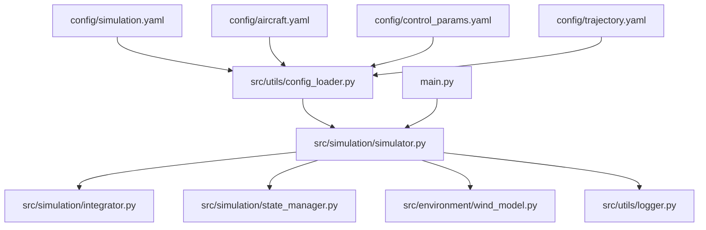
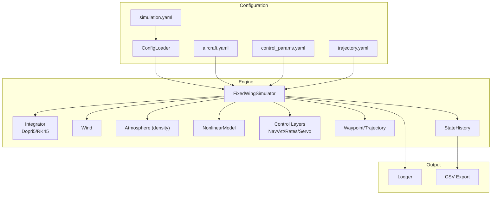
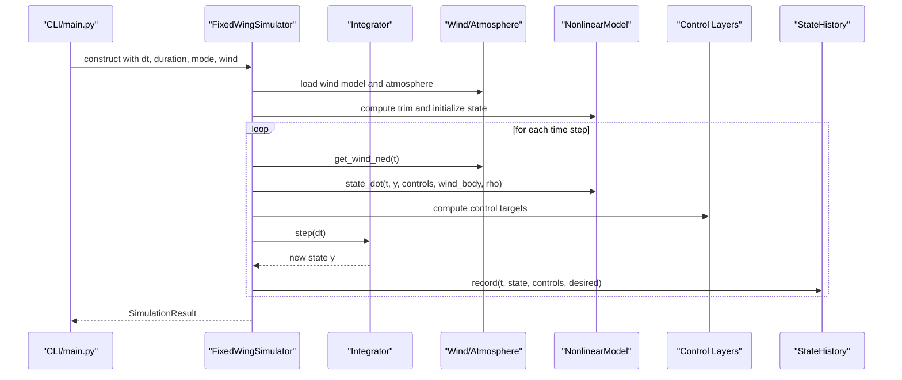
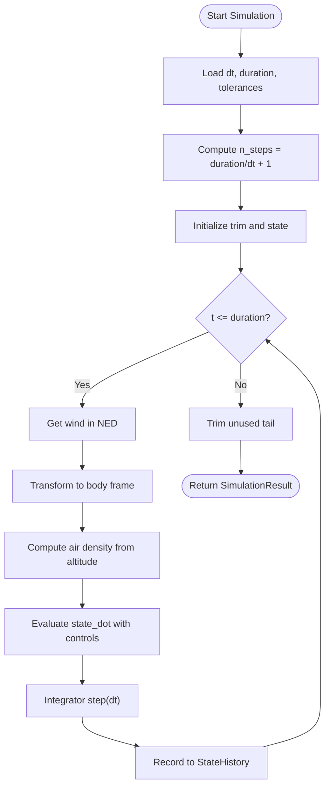
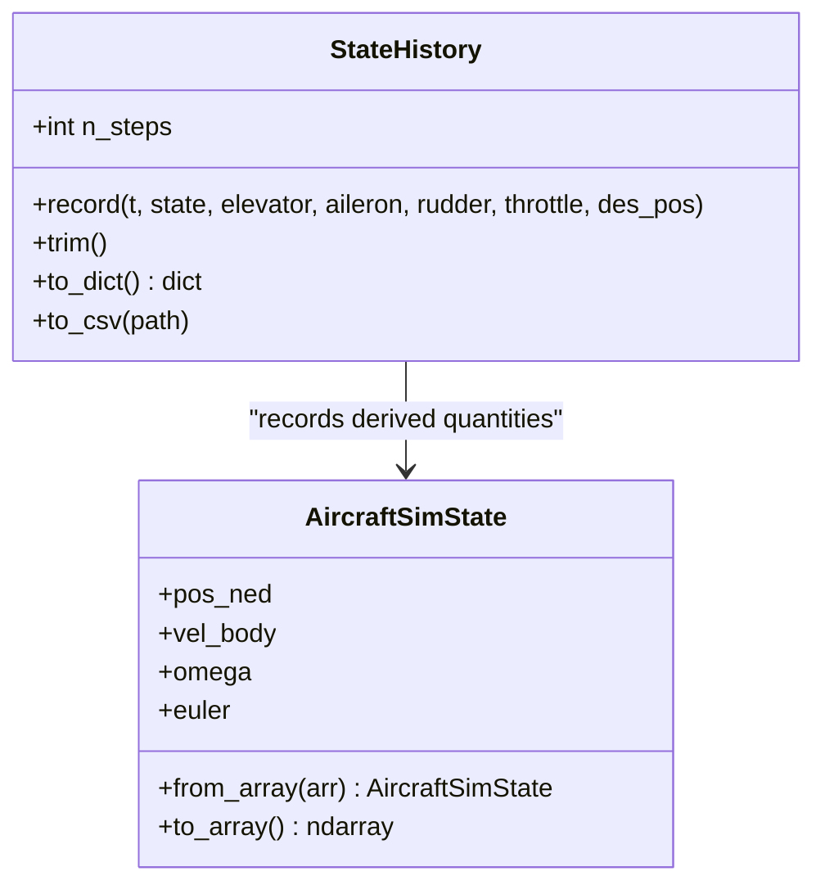
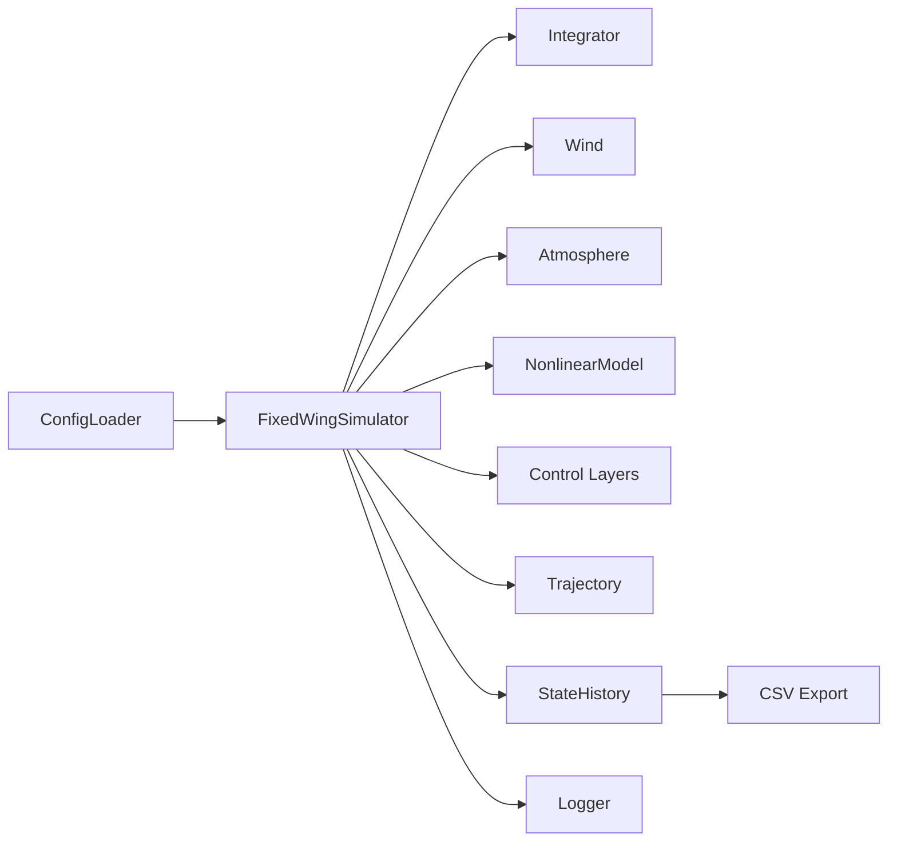

# Simulation Settings Configuration

<cite>
**Referenced Files in This Document**
- [simulation.yaml](file://config/simulation.yaml)
- [aircraft.yaml](file://config/aircraft.yaml)
- [control_params.yaml](file://config/control_params.yaml)
- [trajectory.yaml](file://config/trajectory.yaml)
- [config_loader.py](file://src/utils/config_loader.py)
- [simulator.py](file://src/simulation/simulator.py)
- [integrator.py](file://src/simulation/integrator.py)
- [state_manager.py](file://src/simulation/state_manager.py)
- [wind_model.py](file://src/environment/wind_model.py)
- [logger.py](file://src/utils/logger.py)
- [main.py](file://main.py)
</cite>

## Table of Contents
1. [Introduction](#introduction)
2. [Project Structure](#project-structure)
3. [Core Components](#core-components)
4. [Architecture Overview](#architecture-overview)
5. [Detailed Component Analysis](#detailed-component-analysis)
6. [Dependency Analysis](#dependency-analysis)
7. [Performance Considerations](#performance-considerations)
8. [Troubleshooting Guide](#troubleshooting-guide)
9. [Conclusion](#conclusion)
10. [Appendices](#appendices)

## Introduction
This document provides comprehensive guidance for configuring and operating the FixedWingSimulator simulation engine. It covers time stepping, numerical integration, initial conditions, wind field modeling, logging and output, performance tuning, stability considerations, and practical scenario setups ranging from hover tests to long-duration flights. The goal is to enable reproducible, accurate, and efficient simulations tailored to fixed-wing dynamics and ArduPilot-compatible control.

## Project Structure
The simulation settings are primarily governed by YAML configuration files under config/, loaded via a centralized loader, and consumed by the simulation engine and supporting modules. The main entry point accepts CLI arguments that override defaults for quick experimentation.



**Diagram sources**
- [simulation.yaml](file://config/simulation.yaml#L1-L30)
- [aircraft.yaml](file://config/aircraft.yaml#L1-L13)
- [control_params.yaml](file://config/control_params.yaml#L1-L45)
- [trajectory.yaml](file://config/trajectory.yaml#L1-L23)
- [config_loader.py](file://src/utils/config_loader.py#L59-L82)
- [simulator.py](file://src/simulation/simulator.py#L115-L234)
- [integrator.py](file://src/simulation/integrator.py#L17-L108)
- [state_manager.py](file://src/simulation/state_manager.py#L95-L193)
- [wind_model.py](file://src/environment/wind_model.py#L18-L113)
- [logger.py](file://src/utils/logger.py#L10-L44)
- [main.py](file://main.py#L32-L145)

**Section sources**
- [simulation.yaml](file://config/simulation.yaml#L1-L30)
- [config_loader.py](file://src/utils/config_loader.py#L59-L82)
- [main.py](file://main.py#L32-L145)

## Core Components
- Simulation configuration: time step, total duration, integrator choice, tolerances, initial conditions, initial flight mode, wind configuration, and logging toggles.
- Integrator selection: adaptive Dormand-Prince 4(5) for real-time stepping and batch RK45 for offline analysis.
- State container and history: structured storage of 12-D state, derived quantities, controls, and desired positions; CSV export capability.
- Wind models: none, constant, sine superposition, and random sine (turbulence-like).
- Logging: console and optional file logging with timestamps.

Key configuration keys and defaults are defined centrally and merged from YAML files.

**Section sources**
- [simulation.yaml](file://config/simulation.yaml#L3-L30)
- [config_loader.py](file://src/utils/config_loader.py#L10-L37)
- [integrator.py](file://src/simulation/integrator.py#L17-L108)
- [state_manager.py](file://src/simulation/state_manager.py#L95-L193)
- [wind_model.py](file://src/environment/wind_model.py#L18-L113)
- [logger.py](file://src/utils/logger.py#L10-L44)

## Architecture Overview
The simulation orchestrates aircraft models, nonlinear dynamics, environment (wind/atmosphere), control layers (ArduPilot-compatible), planning/trajactory, and the numerical integrator. The FixedWingSimulator constructs subsystems from configuration and executes closed-loop or open-loop runs.



**Diagram sources**
- [simulation.yaml](file://config/simulation.yaml#L1-L30)
- [aircraft.yaml](file://config/aircraft.yaml#L1-L13)
- [control_params.yaml](file://config/control_params.yaml#L1-L45)
- [trajectory.yaml](file://config/trajectory.yaml#L1-L23)
- [config_loader.py](file://src/utils/config_loader.py#L59-L82)
- [simulator.py](file://src/simulation/simulator.py#L115-L234)
- [integrator.py](file://src/simulation/integrator.py#L17-L108)
- [state_manager.py](file://src/simulation/state_manager.py#L95-L193)
- [wind_model.py](file://src/environment/wind_model.py#L18-L113)
- [logger.py](file://src/utils/logger.py#L10-L44)

## Detailed Component Analysis

### Time Stepping Configuration
- Time step (dt): controls the discrete integration increment; affects accuracy and performance.
- Total simulation time (duration): defines the end time of the run.
- Integration frequency: controlled implicitly by dt in the real-time loop; the integrator advances by dt each iteration.

Implementation highlights:
- The simulator computes the number of steps and allocates a history buffer accordingly.
- The real-time loop advances time by dt and steps the integrator.
- The CLI allows overriding dt and duration.

Practical guidance:
- For stiff nonlinear dynamics, smaller dt improves stability but increases runtime.
- For batch analysis, dt is less relevant; prefer tighter tolerances and RK45 for full histories.

**Section sources**
- [simulation.yaml](file://config/simulation.yaml#L4-L5)
- [simulator.py](file://src/simulation/simulator.py#L272-L273)
- [simulator.py](file://src/simulation/simulator.py#L411-L564)
- [main.py](file://main.py#L50-L61)

### Numerical Integration Methods
Supported integrators:
- Dopri5Integrator: adaptive step-size, single-step API, suitable for real-time stepping.
- RK45Integrator: batch solve_ivp with fixed method "RK45", suitable for offline analysis.

Integration tolerances:
- Relative and absolute tolerances are configurable and passed to the integrator.

Accuracy and cost trade-offs:
- RK45 (solve_ivp) produces dense histories and is deterministic for the same seed; good for post-processing and analysis.
- Dopri5 (adaptive step-size) balances accuracy and cost in real-time loops; step() advances deterministically by dt.

Stability considerations:
- Tighter tolerances improve accuracy but may increase step failures or reduce performance.
- For fixed-wing nonlinear systems, moderate tolerances often suffice; adjust based on observed errors.

**Section sources**
- [integrator.py](file://src/simulation/integrator.py#L17-L108)
- [simulation.yaml](file://config/simulation.yaml#L7-L12)
- [simulator.py](file://src/simulation/simulator.py#L339-L339)

### Initial Conditions Setup
Initial conditions are defined in NED coordinates and frames:
- Position: [x_north, y_east, z_down] in meters.
- Heading: initial yaw (0 degrees aligns with North).
- Altitude: negative z_down indicates height above ground in NED convention.
- Velocity: derived from trim solution; initialized from steady-flight conditions.
- Attitude: initialized near trimmed angle of attack; angular rates start near zero.
- Initial flight mode: selects control behavior at start.

The simulator computes trim and initializes states consistent with trim conditions, ensuring a stable start.

**Section sources**
- [simulation.yaml](file://config/simulation.yaml#L14-L20)
- [simulator.py](file://src/simulation/simulator.py#L301-L324)

### Wind Field Configuration
Wind models:
- NONE: zero wind.
- FIXED: constant wind vector from a specified direction and speed.
- SINE: sinusoidal fluctuation across three axes with multiple harmonics.
- RANDOMSINE: random mean plus sinusoidal fluctuations (turbulence-like).

Parameters:
- wind_type, wind_speed, wind_direction_deg.

Behavior:
- Wind vectors are returned in NED frame at each time step.
- The simulator transforms wind from NED to body frame for dynamics.

Atmospheric conditions:
- Air density is computed from current altitude for each step.

**Section sources**
- [simulation.yaml](file://config/simulation.yaml#L22-L26)
- [wind_model.py](file://src/environment/wind_model.py#L18-L113)
- [simulator.py](file://src/simulation/simulator.py#L331-L337)

### Logging and Output Settings
Logging:
- Toggle enabled/disabled and configure log directory.
- Logger writes to console and optionally to a dated file.

Output containers and CSV:
- StateHistory stores all recorded variables and exports to CSV.
- Keys include time, body velocities, body rates, Euler angles, NED positions, derived quantities, control surface deflections, throttle, and desired positions.

Usage:
- CSV export is available via StateHistory.to_csv.
- SimulationResult provides convenience methods for summaries and visualization.

**Section sources**
- [simulation.yaml](file://config/simulation.yaml#L27-L30)
- [logger.py](file://src/utils/logger.py#L10-L44)
- [state_manager.py](file://src/simulation/state_manager.py#L182-L193)
- [simulator.py](file://src/simulation/simulator.py#L59-L110)

### Control and Trajectory Integration
- Control parameters are loaded from control_params.yaml and validated.
- Flight mode manager sets initial mode and cruise targets.
- Navigation, attitude, rate, and servo mixing layers form the ArduPilot-compatible control chain.
- Trajectory management builds polynomial trajectories or uses simple waypoint sequencing.

These components interact with the integrator and environment to compute control actions and propagate the state.

**Section sources**
- [control_params.yaml](file://config/control_params.yaml#L1-L45)
- [simulator.py](file://src/simulation/simulator.py#L165-L230)
- [trajectory.yaml](file://config/trajectory.yaml#L1-L23)

## Architecture Overview



**Diagram sources**
- [main.py](file://main.py#L98-L145)
- [simulator.py](file://src/simulation/simulator.py#L239-L567)
- [integrator.py](file://src/simulation/integrator.py#L50-L56)
- [wind_model.py](file://src/environment/wind_model.py#L76-L108)
- [state_manager.py](file://src/simulation/state_manager.py#L124-L168)

## Detailed Component Analysis

### Time Stepping and Integration Flow


**Diagram sources**
- [simulator.py](file://src/simulation/simulator.py#L272-L273)
- [simulator.py](file://src/simulation/simulator.py#L411-L564)
- [state_manager.py](file://src/simulation/state_manager.py#L170-L174)

**Section sources**
- [simulator.py](file://src/simulation/simulator.py#L272-L564)
- [state_manager.py](file://src/simulation/state_manager.py#L170-L174)

### Wind Model Implementation
```mermaid
classDiagram
class Wind {
+string wind_type
+float speed
+float direction_deg
+get_wind_ned(t) ndarray
+__repr__() string
}
Wind : "NONE : zeros"
Wind : "FIXED : constant NED vector"
Wind : "SINE : sum of harmonics"
Wind : "RANDOMSINE : mean + harmonics"
```

**Diagram sources**
- [wind_model.py](file://src/environment/wind_model.py#L18-L113)

**Section sources**
- [wind_model.py](file://src/environment/wind_model.py#L76-L108)

### State History and CSV Export


**Diagram sources**
- [state_manager.py](file://src/simulation/state_manager.py#L95-L193)

**Section sources**
- [state_manager.py](file://src/simulation/state_manager.py#L124-L193)

## Dependency Analysis
- Configuration loading merges defaults with user-provided YAML values.
- Simulator depends on integrator, wind model, atmosphere, dynamics, control layers, and trajectory manager.
- Output pipeline depends on StateHistory and logger.



**Diagram sources**
- [config_loader.py](file://src/utils/config_loader.py#L59-L82)
- [simulator.py](file://src/simulation/simulator.py#L115-L234)
- [state_manager.py](file://src/simulation/state_manager.py#L95-L193)
- [logger.py](file://src/utils/logger.py#L10-L44)

**Section sources**
- [config_loader.py](file://src/utils/config_loader.py#L59-L82)
- [simulator.py](file://src/simulation/simulator.py#L115-L234)

## Performance Considerations
- Choose dt based on dynamics stiffness; smaller dt improves stability for nonlinear systems.
- Use Dopri5 for real-time loops; it adapts internally while exposing single-step advancement.
- For batch/post-processing, use RK45 integrator to capture full histories deterministically.
- Tight tolerances improve accuracy but may increase step failures or CPU time.
- Limit unnecessary logging in production runs; disable file logging or reduce verbosity.
- Pre-allocate StateHistory with expected n_steps to avoid dynamic resizing overhead.

[No sources needed since this section provides general guidance]

## Troubleshooting Guide
Common issues and resolutions:
- Integration failure: check dt and tolerances; verify wind/atmosphere inputs; inspect control saturation.
- Unexpected trim mismatch: confirm aircraft parameters and control settings; ensure initial altitude matches planned start.
- CSV export missing data: ensure StateHistory.trim() is called and to_csv() path exists; verify keys are present.
- Wind artifacts: validate wind_type and direction; ensure FIXED wind aligns with intended NED orientation.

Operational tips:
- Use CLI flags to quickly test configurations (aircraft, mode, duration, dt, wind).
- Disable visualization for batch runs to save resources.
- Inspect logs for integration warnings or exceptions.

**Section sources**
- [simulator.py](file://src/simulation/simulator.py#L558-L562)
- [state_manager.py](file://src/simulation/state_manager.py#L170-L174)
- [logger.py](file://src/utils/logger.py#L10-L44)
- [main.py](file://main.py#L81-L84)

## Conclusion
By carefully selecting dt, integrator, initial conditions, and wind models—and by leveraging the provided logging and CSV export—users can configure robust, repeatable fixed-wing simulations. Start with conservative dt and tolerances, validate trim and control parameters, and progressively increase duration and complexity for long-horizon flights.

[No sources needed since this section summarizes without analyzing specific files]

## Appendices

### Configuration Reference
- simulation.yaml
  - dt: simulation time step in seconds
  - duration: total simulation time in seconds
  - integrator: "dopri5" or "rk45" (usage context-dependent)
  - rtol/atol: relative and absolute tolerances for integrator
  - initial_position: [x_north, y_east, z_down] in meters
  - initial_heading_deg: initial yaw in degrees (0=North)
  - initial_mode: flight mode at start
  - wind_type: NONE | FIXED | SINE | RANDOMSINE
  - wind_speed: mean wind speed in m/s
  - wind_direction_deg: wind FROM direction in degrees
  - log_enabled: enable/disable logging
  - log_dir: directory for log files

- aircraft.yaml
  - aircraft_name: select from database
  - overrides: optional parameter overrides

- control_params.yaml
  - control and TECS parameters for ArduPilot-compatible control

- trajectory.yaml
  - type: minimum_snap | minimum_jerk | minimum_accel | minimum_vel | hover
  - average_speed: m/s for segment timing
  - yaw_mode: none | yaw_follow | yaw_waypoint_interp | zero
  - waypoints: list of [north, east, alt]
  - loop: whether to repeat the trajectory

**Section sources**
- [simulation.yaml](file://config/simulation.yaml#L1-L30)
- [aircraft.yaml](file://config/aircraft.yaml#L1-L13)
- [control_params.yaml](file://config/control_params.yaml#L1-L45)
- [trajectory.yaml](file://config/trajectory.yaml#L1-L23)

### Example Scenarios
- Hover test
  - Set short duration and small dt.
  - Use FIXED wind with low speed or NONE.
  - Keep initial altitude near planned start.
  - Export CSV for quick inspection.

- Short-duration flight
  - Increase duration moderately; keep dt small for stability.
  - Add SINE or RANDOMSINE wind to emulate turbulence.
  - Enable CSV export and review altitude/airspeed convergence.

- Long-duration flight
  - Use larger duration; consider moderate dt.
  - Configure wind according to mission profile.
  - Disable visualization for batch runs; rely on CSV logs.

[No sources needed since this section provides general guidance]