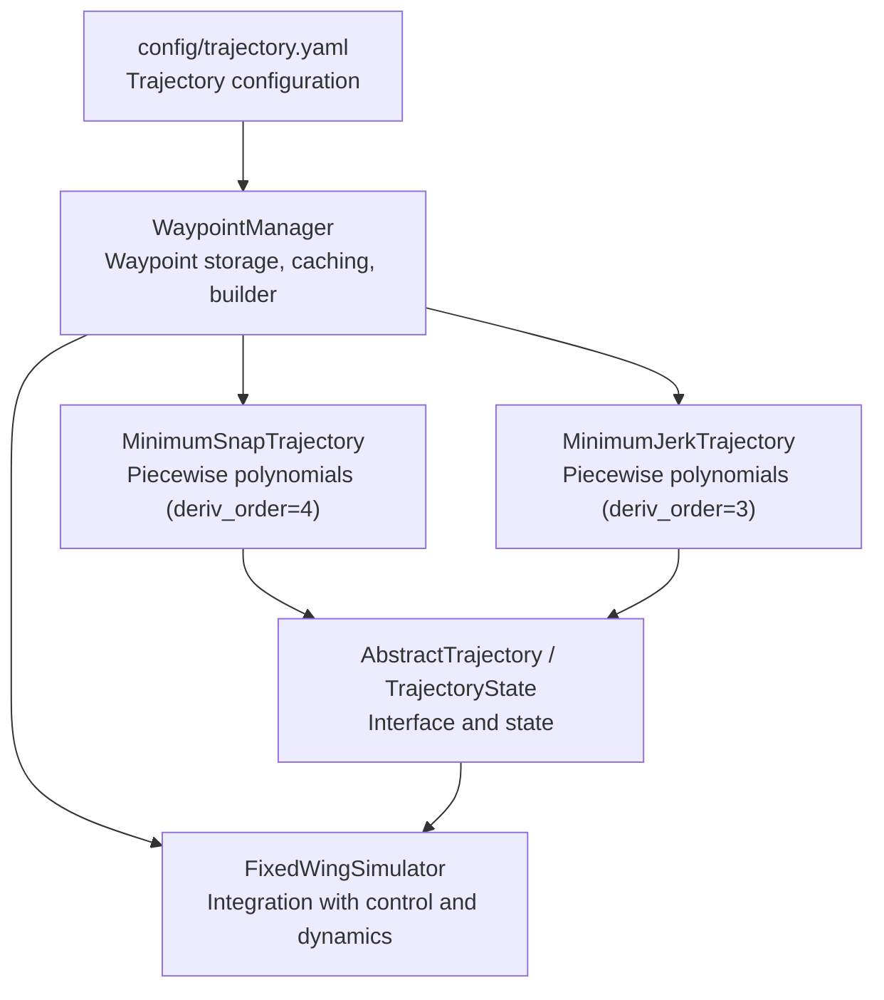
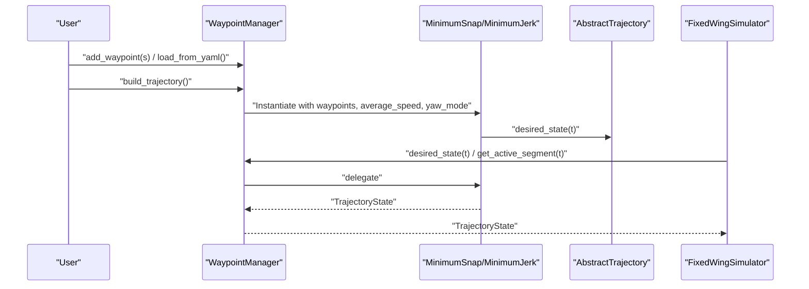
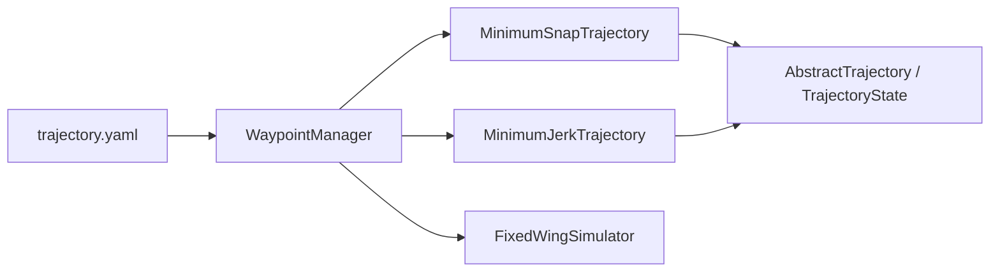

# Trajectory Configuration

<cite>
**Referenced Files in This Document**
- [config/trajectory.yaml](file://config/trajectory.yaml)
- [src/planning/waypoint_manager.py](file://src/planning/waypoint_manager.py)
- [src/planning/minimum_snap.py](file://src/planning/minimum_snap.py)
- [src/planning/minimum_jerk.py](file://src/planning/minimum_jerk.py)
- [src/planning/trajectory_base.py](file://src/planning/trajectory_base.py)
- [src/simulation/simulator.py](file://src/simulation/simulator.py)
- [tests/test_planning.py](file://tests/test_planning.py)
- [doc/zh/content/规划系统/最小急弹率轨迹规划.md](file://doc/zh/content/规划系统/最小急弹率轨迹规划.md)
- [doc/zh/content/规划系统/最小急动率轨迹规划.md](file://doc/zh/content/规划系统/最小急动率轨迹规划.md)
- [doc/zh/content/规划系统/航路点管理器.md](file://doc/zh/content/规划系统/航路点管理器.md)
</cite>

## Table of Contents
1. [Introduction](#introduction)
2. [Project Structure](#project-structure)
3. [Core Components](#core-components)
4. [Architecture Overview](#architecture-overview)
5. [Detailed Component Analysis](#detailed-component-analysis)
6. [Dependency Analysis](#dependency-analysis)
7. [Performance Considerations](#performance-considerations)
8. [Troubleshooting Guide](#troubleshooting-guide)
9. [Conclusion](#conclusion)
10. [Appendices](#appendices)

## Introduction
This document provides comprehensive guidance for configuring and operating trajectories in the fixed-wing simulation environment. It covers:
- Waypoint definition and coordinate conventions
- Trajectory planning parameters (minimum snap, minimum jerk, polynomial degrees, continuity)
- Mission setup and sequencing (including loops)
- Trajectory parameter optimization (time allocation, velocity profiles, yaw modes)
- Evaluation metrics and practical validation procedures
- Examples for simple and complex missions

## Project Structure
The trajectory configuration and execution pipeline spans configuration files, planning modules, and the simulation engine:
- Configuration: trajectory.yaml defines trajectory type, average speed, yaw mode, waypoints, and loop flag
- Planning: WaypointManager orchestrates waypoints and builds trajectory objects
- Trajectory implementations: MinimumSnapTrajectory and MinimumJerkTrajectory
- Simulation: FixedWingSimulator integrates planning with control and dynamics

**Diagram sources**
- [config/trajectory.yaml](file://config/trajectory.yaml#L1-L23)
- [src/planning/waypoint_manager.py](file://src/planning/waypoint_manager.py#L20-L160)
- [src/planning/minimum_snap.py](file://src/planning/minimum_snap.py#L167-L253)
- [src/planning/minimum_jerk.py](file://src/planning/minimum_jerk.py#L17-L71)
- [src/planning/trajectory_base.py](file://src/planning/trajectory_base.py#L16-L47)
- [src/simulation/simulator.py](file://src/simulation/simulator.py#L218-L230)

**Section sources**
- [config/trajectory.yaml](file://config/trajectory.yaml#L1-L23)
- [src/planning/waypoint_manager.py](file://src/planning/waypoint_manager.py#L20-L160)
- [src/planning/minimum_snap.py](file://src/planning/minimum_snap.py#L167-L253)
- [src/planning/minimum_jerk.py](file://src/planning/minimum_jerk.py#L17-L71)
- [src/planning/trajectory_base.py](file://src/planning/trajectory_base.py#L16-L47)
- [src/simulation/simulator.py](file://src/simulation/simulator.py#L218-L230)

## Core Components
- Trajectory configuration file: Defines trajectory type, average speed, yaw mode, waypoints, and loop flag
- WaypointManager: Stores waypoints in NED coordinates, converts altitudes from “positive-up” to NED “down”, selects trajectory type, caches trajectory, and exposes desired state queries
- Trajectory implementations:
  - MinimumSnapTrajectory: Uses 7th-order polynomials per segment (2×deriv_order − 1 with deriv_order=4) and supports stop-at-waypoints and yaw modes
  - MinimumJerkTrajectory: Reuses the solver with deriv_order=3 to produce 5th-order polynomials per segment
- Trajectory base: Defines the uniform interface desired_state(t) and the TrajectoryState structure

**Section sources**
- [config/trajectory.yaml](file://config/trajectory.yaml#L3-L22)
- [src/planning/waypoint_manager.py](file://src/planning/waypoint_manager.py#L20-L160)
- [src/planning/minimum_snap.py](file://src/planning/minimum_snap.py#L167-L253)
- [src/planning/minimum_jerk.py](file://src/planning/minimum_jerk.py#L17-L71)
- [src/planning/trajectory_base.py](file://src/planning/trajectory_base.py#L16-L47)

## Architecture Overview
The system builds a trajectory from waypoints and serves desired states to the simulation and control layers.

**Diagram sources**
- [src/planning/waypoint_manager.py](file://src/planning/waypoint_manager.py#L127-L160)
- [src/planning/minimum_snap.py](file://src/planning/minimum_snap.py#L181-L250)
- [src/planning/minimum_jerk.py](file://src/planning/minimum_jerk.py#L50-L67)
- [src/simulation/simulator.py](file://src/simulation/simulator.py#L478-L498)

## Detailed Component Analysis

### Waypoint Definition and Coordinate Conventions
- Coordinate system: NED (North, East, Down). Waypoints are stored as [north_m, east_m, down_m]
- Altitude convention: The configuration file documents alt_m as positive-up; internally, WaypointManager stores alt_m as negative “down” values
- Waypoint list: Provided as a YAML array under the waypoints key

Practical notes:
- When specifying altitudes, remember the conversion to NED “down”
- For missions requiring level flight at constant altitude, set the down component accordingly

**Section sources**
- [config/trajectory.yaml](file://config/trajectory.yaml#L12-L18)
- [src/planning/waypoint_manager.py](file://src/planning/waypoint_manager.py#L54-L62)
- [src/planning/waypoint_manager.py](file://src/planning/waypoint_manager.py#L104-L106)

### Trajectory Types and Parameters
Available trajectory types:
- minimum_snap: Uses 7th-order polynomials per segment (deriv_order=4)
- minimum_jerk: Uses 5th-order polynomials per segment (deriv_order=3)

Key parameters:
- average_speed: Used to estimate segment times when T_segments is not provided
- yaw_mode: Controls yaw behavior (“yaw_follow”, “zero”, “fixed”)
- stop_at_waypoints: Optional zero-velocity constraint at intermediate waypoints

Time allocation:
- If T_segments is not provided, segment durations are estimated from waypoint distances and average_speed, with a minimum threshold to avoid numerical issues

**Section sources**
- [config/trajectory.yaml](file://config/trajectory.yaml#L3-L10)
- [src/planning/minimum_snap.py](file://src/planning/minimum_snap.py#L181-L205)
- [src/planning/minimum_jerk.py](file://src/planning/minimum_jerk.py#L38-L43)
- [src/planning/waypoint_manager.py](file://src/planning/waypoint_manager.py#L147-L151)

### Waypoint Management and Mission Setup
- Adding waypoints:
  - add_waypoint(north, east, alt_m): Adds a single waypoint; alt_m is converted to NED “down”
  - add_waypoints_ned(array): Adds multiple waypoints already in NED format
  - clear_waypoints(): Resets the waypoint list
- Loading and saving:
  - load_from_yaml(path): Reads configuration and waypoints from YAML
  - save_to_yaml(path): Writes current configuration and waypoints to YAML
- Looping:
  - loop flag enables trajectory closure; if true and the first and last waypoints are not equal, the manager appends the first waypoint to close the loop

Mission sequencing:
- WaypointManager exposes get_active_segment(t) to retrieve the current segment’s start/end waypoints and remaining time at any simulation time t
- desired_state(t) delegates to the underlying trajectory to compute position, velocity, acceleration, and yaw

**Section sources**
- [src/planning/waypoint_manager.py](file://src/planning/waypoint_manager.py#L54-L78)
- [src/planning/waypoint_manager.py](file://src/planning/waypoint_manager.py#L80-L122)
- [src/planning/waypoint_manager.py](file://src/planning/waypoint_manager.py#L144-L145)
- [src/planning/waypoint_manager.py](file://src/planning/waypoint_manager.py#L178-L201)
- [src/planning/waypoint_manager.py](file://src/planning/waypoint_manager.py#L205-L208)

### Trajectory Generation and Continuity
- MinimumSnapTrajectory:
  - Constructs per-segment polynomials with degree 2×deriv_order − 1 (degree 7 for deriv_order=4)
  - Enforces boundary conditions at segment ends and continuity of up to 2×deriv_order − 1 derivatives at internal waypoints
  - Supports stop_at_waypoints to enforce zero velocity at intermediate waypoints
  - Optional yaw trajectory via separate yaw_coeffs when yaw_mode is not “yaw_follow”
- MinimumJerkTrajectory:
  - Reuses the same solver with deriv_order=3 (degree 5)
  - Inherits the same time allocation and yaw behavior

Evaluation:
- desired_state(t) computes position, velocity, acceleration, and yaw for the given time
- Yaw alignment with velocity is supported when velocity magnitude exceeds a small threshold

**Section sources**
- [src/planning/minimum_snap.py](file://src/planning/minimum_snap.py#L47-L142)
- [src/planning/minimum_snap.py](file://src/planning/minimum_snap.py#L181-L250)
- [src/planning/minimum_jerk.py](file://src/planning/minimum_jerk.py#L24-L67)

### Simulation Integration and Mission Execution
- FixedWingSimulator constructs a WaypointManager with average_speed from control parameters and a chosen traj_type
- During run():
  - If use_trajectory=True (default), the simulator ensures the trajectory matches the actual initial altitude by adjusting the first waypoint if needed, then queries desired_state(t) for control targets
  - If use_trajectory=False, the simulator uses a simple waypoint-sequencing mode without polynomial trajectories
- The simulator clamps desired altitude to the bounds of the active segment to maintain feasibility

**Section sources**
- [src/simulation/simulator.py](file://src/simulation/simulator.py#L218-L230)
- [src/simulation/simulator.py](file://src/simulation/simulator.py#L376-L408)
- [src/simulation/simulator.py](file://src/simulation/simulator.py#L478-L498)

### Practical Examples and Mission Patterns
Note: The repository does not include dedicated “circle, racetrack, survey” mission generators. The following are recommended approaches based on the available components:

- Circle pattern:
  - Define waypoints forming a closed polygon (e.g., square) and enable loop to form a continuous path
  - Adjust average_speed to control segment times and overall mission duration
- Racetrack pattern:
  - Use two parallel legs with appropriate spacing; optionally enable loop to repeat the figure-eight or oval shape
- Survey pattern:
  - Plan waypoints along a grid or serpentine path; ensure adequate segment spacing and speed to meet coverage requirements

Validation tips:
- Verify continuity at waypoints using unit tests as references
- Confirm yaw alignment and smoothness by inspecting desired_state outputs
- Use the simulator’s closed-loop mode to evaluate control tracking performance

[No sources needed since this section provides general guidance]

## Dependency Analysis
The planning subsystem composes a clean hierarchy with low coupling to external modules.

**Diagram sources**
- [src/planning/trajectory_base.py](file://src/planning/trajectory_base.py#L16-L47)
- [src/planning/minimum_snap.py](file://src/planning/minimum_snap.py#L167-L253)
- [src/planning/minimum_jerk.py](file://src/planning/minimum_jerk.py#L17-L71)
- [src/planning/waypoint_manager.py](file://src/planning/waypoint_manager.py#L15-L17)
- [config/trajectory.yaml](file://config/trajectory.yaml#L1-L23)
- [src/simulation/simulator.py](file://src/simulation/simulator.py#L218-L230)

**Section sources**
- [src/planning/trajectory_base.py](file://src/planning/trajectory_base.py#L16-L47)
- [src/planning/minimum_snap.py](file://src/planning/minimum_snap.py#L167-L253)
- [src/planning/minimum_jerk.py](file://src/planning/minimum_jerk.py#L17-L71)
- [src/planning/waypoint_manager.py](file://src/planning/waypoint_manager.py#L15-L17)
- [config/trajectory.yaml](file://config/trajectory.yaml#L1-L23)
- [src/simulation/simulator.py](file://src/simulation/simulator.py#L218-L230)

## Performance Considerations
- Computational complexity:
  - Solving for polynomial coefficients scales with the number of segments and the order of the polynomial (higher deriv_order yields larger matrices)
- Numerical stability:
  - Large segment durations can lead to ill-conditioned systems; the solver falls back to least-squares and prints warnings
- Query performance:
  - desired_state queries use cumulative time arrays for logarithmic segment lookup
- Memory footprint:
  - Coefficients and cumulative time arrays scale linearly with the number of segments

**Section sources**
- [src/planning/minimum_snap.py](file://src/planning/minimum_snap.py#L132-L138)
- [src/planning/minimum_snap.py](file://src/planning/minimum_snap.py#L200-L205)
- [src/planning/waypoint_manager.py](file://src/planning/waypoint_manager.py#L192-L201)

## Troubleshooting Guide
Common issues and resolutions:
- Fewer than two waypoints:
  - Building a trajectory requires at least two waypoints; ensure the list is populated before calling build_trajectory
- Non-finite coefficients:
  - Indicates numerical instability; reduce segment durations or adjust waypoint distribution
- Unexpected yaw behavior at low speeds:
  - yaw_follow mode relies on velocity magnitude; increase average_speed or switch to a fixed yaw mode
- Loop not closing:
  - Enable loop and ensure first and last waypoints are approximately equal; the manager will append the first waypoint if needed

Validation references:
- Unit tests verify boundary satisfaction, continuity, finite coefficients, and clamping behavior

**Section sources**
- [src/planning/waypoint_manager.py](file://src/planning/waypoint_manager.py#L139-L145)
- [src/planning/minimum_snap.py](file://src/planning/minimum_snap.py#L132-L138)
- [tests/test_planning.py](file://tests/test_planning.py#L104-L116)
- [tests/test_planning.py](file://tests/test_planning.py#L289-L294)

## Conclusion
The trajectory configuration system offers flexible, mathematically grounded planning for fixed-wing missions. By combining NED waypoint definitions, configurable trajectory types, and robust time allocation, users can design simple point-to-point flights or complex loops. Proper tuning of average_speed, yaw modes, and optional stop constraints ensures smooth, feasible trajectories suitable for closed-loop simulation and control validation.

## Appendices

### Appendix A: Waypoint Format and Constraints
- Format: waypoints are lists of [north_m, east_m, alt_m] in the configuration file; internally stored as NED [north, east, down]
- Altitude: alt_m is positive-up; internally converted to negative “down”
- Constraints:
  - At least two waypoints required to build a trajectory
  - Optional loop closes automatically if enabled and first/last waypoints differ slightly

**Section sources**
- [config/trajectory.yaml](file://config/trajectory.yaml#L12-L18)
- [src/planning/waypoint_manager.py](file://src/planning/waypoint_manager.py#L54-L62)
- [src/planning/waypoint_manager.py](file://src/planning/waypoint_manager.py#L139-L145)

### Appendix B: Trajectory Parameter Optimization
- Time allocation:
  - Use average_speed to estimate segment durations; adjust to balance mission duration and smoothness
  - For tight turns or complex maneuvers, consider reducing average_speed to allow longer segments
- Velocity profile:
  - Higher average_speed reduces segment times; ensure the aircraft can track the resulting accelerations
- Path smoothness:
  - Prefer minimum_snap for smoother acceleration changes; minimum_jerk reduces computational cost with slightly less smooth acceleration
- Yaw control:
  - Use “yaw_follow” for natural tracking; “fixed” requires explicit yaw waypoints; “zero” disables yaw control

**Section sources**
- [config/trajectory.yaml](file://config/trajectory.yaml#L6-L10)
- [src/planning/minimum_snap.py](file://src/planning/minimum_snap.py#L181-L205)
- [src/planning/minimum_jerk.py](file://src/planning/minimum_jerk.py#L38-L43)

### Appendix C: Mission Validation Procedures
- Geometry checks:
  - Verify that desired_state outputs pass through start/end waypoints and intermediate waypoints when applicable
  - Confirm continuity of position, velocity, and acceleration across segments
- Stability checks:
  - Ensure all coefficients remain finite and reasonable
  - Avoid extremely long segments that could cause numerical issues
- Simulation checks:
  - Run closed-loop simulations to validate control tracking and trim consistency
  - Compare desired vs. achieved states and adjust average_speed or yaw_mode as needed

**Section sources**
- [tests/test_planning.py](file://tests/test_planning.py#L73-L116)
- [tests/test_planning.py](file://tests/test_planning.py#L122-L172)
- [tests/test_planning.py](file://tests/test_planning.py#L173-L186)