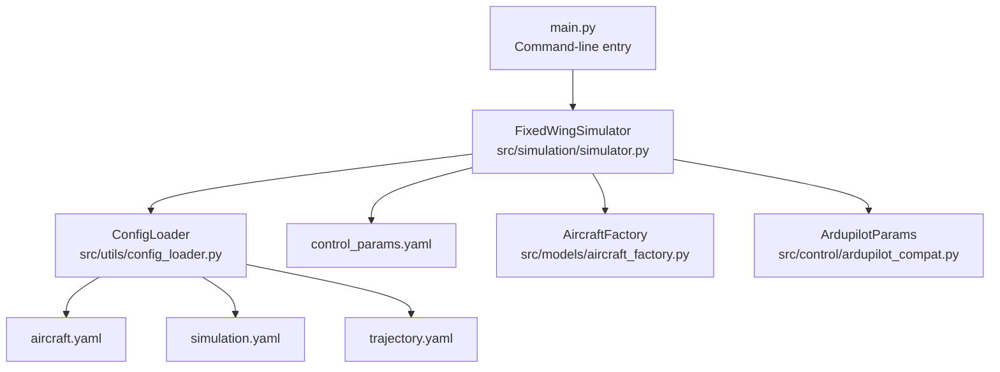
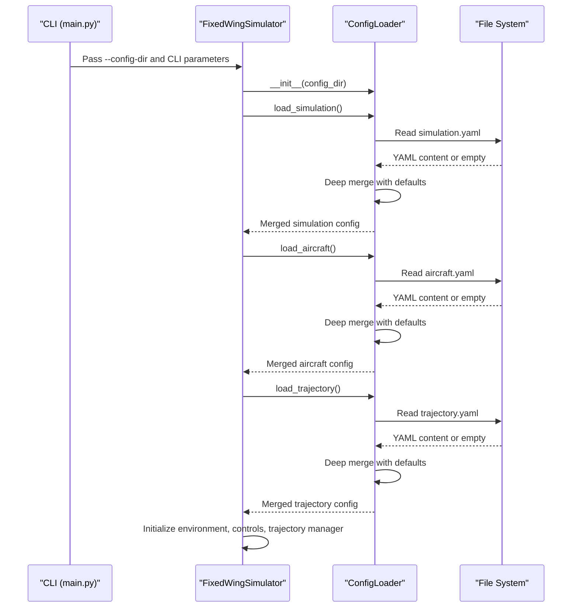
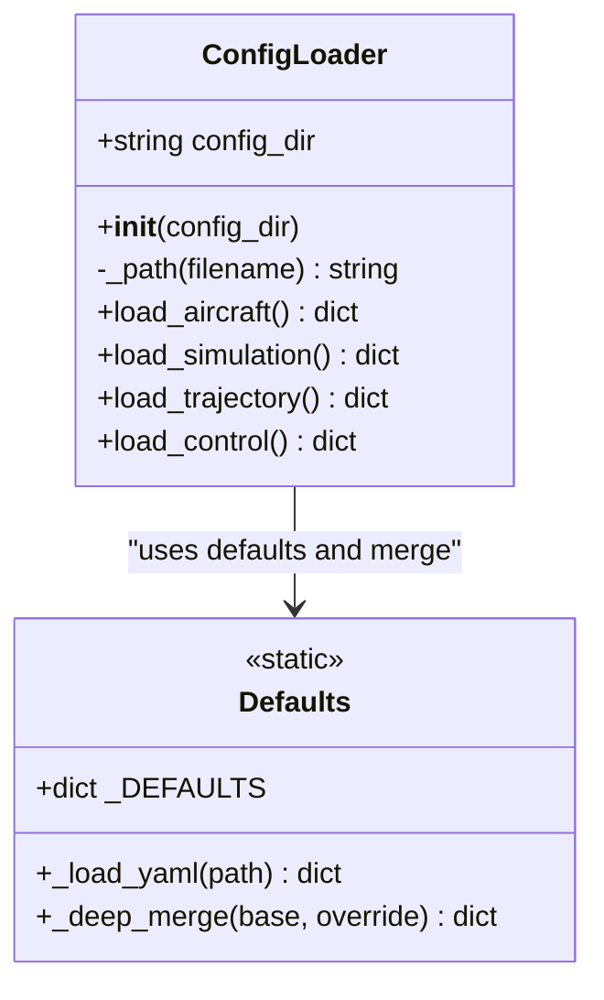
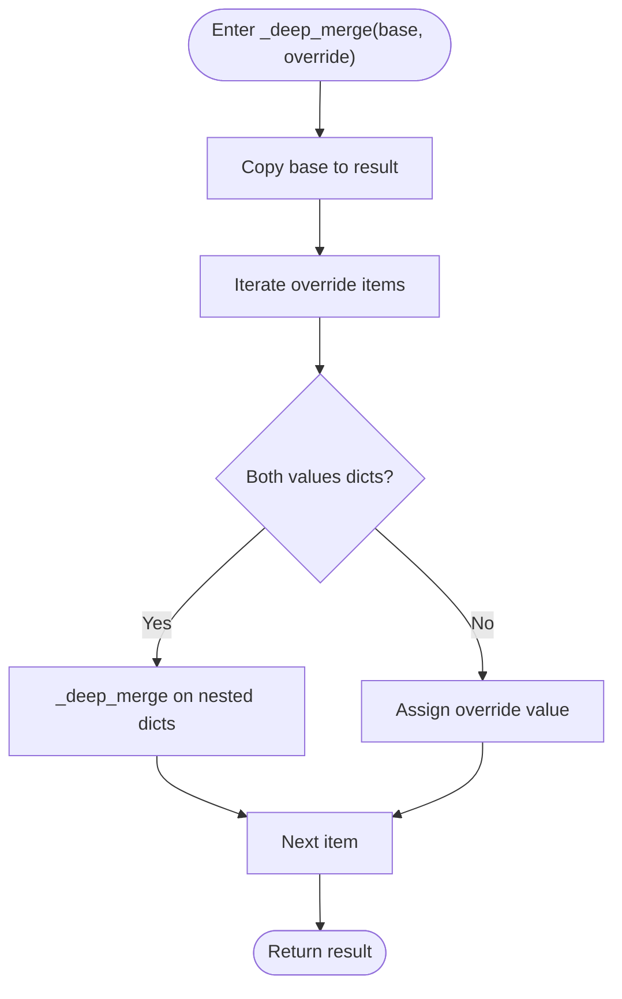
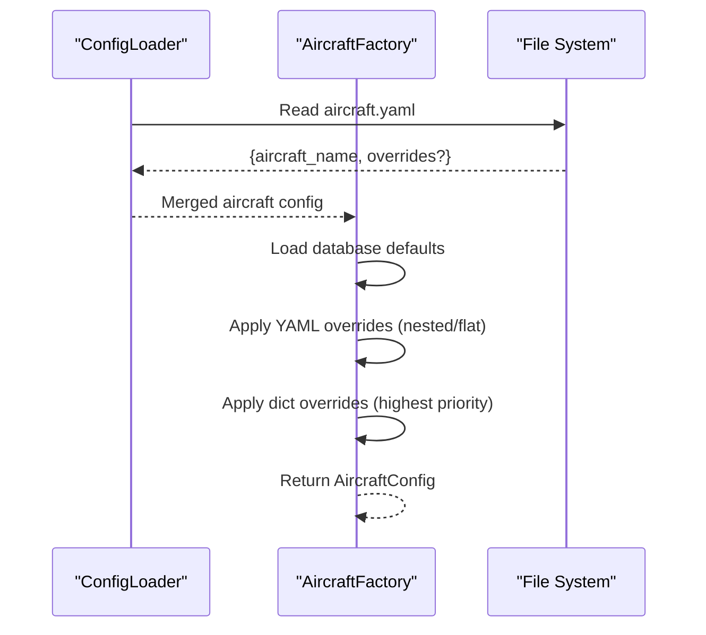
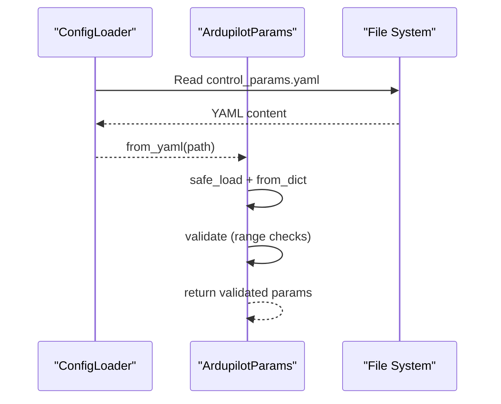
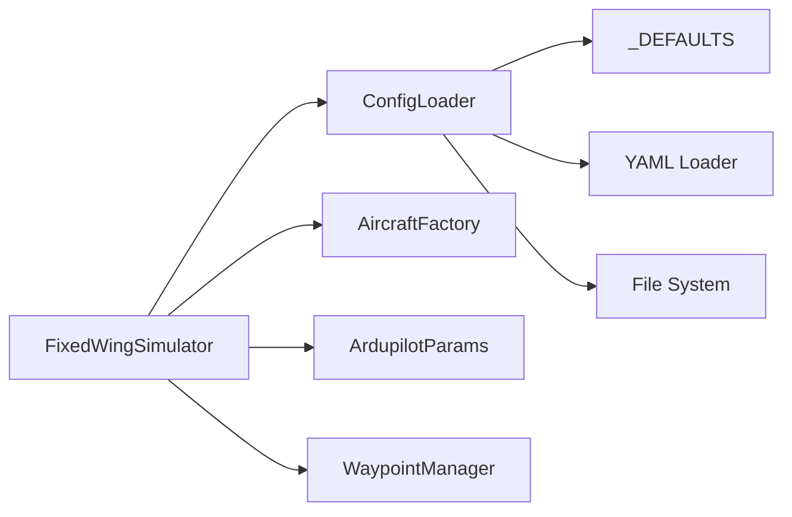

# Configuration Loading System

<cite>
**Referenced Files in This Document**
- [src/utils/config_loader.py](file://src/utils/config_loader.py)
- [config/aircraft.yaml](file://config/aircraft.yaml)
- [config/simulation.yaml](file://config/simulation.yaml)
- [config/trajectory.yaml](file://config/trajectory.yaml)
- [config/control_params.yaml](file://config/control_params.yaml)
- [src/simulation/simulator.py](file://src/simulation/simulator.py)
- [src/models/aircraft_factory.py](file://src/models/aircraft_factory.py)
- [src/control/ardupilot_compat.py](file://src/control/ardupilot_compat.py)
- [tests/test_integration.py](file://tests/test_integration.py)
- [main.py](file://main.py)
</cite>

## Table of Contents
1. [Introduction](#introduction)
2. [Project Structure](#project-structure)
3. [Core Components](#core-components)
4. [Architecture Overview](#architecture-overview)
5. [Detailed Component Analysis](#detailed-component-analysis)
6. [Dependency Analysis](#dependency-analysis)
7. [Performance Considerations](#performance-considerations)
8. [Troubleshooting Guide](#troubleshooting-guide)
9. [Conclusion](#conclusion)
10. [Appendices](#appendices)

## Introduction
This document explains the configuration loading system used by the FixedWingSimulator. It focuses on the ConfigLoader class architecture, YAML parsing mechanisms, and deep merge functionality. It documents default configuration values, file loading order, parameter precedence rules, and practical examples for editing configuration files and overriding parameters. It also details how aircraft, simulation, control, and trajectory configurations are loaded, describes configuration inheritance patterns, error handling, and best practices for maintaining configuration consistency across different simulation scenarios.

## Project Structure
The configuration system centers around:
- A dedicated loader module that reads and merges YAML files into unified dictionaries.
- Four primary configuration files under the config directory:
  - aircraft.yaml
  - simulation.yaml
  - trajectory.yaml
  - control_params.yaml
- The simulator orchestrates loading and applies parameter precedence rules, while the aircraft factory and ArduPilot compatibility layer handle aircraft and control parameter specifics.

**Diagram sources**
- [main.py](file://main.py#L98-L145)
- [src/simulation/simulator.py](file://src/simulation/simulator.py#L130-L230)
- [src/utils/config_loader.py](file://src/utils/config_loader.py#L59-L81)
- [config/aircraft.yaml](file://config/aircraft.yaml#L1-L13)
- [config/simulation.yaml](file://config/simulation.yaml#L1-L30)
- [config/trajectory.yaml](file://config/trajectory.yaml#L1-L23)
- [config/control_params.yaml](file://config/control_params.yaml#L1-L45)
- [src/models/aircraft_factory.py](file://src/models/aircraft_factory.py#L51-L88)
- [src/control/ardupilot_compat.py](file://src/control/ardupilot_compat.py#L74-L129)

**Section sources**
- [src/utils/config_loader.py](file://src/utils/config_loader.py#L1-L82)
- [config/aircraft.yaml](file://config/aircraft.yaml#L1-L13)
- [config/simulation.yaml](file://config/simulation.yaml#L1-L30)
- [config/trajectory.yaml](file://config/trajectory.yaml#L1-L23)
- [config/control_params.yaml](file://config/control_params.yaml#L1-L45)
- [src/simulation/simulator.py](file://src/simulation/simulator.py#L130-L230)
- [main.py](file://main.py#L98-L145)

## Core Components
- ConfigLoader: Loads and merges YAML configuration files per subsystem. Provides methods to load aircraft, simulation, trajectory, and control parameters.
- Default configuration dictionary: Centralized defaults for aircraft, simulation, and trajectory parameters.
- Deep merge function: Recursively merges user-provided overrides into defaults.
- YAML loader: Safely loads YAML content, returning empty dictionaries when files are missing.

Key responsibilities:
- Aircraft: Merges aircraft.yaml with defaults and passes the result to the aircraft factory.
- Simulation: Merges simulation.yaml with defaults and supplies runtime parameters to the simulator.
- Trajectory: Merges trajectory.yaml with defaults; the simulator intentionally does not auto-load it to avoid polluting user missions.
- Control: Reads control_params.yaml directly without default merging; validation is performed separately.

**Section sources**
- [src/utils/config_loader.py](file://src/utils/config_loader.py#L10-L81)

## Architecture Overview
The configuration loading pipeline follows a predictable order and precedence:
- Command-line arguments drive initial parameters.
- ConfigLoader loads and merges YAML files with defaults.
- The simulator applies parameter precedence and initializes subsystems accordingly.

**Diagram sources**
- [main.py](file://main.py#L98-L145)
- [src/simulation/simulator.py](file://src/simulation/simulator.py#L130-L230)
- [src/utils/config_loader.py](file://src/utils/config_loader.py#L59-L81)

## Detailed Component Analysis

### ConfigLoader Class
Responsibilities:
- Encapsulates loading and merging per subsystem.
- Uses a private path builder to resolve files under the configured directory.
- Applies deep merge for aircraft, simulation, and trajectory configurations.
- Returns raw YAML content for control parameters without merging.

Design highlights:
- Single responsibility per method simplifies extension.
- Safe file loading prevents crashes on missing files.
- Deep merge ensures nested dictionaries are merged recursively.

**Diagram sources**
- [src/utils/config_loader.py](file://src/utils/config_loader.py#L59-L81)

**Section sources**
- [src/utils/config_loader.py](file://src/utils/config_loader.py#L59-L81)

### Default Configuration Values
Defaults are defined centrally and applied via deep merge:
- Aircraft defaults include aircraft name and an overrides dictionary.
- Simulation defaults include time step, duration, numerical integrator, tolerances, initial conditions, wind configuration, and logging settings.
- Trajectory defaults include type, average speed, yaw mode, waypoints, and loop flag.

These defaults ensure that partial YAML files are sufficient to run simulations.

**Section sources**
- [src/utils/config_loader.py](file://src/utils/config_loader.py#L10-L37)

### YAML Parsing Mechanisms
- Safe YAML loading is used to prevent arbitrary code execution.
- Missing files return empty dictionaries, ensuring graceful fallback to defaults.
- Control parameters are parsed as a flat key-value map and validated independently.

Practical implications:
- Indentation and spacing must be correct in YAML files.
- Unknown keys in control parameters are ignored during parsing.

**Section sources**
- [src/utils/config_loader.py](file://src/utils/config_loader.py#L40-L45)
- [src/control/ardupilot_compat.py](file://src/control/ardupilot_compat.py#L74-L88)

### Deep Merge Functionality
Behavior:
- Recursively merges nested dictionaries.
- Non-dictionary keys overwrite existing values.
- Operates on a copy of the base dictionary to avoid mutating defaults.

Typical usage:
- Simulation and aircraft YAMLs can partially override defaults.
- Trajectory YAMLs can refine defaults without affecting other subsystems.

**Diagram sources**
- [src/utils/config_loader.py](file://src/utils/config_loader.py#L48-L56)

**Section sources**
- [src/utils/config_loader.py](file://src/utils/config_loader.py#L48-L56)

### Parameter Precedence and File Loading Order
Precedence chain (highest to lowest):
1. CLI-provided parameters passed to the simulator constructor.
2. ConfigLoader.load_aircraft() merges aircraft.yaml with defaults.
3. ConfigLoader.load_simulation() merges simulation.yaml with defaults.
4. ConfigLoader.load_trajectory() merges trajectory.yaml with defaults.
5. Control parameters are loaded from control_params.yaml and validated independently.
6. Aircraft parameter overrides from the aircraft factory’s YAML and dict overrides.

Explicitly, the simulator resolves wind parameters with the following precedence:
- If a CLI wind type is provided, it takes precedence.
- Otherwise, simulation configuration’s wind settings are used.
- Other simulation parameters follow the same “YAML overrides defaults” pattern.

**Section sources**
- [src/simulation/simulator.py](file://src/simulation/simulator.py#L153-L163)
- [src/utils/config_loader.py](file://src/utils/config_loader.py#L68-L81)
- [main.py](file://main.py#L32-L95)

### Aircraft Configuration Loading and Inheritance
- ConfigLoader.load_aircraft() returns a merged dictionary containing aircraft_name and overrides.
- The aircraft factory applies database defaults, then YAML overrides (supporting both nested and flat overrides), and finally code-supplied overrides (highest priority).
- This creates a robust inheritance chain: database defaults → YAML overrides → programmatic overrides.

**Diagram sources**
- [src/utils/config_loader.py](file://src/utils/config_loader.py#L68-L70)
- [src/models/aircraft_factory.py](file://src/models/aircraft_factory.py#L51-L88)

**Section sources**
- [src/utils/config_loader.py](file://src/utils/config_loader.py#L68-L70)
- [src/models/aircraft_factory.py](file://src/models/aircraft_factory.py#L51-L88)

### Simulation Configuration Loading
- ConfigLoader.load_simulation() merges simulation.yaml with defaults.
- The simulator uses the merged configuration to initialize environment and runtime parameters.
- CLI wind type can override the simulation-configured wind settings.

**Section sources**
- [src/utils/config_loader.py](file://src/utils/config_loader.py#L75-L77)
- [src/simulation/simulator.py](file://src/simulation/simulator.py#L153-L163)

### Trajectory Configuration Loading
- ConfigLoader.load_trajectory() merges trajectory.yaml with defaults.
- The simulator intentionally does not auto-load trajectory configuration to avoid default waypoints interfering with user missions.
- Users must explicitly load trajectory YAML or add waypoints programmatically.

**Section sources**
- [src/utils/config_loader.py](file://src/utils/config_loader.py#L79-L81)
- [src/simulation/simulator.py](file://src/simulation/simulator.py#L218-L230)

### Control Configuration Loading and Validation
- ConfigLoader.load_control() returns raw control parameters from control_params.yaml.
- ArdupilotParams.from_yaml parses the flat key-value structure and maps to a dataclass.
- ArdupilotParams.validate performs range checks and prints warnings for out-of-range values.

**Diagram sources**
- [src/utils/config_loader.py](file://src/utils/config_loader.py#L72-L73)
- [src/control/ardupilot_compat.py](file://src/control/ardupilot_compat.py#L74-L129)

**Section sources**
- [src/utils/config_loader.py](file://src/utils/config_loader.py#L72-L73)
- [src/control/ardupilot_compat.py](file://src/control/ardupilot_compat.py#L74-L129)

## Dependency Analysis
- ConfigLoader depends on:
  - File system for reading YAML files
  - YAML library for safe loading
  - Default configuration dictionary
  - Deep merge function
- FixedWingSimulator depends on:
  - ConfigLoader for subsystem configs
  - AircraftFactory for aircraft parameter merging
  - ArdupilotParams for control parameter loading and validation
  - WaypointManager for trajectory management

**Diagram sources**
- [src/utils/config_loader.py](file://src/utils/config_loader.py#L59-L81)
- [src/simulation/simulator.py](file://src/simulation/simulator.py#L130-L230)
- [src/models/aircraft_factory.py](file://src/models/aircraft_factory.py#L51-L88)
- [src/control/ardupilot_compat.py](file://src/control/ardupilot_compat.py#L74-L129)

**Section sources**
- [src/utils/config_loader.py](file://src/utils/config_loader.py#L59-L81)
- [src/simulation/simulator.py](file://src/simulation/simulator.py#L130-L230)
- [src/models/aircraft_factory.py](file://src/models/aircraft_factory.py#L51-L88)
- [src/control/ardupilot_compat.py](file://src/control/ardupilot_compat.py#L74-L129)

## Performance Considerations
- YAML parsing and deep merge are lightweight operations and typically negligible compared to simulation runtime.
- Best practices:
  - Keep frequently accessed configuration files on local disks to minimize IO latency.
  - Maintain control parameters in flat key-value form for efficient mapping.
  - Avoid reloading configuration unnecessarily; reuse parsed objects within a process.

[No sources needed since this section provides general guidance]

## Troubleshooting Guide
Common issues and resolutions:
- Configuration file not found
  - Symptom: Empty dictionary returned, defaults used.
  - Action: Verify config_dir path and file existence.
- YAML syntax errors
  - Symptom: Parser exceptions or unexpected None values.
  - Action: Validate YAML indentation and spacing; ensure colons are followed by spaces.
- Parameter out of range
  - Symptom: Validation warnings for control parameters.
  - Action: Adjust values within acceptable ranges; consult parameter ranges.
- Misunderstood override precedence
  - Symptom: Expected field not overridden.
  - Action: Confirm correct YAML file and structure; remember aircraft overrides require a nested overrides dictionary; control parameters are validated separately.

**Section sources**
- [src/utils/config_loader.py](file://src/utils/config_loader.py#L40-L45)
- [src/control/ardupilot_compat.py](file://src/control/ardupilot_compat.py#L104-L129)
- [src/models/aircraft_factory.py](file://src/models/aircraft_factory.py#L64-L74)

## Conclusion
The configuration loading system provides a clear, extensible mechanism for managing simulation parameters. Defaults, deep merging, and explicit precedence rules ensure reliable behavior across diverse scenarios. By following the documented precedence and best practices—explicitly loading trajectory configurations, validating control parameters, and applying aircraft overrides—the system supports maintainable and portable simulation setups.

[No sources needed since this section summarizes without analyzing specific files]

## Appendices

### Practical Examples and Procedures

- Editing aircraft.yaml
  - Purpose: Select aircraft and optionally override database defaults.
  - Example: Set aircraft_name and define overrides for mass, wing area, mean chord, and span.
  - Best practice: Only specify changed parameters; use comments to explain intent.

- Editing simulation.yaml
  - Purpose: Configure time step, duration, integrator, initial conditions, wind, and logging.
  - Example: Change dt, duration, wind_type, and wind speed.
  - Best practice: Keep only modified fields; wind_type and wind parameters work together.

- Editing trajectory.yaml
  - Purpose: Define trajectory type, average speed, yaw mode, waypoints, and loop flag.
  - Important note: The simulator intentionally does not auto-load this file; load it explicitly or add waypoints programmatically.

- Editing control_params.yaml
  - Purpose: Provide ArduPilot-style control parameters (flat key-value).
  - Procedure: Load via ArdupilotParams.from_yaml; validate using validate(); adjust ranges if warnings appear.

- Parameter override precedence
  - CLI parameters take highest priority.
  - YAML files override defaults.
  - Aircraft factory applies YAML overrides and then code-supplied overrides (highest priority).
  - Control parameters are validated independently after loading.

- Validation procedures
  - Run simulations and review printed warnings for control parameters.
  - Use integration tests as references for expected behavior and configuration usage.

**Section sources**
- [config/aircraft.yaml](file://config/aircraft.yaml#L1-L13)
- [config/simulation.yaml](file://config/simulation.yaml#L1-L30)
- [config/trajectory.yaml](file://config/trajectory.yaml#L1-L23)
- [config/control_params.yaml](file://config/control_params.yaml#L1-L45)
- [src/simulation/simulator.py](file://src/simulation/simulator.py#L218-L230)
- [src/control/ardupilot_compat.py](file://src/control/ardupilot_compat.py#L104-L129)
- [tests/test_integration.py](file://tests/test_integration.py#L63-L262)