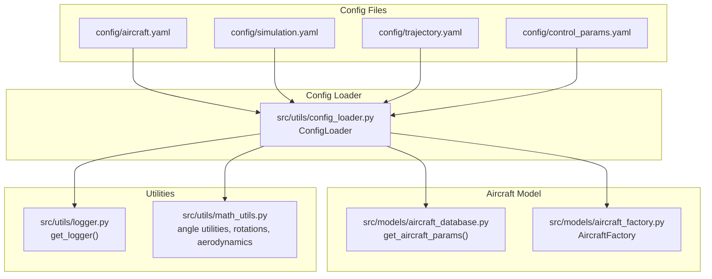
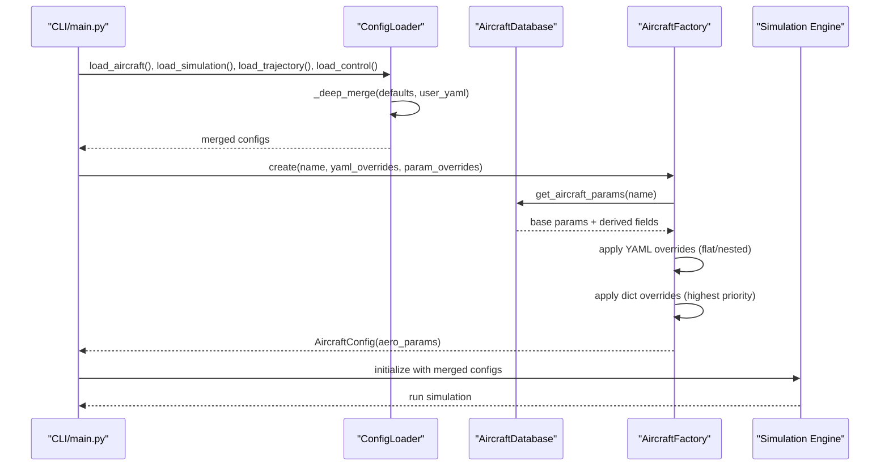
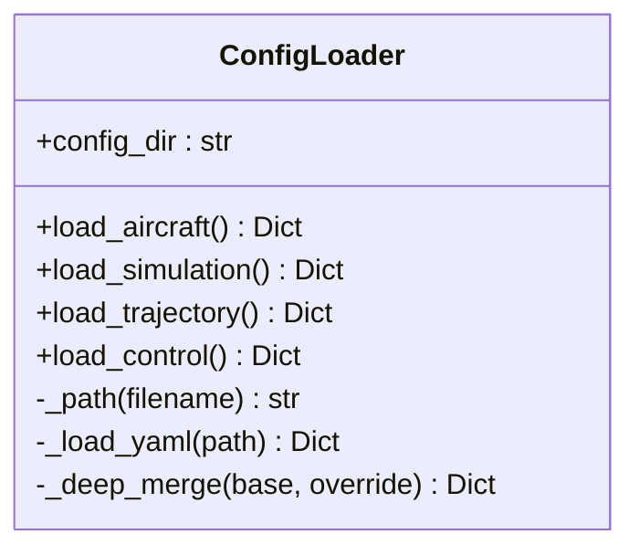
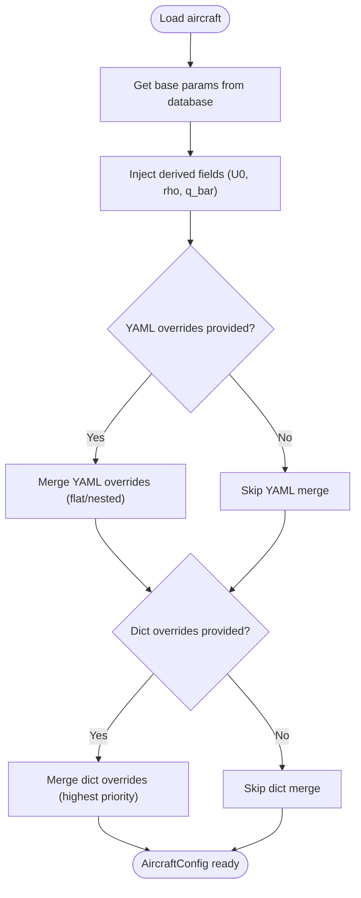
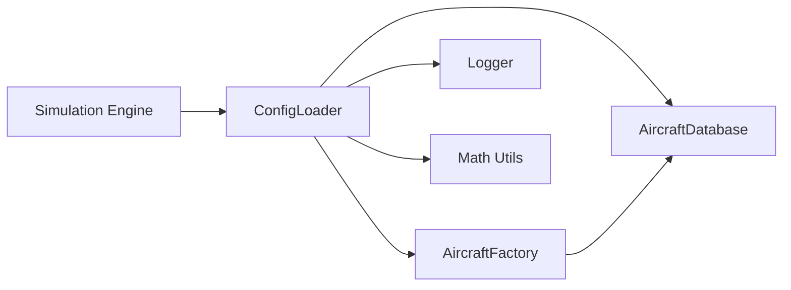

# Configuration and Parameter Management

<cite>
**Referenced Files in This Document**
- [aircraft.yaml](file://config/aircraft.yaml)
- [control_params.yaml](file://config/control_params.yaml)
- [simulation.yaml](file://config/simulation.yaml)
- [trajectory.yaml](file://config/trajectory.yaml)
- [config_loader.py](file://src/utils/config_loader.py)
- [logger.py](file://src/utils/logger.py)
- [math_utils.py](file://src/utils/math_utils.py)
- [aircraft_database.py](file://src/models/aircraft_database.py)
- [aircraft_factory.py](file://src/models/aircraft_factory.py)
- [main.py](file://main.py)
- [example_1_linear_response.py](file://examples/example_1_linear_response.py)
- [example_2_nonlinear_dynamics.py](file://examples/example_2_nonlinear_dynamics.py)
</cite>

## Table of Contents
1. [Introduction](#introduction)
2. [Project Structure](#project-structure)
3. [Core Components](#core-components)
4. [Architecture Overview](#architecture-overview)
5. [Detailed Component Analysis](#detailed-component-analysis)
6. [Dependency Analysis](#dependency-analysis)
7. [Performance Considerations](#performance-considerations)
8. [Troubleshooting Guide](#troubleshooting-guide)
9. [Conclusion](#conclusion)
10. [Appendices](#appendices)

## Introduction
This document explains the configuration and parameter management system used by the Fixed Wing Simulator. It covers YAML configuration parsing, parameter validation, configuration inheritance, and the configuration loader utility. It also documents the mathematical function library and logging system, and explains how aircraft parameter schemas, control parameter definitions, simulation configuration options, and trajectory parameter settings are organized and used. Practical examples show how to edit configuration files, tune parameters, and validate changes, along with best practices and awareness of parameter interdependencies and system-wide impacts.

## Project Structure
The configuration system centers around four YAML configuration files under the config directory and a configuration loader utility that merges user-provided overrides with internal defaults. Supporting utilities include a logger and a math utility library. Aircraft parameters are defined in a centralized database and can be overridden via the aircraft configuration file or programmatically.

**Diagram sources**
- [aircraft.yaml](file://config/aircraft.yaml#L1-L13)
- [simulation.yaml](file://config/simulation.yaml#L1-L30)
- [trajectory.yaml](file://config/trajectory.yaml#L1-L23)
- [control_params.yaml](file://config/control_params.yaml#L1-L45)
- [config_loader.py](file://src/utils/config_loader.py#L1-L82)
- [aircraft_database.py](file://src/models/aircraft_database.py#L1-L183)
- [aircraft_factory.py](file://src/models/aircraft_factory.py#L1-L136)
- [logger.py](file://src/utils/logger.py#L1-L44)
- [math_utils.py](file://src/utils/math_utils.py#L1-L124)

**Section sources**
- [aircraft.yaml](file://config/aircraft.yaml#L1-L13)
- [simulation.yaml](file://config/simulation.yaml#L1-L30)
- [trajectory.yaml](file://config/trajectory.yaml#L1-L23)
- [control_params.yaml](file://config/control_params.yaml#L1-L45)
- [config_loader.py](file://src/utils/config_loader.py#L1-L82)

## Core Components
- Configuration loader: Loads and merges YAML configurations with internal defaults, providing a unified configuration dictionary for the simulation engine.
- Aircraft parameter database: Centralized repository of aircraft geometry, inertia, and aerodynamic coefficients, with derived fields injected for dynamics computations.
- Aircraft factory: Applies YAML and programmatic overrides to produce a validated, merged aircraft configuration consumable by the simulation.
- Logging utility: Provides a configurable logger that writes to console and optionally to dated log files.
- Mathematical utilities: Provides angle wrapping, saturation, unit conversions, rotation matrices, Euler angle rates, and aerodynamic helpers used throughout the simulation.

**Section sources**
- [config_loader.py](file://src/utils/config_loader.py#L1-L82)
- [aircraft_database.py](file://src/models/aircraft_database.py#L1-L183)
- [aircraft_factory.py](file://src/models/aircraft_factory.py#L1-L136)
- [logger.py](file://src/utils/logger.py#L1-L44)
- [math_utils.py](file://src/utils/math_utils.py#L1-L124)

## Architecture Overview
The configuration pipeline starts with YAML files and defaults, merged by the configuration loader. The aircraft configuration is produced either from the database with optional overrides or from a dedicated aircraft YAML file. Control parameters are loaded separately and later integrated into the control layer. Simulation and trajectory configurations are merged with defaults and passed to the simulation engine.

**Diagram sources**
- [main.py](file://main.py#L98-L145)
- [config_loader.py](file://src/utils/config_loader.py#L59-L82)
- [aircraft_database.py](file://src/models/aircraft_database.py#L143-L166)
- [aircraft_factory.py](file://src/models/aircraft_factory.py#L42-L74)

## Detailed Component Analysis

### Configuration Loader Utility
The configuration loader reads YAML files and merges them with internal defaults using a deep merge strategy. It supports separate loaders for aircraft, simulation, trajectory, and control parameters. The loader exposes a simple interface to obtain merged dictionaries for downstream consumption.

Key behaviors:
- Defaults are defined centrally and merged with user-provided YAML.
- Deep merge ensures nested dictionaries are combined while top-level keys override.
- Control parameters are loaded as-is without defaults.

**Diagram sources**
- [config_loader.py](file://src/utils/config_loader.py#L59-L82)

**Section sources**
- [config_loader.py](file://src/utils/config_loader.py#L10-L82)

### YAML Configuration Files and Defaults

#### Aircraft configuration
- Purpose: Select aircraft and optionally override database defaults.
- Schema highlights:
  - aircraft_name: string (must match a database key).
  - overrides: optional block allowing selective overrides of geometry, inertia, and aerodynamic parameters.
- Example usage: Un-comment and adjust entries under overrides to customize mass, wing area, mean chord, wingspan, and inertia terms.

Validation and inheritance:
- Overrides are applied by the aircraft factory; only keys present in the database are accepted.
- Nested vs flat overrides are supported by the factory.

Practical example:
- To increase mass and wing area for a given aircraft, add the overrides block and set numeric values.

**Section sources**
- [aircraft.yaml](file://config/aircraft.yaml#L1-L13)
- [aircraft_factory.py](file://src/models/aircraft_factory.py#L63-L74)

#### Simulation configuration
- Purpose: Configure time stepping, numerical integrator, tolerances, initial conditions, flight mode, wind model, and logging.
- Key options:
  - dt, duration, integrator, rtol, atol.
  - initial_position (NED), initial_heading_deg.
  - initial_mode (MANUAL, STABILIZE, FBW_A, FBW_B, AUTO, LOITER, RTH).
  - wind_type (NONE, FIXED, SINE, RANDOMSINE), wind_speed, wind_direction_deg.
  - log_enabled, log_dir.

Best practices:
- Keep dt and duration consistent with the chosen integrator and problem stiffness.
- Set initial_mode to match the desired starting control law.
- Configure wind consistently with environment modeling expectations.

**Section sources**
- [simulation.yaml](file://config/simulation.yaml#L1-L30)

#### Trajectory configuration
- Purpose: Define trajectory type, average speed, yaw control mode, waypoints, and looping behavior.
- Key options:
  - type: minimum_snap, minimum_jerk, minimum_accel, minimum_vel, hover.
  - average_speed: used to compute segment times.
  - yaw_mode: none, yaw_follow, yaw_waypoint_interp, zero.
  - waypoints: list of [north_m, east_m, alt_m] with alt_m positive up.
  - loop: whether to repeat the waypoints indefinitely.

Guidance:
- Choose trajectory type based on smoothness requirements and actuator limits.
- Ensure waypoints form a feasible path for the selected aircraft and control capabilities.

**Section sources**
- [trajectory.yaml](file://config/trajectory.yaml#L1-L23)

#### Control parameters configuration
- Purpose: Define control gains and limits for attitude, rate, and TECS controllers.
- Organization:
  - Altitude hold and airspeed parameters.
  - NAV L1 parameters.
  - Axis-specific gains (pitch, roll, yaw) for rate controllers and limits.
  - TECS parameters for total energy control (climb/sink limits, time constant, damping, integral gain, speed weight, roll-to-throttle compensation, pitch limits, cruise throttle, height demand time constant).

Interpretation tips:
- Higher damping reduces oscillations but may slow response.
- Integral gain should be tuned carefully to avoid windup and oscillations.
- TECS parameters directly impact energy management and altitude tracking.

**Section sources**
- [control_params.yaml](file://config/control_params.yaml#L1-L45)

### Aircraft Parameter Schemas and Inheritance
The aircraft database defines a comprehensive schema for each aircraft, including identification, geometry, inertia, and aerodynamic stability derivatives. Derived fields (e.g., reference speed and dynamic pressure) are injected during retrieval to support dynamics computations.

Inheritance and overrides:
- Base parameters come from the database keyed by aircraft name.
- YAML overrides (flat or nested) are applied by the factory, restricted to existing keys.
- Programmatic overrides take highest priority.

**Diagram sources**
- [aircraft_database.py](file://src/models/aircraft_database.py#L143-L166)
- [aircraft_factory.py](file://src/models/aircraft_factory.py#L63-L74)

**Section sources**
- [aircraft_database.py](file://src/models/aircraft_database.py#L29-L166)
- [aircraft_factory.py](file://src/models/aircraft_factory.py#L42-L74)

### Logging System
The logging utility creates a named logger with console output and optional file logging. It ensures idempotent initialization and formats messages with timestamps, logger name, and level.

Usage:
- Call get_logger with a module name, log directory, and level.
- When log_dir is empty or None, only console logging is enabled.

**Section sources**
- [logger.py](file://src/utils/logger.py#L10-L44)

### Mathematical Function Library
The math utilities provide:
- Angle wrapping (radians and degrees).
- Saturation/clamping.
- Unit conversions (deg to rad, rad to deg).
- Rotation matrices and frame transformations (body to NED and vice versa).
- Euler angle rates computation with singularities handled numerically.
- Aerodynamic helpers (angle of attack, sideslip angle, dynamic pressure).

These utilities are foundational for coordinate transforms, control law computations, and aerodynamic calculations.

**Section sources**
- [math_utils.py](file://src/utils/math_utils.py#L13-L124)

### Practical Examples and Validation Procedures

#### Editing configuration files
- Aircraft: Modify aircraft.yaml to select a different aircraft or add overrides under the overrides block. Only keys present in the database are valid.
- Simulation: Adjust dt, duration, integrator, initial conditions, wind settings, and logging preferences in simulation.yaml.
- Trajectory: Change type, average_speed, yaw_mode, waypoints, and loop in trajectory.yaml.
- Control: Tune control_params.yaml gains and limits to achieve desired response characteristics.

Validation steps:
- After edits, run a short simulation to confirm convergence and acceptable behavior.
- Compare open-loop and closed-loop responses using example scripts to detect unexpected overshoots or oscillations.

**Section sources**
- [aircraft.yaml](file://config/aircraft.yaml#L1-L13)
- [simulation.yaml](file://config/simulation.yaml#L1-L30)
- [trajectory.yaml](file://config/trajectory.yaml#L1-L23)
- [control_params.yaml](file://config/control_params.yaml#L1-L45)

#### Parameter tuning
- Start with defaults and perturb one parameter at a time.
- For control parameters, begin with proportional gains, then add integral and derivative as needed.
- Validate with example_1_linear_response.py (open-loop vs closed-loop) and example_2_nonlinear_dynamics.py (nonlinear trim and response).

Example references:
- Linear response comparison and closed-loop PID validation.
- Nonlinear trim computation and closed-loop stabilization.

**Section sources**
- [example_1_linear_response.py](file://examples/example_1_linear_response.py#L88-L164)
- [example_2_nonlinear_dynamics.py](file://examples/example_2_nonlinear_dynamics.py#L82-L160)

#### Configuration loading in the main application
The main entry point demonstrates how configuration is passed to the simulation engine and how command-line arguments can override certain settings.

**Section sources**
- [main.py](file://main.py#L98-L145)

## Dependency Analysis
The configuration system exhibits clear separation of concerns:
- ConfigLoader depends on YAML parsing and deep merge logic.
- AircraftFactory depends on the aircraft database and applies overrides.
- Simulation consumes merged configurations from ConfigLoader.
- Utilities (logger, math) are used across modules without tight coupling to configuration.

**Diagram sources**
- [config_loader.py](file://src/utils/config_loader.py#L59-L82)
- [aircraft_database.py](file://src/models/aircraft_database.py#L143-L166)
- [aircraft_factory.py](file://src/models/aircraft_factory.py#L42-L74)
- [logger.py](file://src/utils/logger.py#L10-L44)
- [math_utils.py](file://src/utils/math_utils.py#L1-L124)

**Section sources**
- [config_loader.py](file://src/utils/config_loader.py#L59-L82)
- [aircraft_factory.py](file://src/models/aircraft_factory.py#L42-L74)
- [aircraft_database.py](file://src/models/aircraft_database.py#L143-L166)
- [logger.py](file://src/utils/logger.py#L10-L44)
- [math_utils.py](file://src/utils/math_utils.py#L1-L124)

## Performance Considerations
- YAML parsing overhead is minimal compared to simulation runtime; keep configuration files concise.
- Deep merge is efficient for typical configuration sizes; avoid excessively nested structures.
- Integrator choice and tolerances significantly impact simulation cost; choose dopri5 for real-time loops and rk45 for batch analysis.
- Logging to disk adds I/O overhead; disable or reduce verbosity for batch runs.

## Troubleshooting Guide
Common issues and resolutions:
- Invalid aircraft name: Ensure aircraft_name matches a key in the database; otherwise, retrieval raises an error.
- Unknown keys in overrides: Only database keys are accepted; unknown keys are ignored by the factory.
- Missing or malformed YAML: Safe loading returns empty dicts; verify file syntax and paths.
- Logging not writing to file: Ensure log_dir exists or is enabled; the logger creates directories as needed.
- Control instability: Reduce proportional gains, add integral limiting, and adjust TECS parameters gradually.

**Section sources**
- [aircraft_database.py](file://src/models/aircraft_database.py#L153-L156)
- [aircraft_factory.py](file://src/models/aircraft_factory.py#L63-L74)
- [logger.py](file://src/utils/logger.py#L36-L42)

## Conclusion
The configuration and parameter management system provides a robust, extensible foundation for specifying aircraft, control, simulation, and trajectory parameters. By combining YAML-driven customization with centralized defaults and a strict override mechanism, it enables precise tuning while maintaining safety and consistency. The math and logging utilities complement the configuration system, ensuring accurate computations and transparent operation.

## Appendices

### Configuration Best Practices
- Keep overrides minimal and focused on the parameters that matter for your scenario.
- Validate parameter interdependencies (e.g., mass affects inertia and control authority) before large changes.
- Use the example scripts to benchmark open-loop and closed-loop behavior before deploying new configurations.
- Document significant changes to configuration files to aid reproducibility and team collaboration.

### Parameter Interdependencies
- Aircraft geometry and inertia influence control authority and stability margins.
- Control gains must be scaled appropriately to aircraft mass and wing area.
- Simulation tolerances and time step affect accuracy and computational cost; balance them with integrator choice.
- Trajectory type and average speed impact actuator demands and controller bandwidth.