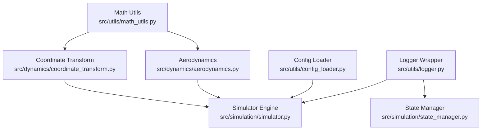
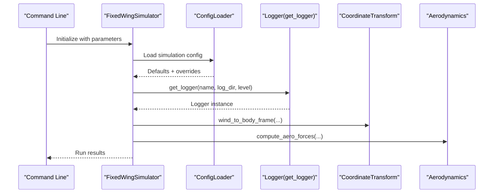
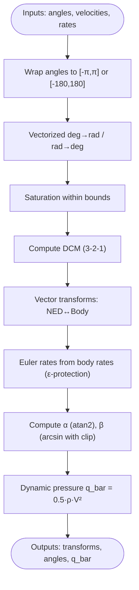
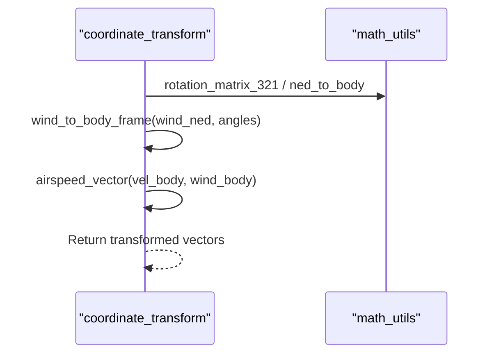
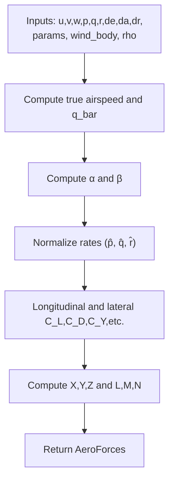
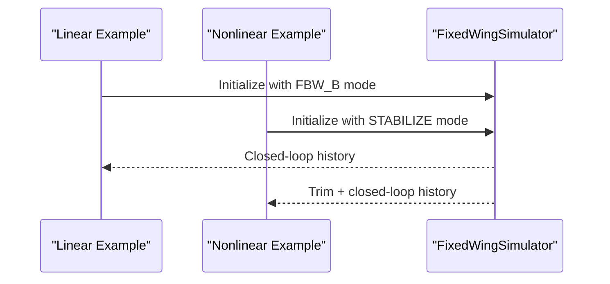
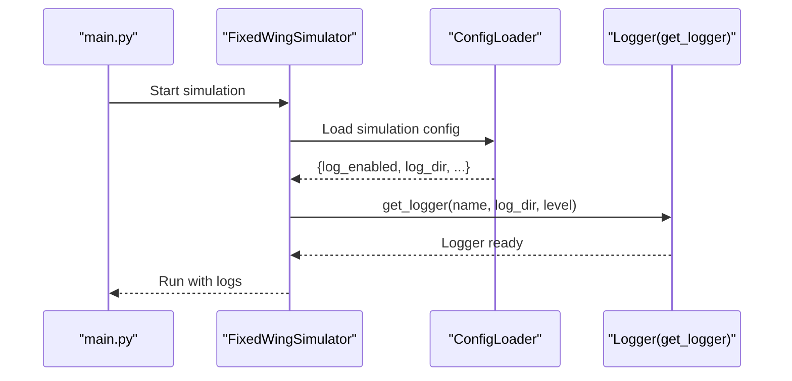
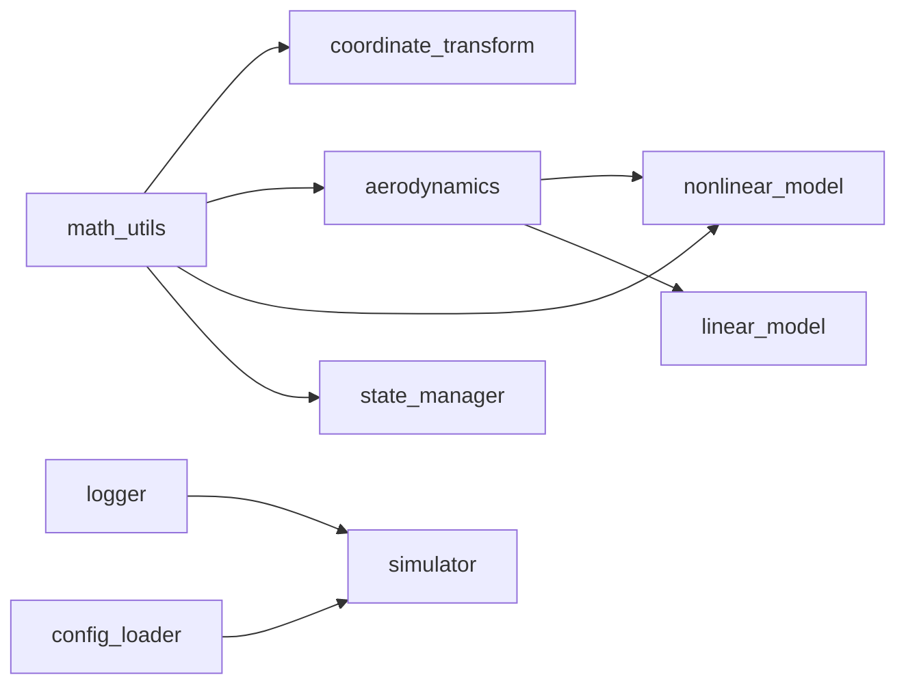

# Mathematical and Logistical Utilities

<cite>
**Referenced Files in This Document**
- [src/utils/math_utils.py](file://src/utils/math_utils.py)
- [src/dynamics/coordinate_transform.py](file://src/dynamics/coordinate_transform.py)
- [src/dynamics/aerodynamics.py](file://src/dynamics/aerodynamics.py)
- [src/utils/logger.py](file://src/utils/logger.py)
- [src/utils/config_loader.py](file://src/utils/config_loader.py)
- [src/simulation/simulator.py](file://src/simulation/simulator.py)
- [src/simulation/state_manager.py](file://src/simulation/state_manager.py)
- [doc/zh/content/工具与实用程序/数学工具函数.md](file://doc/zh/content/工具与实用程序/数学工具函数.md)
- [doc/zh/content/工具与实用程序/日志记录系统.md](file://doc/zh/content/工具与实用程序/日志记录系统.md)
- [doc/zh/content/核心概念/坐标系与变换.md](file://doc/zh/content/核心概念/坐标系与变换.md)
- [examples/1_linear_response.py](file://examples/1_linear_response.py)
- [examples/2_nonlinear_dynamics.py](file://examples/2_nonlinear_dynamics.py)
</cite>

## Table of Contents
1. [Introduction](#introduction)
2. [Project Structure](#project-structure)
3. [Core Components](#core-components)
4. [Architecture Overview](#architecture-overview)
5. [Detailed Component Analysis](#detailed-component-analysis)
6. [Dependency Analysis](#dependency-analysis)
7. [Performance Considerations](#performance-considerations)
8. [Troubleshooting Guide](#troubleshooting-guide)
9. [Conclusion](#conclusion)
10. [Appendices](#appendices)

## Introduction
This document provides comprehensive documentation for the mathematical utility functions and logging system used throughout the fixed-wing simulation. It explains trigonometric operations, vector calculations, matrix transformations, and coordinate system conversions, and demonstrates how these are applied in control calculations, state transformations, and data analysis. It also covers the logging system’s configuration, output formatting, and debugging strategies, along with computational efficiency and precision considerations essential for aerospace simulations.

## Project Structure
The mathematical utilities and logging system are organized across dedicated modules and integrated into the dynamics, control, and simulation layers. The math utilities underpin coordinate transforms, aerodynamic computations, and fly dynamics models. The logging system is a thin wrapper around Python’s logging, configurable via the configuration loader and injected into the simulation engine and subsystems.

**Diagram sources**
- [src/utils/math_utils.py](file://src/utils/math_utils.py#L1-L124)
- [src/dynamics/coordinate_transform.py](file://src/dynamics/coordinate_transform.py#L1-L70)
- [src/dynamics/aerodynamics.py](file://src/dynamics/aerodynamics.py#L1-L148)
- [src/utils/logger.py](file://src/utils/logger.py#L1-L44)
- [src/utils/config_loader.py](file://src/utils/config_loader.py#L1-L82)
- [src/simulation/simulator.py](file://src/simulation/simulator.py#L1-L200)
- [src/simulation/state_manager.py](file://src/simulation/state_manager.py#L1-L193)

**Section sources**
- [src/utils/math_utils.py](file://src/utils/math_utils.py#L1-L124)
- [src/dynamics/coordinate_transform.py](file://src/dynamics/coordinate_transform.py#L1-L70)
- [src/dynamics/aerodynamics.py](file://src/dynamics/aerodynamics.py#L1-L148)
- [src/utils/logger.py](file://src/utils/logger.py#L1-L44)
- [src/utils/config_loader.py](file://src/utils/config_loader.py#L1-L82)
- [src/simulation/simulator.py](file://src/simulation/simulator.py#L1-L200)
- [src/simulation/state_manager.py](file://src/simulation/state_manager.py#L1-L193)

## Core Components
- Mathematical utilities:
  - Angle wrapping and unit conversion (radians/degrees), saturation, vectorized conversions
  - Rotation matrices and coordinate transforms (NED ↔ body) using 3-2-1 Euler angles
  - Euler angle rates from body angular rates with numerical protection near singularities
  - Aerodynamic helpers: angle of attack, sideslip angle, dynamic pressure
- Logging system:
  - Unified logger factory with console and optional file handlers
  - Consistent formatter and single-configuration pattern
  - Integration with configuration loader and simulation engine

**Section sources**
- [src/utils/math_utils.py](file://src/utils/math_utils.py#L13-L124)
- [src/dynamics/coordinate_transform.py](file://src/dynamics/coordinate_transform.py#L29-L70)
- [src/utils/logger.py](file://src/utils/logger.py#L10-L43)
- [src/utils/config_loader.py](file://src/utils/config_loader.py#L10-L37)

## Architecture Overview
The math utilities form the foundation for coordinate transforms and aerodynamic computations, which feed into the nonlinear and linear fly dynamics models. The logging system is injected into the simulation engine and shared across subsystems, ensuring consistent observability.

**Diagram sources**
- [src/simulation/simulator.py](file://src/simulation/simulator.py#L148-L171)
- [src/utils/config_loader.py](file://src/utils/config_loader.py#L75-L77)
- [src/utils/logger.py](file://src/utils/logger.py#L10-L43)
- [src/dynamics/coordinate_transform.py](file://src/dynamics/coordinate_transform.py#L39-L70)
- [src/dynamics/aerodynamics.py](file://src/dynamics/aerodynamics.py#L35-L148)

## Detailed Component Analysis

### Mathematical Utilities: Trigonometry, Vectors, Matrices, and Coordinate Conversions
- Angle utilities:
  - Wrap angles to canonical intervals for stable control loops
  - Vectorized degree/radian conversions for scalars and arrays
  - Saturation to constrain control and state variables
- Rotation matrices and transforms:
  - Direction cosine matrix for NED-to-body and vice versa using 3-2-1 Euler angles
  - Vector transforms between frames via matrix multiplication
  - Euler angle rates computed from body rates with small epsilon protection near singularities
- Aerodynamic helpers:
  - Angle of attack using atan2 for robust phase definition
  - Sideslip angle using arcsin with clipping to maintain domain validity
  - Dynamic pressure for lift/drag coefficient scaling

**Diagram sources**
- [src/utils/math_utils.py](file://src/utils/math_utils.py#L13-L124)

**Section sources**
- [src/utils/math_utils.py](file://src/utils/math_utils.py#L13-L124)

### Coordinate System Conversions and Wind Effects
- Direction cosine matrix alias and reusable transforms
- Wind vector conversion from NED to body frame
- True airspeed vector as body velocity minus body wind velocity

**Diagram sources**
- [src/dynamics/coordinate_transform.py](file://src/dynamics/coordinate_transform.py#L29-L70)
- [src/utils/math_utils.py](file://src/utils/math_utils.py#L43-L77)

**Section sources**
- [src/dynamics/coordinate_transform.py](file://src/dynamics/coordinate_transform.py#L29-L70)

### Aerodynamic Force and Moment Computation
- Computes non-dimensional coefficients (longitudinal and lateral-directional) using angle-of-attack, sideslip, normalized angular rates, and control surface deflections
- Converts coefficients to dimensional forces and moments in the body frame
- Uses dynamic pressure computed from true airspeed

**Diagram sources**
- [src/dynamics/aerodynamics.py](file://src/dynamics/aerodynamics.py#L35-L148)
- [src/utils/math_utils.py](file://src/utils/math_utils.py#L107-L124)

**Section sources**
- [src/dynamics/aerodynamics.py](file://src/dynamics/aerodynamics.py#L35-L148)

### Practical Examples of Utility Function Usage
- Linear analysis example:
  - Demonstrates open-loop modal analysis and closed-loop PID step response
  - Uses simulation engine and state history for post-processing
- Nonlinear dynamics example:
  - Computes trim, runs open-loop 6-DOF simulation, compares with closed-loop stabilization
  - Leverages coordinate transforms and aerodynamic computations internally

**Diagram sources**
- [examples/1_linear_response.py](file://examples/1_linear_response.py#L132-L145)
- [examples/2_nonlinear_dynamics.py](file://examples/2_nonlinear_dynamics.py#L130-L140)

**Section sources**
- [examples/1_linear_response.py](file://examples/1_linear_response.py#L132-L145)
- [examples/2_nonlinear_dynamics.py](file://examples/2_nonlinear_dynamics.py#L130-L140)

### Logging System: Configuration, Formatting, and Debugging Strategies
- Logger factory:
  - Creates named loggers with console handler and optional file handler
  - Uses a consistent formatter and respects requested logging level
- Configuration integration:
  - Simulation reads defaults and merges user overrides to decide whether to enable file logging and where to write logs
- Debugging strategies:
  - Use appropriate levels (DEBUG/INFO/WARNING/ERROR/CRITICAL)
  - Add targeted logs at control updates, mode transitions, and convergence checks
  - Enable file logging for production runs and disable for high-frequency development iterations

**Diagram sources**
- [src/utils/config_loader.py](file://src/utils/config_loader.py#L75-L77)
- [src/utils/logger.py](file://src/utils/logger.py#L10-L43)
- [src/simulation/simulator.py](file://src/simulation/simulator.py#L148-L171)

**Section sources**
- [src/utils/logger.py](file://src/utils/logger.py#L10-L43)
- [src/utils/config_loader.py](file://src/utils/config_loader.py#L10-L37)
- [src/simulation/simulator.py](file://src/simulation/simulator.py#L148-L171)
- [src/simulation/state_manager.py](file://src/simulation/state_manager.py#L95-L193)

## Dependency Analysis
- math_utils is a foundational dependency for coordinate_transform and aerodynamics
- coordinate_transform depends solely on math_utils for transforms
- aerodynamics depends on math_utils for α, β, and q_bar
- nonlinear and linear dynamics depend on aerodynamics and math_utils for rotations and rates
- state_manager computes derived quantities using math_utils-derived formulas
- logging is decoupled and injected via configuration-driven initialization

**Diagram sources**
- [src/utils/math_utils.py](file://src/utils/math_utils.py#L1-L124)
- [src/dynamics/coordinate_transform.py](file://src/dynamics/coordinate_transform.py#L10-L16)
- [src/dynamics/aerodynamics.py](file://src/dynamics/aerodynamics.py#L11-L13)
- [src/simulation/state_manager.py](file://src/simulation/state_manager.py#L62-L66)
- [src/utils/logger.py](file://src/utils/logger.py#L10-L43)
- [src/utils/config_loader.py](file://src/utils/config_loader.py#L75-L77)
- [src/simulation/simulator.py](file://src/simulation/simulator.py#L1-L200)

**Section sources**
- [src/utils/math_utils.py](file://src/utils/math_utils.py#L1-L124)
- [src/dynamics/coordinate_transform.py](file://src/dynamics/coordinate_transform.py#L10-L16)
- [src/dynamics/aerodynamics.py](file://src/dynamics/aerodynamics.py#L11-L13)
- [src/simulation/state_manager.py](file://src/simulation/state_manager.py#L62-L66)
- [src/utils/logger.py](file://src/utils/logger.py#L10-L43)
- [src/utils/config_loader.py](file://src/utils/config_loader.py#L75-L77)
- [src/simulation/simulator.py](file://src/simulation/simulator.py#L1-L200)

## Performance Considerations
- Prefer vectorized operations for unit conversions and batch processing
- Minimize repeated trigonometric evaluations by caching intermediate results
- Use numerical safeguards (epsilon protection) to avoid singularities and division by zero
- Choose appropriate logging levels to reduce I/O overhead in high-frequency simulations
- Pre-allocate state histories to avoid memory churn during long runs

[No sources needed since this section provides general guidance]

## Troubleshooting Guide
- Angle wrapping and control stability:
  - Use wrap_angle or wrap_angle_deg to keep angles continuous and prevent control jumps
- Euler angle singularities:
  - Euler rates include small epsilon protection; if instability persists, inspect inputs near ±90° pitch
- Sideslip and airspeed thresholds:
  - Ensure v/V is clipped and true airspeed has a minimal threshold to avoid numerical errors
- Logging issues:
  - Verify configuration enables file logging and that the directory exists and is writable
  - Avoid adding duplicate handlers; ensure get_logger is called once per module initialization
  - Increase verbosity for debugging and switch to higher levels for production runs

**Section sources**
- [src/utils/math_utils.py](file://src/utils/math_utils.py#L87-L91)
- [src/utils/math_utils.py](file://src/utils/math_utils.py#L117-L118)
- [src/utils/logger.py](file://src/utils/logger.py#L20-L22)
- [src/utils/config_loader.py](file://src/utils/config_loader.py#L10-L37)

## Conclusion
The mathematical utilities provide a robust, numerically stable foundation for coordinate transforms, aerodynamic computations, and Euler kinematics, while the logging system offers a lightweight, configurable mechanism for observability across the simulation stack. Together, they support accurate, efficient, and debuggable fixed-wing simulations suitable for both linear analysis and nonlinear control evaluation.

[No sources needed since this section summarizes without analyzing specific files]

## Appendices

### Practical Usage Scenarios
- Control calculations:
  - Use angle wrapping and saturation to stabilize control loops
  - Apply coordinate transforms to convert wind vectors and airspeed into body frame for aerodynamic computations
- State transformations:
  - Compute derived quantities (α, β, airspeed, altitude) from state vectors using math_utils-derived formulas
- Data analysis:
  - Export histories via StateHistory and correlate logged events with plots and CSV exports

**Section sources**
- [src/dynamics/aerodynamics.py](file://src/dynamics/aerodynamics.py#L35-L148)
- [src/simulation/state_manager.py](file://src/simulation/state_manager.py#L62-L66)
- [examples/1_linear_response.py](file://examples/1_linear_response.py#L153-L163)
- [examples/2_nonlinear_dynamics.py](file://examples/2_nonlinear_dynamics.py#L153-L159)

### Aerospace Precision and Efficiency Notes
- Use atan2 for angle of attack to preserve phase quadrants
- Clamp ratios for arcsin to avoid NaN in sideslip calculations
- Normalize angular rates by reference length and speed for dimensionless coefficients
- Keep logging levels aligned with runtime demands to balance fidelity and throughput

**Section sources**
- [src/utils/math_utils.py](file://src/utils/math_utils.py#L107-L124)
- [src/dynamics/aerodynamics.py](file://src/dynamics/aerodynamics.py#L85-L88)