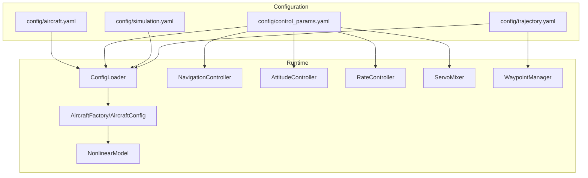
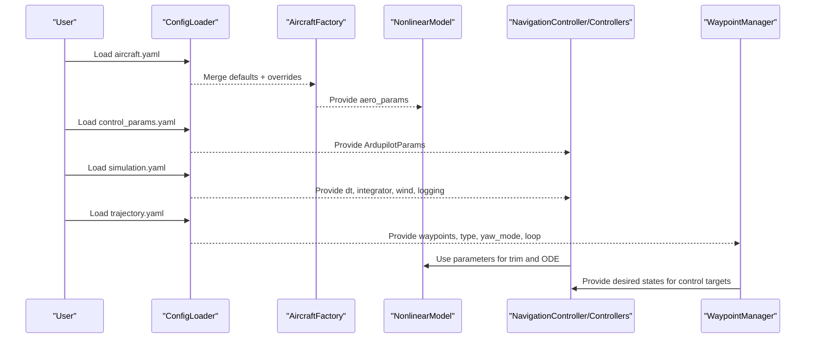
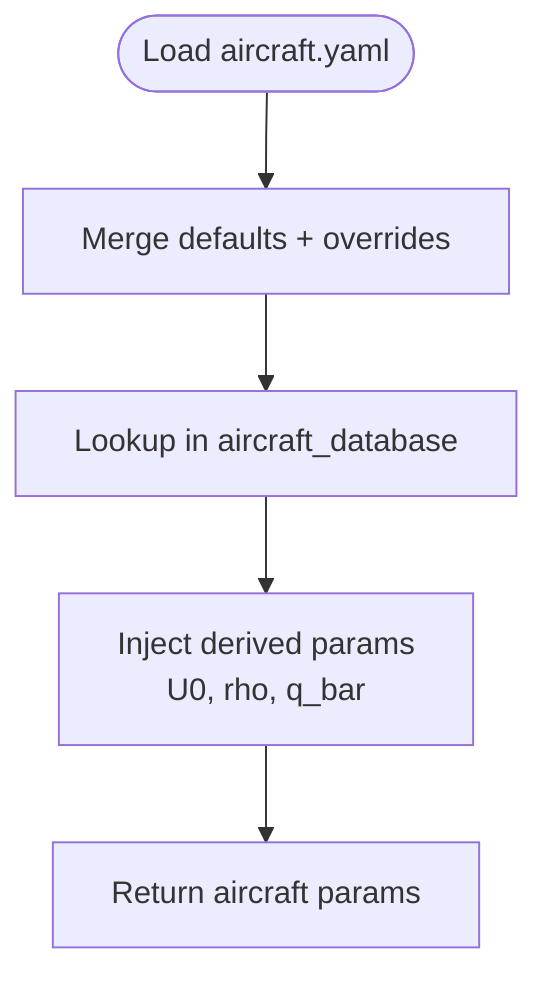
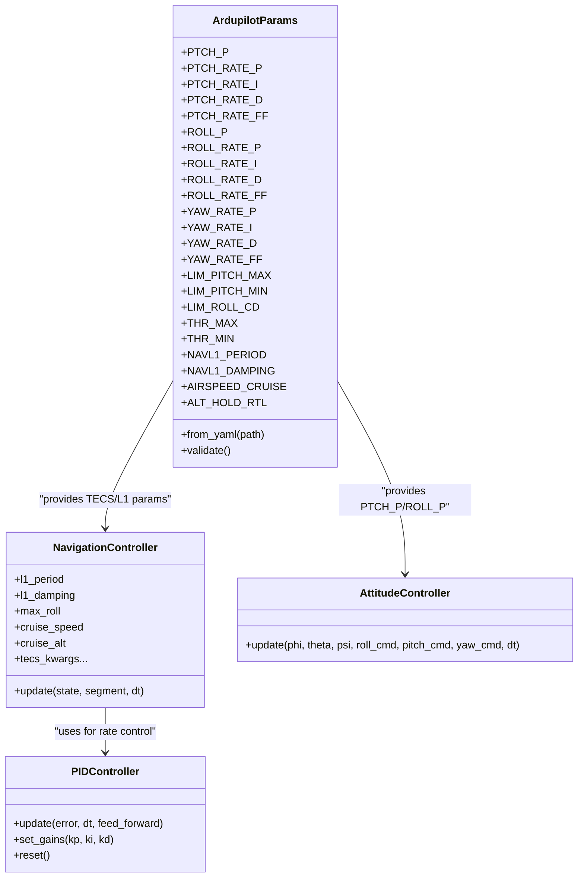
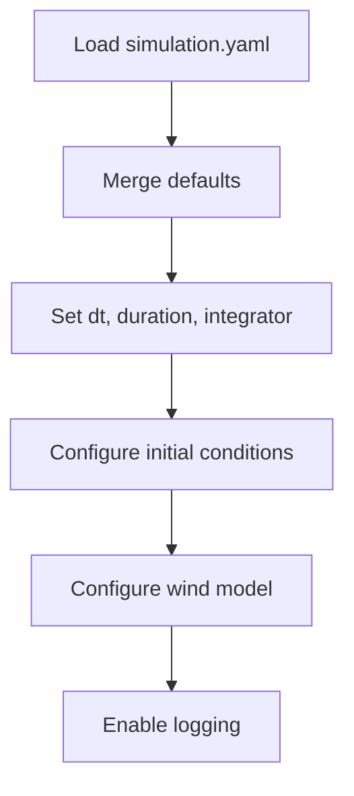
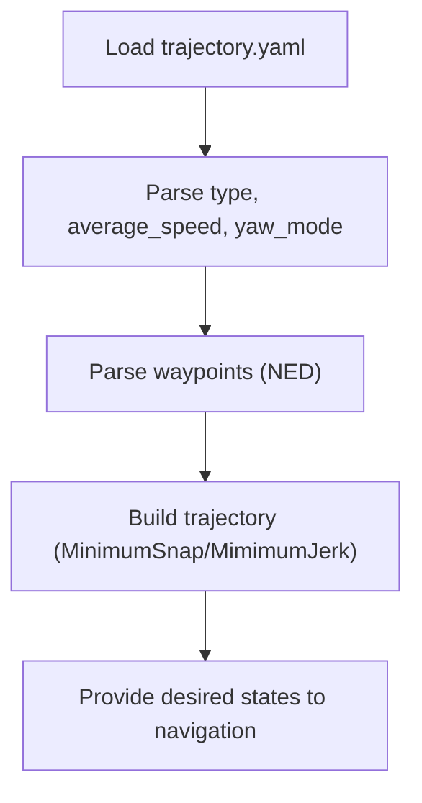
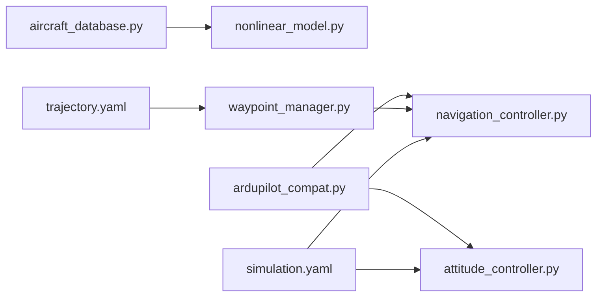

# Parameter Definitions and Schemas

<cite>
**Referenced Files in This Document**
- [aircraft.yaml](file://config/aircraft.yaml)
- [control_params.yaml](file://config/control_params.yaml)
- [simulation.yaml](file://config/simulation.yaml)
- [trajectory.yaml](file://config/trajectory.yaml)
- [aircraft_database.py](file://src/models/aircraft_database.py)
- [config_loader.py](file://src/utils/config_loader.py)
- [ardupilot_compat.py](file://src/control/ardupilot_compat.py)
- [pid_controller.py](file://src/control/pid_controller.py)
- [attitude_controller.py](file://src/control/attitude_controller.py)
- [navigation_controller.py](file://src/control/navigation_controller.py)
- [tecs_controller.py](file://src/control/tecs_controller.py)
- [waypoint_manager.py](file://src/planning/waypoint_manager.py)
- [simulator.py](file://src/simulation/simulator.py)
- [nonlinear_model.py](file://src/dynamics/nonlinear_model.py)
</cite>

## Table of Contents
1. [Introduction](#introduction)
2. [Project Structure](#project-structure)
3. [Core Components](#core-components)
4. [Architecture Overview](#architecture-overview)
5. [Detailed Component Analysis](#detailed-component-analysis)
6. [Dependency Analysis](#dependency-analysis)
7. [Performance Considerations](#performance-considerations)
8. [Troubleshooting Guide](#troubleshooting-guide)
9. [Conclusion](#conclusion)
10. [Appendices](#appendices)

## Introduction
This document provides comprehensive parameter definitions and schemas across all system domains of the FixedWingSimulator. It covers:
- Aircraft parameter schemas (mass properties, aerodynamic coefficients, control surface characteristics)
- Simulation parameters (time stepping, integration methods, numerical tolerances)
- Control parameter definitions (PID controllers, gain scheduling, flight mode settings)
- Trajectory parameters (waypoint specification, path planning algorithms, mission execution modes)
- Units, valid ranges, and interdependencies among parameters
- Practical examples of parameter tuning for different aircraft types and operational scenarios

## Project Structure
The parameter system is organized around four primary configuration domains:
- Aircraft parameters: loaded from the aircraft database and optionally overridden via a YAML file
- Control parameters: ArduPilot-compatible parameters for attitude, rate, navigation, and TECS control
- Simulation parameters: time stepping, integrator selection, initial conditions, wind, and logging
- Trajectory parameters: waypoint lists, trajectory type, yaw control mode, and mission execution

**Diagram sources**
- [aircraft.yaml](file://config/aircraft.yaml#L1-L13)
- [control_params.yaml](file://config/control_params.yaml#L1-L45)
- [simulation.yaml](file://config/simulation.yaml#L1-L30)
- [trajectory.yaml](file://config/trajectory.yaml#L1-L23)
- [config_loader.py](file://src/utils/config_loader.py#L10-L82)
- [nonlinear_model.py](file://src/dynamics/nonlinear_model.py#L104-L127)
- [navigation_controller.py](file://src/control/navigation_controller.py#L45-L117)
- [attitude_controller.py](file://src/control/attitude_controller.py#L33-L77)
- [waypoint_manager.py](file://src/planning/waypoint_manager.py#L20-L50)

**Section sources**
- [aircraft.yaml](file://config/aircraft.yaml#L1-L13)
- [control_params.yaml](file://config/control_params.yaml#L1-L45)
- [simulation.yaml](file://config/simulation.yaml#L1-L30)
- [trajectory.yaml](file://config/trajectory.yaml#L1-L23)
- [config_loader.py](file://src/utils/config_loader.py#L10-L82)

## Core Components
This section defines the parameter domains and their units, typical ranges, and interdependencies.

- Aircraft parameters
  - Purpose: Define mass, geometry, inertia, and aerodynamic stability derivatives
  - Units: mass in kilograms, area in square meters, lengths in meters, angles in radians, aerodynamic coefficients dimensionless
  - Typical entries: mass, wing area S, mean aerodynamic chord c, wingspan b, moments of inertia Ixx, Iyy, Izz, Ixz, Mach number, stability derivatives CL_0, CL_alpha, CL_q, CL_deltae, CD_0, CD_alpha, CD_q, CD_deltae, Cm_0, Cm_alpha, Cm_q, Cm_deltae, lateral-directional derivatives CYb, CYp, CYr, CYda, CYdr, Clb, Clp, Clr, Clda, Cldr, Cnb, Cnp, Cnr, Cnda, Cndr
  - Interdependencies: Derived parameters include U0 (true airspeed), rho (air density), and q_bar (dynamic pressure) computed from Mach and sea-level density
  - Reference: [aircraft_database.py](file://src/models/aircraft_database.py#L29-L133)

- Control parameters (ArduPilot-compatible)
  - Purpose: Configure attitude, rate, navigation, and TECS control loops
  - Units: Angles in degrees (converted to radians internally), throttle normalized [0,1], speeds in m/s, rates in rad/s
  - Typical entries:
    - Attitude: PTCH_P, ROLL_P
    - Rate: PTCH_RATE_P, PTCH_RATE_I, PTCH_RATE_D, PTCH_RATE_FF, ROLL_RATE_P, ROLL_RATE_I, ROLL_RATE_D, ROLL_RATE_FF, YAW_RATE_P, YAW_RATE_I, YAW_RATE_D, YAW_RATE_FF
    - Limits: LIM_PITCH_MAX, LIM_PITCH_MIN, LIM_ROLL_CD (converts to degrees), THR_MAX, THR_MIN
    - Navigation: NAVL1_PERIOD, NAVL1_DAMPING
    - Speed/altitude: AIRSPEED_CRUISE, ALT_HOLD_RTL
    - TECS: TECS_CLMB_MAX, TECS_SINK_MIN, TECS_SINK_MAX, TECS_TIME_CONST, TECS_THR_DAMP, TECS_PTCH_DAMP, TECS_INTEG_GAIN, TECS_SPDWEIGHT, TECS_RLL2THR, TECS_PITCH_MAX, TECS_PITCH_MIN, TECS_THR_CRUISE, TECS_HDEM_TCONST
  - Interdependencies: TECS parameters depend on cruise speed and altitude; roll compensation interacts with throttle demand; LIM_ROLL_CD converts to maximum roll angle
  - Reference: [ardupilot_compat.py](file://src/control/ardupilot_compat.py#L17-L129), [control_params.yaml](file://config/control_params.yaml#L1-L45)

- Simulation parameters
  - Purpose: Configure time stepping, numerical integration, initial conditions, wind, and logging
  - Units: Time in seconds, angles in degrees, positions in meters (NED), speeds in m/s
  - Typical entries: dt, duration, integrator, rtol, atol, initial_position, initial_heading_deg, initial_mode, wind_type, wind_speed, wind_direction_deg, log_enabled, log_dir
  - Interdependencies: Integrator choice affects real-time performance; wind parameters override environment defaults
  - Reference: [simulation.yaml](file://config/simulation.yaml#L1-L30), [config_loader.py](file://src/utils/config_loader.py#L10-L37)

- Trajectory parameters
  - Purpose: Define waypoints, trajectory type, average speed, yaw control mode, and mission loop behavior
  - Units: Positions in meters (NED), altitudes positive-up converted to NED down internally, speeds in m/s
  - Typical entries: type, average_speed, yaw_mode, waypoints, loop
  - Interdependencies: Trajectory type selects minimum snap or minimum jerk; yaw_mode affects heading profile; loop enables cyclic missions
  - Reference: [trajectory.yaml](file://config/trajectory.yaml#L1-L23), [waypoint_manager.py](file://src/planning/waypoint_manager.py#L20-L50)

**Section sources**
- [aircraft_database.py](file://src/models/aircraft_database.py#L14-L183)
- [ardupilot_compat.py](file://src/control/ardupilot_compat.py#L17-L129)
- [control_params.yaml](file://config/control_params.yaml#L1-L45)
- [simulation.yaml](file://config/simulation.yaml#L1-L30)
- [trajectory.yaml](file://config/trajectory.yaml#L1-L23)
- [waypoint_manager.py](file://src/planning/waypoint_manager.py#L20-L50)

## Architecture Overview
The parameter flow connects configuration files to runtime components through a loader and parameter containers.

**Diagram sources**
- [config_loader.py](file://src/utils/config_loader.py#L68-L81)
- [nonlinear_model.py](file://src/dynamics/nonlinear_model.py#L114-L127)
- [navigation_controller.py](file://src/control/navigation_controller.py#L45-L117)
- [waypoint_manager.py](file://src/planning/waypoint_manager.py#L20-L50)

## Detailed Component Analysis

### Aircraft Parameter Schema
- Data source: Aircraft database with predefined entries and derived parameters
- Derived fields injected per aircraft: U0, rho, q_bar
- Typical aircraft entries include TB2, Anka, Aksungur, Karayel, Predator, Heron MK1, Heron MK2
- Interdependencies:
  - U0 depends on Mach and speed of sound
  - q_bar depends on rho and U0
  - Stability derivatives drive trim and control laws

**Diagram sources**
- [aircraft.yaml](file://config/aircraft.yaml#L1-L13)
- [aircraft_database.py](file://src/models/aircraft_database.py#L143-L166)

**Section sources**
- [aircraft_database.py](file://src/models/aircraft_database.py#L29-L183)
- [aircraft.yaml](file://config/aircraft.yaml#L1-L13)

### Control Parameter Definitions
- ArduPilot-compatible parameter container supports YAML load/save and validation
- TECS parameters are merged from YAML with sensible defaults
- Navigation controller consumes L1 period/damping and TECS parameters
- Attitude controller uses PTCH_P and ROLL_P; rate controller uses axis-specific gains

**Diagram sources**
- [ardupilot_compat.py](file://src/control/ardupilot_compat.py#L17-L129)
- [navigation_controller.py](file://src/control/navigation_controller.py#L45-L117)
- [attitude_controller.py](file://src/control/attitude_controller.py#L33-L77)
- [pid_controller.py](file://src/control/pid_controller.py#L17-L99)

**Section sources**
- [ardupilot_compat.py](file://src/control/ardupilot_compat.py#L17-L129)
- [control_params.yaml](file://config/control_params.yaml#L1-L45)
- [navigation_controller.py](file://src/control/navigation_controller.py#L45-L117)
- [attitude_controller.py](file://src/control/attitude_controller.py#L33-L77)
- [pid_controller.py](file://src/control/pid_controller.py#L17-L99)

### Simulation Parameters
- Time stepping and integration: dt, duration, integrator selection, tolerances
- Initial conditions: NED position and initial heading
- Flight mode: manual selection
- Wind: type, speed, direction
- Logging: enable/disable and directory

**Diagram sources**
- [simulation.yaml](file://config/simulation.yaml#L1-L30)
- [config_loader.py](file://src/utils/config_loader.py#L10-L37)

**Section sources**
- [simulation.yaml](file://config/simulation.yaml#L1-L30)
- [config_loader.py](file://src/utils/config_loader.py#L10-L37)

### Trajectory Parameters
- Waypoint management supports NED coordinates with altitudes specified as positive-up (internally converted)
- Trajectory types: minimum snap or minimum jerk
- Yaw control modes: none, yaw_follow, yaw_waypoint_interp, zero
- Mission loop: optional cycling back to the first waypoint

**Diagram sources**
- [trajectory.yaml](file://config/trajectory.yaml#L1-L23)
- [waypoint_manager.py](file://src/planning/waypoint_manager.py#L20-L50)

**Section sources**
- [trajectory.yaml](file://config/trajectory.yaml#L1-L23)
- [waypoint_manager.py](file://src/planning/waypoint_manager.py#L20-L50)

## Dependency Analysis
Key parameter dependencies:
- Aircraft-derived parameters (U0, rho, q_bar) are required by dynamics and aerodynamics modules
- TECS parameters depend on cruise speed and altitude; they influence throttle and pitch commands
- Navigation controller’s L1 guidance depends on cruise speed and damping
- Waypoint manager depends on trajectory type and yaw mode; it constructs the trajectory object used by the navigation controller

**Diagram sources**
- [aircraft_database.py](file://src/models/aircraft_database.py#L143-L166)
- [nonlinear_model.py](file://src/dynamics/nonlinear_model.py#L114-L127)
- [ardupilot_compat.py](file://src/control/ardupilot_compat.py#L17-L129)
- [navigation_controller.py](file://src/control/navigation_controller.py#L45-L117)
- [attitude_controller.py](file://src/control/attitude_controller.py#L33-L77)
- [trajectory.yaml](file://config/trajectory.yaml#L1-L23)
- [waypoint_manager.py](file://src/planning/waypoint_manager.py#L20-L50)
- [simulation.yaml](file://config/simulation.yaml#L1-L30)

**Section sources**
- [aircraft_database.py](file://src/models/aircraft_database.py#L143-L166)
- [ardupilot_compat.py](file://src/control/ardupilot_compat.py#L17-L129)
- [navigation_controller.py](file://src/control/navigation_controller.py#L45-L117)
- [waypoint_manager.py](file://src/planning/waypoint_manager.py#L20-L50)
- [simulation.yaml](file://config/simulation.yaml#L1-L30)

## Performance Considerations
- Time stepping and tolerances: dt and integrator selection affect accuracy and computational cost; smaller dt increases fidelity but costs more CPU
- TECS tuning: time constant and damping influence smoothness; excessive integral gain can cause oscillations
- L1 guidance: period and damping impact turn anticipation and tracking error
- Wind modeling: wind_type and speed introduce disturbances; higher wind speeds require more aggressive control action

[No sources needed since this section provides general guidance]

## Troubleshooting Guide
Common parameter-related issues and resolutions:
- Parameter out of range: ArduPilot parameter validation prints warnings for values outside safe ranges; adjust PTCH_P, ROLL_RATE_P, YAW_RATE_P, LIM_ROLL_CD, THR_MAX/THR_MIN, AIRSPEED_CRUISE accordingly
- TECS instability: Reduce TECS_TIME_CONST, increase TECS_PTCH_DAMP or TECS_INTEG_GAIN; verify TECS_THR_CRUISE matches aircraft trim
- L1 overshoot: Increase NAVL1_DAMPING or reduce NAVL1_PERIOD; ensure cruise speed aligns with AIRSPEED_CRUISE
- Trajectory discontinuities: Verify waypoint altitudes are consistent with initial altitude; the simulator may patch the first waypoint to avoid undesired descent

**Section sources**
- [ardupilot_compat.py](file://src/control/ardupilot_compat.py#L104-L129)
- [navigation_controller.py](file://src/control/navigation_controller.py#L45-L117)
- [tecs_controller.py](file://src/control/tecs_controller.py#L50-L117)
- [simulator.py](file://src/simulation/simulator.py#L376-L408)

## Conclusion
This document mapped the parameter domains and their interdependencies across aircraft, control, simulation, and trajectory systems. By understanding units, ranges, and coupling effects, users can tune parameters effectively for diverse aircraft and operational scenarios.

[No sources needed since this section summarizes without analyzing specific files]

## Appendices

### Parameter Unit Systems and Valid Ranges
- Units
  - Mass: kg
  - Area: m^2
  - Lengths: m
  - Angles: degrees (stored) → radians (used)
  - Speeds: m/s
  - Throttle: normalized [0,1]
  - Time: s
  - Positions: m (NED)
- Valid ranges
  - PTCH_P, ROLL_P, YAW_RATE_P typically 0–10
  - Rate gains 0–2
  - LIM_ROLL_CD 0–9000 (→ 0–90 deg)
  - THR_MIN ≤ THR_MAX, typically 0–1
  - AIRSPEED_CRUISE 5–200 m/s
  - TECS parameters: TECS_TIME_CONST > 0, TECS_THR_DAMP ≥ 0, TECS_PTCH_DAMP ≥ 0, TECS_INTEG_GAIN ≥ 0

**Section sources**
- [ardupilot_compat.py](file://src/control/ardupilot_compat.py#L111-L129)
- [control_params.yaml](file://config/control_params.yaml#L1-L45)

### Examples of Parameter Tuning
- TB2-class UAV (medium endurance)
  - Cruise speed: 30–40 m/s; altitude hold: 50–100 m
  - L1 guidance: NAVL1_PERIOD ≈ 25–45 s, NAVL1_DAMPING ≈ 0.6–0.8
  - TECS: TECS_TIME_CONST ≈ 5–10 s, TECS_PTCH_DAMP ≈ 0.3–0.8, TECS_INTEG_GAIN ≈ 0.05–0.3
  - Attitude gains: PTCH_P ≈ 0.8–1.2, ROLL_P ≈ 0.8–1.2
  - Rate gains: PTCH_RATE_P ≈ 0.04–0.12, ROLL_RATE_P ≈ 0.02–0.12, YAW_RATE_P ≈ 0.01–0.05
- Larger UAV (e.g., Anka/Aksungur)
  - Higher inertia and mass imply larger control surface deflections; reduce rate gains and increase damping
  - TECS THR_DAMP and PTCH_DAMP may need elevation to suppress oscillations
- High-altitude or high-speed scenarios
  - Increase TECS_TIME_CONST to smooth control action; verify TECS_THR_CRUISE against computed trim

[No sources needed since this section provides general guidance]