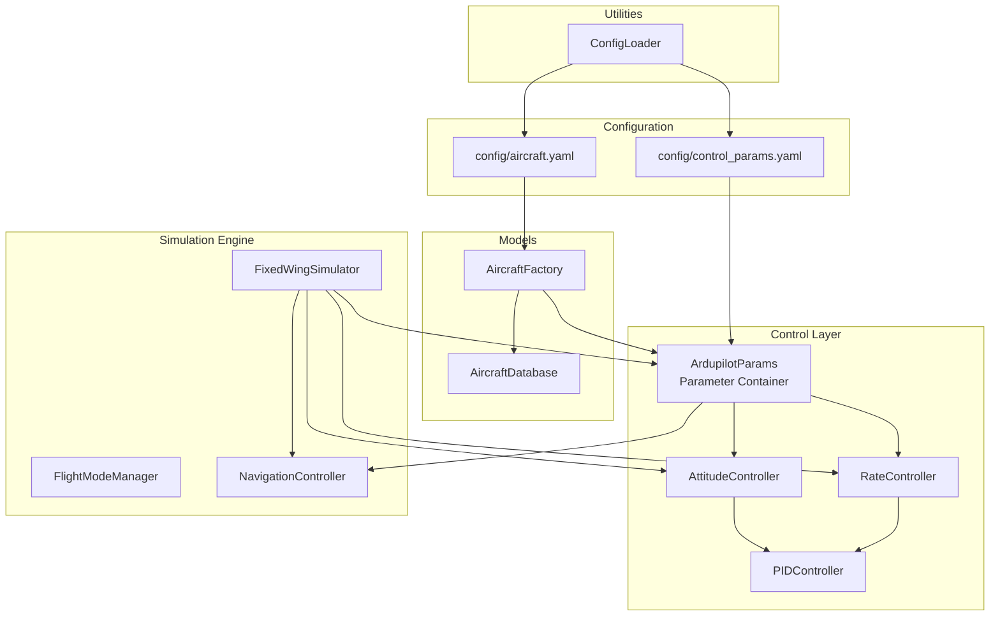
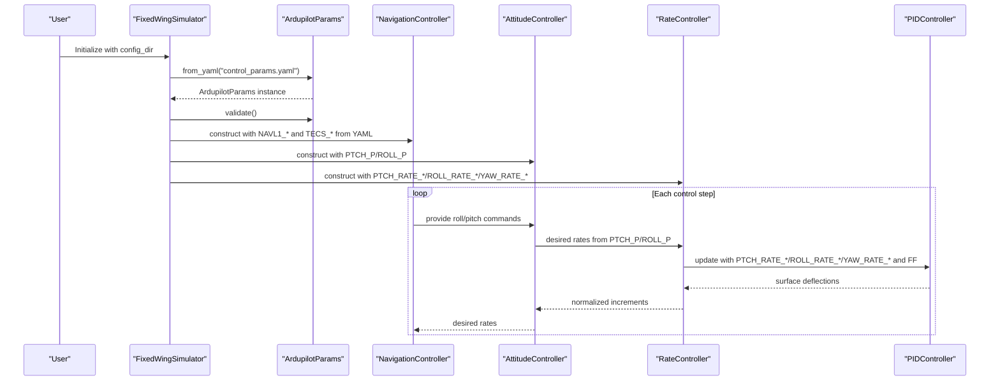
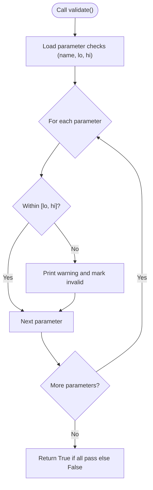
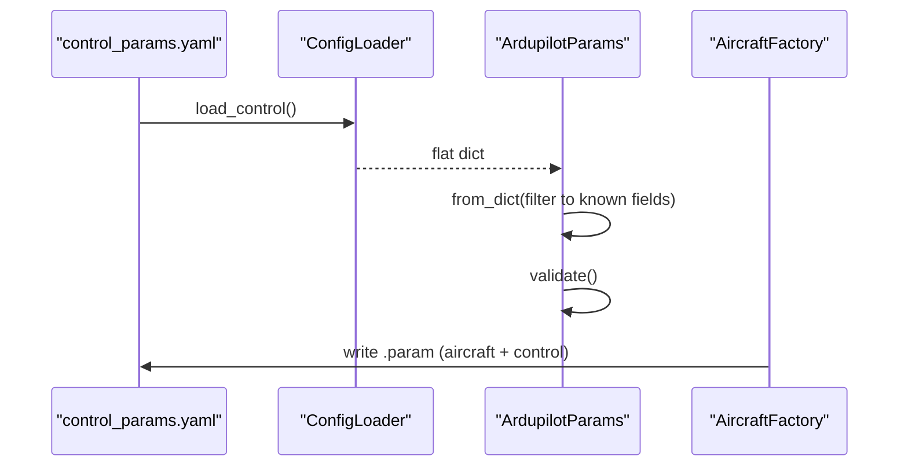
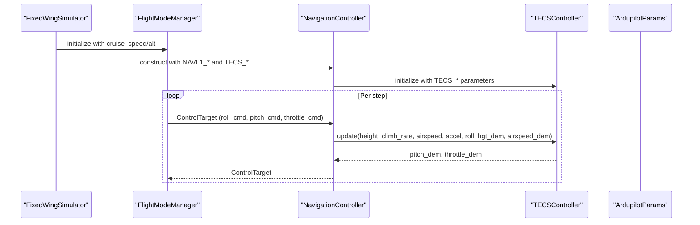
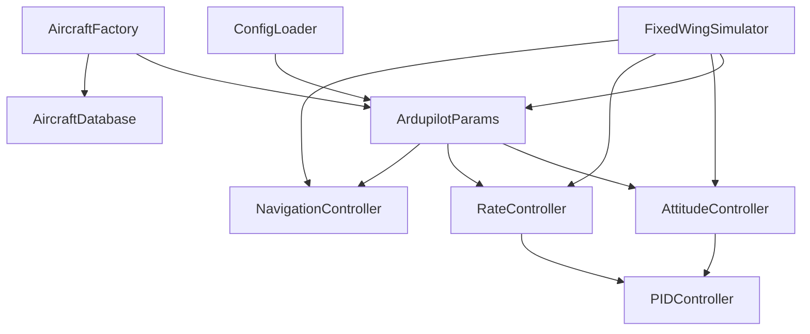

# ArduPilot Compatibility

<cite>
**Referenced Files in This Document**
- [ardupilot_compat.py](file://src/control/ardupilot_compat.py)
- [control_params.yaml](file://config/control_params.yaml)
- [simulator.py](file://src/simulation/simulator.py)
- [attitude_controller.py](file://src/control/attitude_controller.py)
- [rate_controller.py](file://src/control/rate_controller.py)
- [pid_controller.py](file://src/control/pid_controller.py)
- [aircraft_factory.py](file://src/models/aircraft_factory.py)
- [config_loader.py](file://src/utils/config_loader.py)
- [aircraft.yaml](file://config/aircraft.yaml)
- [aircraft_database.py](file://src/models/aircraft_database.py)
- [flight_mode_manager.py](file://src/control/flight_mode_manager.py)
- [navigation_controller.py](file://src/control/navigation_controller.py)
- [example_6_ardupilot_parameters.py](file://examples/6_ardupilot_parameters.py)
</cite>

## Table of Contents
1. [Introduction](#introduction)
2. [Project Structure](#project-structure)
3. [Core Components](#core-components)
4. [Architecture Overview](#architecture-overview)
5. [Detailed Component Analysis](#detailed-component-analysis)
6. [Dependency Analysis](#dependency-analysis)
7. [Performance Considerations](#performance-considerations)
8. [Troubleshooting Guide](#troubleshooting-guide)
9. [Conclusion](#conclusion)
10. [Appendices](#appendices)

## Introduction
This document explains the ArduPilot parameter compatibility and integration system in the FixedWingSimulator. It details how simulation parameters map to ArduPilot configuration standards, documents the compatibility layer implementation, parameter validation, and configuration translation mechanisms. It also explains how simulation parameters correspond to ArduPilot flight modes, PID gains, and control limits, and provides practical examples of parameter conversion, configuration validation, and external ArduPilot integration workflows. Finally, it covers parameter naming conventions, unit conversions, and compatibility considerations across ArduPilot versions, and highlights the benefits for hardware-in-the-loop testing and real-world validation.

## Project Structure
The ArduPilot compatibility system is centered in the control layer and integrates with the simulation engine, aircraft models, and configuration loaders. The primary entry point for ArduPilot-style parameters is the ArdupilotParams dataclass, which is loaded from a YAML file and validated before being injected into the control stack.

**Diagram sources**
- [ardupilot_compat.py](file://src/control/ardupilot_compat.py#L17-L130)
- [control_params.yaml](file://config/control_params.yaml#L1-L45)
- [simulator.py](file://src/simulation/simulator.py#L165-L216)
- [attitude_controller.py](file://src/control/attitude_controller.py#L33-L134)
- [rate_controller.py](file://src/control/rate_controller.py#L32-L109)
- [pid_controller.py](file://src/control/pid_controller.py#L17-L117)
- [aircraft_factory.py](file://src/models/aircraft_factory.py#L95-L136)
- [aircraft_database.py](file://src/models/aircraft_database.py#L143-L166)
- [config_loader.py](file://src/utils/config_loader.py#L59-L82)

**Section sources**
- [ardupilot_compat.py](file://src/control/ardupilot_compat.py#L17-L130)
- [control_params.yaml](file://config/control_params.yaml#L1-L45)
- [simulator.py](file://src/simulation/simulator.py#L165-L216)
- [config_loader.py](file://src/utils/config_loader.py#L59-L82)

## Core Components
- ArdupilotParams: A dataclass that mirrors ArduPilot Plane parameter names and units. It supports YAML import/export, basic validation, and convenience properties for unit conversions.
- Controllers: AttitudeController and RateController consume ArdupilotParams to configure PID gains and limits. PIDController implements ArduPilot-like control primitives with anti-windup and optional derivative filtering.
- Simulation Integration: FixedWingSimulator loads ArduPilotParams from YAML, validates them, and passes them to NavigationController, AttitudeController, RateController, and ServoMixer.
- Aircraft Export: AircraftFactory can export ArduPilot-compatible .param files combining aircraft geometry/inertia with control parameters.

Key parameter categories:
- Attitude axes: PTCH_P, ROLL_P (outer-loop P only)
- Rate axes: PTCH_RATE_*, ROLL_RATE_*, YAW_RATE_* (inner-loop P/I/D/FF)
- Limits: LIM_PITCH_MAX/MIN, LIM_ROLL_CD, THR_MAX/MIN
- Navigation: NAVL1_PERIOD, NAVL1_DAMPING
- Speed/altitude: AIRSPEED_CRUISE, ALT_HOLD_RTL
- TECS: TECS_* parameters for total energy control (loaded from YAML with defaults)

**Section sources**
- [ardupilot_compat.py](file://src/control/ardupilot_compat.py#L17-L60)
- [attitude_controller.py](file://src/control/attitude_controller.py#L33-L78)
- [rate_controller.py](file://src/control/rate_controller.py#L32-L64)
- [pid_controller.py](file://src/control/pid_controller.py#L17-L99)
- [simulator.py](file://src/simulation/simulator.py#L165-L216)
- [aircraft_factory.py](file://src/models/aircraft_factory.py#L95-L136)

## Architecture Overview
The ArduPilot-compatible parameter pipeline connects configuration files to the control layers and TECS, enabling ArduPilot-style flight modes and control loops.

**Diagram sources**
- [simulator.py](file://src/simulation/simulator.py#L165-L216)
- [attitude_controller.py](file://src/control/attitude_controller.py#L50-L122)
- [rate_controller.py](file://src/control/rate_controller.py#L46-L98)
- [pid_controller.py](file://src/control/pid_controller.py#L55-L98)

## Detailed Component Analysis

### Parameter Mapping and Naming Conventions
- Parameter names exactly mirror ArduPilot Plane conventions (e.g., PTCH_P, ROLL_RATE_P, YAW_RATE_FF, LIM_ROLL_CD).
- Units:
  - Angles: degrees for LIM_PITCH_* and LIM_ROLL_CD; convenience property LIM_ROLL_DEG converts centidegrees to degrees.
  - Airspeed: m/s (e.g., AIRSPEED_CRUISE).
  - Thrust/limits: 0–1 scale (THR_MIN/THR_MAX).
  - TECS parameters: m/s for rates, radians for pitch bounds, dimensionless multipliers.
- YAML mapping:
  - control_params.yaml provides a flat key-value structure aligned with ArduPilot parameter names.
  - TECS parameters are merged from YAML with sensible defaults when missing.

Practical mapping examples:
- Outer-loop attitude gains: PTCH_P and ROLL_P are used by AttitudeController to compute desired angular rates.
- Inner-loop rate gains: PTCH_RATE_*, ROLL_RATE_*, YAW_RATE_* are used by RateController via PIDController.
- Limits: LIM_PITCH_MAX/MIN and LIM_ROLL_CD constrain attitude and roll demand; THR_MIN/THR_MAX bound throttle.
- Navigation: NAVL1_PERIOD and NAVL1_DAMPING are passed to NavigationController; AIRSPEED_CRUISE and ALT_HOLD_RTL are used for cruise targets.

**Section sources**
- [ardupilot_compat.py](file://src/control/ardupilot_compat.py#L26-L60)
- [control_params.yaml](file://config/control_params.yaml#L1-L45)
- [attitude_controller.py](file://src/control/attitude_controller.py#L50-L77)
- [rate_controller.py](file://src/control/rate_controller.py#L46-L64)
- [navigation_controller.py](file://src/control/navigation_controller.py#L57-L82)

### Parameter Validation and Safety Limits
- Range checks: validate() ensures parameters fall within predefined safe ranges (e.g., gains, pitch/roll limits, throttle bounds, airspeed range).
- Warnings: out-of-range values trigger warnings; the system continues execution to allow interactive tuning.
- Safety enforcement: controllers enforce output limits (e.g., MAX_ROLL_RATE, MAX_PITCH_RATE, MAX_YAW_RATE) and PID output saturation.

Validation flow:

**Diagram sources**
- [ardupilot_compat.py](file://src/control/ardupilot_compat.py#L104-L130)

**Section sources**
- [ardupilot_compat.py](file://src/control/ardupilot_compat.py#L104-L130)
- [attitude_controller.py](file://src/control/attitude_controller.py#L45-L49)
- [rate_controller.py](file://src/control/rate_controller.py#L45-L46)

### Configuration Translation and YAML Integration
- Loading: ArdupilotParams.from_yaml() reads control_params.yaml and filters to known fields.
- Defaults: TECS parameters are loaded from YAML with fallback defaults in the simulator initialization.
- Export: AircraftFactory.export_ardupilot_params() writes an ArduPilot .param file combining aircraft geometry/inertia and control parameters.

Translation workflow:

**Diagram sources**
- [config_loader.py](file://src/utils/config_loader.py#L72-L73)
- [ardupilot_compat.py](file://src/control/ardupilot_compat.py#L74-L98)
- [aircraft_factory.py](file://src/models/aircraft_factory.py#L95-L136)

**Section sources**
- [ardupilot_compat.py](file://src/control/ardupilot_compat.py#L74-L98)
- [config_loader.py](file://src/utils/config_loader.py#L59-L82)
- [aircraft_factory.py](file://src/models/aircraft_factory.py#L95-L136)

### Flight Modes and TECS Integration
- FlightModeManager supports ArduPilot-style modes (MANUAL, STABILIZE, FBW_A, FBW_B, AUTO, LOITER, RTH).
- NavigationController implements L1 lateral navigation and TECS for altitude/airspeed control. It consumes NAVL1_* and TECS_* parameters and uses AIRSPEED_CRUISE and ALT_HOLD_RTL as defaults.
- Simulator wiring:
  - Loads ArduPilotParams and validates them.
  - Constructs NavigationController with NAVL1_* and TECS_* parameters.
  - Initializes AttitudeController and RateController with ArdupilotParams.
  - Uses LIM_ROLL_DEG to constrain roll demand.

**Diagram sources**
- [flight_mode_manager.py](file://src/control/flight_mode_manager.py#L115-L191)
- [navigation_controller.py](file://src/control/navigation_controller.py#L45-L115)
- [simulator.py](file://src/simulation/simulator.py#L165-L216)

**Section sources**
- [flight_mode_manager.py](file://src/control/flight_mode_manager.py#L28-L114)
- [navigation_controller.py](file://src/control/navigation_controller.py#L45-L115)
- [simulator.py](file://src/simulation/simulator.py#L165-L216)

### Practical Examples and Workflows
- Loading and validating ArduPilot parameters from YAML, exporting to .param format, and performing hot-reload of gains during simulation are demonstrated in the example script.
- Example workflow:
  - Load ArdupilotParams.from_yaml().
  - Validate with validate().
  - Export ArduPilot .param via AircraftFactory.export_ardupilot_params().
  - Adjust gains at runtime (e.g., sim.ap_params.PTCH_P) and call sim.att_ctrl.reload_gains(sim.ap_params).

**Section sources**
- [example_6_ardupilot_parameters.py](file://examples/6_ardupilot_parameters.py#L31-L76)
- [aircraft_factory.py](file://src/models/aircraft_factory.py#L95-L136)
- [attitude_controller.py](file://src/control/attitude_controller.py#L124-L127)

## Dependency Analysis
The ArduPilot compatibility layer exhibits clean separation of concerns:
- ArdupilotParams depends on YAML parsing and validation.
- Controllers depend on ArdupilotParams for parameter values.
- Simulator composes ArdupilotParams into NavigationController, AttitudeController, RateController, and ServoMixer.
- AircraftFactory depends on ArdupilotParams and aircraft database for exports.
- ConfigLoader provides unified YAML loading for aircraft and control parameters.

**Diagram sources**
- [ardupilot_compat.py](file://src/control/ardupilot_compat.py#L17-L130)
- [attitude_controller.py](file://src/control/attitude_controller.py#L33-L134)
- [rate_controller.py](file://src/control/rate_controller.py#L32-L109)
- [pid_controller.py](file://src/control/pid_controller.py#L17-L117)
- [navigation_controller.py](file://src/control/navigation_controller.py#L45-L115)
- [simulator.py](file://src/simulation/simulator.py#L165-L216)
- [aircraft_factory.py](file://src/models/aircraft_factory.py#L95-L136)
- [aircraft_database.py](file://src/models/aircraft_database.py#L143-L166)
- [config_loader.py](file://src/utils/config_loader.py#L59-L82)

**Section sources**
- [simulator.py](file://src/simulation/simulator.py#L165-L216)
- [aircraft_factory.py](file://src/models/aircraft_factory.py#L95-L136)

## Performance Considerations
- Dataclass efficiency: ArdupilotParams uses Python dataclasses for compact memory footprint and fast attribute access.
- Lazy validation: Parameters are validated once during load; controllers cache limits and gains.
- Minimal I/O: YAML loading occurs during initialization; runtime updates leverage hot-reload methods.
- Anti-windup and filtering: PIDController’s clamping-based anti-windup and optional derivative filtering reduce oscillations and improve stability under varying conditions.

[No sources needed since this section provides general guidance]

## Troubleshooting Guide
Common issues and resolutions:
- Parameter range warnings: Review validate() output and adjust gains or limits accordingly.
- File loading errors: Verify control_params.yaml exists and is valid YAML; check paths and permissions.
- Controller instability: Reduce integral gains or increase damping; confirm airspeed and throttle limits are appropriate for the aircraft.
- TECS overshoot: Tune TECS_* parameters (e.g., TECS_TIME_CONST, TECS_PTCH_DAMP) and verify cruise throttle alignment with trim.

**Section sources**
- [ardupilot_compat.py](file://src/control/ardupilot_compat.py#L104-L130)
- [example_6_ardupilot_parameters.py](file://examples/6_ardupilot_parameters.py#L36-L38)

## Conclusion
The ArduPilot compatibility system provides a robust bridge between simulation and real-world ArduPilot configurations. By mirroring parameter names, units, and control structures, it enables seamless integration, validation, and export workflows. This foundation supports hardware-in-the-loop testing and real-world validation by ensuring that simulation parameters translate directly into ArduPilot-compatible settings.

[No sources needed since this section summarizes without analyzing specific files]

## Appendices

### Parameter Conversion and Unit Conversions
- Roll angle conversion: LIM_ROLL_CD (centidegrees) → LIM_ROLL_DEG (degrees) via a convenience property.
- TECS pitch bounds: TECS_PITCH_MIN/TECS_PITCH_MAX are internally converted to radians when passed to TECS.
- Speed and altitude: AIRSPEED_CRUISE in m/s; ALT_HOLD_RTL in meters; used as cruise targets in NavigationController and TECS.

**Section sources**
- [ardupilot_compat.py](file://src/control/ardupilot_compat.py#L65-L68)
- [navigation_controller.py](file://src/control/navigation_controller.py#L104-L107)
- [simulator.py](file://src/simulation/simulator.py#L190-L212)

### Compatibility Across ArduPilot Versions
- The system aligns with ArduPilot Plane parameter naming and control hierarchy (attitude outer loop and rate inner loop).
- TECS parameters are mapped to ArduPilot TECS semantics (climb/sink rates, damping, integral gain, speed weight, roll-to-throttle compensation).
- Export to .param format enables direct use in ArduPilot GCS and firmware.

**Section sources**
- [aircraft_factory.py](file://src/models/aircraft_factory.py#L95-L136)
- [navigation_controller.py](file://src/control/navigation_controller.py#L64-L82)

### Benefits for Hardware-in-the-Loop Testing and Real-World Validation
- Parameter portability: control_params.yaml and exported .param files enable identical tuning across simulation and real vehicles.
- Flight mode fidelity: ArduPilot-style modes and TECS integration support realistic mission scenarios.
- Safety-first design: validation, limits, and anti-windup reduce risk during real-world trials.

[No sources needed since this section provides general guidance]