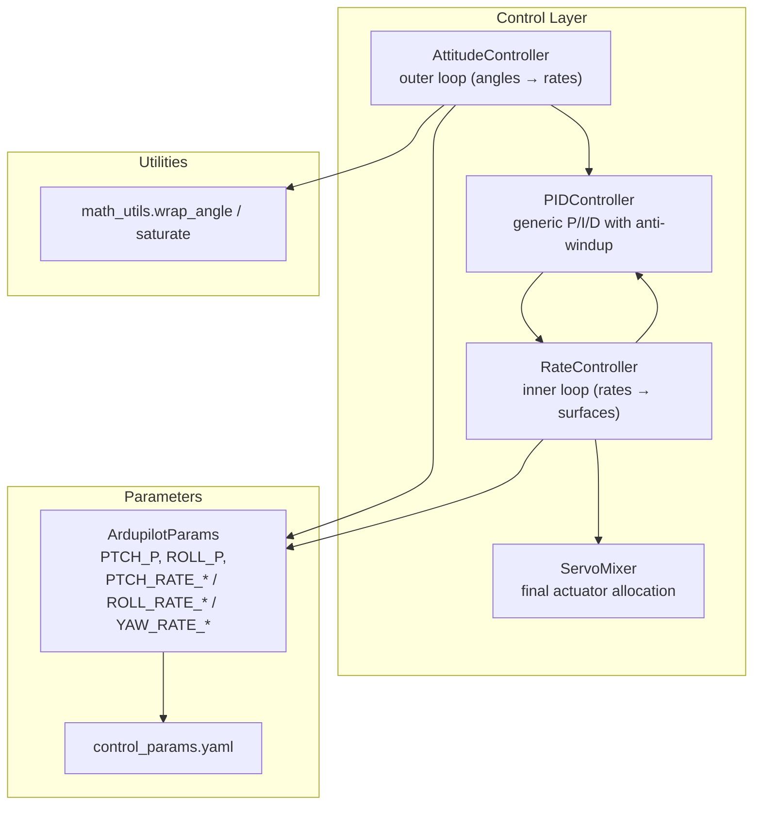
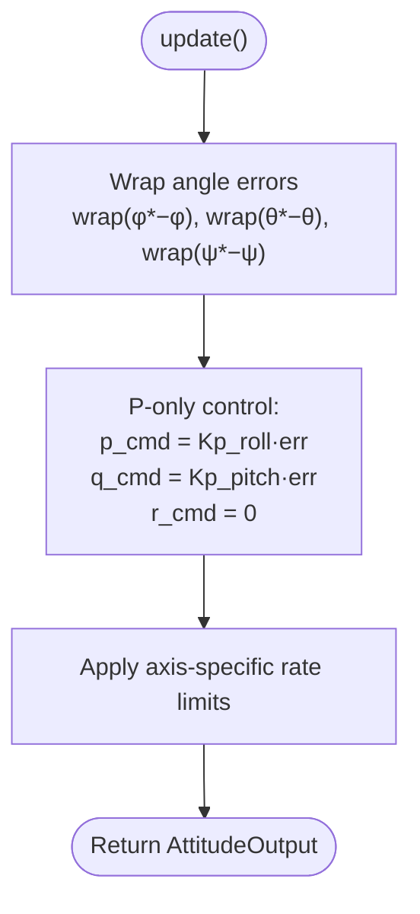
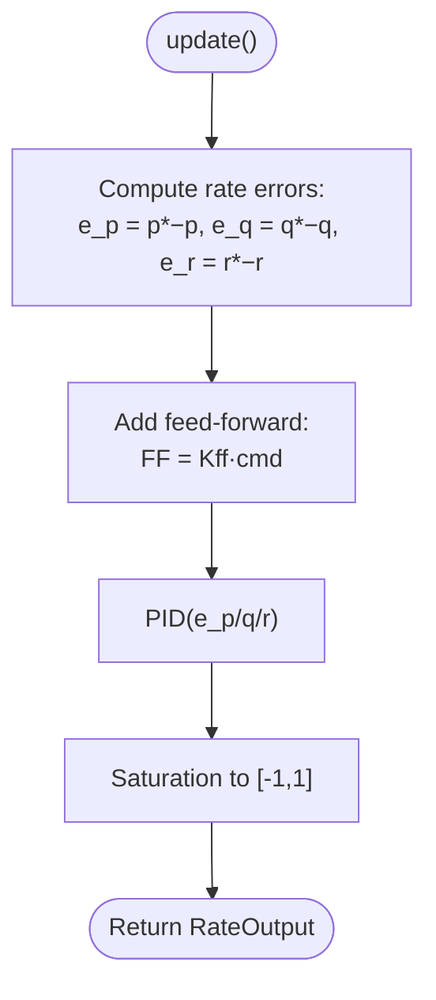
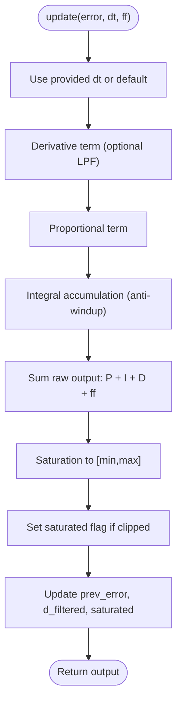
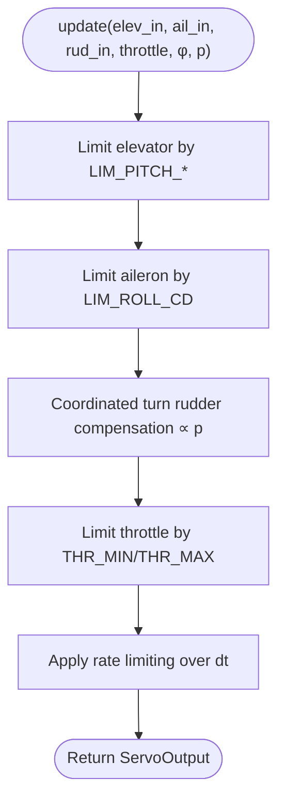
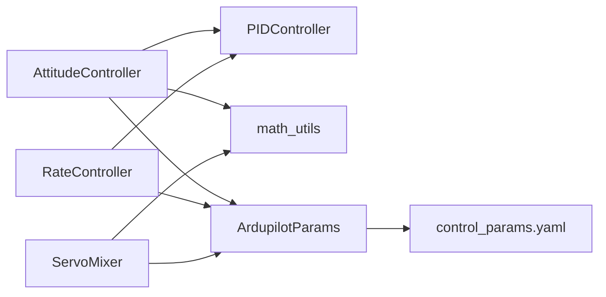

# Attitude and Rate Control

<cite>
**Referenced Files in This Document**
- [attitude_controller.py](file://src/control/attitude_controller.py)
- [rate_controller.py](file://src/control/rate_controller.py)
- [pid_controller.py](file://src/control/pid_controller.py)
- [ardupilot_compat.py](file://src/control/ardupilot_compat.py)
- [servo_mixer.py](file://src/control/servo_mixer.py)
- [math_utils.py](file://src/utils/math_utils.py)
- [control_params.yaml](file://config/control_params.yaml)
- [test_control.py](file://tests/test_control.py)
- [simulator.py](file://src/simulation/simulator.py)
</cite>

## Table of Contents
1. [Introduction](#introduction)
2. [Project Structure](#project-structure)
3. [Core Components](#core-components)
4. [Architecture Overview](#architecture-overview)
5. [Detailed Component Analysis](#detailed-component-analysis)
6. [Dependency Analysis](#dependency-analysis)
7. [Performance Considerations](#performance-considerations)
8. [Troubleshooting Guide](#troubleshooting-guide)
9. [Conclusion](#conclusion)
10. [Appendices](#appendices)

## Introduction
This document explains the attitude and rate control subsystems of the fixed-wing simulator. It focuses on the hierarchical control structure where attitude controllers generate rate commands, which are then processed by rate controllers. The document covers:
- PID controller implementation and anti-windup
- Attitude stabilization algorithms and angle wrapping
- Angular rate control loops and feed-forward
- Control law mathematics, parameter tuning, and stability considerations
- Practical examples for parameter optimization, loop configuration, and performance testing
- Control authority limits, saturation handling, and anti-windup mechanisms
- Relationship between attitude commands, rate commands, and control surface actuation

## Project Structure
The attitude and rate control logic resides in the control package and integrates with the broader simulation framework:
- Attitude controller: desired Euler angles → desired angular rates
- Rate controller: desired angular rates → normalized surface deflection increments
- PID controller: generic discrete-time PID with anti-windup and optional derivative filtering
- Servo mixer: final actuator allocation and output limiting
- ArduPilot parameter container: unified parameter naming and defaults
- Utilities: angle wrapping, saturation, and conversions



**Diagram sources**
- [attitude_controller.py](file://src/control/attitude_controller.py#L33-L134)
- [rate_controller.py](file://src/control/rate_controller.py#L32-L109)
- [pid_controller.py](file://src/control/pid_controller.py#L17-L117)
- [servo_mixer.py](file://src/control/servo_mixer.py#L54-L153)
- [ardupilot_compat.py](file://src/control/ardupilot_compat.py#L17-L130)
- [math_utils.py](file://src/utils/math_utils.py#L13-L25)
- [control_params.yaml](file://config/control_params.yaml#L1-L45)

**Section sources**
- [attitude_controller.py](file://src/control/attitude_controller.py#L1-L134)
- [rate_controller.py](file://src/control/rate_controller.py#L1-L109)
- [pid_controller.py](file://src/control/pid_controller.py#L1-L117)
- [servo_mixer.py](file://src/control/servo_mixer.py#L1-L153)
- [ardupilot_compat.py](file://src/control/ardupilot_compat.py#L1-L130)
- [math_utils.py](file://src/utils/math_utils.py#L1-L124)
- [control_params.yaml](file://config/control_params.yaml#L1-L45)

## Core Components
- AttitudeController: Implements three independent P controllers for roll, pitch, and yaw. Uses angle wrapping and axis-specific rate limits to produce desired angular rates.
- RateController: Implements three independent rate PIDs for pitch, roll, and yaw. Incorporates optional feed-forward terms and saturates outputs to [-1, 1].
- PIDController: Generic discrete-time PID with anti-windup, optional derivative low-pass filter, and runtime gain updates.
- ServoMixer: Final actuator allocator that applies amplitude limits, coordinated turn rudder compensation, and rate limiting before sending normalized control surfaces to the dynamics.

**Section sources**
- [attitude_controller.py](file://src/control/attitude_controller.py#L33-L134)
- [rate_controller.py](file://src/control/rate_controller.py#L32-L109)
- [pid_controller.py](file://src/control/pid_controller.py#L17-L117)
- [servo_mixer.py](file://src/control/servo_mixer.py#L54-L153)

## Architecture Overview
The control hierarchy follows ArduPilot conventions:
- Outer loop (AttitudeController): desired Euler angles → desired angular rates
- Inner loop (RateController): desired rates from outer loop + measured rates → normalized surface increments
- Actuator layer (ServoMixer): surface increments + throttle → final control surfaces and throttle

```mermaid
sequenceDiagram
participant Nav as "Navigation/Mode Layer"
participant Att as "AttitudeController"
participant Rate as "RateController"
participant Mix as "ServoMixer"
participant Dyn as "Dynamics"
Nav->>Att : "Desired Euler angles (φ*, θ*, ψ*)"
Att->>Att : "Compute errors with wrap_angle()"
Att->>Rate : "Desired rates (p*, q*, r*)"
Note over Att,Rate : "Outer loop : P-only for roll/pitch; yaw pass-through"
Rate->>Rate : "Compute rate errors (p*-p, q*-q, r*-r)"
Rate->>Rate : "Apply PID + optional feed-forward"
Rate->>Mix : "Normalized surface increments (elev, ail, rud)"
Mix->>Mix : "Amplitude limits, coordinated turn rudder, rate limiting"
Mix->>Dyn : "Final control surfaces and throttle"
```

**Diagram sources**
- [attitude_controller.py](file://src/control/attitude_controller.py#L81-L122)
- [rate_controller.py](file://src/control/rate_controller.py#L68-L98)
- [servo_mixer.py](file://src/control/servo_mixer.py#L80-L149)

## Detailed Component Analysis

### AttitudeController
- Purpose: Convert desired Euler angles to desired angular rates using P-only control.
- Control law:
  - Roll: p_cmd = Kp_roll · wrap(φ* − φ)
  - Pitch: q_cmd = Kp_pitch · wrap(θ* − θ)
  - Yaw: r_cmd = 0 (pass-through; no outer-loop in ArduPlane)
- Angle wrapping: Ensures error remains in [-π, π], preventing large-angle jumps.
- Output limits: Axis-specific maximum rates to prevent excessive demand.



**Diagram sources**
- [attitude_controller.py](file://src/control/attitude_controller.py#L107-L122)
- [math_utils.py](file://src/utils/math_utils.py#L13-L15)

**Section sources**
- [attitude_controller.py](file://src/control/attitude_controller.py#L33-L134)
- [math_utils.py](file://src/utils/math_utils.py#L13-L25)

### RateController
- Purpose: Inner-loop controller that stabilizes angular rates using P/I/D or P/I depending on axis.
- Control law:
  - Pitch: PID(q* − q) + feed-forward term
  - Roll: PID(p* − p) + feed-forward term
  - Yaw: PID(r* − r) + feed-forward term
- Feed-forward order: Applied before saturation to improve transient response.
- Output saturation: Normalized to [-1, 1] for control surfaces.



**Diagram sources**
- [rate_controller.py](file://src/control/rate_controller.py#L68-L98)
- [pid_controller.py](file://src/control/pid_controller.py#L55-L98)

**Section sources**
- [rate_controller.py](file://src/control/rate_controller.py#L32-L109)
- [pid_controller.py](file://src/control/pid_controller.py#L17-L117)

### PIDController
- Implementation highlights:
  - P/I/D terms computed separately
  - Anti-windup: integral accumulation stops when saturated; integral itself is clamped
  - Optional first-order derivative low-pass filter
  - Reset support for mode transitions
- Update flow:
  - Derivative computation with optional LPF
  - Proportional term
  - Integral accumulation with anti-windup and internal clamping
  - Sum total output, apply saturation, update saturated flag
  - Update previous error and filtered derivative



**Diagram sources**
- [pid_controller.py](file://src/control/pid_controller.py#L55-L98)

**Section sources**
- [pid_controller.py](file://src/control/pid_controller.py#L17-L117)

### ServoMixer
- Purpose: Final actuator allocation combining surface increments and throttle with:
  - Amplitude limits for elevator and aileron based on pitch/roll limits
  - Coordinated turn rudder compensation proportional to roll rate
  - Rate limiting to smooth control surface motion
- Output ranges:
  - Elevator/aileron/rudder: [-1, 1]
  - Throttle: [0, 1]



**Diagram sources**
- [servo_mixer.py](file://src/control/servo_mixer.py#L80-L149)

**Section sources**
- [servo_mixer.py](file://src/control/servo_mixer.py#L54-L153)

### Parameterization and Tuning
- ArduPilot-compatible parameters:
  - Attitude gains: PTCH_P, ROLL_P (P-only for outer loop)
  - Rate gains: PTCH_RATE_P/I/D, ROLL_RATE_P/I/D, YAW_RATE_P/I
  - Feed-forward: PTCH_RATE_FF, ROLL_RATE_FF, YAW_RATE_FF
  - Limits: LIM_PITCH_MAX/MIN, LIM_ROLL_CD, THR_MIN/THR_MAX
- Tuning procedure outline:
  - Outer loop (AttitudeController):
    - Start with modest PTCH_P and ROLL_P
    - Observe steady-state error and overshoot; increase P to reduce error, add I cautiously to eliminate offset
    - Ensure angle wrapping and axis-specific rate limits remain active
  - Inner loop (RateController):
    - Tune PTCH_RATE_P/I/D to achieve fast, stable response; use feed-forward to improve transient
    - Adjust ROLL_RATE_P/I/D for lateral stability; YAW_RATE_P/I for directional damping
    - Verify saturation and anti-windup behavior under large rate commands
  - Actuator limits:
    - Calibrate elevator/aileron limits using LIM_PITCH_* and LIM_ROLL_CD
    - Confirm coordinated turn compensation and rate limiting are effective
- Stability considerations:
  - Anti-windup prevents integrator wind-up during saturation
  - Derivative LPF reduces noise sensitivity
  - Feed-forward improves set-point tracking without increasing loop gain excessively

**Section sources**
- [ardupilot_compat.py](file://src/control/ardupilot_compat.py#L17-L130)
- [control_params.yaml](file://config/control_params.yaml#L1-L45)
- [attitude_controller.py](file://src/control/attitude_controller.py#L45-L77)
- [rate_controller.py](file://src/control/rate_controller.py#L51-L64)
- [pid_controller.py](file://src/control/pid_controller.py#L30-L46)

## Dependency Analysis
- AttitudeController depends on:
  - PIDController for P-only control
  - math_utils for angle wrapping and saturation
  - ArdupilotParams for PTCH_P and ROLL_P
- RateController depends on:
  - PIDController for P/I/D control
  - ArdupilotParams for PTCH_RATE_*, ROLL_RATE_*, YAW_RATE_* and feed-forward gains
- ServoMixer depends on:
  - ArdupilotParams for limits and throttle bounds
  - math_utils for saturation
- Parameter loading:
  - ArdupilotParams can be loaded from YAML and validated



**Diagram sources**
- [attitude_controller.py](file://src/control/attitude_controller.py#L20-L22)
- [rate_controller.py](file://src/control/rate_controller.py#L20-L21)
- [servo_mixer.py](file://src/control/servo_mixer.py#L19-L20)
- [ardupilot_compat.py](file://src/control/ardupilot_compat.py#L82-L98)

**Section sources**
- [attitude_controller.py](file://src/control/attitude_controller.py#L1-L134)
- [rate_controller.py](file://src/control/rate_controller.py#L1-L109)
- [servo_mixer.py](file://src/control/servo_mixer.py#L1-L153)
- [ardupilot_compat.py](file://src/control/ardupilot_compat.py#L1-L130)

## Performance Considerations
- Outer loop P control:
  - Fast response with potential steady-state error; use angle wrapping to avoid large-angle transients
- Inner loop PID:
  - Derivative LPF helps stabilize noisy measurements; anti-windup ensures robustness under saturation
  - Feed-forward improves set-point tracking without increasing loop gain risk
- Actuator constraints:
  - Amplitude limits and rate limiting prevent control saturation and mechanical stress
- Coupling and nonlinearity:
  - Fixed-wing dynamics are strongly coupled and nonlinear; separate-axis tuning and limits improve stability

[No sources needed since this section provides general guidance]

## Troubleshooting Guide
- Symptoms and causes:
  - Excessive overshoot in pitch/roll: Increase derivative gain or reduce P gain; verify feed-forward
  - Integrator wind-up: Ensure anti-windup is active; check saturation flags
  - Oscillations near limits: Reduce P/I gains; confirm amplitude and rate limits
  - Directional instability: Tune YAW_RATE_P/I; verify coordinated turn compensation
- Diagnostic steps:
  - Verify parameter ranges via ArdupilotParams.validate()
  - Use unit tests to confirm PID behavior, controller resets, and output clamping
  - Inspect angle wrapping and saturation in math_utils
- Recovery actions:
  - Hot-reload parameters via reload_gains() in controllers
  - Reset controllers on mode transitions using reset()

**Section sources**
- [ardupilot_compat.py](file://src/control/ardupilot_compat.py#L104-L129)
- [test_control.py](file://tests/test_control.py#L61-L148)
- [test_control.py](file://tests/test_control.py#L259-L305)
- [test_control.py](file://tests/test_control.py#L311-L371)
- [pid_controller.py](file://src/control/pid_controller.py#L100-L107)
- [attitude_controller.py](file://src/control/attitude_controller.py#L124-L133)
- [rate_controller.py](file://src/control/rate_controller.py#L100-L108)
- [servo_mixer.py](file://src/control/servo_mixer.py#L151-L153)

## Conclusion
The attitude and rate control subsystems implement a clear, layered control structure mirroring ArduPilot conventions. The outer loop translates desired Euler angles into desired angular rates using P-only control with angle wrapping and axis-specific limits. The inner loop stabilizes angular rates with PID control, optional feed-forward, and anti-windup. The final actuator stage applies amplitude and rate limits, coordinated turn compensation, and normalizes outputs for the dynamics. Proper tuning of PTCH_P, ROLL_P, and rate gains, combined with anti-windup and feed-forward, yields stable and responsive control across typical fixed-wing flight regimes.

[No sources needed since this section summarizes without analyzing specific files]

## Appendices

### Control Loop Configuration Example
- Typical configuration steps:
  - Load ArdupilotParams from YAML or defaults
  - Initialize AttitudeController and RateController with dt
  - Run closed-loop simulation; monitor saturation and limits
  - Adjust PTCH_P/ROLL_P for outer loop; tune PTCH_RATE_*/ROLL_RATE_*/YAW_RATE_* for inner loop
  - Calibrate elevator/aileron limits and coordinated turn compensation

**Section sources**
- [ardupilot_compat.py](file://src/control/ardupilot_compat.py#L82-L98)
- [simulator.py](file://src/simulation/simulator.py#L165-L171)

### Practical PID Parameter Optimization Workflow
- Procedure:
  - Start with conservative gains; verify validate() passes
  - Increase P until acceptable response; add I to remove offset; watch for wind-up
  - Add derivative to improve damping; apply LPF to reduce noise sensitivity
  - Introduce feed-forward gradually; verify it improves transient without causing overshoot
  - Confirm saturation and anti-windup behavior under large commands
  - Validate with unit tests and closed-loop runs

**Section sources**
- [pid_controller.py](file://src/control/pid_controller.py#L30-L46)
- [test_control.py](file://tests/test_control.py#L61-L148)

### Relationship Between Commands and Actuation
- Attitude commands: φ*, θ*, ψ* → desired rates p*, q*, r*
- Rate commands: p*, q*, r* → normalized surface increments (elev, ail, rud)
- Actuation: surface increments + throttle → final control surfaces and throttle

**Section sources**
- [attitude_controller.py](file://src/control/attitude_controller.py#L81-L122)
- [rate_controller.py](file://src/control/rate_controller.py#L68-L98)
- [servo_mixer.py](file://src/control/servo_mixer.py#L80-L149)