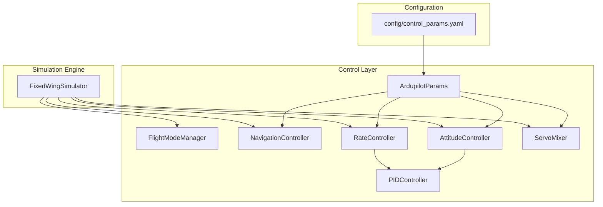
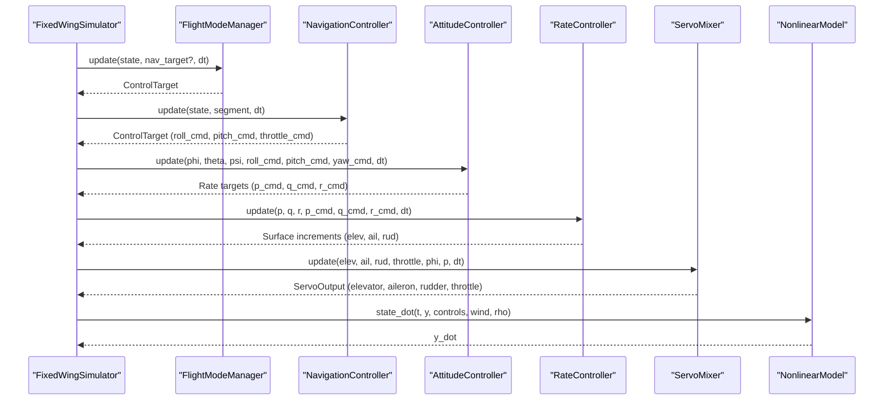
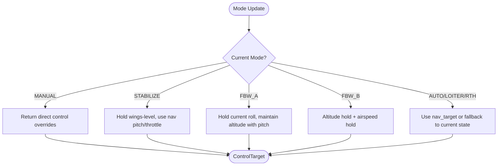
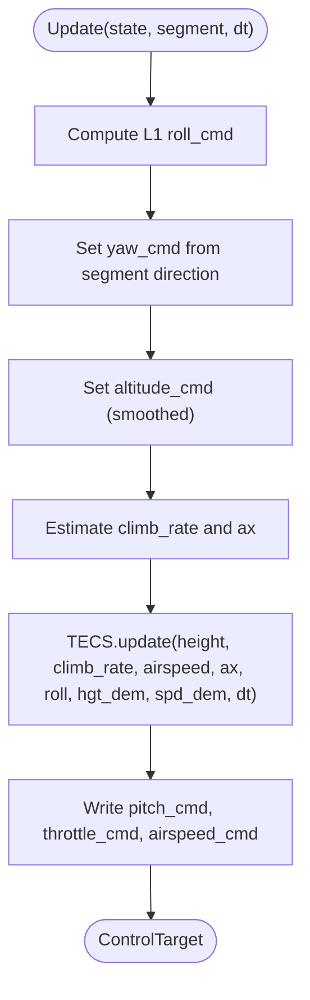
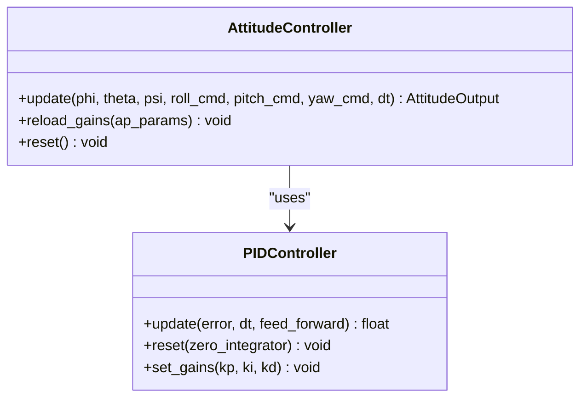
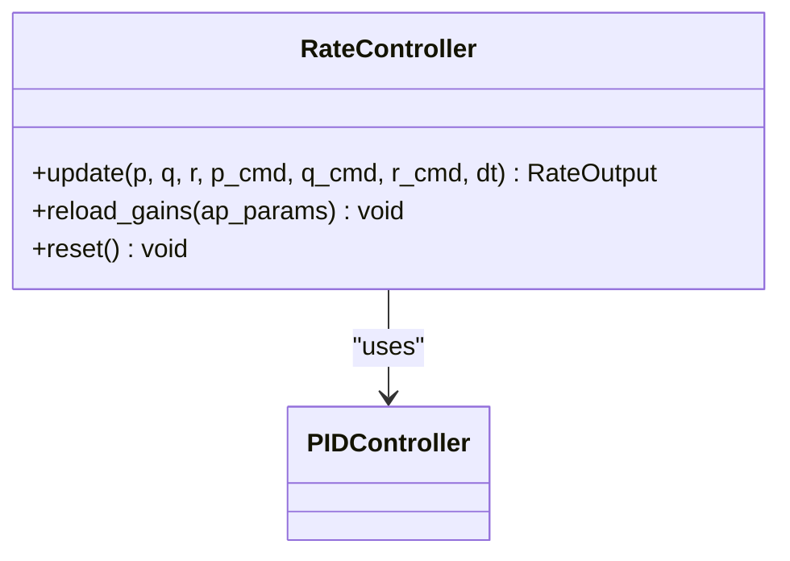
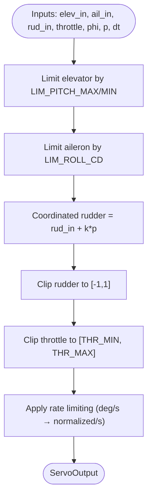
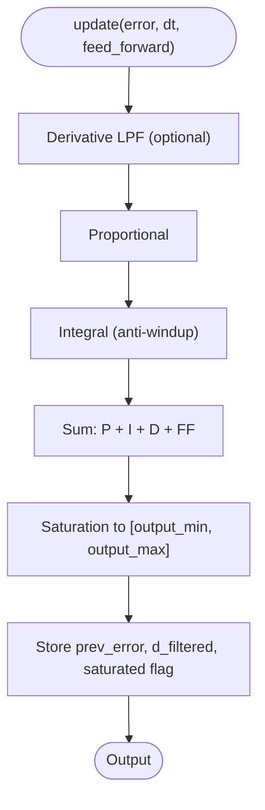
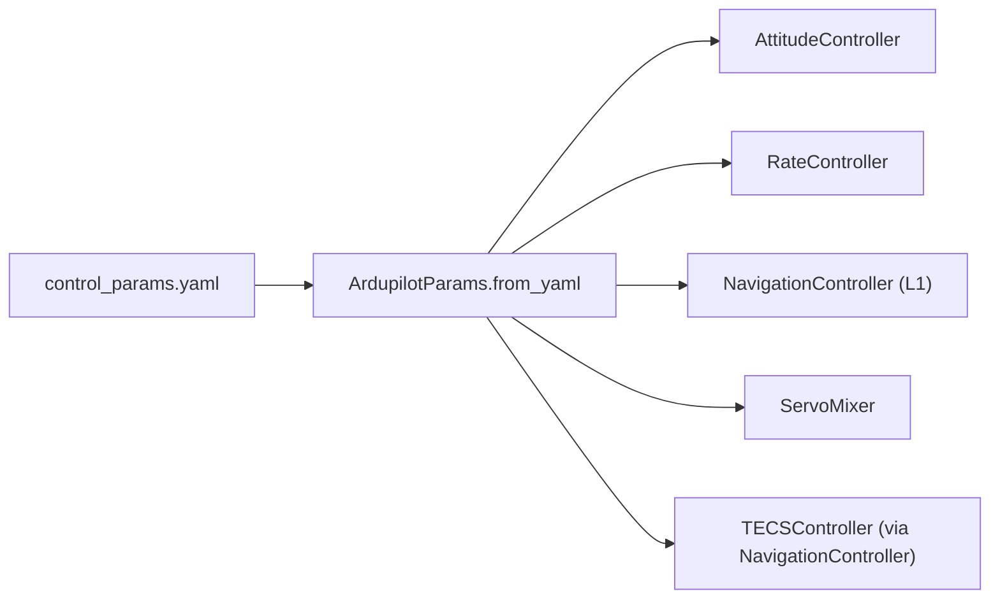
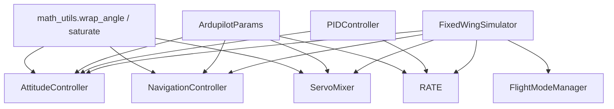

# Control Systems

<cite>
**Referenced Files in This Document**
- [src/control/__init__.py](file://src/control/__init__.py)
- [src/control/ardupilot_compat.py](file://src/control/ardupilot_compat.py)
- [src/control/flight_mode_manager.py](file://src/control/flight_mode_manager.py)
- [src/control/navigation_controller.py](file://src/control/navigation_controller.py)
- [src/control/attitude_controller.py](file://src/control/attitude_controller.py)
- [src/control/rate_controller.py](file://src/control/rate_controller.py)
- [src/control/tecs_controller.py](file://src/control/tecs_controller.py)
- [src/control/servo_mixer.py](file://src/control/servo_mixer.py)
- [src/control/pid_controller.py](file://src/control/pid_controller.py)
- [src/simulation/simulator.py](file://src/simulation/simulator.py)
- [config/control_params.yaml](file://config/control_params.yaml)
- [examples/example_6_ardupilot_parameters.py](file://examples/example_6_ardupilot_parameters.py)
- [doc/zh/content/控制系统/ArduPilot兼容参数.md](file://doc/zh/content/控制系统/ArduPilot兼容参数.md)
- [src/utils/math_utils.py](file://src/utils/math_utils.py)
</cite>

## Table of Contents
1. [Introduction](#introduction)
2. [Project Structure](#project-structure)
3. [Core Components](#core-components)
4. [Architecture Overview](#architecture-overview)
5. [Detailed Component Analysis](#detailed-component-analysis)
6. [Dependency Analysis](#dependency-analysis)
7. [Performance Considerations](#performance-considerations)
8. [Troubleshooting Guide](#troubleshooting-guide)
9. [Conclusion](#conclusion)
10. [Appendices](#appendices)

## Introduction
This document describes the five-layer ArduPilot-compatible control system implemented in the FixedWingSimulator. The control architecture follows ArduPilot’s hierarchical design and integrates seamlessly with the nonlinear 6-DOF dynamics model. The layers are:
- Flight mode management
- Navigation control (L1 guidance + TECS)
- Attitude control (angle loops)
- Rate control (SAS inner loop)
- Servo mixing and actuator allocation

The system supports ArduPilot parameter naming conventions, hot-reload of gains, and export to ArduPilot-compatible parameter formats. Practical examples demonstrate parameter mapping, tuning, and performance analysis.

## Project Structure
The control system resides under src/control and is orchestrated by the main simulator under src/simulation. Configuration is loaded from config/control_params.yaml and integrated into the simulation runtime.

**Diagram sources**
- [src/simulation/simulator.py](file://src/simulation/simulator.py#L165-L216)
- [src/control/__init__.py](file://src/control/__init__.py#L14-L23)
- [config/control_params.yaml](file://config/control_params.yaml#L1-L45)

**Section sources**
- [src/simulation/simulator.py](file://src/simulation/simulator.py#L165-L216)
- [src/control/__init__.py](file://src/control/__init__.py#L1-L24)

## Core Components
- ArdupilotParams: ArduPilot-compatible parameter container with YAML load/save and validation.
- FlightModeManager: Generates ControlTarget commands per flight mode (MANUAL, STABILIZE, FBW_A, FBW_B, AUTO, LOITER, RTH).
- NavigationController: Implements L1 lateral guidance and TECS for altitude and airspeed control.
- AttitudeController: Outer-loop angle-to-rate controllers using PTCH_P and ROLL_P.
- RateController: Inner-loop SAS with PTCH_RATE_* and ROLL/YAW_RATE_* gains and optional feedforward.
- ServoMixer: Final actuator mapping with amplitude limits, coordinated rudder, and rate limiting.
- PIDController: Generic PID with anti-windup and optional derivative filtering.

**Section sources**
- [src/control/ardupilot_compat.py](file://src/control/ardupilot_compat.py#L17-L130)
- [src/control/flight_mode_manager.py](file://src/control/flight_mode_manager.py#L115-L298)
- [src/control/navigation_controller.py](file://src/control/navigation_controller.py#L45-L293)
- [src/control/attitude_controller.py](file://src/control/attitude_controller.py#L33-L134)
- [src/control/rate_controller.py](file://src/control/rate_controller.py#L32-L109)
- [src/control/servo_mixer.py](file://src/control/servo_mixer.py#L54-L153)
- [src/control/pid_controller.py](file://src/control/pid_controller.py#L17-L117)

## Architecture Overview
The control system forms a closed-loop hierarchy. The simulator initializes parameters, builds controllers, and runs the 5-layer pipeline each time step.

**Diagram sources**
- [src/simulation/simulator.py](file://src/simulation/simulator.py#L329-L339)
- [src/control/flight_mode_manager.py](file://src/control/flight_mode_manager.py#L173-L212)
- [src/control/navigation_controller.py](file://src/control/navigation_controller.py#L134-L202)
- [src/control/attitude_controller.py](file://src/control/attitude_controller.py#L81-L122)
- [src/control/rate_controller.py](file://src/control/rate_controller.py#L68-L98)
- [src/control/servo_mixer.py](file://src/control/servo_mixer.py#L80-L149)

## Detailed Component Analysis

### Flight Mode Management
- Modes: MANUAL, STABILIZE, FBW_A, FBW_B, AUTO, LOITER, RTH.
- Transition bookkeeping and smooth mode entry.
- ControlTarget carries desired angles, rates, airspeed/altitude, throttle, and optional direct control overrides.

**Diagram sources**
- [src/control/flight_mode_manager.py](file://src/control/flight_mode_manager.py#L173-L298)

**Section sources**
- [src/control/flight_mode_manager.py](file://src/control/flight_mode_manager.py#L28-L114)
- [src/control/flight_mode_manager.py](file://src/control/flight_mode_manager.py#L115-L298)

### Navigation Control (L1 + TECS)
- L1 lateral guidance computes desired roll from look-ahead point and current ground track.
- TECS controls total energy to produce pitch and throttle commands for altitude and airspeed regulation.
- TECS includes underspeed detection, “bad descent” detection, and adaptive scalers for climb/sink limits.

**Diagram sources**
- [src/control/navigation_controller.py](file://src/control/navigation_controller.py#L134-L202)
- [src/control/tecs_controller.py](file://src/control/tecs_controller.py#L247-L315)

**Section sources**
- [src/control/navigation_controller.py](file://src/control/navigation_controller.py#L45-L293)
- [src/control/tecs_controller.py](file://src/control/tecs_controller.py#L50-L647)

### Attitude Control (Outer Loop)
- Independent P-only controllers for roll and pitch using PTCH_P and ROLL_P.
- Yaw loop configured as pass-through (no attitude outer loop in ArduPlane).
- Output limits for desired rates; errors are wrapped to [-π, π].

**Diagram sources**
- [src/control/attitude_controller.py](file://src/control/attitude_controller.py#L33-L134)
- [src/control/pid_controller.py](file://src/control/pid_controller.py#L17-L117)

**Section sources**
- [src/control/attitude_controller.py](file://src/control/attitude_controller.py#L33-L134)
- [src/utils/math_utils.py](file://src/utils/math_utils.py#L13-L25)

### Rate Control (Inner Loop SAS)
- P/I/D controllers for pitch, roll, and yaw using PTCH_RATE_*, ROLL_RATE_*, YAW_RATE_*.
- Feedforward terms added before saturation.
- Output saturated to [-1, 1] for surfaces.

**Diagram sources**
- [src/control/rate_controller.py](file://src/control/rate_controller.py#L32-L109)
- [src/control/pid_controller.py](file://src/control/pid_controller.py#L17-L117)

**Section sources**
- [src/control/rate_controller.py](file://src/control/rate_controller.py#L32-L109)

### Servo Mixing and Actuator Allocation
- Converts normalized increments to final servo commands.
- Applies pitch/roll limits from ArduPilotParams, coordinated turn rudder compensation, and rate limiting.
- Outputs elevator, aileron, rudder in [-1, 1] and throttle in [0, 1].

**Diagram sources**
- [src/control/servo_mixer.py](file://src/control/servo_mixer.py#L80-L149)

**Section sources**
- [src/control/servo_mixer.py](file://src/control/servo_mixer.py#L54-L153)

### PID Controller Implementation
- Discrete PID with clamping-based anti-windup.
- Optional first-order derivative low-pass filter.
- Supports feed-forward and runtime gain updates.

**Diagram sources**
- [src/control/pid_controller.py](file://src/control/pid_controller.py#L55-L98)

**Section sources**
- [src/control/pid_controller.py](file://src/control/pid_controller.py#L17-L117)

### Control Loop Configuration and Parameter Mapping
- ArduPilotParams mirrors ArduPilot Plane parameter names and provides YAML serialization/validation.
- Simulator loads control_params.yaml and passes parameters to controllers.
- TECS parameters are read from YAML with sensible defaults.

**Diagram sources**
- [config/control_params.yaml](file://config/control_params.yaml#L1-L45)
- [src/control/ardupilot_compat.py](file://src/control/ardupilot_compat.py#L74-L98)
- [src/simulation/simulator.py](file://src/simulation/simulator.py#L165-L216)

**Section sources**
- [src/control/ardupilot_compat.py](file://src/control/ardupilot_compat.py#L17-L130)
- [src/simulation/simulator.py](file://src/simulation/simulator.py#L165-L216)
- [config/control_params.yaml](file://config/control_params.yaml#L1-L45)

## Dependency Analysis
The control layer depends on shared math utilities for angle wrapping and saturation. The simulator composes all layers and feeds control outputs into the dynamics.

**Diagram sources**
- [src/utils/math_utils.py](file://src/utils/math_utils.py#L13-L25)
- [src/control/attitude_controller.py](file://src/control/attitude_controller.py#L108-L112)
- [src/control/navigation_controller.py](file://src/control/navigation_controller.py#L17-L22)
- [src/control/servo_mixer.py](file://src/control/servo_mixer.py#L16-L20)
- [src/simulation/simulator.py](file://src/simulation/simulator.py#L165-L216)

**Section sources**
- [src/utils/math_utils.py](file://src/utils/math_utils.py#L1-L124)
- [src/control/__init__.py](file://src/control/__init__.py#L1-L24)

## Performance Considerations
- TECS tuning emphasizes smoothness and robustness: increased TECS_TIME_CONST and TECS_THR_DAMP reduce oscillations; TECS_INTEG_GAIN reduced to prevent integral windup.
- L1 damping and period trade-off lateral aggressiveness vs. overshoot; higher damping reduces hunting.
- Rate controller gains should be tuned to avoid saturation; feedforward helps track rates without excessive integral accumulation.
- Servo rate limiting prevents unrealistic actuator motion; coordinated rudder improves turn quality.

[No sources needed since this section provides general guidance]

## Troubleshooting Guide
- Parameter validation warnings indicate out-of-range values; adjust control_params.yaml accordingly.
- If oscillations occur, reduce TECS_PTCH_DAMP or increase TECS_TIME_CONST; lower attitude/ rate gains progressively.
- For underspeed protection activation, verify TECS parameters and ensure adequate thrust; check TECS_THR_CRUISE alignment with trim.
- Mode transitions trigger controller resets; ensure gains are reloaded via reload_gains when hot-adjusting parameters.

**Section sources**
- [src/control/ardupilot_compat.py](file://src/control/ardupilot_compat.py#L104-L130)
- [src/control/tecs_controller.py](file://src/control/tecs_controller.py#L635-L647)
- [examples/example_6_ardupilot_parameters.py](file://examples/example_6_ardupilot_parameters.py#L36-L38)

## Conclusion
The FixedWingSimulator implements a robust, ArduPilot-compatible five-layer control system. It leverages validated parameter conventions, modular controllers, and a realistic nonlinear dynamics model. The architecture supports safe tuning, hot-reload of gains, and export to ArduPilot formats, enabling both research and practical control development.

[No sources needed since this section summarizes without analyzing specific files]

## Appendices

### Practical Setup and Tuning Examples
- Load and validate ArduPilot parameters from YAML; export ArduPilot-compatible .param files.
- Sensitivity analysis of PTCH_P demonstrates impact on pitch response and altitude tracking.
- Adjust TECS_CLMB_MAX, TECS_SINK_MAX, TECS_TIME_CONST, TECS_THR_DAMP, and TECS_INTEG_GAIN for smoother energy management.

**Section sources**
- [examples/example_6_ardupilot_parameters.py](file://examples/example_6_ardupilot_parameters.py#L23-L85)
- [config/control_params.yaml](file://config/control_params.yaml#L30-L45)
- [doc/zh/content/控制系统/ArduPilot兼容参数.md](file://doc/zh/content/控制系统/ArduPilot兼容参数.md#L424-L462)

### Control Targets and Command Conversion
- ControlTarget defines desired angles, rates, airspeed/altitude, throttle, and optional direct control overrides.
- NavigationController produces roll_cmd, yaw_cmd, pitch_cmd, throttle_cmd, and airspeed_cmd from path segments and TECS.
- AttitudeController converts desired angles to desired rates; RateController produces normalized surface increments; ServoMixer yields final actuator commands.

**Section sources**
- [src/control/flight_mode_manager.py](file://src/control/flight_mode_manager.py#L82-L113)
- [src/control/navigation_controller.py](file://src/control/navigation_controller.py#L134-L202)
- [src/control/attitude_controller.py](file://src/control/attitude_controller.py#L81-L122)
- [src/control/rate_controller.py](file://src/control/rate_controller.py#L68-L98)
- [src/control/servo_mixer.py](file://src/control/servo_mixer.py#L80-L149)

### Stability and Response Characteristics
- TECS employs underspeed and “bad descent” detection to protect against unsafe regimes.
- Anti-windup in PID prevents integrator windup under saturation.
- Angle wrapping ensures control errors remain bounded; saturation limits prevent actuator saturation.

**Section sources**
- [src/control/tecs_controller.py](file://src/control/tecs_controller.py#L432-L444)
- [src/control/tecs_controller.py](file://src/control/tecs_controller.py#L635-L647)
- [src/control/pid_controller.py](file://src/control/pid_controller.py#L83-L98)
- [src/utils/math_utils.py](file://src/utils/math_utils.py#L13-L25)