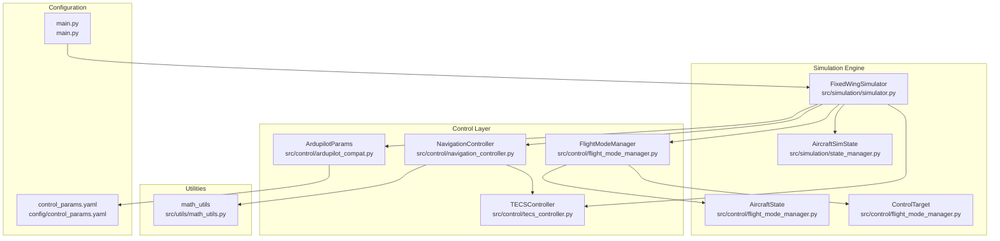
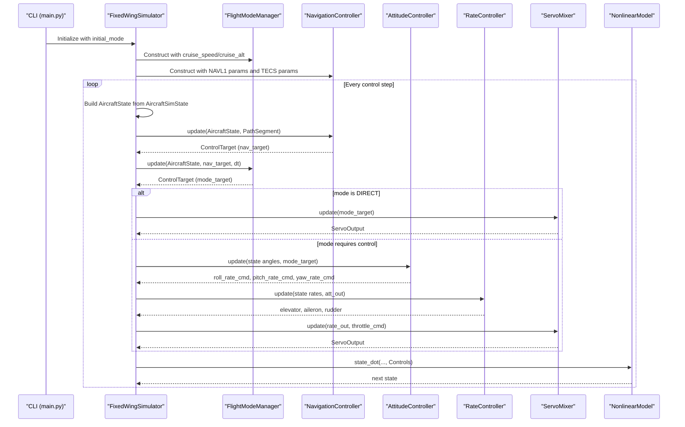
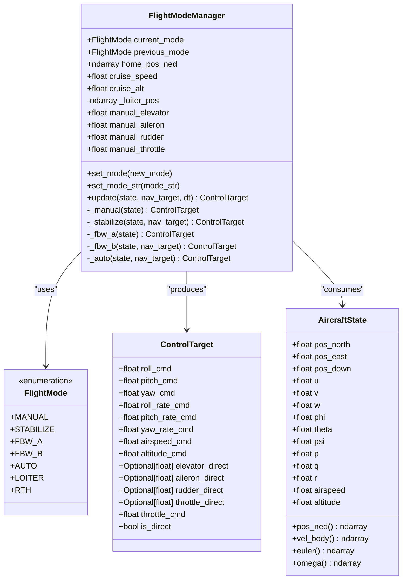
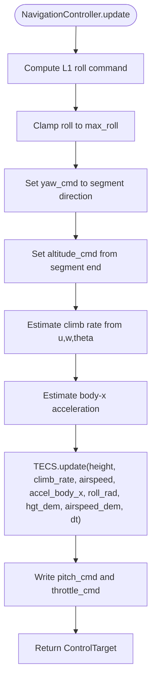
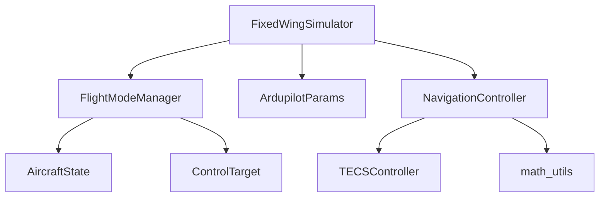

# Flight Mode Management

<cite>
**Referenced Files in This Document**
- [flight_mode_manager.py](file://src/control/flight_mode_manager.py)
- [ardupilot_compat.py](file://src/control/ardupilot_compat.py)
- [navigation_controller.py](file://src/control/navigation_controller.py)
- [tecs_controller.py](file://src/control/tecs_controller.py)
- [simulator.py](file://src/simulation/simulator.py)
- [state_manager.py](file://src/simulation/state_manager.py)
- [math_utils.py](file://src/utils/math_utils.py)
- [control_params.yaml](file://config/control_params.yaml)
- [main.py](file://main.py)
</cite>

## Table of Contents
1. [Introduction](#introduction)
2. [Project Structure](#project-structure)
3. [Core Components](#core-components)
4. [Architecture Overview](#architecture-overview)
5. [Detailed Component Analysis](#detailed-component-analysis)
6. [Dependency Analysis](#dependency-analysis)
7. [Performance Considerations](#performance-considerations)
8. [Troubleshooting Guide](#troubleshooting-guide)
9. [Conclusion](#conclusion)
10. [Appendices](#appendices)

## Introduction
This document describes the five-layer ArduPilot-compatible flight mode management system implemented in the FixedWingSimulator. It covers the FlightModeManager class, the ControlTarget data structure, and the AircraftState dataclass used for mode decision-making. It explains how modes are selected and executed, how navigation controllers integrate with the mode manager, and how parameters are configured to achieve stable and predictable behavior across MANUAL, STABILIZE, FBW_A, FBW_B, AUTO, LOITER, and RTH modes. Practical examples demonstrate mode switching, parameter configuration, and integration with the control layers.

## Project Structure
The flight mode management system resides in the control subsystem and integrates with the simulation engine and navigation controllers. The main entry point demonstrates how modes are selected at startup.

**Diagram sources**
- [flight_mode_manager.py](file://src/control/flight_mode_manager.py#L115-L298)
- [navigation_controller.py](file://src/control/navigation_controller.py#L45-L293)
- [tecs_controller.py](file://src/control/tecs_controller.py#L50-L647)
- [simulator.py](file://src/simulation/simulator.py#L115-L642)
- [state_manager.py](file://src/simulation/state_manager.py#L16-L94)
- [ardupilot_compat.py](file://src/control/ardupilot_compat.py#L17-L130)
- [math_utils.py](file://src/utils/math_utils.py#L1-L124)
- [control_params.yaml](file://config/control_params.yaml#L1-L45)
- [main.py](file://main.py#L98-L145)

**Section sources**
- [flight_mode_manager.py](file://src/control/flight_mode_manager.py#L1-L298)
- [simulator.py](file://src/simulation/simulator.py#L115-L642)
- [main.py](file://main.py#L98-L145)

## Core Components
- FlightModeManager: Orchestrates mode selection and computes ControlTarget for each control step. It supports MANUAL, STABILIZE, FBW_A, FBW_B, AUTO, LOITER, and RTH.
- ControlTarget: A data structure carrying desired angles, rates, speeds, altitudes, and throttle commands. It also supports direct control overrides for MANUAL mode.
- AircraftState: A minimal snapshot of the aircraft’s state (position, velocity, attitude, angular rates, airspeed, altitude) used by the mode manager and navigation controller.
- NavigationController: Implements L1 lateral guidance and TECS altitude/airspeed control, producing ControlTarget for AUTO/LOITER/RTH.
- TECSController: Implements ArduPilot-compatible Total Energy Control System for altitude and airspeed regulation.
- ArdupilotParams: Parameter container mirroring ArduPilot naming conventions, loaded from YAML and validated.

**Section sources**
- [flight_mode_manager.py](file://src/control/flight_mode_manager.py#L28-L298)
- [navigation_controller.py](file://src/control/navigation_controller.py#L45-L293)
- [tecs_controller.py](file://src/control/tecs_controller.py#L50-L647)
- [ardupilot_compat.py](file://src/control/ardupilot_compat.py#L17-L130)

## Architecture Overview
The control loop integrates the mode manager with navigation and control layers. The simulator constructs the mode manager and navigation controller from ArduPilot-compatible parameters, then at each step:
- Converts the full simulation state to AircraftState for the control system.
- Computes a navigation target (ControlTarget) from NavigationController.
- Calls FlightModeManager.update to produce a ControlTarget for the current mode.
- Executes attitude and rate control, then servo mixing to produce normalized servo outputs.
- Converts normalized servo outputs to physical controls and advances the dynamics.

**Diagram sources**
- [simulator.py](file://src/simulation/simulator.py#L416-L565)
- [flight_mode_manager.py](file://src/control/flight_mode_manager.py#L173-L298)
- [navigation_controller.py](file://src/control/navigation_controller.py#L134-L202)
- [tecs_controller.py](file://src/control/tecs_controller.py#L247-L315)

## Detailed Component Analysis

### FlightModeManager
- Responsibilities:
  - Tracks current and previous mode.
  - Transitions modes and logs transitions.
  - Computes ControlTarget for each mode.
  - Captures loiter center on entry to LOITER.
  - Exposes manual stick inputs for MANUAL mode.
- Modes:
  - MANUAL: Direct pass-through of stick inputs; sets is_direct=True.
  - STABILIZE: Hold wings-level; uses nav_target pitch/throttle/altitude if provided.
  - FBW_A: Hold current roll, maintain altitude with pitch; simulate stick-to-angle behavior.
  - FBW_B: Altitude hold + airspeed hold; uses nav_target pitch/throttle/altitude if provided.
  - AUTO/LOITER/RTH: Use nav_target if available; fallback to hold current state; LOITER captures center on first update; RTH builds a nav_target with cruise altitude if none provided.
- Transition logic:
  - set_mode updates previous/current mode and resets loiter capture on LOITER entry.
  - update dispatches to per-mode handlers; fallback returns cruise-speed/cruise-altitude targets.

**Diagram sources**
- [flight_mode_manager.py](file://src/control/flight_mode_manager.py#L28-L298)

**Section sources**
- [flight_mode_manager.py](file://src/control/flight_mode_manager.py#L115-L298)

### ControlTarget Data Structure
- Purpose: Carries desired commands from the mode manager to the control layers.
- Fields:
  - Desired angles and rates for attitude control.
  - Airspeed and altitude targets.
  - Optional direct control overrides for MANUAL mode.
  - Throttle command and a flag indicating whether to bypass attitude/rate control.

Integration:
- Mode manager produces ControlTarget for each mode.
- Navigation controller writes lateral roll and yaw commands and altitude/airspeed targets.
- Attitude and rate controllers consume ControlTarget to compute actuator commands.

**Section sources**
- [flight_mode_manager.py](file://src/control/flight_mode_manager.py#L82-L113)

### AircraftState Dataclass
- Purpose: Minimal snapshot of the aircraft’s state for control decisions.
- Provides convenient properties for position, velocity, Euler angles, and angular rates.
- Used by FlightModeManager and NavigationController.

**Section sources**
- [flight_mode_manager.py](file://src/control/flight_mode_manager.py#L38-L80)
- [state_manager.py](file://src/simulation/state_manager.py#L16-L94)

### NavigationController and TECS
- NavigationController:
  - Implements L1 lateral navigation law and TECS altitude/airspeed control.
  - Produces ControlTarget with roll_cmd, yaw_cmd, pitch_cmd, throttle_cmd, airspeed_cmd, altitude_cmd.
  - Uses PathSegment to define desired path and target speed.
- TECSController:
  - Implements ArduPilot-style Total Energy Control System.
  - Computes throttle and pitch commands from height, climb rate, airspeed, and demands.
  - Includes underspeed detection, bad descent detection, and energy shaping.

**Diagram sources**
- [navigation_controller.py](file://src/control/navigation_controller.py#L134-L202)
- [tecs_controller.py](file://src/control/tecs_controller.py#L247-L315)

**Section sources**
- [navigation_controller.py](file://src/control/navigation_controller.py#L45-L293)
- [tecs_controller.py](file://src/control/tecs_controller.py#L50-L647)

### Mode-Specific Behaviors and Defaults
- MANUAL:
  - Direct stick-to-servo pass-through; is_direct=True.
  - Manual inputs are stored in FlightModeManager and applied in _manual.
- STABILIZE:
  - Hold wings-level (roll_cmd=0); use nav_target pitch/throttle/altitude if provided.
  - Uses cruise_speed and cruise_alt as fallbacks.
- FBW_A:
  - Hold current roll and maintain altitude with pitch; simulate stick-to-angle behavior.
  - Uses cruise_speed and cruise_alt as fallbacks.
- FBW_B:
  - Altitude hold + airspeed hold; use nav_target pitch/throttle/altitude if provided.
  - Uses cruise_speed and cruise_alt as fallbacks.
- AUTO/LOITER/RTH:
  - Use nav_target if provided; fallback to hold current state.
  - LOITER captures center on first update; RTH builds a nav_target with cruise altitude if none provided.

Parameter defaults:
- Cruise speed and altitude are taken from ArduPilotParams (AIRSPEED_CRUISE and ALT_HOLD_RTL).
- Navigation parameters (NAVL1_PERIOD, NAVL1_DAMPING) and TECS parameters are loaded from control_params.yaml.

**Section sources**
- [flight_mode_manager.py](file://src/control/flight_mode_manager.py#L194-L298)
- [ardupilot_compat.py](file://src/control/ardupilot_compat.py#L17-L130)
- [control_params.yaml](file://config/control_params.yaml#L1-L45)

### Integration with Simulation Engine
- FixedWingSimulator constructs FlightModeManager and NavigationController using ArduPilot-compatible parameters.
- At each step, it converts AircraftSimState to AircraftState, computes nav_target, calls FlightModeManager.update, and executes the control layers.
- Servo outputs are converted to Controls and passed to the dynamics.

**Section sources**
- [simulator.py](file://src/simulation/simulator.py#L173-L233)
- [simulator.py](file://src/simulation/simulator.py#L416-L565)

## Dependency Analysis
- FlightModeManager depends on:
  - AircraftState and ControlTarget for I/O.
  - ArduPilot parameter defaults for cruise speed/altitude.
- NavigationController depends on:
  - TECSController for altitude/airspeed control.
  - math_utils for angle wrapping and saturation.
- Simulator orchestrates:
  - FlightModeManager, NavigationController, AttitudeController, RateController, ServoMixer, and NonlinearModel.
  - Loads ArduPilotParams from YAML and validates them.

**Diagram sources**
- [flight_mode_manager.py](file://src/control/flight_mode_manager.py#L115-L298)
- [navigation_controller.py](file://src/control/navigation_controller.py#L45-L293)
- [tecs_controller.py](file://src/control/tecs_controller.py#L50-L647)
- [simulator.py](file://src/simulation/simulator.py#L173-L233)

**Section sources**
- [simulator.py](file://src/simulation/simulator.py#L173-L233)
- [ardupilot_compat.py](file://src/control/ardupilot_compat.py#L74-L98)

## Performance Considerations
- TECS smoothing and rate limiting:
  - TECS uses time constants and damping gains to reduce oscillations and improve stability.
  - Height demand is low-pass filtered to prevent abrupt jumps.
- L1 guidance:
  - Look-ahead distance scales with airspeed; prevents overshoot and improves tracking.
- Mode transitions:
  - The mode manager does not implement explicit transition smoothing; transitions occur on mode set. For smoother transitions, consider interpolating ControlTarget values across a short window during mode changes.
- Parameter tuning:
  - NAVL1 damping and period influence lateral stability and aggressiveness.
  - TECS time constant and damping influence vertical response smoothness.

[No sources needed since this section provides general guidance]

## Troubleshooting Guide
- Mode not switching:
  - Ensure set_mode or set_mode_str is called with a different mode than current_mode.
  - Verify that the simulator loop calls FlightModeManager.update each step.
- Stalls or oscillations:
  - Check TECS parameters (time constant, damping, pitch limits).
  - Verify NAVL1 damping and period.
  - Confirm airspeed limits and cruise throttle are reasonable for the aircraft.
- Unexpected altitude behavior:
  - Confirm ALT_HOLD_RTL and AIRSPEED_CRUISE in control_params.yaml.
  - Ensure TECS thr_cruise aligns with computed trim.
- Overshoot or undershoot in AUTO/LOITER/RTH:
  - Adjust TECS sink/climb rates and speed weight.
  - Verify PathSegment altitudes and target speeds.

**Section sources**
- [ardupilot_compat.py](file://src/control/ardupilot_compat.py#L104-L129)
- [navigation_controller.py](file://src/control/navigation_controller.py#L120-L131)
- [tecs_controller.py](file://src/control/tecs_controller.py#L197-L246)

## Conclusion
The flight mode management system provides a clean, ArduPilot-compatible framework for fixed-wing control. FlightModeManager encapsulates mode selection and ControlTarget production, while NavigationController and TECS deliver robust lateral and vertical control. Parameters are configurable via YAML and validated for safe operation. Together, these components enable stable AUTO, LOITER, and RTH behaviors, as well as pilot-in-the-loop modes like MANUAL, STABILIZE, and FBW_A/B.

[No sources needed since this section summarizes without analyzing specific files]

## Appendices

### Practical Examples

- Mode switching at runtime:
  - Call FlightModeManager.set_mode or set_mode_str with a new FlightMode to trigger a transition. The manager logs the transition and prepares mode-specific state (e.g., capturing loiter center).
  - Example invocation path: [flight_mode_manager.py](file://src/control/flight_mode_manager.py#L152-L167)

- Parameter configuration:
  - Configure ArduPilot-compatible parameters in control_params.yaml (e.g., NAVL1_PERIOD, NAVL1_DAMPING, TECS_*).
  - Load and validate parameters via ArdupilotParams.from_yaml and validate.
  - Example path: [ardupilot_compat.py](file://src/control/ardupilot_compat.py#L82-L98), [ardupilot_compat.py](file://src/control/ardupilot_compat.py#L104-L129)
  - Example YAML: [control_params.yaml](file://config/control_params.yaml#L1-L45)

- Integration with navigation controllers:
  - Build a PathSegment and call NavigationController.update to produce ControlTarget for AUTO/LOITER/RTH.
  - Example path: [navigation_controller.py](file://src/control/navigation_controller.py#L134-L202)

- Starting with a specific mode:
  - Use the CLI to select initial mode; the simulator constructs FlightModeManager with the chosen mode.
  - Example path: [main.py](file://main.py#L45-L48), [simulator.py](file://src/simulation/simulator.py#L174-L179)

- Mode-specific defaults:
  - Cruise speed and altitude defaults come from ArduPilotParams; fallback targets are produced when no nav_target is provided.
  - Example path: [flight_mode_manager.py](file://src/control/flight_mode_manager.py#L210-L211), [ardupilot_compat.py](file://src/control/ardupilot_compat.py#L58-L59)