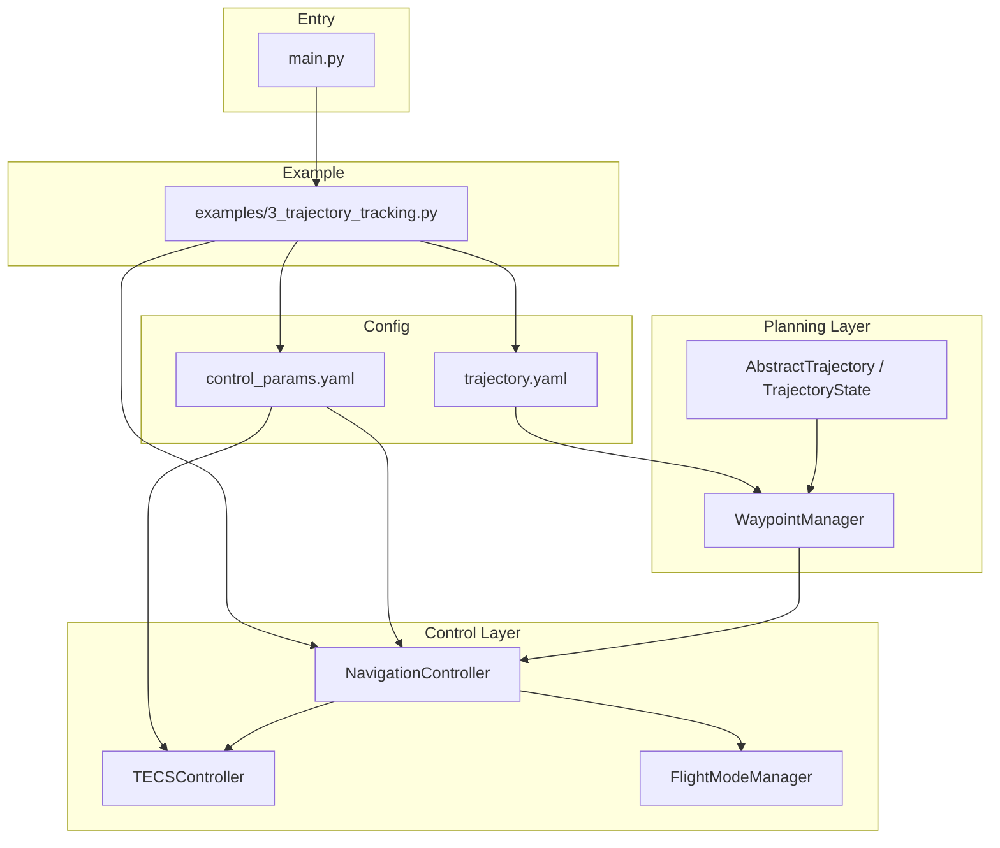
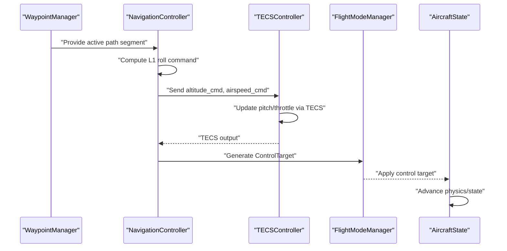
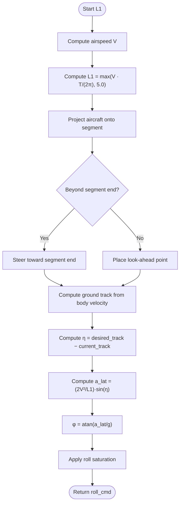
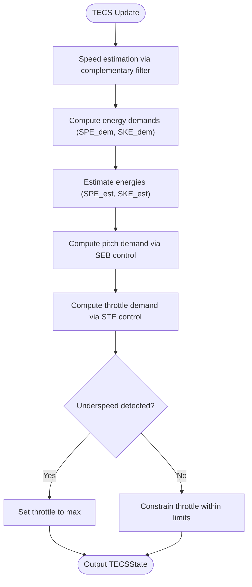
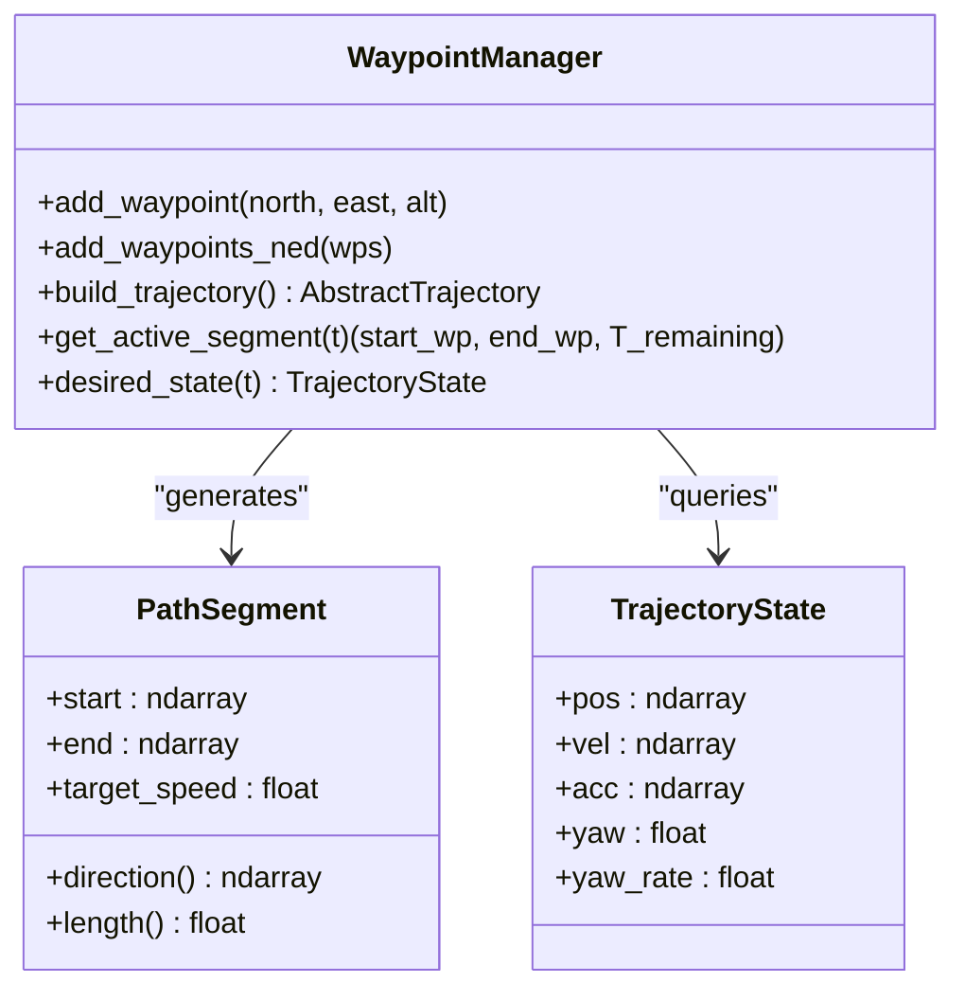
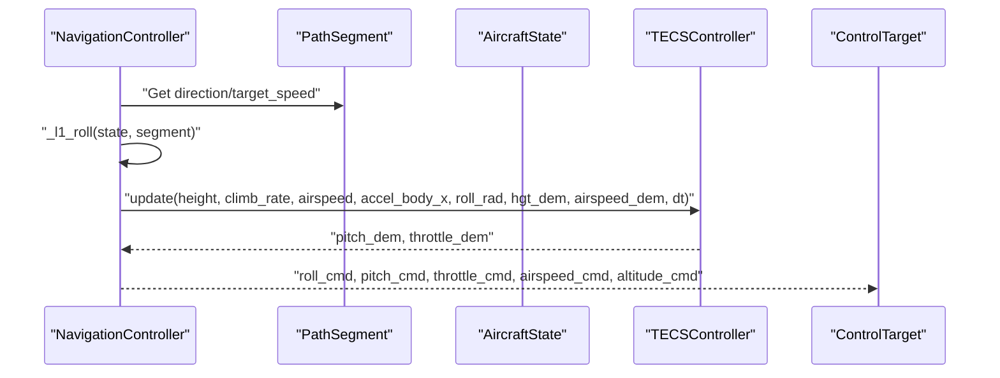
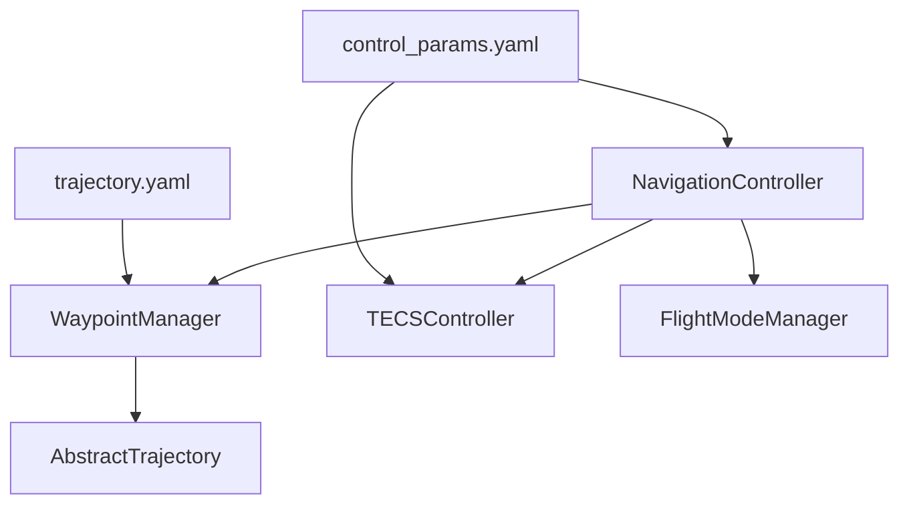

# Navigation Control

<cite>
**Referenced Files in This Document**
- [navigation_controller.py](file://src/control/navigation_controller.py)
- [tecs_controller.py](file://src/control/tecs_controller.py)
- [waypoint_manager.py](file://src/planning/waypoint_manager.py)
- [trajectory_base.py](file://src/planning/trajectory_base.py)
- [flight_mode_manager.py](file://src/control/flight_mode_manager.py)
- [trajectory.yaml](file://config/trajectory.yaml)
- [control_params.yaml](file://config/control_params.yaml)
- [3_trajectory_tracking.py](file://examples/3_trajectory_tracking.py)
- [main.py](file://main.py)
</cite>

## Table of Contents
1. [Introduction](#introduction)
2. [Project Structure](#project-structure)
3. [Core Components](#core-components)
4. [Architecture Overview](#architecture-overview)
5. [Detailed Component Analysis](#detailed-component-analysis)
6. [Dependency Analysis](#dependency-analysis)
7. [Performance Considerations](#performance-considerations)
8. [Troubleshooting Guide](#troubleshooting-guide)
9. [Conclusion](#conclusion)
10. [Appendices](#appendices)

## Introduction
This document provides comprehensive documentation for the navigation control system in the FixedWingSimulator project. It explains how the L1 lateral navigation law and TECS (Total Energy Control System) work together to enable precise path tracking for fixed-wing aircraft. It covers waypoint management, mission execution, and how the navigation controller feeds control targets to the flight mode manager. Practical examples demonstrate mission planning, configuration, and performance analysis. Mathematical formulations, parameter tuning guidelines, convergence properties, and integration with global positioning systems are included.

## Project Structure
The navigation control system spans several modules:
- Control layer: NavigationController (L1 + TECS), TECSController, FlightModeManager
- Planning layer: WaypointManager, AbstractTrajectory/TrajectoryState
- Configuration: control_params.yaml, trajectory.yaml
- Example usage: examples/3_trajectory_tracking.py
- Entry point: main.py

**Diagram sources**
- [navigation_controller.py](file://src/control/navigation_controller.py#L45-L293)
- [flight_mode_manager.py](file://src/control/flight_mode_manager.py#L115-L298)
- [waypoint_manager.py](file://src/planning/waypoint_manager.py#L20-L208)
- [trajectory_base.py](file://src/planning/trajectory_base.py#L16-L46)
- [control_params.yaml](file://config/control_params.yaml#L1-L45)
- [trajectory.yaml](file://config/trajectory.yaml#L1-L23)
- [3_trajectory_tracking.py](file://examples/3_trajectory_tracking.py#L34-L80)
- [main.py](file://main.py#L98-L145)

**Section sources**
- [navigation_controller.py](file://src/control/navigation_controller.py#L1-L293)
- [flight_mode_manager.py](file://src/control/flight_mode_manager.py#L1-L298)
- [waypoint_manager.py](file://src/planning/waypoint_manager.py#L1-L208)
- [trajectory_base.py](file://src/planning/trajectory_base.py#L1-L47)
- [control_params.yaml](file://config/control_params.yaml#L1-L45)
- [trajectory.yaml](file://config/trajectory.yaml#L1-L23)
- [3_trajectory_tracking.py](file://examples/3_trajectory_tracking.py#L1-L194)
- [main.py](file://main.py#L1-L145)

## Core Components
- NavigationController: Implements L1 lateral navigation and TECS vertical/longitudinal control. Produces ControlTarget commands for the flight mode manager.
- WaypointManager: Stores NED waypoints, builds trajectories, and exposes the active path segment at any time.
- TrajectoryBase: Defines the common interface for desired trajectory states (position, velocity, acceleration, yaw/yaw-rate).
- FlightModeManager: Translates ControlTarget into actuator commands depending on the current flight mode (AUTO, LOITER, RTH, etc.).
- TECSController: Implements ArduPilot-style total energy control to coordinate altitude and airspeed.

**Section sources**
- [navigation_controller.py](file://src/control/navigation_controller.py#L45-L116)
- [waypoint_manager.py](file://src/planning/waypoint_manager.py#L20-L80)
- [trajectory_base.py](file://src/planning/trajectory_base.py#L16-L46)
- [flight_mode_manager.py](file://src/control/flight_mode_manager.py#L115-L298)
- [tecs_controller.py](file://src/control/tecs_controller.py#L50-L130)

## Architecture Overview
The navigation control loop integrates waypoint management, L1 guidance, TECS control, and flight mode selection:

**Diagram sources**
- [navigation_controller.py](file://src/control/navigation_controller.py#L134-L202)
- [flight_mode_manager.py](file://src/control/flight_mode_manager.py#L173-L212)
- [waypoint_manager.py](file://src/planning/waypoint_manager.py#L178-L208)
- [tecs_controller.py](file://src/control/tecs_controller.py#L247-L315)

## Detailed Component Analysis

### L1 Navigation Algorithm
The L1 lateral navigation law computes a desired roll angle to guide the aircraft along a path segment. It uses a look-ahead point placed at a distance proportional to airspeed and a configurable period, steering toward either the look-ahead point or the segment endpoint when the aircraft is near the end.

Key steps:
- Compute L1 look-ahead distance based on airspeed and period.
- Project aircraft position onto the current segment to determine along-track distance.
- Choose look-ahead point clamped to the segment bounds.
- Derive current ground track from body velocity components (accounting for sideslip).
- Compute angle difference and lateral acceleration command.
- Convert lateral acceleration to roll command with gravity scaling.

Mathematical formulation:
- L1 distance: L1 = max(V · T / (2π), 5.0)
- Look-ahead position: clamp along-track to [0, segment_length]
- Ground track angle: computed from body velocity rotated to NED
- Angle error: η = desired_track − current_track
- Lateral acceleration: a_lat = (2 · V^2 / L1) · sin(η)
- Roll command: φ = atan(a_lat / g)

**Diagram sources**
- [navigation_controller.py](file://src/control/navigation_controller.py#L206-L292)

**Section sources**
- [navigation_controller.py](file://src/control/navigation_controller.py#L206-L292)

### TECS (Total Energy Control System)
TECS coordinates altitude and airspeed control by managing specific total energy (SPE + SKE) and the specific energy balance (SEB). It avoids decoupled PID issues by controlling energy rates and distributing energy between potential and kinetic forms.

Key elements:
- Energy model: SPE = g · h, SKE = 0.5 · V^2, STE = SPE + SKE
- Outputs: throttle_cmd and pitch_cmd
- Protection: underspeed detection, bad descent detection
- Tuning parameters: time constant, throttle/ pitch damping, integral gain, speed weight, roll compensation, pitch limits, throttle limits, airspeed bounds

**Diagram sources**
- [tecs_controller.py](file://src/control/tecs_controller.py#L247-L315)

**Section sources**
- [tecs_controller.py](file://src/control/tecs_controller.py#L50-L315)

### Waypoint Management and Mission Execution
WaypointManager stores NED waypoints, constructs trajectories, and provides the active path segment at any time. It supports multiple trajectory types and yaw modes, and can loop back to the first waypoint.

- Waypoint storage: NED coordinates with altitudes converted to “down” internally.
- Trajectory construction: minimum snap or minimum jerk based on configuration.
- Active segment access: returns start/end waypoints and remaining time in the current segment.
- Mission execution: the navigation controller consumes the active segment to compute control targets.

**Diagram sources**
- [waypoint_manager.py](file://src/planning/waypoint_manager.py#L20-L167)
- [trajectory_base.py](file://src/planning/trajectory_base.py#L16-L46)

**Section sources**
- [waypoint_manager.py](file://src/planning/waypoint_manager.py#L20-L208)
- [trajectory_base.py](file://src/planning/trajectory_base.py#L16-L46)

### Navigation Controller Role and Control Target Generation
NavigationController integrates L1 guidance and TECS control to produce a ControlTarget consumed by the flight mode manager. It:
- Computes roll_cmd from L1 guidance
- Sets yaw_cmd to align with the path segment direction
- Sets altitude_cmd from the path segment’s end altitude
- Estimates climb rate and uses TECS to compute pitch/throttle commands
- Returns ControlTarget with roll_cmd, pitch_cmd, throttle_cmd, airspeed_cmd, altitude_cmd

**Diagram sources**
- [navigation_controller.py](file://src/control/navigation_controller.py#L134-L202)
- [tecs_controller.py](file://src/control/tecs_controller.py#L247-L315)

**Section sources**
- [navigation_controller.py](file://src/control/navigation_controller.py#L134-L202)

### Flight Mode Manager Integration
FlightModeManager selects the appropriate control strategy based on the current mode and applies transitions. In AUTO/LOITER/RTH, it forwards the navigation controller’s ControlTarget to the actuators. In other modes, it may bypass or modify the target.

- Modes: MANUAL, STABILIZE, FBW_A, FBW_B, AUTO, LOITER, RTH
- AUTO/LOITER/RTH: use nav_target if provided; otherwise hold current state
- STABILIZE/FBW_A/FBW_B: apply mode-specific logic and defaults

**Section sources**
- [flight_mode_manager.py](file://src/control/flight_mode_manager.py#L115-L298)

## Dependency Analysis
The navigation control system exhibits clear layering and minimal coupling:
- NavigationController depends on WaypointManager for path segments, TECSController for vertical control, and FlightModeManager for mode-dependent application of control targets.
- WaypointManager depends on trajectory implementations and configuration for trajectory type and yaw mode.
- TECSController encapsulates its own tuning parameters and internal states.
- Configuration files supply parameters for both L1 and TECS.

**Diagram sources**
- [navigation_controller.py](file://src/control/navigation_controller.py#L14-L22)
- [waypoint_manager.py](file://src/planning/waypoint_manager.py#L127-L160)
- [tecs_controller.py](file://src/control/tecs_controller.py#L80-L130)
- [control_params.yaml](file://config/control_params.yaml#L1-L45)
- [trajectory.yaml](file://config/trajectory.yaml#L1-L23)

**Section sources**
- [navigation_controller.py](file://src/control/navigation_controller.py#L14-L22)
- [waypoint_manager.py](file://src/planning/waypoint_manager.py#L127-L160)
- [tecs_controller.py](file://src/control/tecs_controller.py#L80-L130)
- [control_params.yaml](file://config/control_params.yaml#L1-L45)
- [trajectory.yaml](file://config/trajectory.yaml#L1-L23)

## Performance Considerations
- L1 parameter tuning:
  - NAVL1_PERIOD controls lookahead distance; larger periods increase stability but reduce responsiveness; typical range 20–60 seconds.
  - NAVL1_DAMPING affects stability; higher values reduce oscillations but may introduce lag; typical around 0.75.
  - MAX_ROLL limits turn performance; adjust according to aircraft capability.
- TECS parameter tuning:
  - TECS_TIME_CONST balances smoothness and response; larger values reduce oscillations.
  - TECS_THR_DAMP and TECS_PTCH_DAMP stabilize throttle and pitch; increase to suppress oscillations.
  - TECS_INTEG_GAIN reduces steady-state error; tune carefully to avoid saturation.
  - TECS_SPDWEIGHT determines the balance between altitude and speed prioritization.
  - TECS_RLL2THR compensates for induced drag during turns; adjust for bank angles encountered.
- Anti-disturbance measures:
  - Height demand low-pass filtering (TECS_HDEM_TCONST) smooths step changes.
  - Speed complementary filter improves airspeed estimation robustness.
  - Acceleration low-pass filtering reduces sensor noise effects.
  - Underspeed protection prevents stall-like conditions.
- Convergence and accuracy:
  - L1 algorithm converges to the path under reasonable assumptions; accuracy depends on waypoint spacing and airspeed.
  - TECS ensures coordinated altitude and speed control, reducing cross-coupling errors.
- Integration with global positioning:
  - The system expects NED positions and velocities; ensure GPS-derived states are transformed consistently to NED.

[No sources needed since this section provides general guidance]

## Troubleshooting Guide
Common issues and remedies:
- Navigation drift or overshoot:
  - Reduce NAVL1_PERIOD or increase NAVL1_DAMPING; ensure adequate waypoint density.
- Oil temperature or throttle oscillations:
  - Increase TECS_THR_DAMP; decrease TECS_INTEG_GAIN; verify airspeed sensor calibration.
- Pitch oscillations:
  - Increase TECS_PTCH_DAMP; increase TECS_TIME_CONST; inspect aircraft trim and aerodynamics.
- Underspeed protection triggering unexpectedly:
  - Calibrate airspeed sensor; lower TECS_THR_MAX; improve flight conditions.

**Section sources**
- [tecs_controller.py](file://src/control/tecs_controller.py#L432-L444)
- [tecs_controller.py](file://src/control/tecs_controller.py#L635-L646)

## Conclusion
The navigation control system combines L1 lateral guidance with TECS vertical/longitudinal control to achieve robust, coordinated path tracking for fixed-wing aircraft. WaypointManager enables flexible mission definition, while FlightModeManager ensures appropriate control application across flight modes. With careful parameter tuning and attention to anti-disturbance mechanisms, the system delivers high accuracy and strong convergence properties suitable for real-world missions.

[No sources needed since this section summarizes without analyzing specific files]

## Appendices

### Mathematical Formulations and Parameter Tuning
- L1 lateral guidance:
  - L1 = max(V · T / (2π), 5.0)
  - a_lat = (2 · V^2 / L1) · sin(η)
  - φ = atan(a_lat / g)
- TECS energy control:
  - SPE = g · h, SKE = 0.5 · V^2
  - SEB = w_spe · SPE − w_ske · SKE
  - STE = SPE + SKE
  - Tune TECS_TIME_CONST, TECS_THR_DAMP, TECS_PTCH_DAMP, TECS_INTEG_GAIN, TECS_SPDWEIGHT, TECS_RLL2THR, TECS_HDEM_TCONST

**Section sources**
- [navigation_controller.py](file://src/control/navigation_controller.py#L206-L292)
- [tecs_controller.py](file://src/control/tecs_controller.py#L445-L464)

### Practical Examples and Mission Planning
- Square trajectory example:
  - Configure waypoints in NED format; run AUTO mode with minimum-snap trajectory.
  - Inspect generated plots and CSV logs for position, velocity, attitude, angular rates, and control inputs.
- Configuration files:
  - trajectory.yaml defines trajectory type, average speed, yaw mode, waypoints, and loop flag.
  - control_params.yaml sets L1 and TECS parameters for the simulation.

**Section sources**
- [3_trajectory_tracking.py](file://examples/3_trajectory_tracking.py#L72-L99)
- [trajectory.yaml](file://config/trajectory.yaml#L1-L23)
- [control_params.yaml](file://config/control_params.yaml#L1-L45)
- [main.py](file://main.py#L98-L145)