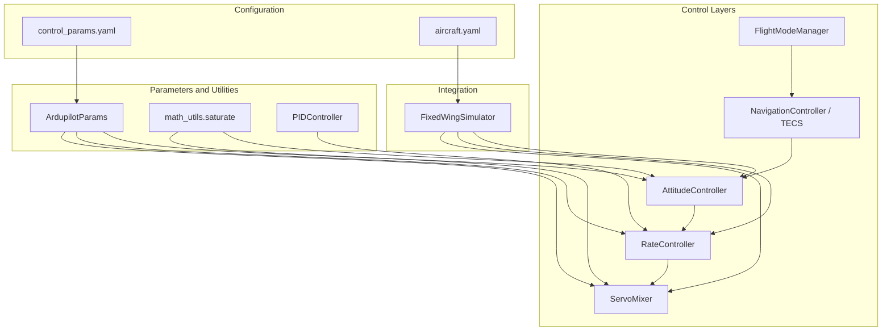
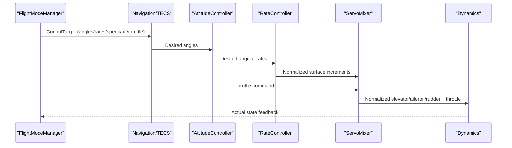
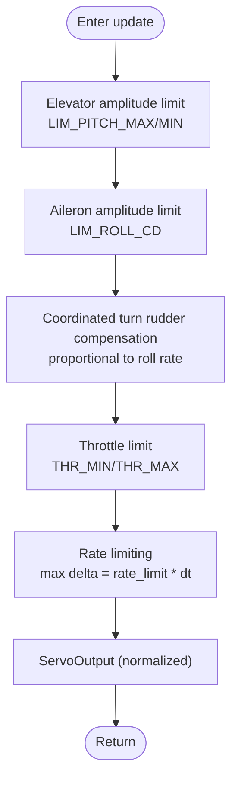
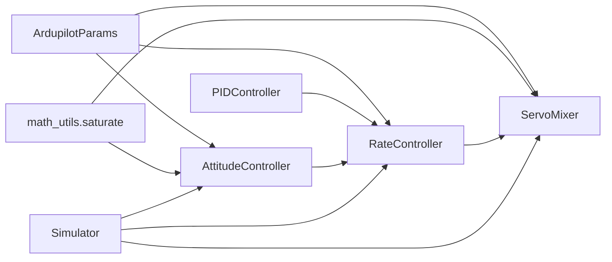

# Servo Mixing and Actuator Allocation

<cite>
**Referenced Files in This Document**
- [servo_mixer.py](file://src/control/servo_mixer.py)
- [ardupilot_compat.py](file://src/control/ardupilot_compat.py)
- [math_utils.py](file://src/utils/math_utils.py)
- [attitude_controller.py](file://src/control/attitude_controller.py)
- [rate_controller.py](file://src/control/rate_controller.py)
- [pid_controller.py](file://src/control/pid_controller.py)
- [simulator.py](file://src/simulation/simulator.py)
- [control_params.yaml](file://config/control_params.yaml)
- [aircraft.yaml](file://config/aircraft.yaml)
- [test_control.py](file://tests/test_control.py)
- [flight_mode_manager.py](file://src/control/flight_mode_manager.py)
</cite>

## Table of Contents
1. [Introduction](#introduction)
2. [Project Structure](#project-structure)
3. [Core Components](#core-components)
4. [Architecture Overview](#architecture-overview)
5. [Detailed Component Analysis](#detailed-component-analysis)
6. [Dependency Analysis](#dependency-analysis)
7. [Performance Considerations](#performance-considerations)
8. [Troubleshooting Guide](#troubleshooting-guide)
9. [Conclusion](#conclusion)
10. [Appendices](#appendices)

## Introduction
This document explains the servo mixing and actuator allocation system that converts control targets into physical actuator outputs. It covers the control command flow from attitude/rate commands to final servo positions, the mixing matrix implementation, control surface mapping, and actuator authority distribution. It also documents the mathematical transformation from control targets to servo positions, including mechanical limitations and actuator constraints, and provides practical examples for mixer configuration, control surface calibration, and actuator response modeling. Safety considerations, mixing redundancy, failure modes, and integration with control surfaces and aircraft dynamics are addressed.

## Project Structure
The servo mixing system is part of the five-layer ArduPilot-like control hierarchy:
- Outer layers: Flight mode manager, navigation/TECS, and attitude controller
- Inner layers: Rate controller and servo mixer
- Integration: The simulator orchestrates the control chain and passes normalized outputs to the dynamics

**Diagram sources**
- [simulator.py](file://src/simulation/simulator.py#L41-L52)
- [servo_mixer.py](file://src/control/servo_mixer.py#L19-L21)
- [attitude_controller.py](file://src/control/attitude_controller.py#L20-L22)
- [rate_controller.py](file://src/control/rate_controller.py#L20-L22)
- [ardupilot_compat.py](file://src/control/ardupilot_compat.py#L17-L69)
- [math_utils.py](file://src/utils/math_utils.py#L23-L25)

**Section sources**
- [simulator.py](file://src/simulation/simulator.py#L41-L52)
- [servo_mixer.py](file://src/control/servo_mixer.py#L1-L153)
- [attitude_controller.py](file://src/control/attitude_controller.py#L1-L134)
- [rate_controller.py](file://src/control/rate_controller.py#L1-L109)
- [ardupilot_compat.py](file://src/control/ardupilot_compat.py#L1-L130)
- [math_utils.py](file://src/utils/math_utils.py#L1-L124)

## Core Components
- ServoMixer: Final actuator synthesis stage applying amplitude limits, coordinated turn compensation, throttle limits, and rate limiting to normalized control increments from the rate controller and throttle from the mode layer.
- RateController: Inner-loop SAS generating normalized surface deflection increments from desired angular rates.
- AttitudeController: Outer-loop mapping desired Euler angles to desired angular rates.
- ArdupilotParams: Parameter container mirroring ArduPilot naming conventions for gains and limits.
- PIDController: Generic PID implementation used by the rate controller.
- math_utils.saturate: Numerical saturation function used for hard limits.

Key responsibilities:
- Convert normalized increments to final servo outputs with physical bounds.
- Apply coordinated turn compensation via rudder proportional to roll rate.
- Enforce throttle and surface authority limits.
- Limit rate of change of control surfaces to avoid abrupt commands.

**Section sources**
- [servo_mixer.py](file://src/control/servo_mixer.py#L23-L51)
- [rate_controller.py](file://src/control/rate_controller.py#L24-L30)
- [attitude_controller.py](file://src/control/attitude_controller.py#L25-L31)
- [ardupilot_compat.py](file://src/control/ardupilot_compat.py#L17-L69)
- [math_utils.py](file://src/utils/math_utils.py#L23-L25)

## Architecture Overview
The control hierarchy transforms high-level flight goals into physical actuator commands:
- FlightModeManager defines control targets (angles, rates, throttle).
- Navigation/TECS computes targets and manages energy/state.
- AttitudeController generates desired angular rates from Euler angle errors.
- RateController computes normalized surface increments.
- ServoMixer applies limits and produces normalized actuator outputs.
- Dynamics receives normalized deflections plus trim offsets.

**Diagram sources**
- [simulator.py](file://src/simulation/simulator.py#L499-L521)
- [attitude_controller.py](file://src/control/attitude_controller.py#L81-L122)
- [rate_controller.py](file://src/control/rate_controller.py#L68-L98)
- [servo_mixer.py](file://src/control/servo_mixer.py#L80-L149)

## Detailed Component Analysis

### ServoMixer: Actuator Allocation and Output Limiting
ServoMixer is the innermost layer responsible for converting normalized control increments into final actuator outputs with strict physical and dynamic constraints.

Processing pipeline:
1. Elevator amplitude limit: derived from LIM_PITCH_MAX/MIN and normalized against a fixed travel assumption.
2. Aileron amplitude limit: derived from LIM_ROLL_CD and approximated against a fixed travel assumption.
3. Coordinated turn rudder compensation: adds a term proportional to roll rate to cancel adverse yaw.
4. Throttle limit: constrained to THR_MIN/THR_MAX.
5. Rate limiting: limits per-timestep change based on a configurable maximum rate (deg/s) and dt.
6. Output: normalized ServoOutput with elevator/aileron/rudder in [-1, 1] and throttle in [0, 1].

**Diagram sources**
- [servo_mixer.py](file://src/control/servo_mixer.py#L80-L149)

Implementation highlights:
- Uses ArdupilotParams for limits and gains.
- Employs math_utils.saturate for hard limits.
- Maintains internal state (_prev) for rate limiting across timesteps.
- Converts normalized outputs to radians via ServoOutput.to_radians with explicit travel assumptions.

Mathematical transformation:
- Normalized outputs are mapped to radians using fixed maximum deflections per control surface.
- Elevator sign is inverted to align with aerodynamic convention (down-trailing-edge equals nose-down).

Safety and constraints:
- All outputs remain within safe ranges: [-1, 1] for surfaces, [0, 1] for throttle.
- Rate limiting prevents excessive actuator motion that could stress mechanics or excite dynamics.

Integration with dynamics:
- The simulator converts normalized outputs to radians and adds trim offsets before passing to the nonlinear dynamics.

Practical examples:
- Mixer configuration: adjust LIM_PITCH_MAX/MIN, LIM_ROLL_CD, THR_MIN/THR_MAX in control_params.yaml to reflect aircraft capabilities.
- Calibration: tune coordinated turn compensation gain and rate_limit to achieve smooth, stable handling across speed and load conditions.
- Actuator response modeling: rate_limit corresponds to typical servo/actuator slew rate; dt-dependent scaling ensures consistent behavior across simulation steps.

Failure modes and mitigation:
- Excessive demand: amplitude limits cap outputs; rate limiting smooths transients.
- Uncoordinated turns: coordinated turn compensation reduces adverse yaw; verify with non-zero roll rate scenarios.
- Initialization: first-step saturation due to _prev state; multiple steps typically resolve.

**Section sources**
- [servo_mixer.py](file://src/control/servo_mixer.py#L54-L153)
- [math_utils.py](file://src/utils/math_utils.py#L23-L25)
- [ardupilot_compat.py](file://src/control/ardupilot_compat.py#L46-L51)
- [test_control.py](file://tests/test_control.py#L311-L371)

### RateController: Inner-Loop SAS
The rate controller computes normalized surface deflection increments from desired and measured angular rates using independent PID loops for each axis.

Key points:
- Independent PIDs for pitch, roll, and yaw.
- Output range constrained to [-1, 1] for downstream mixing.
- Feed-forward terms can be applied before saturation.

Integration:
- Inputs: measured p, q, r and desired p_cmd, q_cmd, r_cmd.
- Output: RateOutput with elevator, aileron, rudder increments.

**Section sources**
- [rate_controller.py](file://src/control/rate_controller.py#L32-L109)
- [pid_controller.py](file://src/control/pid_controller.py#L17-L117)

### AttitudeController: Outer-Loop Mapping
Maps desired Euler angles to desired angular rates using independent PIDs (P-only for roll and pitch; yaw has zero gain in this implementation).

Key points:
- Wraps angle errors to [-π, π] for stability.
- Applies axis-specific output limits for desired angular rates.

**Section sources**
- [attitude_controller.py](file://src/control/attitude_controller.py#L33-L134)
- [math_utils.py](file://src/utils/math_utils.py#L13-L20)

### Parameter Container and Configuration
ArdupilotParams mirrors ArduPilot’s parameter naming and provides:
- Gains for attitude and rate loops.
- Limits for pitch, roll, and throttle.
- Convenience properties (e.g., LIM_ROLL_DEG derived from LIM_ROLL_CD).

Configuration files:
- control_params.yaml: loads ArduPilot-compatible parameters and validates ranges.
- aircraft.yaml: selects the aircraft model and allows overrides.

Validation:
- Basic range checks are performed; out-of-range values trigger warnings.

**Section sources**
- [ardupilot_compat.py](file://src/control/ardupilot_compat.py#L17-L130)
- [control_params.yaml](file://config/control_params.yaml#L1-L45)
- [aircraft.yaml](file://config/aircraft.yaml#L1-L13)

### Integration with Control Surfaces and Dynamics
The simulator orchestrates the control chain and integrates with dynamics:
- AttitudeController and RateController are invoked in sequence.
- ServoMixer receives normalized increments and throttle, then converts to radians and adds trim offsets.
- Dynamics receives total deflections (trim + control) and throttle.

Direct mode:
- Some modes allow direct actuator commands bypassing the control loops.

**Section sources**
- [simulator.py](file://src/simulation/simulator.py#L501-L540)
- [flight_mode_manager.py](file://src/control/flight_mode_manager.py#L115-L298)

## Dependency Analysis
The servo mixing system depends on:
- ArdupilotParams for limits and gains.
- math_utils.saturate for hard limits.
- RateController for normalized increments.
- Simulator for orchestration and output conversion.

**Diagram sources**
- [servo_mixer.py](file://src/control/servo_mixer.py#L19-L21)
- [rate_controller.py](file://src/control/rate_controller.py#L20-L22)
- [attitude_controller.py](file://src/control/attitude_controller.py#L20-L22)
- [simulator.py](file://src/simulation/simulator.py#L41-L52)

**Section sources**
- [servo_mixer.py](file://src/control/servo_mixer.py#L1-L153)
- [rate_controller.py](file://src/control/rate_controller.py#L1-L109)
- [attitude_controller.py](file://src/control/attitude_controller.py#L1-L134)
- [simulator.py](file://src/simulation/simulator.py#L41-L52)

## Performance Considerations
- Rate limiting: Ensures smooth actuator motion by constraining per-timestep change based on rate_limit and dt.
- Amplitude limits: Prevents saturation of control surfaces and protects actuators.
- Coordinated turn compensation: Reduces adverse yaw during banked turns, improving handling quality.
- Computational cost: Minimal overhead due to saturation and simple arithmetic.

[No sources needed since this section provides general guidance]

## Troubleshooting Guide
Common issues and remedies:
- Output out of range: Verify throttle and surface limits; confirm saturation behavior.
- Excessive oscillation: Reduce rate_limit or refine PID gains; ensure coordinated turn compensation is enabled.
- Initialization overshoot: Allow several steps for rate limiter to settle; confirm _prev state initialization.
- Parameter validation failures: Use ArdupilotParams.validate() to detect out-of-range values.

Unit tests confirm:
- Correct output types and normalization.
- Throttle clamping within THR_MIN/THR_MAX.
- Elevator amplitude limit adherence.
- Radians conversion correctness.
- Coordinated turn rudder compensation activation under roll rate.
- All outputs remain within expected ranges.

**Section sources**
- [test_control.py](file://tests/test_control.py#L311-L371)
- [ardupilot_compat.py](file://src/control/ardupilot_compat.py#L104-L130)
- [servo_mixer.py](file://src/control/servo_mixer.py#L151-L153)

## Conclusion
The servo mixing and actuator allocation system provides a robust, layered approach to transforming control targets into safe, physically meaningful actuator outputs. By enforcing amplitude and rate limits, applying coordinated turn compensation, and maintaining normalized outputs, the system ensures stable and predictable handling across diverse flight conditions. Integration with the broader control hierarchy and dynamics enables accurate simulation and real-time control behavior.

[No sources needed since this section summarizes without analyzing specific files]

## Appendices

### Mathematical Transformation Summary
- From normalized increments to radians:
  - Elevator: invert sign to align with aerodynamic convention, scale by assumed maximum travel.
  - Aileron/Rudder: scale by assumed maximum travel.
- From normalized throttle to dynamics: direct mapping to [0, 1].

**Section sources**
- [servo_mixer.py](file://src/control/servo_mixer.py#L31-L51)

### Practical Configuration Examples
- Mixer configuration:
  - Adjust LIM_PITCH_MAX/MIN, LIM_ROLL_CD, THR_MIN/THR_MAX in control_params.yaml to reflect aircraft capabilities.
- Control surface calibration:
  - Tune coordinated turn compensation gain and rate_limit to achieve balanced handling across speeds.
- Actuator response modeling:
  - Set rate_limit to approximate servo/actuator slew rate; verify with step-response analysis.

**Section sources**
- [control_params.yaml](file://config/control_params.yaml#L24-L29)
- [servo_mixer.py](file://src/control/servo_mixer.py#L65-L76)