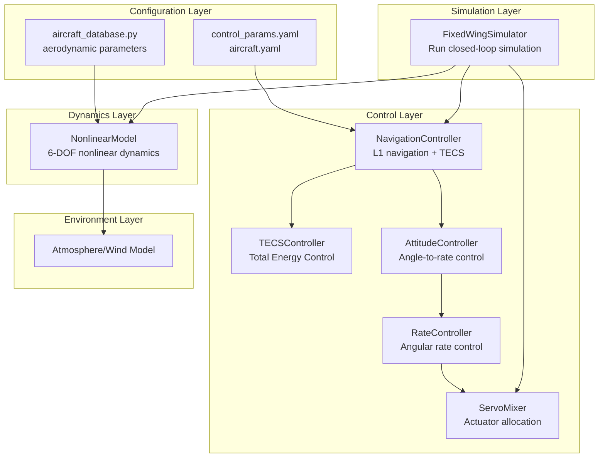
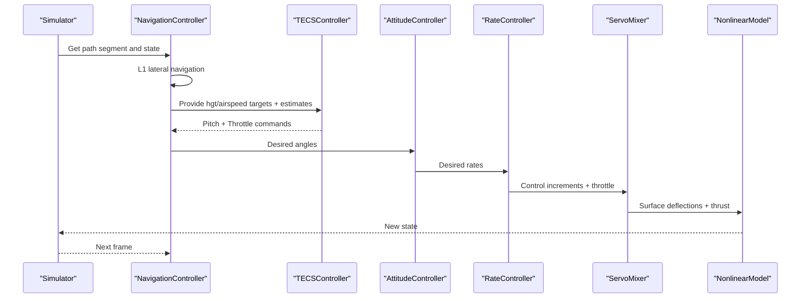
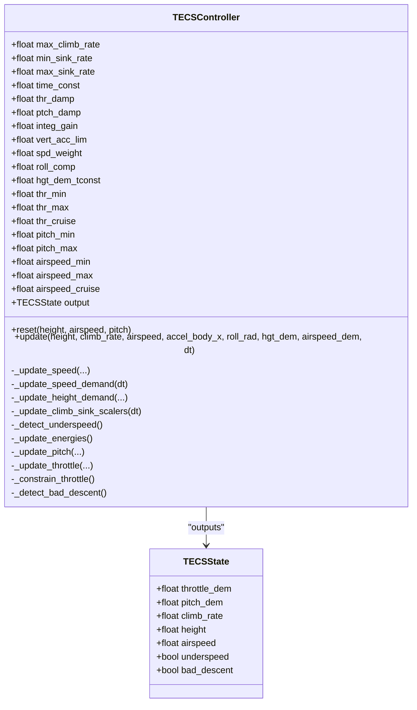
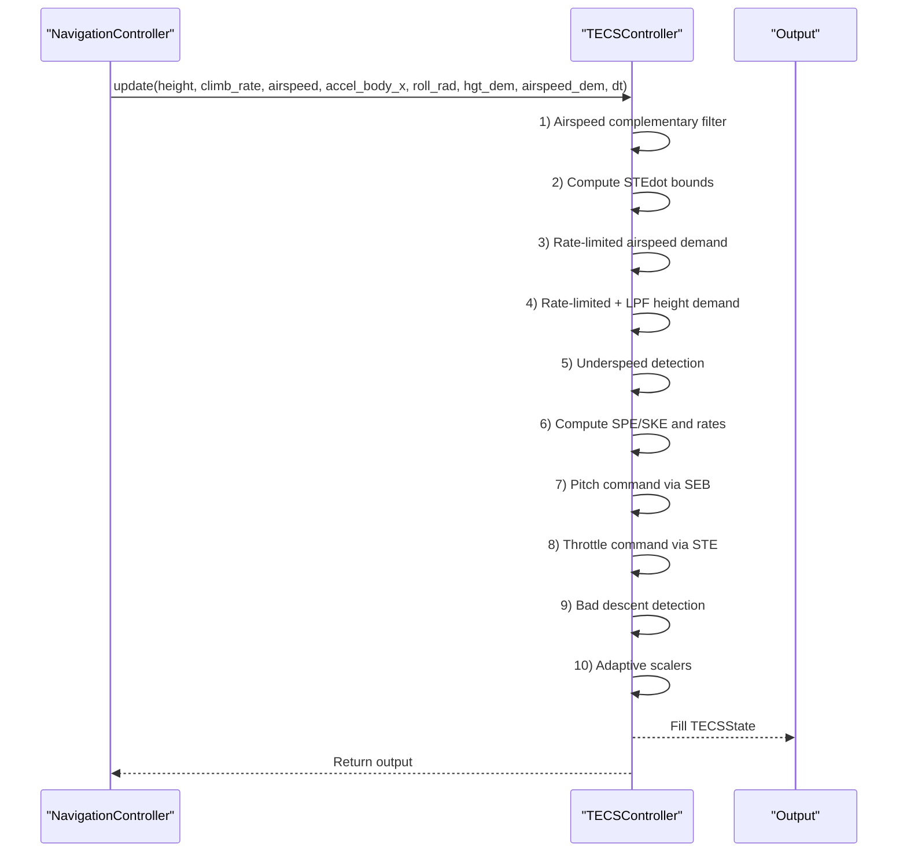
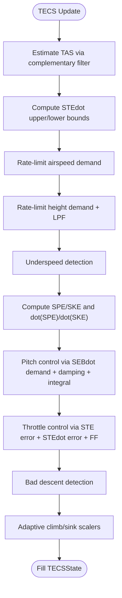
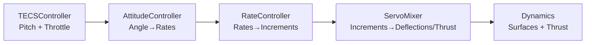
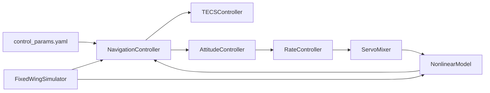

# TECS Control System

<cite>
**Referenced Files in This Document**
- [tecs_controller.py](file://src/control/tecs_controller.py)
- [navigation_controller.py](file://src/control/navigation_controller.py)
- [attitude_controller.py](file://src/control/attitude_controller.py)
- [rate_controller.py](file://src/control/rate_controller.py)
- [servo_mixer.py](file://src/control/servo_mixer.py)
- [flight_mode_manager.py](file://src/control/flight_mode_manager.py)
- [simulator.py](file://src/simulation/simulator.py)
- [control_params.yaml](file://config/control_params.yaml)
- [aircraft.yaml](file://config/aircraft.yaml)
- [aircraft_database.py](file://src/models/aircraft_database.py)
- [debug_tecs.py](file://debug_tecs.py)
- [example_1_linear_response.py](file://examples/1_linear_response.py)
- [example_3_trajectory_tracking.py](file://examples/3_trajectory_tracking.py)
</cite>

## Table of Contents
1. [Introduction](#introduction)
2. [Project Structure](#project-structure)
3. [Core Components](#core-components)
4. [Architecture Overview](#architecture-overview)
5. [Detailed Component Analysis](#detailed-component-analysis)
6. [Dependency Analysis](#dependency-analysis)
7. [Performance Considerations](#performance-considerations)
8. [Troubleshooting Guide](#troubleshooting-guide)
9. [Conclusion](#conclusion)
10. [Appendices](#appendices)

## Introduction
This document presents a comprehensive technical guide to the Total Energy Control System (TECS) used in the FixedWingSimulator. TECS implements a modern longitudinal control strategy that couples altitude and airspeed regulation through total energy management. The approach is inspired by ArduPilot’s AP_TECS and provides robust, stable control under varying flight conditions while avoiding traditional decoupled PID pitfalls such as throttle saturation and integral windup.

Key goals:
- Provide a unified framework for altitude and airspeed control via total energy (SPE + SKE).
- Distribute control authority between elevator (pitch) and throttle to achieve smooth, predictable responses.
- Offer diagnostic tools and parameter tuning guidance for real-world applications.

## Project Structure
TECS resides in the control layer and collaborates with navigation, attitude, rate, and actuator mixing modules. Configuration parameters are loaded from YAML files, and aircraft-specific aerodynamic data comes from the database.

**Diagram sources**
- [simulator.py](file://src/simulation/simulator.py#L490-L567)
- [navigation_controller.py](file://src/control/navigation_controller.py#L45-L118)
- [tecs_controller.py](file://src/control/tecs_controller.py#L50-L160)
- [aircraft_database.py](file://src/models/aircraft_database.py#L29-L48)
- [control_params.yaml](file://config/control_params.yaml#L30-L45)

**Section sources**
- [simulator.py](file://src/simulation/simulator.py#L490-L567)
- [navigation_controller.py](file://src/control/navigation_controller.py#L45-L118)
- [aircraft_database.py](file://src/models/aircraft_database.py#L29-L48)
- [control_params.yaml](file://config/control_params.yaml#L30-L45)

## Core Components
- TECSController: Implements total energy control with dual-loop logic—oil throttle to regulate total specific energy (STE) and pitch to manage specific energy balance (SEB).
- NavigationController: Provides L1 lateral guidance and feeds TECS with altitude and airspeed targets, estimated climb rate, and body-frame acceleration.
- AttitudeController: Converts desired Euler angles into desired angular rates for the rate controller.
- RateController: Inner-loop SAS with independent PIDs for roll, pitch, and yaw.
- ServoMixer: Actuator allocation mapping normalized control increments to physical deflections and throttle, applying amplitude/rate limits and coordinated turn compensation.
- FlightModeManager: Integrates TECS outputs into flight modes (AUTO, FBW_B, etc.), enabling seamless operation across different control strategies.

**Section sources**
- [tecs_controller.py](file://src/control/tecs_controller.py#L50-L160)
- [navigation_controller.py](file://src/control/navigation_controller.py#L45-L118)
- [attitude_controller.py](file://src/control/attitude_controller.py#L33-L134)
- [rate_controller.py](file://src/control/rate_controller.py#L32-L109)
- [servo_mixer.py](file://src/control/servo_mixer.py#L54-L153)
- [flight_mode_manager.py](file://src/control/flight_mode_manager.py#L115-L298)

## Architecture Overview
The TECS control chain follows an ArduPilot-style five-layer hierarchy. TECS sits at the longitudinal control core, receiving navigation targets and estimates, and producing pitch and throttle commands that are transformed into surface deflections and thrust via the rate and servo mixers.

**Diagram sources**
- [navigation_controller.py](file://src/control/navigation_controller.py#L134-L202)
- [tecs_controller.py](file://src/control/tecs_controller.py#L247-L315)
- [simulator.py](file://src/simulation/simulator.py#L499-L521)

## Detailed Component Analysis

### TECSController Class and State
TECSController encapsulates the total energy control logic, including state estimation, demand shaping, protection mechanisms, and output generation.

**Diagram sources**
- [tecs_controller.py](file://src/control/tecs_controller.py#L38-L160)
- [tecs_controller.py](file://src/control/tecs_controller.py#L197-L647)

**Section sources**
- [tecs_controller.py](file://src/control/tecs_controller.py#L38-L160)
- [tecs_controller.py](file://src/control/tecs_controller.py#L197-L647)

### TECS Update Flow
The update process performs sensor fusion, demand shaping, energy computation, and control synthesis.

**Diagram sources**
- [tecs_controller.py](file://src/control/tecs_controller.py#L247-L315)
- [tecs_controller.py](file://src/control/tecs_controller.py#L321-L647)

**Section sources**
- [tecs_controller.py](file://src/control/tecs_controller.py#L247-L315)
- [tecs_controller.py](file://src/control/tecs_controller.py#L321-L647)

### Mathematical Formulation and Energy Management
- Specific total energy (STE): Sum of specific potential energy (SPE) and specific kinetic energy (SKE).
- Specific energy balance (SEB): Weighted difference between SPE and SKE, controlled by pitch to distribute energy between altitude and speed.
- Speed weighting (spd_weight): 0 = pure altitude control, 2 = pure speed control, 1 = balanced.
- Energy demand rates: STEdot_dem = SPEdot_dem + SKEdot_dem, constrained by climb/sink limits.
- Oil throttle controls STE changes; pitch controls SEB changes.

**Diagram sources**
- [tecs_controller.py](file://src/control/tecs_controller.py#L445-L464)
- [tecs_controller.py](file://src/control/tecs_controller.py#L465-L552)
- [tecs_controller.py](file://src/control/tecs_controller.py#L553-L624)
- [tecs_controller.py](file://src/control/tecs_controller.py#L635-L647)

**Section sources**
- [tecs_controller.py](file://src/control/tecs_controller.py#L445-L464)
- [tecs_controller.py](file://src/control/tecs_controller.py#L465-L552)
- [tecs_controller.py](file://src/control/tecs_controller.py#L553-L624)
- [tecs_controller.py](file://src/control/tecs_controller.py#L635-L647)

### Control Authority Distribution and Actuator Mapping
- Elevator (pitch) primarily manages SEB to allocate energy between altitude and speed.
- Throttle primarily manages STE to increase or decrease total energy.
- The rate controller converts desired rates into normalized surface increments.
- ServoMixer maps normalized increments to physical deflections and throttle, applying amplitude/rate limits and coordinated turn compensation.

**Diagram sources**
- [tecs_controller.py](file://src/control/tecs_controller.py#L247-L315)
- [attitude_controller.py](file://src/control/attitude_controller.py#L81-L122)
- [rate_controller.py](file://src/control/rate_controller.py#L68-L98)
- [servo_mixer.py](file://src/control/servo_mixer.py#L80-L149)

**Section sources**
- [tecs_controller.py](file://src/control/tecs_controller.py#L247-L315)
- [attitude_controller.py](file://src/control/attitude_controller.py#L81-L122)
- [rate_controller.py](file://src/control/rate_controller.py#L68-L98)
- [servo_mixer.py](file://src/control/servo_mixer.py#L80-L149)

### Parameter Relationships and Tuning
Key TECS parameters and their roles:
- TECS_CLMB_MAX / TECS_SINK_MIN / TECS_SINK_MAX: Define energy rate limits; reduce overshoot and protect against excessive sink rates.
- TECS_TIME_CONST: Controls response smoothness; larger values reduce oscillations but increase rise time.
- TECS_THR_DAMP / TECS_PTCH_DAMP: Reduce throttle and pitch oscillations; higher values improve stability.
- TECS_INTEG_GAIN: Reduces steady-state error; too high risks oscillations.
- TECS_SPDWEIGHT: Adjusts priority between altitude and speed (0 = altitude, 2 = speed).
- TECS_RLL2THR: Compensates for induced drag during turns; increases oil throttle feedforward with bank.
- TECS_PITCH_MIN / TECS_PITCH_MAX: Limit pitch authority to prevent structural loads.
- TECS_THR_CRUISE: Baseline throttle feedforward.
- TECS_HDEM_TCONST: Smooths height demand to avoid aggressive step inputs.

Practical tuning tips:
- Start with moderate time constant and damping; gradually reduce to improve responsiveness.
- Use integral gain to eliminate steady error; monitor for oscillations.
- Adjust speed weight according to mission: climbs favor altitude, loiter favors speed.
- Increase roll compensation for high-bank maneuvers.

**Section sources**
- [tecs_controller.py](file://src/control/tecs_controller.py#L80-L116)
- [control_params.yaml](file://config/control_params.yaml#L32-L44)

### Integration with Flight Modes
- AUTO/LOITER/RTH: NavigationController computes targets; TECS executes longitudinal control; outputs are passed to attitude/rate control and servo mixing.
- FBW_B: Altitude and airspeed hold; TECS pitch/throttle commands are used directly.
- MANUAL/STABILIZE/FBW_A: Direct or limited control; TECS may still be active depending on mode logic.

**Section sources**
- [flight_mode_manager.py](file://src/control/flight_mode_manager.py#L173-L298)
- [navigation_controller.py](file://src/control/navigation_controller.py#L134-L202)
- [simulator.py](file://src/simulation/simulator.py#L499-L521)

## Dependency Analysis
TECS depends on:
- NavigationController for height/airspeed targets and state estimates (climb rate, body-x acceleration).
- Simulator for the closed-loop integration and actuator application.
- Configuration parameters for performance and safety limits.
- Aircraft database for aerodynamic context.

**Diagram sources**
- [simulator.py](file://src/simulation/simulator.py#L499-L521)
- [navigation_controller.py](file://src/control/navigation_controller.py#L186-L202)
- [tecs_controller.py](file://src/control/tecs_controller.py#L247-L315)
- [control_params.yaml](file://config/control_params.yaml#L30-L45)

**Section sources**
- [simulator.py](file://src/simulation/simulator.py#L499-L521)
- [navigation_controller.py](file://src/control/navigation_controller.py#L186-L202)
- [tecs_controller.py](file://src/control/tecs_controller.py#L247-L315)
- [control_params.yaml](file://config/control_params.yaml#L30-L45)

## Performance Considerations
- Time constant: Larger values reduce oscillations but increase settling time.
- Damping coefficients: Higher THR_DAMP and PTCH_DAMP improve stability.
- Integral gain: Low values reduce steady error without causing oscillations.
- Speed weight: Tailor to mission profile (altitude vs speed).
- Roll compensation: Essential for coordinated turns to avoid power deficiency.
- Vertical acceleration limit: Prevents rapid pitch commands that could excite structural modes.

**Section sources**
- [tecs_controller.py](file://src/control/tecs_controller.py#L490-L552)
- [tecs_controller.py](file://src/control/tecs_controller.py#L577-L624)
- [control_params.yaml](file://config/control_params.yaml#L35-L44)

## Troubleshooting Guide
Common symptoms and remedies:
- Underspeed protection triggered: Verify airspeed envelope and climb rate limits; ensure demand is achievable.
- Bad descent detected: Indicates unreachable airspeed demand; reduce target altitude change or increase throttle feedforward.
- Throttle saturation persists: Check STEdot demand and roll compensation; reduce demand rate or increase roll compensation.
- Pitch command jitter: Increase PTCH_DAMP or VERT_ACC_LIM; reduce rate limit sensitivity.
- Airspeed estimate instability: Review complementary filter parameters and accelerometer LPF; ensure sensor quality.

**Section sources**
- [tecs_controller.py](file://src/control/tecs_controller.py#L432-L444)
- [tecs_controller.py](file://src/control/tecs_controller.py#L635-L647)
- [tecs_controller.py](file://src/control/tecs_controller.py#L577-L624)
- [tecs_controller.py](file://src/control/tecs_controller.py#L544-L551)

## Conclusion
TECS provides a robust, unified approach to fixed-wing longitudinal control by managing total energy and distributing control authority between elevator and throttle. Its design mitigates common issues in decoupled control strategies and offers strong adaptability across diverse flight conditions. Proper tuning of TECS parameters ensures stable, responsive, and safe operation across missions ranging from loitering to high-performance maneuvers.

## Appendices

### TECS Parameter Reference and Tuning Tips
- TECS_CLMB_MAX: Maximum climb rate (m/s); reduces energy accumulation and overshoot.
- TECS_SINK_MIN/TECS_SINK_MAX: Minimum/maximum sink rates (m/s); ensure controllable descent capability.
- TECS_TIME_CONST: Control time constant (s); affects smoothness and response speed.
- TECS_THR_DAMP: Throttle damping; suppresses throttle oscillations.
- TECS_PTCH_DAMP: Pitch damping; suppresses pitch oscillations.
- TECS_INTEG_GAIN: Integral gain; reduces steady error; tune carefully to avoid oscillations.
- TECS_SPDWEIGHT: Speed weighting (0–2); 0 = altitude priority, 2 = speed priority.
- TECS_RLL2THR: Bank-to-throttle compensation; improves turn performance.
- TECS_PITCH_MIN/TECS_PITCH_MAX: Pitch authority limits.
- TECS_THR_CRUISE: Cruise throttle feedforward.
- TECS_HDEM_TCONST: Height demand LPF time constant; smooths step changes.

Tuning recommendations:
- Begin with moderate time constant and damping; reduce to improve response.
- Use integral gain to remove steady error; watch for oscillations.
- Adjust speed weight per mission: climbs favor altitude, loiter favors speed.
- Increase roll compensation for high-bank turns.

**Section sources**
- [tecs_controller.py](file://src/control/tecs_controller.py#L80-L116)
- [control_params.yaml](file://config/control_params.yaml#L32-L44)

### Practical Examples and Diagnostics
- Diagnostic script: debug_tecs.py logs TECS internal signals (raw height demand, filtered height, altitude, throttle, pitch, speed, STE error) during a height step response, aiding transient analysis.
- Example scripts: 1_linear_response.py and 3_trajectory_tracking.py demonstrate linear modal behavior and trajectory tracking scenarios, useful for validating TECS tuning.

**Section sources**
- [debug_tecs.py](file://debug_tecs.py#L1-L67)
- [example_1_linear_response.py](file://examples/1_linear_response.py#L132-L144)
- [example_3_trajectory_tracking.py](file://examples/3_trajectory_tracking.py#L73-L96)