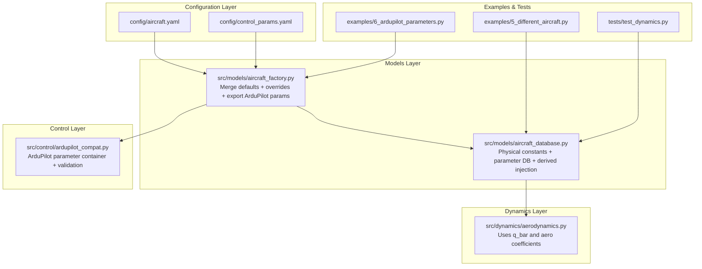
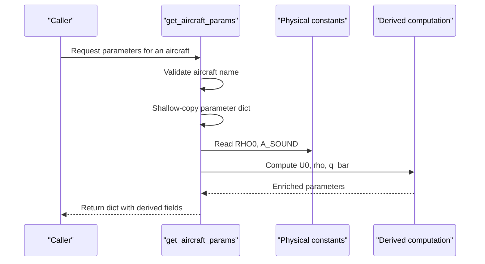
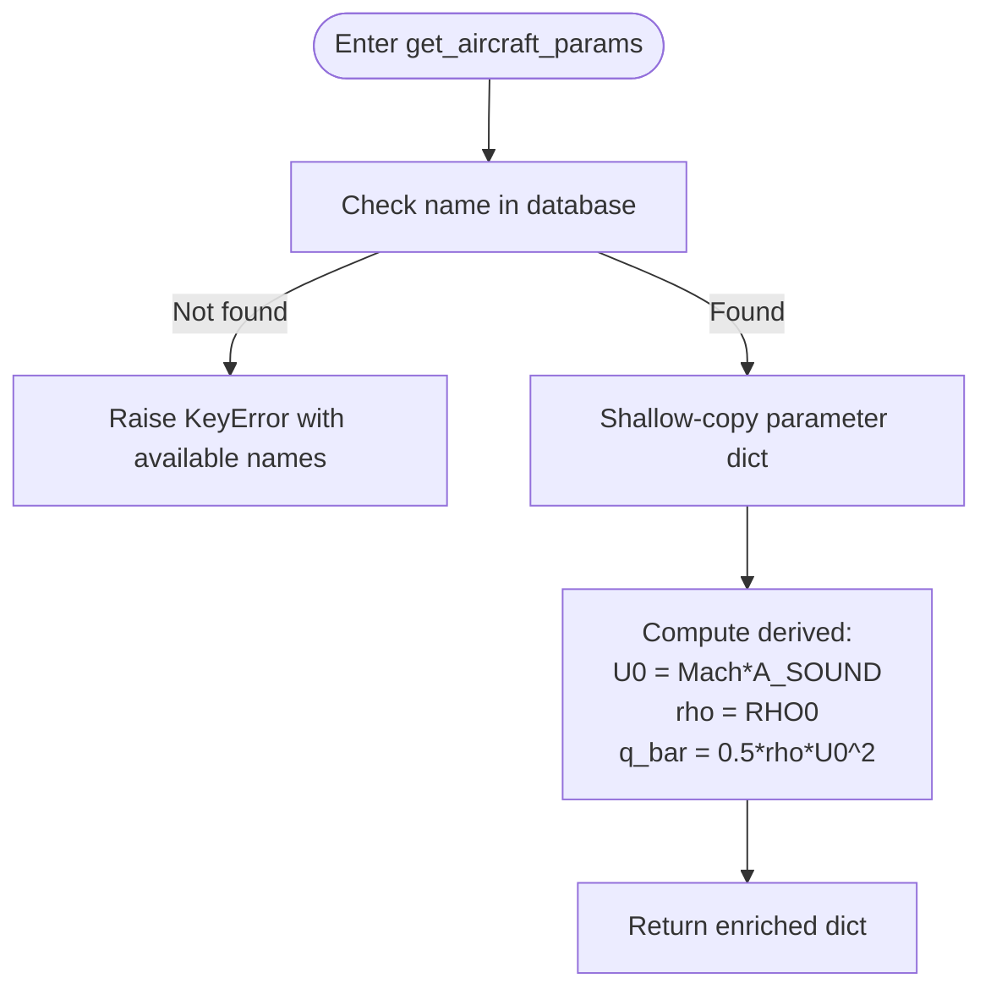
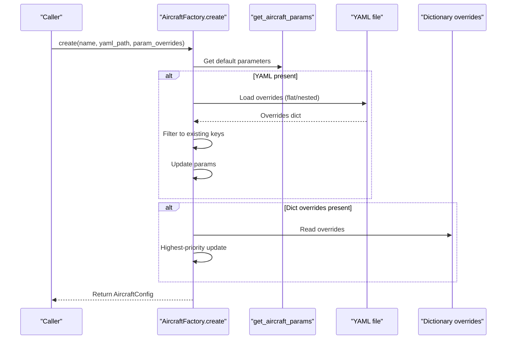
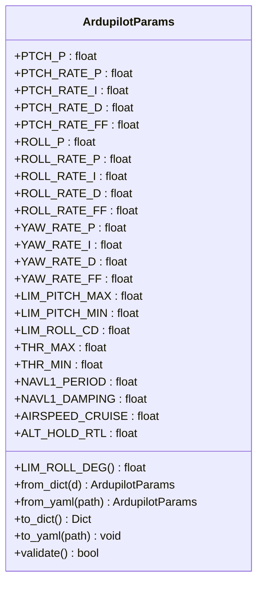
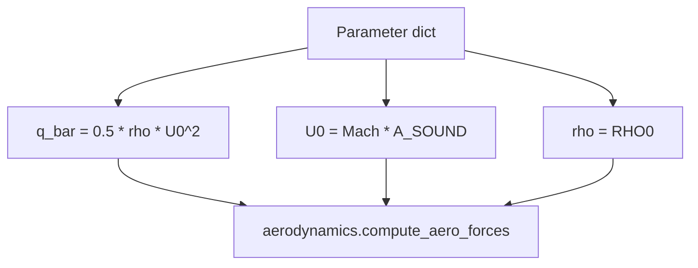
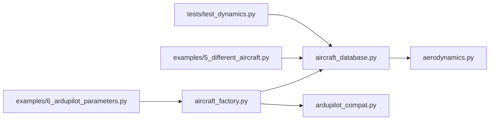

# Aircraft Database

<cite>
**Referenced Files in This Document**
- [aircraft_database.py](file://src/models/aircraft_database.py)
- [aircraft_factory.py](file://src/models/aircraft_factory.py)
- [aircraft.yaml](file://config/aircraft.yaml)
- [control_params.yaml](file://config/control_params.yaml)
- [ardupilot_compat.py](file://src/control/ardupilot_compat.py)
- [aerodynamics.py](file://src/dynamics/aerodynamics.py)
- [5_different_aircraft.py](file://examples/5_different_aircraft.py)
- [6_ardupilot_parameters.py](file://examples/6_ardupilot_parameters.py)
- [test_dynamics.py](file://tests/test_dynamics.py)
- [simulator.py](file://src/simulation/simulator.py)
</cite>

## Table of Contents
1. [Introduction](#introduction)
2. [Project Structure](#project-structure)
3. [Core Components](#core-components)
4. [Architecture Overview](#architecture-overview)
5. [Detailed Component Analysis](#detailed-component-analysis)
6. [Dependency Analysis](#dependency-analysis)
7. [Performance Considerations](#performance-considerations)
8. [Troubleshooting Guide](#troubleshooting-guide)
9. [Conclusion](#conclusion)
10. [Appendices](#appendices)

## Introduction
This document describes the aircraft parameter database system used by the fixed-wing simulation framework. It covers the complete aircraft parameter structure, including geometry parameters (mass, wing area S, mean chord c, wingspan b), inertia properties (Ixx, Iyy, Izz, Ixz), and aerodynamic coefficients (longitudinal CL_*, CD_*, Cm_* and lateral-directional CY_*, Cl_*, Cn_*). It documents the seven aircraft types in the database: TB2, Anka, Aksungur, Karayel, Predator, Heron MK1, and Heron MK2. It explains the parameter naming convention following the original project-1 UAVParameter TypedDict standard, derived parameter calculations (speed of sound, air density, dynamic pressure, and Mach-number relationships), aircraft identification information (company, country), parameter validation mechanisms, and practical usage patterns for accessing parameters, listing available aircraft, and generating human-readable summaries.

## Project Structure
The aircraft database resides in the models layer and integrates with the simulation engine, control layer, and examples/tests. The configuration layer supplies optional overrides and control parameters. The database provides a unified interface for parameter access and enrichment with derived quantities used by the dynamics engine.

**Diagram sources**
- [aircraft_database.py](file://src/models/aircraft_database.py#L1-L183)
- [aircraft_factory.py](file://src/models/aircraft_factory.py#L1-L136)
- [aircraft.yaml](file://config/aircraft.yaml#L1-L13)
- [control_params.yaml](file://config/control_params.yaml#L1-L45)
- [ardupilot_compat.py](file://src/control/ardupilot_compat.py#L1-L130)
- [aerodynamics.py](file://src/dynamics/aerodynamics.py#L90-L128)
- [5_different_aircraft.py](file://examples/5_different_aircraft.py#L1-L82)
- [6_ardupilot_parameters.py](file://examples/6_ardupilot_parameters.py#L1-L105)
- [test_dynamics.py](file://tests/test_dynamics.py#L1-L336)

**Section sources**
- [aircraft_database.py](file://src/models/aircraft_database.py#L1-L183)
- [aircraft_factory.py](file://src/models/aircraft_factory.py#L1-L136)
- [aircraft.yaml](file://config/aircraft.yaml#L1-L13)
- [control_params.yaml](file://config/control_params.yaml#L1-L45)
- [ardupilot_compat.py](file://src/control/ardupilot_compat.py#L1-L130)
- [aerodynamics.py](file://src/dynamics/aerodynamics.py#L90-L128)
- [5_different_aircraft.py](file://examples/5_different_aircraft.py#L1-L82)
- [6_ardupilot_parameters.py](file://examples/6_ardupilot_parameters.py#L1-L105)
- [test_dynamics.py](file://tests/test_dynamics.py#L1-L336)

## Core Components
- Physical constants and derived parameters
  - Standard gravity, sea-level density, gas constant, adiabatic index, and speed of sound
  - Derived parameters: U0 = Mach × speed of sound; rho = sea-level density; q_bar = 0.5 × rho × U0^2
- Main database
  - Seven fixed-wing aircraft parameter dictionaries, keyed by aircraft name
  - Keys follow the original project-1 UAVParameter TypedDict naming convention
  - Public accessors: get_aircraft_params, list_aircraft, aircraft_info
- Aircraft factory and configuration
  - Merge database defaults with YAML and/or dictionary overrides
  - Export ArduPilot-compatible parameter files (.param)
- Parameter container and validation
  - ArdupilotParams dataclass with ArduPilot naming and validation checks

**Section sources**
- [aircraft_database.py](file://src/models/aircraft_database.py#L14-L21)
- [aircraft_database.py](file://src/models/aircraft_database.py#L29-L133)
- [aircraft_database.py](file://src/models/aircraft_database.py#L143-L182)
- [aircraft_factory.py](file://src/models/aircraft_factory.py#L42-L74)
- [aircraft_factory.py](file://src/models/aircraft_factory.py#L95-L135)
- [ardupilot_compat.py](file://src/control/ardupilot_compat.py#L17-L129)

## Architecture Overview
The database follows a layered design:
- Constants layer: physical and atmospheric constants
- Data layer: parameter dictionaries for seven aircraft, preserving historical TypedDict keys
- Access layer: public functions that copy parameters, inject derived values, handle errors, and summarize information

**Diagram sources**
- [aircraft_database.py](file://src/models/aircraft_database.py#L143-L166)

**Section sources**
- [aircraft_database.py](file://src/models/aircraft_database.py#L143-L166)

## Detailed Component Analysis

### Component A: Aircraft Parameter Database (aircraft_database.py)
Responsibilities:
- Define physical constants and derive parameters
- Maintain seven aircraft parameter dictionaries with TypedDict-compatible keys
- Provide public functions: get_aircraft_params, list_aircraft, aircraft_info
- Inject derived parameters (U0, rho, q_bar) used by dynamics and aerodynamics modules

Key functions:
- get_aircraft_params(name): validates existence, copies parameters, computes derived fields, raises KeyError with available names if missing
- list_aircraft(): returns the list of supported aircraft names
- aircraft_info(name): returns a human-readable summary including company, country, mass, wing area, wingspan, and cruise speed

Error handling:
- KeyError raised with helpful message listing available aircraft when name is not found

Performance characteristics:
- Dictionary lookup O(1), derived computation O(1), minimal memory overhead

**Diagram sources**
- [aircraft_database.py](file://src/models/aircraft_database.py#L143-L166)

**Section sources**
- [aircraft_database.py](file://src/models/aircraft_database.py#L14-L21)
- [aircraft_database.py](file://src/models/aircraft_database.py#L29-L133)
- [aircraft_database.py](file://src/models/aircraft_database.py#L143-L182)

### Component B: Aircraft Factory (aircraft_factory.py)
Responsibilities:
- Merge database defaults with YAML overrides (flat or nested) and/or dictionary overrides
- Construct AircraftConfig objects containing name and merged aero_params
- Export ArduPilot-compatible parameter files (.param) including aircraft physical parameters and optional control parameters

Key classes and methods:
- AircraftConfig: holds name and aero_params, provides summary formatting
- AircraftFactory.create/from_yaml: merges overrides, filters to existing keys, returns AircraftConfig
- export_ardupilot_params: exports MASS, WING_AREA, WING_SPAN, MEAN_CHORD, IXX/IYY/IZZ, AIRSPEED_CRUISE, and control parameters

Override precedence:
- YAML overrides (flat or nested) → dictionary overrides (highest priority)

**Diagram sources**
- [aircraft_factory.py](file://src/models/aircraft_factory.py#L42-L74)

**Section sources**
- [aircraft_factory.py](file://src/models/aircraft_factory.py#L15-L37)
- [aircraft_factory.py](file://src/models/aircraft_factory.py#L42-L74)
- [aircraft_factory.py](file://src/models/aircraft_factory.py#L77-L92)
- [aircraft_factory.py](file://src/models/aircraft_factory.py#L95-L135)

### Component C: ArduPilot Parameter Container and Validation (ardupilot_compat.py)
Responsibilities:
- Provide ArdupilotParams dataclass with fields matching ArduPilot Plane parameter naming
- Support loading from YAML/dict, exporting to YAML/dict, and basic validation
- Validate ranges for selected parameters and print warnings for out-of-range values

Key capabilities:
- from_dict/from_yaml: construct from flat dict/YAML, filtering unknown keys
- to_dict/to_yaml: serialize parameters
- validate: range checks for selected parameters, prints warnings and returns pass/fail

Usage scenarios:
- Loading control parameters, adjusting PID gains, exporting to ArduPilot .param files

**Diagram sources**
- [ardupilot_compat.py](file://src/control/ardupilot_compat.py#L17-L129)

**Section sources**
- [ardupilot_compat.py](file://src/control/ardupilot_compat.py#L17-L129)

### Component D: Parameter Naming Convention and TypedDict Compatibility
Naming conventions:
- Longitudinal aerodynamics: CL_*, CD_*, Cm_*
- Lateral-directional aerodynamics: CY_*, Cl_*, Cn_*
- Angle-of-attack and control derivatives: CL_alpha, CL_deltae, etc.
- Angular rate derivatives: CL_q, Cm_q, etc.
- Control surface derivatives: CL_deltae, CYdr, etc.

Compatibility:
- Keys mirror the original project-1 UAVParameter TypedDict to enable seamless replacement

Extensibility:
- Add new aircraft by mirroring existing keys and units
- If adding new derived parameters, update the injection logic in the database or factory

**Section sources**
- [aircraft_database.py](file://src/models/aircraft_database.py#L25-L26)
- [aircraft_database.py](file://src/models/aircraft_database.py#L29-L133)

### Component E: Derived Parameter Computation and Dynamics Integration
Derived parameters:
- U0 = Mach × speed of sound
- rho = sea-level density (constant)
- q_bar = 0.5 × rho × U0^2

Dynamics usage:
- Aerodynamics module consumes q_bar and aero coefficients
- Tests verify dynamic pressure computation and numerical stability at low speeds

**Diagram sources**
- [aircraft_database.py](file://src/models/aircraft_database.py#L159-L164)
- [aerodynamics.py](file://src/dynamics/aerodynamics.py#L90-L128)

**Section sources**
- [aircraft_database.py](file://src/models/aircraft_database.py#L159-L164)
- [aerodynamics.py](file://src/dynamics/aerodynamics.py#L90-L128)
- [test_dynamics.py](file://tests/test_dynamics.py#L190-L195)

### Component F: Query and Export Interfaces
Query interfaces:
- list_aircraft(): returns all supported aircraft names
- get_aircraft_params(name): returns complete parameter dict with derived fields
- aircraft_info(name): returns a human-readable summary including company, country, mass, S, b, and cruise speed

Export interfaces:
- export_ardupilot_params(name, output_path, control_yaml): exports ArduPilot .param file with aircraft physical parameters and optional control parameters

**Section sources**
- [aircraft_database.py](file://src/models/aircraft_database.py#L169-L182)
- [aircraft_factory.py](file://src/models/aircraft_factory.py#L95-L135)

## Dependency Analysis
Module coupling:
- aircraft_database.py depends only on typing and math; highly cohesive
- aircraft_factory.py depends on yaml, os, dataclasses, and aircraft_database
- aerodynamics.py depends on parameter keys for aero coefficients and derived q_bar

External dependencies:
- PyYAML for configuration loading
- NumPy used in examples/tests

No circular dependencies; clear hierarchical structure.

**Diagram sources**
- [aircraft_database.py](file://src/models/aircraft_database.py#L1-L183)
- [aircraft_factory.py](file://src/models/aircraft_factory.py#L1-L136)
- [aerodynamics.py](file://src/dynamics/aerodynamics.py#L90-L128)
- [ardupilot_compat.py](file://src/control/ardupilot_compat.py#L1-L130)
- [5_different_aircraft.py](file://examples/5_different_aircraft.py#L1-L82)
- [6_ardupilot_parameters.py](file://examples/6_ardupilot_parameters.py#L1-L105)
- [test_dynamics.py](file://tests/test_dynamics.py#L1-L336)

**Section sources**
- [aircraft_database.py](file://src/models/aircraft_database.py#L1-L183)
- [aircraft_factory.py](file://src/models/aircraft_factory.py#L1-L136)
- [aerodynamics.py](file://src/dynamics/aerodynamics.py#L90-L128)
- [ardupilot_compat.py](file://src/control/ardupilot_compat.py#L1-L130)
- [5_different_aircraft.py](file://examples/5_different_aircraft.py#L1-L82)
- [6_ardupilot_parameters.py](file://examples/6_ardupilot_parameters.py#L1-L105)
- [test_dynamics.py](file://tests/test_dynamics.py#L1-L336)

## Performance Considerations
- Data structures: parameter dictionaries provide O(1) lookup; shallow copying avoids deep-copy overhead
- Derived computations: constant-time arithmetic operations
- I/O: YAML reads occur in factory layer; cache frequently used configurations
- Numerical stability: dynamics module clamps airspeed for numerical stability at very low speeds

[No sources needed since this section provides general guidance]

## Troubleshooting Guide
- Unknown aircraft name
  - Symptom: KeyError with available names
  - Action: Verify case and spelling against list_aircraft()
  - Reference: [aircraft_database.py](file://src/models/aircraft_database.py#L153-L156)
- Parameter out of range
  - Symptom: Validation warnings for ArduPilot parameters
  - Action: Adjust control parameters within validated ranges
  - Reference: [ardupilot_compat.py](file://src/control/ardupilot_compat.py#L110-L129)
- YAML path not found
  - Symptom: FileNotFoundError when loading configuration
  - Action: Confirm file path and permissions
  - Reference: [aircraft_factory.py](file://src/models/aircraft_factory.py#L84-L88)
- Export write permission denied
  - Symptom: Unable to write .param file
  - Action: Ensure output directory exists and is writable
  - Reference: [aircraft_factory.py](file://src/models/aircraft_factory.py#L129-L133)

**Section sources**
- [aircraft_database.py](file://src/models/aircraft_database.py#L153-L156)
- [ardupilot_compat.py](file://src/control/ardupilot_compat.py#L110-L129)
- [aircraft_factory.py](file://src/models/aircraft_factory.py#L84-L88)
- [aircraft_factory.py](file://src/models/aircraft_factory.py#L129-L133)

## Conclusion
The aircraft parameter database provides a compact, TypedDict-compatible representation of fixed-wing aircraft parameters for seven aircraft types. It injects derived parameters required by the dynamics engine and integrates cleanly with the simulation pipeline, control layer, and export workflows. The factory layer enables flexible overrides and ArduPilot parameter export, while validation and error handling ensure robust operation. Extensibility is straightforward: add new aircraft entries following the established naming and units, and update derived parameter injection or factory logic as needed.

[No sources needed since this section summarizes without analyzing specific files]

## Appendices

### A. Supported Aircraft and Parameter Categories
Supported aircraft:
- TB2, Anka, Aksungur, Karayel, Predator, Heron MK1, Heron MK2

Parameter categories:
- Identification: name, company, country
- Geometry/inertia: mass, S (wing area), c (mean chord), b (wingspan), Ixx, Iyy, Izz, Ixz
- Aerodynamics: longitudinal (CL_*, CD_*, Cm_*), lateral-directional (CY_*, Cl_*, Cn_*)
- Flight state: Mach

**Section sources**
- [aircraft_database.py](file://src/models/aircraft_database.py#L29-L133)
- [aircraft.yaml](file://config/aircraft.yaml#L3)

### B. Parameter Naming Convention and TypedDict Compatibility
- Longitudinal: CL_*, CD_*, Cm_*
- Lateral-directional: CY_*, Cl_*, Cn_*
- Angle-of-attack and control derivatives: CL_alpha, CL_deltae, etc.
- Angular rate derivatives: CL_q, Cm_q, etc.
- Control surface derivatives: CL_deltae, CYdr, etc.
- Compatibility: keys mirror the original project-1 UAVParameter TypedDict

**Section sources**
- [aircraft_database.py](file://src/models/aircraft_database.py#L25-L26)

### C. Extending with New Aircraft
Steps:
- Add a new entry in the database dictionary with keys mirroring existing naming and units
- If introducing new derived parameters, update the injection logic in the database or factory
- Use the factory’s override mechanism to validate and export parameters

**Section sources**
- [aircraft_database.py](file://src/models/aircraft_database.py#L159-L164)
- [aircraft_factory.py](file://src/models/aircraft_factory.py#L42-L74)

### D. Parameter Validation Mechanisms and Error Handling
- Database layer: KeyError with available names for unknown aircraft
- Control layer: ArduPilotParams.validate prints warnings for out-of-range parameters
- Factory layer: YAML existence checks and filtering of overrides to existing keys

**Section sources**
- [aircraft_database.py](file://src/models/aircraft_database.py#L153-L156)
- [ardupilot_compat.py](file://src/control/ardupilot_compat.py#L110-L129)
- [aircraft_factory.py](file://src/models/aircraft_factory.py#L64-L72)
- [aircraft_factory.py](file://src/models/aircraft_factory.py#L84-L88)

### E. Derived Parameter Calculation Logic
- U0 = Mach × speed of sound
- rho = sea-level density
- q_bar = 0.5 × rho × U0^2
- Dynamics module consumes q_bar for aerodynamic computations

**Section sources**
- [aircraft_database.py](file://src/models/aircraft_database.py#L159-L164)
- [aerodynamics.py](file://src/dynamics/aerodynamics.py#L90-L128)

### F. Query and Export Interface Usage Examples
- Query:
  - list_aircraft(): list of supported aircraft
  - get_aircraft_params(name): complete parameter dict with derived fields
  - aircraft_info(name): human-readable summary
- Export:
  - export_ardupilot_params(name, output_path, control_yaml): export .param file

**Section sources**
- [aircraft_database.py](file://src/models/aircraft_database.py#L169-L182)
- [aircraft_factory.py](file://src/models/aircraft_factory.py#L95-L135)

### G. Practical Usage Patterns
- Listing available aircraft and comparing linear responses across models
- Loading ArduPilot control parameters, validating ranges, and exporting .param files
- Using the simulator with aircraft selection and configuration overrides

**Section sources**
- [5_different_aircraft.py](file://examples/5_different_aircraft.py#L1-L82)
- [6_ardupilot_parameters.py](file://examples/6_ardupilot_parameters.py#L1-L105)
- [simulator.py](file://src/simulation/simulator.py#L140-L141)