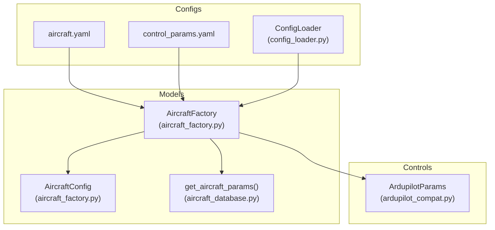
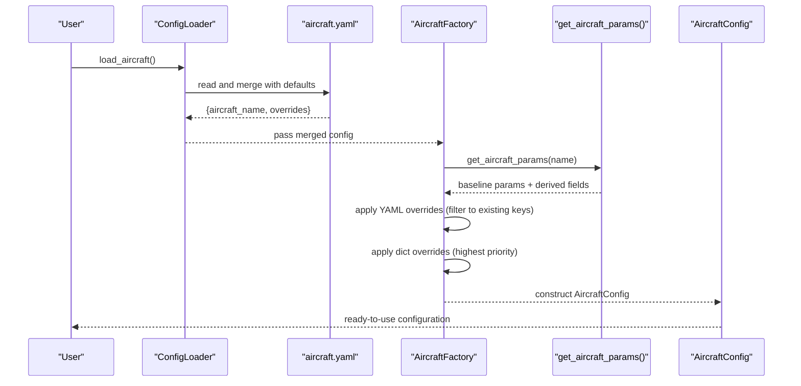
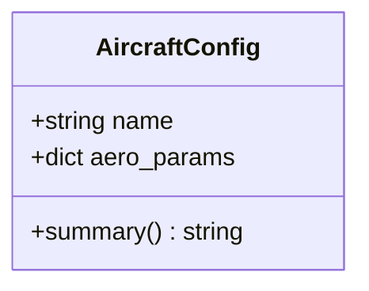
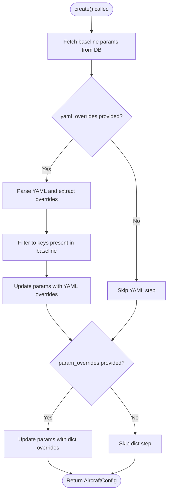
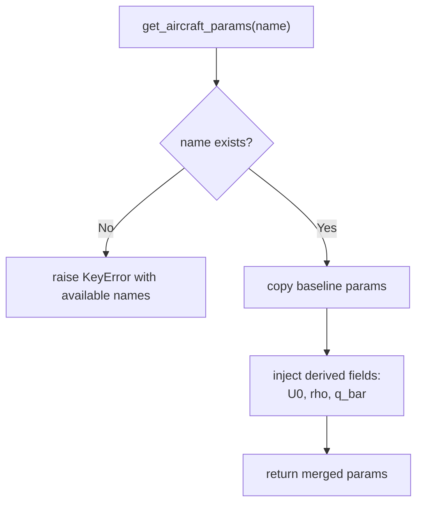
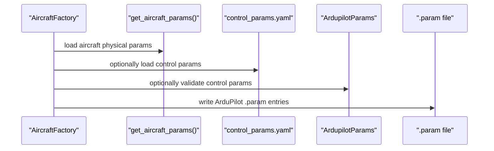
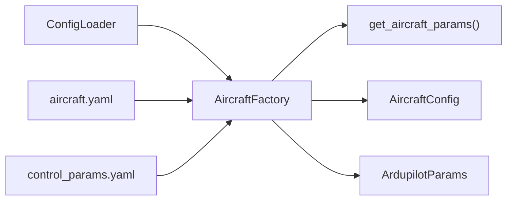

# Aircraft Factory Pattern

<cite>
**Referenced Files in This Document**
- [aircraft_factory.py](file://src/models/aircraft_factory.py)
- [aircraft_database.py](file://src/models/aircraft_database.py)
- [aircraft.yaml](file://config/aircraft.yaml)
- [control_params.yaml](file://config/control_params.yaml)
- [ardupilot_compat.py](file://src/control/ardupilot_compat.py)
- [config_loader.py](file://src/utils/config_loader.py)
- [aircraft_factory.md](file://doc/zh/content/飞机模型系统/飞机工厂模式.md)
- [飞机参数配置.md](file://doc/zh/content/安装与配置/飞机参数配置.md)
- [配置加载器.md](file://doc/zh/content/工具与实用程序/配置加载器.md)
</cite>

## Table of Contents
1. [Introduction](#introduction)
2. [Project Structure](#project-structure)
3. [Core Components](#core-components)
4. [Architecture Overview](#architecture-overview)
5. [Detailed Component Analysis](#detailed-component-analysis)
6. [Dependency Analysis](#dependency-analysis)
7. [Performance Considerations](#performance-considerations)
8. [Troubleshooting Guide](#troubleshooting-guide)
9. [Conclusion](#conclusion)
10. [Appendices](#appendices)

## Introduction
This document explains the AircraftFactory pattern implementation that creates and manages aircraft configurations from database parameters. It covers the AircraftConfig class structure, parameter validation mechanisms, and the configuration creation workflow. It also documents parameter override capabilities (YAML and dictionary), ArduPilot parameter compatibility features, and derived property calculations for simulation efficiency. The lifecycle is traced from database lookup to a validated simulation-ready configuration. Practical examples of instantiation, parameter modification, and validation are included, along with error handling for invalid configurations and parameter conflicts.

## Project Structure
The AircraftFactory pattern sits at the intersection of configuration loading, parameter merging, and database access. The primary files involved are:
- Aircraft factory and configuration model
- Aircraft parameter database with derived fields
- YAML configuration files for aircraft selection and overrides
- Control parameter YAML for ArduPilot compatibility
- Configuration loader utilities for deep merging defaults and user overrides

**Diagram sources**
- [aircraft_factory.py](file://src/models/aircraft_factory.py#L15-L136)
- [aircraft_database.py](file://src/models/aircraft_database.py#L143-L183)
- [aircraft.yaml](file://config/aircraft.yaml#L1-L13)
- [control_params.yaml](file://config/control_params.yaml#L1-L45)
- [config_loader.py](file://src/utils/config_loader.py#L59-L82)
- [ardupilot_compat.py](file://src/control/ardupilot_compat.py#L17-L130)

**Section sources**
- [aircraft_factory.py](file://src/models/aircraft_factory.py#L1-L136)
- [aircraft_database.py](file://src/models/aircraft_database.py#L1-L183)
- [aircraft.yaml](file://config/aircraft.yaml#L1-L13)
- [control_params.yaml](file://config/control_params.yaml#L1-L45)
- [config_loader.py](file://src/utils/config_loader.py#L1-L82)
- [ardupilot_compat.py](file://src/control/ardupilot_compat.py#L1-L130)

## Core Components
- AircraftConfig: Holds the aircraft name and the merged aerodynamic/physical parameter dictionary. Provides a summary method for quick inspection.
- AircraftFactory: Static factory that builds AircraftConfig instances from database defaults, applying YAML and/or dictionary overrides. Also exports ArduPilot-compatible parameter files.
- Aircraft Database: Supplies baseline parameters per aircraft and injects derived fields (e.g., cruise speed, air density, dynamic pressure).
- Configuration Loader: Loads and merges YAML configuration files with defaults, enabling flexible configuration management.
- ArduPilot Compatibility: Provides a parameter container with strict validation and conversion helpers for ArduPilot naming conventions.

**Section sources**
- [aircraft_factory.py](file://src/models/aircraft_factory.py#L15-L37)
- [aircraft_factory.py](file://src/models/aircraft_factory.py#L42-L135)
- [aircraft_database.py](file://src/models/aircraft_database.py#L143-L183)
- [config_loader.py](file://src/utils/config_loader.py#L59-L82)
- [ardupilot_compat.py](file://src/control/ardupilot_compat.py#L17-L130)

## Architecture Overview
The factory pattern orchestrates the creation of simulation-ready aircraft configurations:
- Input: aircraft name and optional overrides via YAML path or dictionary.
- Process: fetch baseline parameters from the database, apply YAML overrides (supporting nested or flat structure), then apply dictionary overrides (highest priority).
- Output: AircraftConfig containing validated and merged parameters, including derived fields injected by the database.

**Diagram sources**
- [config_loader.py](file://src/utils/config_loader.py#L68-L70)
- [aircraft_factory.py](file://src/models/aircraft_factory.py#L77-L92)
- [aircraft_factory.py](file://src/models/aircraft_factory.py#L42-L74)
- [aircraft_database.py](file://src/models/aircraft_database.py#L143-L166)

## Detailed Component Analysis

### AircraftConfig
AircraftConfig encapsulates:
- name: The aircraft identifier used as a key in the database.
- aero_params: The merged dictionary of aerodynamic, geometric, and inertial parameters, including derived fields injected by the database.

It provides a summary method to produce a concise human-readable overview of key parameters.

**Diagram sources**
- [aircraft_factory.py](file://src/models/aircraft_factory.py#L15-L37)

**Section sources**
- [aircraft_factory.py](file://src/models/aircraft_factory.py#L15-L37)

### AircraftFactory
AircraftFactory offers three primary static methods:
- create(name, yaml_overrides=None, param_overrides=None): Builds an AircraftConfig by fetching baseline parameters and applying overrides in order.
- from_yaml(config_path): Loads an aircraft.yaml file and delegates to create with extracted overrides.
- export_ardupilot_params(name, output_path, control_yaml=None): Exports a .param file compatible with ArduPilot, combining aircraft physical parameters and optional control parameters.

Key behaviors:
- Override precedence: YAML overrides (nested or flat) then dictionary overrides (highest priority).
- Safety: Only keys present in the database are applied during override steps.
- Derived parameters: Automatically computed by the database accessor and included in the returned configuration.

**Diagram sources**
- [aircraft_factory.py](file://src/models/aircraft_factory.py#L42-L74)

**Section sources**
- [aircraft_factory.py](file://src/models/aircraft_factory.py#L42-L92)
- [aircraft_factory.py](file://src/models/aircraft_factory.py#L95-L135)

### Aircraft Database and Derived Properties
The database supplies:
- Baseline parameter dictionaries for multiple aircraft models.
- A public accessor that returns a shallow copy of the selected aircraft’s parameters and injects derived fields:
  - U0 = Mach × speed_of_sound
  - rho = sea_level_ISA_density
  - q_bar = 0.5 × rho × U0^2

This ensures downstream dynamics modules receive consistent, ready-to-use parameters.

**Diagram sources**
- [aircraft_database.py](file://src/models/aircraft_database.py#L143-L166)

**Section sources**
- [aircraft_database.py](file://src/models/aircraft_database.py#L143-L166)

### ArduPilot Parameter Compatibility
ArdupilotParams provides:
- A dataclass with fields matching ArduPilot naming conventions.
- Methods to load from YAML, convert to/from dictionaries, and validate ranges.
- A convenience property to convert centidegree roll limits to degrees.

AircraftFactory.export_ardupilot_params integrates aircraft physical parameters with optional control parameters loaded from control_params.yaml, writing a .param file suitable for ArduPilot ground stations or hardware-in-the-loop setups.

**Diagram sources**
- [aircraft_factory.py](file://src/models/aircraft_factory.py#L95-L135)
- [ardupilot_compat.py](file://src/control/ardupilot_compat.py#L74-L129)
- [control_params.yaml](file://config/control_params.yaml#L1-L45)

**Section sources**
- [aircraft_factory.py](file://src/models/aircraft_factory.py#L95-L135)
- [ardupilot_compat.py](file://src/control/ardupilot_compat.py#L17-L130)
- [control_params.yaml](file://config/control_params.yaml#L1-L45)

### Configuration Loading and Merging
ConfigLoader loads and merges YAML files with defaults:
- load_aircraft(): merges aircraft.yaml with default aircraft settings, supporting nested overrides.
- Other loaders for simulation, trajectory, and control parameters.

This enables flexible configuration management and aligns with the factory’s YAML override mechanism.

**Section sources**
- [config_loader.py](file://src/utils/config_loader.py#L59-L82)
- [aircraft.yaml](file://config/aircraft.yaml#L1-L13)

## Dependency Analysis
The factory depends on the database for baseline parameters and on configuration utilities for YAML parsing and merging. The ArduPilot compatibility module is used by the factory’s export routine.

**Diagram sources**
- [aircraft_factory.py](file://src/models/aircraft_factory.py#L12-L13)
- [aircraft_database.py](file://src/models/aircraft_database.py#L143-L166)
- [config_loader.py](file://src/utils/config_loader.py#L68-L70)
- [aircraft.yaml](file://config/aircraft.yaml#L1-L13)
- [control_params.yaml](file://config/control_params.yaml#L1-L45)

**Section sources**
- [aircraft_factory.py](file://src/models/aircraft_factory.py#L12-L13)
- [aircraft_database.py](file://src/models/aircraft_database.py#L143-L166)
- [config_loader.py](file://src/utils/config_loader.py#L68-L70)

## Performance Considerations
- Parameter lookup: O(1) dictionary access in the database.
- Parameter merging: O(n) where n is the number of override keys.
- Derived parameter computation: O(1) constant-time arithmetic.
- Recommendations:
  - Reuse merged parameter dictionaries in batch simulations to minimize repeated loads.
  - Prefer dictionary overrides for runtime tuning to avoid repeated file I/O.
  - Keep override sets minimal to reduce update overhead.

[No sources needed since this section provides general guidance]

## Troubleshooting Guide
Common issues and resolutions:
- Aircraft name not found
  - Symptom: KeyError indicating the requested name is not in the database.
  - Action: Verify spelling and consult the available list of aircraft names.
- YAML file path errors
  - Symptom: File not found or parse failures.
  - Action: Confirm the path exists and the YAML is syntactically valid; ensure overrides are present under the expected key.
- Parameter key filtering
  - Symptom: Overridden keys not taking effect.
  - Cause: Keys not present in the database are ignored during merging.
  - Action: Match keys exactly to those in the database.
- ArduPilot parameter validation
  - Symptom: Warnings about out-of-range values.
  - Action: Adjust control parameters within the validated ranges enforced by the ArduPilot parameter container.

**Section sources**
- [aircraft_database.py](file://src/models/aircraft_database.py#L153-L156)
- [aircraft_factory.py](file://src/models/aircraft_factory.py#L64-L72)
- [aircraft_factory.py](file://src/models/aircraft_factory.py#L84-L88)
- [ardupilot_compat.py](file://src/control/ardupilot_compat.py#L104-L129)

## Conclusion
The AircraftFactory pattern provides a clean, extensible way to manage aircraft configurations. By combining database-backed baselines with flexible YAML and dictionary overrides, it produces validated, simulation-ready configurations efficiently. The integration with ArduPilot parameter naming and validation further supports real-world control system workflows. Derived properties ensure downstream modules receive consistent, computed values without manual intervention.

[No sources needed since this section summarizes without analyzing specific files]

## Appendices

### Configuration Lifecycle Example
- Load configuration: Use ConfigLoader.load_aircraft() to obtain a merged dictionary from aircraft.yaml and defaults.
- Instantiate aircraft: Call AircraftFactory.from_yaml() to build an AircraftConfig with overrides applied.
- Modify parameters: Pass a dictionary of overrides to AircraftFactory.create() for highest-priority changes.
- Validate configuration: Use AircraftConfig.summary() to inspect final parameters and confirm derived fields are present.
- Export ArduPilot parameters: Call AircraftFactory.export_ardupilot_params() to generate a .param file for control tuning.

**Section sources**
- [config_loader.py](file://src/utils/config_loader.py#L68-L70)
- [aircraft_factory.py](file://src/models/aircraft_factory.py#L77-L92)
- [aircraft_factory.py](file://src/models/aircraft_factory.py#L42-L74)
- [aircraft_factory.py](file://src/models/aircraft_factory.py#L28-L36)
- [aircraft_factory.py](file://src/models/aircraft_factory.py#L95-L135)