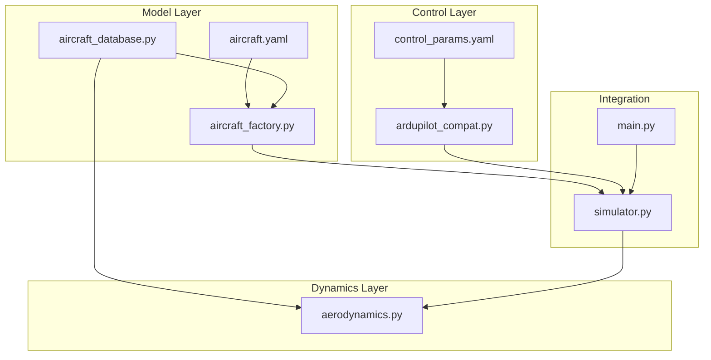
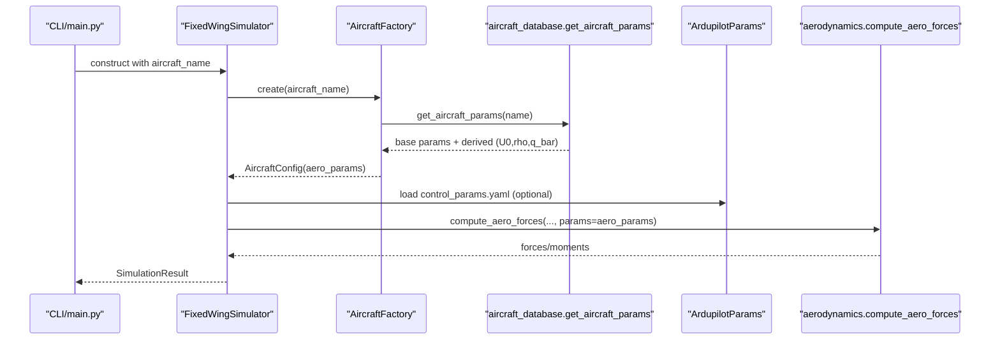
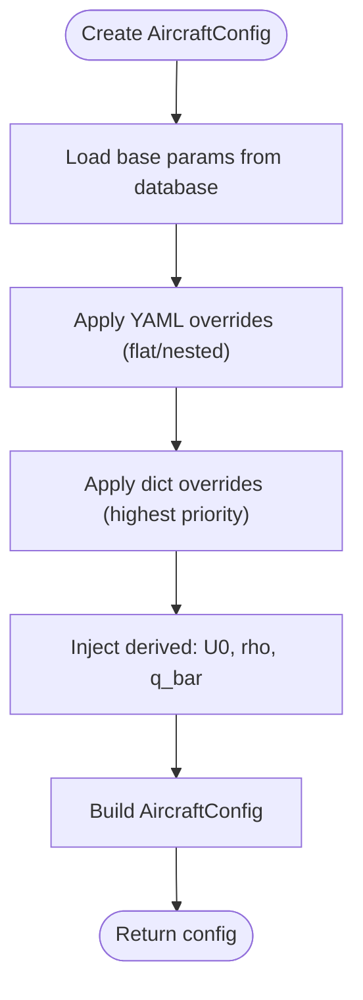
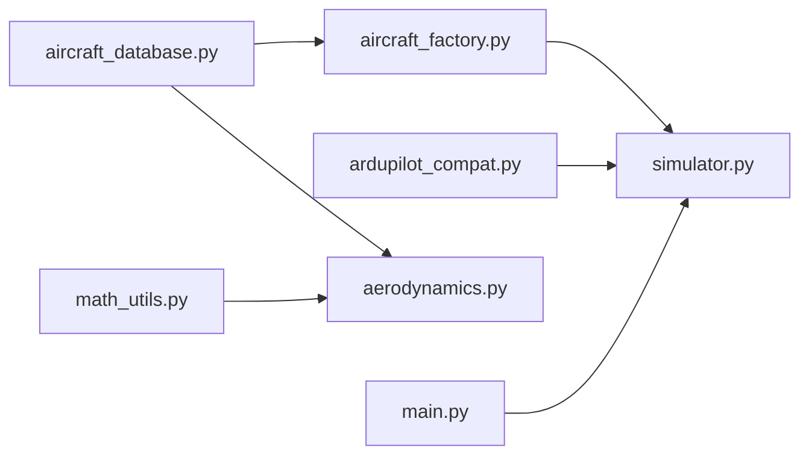

# Aircraft Modeling

<cite>
**Referenced Files in This Document**
- [aircraft_factory.py](file://src/models/aircraft_factory.py)
- [aircraft_database.py](file://src/models/aircraft_database.py)
- [aircraft.yaml](file://config/aircraft.yaml)
- [control_params.yaml](file://config/control_params.yaml)
- [ardupilot_compat.py](file://src/control/ardupilot_compat.py)
- [aerodynamics.py](file://src/dynamics/aerodynamics.py)
- [simulator.py](file://src/simulation/simulator.py)
- [main.py](file://main.py)
- [math_utils.py](file://src/utils/math_utils.py)
- [test_dynamics.py](file://tests/test_dynamics.py)
</cite>

## Table of Contents
1. [Introduction](#introduction)
2. [Project Structure](#project-structure)
3. [Core Components](#core-components)
4. [Architecture Overview](#architecture-overview)
5. [Detailed Component Analysis](#detailed-component-analysis)
6. [Dependency Analysis](#dependency-analysis)
7. [Performance Considerations](#performance-considerations)
8. [Troubleshooting Guide](#troubleshooting-guide)
9. [Conclusion](#conclusion)
10. [Appendices](#appendices)

## Introduction
This document explains the aircraft modeling system centered on the AircraftFactory pattern for configuration management and parameter validation. It documents the aircraft parameter database structure (aerodynamic coefficients, mass properties, control surface characteristics), the AircraftConfig class and derived property calculations for simulation efficiency, aircraft selection mechanisms, parameter override capabilities, and ArduPilot parameter compatibility. It also provides examples of configuration, tuning, and custom setups, and clarifies how parameters influence simulation accuracy, validation rules, and unit consistency.

## Project Structure
The aircraft modeling system spans three layers:
- Model layer: aircraft parameter database and factory for configuration creation and merging
- Control layer: ArduPilot-compatible parameter container and validation
- Dynamics layer: aerodynamic force/moment computation using aircraft parameters

**Diagram sources**
- [aircraft_database.py](file://src/models/aircraft_database.py#L1-L183)
- [aircraft_factory.py](file://src/models/aircraft_factory.py#L1-L136)
- [aircraft.yaml](file://config/aircraft.yaml#L1-L13)
- [control_params.yaml](file://config/control_params.yaml#L1-L45)
- [ardupilot_compat.py](file://src/control/ardupilot_compat.py#L1-L130)
- [aerodynamics.py](file://src/dynamics/aerodynamics.py#L1-L148)
- [simulator.py](file://src/simulation/simulator.py#L1-L642)
- [main.py](file://main.py#L1-L145)

**Section sources**
- [aircraft_database.py](file://src/models/aircraft_database.py#L1-L183)
- [aircraft_factory.py](file://src/models/aircraft_factory.py#L1-L136)
- [aircraft.yaml](file://config/aircraft.yaml#L1-L13)
- [control_params.yaml](file://config/control_params.yaml#L1-L45)
- [ardupilot_compat.py](file://src/control/ardupilot_compat.py#L1-L130)
- [aerodynamics.py](file://src/dynamics/aerodynamics.py#L1-L148)
- [simulator.py](file://src/simulation/simulator.py#L1-L642)
- [main.py](file://main.py#L1-L145)

## Core Components
- AircraftConfig: encapsulates an aircraft’s name and a merged parameter dictionary for the simulation engine.
- AircraftFactory: creates AircraftConfig instances by loading base parameters from the database, applying YAML and/or dict overrides, and exporting ArduPilot-compatible parameter sets.
- Aircraft parameter database: central registry of 7 fixed-wing aircraft with geometry, inertia, aerodynamic coefficients, and derived quantities injected at runtime.
- ArduPilot parameter container: validates and exports control parameters compatible with ArduPilot naming conventions.

Key responsibilities:
- Parameter sourcing and merging
- Derived quantity injection (U0, rho, q_bar)
- Validation and error handling
- ArduPilot parameter export for control tuning

**Section sources**
- [aircraft_factory.py](file://src/models/aircraft_factory.py#L15-L136)
- [aircraft_database.py](file://src/models/aircraft_database.py#L143-L182)
- [ardupilot_compat.py](file://src/control/ardupilot_compat.py#L17-L130)

## Architecture Overview
The factory pattern orchestrates aircraft configuration creation and validation, feeding parameters into the simulation and control layers.

**Diagram sources**
- [main.py](file://main.py#L98-L141)
- [simulator.py](file://src/simulation/simulator.py#L130-L234)
- [aircraft_factory.py](file://src/models/aircraft_factory.py#L42-L74)
- [aircraft_database.py](file://src/models/aircraft_database.py#L143-L166)
- [ardupilot_compat.py](file://src/control/ardupilot_compat.py#L82-L88)
- [aerodynamics.py](file://src/dynamics/aerodynamics.py#L35-L147)

## Detailed Component Analysis

### AircraftFactory Pattern and AircraftConfig
- AircraftConfig: holds name and aero_params; provides a concise summary for quick verification.
- AircraftFactory.create: loads base parameters, merges YAML overrides (supports flat or nested overrides), then applies dict overrides (highest priority). Returns an AircraftConfig ready for simulation initialization.
- AircraftFactory.from_yaml: convenience method to load from a config file containing aircraft_name and optional overrides.
- AircraftFactory.export_ardupilot_params: exports a consolidated set of ArduPilot-compatible parameters including mass, wing geometry, moments of inertia, cruise speed, and control parameters loaded from control_params.yaml.

Validation and error handling:
- Unknown aircraft raises a KeyError with available names.
- YAML path existence is validated; missing files trigger exceptions.
- Only keys present in the database are considered during override merges.

Derived properties:
- get_aircraft_params injects U0 = Mach × sound speed, rho = sea-level density, q_bar = 0.5 × rho × U0^2.

**Diagram sources**
- [aircraft_factory.py](file://src/models/aircraft_factory.py#L42-L74)
- [aircraft_database.py](file://src/models/aircraft_database.py#L143-L166)

**Section sources**
- [aircraft_factory.py](file://src/models/aircraft_factory.py#L15-L136)
- [aircraft_database.py](file://src/models/aircraft_database.py#L143-L166)

### Aircraft Parameter Database Structure
The database defines 7 fixed-wing aircraft with:
- Identification: name, company, country
- Geometry and inertia: mass, wing area S, mean chord c, wingspan b, moments Ixx, Iyy, Izz, and product Ixz
- Aerodynamic coefficients: longitudinal (CL_0, CL_alpha, CL_q, CL_deltae; CD_0, CD_alpha, CD_q, CD_deltae; Cm_0, Cm_alpha, Cm_q, Cm_deltae) and lateral-directional (CYb, CYp, CYr, CYda, CYdr; Clb, Clp, Clr, Clda, Cldr; Cnb, Cnp, Cnr, Cnda, Cndr)
- Flight regime: Mach number

Derived quantities injected at runtime:
- U0 = Mach × A_SOUND
- rho = RHO0 (sea-level ISA)
- q_bar = 0.5 × rho × U0^2

These derived quantities are used by aerodynamics and other modules.

**Section sources**
- [aircraft_database.py](file://src/models/aircraft_database.py#L29-L133)
- [aircraft_database.py](file://src/models/aircraft_database.py#L143-L166)

### Aerodynamics Integration and Derived Property Usage
The aerodynamics module computes forces and moments using:
- S, c, b, U0 from the parameter dictionary
- Dynamic pressure q_bar computed internally from rho and airspeed
- Non-dimensional coefficients from parameters for longitudinal and lateral-directional contributions
- Body-frame conventions for forces and moments

This ensures simulation accuracy by consistently using the same parameter set and derived quantities across modules.

**Section sources**
- [aerodynamics.py](file://src/dynamics/aerodynamics.py#L35-L147)
- [aircraft_database.py](file://src/models/aircraft_database.py#L159-L164)

### ArduPilot Parameter Compatibility
The ArdupilotParams container:
- Mirrors ArduPilot Plane parameter names
- Loads from YAML or dict, filters unknown keys
- Validates ranges and prints warnings for out-of-bounds values
- Exports to YAML or dict for persistence

The factory supports exporting aircraft parameters plus control parameters into a single ArduPilot .param file for seamless integration with ArduPilot workflows.

**Section sources**
- [ardupilot_compat.py](file://src/control/ardupilot_compat.py#L17-L130)
- [aircraft_factory.py](file://src/models/aircraft_factory.py#L95-L135)

### Aircraft Selection Mechanisms and Overrides
- CLI selection: main.py accepts an --aircraft argument constrained to the database list.
- YAML selection: aircraft.yaml specifies aircraft_name and optional overrides.
- Programmatic selection: simulator.py constructs FixedWingSimulator with aircraft_name, which internally uses AircraftFactory.create.
- Override precedence:
  1) YAML overrides (flat or nested)
  2) Dict overrides (highest priority)
  3) Database defaults

**Section sources**
- [main.py](file://main.py#L32-L95)
- [aircraft.yaml](file://config/aircraft.yaml#L1-L13)
- [simulator.py](file://src/simulation/simulator.py#L130-L157)
- [aircraft_factory.py](file://src/models/aircraft_factory.py#L42-L74)

### Example Workflows and Customization
- Select a baseline aircraft and adjust mass or wing area via aircraft.yaml overrides.
- Tune control parameters in control_params.yaml and export ArduPilot .param for hardware-in-the-loop or ground control station integration.
- Validate parameter sets using the summary and info utilities, and confirm derived quantities are injected.

Note: Refer to the example scripts and documentation for end-to-end usage patterns.

**Section sources**
- [aircraft.yaml](file://config/aircraft.yaml#L1-L13)
- [control_params.yaml](file://config/control_params.yaml#L1-L45)
- [aircraft_factory.py](file://src/models/aircraft_factory.py#L95-L135)

## Dependency Analysis
- Internal dependencies:
  - aircraft_database.py depends on typing and math; provides get_aircraft_params and list_aircraft.
  - aircraft_factory.py depends on yaml, os, dataclasses, and aircraft_database.
  - aerodynamics.py depends on math_utils for angles and dynamic pressure.
  - simulator.py composes factory, database, ardupilot_compat, and dynamics.
- External dependencies:
  - PyYAML for YAML parsing
  - NumPy for numerical operations
- No circular imports; clear separation of concerns.

**Diagram sources**
- [aircraft_database.py](file://src/models/aircraft_database.py#L1-L183)
- [aircraft_factory.py](file://src/models/aircraft_factory.py#L1-L136)
- [ardupilot_compat.py](file://src/control/ardupilot_compat.py#L1-L130)
- [aerodynamics.py](file://src/dynamics/aerodynamics.py#L1-L148)
- [math_utils.py](file://src/utils/math_utils.py#L1-L124)
- [simulator.py](file://src/simulation/simulator.py#L1-L642)
- [main.py](file://main.py#L1-L145)

**Section sources**
- [aircraft_database.py](file://src/models/aircraft_database.py#L1-L183)
- [aircraft_factory.py](file://src/models/aircraft_factory.py#L1-L136)
- [ardupilot_compat.py](file://src/control/ardupilot_compat.py#L1-L130)
- [aerodynamics.py](file://src/dynamics/aerodynamics.py#L1-L148)
- [math_utils.py](file://src/utils/math_utils.py#L1-L124)
- [simulator.py](file://src/simulation/simulator.py#L1-L642)
- [main.py](file://main.py#L1-L145)

## Performance Considerations
- Lookup and merge:
  - Database lookup: O(1) dictionary access
  - Override merge: O(n) over the number of override keys
- Derived computation: O(1) constant-time arithmetic
- Memory: shallow copies minimize overhead; derived quantities are computed per request
- Recommendations:
  - Cache frequently used configurations if running batch simulations
  - Keep override sets minimal to reduce merge cost
  - Validate units and ranges early to avoid repeated corrections

[No sources needed since this section provides general guidance]

## Troubleshooting Guide
Common issues and resolutions:
- Unknown aircraft name: KeyError with available list; verify spelling and case.
- YAML path not found: FileNotFoundError; ensure path exists and is readable.
- Parameter out of range: ArduPilot validation prints warnings; adjust control_params.yaml accordingly.
- Incorrect derived quantities: confirm Mach and that derived parameters are injected by the database accessor.

Verification tips:
- Use list_aircraft() and aircraft_info() to inspect available models and summaries.
- Print AircraftConfig.summary() to review final parameters after overrides.
- Confirm q_bar and U0 are present in the parameter dictionary.

**Section sources**
- [aircraft_database.py](file://src/models/aircraft_database.py#L143-L166)
- [aircraft_database.py](file://src/models/aircraft_database.py#L169-L182)
- [aircraft_factory.py](file://src/models/aircraft_factory.py#L28-L36)
- [ardupilot_compat.py](file://src/control/ardupilot_compat.py#L104-L129)

## Conclusion
The AircraftFactory pattern provides a robust, extensible mechanism for aircraft configuration management. By centralizing parameter sourcing, enforcing validation, and supporting layered overrides, it enables accurate and efficient simulations. The integration with ArduPilot-compatible parameters further enhances practical applicability for control development and hardware-in-the-loop testing. Adhering to unit consistency and validation rules ensures reliable simulation outcomes across diverse aircraft and scenarios.

[No sources needed since this section summarizes without analyzing specific files]

## Appendices

### A. Aircraft Parameter Categories and Units
- Identification: name (str), company (str), country (str)
- Geometry and inertia: mass (kg), S (m²), c (m), b (m), Ixx, Iyy, Izz (kg·m²), Ixz (kg·m²)
- Aerodynamic coefficients: dimensionless; subscripts indicate dependence on angle of attack (alpha), pitch rate (q), elevator deflection (deltae), sideslip (beta), roll rate (p), yaw rate (r), and control surface deflections (da, dr)
- Flight regime: Mach (dimensionless)

**Section sources**
- [aircraft_database.py](file://src/models/aircraft_database.py#L29-L133)

### B. Derived Properties and Their Role
- U0 = Mach × A_SOUND (m/s)
- rho = RHO0 (kg/m³)
- q_bar = 0.5 × rho × U0² (Pa)
- Used by aerodynamics for force/moment computation and by tests to validate numerical stability.

**Section sources**
- [aircraft_database.py](file://src/models/aircraft_database.py#L159-L164)
- [aerodynamics.py](file://src/dynamics/aerodynamics.py#L76-L77)
- [test_dynamics.py](file://tests/test_dynamics.py#L190-L195)

### C. Validation Rules and Unit Consistency
- Parameter names: follow historical TypedDict conventions for drop-in replacement
- Control parameters: validated against predefined ranges; out-of-range values produce warnings
- Units: ensure inputs and parameters are in SI base units; derived quantities are computed consistently
- Tests: validate dynamic pressure computation, symmetry, and numerical stability under low-speed conditions

**Section sources**
- [aircraft_database.py](file://src/models/aircraft_database.py#L25-L26)
- [ardupilot_compat.py](file://src/control/ardupilot_compat.py#L104-L129)
- [test_dynamics.py](file://tests/test_dynamics.py#L190-L195)

### D. Example Scenarios
- Baseline simulation: select TB2 from aircraft.yaml; run closed-loop simulation via main.py
- Parameter tuning: adjust control_params.yaml; export ArduPilot .param using factory export
- Custom aircraft: add a new aircraft entry to the database and use overrides to adapt baseline characteristics

**Section sources**
- [aircraft.yaml](file://config/aircraft.yaml#L1-L13)
- [control_params.yaml](file://config/control_params.yaml#L1-L45)
- [aircraft_factory.py](file://src/models/aircraft_factory.py#L95-L135)
- [main.py](file://main.py#L98-L141)