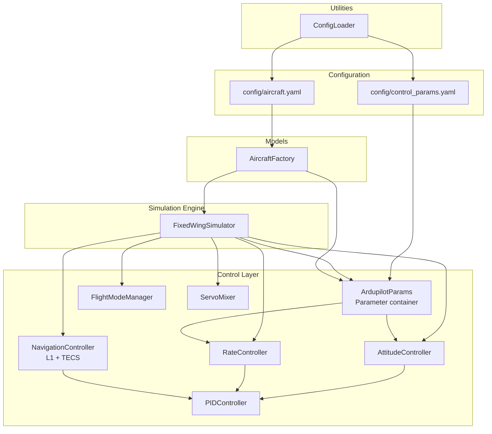
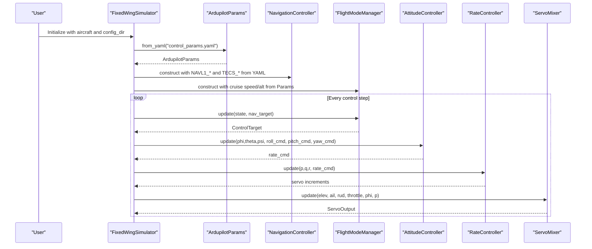
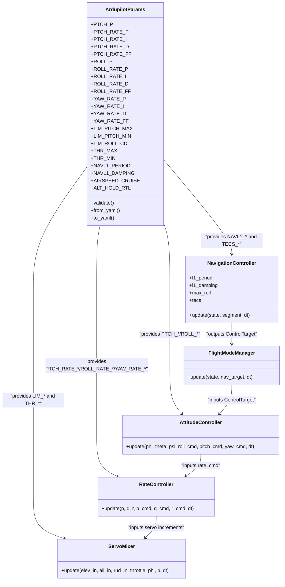
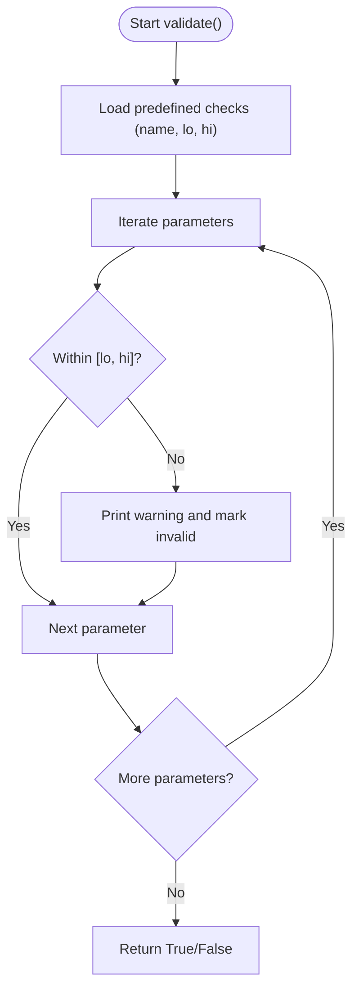
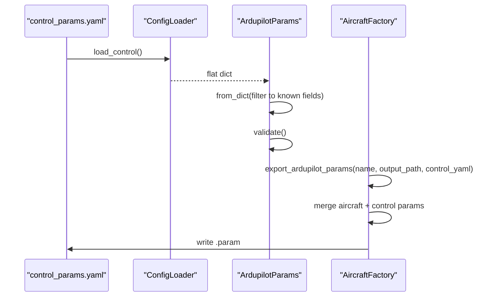
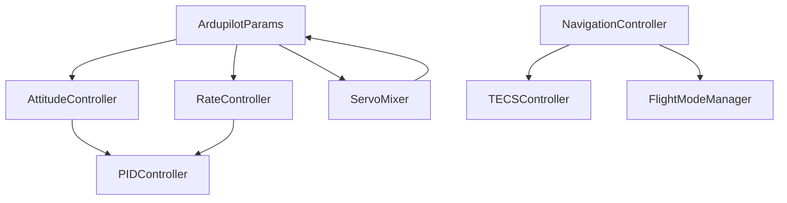

# ArduPilot Compatibility

<cite>
**Referenced Files in This Document**
- [src/control/ardupilot_compat.py](file://src/control/ardupilot_compat.py)
- [doc/zh/content/控制系统/ArduPilot兼容参数.md](file://doc/zh/content/控制系统/ArduPilot兼容参数.md)
- [config/control_params.yaml](file://config/control_params.yaml)
- [config/aircraft.yaml](file://config/aircraft.yaml)
- [src/simulation/simulator.py](file://src/simulation/simulator.py)
- [src/control/attitude_controller.py](file://src/control/attitude_controller.py)
- [src/control/rate_controller.py](file://src/control/rate_controller.py)
- [src/control/pid_controller.py](file://src/control/pid_controller.py)
- [src/control/navigation_controller.py](file://src/control/navigation_controller.py)
- [src/control/tecs_controller.py](file://src/control/tecs_controller.py)
- [src/control/flight_mode_manager.py](file://src/control/flight_mode_manager.py)
- [src/control/servo_mixer.py](file://src/control/servo_mixer.py)
- [src/models/aircraft_factory.py](file://src/models/aircraft_factory.py)
- [src/utils/config_loader.py](file://src/utils/config_loader.py)
</cite>

## Table of Contents
1. [Introduction](#introduction)
2. [Project Structure](#project-structure)
3. [Core Components](#core-components)
4. [Architecture Overview](#architecture-overview)
5. [Detailed Component Analysis](#detailed-component-analysis)
6. [Dependency Analysis](#dependency-analysis)
7. [Performance Considerations](#performance-considerations)
8. [Troubleshooting Guide](#troubleshooting-guide)
9. [Conclusion](#conclusion)
10. [Appendices](#appendices)

## Introduction
This document explains how the simulation integrates with ArduPilot through a parameter compatibility layer and a five-layer control architecture aligned with ArduPilot’s Plane control system. It details:
- Parameter mapping between the simulation and ArduPilot configurations
- Compatible parameter names, value ranges, and units
- Control architecture alignment with ArduPilot’s five-layer system
- Examples of parameter configuration, simulation-to-hardware transfer, and validation procedures
- Benefits of ArduPilot compatibility for real-world integration and testing

## Project Structure
The ArduPilot compatibility layer centers around a parameter container that mirrors ArduPilot’s naming conventions and integrates tightly with the control stack and simulation engine.

**Diagram sources**
- [src/simulation/simulator.py](file://src/simulation/simulator.py#L165-L216)
- [src/control/ardupilot_compat.py](file://src/control/ardupilot_compat.py#L17-L130)
- [src/models/aircraft_factory.py](file://src/models/aircraft_factory.py#L95-L135)
- [src/utils/config_loader.py](file://src/utils/config_loader.py#L68-L82)

**Section sources**
- [src/simulation/simulator.py](file://src/simulation/simulator.py#L165-L216)
- [src/control/ardupilot_compat.py](file://src/control/ardupilot_compat.py#L17-L130)
- [src/utils/config_loader.py](file://src/utils/config_loader.py#L68-L82)

## Core Components
- ArdupilotParams: A dataclass that mirrors ArduPilot Plane parameter names and provides YAML load/save and basic validation.
- Five-layer control architecture:
  - Layer 1 (Outer loop): NavigationController (L1 + TECS)
  - Layer 2: FlightModeManager (mode selection and targets)
  - Layer 3: AttitudeController (angle-to-rate commands)
  - Layer 4: RateController (rate control with SAS)
  - Layer 5 (Innermost): ServoMixer (actuator allocation and limits)
- Utilities:
  - ConfigLoader: loads YAML configuration files
  - AircraftFactory: merges aircraft parameters and exports ArduPilot-compatible parameter sets

Key integration points:
- ArdupilotParams is loaded from control_params.yaml and validated during simulation initialization.
- NavigationController reads NAVL1_PERIOD and NAVL1_DAMPING; TECS parameters are read from the same YAML with defaults.
- AttitudeController and RateController consume PTCH_*, ROLL_*, YAW_* parameters.
- ServoMixer enforces LIM_* and THR_* limits and applies coordinated turn compensation.

**Section sources**
- [src/control/ardupilot_compat.py](file://src/control/ardupilot_compat.py#L17-L130)
- [config/control_params.yaml](file://config/control_params.yaml#L1-L45)
- [src/simulation/simulator.py](file://src/simulation/simulator.py#L165-L216)
- [src/control/navigation_controller.py](file://src/control/navigation_controller.py#L45-L116)
- [src/control/attitude_controller.py](file://src/control/attitude_controller.py#L33-L134)
- [src/control/rate_controller.py](file://src/control/rate_controller.py#L32-L109)
- [src/control/servo_mixer.py](file://src/control/servo_mixer.py#L54-L153)
- [src/utils/config_loader.py](file://src/utils/config_loader.py#L68-L82)
- [src/models/aircraft_factory.py](file://src/models/aircraft_factory.py#L95-L135)

## Architecture Overview
The simulation initializes ArdupilotParams from YAML, constructs the five-layer control system, and runs closed-loop simulations. The control chain mirrors ArduPilot’s structure: NavigationController computes targets, FlightModeManager selects modes, AttitudeController converts angles to rates, RateController produces actuator increments, and ServoMixer applies limits and conversions.

**Diagram sources**
- [src/simulation/simulator.py](file://src/simulation/simulator.py#L165-L216)
- [src/control/navigation_controller.py](file://src/control/navigation_controller.py#L134-L202)
- [src/control/flight_mode_manager.py](file://src/control/flight_mode_manager.py#L173-L212)
- [src/control/attitude_controller.py](file://src/control/attitude_controller.py#L81-L122)
- [src/control/rate_controller.py](file://src/control/rate_controller.py#L68-L98)
- [src/control/servo_mixer.py](file://src/control/servo_mixer.py#L80-L149)

## Detailed Component Analysis

### Parameter Mapping and Compatibility
- Parameter container: ArdupilotParams mirrors ArduPilot Plane parameter names and supports YAML import/export and validation.
- Compatible parameter families:
  - Attitude axes: PTCH_* (outer loop P only), ROLL_* (outer loop P only), YAW_* (rate loop only)
  - Limits: LIM_PITCH_MAX/MIN (degrees), LIM_ROLL_CD (centidegrees), THR_MAX/MIN
  - Navigation: NAVL1_PERIOD, NAVL1_DAMPING
  - Speed/altitude: AIRSPEED_CRUISE, ALT_HOLD_RTL
  - TECS: TECS_CLMB_MAX, TECS_SINK_MIN, TECS_SINK_MAX, TECS_TIME_CONST, TECS_THR_DAMP, TECS_PTCH_DAMP, TECS_INTEG_GAIN, TECS_SPDWEIGHT, TECS_RLL2THR, TECS_PITCH_MAX, TECS_PITCH_MIN, TECS_THR_CRUISE, TECS_HDEM_TCONST
- Units and ranges:
  - Angles: degrees for LIM_* and TECS_PITCH_*; converted to radians internally where needed
  - Percentages: THR_* normalized 0–1
  - Frequencies/time constants: seconds
  - Speed: meters per second
- Validation: ArdupilotParams.validate() checks typical ranges and prints warnings for out-of-range values.

Examples of parameter configuration:
- Configure cruise speed and altitude via AIRSPEED_CRUISE and ALT_HOLD_RTL.
- Tune attitude and rate gains via PTCH_*, ROLL_*, YAW_*.
- Adjust TECS performance via TECS_* parameters.

Transfer to hardware:
- Export ArduPilot-compatible parameter sets using AircraftFactory.export_ardupilot_params(), which merges aircraft physical parameters and control parameters into a .param file.

Validation procedures:
- Load parameters from YAML and call validate() during initialization.
- Monitor warnings printed by validate() and adjust values accordingly.
- Use SimulationResult.summary() to inspect trim and final states post-run.

Benefits for real-world integration:
- Drop-in parameter reuse across simulation and ArduPilot firmware.
- Consistent tuning methodology and terminology.
- Reduced risk of misconfiguration due to standardized parameter names and ranges.

**Section sources**
- [src/control/ardupilot_compat.py](file://src/control/ardupilot_compat.py#L17-L130)
- [config/control_params.yaml](file://config/control_params.yaml#L1-L45)
- [src/models/aircraft_factory.py](file://src/models/aircraft_factory.py#L95-L135)
- [src/simulation/simulator.py](file://src/simulation/simulator.py#L165-L216)

### Five-Layer Control Architecture Alignment
- Layer 1 (Outer loop): NavigationController implements L1 lateral navigation and TECS for altitude/airspeed control. It reads NAVL1_* and TECS_* parameters from YAML.
- Layer 2: FlightModeManager provides ArduPilot-compatible flight modes and generates ControlTarget objects consumed by the control layers.
- Layer 3: AttitudeController implements angle-to-rate conversion using PTCH_P and ROLL_P (ArduPilot Plane outer loop P-only strategy).
- Layer 4: RateController implements SAS with PTCH_RATE_*, ROLL_RATE_*, YAW_RATE_* parameters and optional feedforward.
- Layer 5 (Innermost): ServoMixer applies LIM_* and THR_* limits, coordinated turn compensation, and normalizes outputs.

**Diagram sources**
- [src/control/ardupilot_compat.py](file://src/control/ardupilot_compat.py#L17-L130)
- [src/control/navigation_controller.py](file://src/control/navigation_controller.py#L45-L116)
- [src/control/flight_mode_manager.py](file://src/control/flight_mode_manager.py#L115-L212)
- [src/control/attitude_controller.py](file://src/control/attitude_controller.py#L33-L134)
- [src/control/rate_controller.py](file://src/control/rate_controller.py#L32-L109)
- [src/control/servo_mixer.py](file://src/control/servo_mixer.py#L54-L153)

**Section sources**
- [src/control/navigation_controller.py](file://src/control/navigation_controller.py#L45-L116)
- [src/control/flight_mode_manager.py](file://src/control/flight_mode_manager.py#L115-L212)
- [src/control/attitude_controller.py](file://src/control/attitude_controller.py#L33-L134)
- [src/control/rate_controller.py](file://src/control/rate_controller.py#L32-L109)
- [src/control/servo_mixer.py](file://src/control/servo_mixer.py#L54-L153)

### Parameter Validation Flow

**Diagram sources**
- [src/control/ardupilot_compat.py](file://src/control/ardupilot_compat.py#L104-L130)

**Section sources**
- [src/control/ardupilot_compat.py](file://src/control/ardupilot_compat.py#L104-L130)

### YAML Loading and Export Mechanisms
- Loading: ConfigLoader.load_control() reads control_params.yaml; ArdupilotParams.from_yaml() filters to known fields and validates.
- Export: AircraftFactory.export_ardupilot_params() merges aircraft physical parameters and control parameters into a .param file compatible with ArduPilot.

**Diagram sources**
- [src/utils/config_loader.py](file://src/utils/config_loader.py#L68-L82)
- [src/control/ardupilot_compat.py](file://src/control/ardupilot_compat.py#L74-L98)
- [src/models/aircraft_factory.py](file://src/models/aircraft_factory.py#L95-L135)

**Section sources**
- [src/utils/config_loader.py](file://src/utils/config_loader.py#L68-L82)
- [src/control/ardupilot_compat.py](file://src/control/ardupilot_compat.py#L74-L98)
- [src/models/aircraft_factory.py](file://src/models/aircraft_factory.py#L95-L135)

## Dependency Analysis
The control architecture exhibits clear layering and minimal coupling:
- ArdupilotParams is a shared dependency across controllers.
- NavigationController depends on TECSController and FlightModeManager.
- AttitudeController and RateController depend on ArdupilotParams and PIDController.
- ServoMixer depends on ArdupilotParams and applies final limits.

**Diagram sources**
- [src/control/ardupilot_compat.py](file://src/control/ardupilot_compat.py#L17-L130)
- [src/control/pid_controller.py](file://src/control/pid_controller.py#L17-L117)
- [src/control/attitude_controller.py](file://src/control/attitude_controller.py#L33-L134)
- [src/control/rate_controller.py](file://src/control/rate_controller.py#L32-L109)
- [src/control/navigation_controller.py](file://src/control/navigation_controller.py#L45-L116)
- [src/control/tecs_controller.py](file://src/control/tecs_controller.py#L50-L116)
- [src/control/flight_mode_manager.py](file://src/control/flight_mode_manager.py#L115-L212)
- [src/control/servo_mixer.py](file://src/control/servo_mixer.py#L54-L153)

**Section sources**
- [src/control/ardupilot_compat.py](file://src/control/ardupilot_compat.py#L17-L130)
- [src/control/pid_controller.py](file://src/control/pid_controller.py#L17-L117)
- [src/control/attitude_controller.py](file://src/control/attitude_controller.py#L33-L134)
- [src/control/rate_controller.py](file://src/control/rate_controller.py#L32-L109)
- [src/control/navigation_controller.py](file://src/control/navigation_controller.py#L45-L116)
- [src/control/tecs_controller.py](file://src/control/tecs_controller.py#L50-L116)
- [src/control/flight_mode_manager.py](file://src/control/flight_mode_manager.py#L115-L212)
- [src/control/servo_mixer.py](file://src/control/servo_mixer.py#L54-L153)

## Performance Considerations
- Memory and CPU efficiency:
  - Dataclass-based ArdupilotParams reduces overhead.
  - PIDController uses clamping anti-windup and optional derivative filtering to stabilize computations.
  - ServoMixer applies rate limiting and coordinated turn compensation efficiently.
- Real-time guarantees:
  - Parameter validation occurs at initialization; controllers operate with minimal branching.
  - Hot-reload capability allows updating gains without restarting the simulation.

[No sources needed since this section provides general guidance]

## Troubleshooting Guide
Common issues and resolutions:
- Parameter range warnings: Review validate() warnings and adjust PTCH_*, ROLL_*, YAW_* and limits to within recommended ranges.
- YAML load errors: Verify control_params.yaml exists and is syntactically correct; ensure NAVL1_* and TECS_* keys are present if relying on them.
- Controller instability: Reduce aggressive gains (e.g., increase damping or reduce P/I gains gradually).
- Actuator saturation: Confirm THR_MIN/MAX and LIM_* settings; verify ServoMixer rate limiting is appropriate.

**Section sources**
- [src/control/ardupilot_compat.py](file://src/control/ardupilot_compat.py#L104-L130)
- [src/simulation/simulator.py](file://src/simulation/simulator.py#L165-L216)

## Conclusion
The ArduPilot compatibility layer enables seamless parameter reuse, consistent control architecture alignment, and robust validation. By mirroring ArduPilot’s five-layer control system and parameter naming conventions, the simulation facilitates realistic closed-loop control, efficient tuning workflows, and straightforward transfer of tuned parameters to real systems.

[No sources needed since this section summarizes without analyzing specific files]

## Appendices

### Parameter Reference and Ranges
- Attitude axes:
  - PTCH_P: typical 0.0–10.0
  - ROLL_P: typical 0.0–10.0
  - YAW_RATE_P: typical 0.0–5.0
- Rate axes:
  - PTCH_RATE_P/I/D/FF: typical 0.0–2.0
  - ROLL_RATE_P/I/D/FF: typical 0.0–2.0
  - YAW_RATE_P/I: typical 0.0–5.0
- Limits:
  - LIM_PITCH_MAX/MIN: typical 0.0–45.0 degrees
  - LIM_ROLL_CD: typical 0.0–9000.0 (centidegrees)
  - THR_MAX/MIN: 0.0–1.0
- Navigation:
  - NAVL1_PERIOD: typical 10–60 seconds
  - NAVL1_DAMPING: typical 0.5–1.0
- Speed/altitude:
  - AIRSPEED_CRUISE: typical 5.0–200.0 m/s
  - ALT_HOLD_RTL: typical 10–200.0 m
- TECS:
  - TECS_CLMB_MAX/SINK_MIN/SINK_MAX: typical 2.0–10.0 m/s
  - TECS_TIME_CONST: typical 3.0–15.0 s
  - TECS_THR_DAMP/PTCH_DAMP: typical 0.3–0.9
  - TECS_INTEG_GAIN: typical 0.01–0.2
  - TECS_SPDWEIGHT: 0.0–2.0
  - TECS_RLL2THR: typical 10.0–35.0
  - TECS_PITCH_MAX/MIN: typical ±10°–±20°
  - TECS_THR_CRUISE: 0.0–1.0
  - TECS_HDEM_TCONST: typical 1.0–5.0 s

**Section sources**
- [src/control/ardupilot_compat.py](file://src/control/ardupilot_compat.py#L111-L129)
- [config/control_params.yaml](file://config/control_params.yaml#L1-L45)