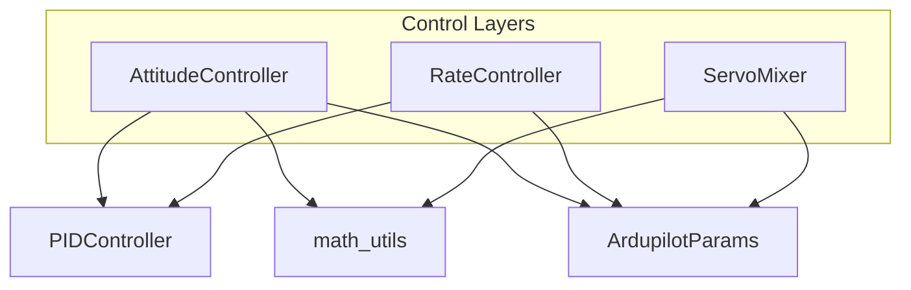
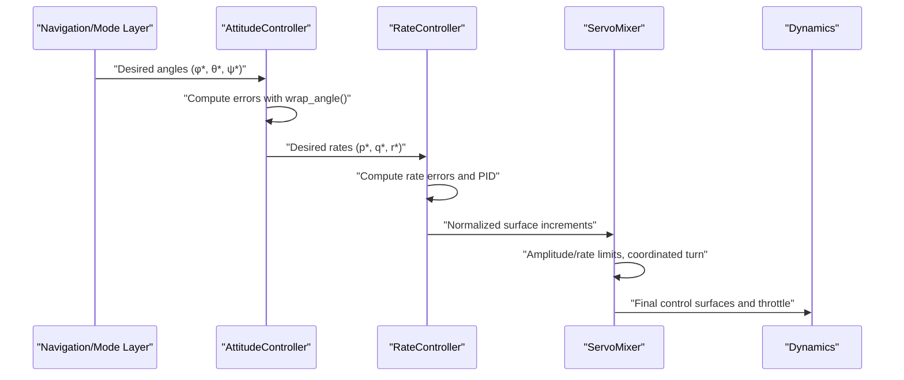
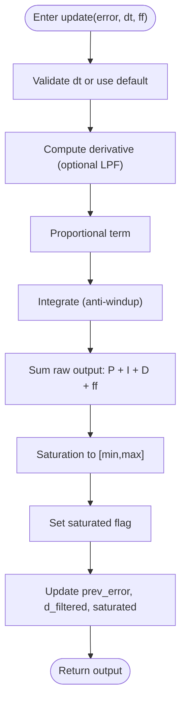
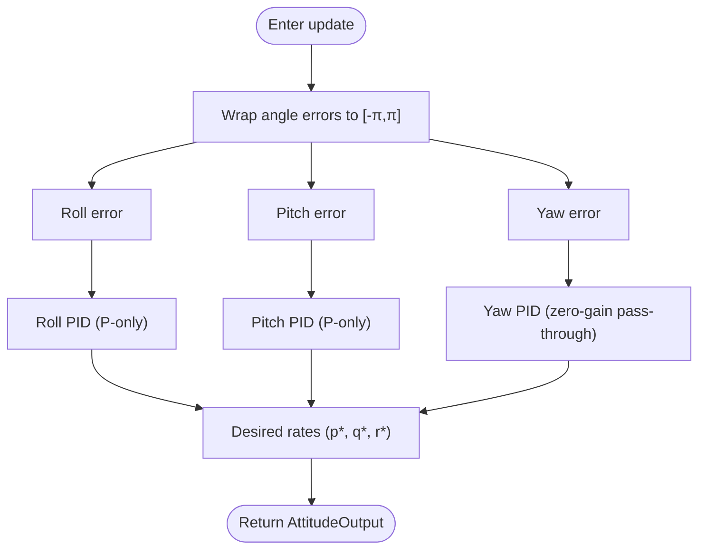
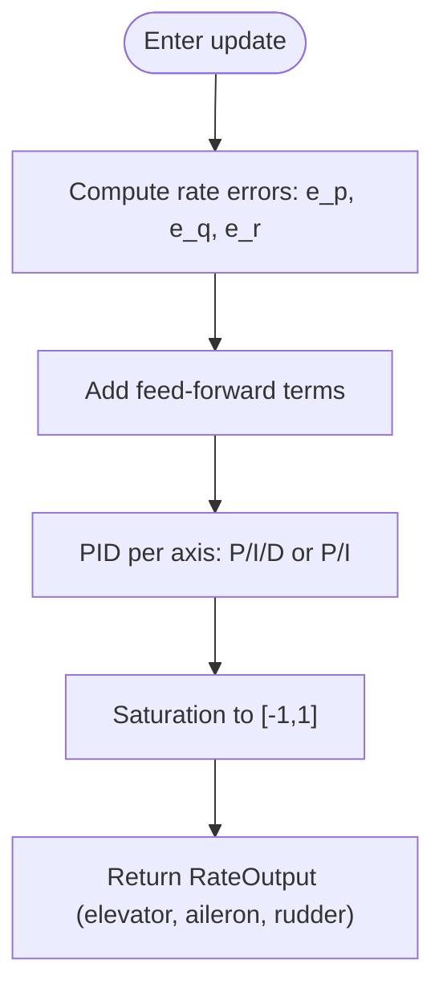
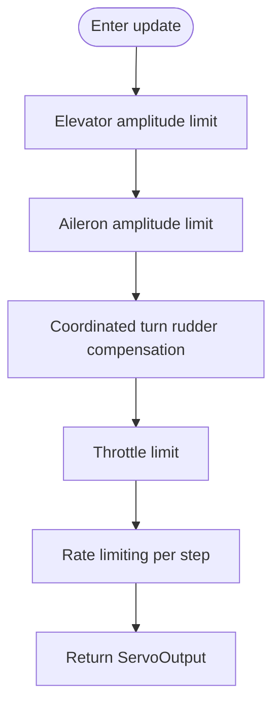
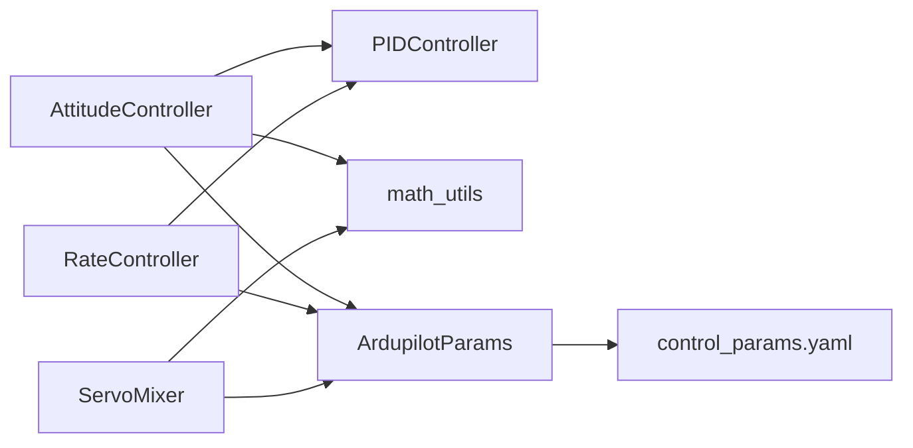

# Attitude and Rate Control

<cite>
**Referenced Files in This Document**
- [pid_controller.py](file://src/control/pid_controller.py)
- [attitude_controller.py](file://src/control/attitude_controller.py)
- [rate_controller.py](file://src/control/rate_controller.py)
- [servo_mixer.py](file://src/control/servo_mixer.py)
- [ardupilot_compat.py](file://src/control/ardupilot_compat.py)
- [math_utils.py](file://src/utils/math_utils.py)
- [control_params.yaml](file://config/control_params.yaml)
- [simulator.py](file://src/simulation/simulator.py)
- [test_control.py](file://tests/test_control.py)
</cite>

## Table of Contents
1. [Introduction](#introduction)
2. [Project Structure](#project-structure)
3. [Core Components](#core-components)
4. [Architecture Overview](#architecture-overview)
5. [Detailed Component Analysis](#detailed-component-analysis)
6. [Dependency Analysis](#dependency-analysis)
7. [Performance Considerations](#performance-considerations)
8. [Troubleshooting Guide](#troubleshooting-guide)
9. [Conclusion](#conclusion)
10. [Appendices](#appendices)

## Introduction
This document describes the attitude and rate control subsystem of the fixed-wing simulator. It explains the PID controller implementation, the attitude controller for angle stabilization, and the rate controller for angular rate control. It details the control loop structure, error computation, and command generation. It also covers PID tuning procedures, parameter optimization, performance analysis, the relationship between attitude targets and rate commands, and control authority limits and protection mechanisms.

## Project Structure
The attitude and rate control subsystem is implemented as a five-layer control hierarchy:
- Outer-loop attitude controller: converts desired Euler angles into desired angular rates.
- Inner-loop rate controller (SAS): converts desired angular rates into normalized control surface increments.
- Actuator mixing: applies amplitude and rate limits, coordinated turn compensation, and final normalization.
- Parameter container: ArduPilot-compatible parameter storage and validation.
- Utilities: angle wrapping, saturation, and unit conversions.

**Diagram sources**
- [attitude_controller.py](file://src/control/attitude_controller.py#L33-L134)
- [rate_controller.py](file://src/control/rate_controller.py#L32-L109)
- [servo_mixer.py](file://src/control/servo_mixer.py#L54-L153)
- [pid_controller.py](file://src/control/pid_controller.py#L17-L117)
- [ardupilot_compat.py](file://src/control/ardupilot_compat.py#L17-L130)
- [math_utils.py](file://src/utils/math_utils.py#L13-L36)

**Section sources**
- [attitude_controller.py](file://src/control/attitude_controller.py#L1-L134)
- [rate_controller.py](file://src/control/rate_controller.py#L1-L109)
- [servo_mixer.py](file://src/control/servo_mixer.py#L1-L153)
- [pid_controller.py](file://src/control/pid_controller.py#L1-L117)
- [ardupilot_compat.py](file://src/control/ardupilot_compat.py#L1-L130)
- [math_utils.py](file://src/utils/math_utils.py#L1-L124)

## Core Components
- AttitudeController: Computes desired angular rates from desired Euler angles using P-only control with angle wrapping and axis-specific rate limits.
- RateController: Implements inner-loop SAS with independent P/I/D or P/I controllers per axis, plus feed-forward terms.
- PIDController: Generic discrete PID with anti-windup, optional derivative low-pass filtering, and runtime gain updates.
- ServoMixer: Applies amplitude and rate limits, coordinated turn compensation, and final normalization to control surface commands.
- ArduPilotParams: Parameter container mirroring ArduPilot naming conventions with validation and YAML support.
- math_utils: Provides angle wrapping, saturation, and unit conversions.

**Section sources**
- [attitude_controller.py](file://src/control/attitude_controller.py#L33-L134)
- [rate_controller.py](file://src/control/rate_controller.py#L32-L109)
- [pid_controller.py](file://src/control/pid_controller.py#L17-L117)
- [servo_mixer.py](file://src/control/servo_mixer.py#L54-L153)
- [ardupilot_compat.py](file://src/control/ardupilot_compat.py#L17-L130)
- [math_utils.py](file://src/utils/math_utils.py#L13-L36)

## Architecture Overview
The control system follows a classic two-loop structure:
- Outer loop (AttitudeController): Desired angles → desired rates.
- Inner loop (RateController): desired rates − measured rates → control surface increments.
- Actuator layer (ServoMixer): increments → final normalized control surface commands with limits and protections.

**Diagram sources**
- [attitude_controller.py](file://src/control/attitude_controller.py#L81-L122)
- [rate_controller.py](file://src/control/rate_controller.py#L68-L98)
- [servo_mixer.py](file://src/control/servo_mixer.py#L80-L149)

## Detailed Component Analysis

### PID Controller Implementation
The PIDController implements a discrete-time PID with:
- Proportional, integral, derivative terms.
- Anti-windup: integral accumulation only when unsaturated; integral itself is clamped to output bounds.
- Optional first-order derivative low-pass filter.
- Feed-forward term added to the raw output prior to saturation.
- Runtime gain updates and reset for mode transitions.

**Diagram sources**
- [pid_controller.py](file://src/control/pid_controller.py#L55-L98)

**Section sources**
- [pid_controller.py](file://src/control/pid_controller.py#L17-L117)

### Attitude Controller (Angle Stabilization)
- Uses P-only control for roll and pitch; yaw has no outer-loop attitude control in ArduPlane.
- Computes angle errors with wrap_angle to ensure minimal-angle error across discontinuities.
- Applies axis-specific maximum desired rate limits to prevent excessive commands.
- Outputs desired angular rates for the rate controller.

**Diagram sources**
- [attitude_controller.py](file://src/control/attitude_controller.py#L107-L122)
- [math_utils.py](file://src/utils/math_utils.py#L13-L15)

**Section sources**
- [attitude_controller.py](file://src/control/attitude_controller.py#L33-L134)
- [math_utils.py](file://src/utils/math_utils.py#L13-L15)

### Rate Controller (Angular Rate Control)
- Implements independent PID loops for pitch, roll, and yaw.
- Pitch uses P/I/D; roll uses P/I; yaw uses P/I.
- Adds feed-forward terms proportional to desired rates before saturation.
- Outputs normalized control surface increments in [−1, 1].

**Diagram sources**
- [rate_controller.py](file://src/control/rate_controller.py#L68-L98)

**Section sources**
- [rate_controller.py](file://src/control/rate_controller.py#L32-L109)

### Servo Mixer (Actuator Allocation and Protection)
- Applies amplitude limits for elevator and aileron based on LIM_PITCH_* and LIM_ROLL_CD.
- Adds coordinated turn compensation proportional to roll rate.
- Enforces throttle limits and applies rate limiting across control surfaces.
- Converts normalized outputs to radians for dynamics.

**Diagram sources**
- [servo_mixer.py](file://src/control/servo_mixer.py#L80-L149)

**Section sources**
- [servo_mixer.py](file://src/control/servo_mixer.py#L54-L153)

### Relationship Between Attitude Targets and Rate Commands
- AttitudeController translates desired Euler angles into desired angular rates using P-only control with angle wrapping and axis-specific limits.
- RateController then tracks these desired rates using P/I/D or P/I controllers with feed-forward.
- The cascade ensures that attitude errors are converted into physically meaningful rate commands, while the inner loop handles fast dynamics and disturbances.

**Section sources**
- [attitude_controller.py](file://src/control/attitude_controller.py#L81-L122)
- [rate_controller.py](file://src/control/rate_controller.py#L68-L98)

### Control Authority Limits and Protection Mechanisms
- AttitudeController limits desired rates per axis to prevent excessive commands.
- RateController limits outputs to [−1, 1] for control surfaces.
- ServoMixer enforces:
  - Amplitude limits for elevator and aileron derived from LIM_PITCH_* and LIM_ROLL_CD.
  - Coordinated turn compensation to reduce adverse yaw.
  - Throttle limits and rate limiting across control surfaces.
- math_utils provides wrap_angle and saturate utilities used throughout.

**Section sources**
- [attitude_controller.py](file://src/control/attitude_controller.py#L45-L48)
- [rate_controller.py](file://src/control/rate_controller.py#L53-L64)
- [servo_mixer.py](file://src/control/servo_mixer.py#L110-L144)
- [math_utils.py](file://src/utils/math_utils.py#L13-L25)

## Dependency Analysis
The control modules depend on shared utilities and parameters:

**Diagram sources**
- [attitude_controller.py](file://src/control/attitude_controller.py#L20-L22)
- [rate_controller.py](file://src/control/rate_controller.py#L20-L21)
- [servo_mixer.py](file://src/control/servo_mixer.py#L19-L20)
- [ardupilot_compat.py](file://src/control/ardupilot_compat.py#L74-L98)
- [control_params.yaml](file://config/control_params.yaml#L1-L45)

**Section sources**
- [attitude_controller.py](file://src/control/attitude_controller.py#L1-L134)
- [rate_controller.py](file://src/control/rate_controller.py#L1-L109)
- [servo_mixer.py](file://src/control/servo_mixer.py#L1-L153)
- [ardupilot_compat.py](file://src/control/ardupilot_compat.py#L1-L130)
- [control_params.yaml](file://config/control_params.yaml#L1-L45)

## Performance Considerations
- Outer-loop P control yields fast response but introduces steady-state error; use larger Kp or introduce integral carefully with anti-windup.
- Angle wrapping ensures smooth error computation around ±π.
- Inner-loop PID benefits from derivative low-pass filtering to mitigate noise sensitivity.
- Feed-forward reduces steady-state error and improves transient response.
- Combined amplitude and rate limits prevent control surface saturation and actuator stress.
- Nonlinearities and coupling in fixed-wing dynamics require axis-wise tuning and protective limits.

[No sources needed since this section provides general guidance]

## Troubleshooting Guide
Common issues and remedies:
- Excessive overshoot or oscillation:
  - Reduce P gains; add derivative where appropriate; ensure anti-windup is active.
- Persistent steady-state error:
  - Introduce modest integral gain; verify anti-windup is preventing windup.
- Control surface saturation or actuator stress:
  - Verify ServoMixer amplitude and rate limits; confirm LIM_PITCH_* and LIM_ROLL_CD are set appropriately.
- Poor coordination during turns:
  - Adjust coordinated turn compensation gain; ensure roll rate is accurately estimated.
- Parameter validation failures:
  - Use ArdupilotParams.validate() to check ranges; adjust control_params.yaml accordingly.

**Section sources**
- [pid_controller.py](file://src/control/pid_controller.py#L84-L95)
- [servo_mixer.py](file://src/control/servo_mixer.py#L110-L144)
- [ardupilot_compat.py](file://src/control/ardupilot_compat.py#L104-L129)
- [control_params.yaml](file://config/control_params.yaml#L1-L45)

## Conclusion
The attitude and rate control subsystem implements a robust, layered control architecture with clear separation of concerns. The AttitudeController provides safe, bounded desired rates; the RateController tracks these rates with feed-forward and anti-windup; and the ServoMixer enforces physical limits and protections. Together with ArduPilot-compatible parameters and utilities, this design enables stable, high-performance control for fixed-wing flight.

[No sources needed since this section summarizes without analyzing specific files]

## Appendices

### PID Tuning Procedures
- Outer-loop (AttitudeController):
  - Start with P-only control; increase Kp until acceptable response without oscillation.
  - Apply axis-specific rate limits to prevent excessive commands.
- Inner-loop (RateController):
  - Begin with P-only; add D to improve damping; introduce I cautiously to reduce steady-state error.
  - Tune feed-forward gains to improve tracking of desired rates.
- Anti-windup:
  - Ensure integral accumulation is disabled when saturated; clamp integral to output bounds.
- Validation:
  - Use tests verifying desired rates from angle errors and rate limits.

**Section sources**
- [attitude_controller.py](file://src/control/attitude_controller.py#L55-L77)
- [rate_controller.py](file://src/control/rate_controller.py#L51-L64)
- [pid_controller.py](file://src/control/pid_controller.py#L84-L95)
- [test_control.py](file://tests/test_control.py#L217-L243)

### Control Parameter Optimization
- Use ArduPilotParams to manage and validate parameters; load from control_params.yaml.
- Adjust PTCH_P, ROLL_P, PTCH_RATE_*, ROLL_RATE_*, YAW_RATE_* according to tuning goals.
- Validate parameter ranges with ArdupilotParams.validate().

**Section sources**
- [ardupilot_compat.py](file://src/control/ardupilot_compat.py#L74-L98)
- [ardupilot_compat.py](file://src/control/ardupilot_compat.py#L104-L129)
- [control_params.yaml](file://config/control_params.yaml#L1-L45)

### Performance Analysis
- Evaluate step response characteristics (rise time, overshoot, settling time) under various gains.
- Monitor control surface deflection amplitudes and rates to ensure limits are respected.
- Analyze stability margins via frequency-domain analysis if applicable to linearized models.

[No sources needed since this section provides general guidance]