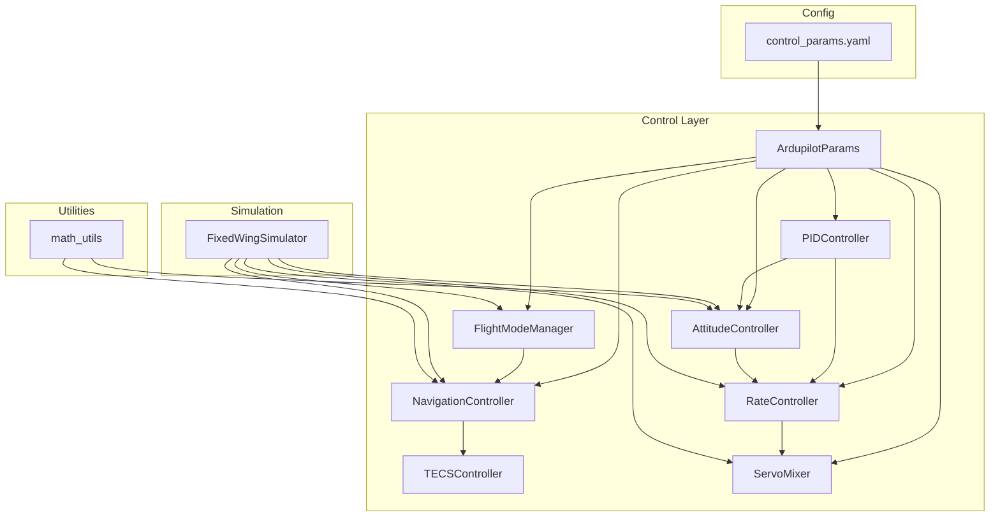
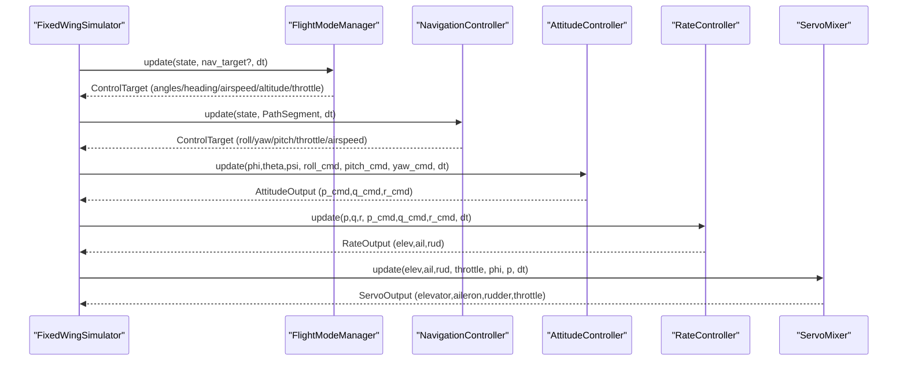
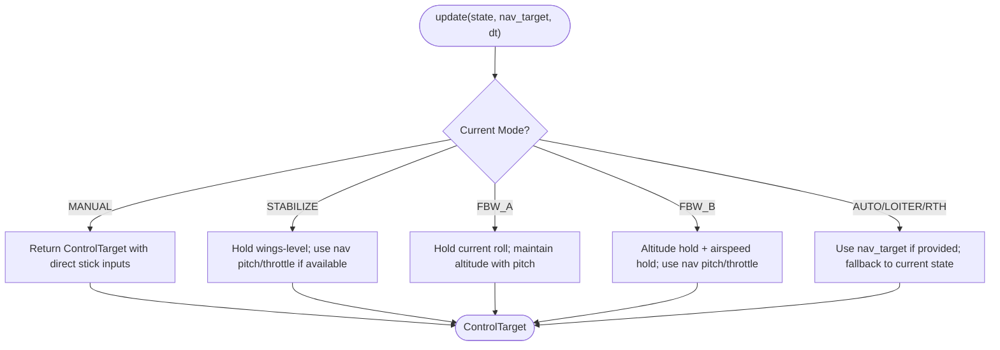
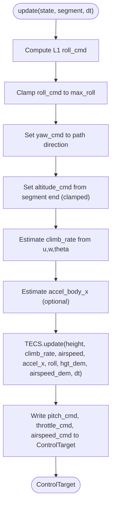
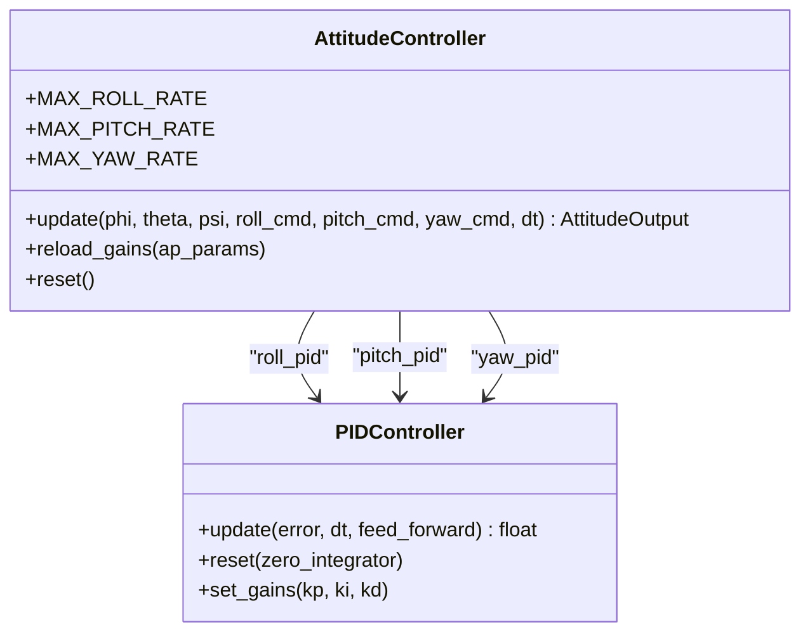
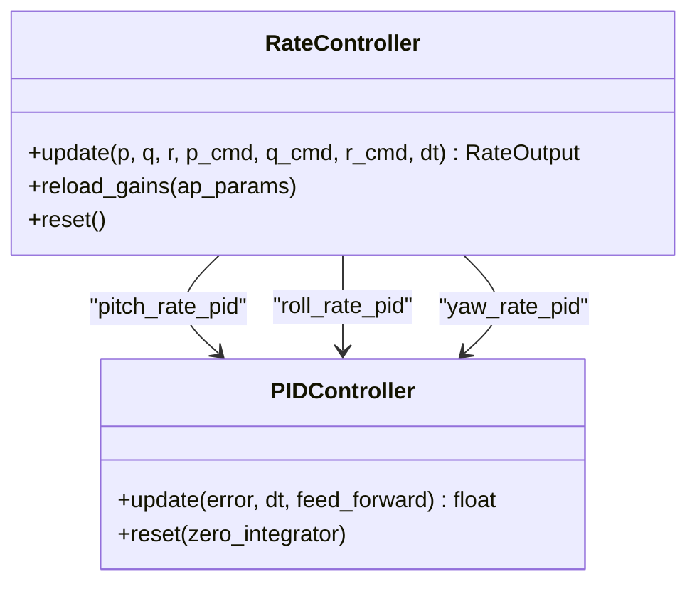
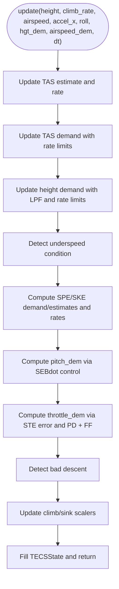
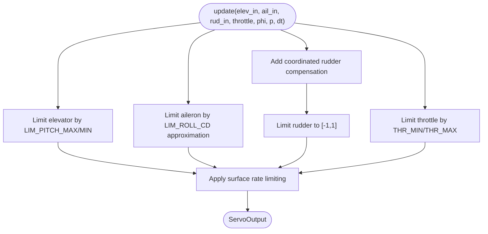
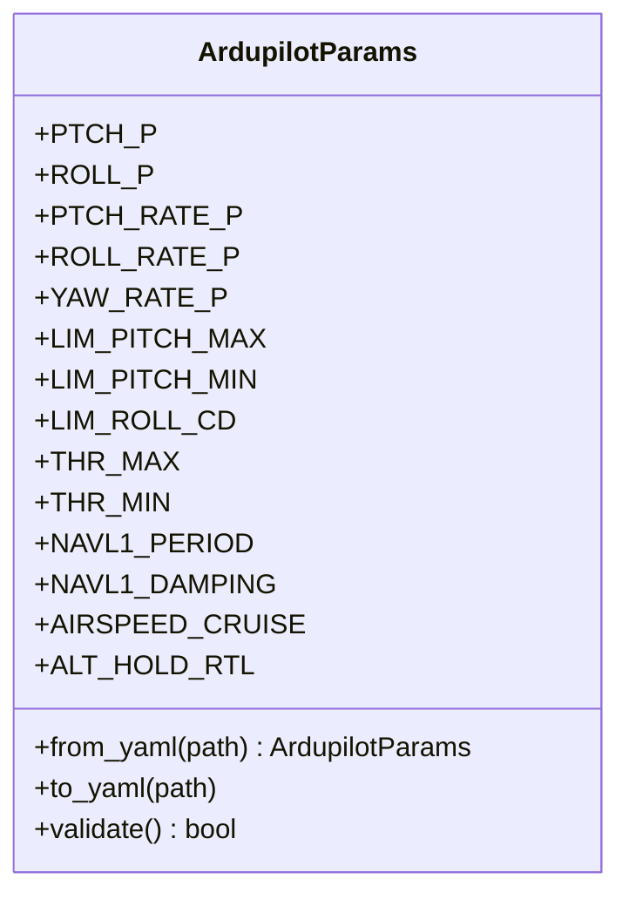
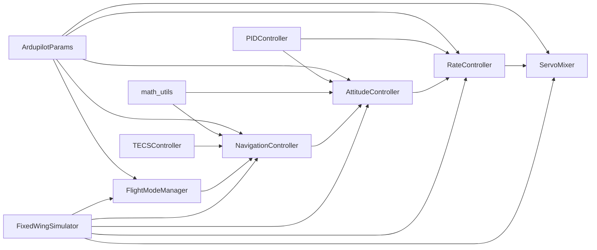

# Control Systems

<cite>
**Referenced Files in This Document**
- [src/control/flight_mode_manager.py](file://src/control/flight_mode_manager.py)
- [src/control/navigation_controller.py](file://src/control/navigation_controller.py)
- [src/control/attitude_controller.py](file://src/control/attitude_controller.py)
- [src/control/rate_controller.py](file://src/control/rate_controller.py)
- [src/control/tecs_controller.py](file://src/control/tecs_controller.py)
- [src/control/servo_mixer.py](file://src/control/servo_mixer.py)
- [src/control/ardupilot_compat.py](file://src/control/ardupilot_compat.py)
- [src/control/pid_controller.py](file://src/control/pid_controller.py)
- [src/utils/math_utils.py](file://src/utils/math_utils.py)
- [config/control_params.yaml](file://config/control_params.yaml)
- [src/simulation/simulator.py](file://src/simulation/simulator.py)
</cite>

## Table of Contents
1. [Introduction](#introduction)
2. [Project Structure](#project-structure)
3. [Core Components](#core-components)
4. [Architecture Overview](#architecture-overview)
5. [Detailed Component Analysis](#detailed-component-analysis)
6. [Dependency Analysis](#dependency-analysis)
7. [Performance Considerations](#performance-considerations)
8. [Troubleshooting Guide](#troubleshooting-guide)
9. [Conclusion](#conclusion)
10. [Appendices](#appendices)

## Introduction
This document describes the five-layer ArduPilot-compatible control system implemented in the FixedWingSimulator. It explains how FlightModeManager orchestrates control mode switching and target generation, how NavigationController implements L1 guidance and TECS altitude/airspeed control, how AttitudeController and RateController form PID-based cascaded loops, and how ServoMixer performs actuator allocation and output limiting. It also documents ArduPilot parameter compatibility and validation, and provides practical guidance for tuning, mode transitions, and performance analysis.

## Project Structure
The control system resides under src/control and integrates with the simulation engine and utilities:
- Control layer: FlightModeManager, NavigationController, AttitudeController, RateController, TECSController, ServoMixer, ArdupilotParams, PIDController
- Utilities: math_utils for angle wrapping and saturation
- Configuration: control_params.yaml for ArduPilot-style parameters and TECS tuning
- Simulation integration: simulator.py wires all layers together

**Diagram sources**
- [src/simulation/simulator.py](file://src/simulation/simulator.py#L165-L216)
- [src/control/ardupilot_compat.py](file://src/control/ardupilot_compat.py#L17-L130)
- [src/control/flight_mode_manager.py](file://src/control/flight_mode_manager.py#L115-L298)
- [src/control/navigation_controller.py](file://src/control/navigation_controller.py#L45-L293)
- [src/control/attitude_controller.py](file://src/control/attitude_controller.py#L33-L134)
- [src/control/rate_controller.py](file://src/control/rate_controller.py#L32-L109)
- [src/control/tecs_controller.py](file://src/control/tecs_controller.py#L50-L647)
- [src/control/servo_mixer.py](file://src/control/servo_mixer.py#L54-L153)
- [src/control/pid_controller.py](file://src/control/pid_controller.py#L17-L117)
- [src/utils/math_utils.py](file://src/utils/math_utils.py#L13-L36)
- [config/control_params.yaml](file://config/control_params.yaml#L1-L45)

**Section sources**
- [src/simulation/simulator.py](file://src/simulation/simulator.py#L165-L216)
- [src/control/ardupilot_compat.py](file://src/control/ardupilot_compat.py#L17-L130)
- [config/control_params.yaml](file://config/control_params.yaml#L1-L45)

## Core Components
- FlightModeManager: Generates ControlTarget commands per flight mode, supports MANUAL, STABILIZE, FBW_A, FBW_B, AUTO, LOITER, RTH, and smooth transitions.
- NavigationController: Implements L1 lateral guidance and TECS altitude/airspeed control; produces roll_cmd, yaw_cmd, pitch_cmd, throttle_cmd, and airspeed_cmd.
- AttitudeController: Outer-loop PID from desired angles to desired angular rates (P-only for roll/pitch; yaw pass-through).
- RateController: Inner-loop PID from desired rates to surface increments with feedforward.
- TECSController: Total Energy Control System managing throttle and pitch to track altitude and airspeed demands.
- ServoMixer: Actuator allocation combining rate-control increments with throttle, applying limits, coordinated rudder, and rate limiting.
- ArdupilotParams: Parameter container mirroring ArduPilot naming; YAML load/save and validation.
- PIDController: Generic PID with anti-windup and optional derivative filtering.

**Section sources**
- [src/control/flight_mode_manager.py](file://src/control/flight_mode_manager.py#L115-L298)
- [src/control/navigation_controller.py](file://src/control/navigation_controller.py#L45-L293)
- [src/control/attitude_controller.py](file://src/control/attitude_controller.py#L33-L134)
- [src/control/rate_controller.py](file://src/control/rate_controller.py#L32-L109)
- [src/control/tecs_controller.py](file://src/control/tecs_controller.py#L50-L647)
- [src/control/servo_mixer.py](file://src/control/servo_mixer.py#L54-L153)
- [src/control/ardupilot_compat.py](file://src/control/ardupilot_compat.py#L17-L130)
- [src/control/pid_controller.py](file://src/control/pid_controller.py#L17-L117)

## Architecture Overview
The control architecture follows a classic five-layer hierarchy:
- Mode layer (FlightModeManager)
- Navigation layer (NavigationController with L1 + TECS)
- Attitude layer (AttitudeController)
- Rate layer (RateController)
- Actuator layer (ServoMixer)

**Diagram sources**
- [src/simulation/simulator.py](file://src/simulation/simulator.py#L239-L400)
- [src/control/flight_mode_manager.py](file://src/control/flight_mode_manager.py#L173-L298)
- [src/control/navigation_controller.py](file://src/control/navigation_controller.py#L134-L202)
- [src/control/attitude_controller.py](file://src/control/attitude_controller.py#L81-L122)
- [src/control/rate_controller.py](file://src/control/rate_controller.py#L68-L98)
- [src/control/servo_mixer.py](file://src/control/servo_mixer.py#L80-L149)

## Detailed Component Analysis

### FlightModeManager
- Responsibilities:
  - Tracks current/previous mode and mode transitions
  - Produces ControlTarget for each mode
  - Supports manual passthrough and stabilized modes
  - Provides AUTO/LOITER/RTH logic with fallbacks
- Key behaviors:
  - Captures loiter center on entry to LOITER
  - Uses cruise speed/altitude defaults from ArduPilotParams
  - Emits transition log messages
- Output: ControlTarget with roll/pitch/yaw commands, airspeed/altitude targets, throttle, and optional direct control overrides

**Diagram sources**
- [src/control/flight_mode_manager.py](file://src/control/flight_mode_manager.py#L173-L298)

**Section sources**
- [src/control/flight_mode_manager.py](file://src/control/flight_mode_manager.py#L115-L298)

### NavigationController (L1 + TECS)
- L1 lateral navigation:
  - Computes look-ahead point along path segment
  - Calculates desired track angle and lateral acceleration
  - Converts lateral acceleration to roll command
  - Sets yaw_cmd to path direction
- TECS altitude and airspeed control:
  - Estimates climb rate from body velocities
  - Uses TECS to compute pitch_cmd and throttle_cmd
  - Applies speed/height demand filters and underspeed/bad-descent detection
- Outputs: ControlTarget with roll_cmd, yaw_cmd, pitch_cmd, throttle_cmd, airspeed_cmd

**Diagram sources**
- [src/control/navigation_controller.py](file://src/control/navigation_controller.py#L134-L202)
- [src/control/tecs_controller.py](file://src/control/tecs_controller.py#L247-L315)

**Section sources**
- [src/control/navigation_controller.py](file://src/control/navigation_controller.py#L45-L293)
- [src/control/tecs_controller.py](file://src/control/tecs_controller.py#L50-L647)

### AttitudeController (Outer-loop PID)
- Design:
  - P-only control for roll and pitch (ArduPilot Plane convention)
  - Yaw pass-through (no attitude outer loop)
  - Angle wrapping for errors
  - Output saturation limits for desired rates
- Tuning:
  - Uses PTCH_P and ROLL_P from ArdupilotParams
  - Resets integrators on mode transitions

**Diagram sources**
- [src/control/attitude_controller.py](file://src/control/attitude_controller.py#L33-L134)
- [src/control/pid_controller.py](file://src/control/pid_controller.py#L17-L117)

**Section sources**
- [src/control/attitude_controller.py](file://src/control/attitude_controller.py#L33-L134)
- [src/control/pid_controller.py](file://src/control/pid_controller.py#L17-L117)
- [src/utils/math_utils.py](file://src/utils/math_utils.py#L13-L26)

### RateController (Inner-loop PID + SAS)
- Design:
  - Independent PIDs for pitch, roll, yaw
  - Feedforward terms added before saturation
  - Output saturation to normalized control increments
- Tuning:
  - Uses PTCH_RATE_*, ROLL_RATE_*, YAW_RATE_* from ArdupilotParams
  - Resets integrators on mode transitions

**Diagram sources**
- [src/control/rate_controller.py](file://src/control/rate_controller.py#L32-L109)
- [src/control/pid_controller.py](file://src/control/pid_controller.py#L17-L117)

**Section sources**
- [src/control/rate_controller.py](file://src/control/rate_controller.py#L32-L109)
- [src/control/pid_controller.py](file://src/control/pid_controller.py#L17-L117)

### TECS (Total Energy Control System)
- Philosophy:
  - Throttle controls specific total energy; pitch controls specific energy balance
  - Coupled altitude-speed control to avoid decoupled PID issues
- Features:
  - Speed and height demand filters with rate limiting
  - Underspeed protection and “bad descent” detection
  - Anti-windup integral with saturation-aware accumulation
  - Roll compensation for turning-induced drag
- Outputs: throttle_dem, pitch_dem, climb_rate, underspeed/bad_descent flags

**Diagram sources**
- [src/control/tecs_controller.py](file://src/control/tecs_controller.py#L247-L315)

**Section sources**
- [src/control/tecs_controller.py](file://src/control/tecs_controller.py#L50-L647)

### ServoMixer (Actuator Allocation)
- Functions:
  - Convert rate-control increments to final servo commands
  - Apply surface travel limits from LIM_PITCH_*/LIM_ROLL_CD
  - Coordinated turn rudder compensation proportional to roll rate
  - Throttle limits from THR_MIN/THR_MAX
  - Surface rate limiting to smooth actuator response
- Output: ServoOutput (elevator, aileron, rudder, throttle) normalized to physical limits

**Diagram sources**
- [src/control/servo_mixer.py](file://src/control/servo_mixer.py#L80-L149)

**Section sources**
- [src/control/servo_mixer.py](file://src/control/servo_mixer.py#L54-L153)

### ArduPilot Compatibility and Validation
- ArdupilotParams mirrors ArduPilot’s parameter naming and categories:
  - Attitude gains: PTCH_P, ROLL_P
  - Rate gains: PTCH_RATE_*, ROLL_RATE_*, YAW_RATE_* and feedforward
  - Limits: LIM_PITCH_*, LIM_ROLL_CD, THR_MIN/THR_MAX
  - Navigation: NAVL1_PERIOD, NAVL1_DAMPING
  - Speed/Altitude: AIRSPEED_CRUISE, ALT_HOLD_RTL
- YAML support:
  - Load from control_params.yaml
  - Export current parameters to YAML
- Validation:
  - Range checks with warnings for out-of-range values
  - Ensures safe operating bounds for gains and limits

**Diagram sources**
- [src/control/ardupilot_compat.py](file://src/control/ardupilot_compat.py#L17-L130)

**Section sources**
- [src/control/ardupilot_compat.py](file://src/control/ardupilot_compat.py#L17-L130)
- [config/control_params.yaml](file://config/control_params.yaml#L1-L45)

## Dependency Analysis
- FlightModeManager depends on math utilities for angle wrapping and ArdupilotParams for defaults.
- NavigationController depends on TECSController, math utilities, and ArdupilotParams for L1 and TECS parameters.
- AttitudeController and RateController depend on PIDController and ArdupilotParams.
- ServoMixer depends on ArdupilotParams and math utilities for saturation.
- Simulator composes all layers and passes parameters and state between them.

**Diagram sources**
- [src/simulation/simulator.py](file://src/simulation/simulator.py#L165-L216)
- [src/control/flight_mode_manager.py](file://src/control/flight_mode_manager.py#L115-L298)
- [src/control/navigation_controller.py](file://src/control/navigation_controller.py#L45-L293)
- [src/control/attitude_controller.py](file://src/control/attitude_controller.py#L33-L134)
- [src/control/rate_controller.py](file://src/control/rate_controller.py#L32-L109)
- [src/control/tecs_controller.py](file://src/control/tecs_controller.py#L50-L647)
- [src/control/servo_mixer.py](file://src/control/servo_mixer.py#L54-L153)
- [src/control/pid_controller.py](file://src/control/pid_controller.py#L17-L117)
- [src/utils/math_utils.py](file://src/utils/math_utils.py#L13-L36)

**Section sources**
- [src/simulation/simulator.py](file://src/simulation/simulator.py#L165-L216)
- [src/control/ardupilot_compat.py](file://src/control/ardupilot_compat.py#L17-L130)

## Performance Considerations
- Cascaded control stability:
  - Keep outer-loop gains moderate; inner-loop gains should be tuned to provide adequate damping.
  - Feedforward terms in RateController improve disturbance rejection.
- TECS tuning:
  - Increase TECS_TIME_CONST for smoother responses; adjust TECS_THR_DAMP and TECS_PTCH_DAMP to reduce oscillations.
  - Tune TECS_RLL2THR for turns; verify underspeed thresholds align with stall characteristics.
- L1 navigation:
  - NAVL1_PERIOD and NAVL1_DAMPING balance responsiveness and overshoot; higher damping reduces cross-track oscillations.
- Actuator limits:
  - Ensure LIM_PITCH_*/LIM_ROLL_CD reflect real aircraft capabilities; coordinated rudder compensation improves turn quality.
- Numerical robustness:
  - Use wrap_angle and saturate consistently; avoid excessive integrator windup by enabling anti-windup in PIDController.

[No sources needed since this section provides general guidance]

## Troubleshooting Guide
- Mode transitions:
  - If control loops oscillate after mode change, call reset() on AttitudeController, RateController, and ServoMixer to clear integrators and previous states.
- Overshoot/undershoot:
  - Reduce outer-loop gains (PTCH_P, ROLL_P) or increase damping (PTCH_RATE_D, ROLL_RATE_D).
  - Adjust TECS parameters (TECS_PTCH_DAMP, TECS_THR_DAMP) to stabilize altitude/airspeed.
- Poor L1 tracking:
  - Increase NAVL1_DAMPING or adjust NAVL1_PERIOD; verify max_roll limits are appropriate.
- Actuator saturation:
  - Relax LIM_PITCH_*/LIM_ROLL_CD or reduce feedforward gains; confirm throttle limits (THR_MIN/THR_MAX) are set correctly.
- Parameter validation warnings:
  - Review ArdupilotParams ranges; correct out-of-bounds values to prevent instability.

**Section sources**
- [src/control/attitude_controller.py](file://src/control/attitude_controller.py#L124-L134)
- [src/control/rate_controller.py](file://src/control/rate_controller.py#L100-L109)
- [src/control/servo_mixer.py](file://src/control/servo_mixer.py#L151-L153)
- [src/control/ardupilot_compat.py](file://src/control/ardupilot_compat.py#L104-L130)

## Conclusion
The FixedWingSimulator implements a complete ArduPilot-compatible control stack with clear separation of concerns across five layers. FlightModeManager selects targets, NavigationController executes L1 guidance and TECS, AttitudeController and RateController form a robust cascaded PID structure, and ServoMixer ensures safe actuator allocation. ArdupilotParams provides seamless parameter compatibility and validation, while configuration files enable flexible tuning for diverse aircraft and missions.

[No sources needed since this section summarizes without analyzing specific files]

## Appendices

### Control Parameter Tuning Examples
- Attitude tuning (AttitudeController):
  - Start with modest PTCH_P and ROLL_P; observe step response; add PTCH_RATE_D or ROLL_RATE_D to improve damping.
- Rate tuning (RateController):
  - Increase PTCH_RATE_P and ROLL_RATE_P gradually; introduce feedforward (PTCH_RATE_FF, ROLL_RATE_FF) to reduce steady-state error.
- L1 navigation (NavigationController):
  - Adjust NAVL1_DAMPING to reduce oscillations; tune NAVL1_PERIOD for desired convergence speed.
- TECS tuning (TECSController):
  - Increase TECS_TIME_CONST for smoother throttle; raise TECS_PTCH_DAMP and TECS_THR_DAMP to suppress pitch/throttle oscillations.
  - Calibrate TECS_RLL2THR for turns; verify underspeed threshold matches stall margin.
- Servo limits (ServoMixer):
  - Set LIM_PITCH_MAX/MIN and LIM_ROLL_CD conservatively; adjust coordinated rudder gain for balanced turns.

[No sources needed since this section provides general guidance]

### Mode Transition Behavior
- On mode change, reset control loops to prevent integrator windup and abrupt control surges.
- Verify that ControlTarget defaults (cruise speed/altitude) are sensible for the new mode.

**Section sources**
- [src/control/flight_mode_manager.py](file://src/control/flight_mode_manager.py#L152-L167)
- [src/control/attitude_controller.py](file://src/control/attitude_controller.py#L124-L134)
- [src/control/rate_controller.py](file://src/control/rate_controller.py#L100-L109)
- [src/control/servo_mixer.py](file://src/control/servo_mixer.py#L151-L153)

### Signal Flow Summary
- From FlightModeManager to NavigationController: ControlTarget with airspeed_cmd/altitude_cmd and yaw_cmd
- From NavigationController to AttitudeController: Desired roll_cmd/yaw_cmd and pitch_cmd
- From AttitudeController to RateController: Desired angular rates
- From RateController to ServoMixer: Surface increments and throttle
- From ServoMixer to Dynamics: Final control surface deflections and throttle

**Section sources**
- [src/control/flight_mode_manager.py](file://src/control/flight_mode_manager.py#L173-L298)
- [src/control/navigation_controller.py](file://src/control/navigation_controller.py#L134-L202)
- [src/control/attitude_controller.py](file://src/control/attitude_controller.py#L81-L122)
- [src/control/rate_controller.py](file://src/control/rate_controller.py#L68-L98)
- [src/control/servo_mixer.py](file://src/control/servo_mixer.py#L80-L149)