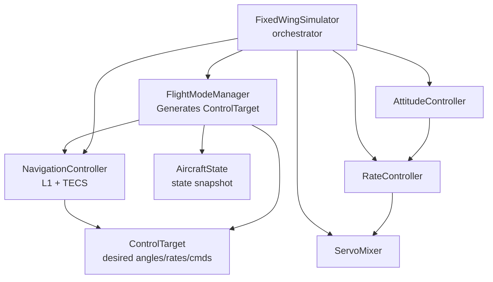
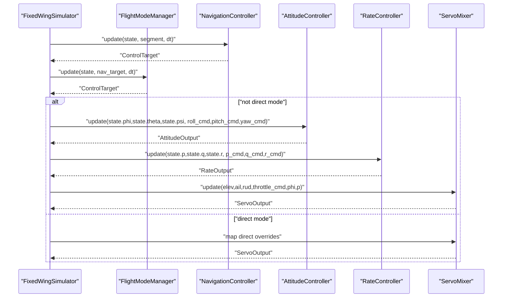
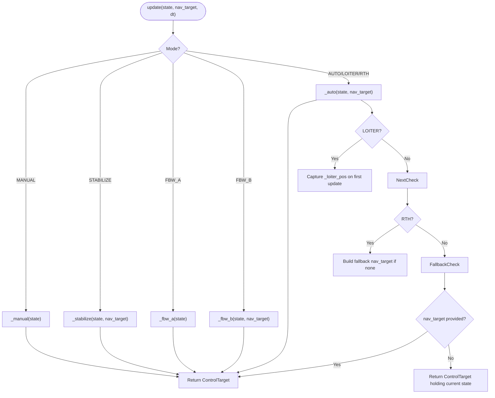
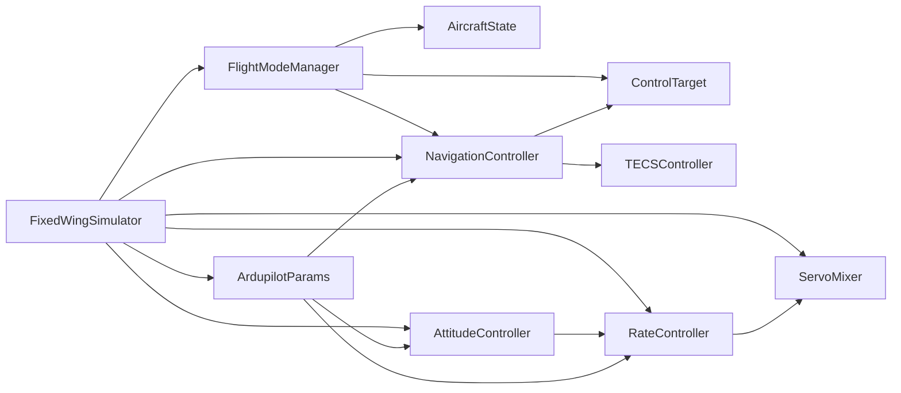

# Flight Mode Manager

<cite>
**Referenced Files in This Document**
- [flight_mode_manager.py](file://src/control/flight_mode_manager.py)
- [ardupilot_compat.py](file://src/control/ardupilot_compat.py)
- [navigation_controller.py](file://src/control/navigation_controller.py)
- [attitude_controller.py](file://src/control/attitude_controller.py)
- [rate_controller.py](file://src/control/rate_controller.py)
- [servo_mixer.py](file://src/control/servo_mixer.py)
- [tecs_controller.py](file://src/control/tecs_controller.py)
- [simulator.py](file://src/simulation/simulator.py)
- [control_params.yaml](file://config/control_params.yaml)
</cite>

## Table of Contents
1. [Introduction](#introduction)
2. [Project Structure](#project-structure)
3. [Core Components](#core-components)
4. [Architecture Overview](#architecture-overview)
5. [Detailed Component Analysis](#detailed-component-analysis)
6. [Dependency Analysis](#dependency-analysis)
7. [Performance Considerations](#performance-considerations)
8. [Troubleshooting Guide](#troubleshooting-guide)
9. [Conclusion](#conclusion)
10. [Appendices](#appendices)

## Introduction
This document explains the FlightModeManager component and its role in the ArduPilot-compatible fixed-wing control system. It covers the five supported flight modes (MANUAL, STABILIZE, FBW_A, FBW_B, AUTO, LOITER, RTH), their behaviors, mode transition logic, state tracking, and ControlTarget generation. It also documents the AircraftState data structure and ControlTarget interface, manual stick input handling, mode switching mechanisms, and loiter position capture. Practical examples illustrate mode initialization, switching, and interpreting control target outputs for each mode. Finally, it explains the relationship between FlightModeManager and other control system components.

## Project Structure
FlightModeManager resides in the control package and integrates with the broader control stack:
- FlightModeManager depends on ArdupilotParams for cruise airspeed and altitude defaults.
- It interacts with NavigationController to supply ControlTarget suggestions for AUTO/LOITER/RTH.
- The simulation orchestrator wires FlightModeManager into the closed-loop control chain.

**Diagram sources**
- [flight_mode_manager.py](file://src/control/flight_mode_manager.py#L115-L298)
- [navigation_controller.py](file://src/control/navigation_controller.py#L45-L293)
- [simulator.py](file://src/simulation/simulator.py#L41-L52)

**Section sources**
- [flight_mode_manager.py](file://src/control/flight_mode_manager.py#L1-L298)
- [simulator.py](file://src/simulation/simulator.py#L115-L567)

## Core Components
- FlightModeManager: central mode selector and ControlTarget generator. Tracks current and previous mode, handles transitions, and delegates to per-mode handlers.
- AircraftState: minimal state snapshot consumed by FlightModeManager and the rest of the control stack.
- ControlTarget: unified interface for desired angles, rates, speed/altitude commands, and direct actuator overrides.

Key responsibilities:
- Mode selection and transition logging.
- Per-mode logic for MANUAL, STABILIZE, FBW_A, FBW_B, AUTO, LOITER, RTH.
- Loiter center capture on entry to LOITER.
- RTH fallback to home position and altitude.
- Integration with NavigationController for AUTO/LOITER/RTH.

**Section sources**
- [flight_mode_manager.py](file://src/control/flight_mode_manager.py#L28-L114)
- [flight_mode_manager.py](file://src/control/flight_mode_manager.py#L115-L298)

## Architecture Overview
The control stack follows a layered architecture mirroring ArduPilot:
- Outer loop: NavigationController computes lateral roll and vertical pitch/throttle via L1 and TECS.
- AttitudeController: desired Euler angles → desired angular rates.
- RateController: desired angular rates → surface deflection increments.
- ServoMixer: actuator allocation, limits, coordinated turn, and final normalised outputs.
- FlightModeManager: selects desired state/command profile per mode and supplies ControlTarget.

**Diagram sources**
- [simulator.py](file://src/simulation/simulator.py#L41-L52)
- [simulator.py](file://src/simulation/simulator.py#L499-L540)
- [navigation_controller.py](file://src/control/navigation_controller.py#L134-L202)
- [attitude_controller.py](file://src/control/attitude_controller.py#L81-L122)
- [rate_controller.py](file://src/control/rate_controller.py#L68-L98)
- [servo_mixer.py](file://src/control/servo_mixer.py#L80-L149)

## Detailed Component Analysis

### FlightModeManager
- Modes: MANUAL, STABILIZE, FBW_A, FBW_B, AUTO, LOITER, RTH.
- State tracking: current_mode and previous_mode; prints transition log.
- Transition logic: captures loiter center on LOITER entry; RTH constructs a fallback nav_target if none provided.
- ControlTarget generation:
  - MANUAL: direct stick overrides; sets is_direct=True.
  - STABILIZE: level wings (roll_cmd=0), uses nav pitch/throttle if available, holds yaw to current heading.
  - FBW_A: maintains current roll and altitude with pitch hold; uses cruise airspeed/altitude.
  - FBW_B: altitude and airspeed hold; uses nav pitch/throttle if available.
  - AUTO/LOITER/RTH: uses provided nav_target if available; otherwise falls back to holding current state.

**Diagram sources**
- [flight_mode_manager.py](file://src/control/flight_mode_manager.py#L173-L298)

**Section sources**
- [flight_mode_manager.py](file://src/control/flight_mode_manager.py#L115-L298)

### AircraftState
AircraftState is a minimal snapshot of the aircraft’s instantaneous state:
- Position (NED): pos_north, pos_east, pos_down.
- Body velocities: u, v, w.
- Attitude angles: phi, theta, psi.
- Body angular rates: p, q, r.
- Derived quantities: airspeed, altitude.
- Convenient properties returning NumPy arrays for vector operations.

Usage:
- Passed to FlightModeManager.update and NavigationController.update.
- Used by downstream controllers to compute desired commands.

**Section sources**
- [flight_mode_manager.py](file://src/control/flight_mode_manager.py#L38-L80)

### ControlTarget
ControlTarget defines the desired state/command profile produced by a flight mode:
- Desired angles: roll_cmd, pitch_cmd, yaw_cmd.
- Desired rates: roll_rate_cmd, pitch_rate_cmd, yaw_rate_cmd (optional feed-forward).
- Speed/altitude: airspeed_cmd, altitude_cmd.
- Direct overrides: elevator_direct, aileron_direct, rudder_direct, throttle_direct.
- Throttle command: throttle_cmd (0–1).
- is_direct flag: indicates bypass of attitude/rate controllers.

Consumption:
- NavigationController writes ControlTarget for AUTO/LOITER/RTH.
- FlightModeManager writes ControlTarget for MANUAL/STABILIZE/FBW_A/B.
- AttitudeController reads roll_cmd, pitch_cmd, yaw_cmd.
- RateController reads roll_rate_cmd, pitch_rate_cmd, yaw_rate_cmd if provided.
- ServoMixer reads throttle_cmd and direct overrides.

**Section sources**
- [flight_mode_manager.py](file://src/control/flight_mode_manager.py#L82-L114)

### Flight Modes and Behaviors
- MANUAL
  - Behavior: direct pass-through of stick inputs; bypasses attitude/rate loops.
  - ControlTarget: sets elevator_direct, aileron_direct, rudder_direct, throttle_direct; is_direct=True.
  - Manual stick inputs: set via FlightModeManager.manual_* fields.
  - Typical use: pilot-in-the-loop testing, tuning, or emergency override.

- STABILIZE
  - Behavior: wings-level hold (roll_cmd=0); uses nav pitch/throttle if available; holds yaw to current heading.
  - ControlTarget: sets altitude_cmd from nav_target if available; uses cruise airspeed.

- FBW_A
  - Behavior: maintain current roll; altitude hold via pitch; airspeed hold; cruise defaults.
  - ControlTarget: roll_cmd=current roll; pitch_cmd=0; yaw_cmd=current yaw; cruise airspeed/altitude.

- FBW_B
  - Behavior: altitude hold + airspeed hold; uses nav pitch/throttle if available.
  - ControlTarget: roll_cmd=0; uses nav_target pitch/throttle/altitude if available.

- AUTO
  - Behavior: follow navigation target; if none provided, hold current state.
  - ControlTarget: uses provided nav_target; otherwise holds current roll/pitch/yaw and cruise airspeed/altitude.

- LOITER
  - Behavior: orbit a fixed point at fixed altitude; captures loiter center on first update.
  - ControlTarget: uses nav_target if provided; otherwise holds current state; loiter center stored internally.

- RTH
  - Behavior: return to home; constructs fallback nav_target if none provided.
  - ControlTarget: uses nav_target if provided; otherwise sets cruise airspeed and cruise altitude.

**Section sources**
- [flight_mode_manager.py](file://src/control/flight_mode_manager.py#L194-L298)

### Mode Transition Logic and State Tracking
- set_mode(new_mode): updates current_mode and previous_mode; logs transition; resets loiter capture on LOITER entry.
- set_mode_str(mode_str): convenience wrapper to set mode by string.
- Transition bookkeeping ensures downstream controllers reset integrators appropriately (e.g., TECS and PID controllers).

Integration points:
- Simulator resets TECS and controllers on mode changes to avoid windup and ensure stable transitions.

**Section sources**
- [flight_mode_manager.py](file://src/control/flight_mode_manager.py#L152-L168)
- [simulator.py](file://src/simulation/simulator.py#L313-L316)
- [navigation_controller.py](file://src/control/navigation_controller.py#L120-L131)

### ControlTarget Generation Examples
- Mode initialization
  - Example path: [simulator.py](file://src/simulation/simulator.py#L174-L179)
  - Initializes FlightModeManager with initial_mode, cruise_speed, cruise_alt.

- Switching between modes
  - Example path: [flight_mode_manager.py](file://src/control/flight_mode_manager.py#L152-L168)
  - Call set_mode or set_mode_str to switch modes; transition is logged.

- Understanding ControlTarget outputs
  - Example path: [flight_mode_manager.py](file://src/control/flight_mode_manager.py#L217-L298)
  - MANUAL returns direct overrides; STABILIZE/ FBW_A/B set desired angles and throttle; AUTO/LOITER/RTH use nav_target or fallback.

**Section sources**
- [simulator.py](file://src/simulation/simulator.py#L174-L179)
- [flight_mode_manager.py](file://src/control/flight_mode_manager.py#L152-L168)
- [flight_mode_manager.py](file://src/control/flight_mode_manager.py#L217-L298)

### Relationship to Other Control Components
- NavigationController: produces ControlTarget for AUTO/LOITER/RTH; FlightModeManager forwards it downstream.
- AttitudeController: consumes roll_cmd, pitch_cmd, yaw_cmd; produces desired angular rates.
- RateController: consumes desired angular rates; produces surface deflection increments.
- ServoMixer: applies limits, coordinated turn compensation, and rate limiting; outputs final normalised controls.
- ArdupilotParams: provides cruise airspeed/altitude defaults and control gains used by controllers.

**Section sources**
- [navigation_controller.py](file://src/control/navigation_controller.py#L134-L202)
- [attitude_controller.py](file://src/control/attitude_controller.py#L81-L122)
- [rate_controller.py](file://src/control/rate_controller.py#L68-L98)
- [servo_mixer.py](file://src/control/servo_mixer.py#L80-L149)
- [ardupilot_compat.py](file://src/control/ardupilot_compat.py#L17-L129)

## Dependency Analysis

**Diagram sources**
- [flight_mode_manager.py](file://src/control/flight_mode_manager.py#L115-L298)
- [navigation_controller.py](file://src/control/navigation_controller.py#L45-L293)
- [attitude_controller.py](file://src/control/attitude_controller.py#L33-L134)
- [rate_controller.py](file://src/control/rate_controller.py#L32-L109)
- [servo_mixer.py](file://src/control/servo_mixer.py#L54-L153)
- [tecs_controller.py](file://src/control/tecs_controller.py#L50-L647)
- [simulator.py](file://src/simulation/simulator.py#L41-L52)
- [ardupilot_compat.py](file://src/control/ardupilot_compat.py#L17-L129)

**Section sources**
- [flight_mode_manager.py](file://src/control/flight_mode_manager.py#L115-L298)
- [navigation_controller.py](file://src/control/navigation_controller.py#L45-L293)
- [attitude_controller.py](file://src/control/attitude_controller.py#L33-L134)
- [rate_controller.py](file://src/control/rate_controller.py#L32-L109)
- [servo_mixer.py](file://src/control/servo_mixer.py#L54-L153)
- [tecs_controller.py](file://src/control/tecs_controller.py#L50-L647)
- [simulator.py](file://src/simulation/simulator.py#L41-L52)
- [ardupilot_compat.py](file://src/control/ardupilot_compat.py#L17-L129)

## Performance Considerations
- Mode transitions: reset TECS and PID integrators to avoid windup and ensure stable response.
- Cruise defaults: FlightModeManager uses ArdupilotParams for AIRSPEED_CRUISE and ALT_HOLD_RTL to maintain consistent behavior across modes.
- Loiter capture: capturing the loiter center on first update prevents drift and improves orbit stability.
- RTH fallback: constructing a fallback nav_target ensures the aircraft returns to a safe altitude and speed when no external target is provided.

[No sources needed since this section provides general guidance]

## Troubleshooting Guide
- Mode does not switch
  - Verify set_mode or set_mode_str is called with a valid FlightMode value.
  - Check that current_mode differs from new_mode to trigger transition logic.

- Unexpected ControlTarget outputs
  - Confirm whether is_direct is True (MANUAL mode bypasses attitude/rate loops).
  - For AUTO/LOITER/RTH, ensure nav_target is provided; otherwise, fallback to holding current state is used.

- TECS or PID windup after mode changes
  - Ensure TECS and PID controllers are reset on mode transitions (handled by simulator reset calls).

- Parameter validation warnings
  - Use ArdupilotParams.validate to check ranges; adjust control_params.yaml accordingly.

**Section sources**
- [flight_mode_manager.py](file://src/control/flight_mode_manager.py#L152-L168)
- [navigation_controller.py](file://src/control/navigation_controller.py#L120-L131)
- [ardupilot_compat.py](file://src/control/ardupilot_compat.py#L104-L129)

## Conclusion
FlightModeManager provides a concise, ArduPilot-compatible abstraction for selecting and generating control targets across multiple flight modes. By integrating with NavigationController and the layered control stack, it enables seamless transitions between pilot-in-the-loop and autonomous modes. Proper use of AircraftState and ControlTarget ensures consistent behavior across modes, while parameter-driven defaults and controller resets support robust operation.

[No sources needed since this section summarizes without analyzing specific files]

## Appendices

### Appendix A: Flight Modes Quick Reference
- MANUAL: direct stick overrides; bypass attitude/rate loops.
- STABILIZE: level wings; hold yaw; use nav pitch/throttle if available.
- FBW_A: maintain current roll; altitude hold via pitch; airspeed hold.
- FBW_B: altitude and airspeed hold; use nav pitch/throttle if available.
- AUTO: follow nav_target; fallback to holding current state.
- LOITER: orbit fixed point at fixed altitude; capture center on entry.
- RTH: return to home; fallback to cruise altitude and speed.

**Section sources**
- [flight_mode_manager.py](file://src/control/flight_mode_manager.py#L194-L298)

### Appendix B: Parameter Defaults and Tuning
- Cruise airspeed and altitude defaults are loaded from control_params.yaml and applied by FlightModeManager and NavigationController.
- ArdupilotParams.validate ensures parameter ranges are sane; adjust control_params.yaml to tune performance.

**Section sources**
- [control_params.yaml](file://config/control_params.yaml#L1-L45)
- [ardupilot_compat.py](file://src/control/ardupilot_compat.py#L104-L129)
- [simulator.py](file://src/simulation/simulator.py#L174-L179)
- [navigation_controller.py](file://src/control/navigation_controller.py#L57-L82)