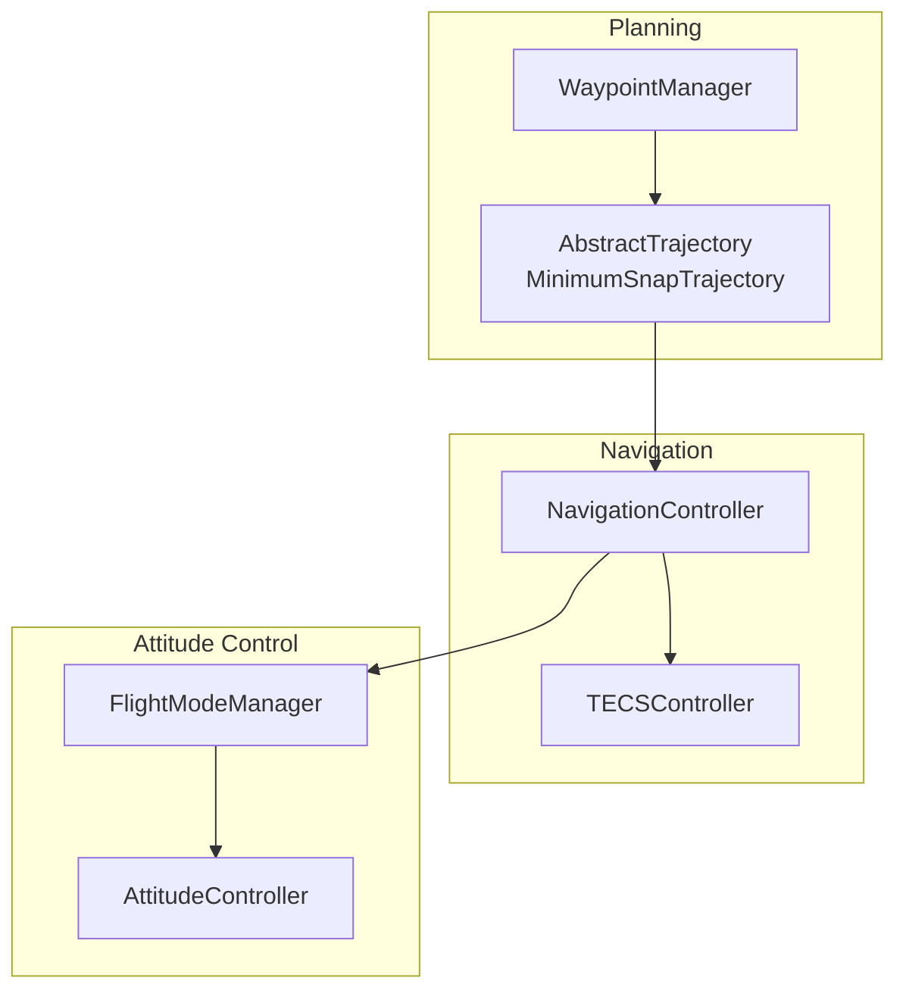
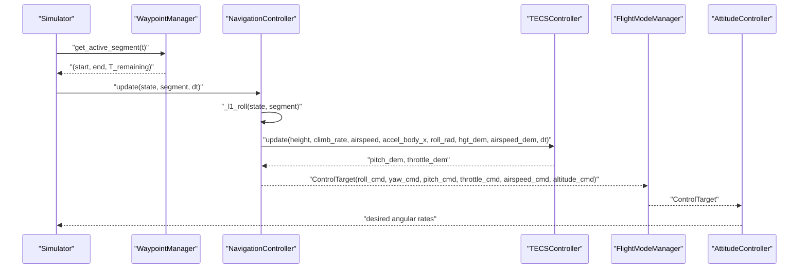
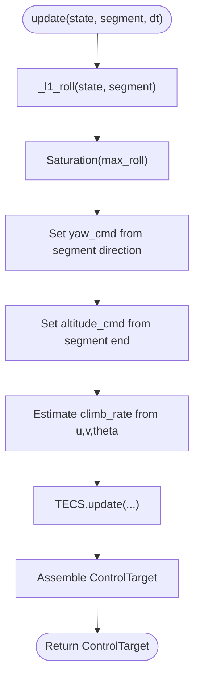
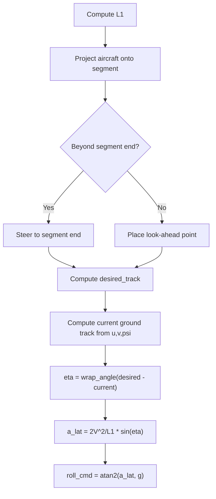
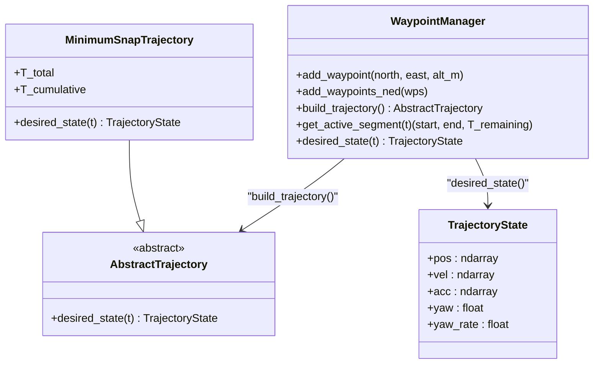
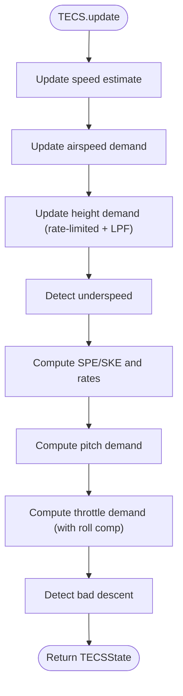
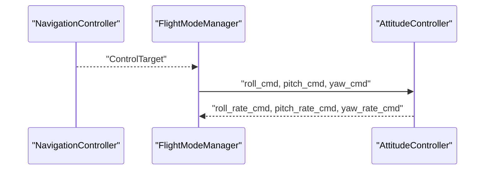
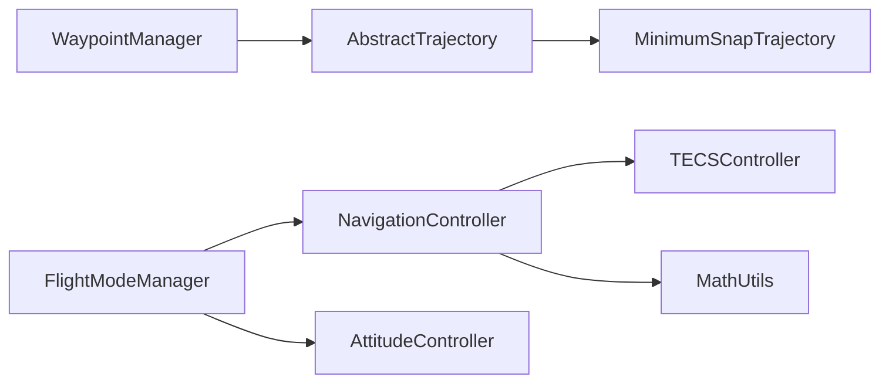

# Navigation Controller

<cite>
**Referenced Files in This Document**
- [navigation_controller.py](file://src/control/navigation_controller.py)
- [waypoint_manager.py](file://src/planning/waypoint_manager.py)
- [trajectory_base.py](file://src/planning/trajectory_base.py)
- [minimum_snap.py](file://src/planning/minimum_snap.py)
- [attitude_controller.py](file://src/control/attitude_controller.py)
- [flight_mode_manager.py](file://src/control/flight_mode_manager.py)
- [tecs_controller.py](file://src/control/tecs_controller.py)
- [math_utils.py](file://src/utils/math_utils.py)
- [control_params.yaml](file://config/control_params.yaml)
- [trajectory.yaml](file://config/trajectory.yaml)
- [3_trajectory_tracking.py](file://examples/3_trajectory_tracking.py)
- [main.py](file://main.py)
</cite>

## Table of Contents
1. [Introduction](#introduction)
2. [Project Structure](#project-structure)
3. [Core Components](#core-components)
4. [Architecture Overview](#architecture-overview)
5. [Detailed Component Analysis](#detailed-component-analysis)
6. [Dependency Analysis](#dependency-analysis)
7. [Performance Considerations](#performance-considerations)
8. [Troubleshooting Guide](#troubleshooting-guide)
9. [Conclusion](#conclusion)
10. [Appendices](#appendices)

## Introduction
This document provides a comprehensive analysis of the NavigationController implementation, focusing on the L1 lateral navigation algorithm for path following and waypoint tracking. It explains how navigation targets are calculated, how lateral deviation is computed, and how the desired bank angle is determined. It also documents the integration with waypoint management and trajectory planning systems, presents tuning guidelines, and demonstrates the relationship between navigation targets and attitude control commands within the five-layer control architecture.

## Project Structure
The navigation stack spans several modules:
- NavigationController computes lateral guidance and altitude/airspeed commands using L1 guidance and TECS.
- WaypointManager constructs trajectories from NED waypoints and exposes the active path segment at any time.
- TECSController manages altitude and airspeed control, integrating energy-based control laws.
- AttitudeController converts desired Euler angles into desired angular rates.
- FlightModeManager orchestrates modes and passes navigation targets to downstream controllers.

**Diagram sources**
- [navigation_controller.py](file://src/control/navigation_controller.py#L45-L202)
- [waypoint_manager.py](file://src/planning/waypoint_manager.py#L20-L208)
- [trajectory_base.py](file://src/planning/trajectory_base.py#L26-L47)
- [minimum_snap.py](file://src/planning/minimum_snap.py#L167-L253)
- [flight_mode_manager.py](file://src/control/flight_mode_manager.py#L115-L298)
- [attitude_controller.py](file://src/control/attitude_controller.py#L33-L134)

**Section sources**
- [navigation_controller.py](file://src/control/navigation_controller.py#L1-L293)
- [waypoint_manager.py](file://src/planning/waypoint_manager.py#L1-L208)
- [trajectory_base.py](file://src/planning/trajectory_base.py#L1-L47)
- [minimum_snap.py](file://src/planning/minimum_snap.py#L1-L253)
- [flight_mode_manager.py](file://src/control/flight_mode_manager.py#L1-L298)
- [attitude_controller.py](file://src/control/attitude_controller.py#L1-L134)

## Core Components
- NavigationController: Implements L1 lateral navigation and TECS altitude/airspeed control. It computes roll_cmd, yaw_cmd, altitude_cmd, airspeed_cmd, pitch_cmd, and throttle_cmd from the current state and the active path segment.
- WaypointManager: Stores NED waypoints, builds trajectories, and provides the active segment (start, end) and remaining time at any simulation time.
- TECSController: Computes pitch and throttle commands based on energy balance between potential and kinetic energy, with anti-windup and underspeed/bad-descent protections.
- AttitudeController: Translates desired Euler angles into desired angular rates using P-only control.
- FlightModeManager: Coordinates flight modes and forwards navigation targets to the attitude controller.

**Section sources**
- [navigation_controller.py](file://src/control/navigation_controller.py#L45-L202)
- [waypoint_manager.py](file://src/planning/waypoint_manager.py#L20-L208)
- [tecs_controller.py](file://src/control/tecs_controller.py#L50-L647)
- [attitude_controller.py](file://src/control/attitude_controller.py#L33-L134)
- [flight_mode_manager.py](file://src/control/flight_mode_manager.py#L115-L298)

## Architecture Overview
The NavigationController sits in the middle of a five-layer control architecture:
- Layer 1: Sensors and state estimation (not shown here).
- Layer 2: NavigationController (L1 + TECS).
- Layer 3: AttitudeController (desired angles → desired angular rates).
- Layer 4: RateController (angular rates → actuator commands).
- Layer 5: Actuators and plant (aerodynamics, mass, inertia).

**Diagram sources**
- [navigation_controller.py](file://src/control/navigation_controller.py#L134-L202)
- [tecs_controller.py](file://src/control/tecs_controller.py#L247-L316)
- [flight_mode_manager.py](file://src/control/flight_mode_manager.py#L271-L298)
- [attitude_controller.py](file://src/control/attitude_controller.py#L81-L123)
- [waypoint_manager.py](file://src/planning/waypoint_manager.py#L178-L201)

## Detailed Component Analysis

### NavigationController: L1 Guidance and TECS Integration
- L1 lateral navigation law:
  - Computes L1 look-ahead distance proportional to airspeed and period.
  - Projects aircraft position onto the current path segment and determines whether to steer to the segment end or a look-ahead point.
  - Calculates the desired track angle using NE ground-truth velocity derived from body-frame u,v and yaw.
  - Computes lateral acceleration command and converts it to a desired bank angle.
- Navigation target calculation:
  - roll_cmd is saturated to a maximum roll limit.
  - yaw_cmd is set to the direction of the path segment in the NE plane.
  - altitude_cmd is extracted from the segment end (converted to NED down).
  - airspeed_cmd is taken from the segment’s target speed.
- TECS integration:
  - Estimates climb rate from body velocities and theta.
  - Calls TECS.update to produce pitch_cmd and throttle_cmd.
  - TECS handles underspeed and bad descent detection and applies energy-based control.

**Diagram sources**
- [navigation_controller.py](file://src/control/navigation_controller.py#L134-L202)
- [navigation_controller.py](file://src/control/navigation_controller.py#L206-L292)

**Section sources**
- [navigation_controller.py](file://src/control/navigation_controller.py#L45-L202)
- [navigation_controller.py](file://src/control/navigation_controller.py#L206-L292)

### L1 Navigation Algorithm Details
- Look-ahead distance: L1 = max(V * period / (2π), 5.0).
- Projection: Along-track distance along the segment is computed; if beyond the end, steer toward the end to prevent overshoot.
- Desired track: atan2 of NE components of the look-ahead vector or end vector.
- Ground track: atan2 of NE velocity derived from body-frame u,v and yaw.
- Lateral acceleration: a_lat = 2V^2 / L1 * sin(eta).
- Bank angle: roll_cmd = atan2(a_lat, g).

**Diagram sources**
- [navigation_controller.py](file://src/control/navigation_controller.py#L206-L292)
- [math_utils.py](file://src/utils/math_utils.py#L13-L25)

**Section sources**
- [navigation_controller.py](file://src/control/navigation_controller.py#L206-L292)
- [math_utils.py](file://src/utils/math_utils.py#L13-L25)

### Waypoint Management and Trajectory Planning
- WaypointManager stores NED waypoints and builds trajectories.
- Supports minimum_snap and minimum_jerk trajectory types.
- Provides get_active_segment(t) to return the current segment start/end and remaining time.
- TrajectoryBase defines TrajectoryState with pos, vel, acc, yaw, yaw_rate.

**Diagram sources**
- [waypoint_manager.py](file://src/planning/waypoint_manager.py#L20-L208)
- [trajectory_base.py](file://src/planning/trajectory_base.py#L16-L47)
- [minimum_snap.py](file://src/planning/minimum_snap.py#L167-L253)

**Section sources**
- [waypoint_manager.py](file://src/planning/waypoint_manager.py#L20-L208)
- [trajectory_base.py](file://src/planning/trajectory_base.py#L16-L47)
- [minimum_snap.py](file://src/planning/minimum_snap.py#L167-L253)

### TECS Controller: Altitude and Airspeed Control
- Energy-based control: balances specific potential energy (SPE) and specific kinetic energy (SKE).
- Parameters include climb/sink limits, time constant, damping, integral gain, speed weight, and roll compensation.
- Outputs pitch_cmd and throttle_cmd while detecting underspeed and bad descent conditions.

**Diagram sources**
- [tecs_controller.py](file://src/control/tecs_controller.py#L247-L316)
- [tecs_controller.py](file://src/control/tecs_controller.py#L465-L551)
- [tecs_controller.py](file://src/control/tecs_controller.py#L553-L624)

**Section sources**
- [tecs_controller.py](file://src/control/tecs_controller.py#L50-L647)

### Relationship Between Navigation Targets and Attitude Control Commands
- NavigationController produces ControlTarget with roll_cmd, pitch_cmd, throttle_cmd, airspeed_cmd, altitude_cmd, and yaw_cmd.
- FlightModeManager forwards these targets to AttitudeController in AUTO mode.
- AttitudeController converts desired angles into desired angular rates using P-only control.

**Diagram sources**
- [navigation_controller.py](file://src/control/navigation_controller.py#L134-L202)
- [flight_mode_manager.py](file://src/control/flight_mode_manager.py#L271-L298)
- [attitude_controller.py](file://src/control/attitude_controller.py#L81-L123)

**Section sources**
- [flight_mode_manager.py](file://src/control/flight_mode_manager.py#L271-L298)
- [attitude_controller.py](file://src/control/attitude_controller.py#L33-L134)

### Five-Layer Control Architecture
- Layer 1: Sensors/state estimation.
- Layer 2: NavigationController (L1 + TECS).
- Layer 3: AttitudeController (desired angles → desired angular rates).
- Layer 4: RateController (angular rates → actuator commands).
- Layer 5: Actuators/plant.

The NavigationController acts as the bridge between navigation and attitude control, translating geometric path information into control targets that the attitude controller can execute.

[No sources needed since this section provides a conceptual overview]

## Dependency Analysis
- NavigationController depends on:
  - PathSegment (geometry and target speed).
  - TECSController (altitude/airspeed control).
  - Math utilities (angle wrapping and saturation).
- WaypointManager depends on:
  - AbstractTrajectory and concrete implementations (e.g., MinimumSnapTrajectory).
  - TrajectoryState for desired states.
- FlightModeManager depends on:
  - NavigationController outputs (ControlTarget).
  - AttitudeController for angular rate commands.

**Diagram sources**
- [navigation_controller.py](file://src/control/navigation_controller.py#L1-L293)
- [waypoint_manager.py](file://src/planning/waypoint_manager.py#L1-L208)
- [trajectory_base.py](file://src/planning/trajectory_base.py#L1-L47)
- [minimum_snap.py](file://src/planning/minimum_snap.py#L1-L253)
- [flight_mode_manager.py](file://src/control/flight_mode_manager.py#L1-L298)
- [attitude_controller.py](file://src/control/attitude_controller.py#L1-L134)
- [math_utils.py](file://src/utils/math_utils.py#L1-L124)

**Section sources**
- [navigation_controller.py](file://src/control/navigation_controller.py#L1-L293)
- [waypoint_manager.py](file://src/planning/waypoint_manager.py#L1-L208)
- [trajectory_base.py](file://src/planning/trajectory_base.py#L1-L47)
- [minimum_snap.py](file://src/planning/minimum_snap.py#L1-L253)
- [flight_mode_manager.py](file://src/control/flight_mode_manager.py#L1-L298)
- [attitude_controller.py](file://src/control/attitude_controller.py#L1-L134)
- [math_utils.py](file://src/utils/math_utils.py#L1-L124)

## Performance Considerations
- L1 tuning:
  - Increase NAVL1_PERIOD for slower response and smoother turns; decrease for tighter tracking.
  - Adjust NAVL1_DAMPING to reduce oscillations; higher values increase damping.
- TECS tuning:
  - TECS_TIME_CONST affects smoothness; larger values reduce overshoot.
  - TECS_PTCH_DAMP and TECS_THR_DAMP stabilize pitch and throttle; increase to reduce oscillations.
  - TECS_INTEG_GAIN reduces steady-state errors; tune carefully to avoid windup.
  - TECS_SPDWEIGHT balances altitude vs speed priority; adjust based on mission requirements.
- Attitude control:
  - P-gains (ROLL_P, PTCH_P) should be tuned to achieve quick response without saturation.
  - Respect maximum angular rates and control limits.

[No sources needed since this section provides general guidance]

## Troubleshooting Guide
- Overshoot at waypoints:
  - Reduce NAVL1_PERIOD or increase NAVL1_DAMPING.
  - Verify segment target speeds are reasonable.
- Oscillations in altitude/airspeed:
  - Increase TECS_TIME_CONST and TECS_PTCH_DAMP.
  - Check underspeed/bad descent flags from TECS output.
- Excessive roll demand:
  - Lower maximum roll limit or increase airspeed to reduce required bank.
- Poor tracking on turns:
  - Decrease NAVL1_PERIOD or improve trajectory segment times via WaypointManager average_speed.

**Section sources**
- [navigation_controller.py](file://src/control/navigation_controller.py#L57-L82)
- [tecs_controller.py](file://src/control/tecs_controller.py#L432-L441)
- [tecs_controller.py](file://src/control/tecs_controller.py#L635-L646)

## Conclusion
The NavigationController implements a robust L1 guidance law integrated with TECS for altitude and airspeed control. It seamlessly connects waypoint management and trajectory planning to attitude control, forming a key part of the five-layer control architecture. Proper tuning of L1 and TECS parameters ensures stable, efficient path following with minimal lateral deviation and good tracking performance.

[No sources needed since this section summarizes without analyzing specific files]

## Appendices

### Parameter Tuning Examples
- L1 tuning:
  - NAVL1_PERIOD: Start around 25–45 seconds; adjust based on turn radius and vehicle agility.
  - NAVL1_DAMPING: Start around 0.75; increase to reduce overshoot.
- TECS tuning:
  - TECS_TIME_CONST: Start around 5–8 seconds; increase for smoother response.
  - TECS_PTCH_DAMP: Start around 0.3–0.8; increase to suppress pitch oscillations.
  - TECS_THR_DAMP: Start around 0.5–0.7; increase to reduce throttle hunting.
  - TECS_INTEG_GAIN: Start around 0.05–0.3; reduce to avoid windup.
  - TECS_SPDWEIGHT: Start around 1.0; lower for altitude priority, higher for speed priority.
- Attitude tuning:
  - ROLL_P and PTCH_P: Tune to achieve desired response without saturating angular rates.

**Section sources**
- [control_params.yaml](file://config/control_params.yaml#L5-L44)
- [navigation_controller.py](file://src/control/navigation_controller.py#L57-L82)

### Waypoint Following Scenarios
- Square trajectory:
  - Define waypoints in NED coordinates; WaypointManager builds a MinimumSnapTrajectory.
  - NavigationController extracts the active segment and computes roll/yaw commands.
  - Example usage in the trajectory tracking example script.

**Section sources**
- [trajectory.yaml](file://config/trajectory.yaml#L1-L23)
- [3_trajectory_tracking.py](file://examples/3_trajectory_tracking.py#L82-L98)

### Integration with Flight Modes
- AUTO mode:
  - FlightModeManager forwards NavigationController’s ControlTarget to AttitudeController.
- STABILIZE/FBW modes:
  - FlightModeManager may override or supplement targets depending on mode.

**Section sources**
- [flight_mode_manager.py](file://src/control/flight_mode_manager.py#L271-L298)

### Example Execution
- Command-line entry point:
  - Run the main script with AUTO mode and minimum-snap trajectory to observe closed-loop tracking.

**Section sources**
- [main.py](file://main.py#L114-L141)