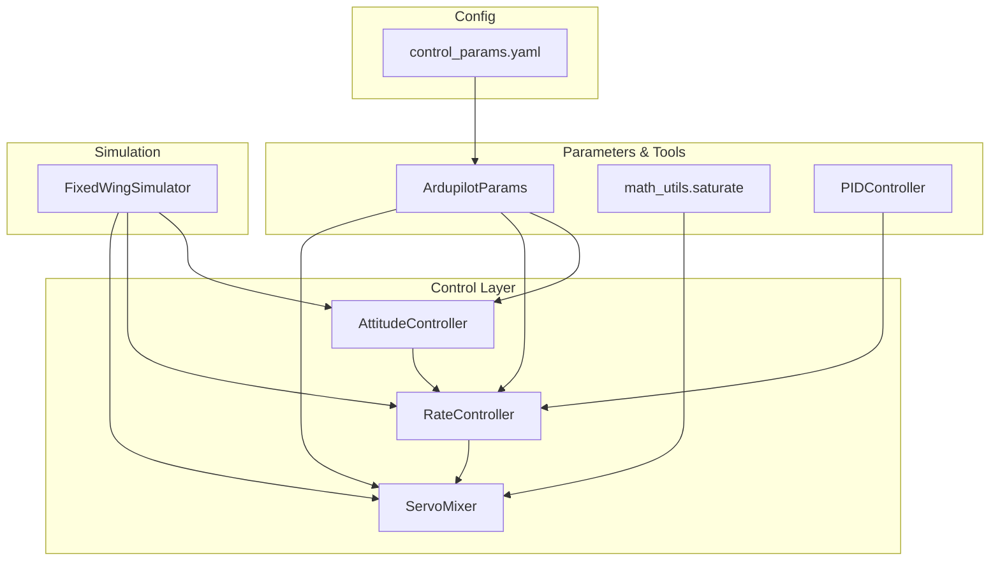
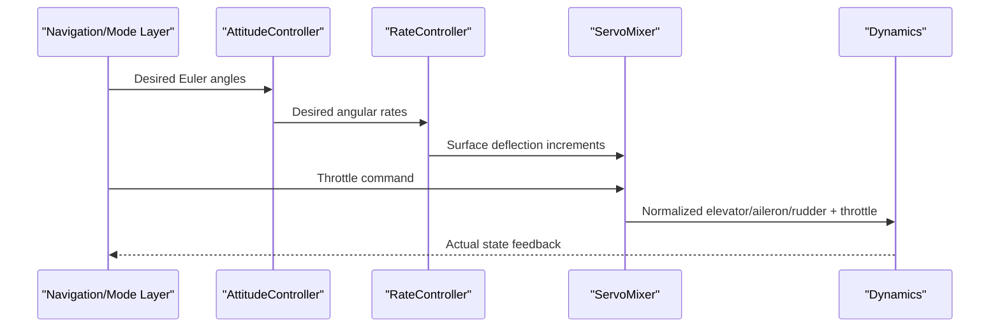
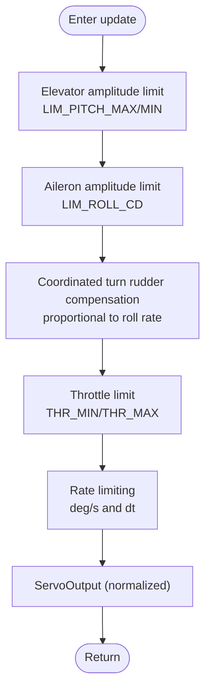
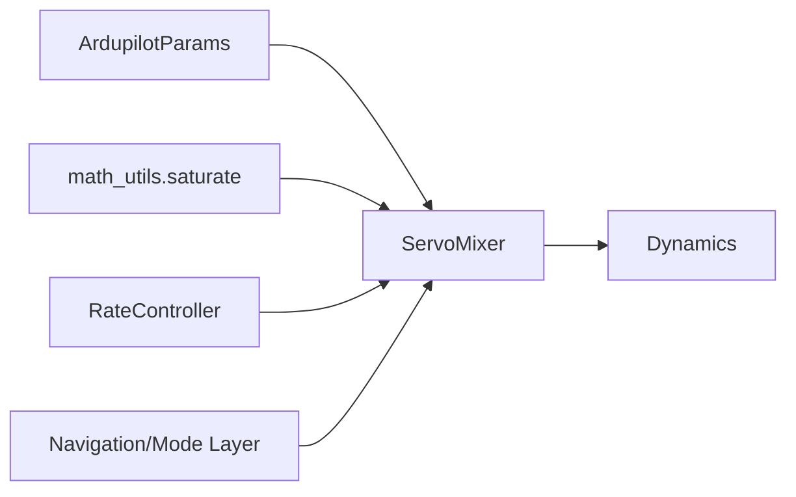

# Servo Mixer

<cite>
**Referenced Files in This Document**
- [servo_mixer.py](file://src/control/servo_mixer.py)
- [ardupilot_compat.py](file://src/control/ardupilot_compat.py)
- [rate_controller.py](file://src/control/rate_controller.py)
- [simulator.py](file://src/simulation/simulator.py)
- [math_utils.py](file://src/utils/math_utils.py)
- [control_params.yaml](file://config/control_params.yaml)
- [test_control.py](file://tests/test_control.py)
- [pid_controller.py](file://src/control/pid_controller.py)
</cite>

## Table of Contents
1. [Introduction](#introduction)
2. [Project Structure](#project-structure)
3. [Core Components](#core-components)
4. [Architecture Overview](#architecture-overview)
5. [Detailed Component Analysis](#detailed-component-analysis)
6. [Dependency Analysis](#dependency-analysis)
7. [Performance Considerations](#performance-considerations)
8. [Troubleshooting Guide](#troubleshooting-guide)
9. [Conclusion](#conclusion)

## Introduction
This document explains the ServoMixer component responsible for converting control commands from attitude/rate targets into physical actuator outputs. It covers:
- How the servo mixer combines surface deflection increments from the rate controller with throttle commands from the navigation/mode layer
- Mixing algorithms for ailerons, elevator, rudder, and throttle
- Actuator allocation, command scaling, and saturation handling
- Examples of mixer configuration, control surface mapping, and actuator command generation
- The relationship between control targets and physical control surface deflections
- Safety limits and protection mechanisms

## Project Structure
The ServoMixer resides in the control layer of the simulation pipeline and integrates with the rate controller, navigation/mode layer, and dynamics. It reads ArduPilot-compatible parameters and uses math utilities for saturation and conversions.

**Diagram sources**
- [simulator.py](file://src/simulation/simulator.py#L41-L52)
- [servo_mixer.py](file://src/control/servo_mixer.py#L19-L21)
- [ardupilot_compat.py](file://src/control/ardupilot_compat.py#L17-L69)
- [math_utils.py](file://src/utils/math_utils.py#L23-L25)

**Section sources**
- [simulator.py](file://src/simulation/simulator.py#L41-L52)
- [servo_mixer.py](file://src/control/servo_mixer.py#L1-L153)
- [ardupilot_compat.py](file://src/control/ardupilot_compat.py#L1-L130)
- [math_utils.py](file://src/utils/math_utils.py#L1-L124)

## Core Components
- ServoMixer: Final actuator command generator that applies amplitude limits, coordinated turn rudder compensation, throttle limits, and rate limiting to produce normalized outputs.
- RateController: Produces normalized surface deflection increments for elevator, aileron, and rudder based on desired angular rates.
- ArduPilotParams: Provides ArduPilot-compatible parameters including pitch/roll limits and throttle bounds.
- math_utils.saturate: Numerical saturation function used for amplitude and rate limiting.
- PIDController: Used by the rate controller for independent axis control loops.

**Section sources**
- [servo_mixer.py](file://src/control/servo_mixer.py#L23-L51)
- [rate_controller.py](file://src/control/rate_controller.py#L24-L30)
- [ardupilot_compat.py](file://src/control/ardupilot_compat.py#L17-L69)
- [math_utils.py](file://src/utils/math_utils.py#L23-L25)
- [pid_controller.py](file://src/control/pid_controller.py#L17-L52)

## Architecture Overview
ServoMixer sits at the innermost layer of the ArduPilot-style control hierarchy. It receives:
- Surface deflection increments from the rate controller (elevator, aileron, rudder)
- Throttle command from the navigation/mode layer
- Current roll angle and roll rate for coordinated turn compensation

It produces normalized actuator outputs that are later converted to radians for the dynamics.

**Diagram sources**
- [simulator.py](file://src/simulation/simulator.py#L501-L521)
- [rate_controller.py](file://src/control/rate_controller.py#L68-L98)
- [servo_mixer.py](file://src/control/servo_mixer.py#L80-L149)

## Detailed Component Analysis

### ServoMixer Algorithm
ServoMixer performs the following steps per control cycle:
1. Elevator amplitude limit: Convert LIM_PITCH_MAX/MIN from degrees to normalized [-1,1] using a fixed travel assumption.
2. Aileron amplitude limit: Use LIM_ROLL_CD (centidegrees) to estimate aileron travel limit based on a fixed travel assumption.
3. Coordinated turn rudder compensation: Add a term proportional to roll rate to cancel adverse yaw.
4. Throttle limit: Clamp throttle to [THR_MIN, THR_MAX].
5. Rate limiting: Limit per-step change in elevator, aileron, and rudder based on rate_limit (deg/s) and dt.
6. Output ServoOutput with normalized values.

**Diagram sources**
- [servo_mixer.py](file://src/control/servo_mixer.py#L80-L149)

**Section sources**
- [servo_mixer.py](file://src/control/servo_mixer.py#L54-L153)

### ServoOutput and Unit Conversion
ServoOutput holds normalized outputs:
- elevator, aileron, rudder: [-1, 1]
- throttle: [0, 1]

to_radians converts normalized outputs to radians using fixed maximum deflections:
- Elevator: 25° maximum
- Aileron: 20° maximum
- Rudder: 25° maximum

Note: The control convention defines positive elevator as nose-up; aerodynamics convention defines positive elevator as trailing-edge down. The conversion negates elevator to align conventions.

**Section sources**
- [servo_mixer.py](file://src/control/servo_mixer.py#L23-L51)

### Parameter Dependencies and Configuration
ServoMixer reads parameters from ArduPilotParams:
- LIM_PITCH_MAX/MIN: Pitch limits in degrees
- LIM_ROLL_CD: Roll limit in centidegrees
- THR_MIN/THR_MAX: Throttle bounds
- Rate limit: Maximum surface deflection rate in deg/s (ServoMixer constructor argument)
- dt: Time step (ServoMixer constructor argument)

These parameters are loaded from control_params.yaml and validated by ArduPilotParams.

**Section sources**
- [ardupilot_compat.py](file://src/control/ardupilot_compat.py#L17-L69)
- [control_params.yaml](file://config/control_params.yaml#L24-L29)
- [servo_mixer.py](file://src/control/servo_mixer.py#L65-L76)

### Integration in the Simulation Loop
The simulation orchestrates the control chain:
- NavigationController and FlightModeManager compute ControlTarget (including throttle_cmd)
- AttitudeController converts desired Euler angles to desired angular rates
- RateController computes normalized surface deflection increments
- ServoMixer applies limits and rate limiting, producing normalized outputs
- Outputs are converted to radians and sent to the dynamics

**Section sources**
- [simulator.py](file://src/simulation/simulator.py#L501-L540)
- [rate_controller.py](file://src/control/rate_controller.py#L68-L98)

### Example Scenarios

#### Scenario 1: Normal cruise with coordinated turn
- Inputs: small roll rate, moderate throttle demand
- Effect: ServoMixer adds rudder compensation proportional to roll rate; throttle clamped to [THR_MIN, THR_MAX]; elevator/aileron/rudder remain within amplitude and rate limits

#### Scenario 2: Large pitch demand approaching limit
- Inputs: large elevator increment, near LIM_PITCH_MAX
- Effect: Elevator output is saturated to normalized equivalent of LIM_PITCH_MAX; rate limiting smooths the response

#### Scenario 3: High roll demand with significant roll rate
- Inputs: large aileron increment, high roll rate
- Effect: Aileron output is limited by estimated aileron travel derived from LIM_ROLL_CD; rudder compensation is added; rate limiting constrains step size

#### Scenario 4: Throttle saturation
- Inputs: throttle above THR_MAX or below THR_MIN
- Effect: Throttle output is clamped to [THR_MIN, THR_MAX]

**Section sources**
- [servo_mixer.py](file://src/control/servo_mixer.py#L109-L149)
- [test_control.py](file://tests/test_control.py#L324-L370)

## Dependency Analysis
ServoMixer depends on:
- ArduPilotParams for limits and throttle bounds
- math_utils.saturate for amplitude and rate limiting
- RateController outputs (normalized increments)
- Navigation/Mode Layer throttle command

**Diagram sources**
- [servo_mixer.py](file://src/control/servo_mixer.py#L19-L21)
- [ardupilot_compat.py](file://src/control/ardupilot_compat.py#L17-L69)
- [math_utils.py](file://src/utils/math_utils.py#L23-L25)

**Section sources**
- [servo_mixer.py](file://src/control/servo_mixer.py#L1-L153)
- [rate_controller.py](file://src/control/rate_controller.py#L1-L109)
- [ardupilot_compat.py](file://src/control/ardupilot_compat.py#L1-L130)
- [simulator.py](file://src/simulation/simulator.py#L41-L52)

## Performance Considerations
- Rate limiting: Per-step delta is computed from rate_limit (deg/s) and dt, preventing abrupt actuator commands that could overload servos or excite the dynamics.
- Amplitude limiting: Ensures outputs respect physical limits defined by LIM_PITCH_MAX/MIN and LIM_ROLL_CD-derived aileron limits.
- Coordinated turn compensation: Reduces adverse yaw during turns, improving stability and reducing control effort.
- Computational cost: Primarily saturation and simple arithmetic; negligible overhead suitable for real-time control.

**Section sources**
- [servo_mixer.py](file://src/control/servo_mixer.py#L134-L149)
- [doc/zh/content/控制系统/舵面混合器.md](file://doc/zh/content/控制系统/舵面混合器.md#L262-L266)

## Troubleshooting Guide
Common issues and remedies:
- Outputs outside expected ranges:
  - Verify throttle bounds [THR_MIN, THR_MAX] and elevator/aileron/rudder limits
  - Confirm rate_limit and dt are reasonable for the simulation step size
- Excessive rudder deflection during turns:
  - Adjust coordinated turn gain if needed; note the empirical value is tunable
- Overshoot or oscillation:
  - Increase rate_limit to allow smoother actuator motion
  - Review upstream rate controller gains and saturation behavior
- Parameter validation failures:
  - Call ArduPilotParams.validate() after loading parameters to catch out-of-range values

Unit tests confirm:
- Output types and normalization
- Throttle clamping
- Elevator amplitude limit based on LIM_PITCH_MAX
- Rudder compensation under roll rate
- Normalized output bounds

**Section sources**
- [test_control.py](file://tests/test_control.py#L311-L371)
- [ardupilot_compat.py](file://src/control/ardupilot_compat.py#L104-L130)
- [servo_mixer.py](file://src/control/servo_mixer.py#L151-L153)

## Conclusion
ServoMixer synthesizes control inputs from the rate controller and navigation/mode layer into safe, normalized actuator commands. It enforces physical and dynamic limits through amplitude and rate limiting, provides coordinated turn compensation, and ensures throttle remains within operational bounds. Together with the layered control components and parameter validation, it delivers robust, real-time control suitable for fixed-wing simulation and analysis.