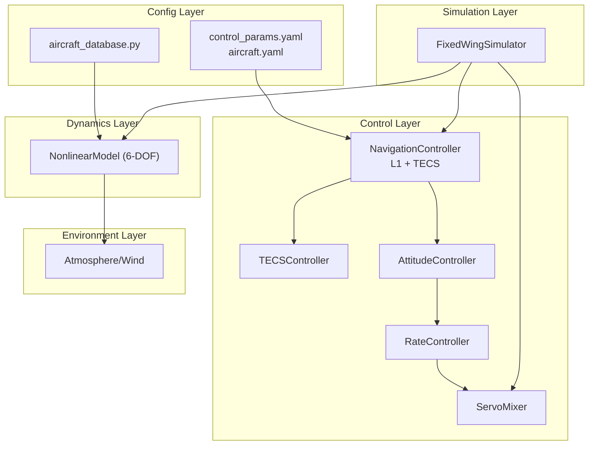
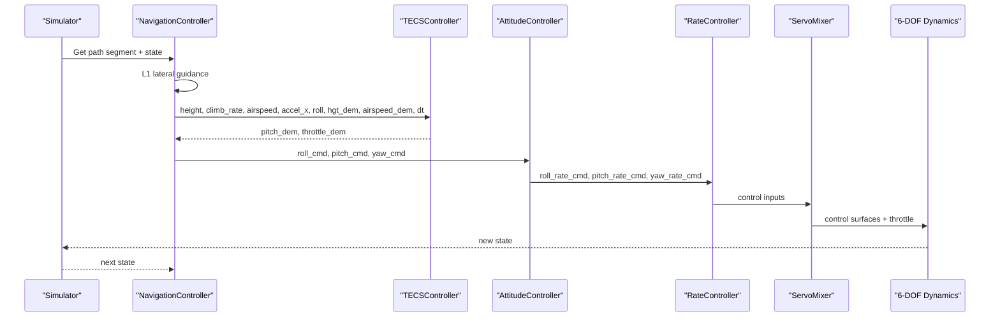
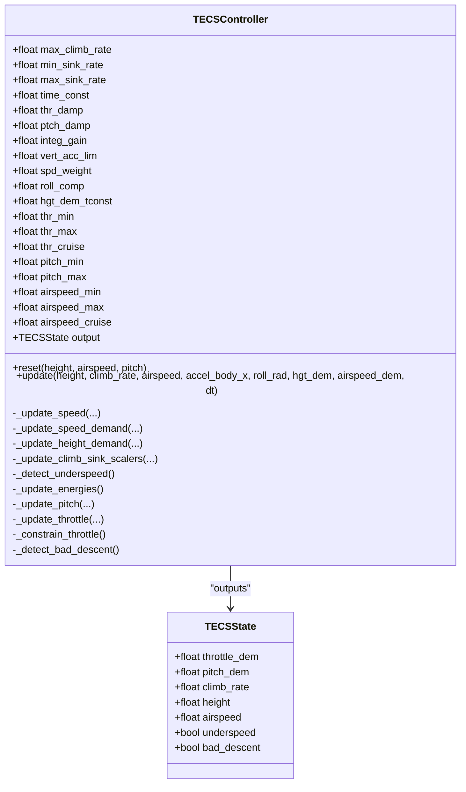
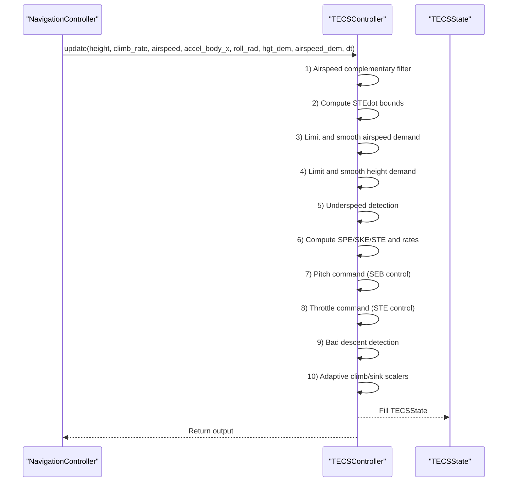
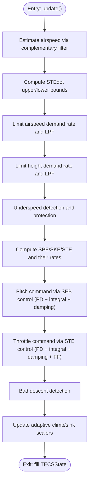
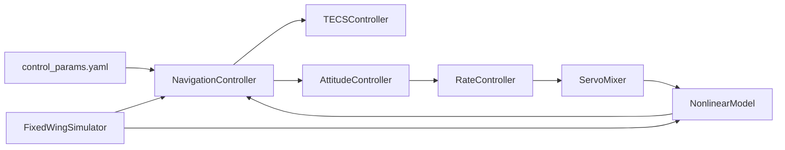
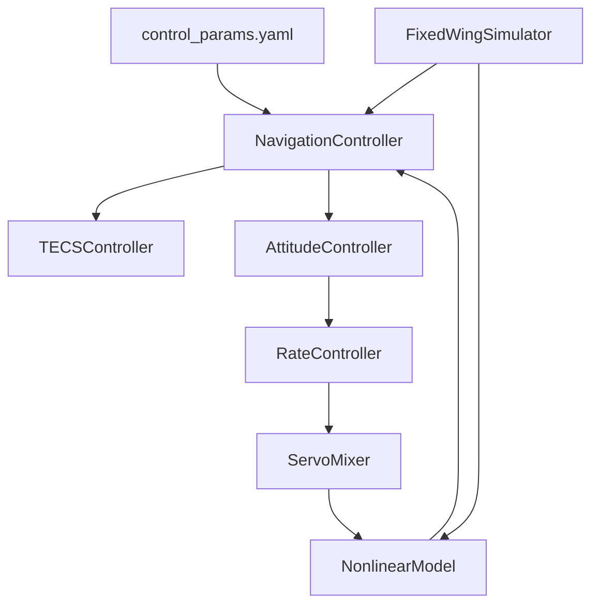

# TECS Controller

<cite>
**Referenced Files in This Document**
- [tecs_controller.py](file://src/control/tecs_controller.py)
- [TECS总能量控制器.md](file://doc/zh/content/控制系统/TECS总能量控制器.md)
- [navigation_controller.py](file://src/control/navigation_controller.py)
- [simulator.py](file://src/simulation/simulator.py)
- [control_params.yaml](file://config/control_params.yaml)
- [aircraft.yaml](file://config/aircraft.yaml)
- [aircraft_database.py](file://src/models/aircraft_database.py)
- [debug_tecs.py](file://debug_tecs.py)
- [1_linear_response.py](file://examples/1_linear_response.py)
- [3_trajectory_tracking.py](file://examples/3_trajectory_tracking.py)
- [flight_mode_manager.py](file://src/control/flight_mode_manager.py)
</cite>

## Table of Contents
1. [Introduction](#introduction)
2. [Project Structure](#project-structure)
3. [Core Components](#core-components)
4. [Architecture Overview](#architecture-overview)
5. [Detailed Component Analysis](#detailed-component-analysis)
6. [Dependency Analysis](#dependency-analysis)
7. [Performance Considerations](#performance-considerations)
8. [Troubleshooting Guide](#troubleshooting-guide)
9. [Conclusion](#conclusion)
10. [Appendices](#appendices)

## Introduction
This document presents a comprehensive technical guide to the TECS (Total Energy Control System) implementation used in the FixedWingSimulator project. TECS coordinates altitude and airspeed control by managing total energy (sum of specific potential energy and specific kinetic energy) and dynamically allocating energy between height and speed via a dedicated energy balance signal. The controller is implemented as a Python port of ArduPilot’s AP_TECS, designed to avoid integral windup and saturation issues typical of decoupled PID control while ensuring robustness across varying flight conditions.

## Project Structure
TECS resides in the control layer and collaborates with the NavigationController (L1 lateral guidance + TECS vertical coordination), the FlightModeManager (mode selection and target generation), and the ServoMixer/rate/attitude controllers downstream. Configuration parameters are loaded from YAML files, and the simulator orchestrates the full closed-loop control chain.

**Diagram sources**
- [simulator.py](file://src/simulation/simulator.py#L490-L642)
- [navigation_controller.py](file://src/control/navigation_controller.py#L45-L118)
- [tecs_controller.py](file://src/control/tecs_controller.py#L50-L160)
- [aircraft_database.py](file://src/models/aircraft_database.py#L29-L48)
- [control_params.yaml](file://config/control_params.yaml#L30-L45)

**Section sources**
- [simulator.py](file://src/simulation/simulator.py#L490-L642)
- [navigation_controller.py](file://src/control/navigation_controller.py#L45-L118)
- [aircraft_database.py](file://src/models/aircraft_database.py#L29-L48)
- [control_params.yaml](file://config/control_params.yaml#L30-L45)

## Core Components
- TECSController: Implements oil-throttle control of total specific energy and pitch-control of specific energy balance to couple altitude and airspeed regulation. It estimates airspeed via a complementary filter, computes SPE/SKE/STE demands and rates, and generates throttle and pitch commands with anti-windup and rate limiting.
- NavigationController: Provides L1 lateral guidance and feeds TECS the desired altitude and airspeed targets, along with estimated climb rate and body-axis acceleration. It also manages TECS reset and initialization.
- FixedWingSimulator: Drives the closed-loop control chain, invoking NavigationController.update and passing TECS outputs to the downstream control layers.
- Configuration: control_params.yaml supplies TECS parameters and flight envelope; aircraft.yaml selects the vehicle; aircraft_database.py supplies aerodynamic parameters.

**Section sources**
- [tecs_controller.py](file://src/control/tecs_controller.py#L50-L160)
- [navigation_controller.py](file://src/control/navigation_controller.py#L45-L118)
- [simulator.py](file://src/simulation/simulator.py#L490-L642)
- [control_params.yaml](file://config/control_params.yaml#L30-L45)
- [aircraft.yaml](file://config/aircraft.yaml#L5-L13)

## Architecture Overview
TECS operates as the longitudinal energy controller within a five-layer control architecture. It receives lateral guidance and vertical targets from NavigationController, estimates climb rate and body acceleration, and outputs pitch and throttle commands. These commands are subsequently processed by the attitude and rate control layers and converted to physical control surface deflections and thrust via the servo mixer.

**Diagram sources**
- [navigation_controller.py](file://src/control/navigation_controller.py#L134-L202)
- [tecs_controller.py](file://src/control/tecs_controller.py#L247-L315)
- [simulator.py](file://src/simulation/simulator.py#L490-L642)

## Detailed Component Analysis

### TECSController Class and State
TECSController encapsulates all TECS logic, including state estimation, demand shaping, energy computations, and command generation. TECSState holds the latest outputs and diagnostic flags.

**Diagram sources**
- [tecs_controller.py](file://src/control/tecs_controller.py#L38-L160)
- [tecs_controller.py](file://src/control/tecs_controller.py#L197-L647)

**Section sources**
- [tecs_controller.py](file://src/control/tecs_controller.py#L38-L160)
- [tecs_controller.py](file://src/control/tecs_controller.py#L197-L647)

### TECS Update Flow
The update method executes a structured sequence: airspeed estimation, STEdot bounds, speed and height demand shaping, underspeed detection, energy computation, pitch command generation, throttle command generation, bad descent detection, and adaptive scalers.

**Diagram sources**
- [tecs_controller.py](file://src/control/tecs_controller.py#L247-L315)
- [tecs_controller.py](file://src/control/tecs_controller.py#L321-L647)

**Section sources**
- [tecs_controller.py](file://src/control/tecs_controller.py#L247-L315)
- [tecs_controller.py](file://src/control/tecs_controller.py#L321-L647)

### Energy Management and Command Generation
- Total energy management: Oil-throttle controls total specific energy (STE = SPE + SKE). Rate-of-climb demand is computed from STEdot demand and filtered STEdot error to avoid excessive oscillation.
- Energy balance allocation: Pitch controls the specific energy balance (SEB = w_spe·SPE − w_ske·SKE), where spd_weight balances height vs speed priorities. During underspeed, both weights are elevated to prioritize speed.
- Throttle command: Combines a feedforward term based on STEdot demand and a PD feedback term with integral action. Anti-windup prevents integral growth when outputs are saturated.
- Pitch command: Computes SEBdot demand from SEB error and height rate demand, applies damping and integral action, and enforces rate limits based on vertical acceleration capability.

**Diagram sources**
- [tecs_controller.py](file://src/control/tecs_controller.py#L445-L464)
- [tecs_controller.py](file://src/control/tecs_controller.py#L465-L552)
- [tecs_controller.py](file://src/control/tecs_controller.py#L553-L624)
- [tecs_controller.py](file://src/control/tecs_controller.py#L635-L647)
- [tecs_controller.py](file://src/control/tecs_controller.py#L425-L431)

**Section sources**
- [tecs_controller.py](file://src/control/tecs_controller.py#L445-L464)
- [tecs_controller.py](file://src/control/tecs_controller.py#L465-L552)
- [tecs_controller.py](file://src/control/tecs_controller.py#L553-L624)
- [tecs_controller.py](file://src/control/tecs_controller.py#L635-L647)
- [tecs_controller.py](file://src/control/tecs_controller.py#L425-L431)

### Parameter Tuning Guidelines
- TECS_CLMB_MAX/TECS_SINK_MIN/TECS_SINK_MAX: Define maximum climb and sink capabilities; symmetric settings reduce oscillations.
- TECS_TIME_CONST: Governs response smoothness; larger values reduce overshoot but increase settling time.
- TECS_THR_DAMP/TECS_PTCH_DAMP: Reduce oscillatory tendencies; higher values improve stability at the cost of responsiveness.
- TECS_INTEG_GAIN: Reduces steady-state error; tune carefully to avoid windup and limit amplitude.
- TECS_SPDWEIGHT: Adjusts priority between altitude and speed (0 = altitude-only, 2 = speed-only).
- TECS_RLL2THR: Compensates for induced drag during turns; increase for large bank angles.
- TECS_PITCH_MIN/TECS_PITCH_MAX: Respect vehicle limits; ensure compatibility with downstream controllers.
- TECS_THR_CRUISE: Baseline throttle feedforward aligned with trim conditions.
- TECS_HDEM_TCONST: Smooths height demand transitions to prevent aggressive TECS reactions.

Typical tuning process:
- Start with moderate time constant and damping; adjust integral gain to eliminate offset.
- Calibrate spd_weight per mission: climb-heavy tasks favor lower weight; loiter/turn tasks favor higher weight.
- Increase roll compensation for high-bank maneuvers; verify pitch rate limits remain adequate.

**Section sources**
- [control_params.yaml](file://config/control_params.yaml#L30-L45)
- [tecs_controller.py](file://src/control/tecs_controller.py#L80-L116)
- [TECS总能量控制器.md](file://doc/zh/content/控制系统/TECS总能量控制器.md#L338-L371)

### TECS Integration with Control Architecture
- NavigationController builds TECS with parameters from control_params.yaml and passes state-derived climb rate and body acceleration to TECS.
- TECS outputs pitch and throttle commands embedded in ControlTarget, which are consumed by the attitude and rate control layers.
- The simulator orchestrates the loop, stepping dynamics and recording results.

**Diagram sources**
- [simulator.py](file://src/simulation/simulator.py#L490-L642)
- [navigation_controller.py](file://src/control/navigation_controller.py#L186-L202)
- [tecs_controller.py](file://src/control/tecs_controller.py#L247-L315)
- [control_params.yaml](file://config/control_params.yaml#L30-L45)

**Section sources**
- [simulator.py](file://src/simulation/simulator.py#L490-L642)
- [navigation_controller.py](file://src/control/navigation_controller.py#L186-L202)
- [tecs_controller.py](file://src/control/tecs_controller.py#L247-L315)
- [control_params.yaml](file://config/control_params.yaml#L30-L45)

## Dependency Analysis
- TECSController depends on NavigationController for validated height and airspeed targets, climb rate estimate, and body-axis acceleration.
- The simulator invokes NavigationController.update each step; NavigationController internally calls TECS.update and forwards TECS outputs to the control layers.
- Configuration parameters from control_params.yaml directly influence TECS behavior, including gains, limits, and feedforward terms.

**Diagram sources**
- [simulator.py](file://src/simulation/simulator.py#L490-L642)
- [navigation_controller.py](file://src/control/navigation_controller.py#L186-L202)
- [tecs_controller.py](file://src/control/tecs_controller.py#L247-L315)
- [control_params.yaml](file://config/control_params.yaml#L30-L45)

**Section sources**
- [simulator.py](file://src/simulation/simulator.py#L490-L642)
- [navigation_controller.py](file://src/control/navigation_controller.py#L186-L202)
- [tecs_controller.py](file://src/control/tecs_controller.py#L247-L315)
- [control_params.yaml](file://config/control_params.yaml#L30-L45)

## Performance Considerations
- Time constant: Larger values reduce overshoot but increase rise time; choose based on mission requirements.
- Damping coefficients: Higher thr_damp and ptch_damp improve stability but may slow response.
- Integral gain: Essential for offset rejection; guard against windup and limit amplitude.
- Speed weighting: Tailor spd_weight to mission profile; turns and loiter favor speed priority; climbs favor altitude.
- Roll compensation: Increase for high-bank turns to counter induced drag.
- Vertical acceleration limit: Prevents rapid pitch transients and reduces structural loads.

**Section sources**
- [TECS总能量控制器.md](file://doc/zh/content/控制系统/TECS总能量控制器.md#L302-L314)
- [tecs_controller.py](file://src/control/tecs_controller.py#L490-L552)
- [tecs_controller.py](file://src/control/tecs_controller.py#L577-L624)

## Troubleshooting Guide
- Underspeed protection triggers when airspeed is below threshold and throttle nears maximum; verify airspeed envelope and climb rate limits.
- “Bad descent” detected when STE_error is large, energy is decreasing, and throttle is saturated; recheck target altitude/airspeed feasibility.
- Persistent throttle saturation: Review STEdot demand, consider reducing height rate demand or increasing roll compensation.
- Pitch command oscillations: Increase ptch_damp or vert_acc_lim; reduce time constant cautiously.
- Unstable airspeed estimate: Inspect complementary filter parameters and acceleration LPF; ensure sensor quality.

**Section sources**
- [tecs_controller.py](file://src/control/tecs_controller.py#L432-L444)
- [tecs_controller.py](file://src/control/tecs_controller.py#L635-L647)
- [tecs_controller.py](file://src/control/tecs_controller.py#L577-L624)
- [tecs_controller.py](file://src/control/tecs_controller.py#L544-L551)

## Conclusion
TECS provides a robust, unified framework for altitude and airspeed control by managing total energy and distributing it between height and speed according to mission needs. Its dual-loop structure—oil-throttle control of STE and pitch control of SEB—eliminates decoupling issues, improves stability, and simplifies tuning. Proper configuration of TECS parameters, combined with careful integration into the broader control hierarchy, yields predictable and safe longitudinal behavior across diverse flight regimes.

## Appendices

### TECS Parameter Reference and Tuning Tips
- TECS_CLMB_MAX: Maximum climb rate (m/s); limits energy accumulation.
- TECS_SINK_MIN/TECS_SINK_MAX: Minimum and maximum sink rates (m/s); ensure controllable descent.
- TECS_TIME_CONST: Control time constant (s); affects smoothness and overshoot.
- TECS_THR_DAMP: Oil-throttle damping; reduces oscillations.
- TECS_PTCH_DAMP: Pitch damping; stabilizes angle control.
- TECS_INTEG_GAIN: Integral gain; reduces steady-state error.
- TECS_SPDWEIGHT: Speed weighting (0–2); 0 = altitude priority, 2 = speed priority.
- TECS_RLL2THR: Roll-to-throttle compensation; turn-induced drag compensation.
- TECS_PITCH_MIN/TECS_PITCH_MAX: Allowable pitch range for TECS.
- TECS_THR_CRUISE: Cruise throttle feedforward.
- TECS_HDEM_TCONST: Height demand LPF time constant.

Tuning tips:
- Begin with moderate time constant and damping; fine-tune integral gain to minimize offset.
- Adjust spd_weight per task: climbs reduce weight, turns increase weight.
- Increase roll compensation for high-bank turns; verify pitch rate limits remain sufficient.

**Section sources**
- [control_params.yaml](file://config/control_params.yaml#L30-L45)
- [tecs_controller.py](file://src/control/tecs_controller.py#L80-L116)
- [TECS总能量控制器.md](file://doc/zh/content/控制系统/TECS总能量控制器.md#L338-L371)

### TECS Parameter Tuning Scenarios
- Steady climb: Lower spd_weight; moderate time constant; ensure climb rate limits are adequate.
- Loiter/turn: Higher spd_weight; slightly increased damping; verify roll compensation for bank angle.
- Low-speed flight: Enable underspeed protection; reduce sink max and increase throttle damping.
- High-speed flight: Monitor speed envelope; avoid excessive speed priority leading to energy buildup.

**Section sources**
- [tecs_controller.py](file://src/control/tecs_controller.py#L432-L444)
- [tecs_controller.py](file://src/control/tecs_controller.py#L425-L431)
- [tecs_controller.py](file://src/control/tecs_controller.py#L599-L601)

### Example Workflows and Diagnostics
- Height step response diagnostics: Use debug_tecs.py to log height demand, altitude, throttle, pitch, airspeed, and STE error during a step climb scenario.
- Linear response and trajectory tracking: Examples demonstrate closed-loop behavior under FBW_B and AUTO modes, useful for validating TECS tuning and controller coupling.

**Section sources**
- [debug_tecs.py](file://debug_tecs.py#L1-L67)
- [1_linear_response.py](file://examples/1_linear_response.py#L130-L206)
- [3_trajectory_tracking.py](file://examples/3_trajectory_tracking.py#L70-L194)