# Core Architecture

<cite>
**Referenced Files in This Document**
- [main.py](file://main.py)
- [simulator.py](file://src/simulation/simulator.py)
- [state_manager.py](file://src/simulation/state_manager.py)
- [aircraft_factory.py](file://src/models/aircraft_factory.py)
- [flight_mode_manager.py](file://src/control/flight_mode_manager.py)
- [navigation_controller.py](file://src/control/navigation_controller.py)
- [waypoint_manager.py](file://src/planning/waypoint_manager.py)
- [wind_model.py](file://src/environment/wind_model.py)
- [animator.py](file://src/visualization/animator.py)
- [config_loader.py](file://src/utils/config_loader.py)
- [nonlinear_model.py](file://src/dynamics/nonlinear_model.py)
- [integrator.py](file://src/simulation/integrator.py)
</cite>

## Table of Contents
1. [Introduction](#introduction)
2. [Project Structure](#project-structure)
3. [Core Components](#core-components)
4. [Architecture Overview](#architecture-overview)
5. [Detailed Component Analysis](#detailed-component-analysis)
6. [Dependency Analysis](#dependency-analysis)
7. [Performance Considerations](#performance-considerations)
8. [Troubleshooting Guide](#troubleshooting-guide)
9. [Conclusion](#conclusion)
10. [Appendices](#appendices)

## Introduction
This document describes the core architecture of the FixedWingSimulator system. It explains the high-level design patterns (layered architecture, factory pattern, and observer-like control flow), the modular structure separating simulation engine, aircraft models, control systems, environment modeling, planning, and visualization, and the orchestration mechanisms that coordinate runtime behavior. It also documents system boundaries, data flows, responsibilities, technical decisions, architectural trade-offs, and design principles.

## Project Structure
The project is organized into feature-based packages under src/, each encapsulating a domain area:
- simulation: orchestration, state management, numerical integration
- models: aircraft configuration via factory and database
- control: flight modes, navigation, attitude/rate control, servo mixing, TECS
- dynamics: nonlinear 6-DOF equations, linearized models, aerodynamics
- environment: wind and atmospheric models
- planning: waypoints and trajectory generation
- visualization: plotting and animation
- utils: configuration loader and shared utilities

Entry point is main.py, which constructs the FixedWingSimulator and executes simulations or analyses.

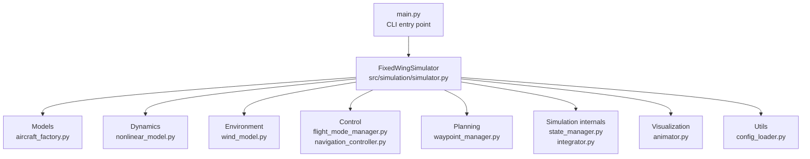

**Diagram sources**
- [main.py](file://main.py#L98-L144)
- [simulator.py](file://src/simulation/simulator.py#L115-L642)
- [aircraft_factory.py](file://src/models/aircraft_factory.py#L39-L136)
- [nonlinear_model.py](file://src/dynamics/nonlinear_model.py#L104-L386)
- [wind_model.py](file://src/environment/wind_model.py#L18-L113)
- [flight_mode_manager.py](file://src/control/flight_mode_manager.py#L115-L298)
- [navigation_controller.py](file://src/control/navigation_controller.py#L45-L293)
- [waypoint_manager.py](file://src/planning/waypoint_manager.py#L20-L208)
- [state_manager.py](file://src/simulation/state_manager.py#L16-L193)
- [integrator.py](file://src/simulation/integrator.py#L17-L108)
- [animator.py](file://src/visualization/animator.py#L14-L150)
- [config_loader.py](file://src/utils/config_loader.py#L59-L82)

**Section sources**
- [main.py](file://main.py#L1-L145)
- [simulator.py](file://src/simulation/simulator.py#L1-L642)

## Core Components
- FixedWingSimulator orchestrates the entire simulation lifecycle, wiring aircraft, environment, planning, control, dynamics, and visualization.
- AircraftFactory builds AircraftConfig from database and optional overrides.
- FlightModeManager selects and transitions between flight modes, producing ControlTarget commands.
- NavigationController computes lateral roll command via L1 and vertical/energy commands via TECS.
- WaypointManager manages NED waypoints and builds trajectories.
- NonlinearModel defines 6-DOF equations of motion and computes trim.
- Wind model provides time-varying NED wind vectors.
- StateHistory records time histories efficiently; AircraftSimState holds derived quantities.
- Integrator provides real-time step-wise ODE integration.
- ConfigLoader merges YAML configurations with defaults.
- Visualization modules provide quick plots and animations.

**Section sources**
- [simulator.py](file://src/simulation/simulator.py#L115-L642)
- [aircraft_factory.py](file://src/models/aircraft_factory.py#L39-L136)
- [flight_mode_manager.py](file://src/control/flight_mode_manager.py#L115-L298)
- [navigation_controller.py](file://src/control/navigation_controller.py#L45-L293)
- [waypoint_manager.py](file://src/planning/waypoint_manager.py#L20-L208)
- [nonlinear_model.py](file://src/dynamics/nonlinear_model.py#L104-L386)
- [wind_model.py](file://src/environment/wind_model.py#L18-L113)
- [state_manager.py](file://src/simulation/state_manager.py#L16-L193)
- [integrator.py](file://src/simulation/integrator.py#L17-L108)
- [config_loader.py](file://src/utils/config_loader.py#L59-L82)
- [animator.py](file://src/visualization/animator.py#L14-L150)

## Architecture Overview
The system follows a layered architecture:
- Presentation/CLI layer (main.py)
- Orchestration layer (FixedWingSimulator)
- Domain layers (models, dynamics, control, planning, environment)
- Infrastructure (visualization, config loader, integrator)

Design patterns:
- Factory pattern: AircraftFactory constructs AircraftConfig from database and overrides.
- Observer-like control flow: FlightModeManager produces ControlTarget; NavigationController consumes it; Attitude/Rate controllers consume ControlTarget; ServoMixer converts to normalized actuator outputs.
- Strategy pattern: WaypointManager delegates trajectory construction to concrete trajectory classes.

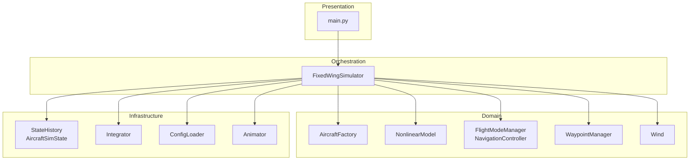

**Diagram sources**
- [main.py](file://main.py#L98-L144)
- [simulator.py](file://src/simulation/simulator.py#L115-L642)
- [aircraft_factory.py](file://src/models/aircraft_factory.py#L39-L136)
- [nonlinear_model.py](file://src/dynamics/nonlinear_model.py#L104-L386)
- [flight_mode_manager.py](file://src/control/flight_mode_manager.py#L115-L298)
- [navigation_controller.py](file://src/control/navigation_controller.py#L45-L293)
- [waypoint_manager.py](file://src/planning/waypoint_manager.py#L20-L208)
- [wind_model.py](file://src/environment/wind_model.py#L18-L113)
- [state_manager.py](file://src/simulation/state_manager.py#L16-L193)
- [integrator.py](file://src/simulation/integrator.py#L17-L108)
- [config_loader.py](file://src/utils/config_loader.py#L59-L82)
- [animator.py](file://src/visualization/animator.py#L14-L150)

## Detailed Component Analysis

### FixedWingSimulator Orchestration
FixedWingSimulator is the central coordinator:
- Loads configuration via ConfigLoader
- Builds aircraft via AircraftFactory
- Instantiates environment (Wind), control layers (FlightModeManager, NavigationController, Attitude/Rate controllers, ServoMixer), planning (WaypointManager), and dynamics (NonlinearModel)
- Runs closed-loop simulation with real-time stepping using Dopri5Integrator
- Produces SimulationResult with StateHistory and trim metadata

Key runtime flow:
- Computes trim, initializes integrator, resets control layers
- For each step: reads state, computes ControlTarget via FlightModeManager, updates NavigationController, then Attitude/Rate/ServoMixer, records history, integrates ODE

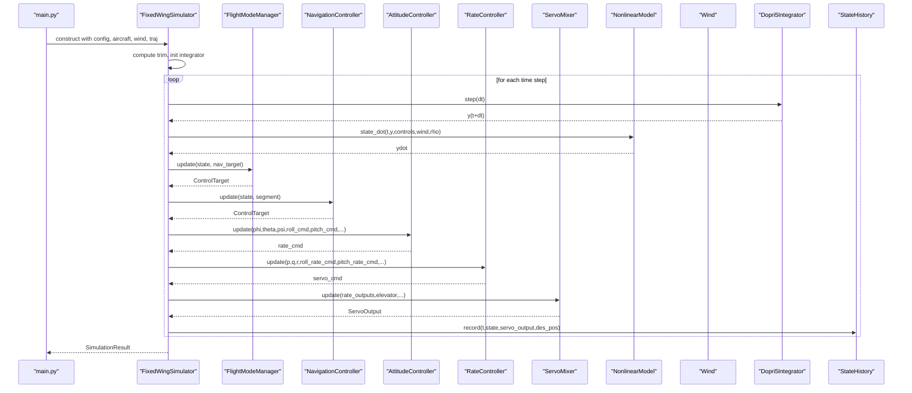

**Diagram sources**
- [simulator.py](file://src/simulation/simulator.py#L239-L567)
- [flight_mode_manager.py](file://src/control/flight_mode_manager.py#L173-L211)
- [navigation_controller.py](file://src/control/navigation_controller.py#L134-L200)
- [nonlinear_model.py](file://src/dynamics/nonlinear_model.py#L160-L200)
- [wind_model.py](file://src/environment/wind_model.py#L76-L108)
- [integrator.py](file://src/simulation/integrator.py#L50-L71)
- [state_manager.py](file://src/simulation/state_manager.py#L124-L174)

**Section sources**
- [simulator.py](file://src/simulation/simulator.py#L115-L642)

### Aircraft Model Factory Pattern
AircraftFactory merges database parameters with optional YAML and dict overrides, producing AircraftConfig consumed by the simulation engine. It also supports exporting ArduPilot-compatible parameter sets.

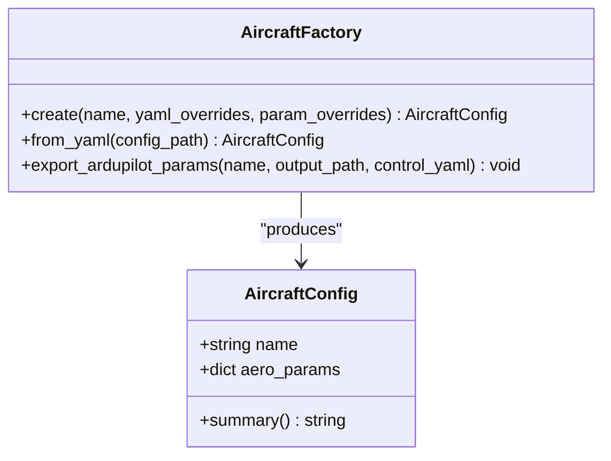

**Diagram sources**
- [aircraft_factory.py](file://src/models/aircraft_factory.py#L39-L136)

**Section sources**
- [aircraft_factory.py](file://src/models/aircraft_factory.py#L39-L136)

### Control Layer: Flight Modes and Navigation
FlightModeManager selects and transitions between modes (MANUAL, STABILIZE, FBW_A, FBW_B, AUTO, LOITER, RTH), producing ControlTarget. NavigationController computes lateral roll via L1 and vertical/energy commands via TECS, returning ControlTarget consumed by attitude/rate controllers.

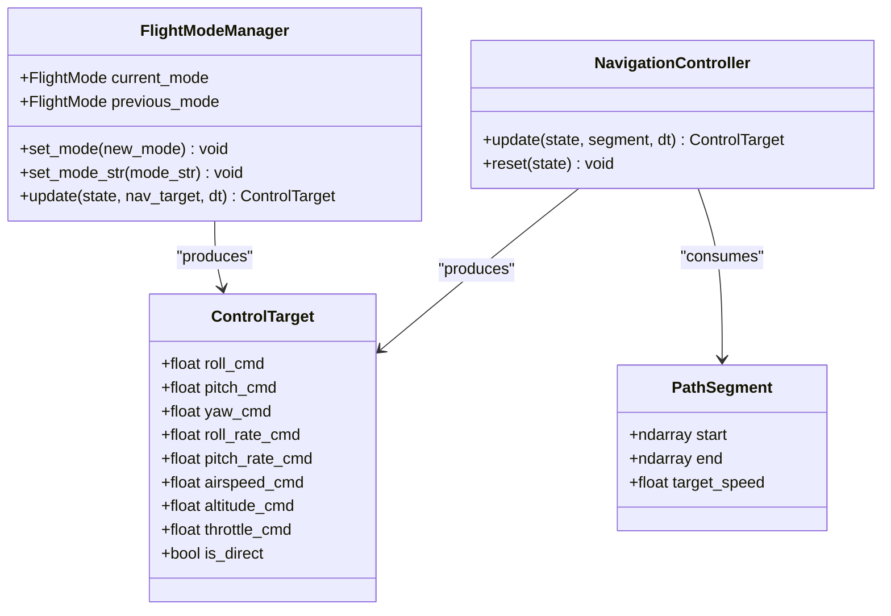

**Diagram sources**
- [flight_mode_manager.py](file://src/control/flight_mode_manager.py#L115-L298)
- [navigation_controller.py](file://src/control/navigation_controller.py#L45-L200)
- [waypoint_manager.py](file://src/planning/waypoint_manager.py#L25-L43)

**Section sources**
- [flight_mode_manager.py](file://src/control/flight_mode_manager.py#L115-L298)
- [navigation_controller.py](file://src/control/navigation_controller.py#L45-L200)

### Planning and Trajectory Management
WaypointManager stores NED waypoints, loads/saves from YAML, and builds AbstractTrajectory instances (MinimumSnap/MimimumJerk). It exposes desired_state(t) and active segment accessors for real-time tracking.

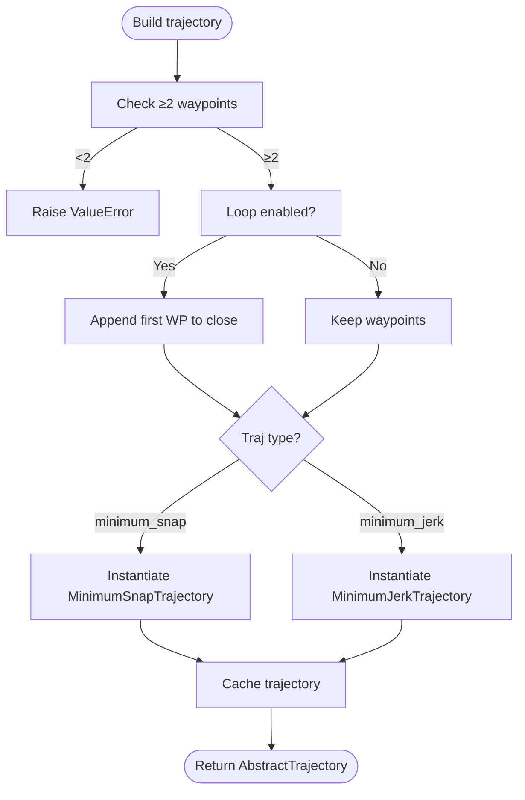

**Diagram sources**
- [waypoint_manager.py](file://src/planning/waypoint_manager.py#L127-L167)

**Section sources**
- [waypoint_manager.py](file://src/planning/waypoint_manager.py#L20-L208)

### Dynamics and Environment
NonlinearModel defines 6-DOF equations of motion, computes trim, and evaluates state derivatives given Controls, wind in body frame, and air density. Wind model provides NED wind vectors according to configured type (NONE, FIXED, SINE, RANDOMSINE).

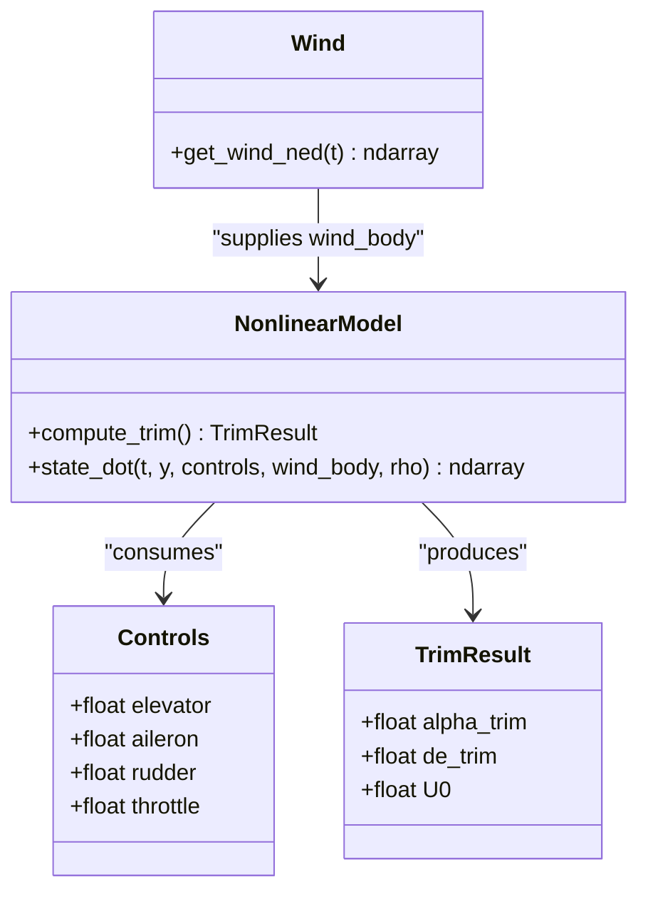

**Diagram sources**
- [nonlinear_model.py](file://src/dynamics/nonlinear_model.py#L104-L200)
- [wind_model.py](file://src/environment/wind_model.py#L76-L108)

**Section sources**
- [nonlinear_model.py](file://src/dynamics/nonlinear_model.py#L104-L200)
- [wind_model.py](file://src/environment/wind_model.py#L18-L113)

### State Management and Integration
StateHistory pre-allocates arrays for efficient recording; AircraftSimState encapsulates 12-D state plus derived quantities (alpha, beta, airspeed, altitude). Integrator provides a real-time step-wise ODE solver (Dopri5) suitable for closed-loop simulation.

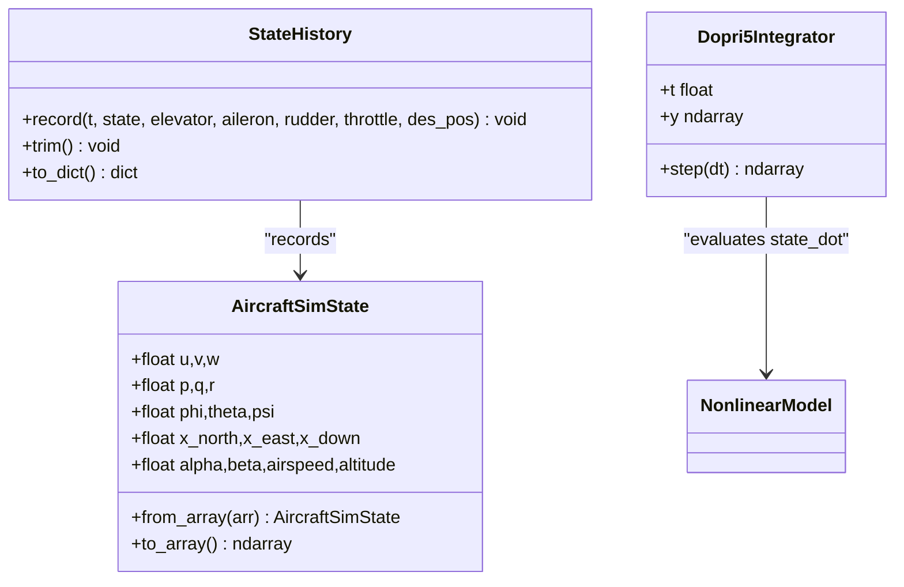

**Diagram sources**
- [state_manager.py](file://src/simulation/state_manager.py#L16-L193)
- [integrator.py](file://src/simulation/integrator.py#L17-L71)
- [nonlinear_model.py](file://src/dynamics/nonlinear_model.py#L160-L200)

**Section sources**
- [state_manager.py](file://src/simulation/state_manager.py#L16-L193)
- [integrator.py](file://src/simulation/integrator.py#L17-L108)

### Visualization
Visualization modules provide quick 2D and 3D views. The SimulationResult wrapper can trigger plotting and animation using the plotter and animator.

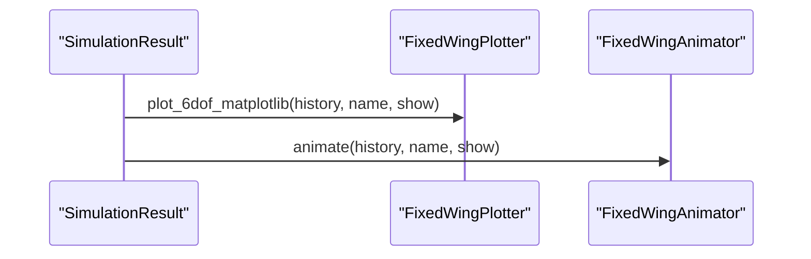

**Diagram sources**
- [simulator.py](file://src/simulation/simulator.py#L92-L109)
- [animator.py](file://src/visualization/animator.py#L25-L150)

**Section sources**
- [simulator.py](file://src/simulation/simulator.py#L59-L110)
- [animator.py](file://src/visualization/animator.py#L14-L150)

## Dependency Analysis
The FixedWingSimulator composes subsystems with clear boundaries:
- models depends on database and YAML
- dynamics depends on aerodynamics and math utilities
- control depends on flight mode manager and TECS
- planning depends on trajectory implementations
- simulation depends on integrator and state containers
- visualization depends on history data
- environment supplies wind to dynamics

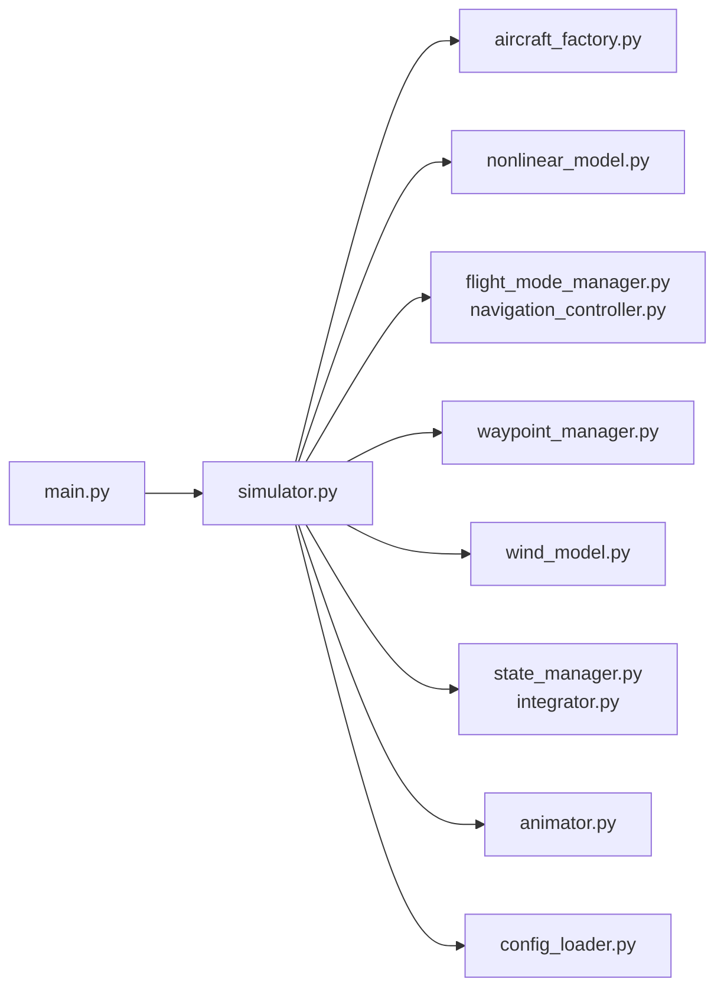

**Diagram sources**
- [main.py](file://main.py#L98-L144)
- [simulator.py](file://src/simulation/simulator.py#L33-L51)
- [aircraft_factory.py](file://src/models/aircraft_factory.py#L12-L12)
- [nonlinear_model.py](file://src/dynamics/nonlinear_model.py#L27-L28)
- [flight_mode_manager.py](file://src/control/flight_mode_manager.py#L41-L43)
- [navigation_controller.py](file://src/control/navigation_controller.py#L20-L21)
- [waypoint_manager.py](file://src/planning/waypoint_manager.py#L15-L17)
- [wind_model.py](file://src/environment/wind_model.py#L14-L15)
- [state_manager.py](file://src/simulation/state_manager.py#L9-L13)
- [integrator.py](file://src/simulation/integrator.py#L14-L14)
- [animator.py](file://src/visualization/animator.py#L10-L11)
- [config_loader.py](file://src/utils/config_loader.py#L7-L7)

**Section sources**
- [simulator.py](file://src/simulation/simulator.py#L33-L51)

## Performance Considerations
- Real-time closed-loop simulation uses an adaptive step ODE solver with a fixed-step interface, balancing accuracy and latency.
- StateHistory pre-allocates arrays to minimize memory churn during recording.
- Wind and atmospheric computations are lightweight; density is computed per step based on altitude.
- Trajectory caching avoids recomputation when waypoints are unchanged.
- Visualization is optional and offloaded to external libraries.

[No sources needed since this section provides general guidance]

## Troubleshooting Guide
Common issues and remedies:
- Integration failure: The integrator raises a runtime error when integration fails; check initial conditions, control saturation, and trim computation.
- Unknown aircraft: AircraftFactory validates against known names; ensure the aircraft exists in the database.
- Trajectory errors: WaypointManager requires at least two waypoints; otherwise a ValueError is raised.
- Wind type validation: Wind constructor validates supported types; incorrect values raise an error.
- Control parameter validation: ArduPilot parameters are validated; missing or invalid entries may require YAML configuration.

**Section sources**
- [simulator.py](file://src/simulation/simulator.py#L558-L562)
- [aircraft_factory.py](file://src/models/aircraft_factory.py#L140-L141)
- [waypoint_manager.py](file://src/planning/waypoint_manager.py#L139-L140)
- [wind_model.py](file://src/environment/wind_model.py#L40-L41)
- [integrator.py](file://src/simulation/integrator.py#L54-L56)

## Conclusion
The FixedWingSimulator employs a clean layered architecture with strong separation of concerns. The FixedWingSimulator orchestrates aircraft, environment, planning, control, dynamics, and visualization modules. Design patterns like factory and observer-like control flow enable modularity and extensibility. The system balances real-time performance with configurability and provides robust mechanisms for state management, integration, and visualization.

## Appendices

### System Context Diagram
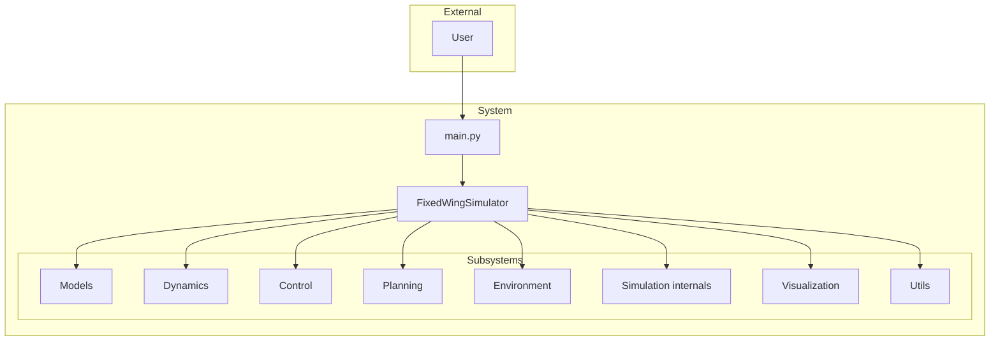

**Diagram sources**
- [main.py](file://main.py#L98-L144)
- [simulator.py](file://src/simulation/simulator.py#L115-L642)