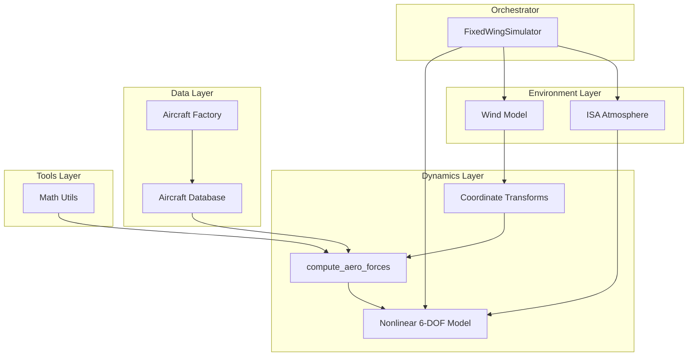
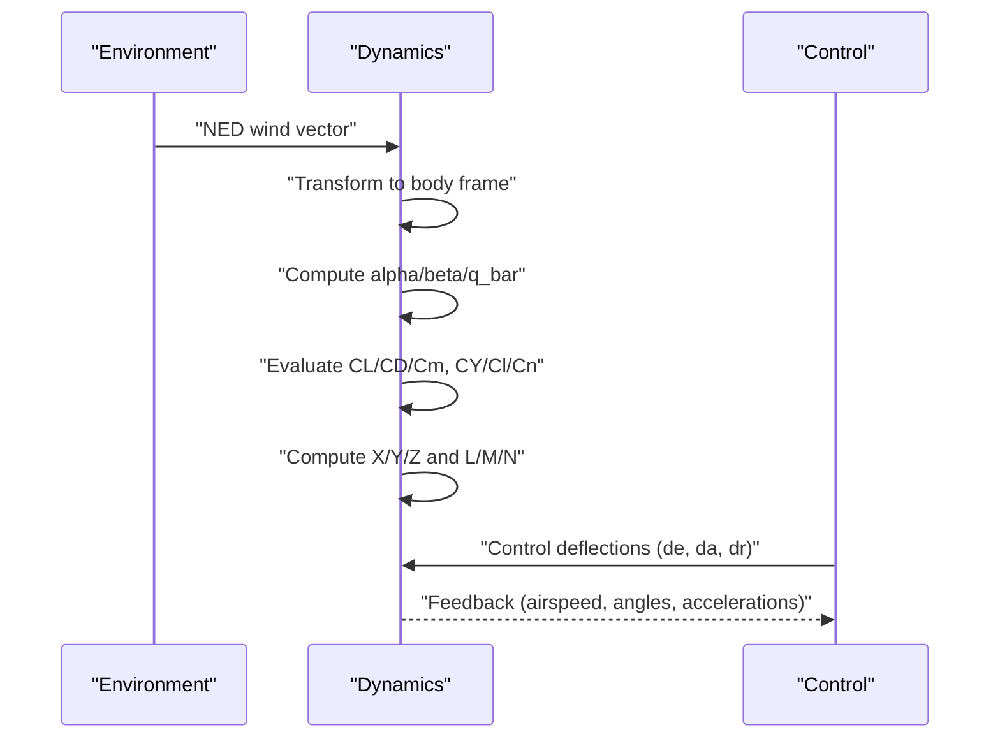
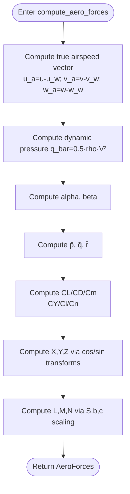
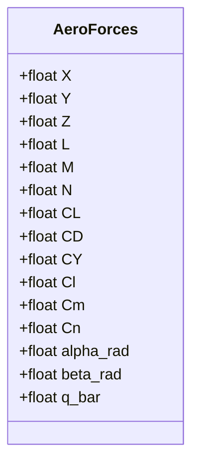
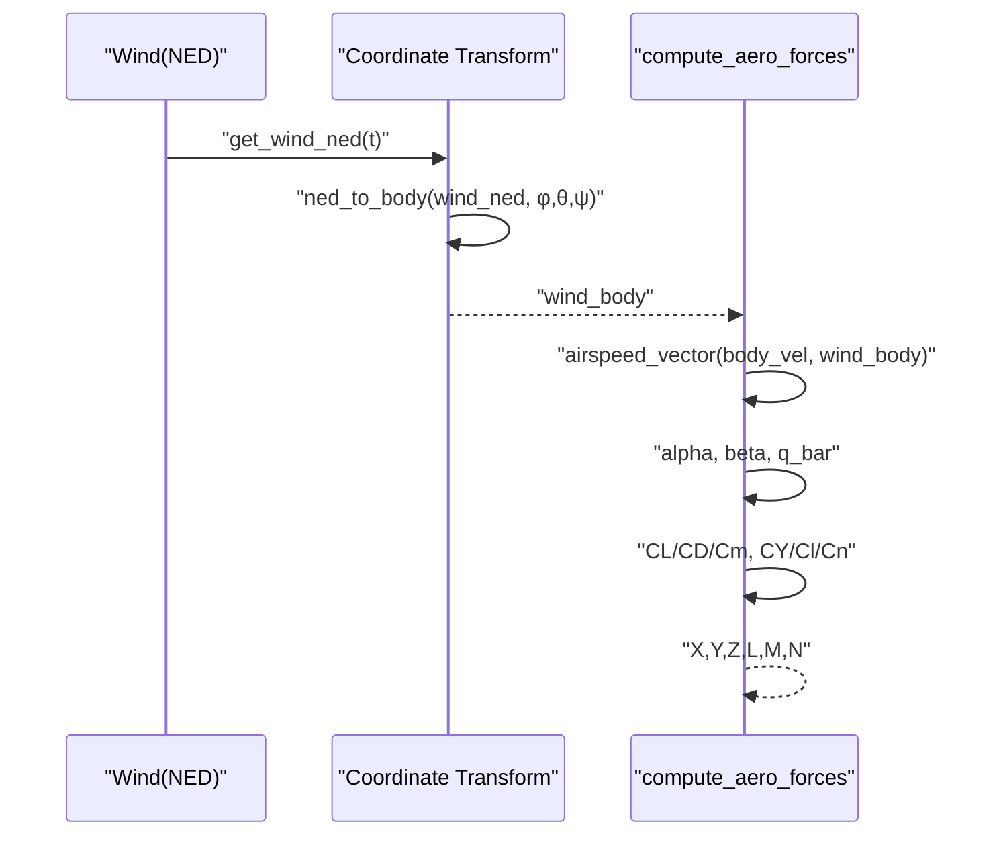
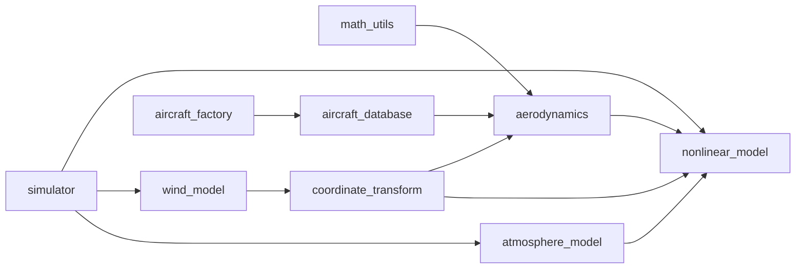

# Aerodynamic Force and Moment Calculations

<cite>
**Referenced Files in This Document**
- [aerodynamics.py](file://src/dynamics/aerodynamics.py)
- [aerodynamic_forces.py](file://src/environment/aerodynamic_forces.py)
- [coordinate_transform.py](file://src/dynamics/coordinate_transform.py)
- [math_utils.py](file://src/utils/math_utils.py)
- [aircraft_database.py](file://src/models/aircraft_database.py)
- [aircraft_factory.py](file://src/models/aircraft_factory.py)
- [aircraft.yaml](file://config/aircraft.yaml)
- [simulation.yaml](file://config/simulation.yaml)
- [atmosphere_model.py](file://src/environment/atmosphere_model.py)
- [wind_model.py](file://src/environment/wind_model.py)
- [nonlinear_model.py](file://src/dynamics/nonlinear_model.py)
- [simulator.py](file://src/simulation/simulator.py)
- [气动力学计算.md](file://doc/zh/content/环境系统/气动力计算.md)
- [气动力学原理.md](file://doc/zh/content/核心概念/气动力学原理.md)
</cite>

## Table of Contents
1. [Introduction](#introduction)
2. [Project Structure](#project-structure)
3. [Core Components](#core-components)
4. [Architecture Overview](#architecture-overview)
5. [Detailed Component Analysis](#detailed-component-analysis)
6. [Dependency Analysis](#dependency-analysis)
7. [Performance Considerations](#performance-considerations)
8. [Troubleshooting Guide](#troubleshooting-guide)
9. [Conclusion](#conclusion)
10. [Appendices](#appendices)

## Introduction
This document explains the aerodynamic force and moment calculation system used in the fixed-wing simulator. It covers:
- How lift, drag, and side forces are computed from airspeed, angle of attack, sideslip, and control surface deflections
- How rolling, pitching, and yawing moments are calculated, including contributions from control surfaces and non-dimensional angular rates
- The underlying models: polynomial fits in angle of attack and angular rates, and the use of reference area and geometry
- The relationship between wind frame and body frame forces, including transformation matrices and coordinate systems
- Dynamic pressure computation, and how air density varies with altitude via the ISA model
- The compute_aero_forces function interface, parameter requirements, and output data structures
- Practical examples for aerodynamic analysis, coefficient validation, and performance prediction

## Project Structure
The aerodynamic system is modular and integrates with environment modeling, dynamics, and control layers:
- Dynamics layer: aerodynamic computation, 6-DOF nonlinear equations
- Environment layer: wind models and ISA atmosphere
- Data layer: aircraft parameter database and factory
- Tools layer: math utilities for angles and dynamic pressure
- Examples and orchestrator: main simulation engine ties everything together

**Diagram sources**
- [wind_model.py](file://src/environment/wind_model.py#L18-L113)
- [atmosphere_model.py](file://src/environment/atmosphere_model.py#L48-L77)
- [coordinate_transform.py](file://src/dynamics/coordinate_transform.py#L39-L70)
- [aerodynamics.py](file://src/dynamics/aerodynamics.py#L35-L148)
- [nonlinear_model.py](file://src/dynamics/nonlinear_model.py#L160-L256)
- [aircraft_database.py](file://src/models/aircraft_database.py#L143-L166)
- [aircraft_factory.py](file://src/models/aircraft_factory.py#L42-L75)
- [math_utils.py](file://src/utils/math_utils.py#L107-L124)
- [simulator.py](file://src/simulation/simulator.py#L115-L200)

**Section sources**
- [simulator.py](file://src/simulation/simulator.py#L115-L200)
- [aircraft_database.py](file://src/models/aircraft_database.py#L143-L166)
- [aircraft_factory.py](file://src/models/aircraft_factory.py#L42-L75)
- [wind_model.py](file://src/environment/wind_model.py#L18-L113)
- [atmosphere_model.py](file://src/environment/atmosphere_model.py#L48-L77)
- [coordinate_transform.py](file://src/dynamics/coordinate_transform.py#L39-L70)
- [aerodynamics.py](file://src/dynamics/aerodynamics.py#L35-L148)
- [nonlinear_model.py](file://src/dynamics/nonlinear_model.py#L160-L256)
- [math_utils.py](file://src/utils/math_utils.py#L107-L124)

## Core Components
- AeroForces: a container storing body-axis forces (X, Y, Z) and moments (L, M, N), along with non-dimensional coefficients (CL, CD, CY, Cl, Cm, Cn), angles (alpha, beta), and dynamic pressure (q_bar).
- compute_aero_forces: the central function computing aerodynamic loads from body velocities, angular rates, control deflections, aircraft parameters, optional wind in body frame, and air density.
- Math utilities: angle_of_attack, sideslip_angle, dynamic_pressure.
- Aircraft database and factory: provide geometric and aerodynamic coefficients and derive U0, rho, q_bar.
- Wind and atmosphere: wind vectors transformed to body frame and density computed via ISA.
- Nonlinear 6-DOF model: integrates aerodynamic forces and moments into the equations of motion.

**Section sources**
- [aerodynamics.py](file://src/dynamics/aerodynamics.py#L19-L148)
- [math_utils.py](file://src/utils/math_utils.py#L107-L124)
- [aircraft_database.py](file://src/models/aircraft_database.py#L143-L166)
- [aircraft_factory.py](file://src/models/aircraft_factory.py#L42-L75)
- [wind_model.py](file://src/environment/wind_model.py#L18-L113)
- [atmosphere_model.py](file://src/environment/atmosphere_model.py#L48-L77)
- [nonlinear_model.py](file://src/dynamics/nonlinear_model.py#L160-L256)

## Architecture Overview
The aerodynamic pipeline connects environment, dynamics, and control layers:
- Environment provides wind (NED→body) and density via ISA
- Dynamics computes true airspeed, angles, dynamic pressure, and aerodynamic coefficients
- Forces and moments are computed in body frame and integrated into 6-DOF motion
- Control layer feeds control deflections and targets, closing the loop

**Diagram sources**
- [coordinate_transform.py](file://src/dynamics/coordinate_transform.py#L39-L70)
- [aerodynamics.py](file://src/dynamics/aerodynamics.py#L35-L148)
- [nonlinear_model.py](file://src/dynamics/nonlinear_model.py#L160-L256)

## Detailed Component Analysis

### compute_aero_forces: Function Interface and Processing Logic
- Purpose: Compute aerodynamic forces and moments in the body frame given current flight state and control inputs.
- Inputs:
  - Body-frame velocity: u, v, w (m/s)
  - Body-frame angular rates: p, q, r (rad/s)
  - Control deflections: elevator de, aileron da, rudder dr (rad)
  - Aircraft parameters: dictionary containing geometry (S, c, b) and aerodynamic coefficients (CL_0, CL_alpha, CL_q, CL_deltae, etc.), plus derived U0, rho, q_bar
  - Optional wind in body frame: wind_body (m/s)
  - Air density: rho (kg/m³)
- Outputs:
  - AeroForces object with:
    - Body-axis forces: X, Y, Z (N)
    - Body-axis moments: L, M, N (N·m)
    - Non-dimensional coefficients: CL, CD, CY, Cl, Cm, Cn
    - Angles: alpha_rad, beta_rad (rad)
    - Dynamic pressure: q_bar (Pa)

Processing steps:
1) Compute true airspeed vector by subtracting wind_body from body velocity if wind_body is provided; otherwise use body velocity.
2) Compute dynamic pressure q_bar = 0.5 · rho · V².
3) Compute angle of attack alpha and sideslip angle beta.
4) Compute non-dimensional angular rates:
   - p_hat = p · b / (2 · U0)
   - q_hat = q · c / (2 · U0)
   - r_hat = r · b / (2 · U0)
5) Evaluate longitudinal coefficients:
   - CL = CL_0 + CL_alpha · α + CL_q · q_hat + CL_deltae · δe
   - CD = CD_0 + CD_alpha · α + CD_q · q_hat + CD_deltae · δe
   - Cm = Cm_0 + Cm_alpha · α + Cm_q · q_hat + Cm_deltae · δe
6) Evaluate lateral-directional coefficients:
   - CY = CYβ · β + CYp · p_hat + CYr · r_hat + CYda · δa + CYdr · δr
   - Cl = Clβ · β + Clp · p_hat + Clr · r_hat + Clda · δa + Cldr · δr
   - Cn = Cnβ · β + Cnp · p_hat + Cnr · r_hat + Cnda · δa + Cndr · δr
7) Compute forces and moments:
   - X = q_bar · S · (-CD · cos α + CL · sin α)
   - Y = q_bar · S · CY
   - Z = q_bar · S · (-CL · cos α - CD · sin α)
   - L = q_bar · S · b · Cl
   - M = q_bar · S · c · Cm
   - N = q_bar · S · b · Cn

**Diagram sources**
- [aerodynamics.py](file://src/dynamics/aerodynamics.py#L68-L147)
- [math_utils.py](file://src/utils/math_utils.py#L107-L124)

**Section sources**
- [aerodynamics.py](file://src/dynamics/aerodynamics.py#L35-L148)
- [math_utils.py](file://src/utils/math_utils.py#L107-L124)

### AeroForces Data Structure
- Fields:
  - Body-axis forces: X, Y, Z (N)
  - Body-axis moments: L, M, N (N·m)
  - Non-dimensional coefficients: CL, CD, CY, Cl, Cm, Cn
  - Angles: alpha_rad, beta_rad (rad)
  - Dynamic pressure: q_bar (Pa)
- Purpose: Unified container for aerodynamic outputs used by the nonlinear model and control feedback.

**Diagram sources**
- [aerodynamics.py](file://src/dynamics/aerodynamics.py#L19-L33)

**Section sources**
- [aerodynamics.py](file://src/dynamics/aerodynamics.py#L19-L33)

### Wind Frame and Body Frame Forces: Transformations and Coordinate Systems
- Wind vector conversion:
  - From NED to body frame using ned_to_body with 3-2-1 Euler angles (φ, θ, ψ)
  - wind_body = R^T @ wind_ned
- True airspeed vector:
  - V_air = V_body − wind_body
- Angle definitions:
  - alpha = atan2(w_air, u_air)
  - beta = arcsin(v_air / V_air), with numerical clamp for small V_air
- Force decomposition:
  - In wind axes: X is drag, Z is lift-like contribution; Y is side force
  - In body axes: forces computed via cos/sin of alpha; moments via dimensionalization with S, c, b

**Diagram sources**
- [coordinate_transform.py](file://src/dynamics/coordinate_transform.py#L39-L70)
- [aerodynamics.py](file://src/dynamics/aerodynamics.py#L68-L83)
- [math_utils.py](file://src/utils/math_utils.py#L107-L118)

**Section sources**
- [coordinate_transform.py](file://src/dynamics/coordinate_transform.py#L39-L70)
- [aerodynamics.py](file://src/dynamics/aerodynamics.py#L68-L83)
- [math_utils.py](file://src/utils/math_utils.py#L107-L118)

### Dynamic Pressure, Density, and Mach Number Dependencies
- Dynamic pressure: q_bar = 0.5 · rho · V²
- Air density: computed via ISA model from altitude; used in q_bar
- Mach and reference speed:
  - U0 = Mach × speed_of_sound(T)
  - Derived parameters injected into aircraft params: U0, rho (sea-level), q_bar
- These quantities directly scale forces and moments computed by compute_aero_forces.

**Section sources**
- [math_utils.py](file://src/utils/math_utils.py#L121-L124)
- [atmosphere_model.py](file://src/environment/atmosphere_model.py#L48-L77)
- [aircraft_database.py](file://src/models/aircraft_database.py#L159-L166)

### Aircraft Parameter Database and Factory
- Database entries include:
  - Geometry: mass, S, c, b, inertia terms
  - Aerodynamic coefficients: CL_0, CL_alpha, CL_q, CL_deltae, CD_0, CD_alpha, Cm_0, Cm_alpha, Cm_q, Cm_deltae, CYβ, Clβ, Clr, Cnβ, Cnp, Cnr, plus control derivatives
  - Derived: Mach, U0, rho, q_bar
- Factory merges database defaults with optional YAML overrides and parameter overrides.

**Section sources**
- [aircraft_database.py](file://src/models/aircraft_database.py#L29-L166)
- [aircraft_factory.py](file://src/models/aircraft_factory.py#L42-L75)
- [aircraft.yaml](file://config/aircraft.yaml#L1-L13)

### Additional Wind-Induced Drag (Incremental Forces)
- compute_wind_drag_forces estimates incremental body-axis drag due to relative wind:
  - ΔF = −0.5 · rho · S · CD0 · |v_rel| · unit(v_rel)
  - Used for perturbation/sensitivity analysis beyond baseline aerodynamics

**Section sources**
- [aerodynamic_forces.py](file://src/environment/aerodynamic_forces.py#L13-L54)

### Relationship Between Wind Frame and Body Frame Forces
- The code explicitly uses the wind-axis to body-axis transformation via cos/sin of alpha to compute X, Y, Z.
- Moments are scaled by reference area and geometry (S, c, b) to yield L, M, N.

**Section sources**
- [aerodynamics.py](file://src/dynamics/aerodynamics.py#L130-L146)

### Non-Dimensional Angular Rates and Control Surface Contributions
- Non-dimensional rates:
  - p̄ = p · b / (2 · U0)
  - q̄ = q · c / (2 · U0)
  - r̄ = r · b / (2 · U0)
- Longitudinal and lateral-directional coefficients depend linearly on α, β, p̄, q̄, r̄, and control deflections.

**Section sources**
- [aerodynamics.py](file://src/dynamics/aerodynamics.py#L85-L124)

### Integration Into Nonlinear 6-DOF Model
- The nonlinear model calls compute_aero_forces and combines aerodynamic forces with thrust and gravity to integrate motion.
- Wind body frame inputs are supported to reflect environmental effects.

**Section sources**
- [nonlinear_model.py](file://src/dynamics/nonlinear_model.py#L160-L256)
- [simulator.py](file://src/simulation/simulator.py#L115-L200)

## Dependency Analysis

**Diagram sources**
- [math_utils.py](file://src/utils/math_utils.py#L107-L124)
- [coordinate_transform.py](file://src/dynamics/coordinate_transform.py#L39-L70)
- [aerodynamics.py](file://src/dynamics/aerodynamics.py#L35-L148)
- [nonlinear_model.py](file://src/dynamics/nonlinear_model.py#L160-L256)
- [wind_model.py](file://src/environment/wind_model.py#L18-L113)
- [atmosphere_model.py](file://src/environment/atmosphere_model.py#L48-L77)
- [aircraft_database.py](file://src/models/aircraft_database.py#L143-L166)
- [aircraft_factory.py](file://src/models/aircraft_factory.py#L42-L75)
- [simulator.py](file://src/simulation/simulator.py#L115-L200)

**Section sources**
- [aerodynamics.py](file://src/dynamics/aerodynamics.py#L35-L148)
- [nonlinear_model.py](file://src/dynamics/nonlinear_model.py#L160-L256)
- [aircraft_database.py](file://src/models/aircraft_database.py#L143-L166)
- [aircraft_factory.py](file://src/models/aircraft_factory.py#L42-L75)
- [wind_model.py](file://src/environment/wind_model.py#L18-L113)
- [atmosphere_model.py](file://src/environment/atmosphere_model.py#L48-L77)
- [coordinate_transform.py](file://src/dynamics/coordinate_transform.py#L39-L70)
- [simulator.py](file://src/simulation/simulator.py#L115-L200)

## Performance Considerations
- Complexity: compute_aero_forces is O(1) with a few trigonometric operations and arithmetic.
- Stability:
  - Small-airspeed clamps prevent division-like instabilities.
  - Normalized angular rates mitigate large-number artifacts.
  - Wind-induced drag threshold avoids noise amplification.
- Real-time suitability: low computational cost makes it suitable for real-time simulation loops.

**Section sources**
- [aerodynamics.py](file://src/dynamics/aerodynamics.py#L68-L77)
- [aerodynamic_forces.py](file://src/environment/aerodynamic_forces.py#L42-L43)
- [math_utils.py](file://src/utils/math_utils.py#L107-L118)

## Troubleshooting Guide
- Zero or near-zero airspeed:
  - Verify wind_body and body velocity alignment; check wind model type and direction.
- Unexpected forces or moments:
  - Confirm control deflection units (radians) and magnitudes.
  - Validate that aircraft parameters include derived fields (U0, rho, q_bar).
- Incorrect angles:
  - Ensure alpha and beta are computed from correct components and that arcsin/arctan2 inputs are valid.
- Density-related discrepancies:
  - Confirm altitude sign convention and ISA density computation.

**Section sources**
- [aerodynamics.py](file://src/dynamics/aerodynamics.py#L68-L83)
- [aircraft_database.py](file://src/models/aircraft_database.py#L159-L166)
- [atmosphere_model.py](file://src/environment/atmosphere_model.py#L48-L77)
- [wind_model.py](file://src/environment/wind_model.py#L76-L108)

## Conclusion
The aerodynamic system implements a robust, modular pipeline for computing forces and moments in body coordinates. It leverages accurate angle definitions, dynamic pressure, and linearized aerodynamic models with explicit control surface and angular-rate dependencies. The integration with wind and atmosphere enables realistic environmental effects, while the 6-DOF nonlinear model closes the simulation loop. Extensions can incorporate nonlinear lift, stall, and advanced viscous effects without disrupting the existing framework.

## Appendices

### Function Interface Summary: compute_aero_forces
- Inputs:
  - u, v, w: body-frame velocity (m/s)
  - p, q, r: body-frame angular rates (rad/s)
  - de, da, dr: control deflections (rad)
  - params: aircraft parameter dictionary (geometry + coefficients + derived)
  - wind_body: optional wind in body frame (m/s)
  - rho: air density (kg/m³)
- Output:
  - AeroForces with X, Y, Z, L, M, N, CL, CD, CY, Cl, Cm, Cn, alpha_rad, beta_rad, q_bar

**Section sources**
- [aerodynamics.py](file://src/dynamics/aerodynamics.py#L35-L148)

### Example Workflows
- Aerodynamic analysis:
  - Sweep angles of attack and control deflections to tabulate CL, CD, Cm curves.
  - Compare against database coefficients to validate linear model assumptions.
- Coefficient validation:
  - Use compute_wind_drag_forces to estimate incremental drag under various wind conditions; compare with measured or CFD data.
- Performance prediction:
  - Compute steady-state trim using nonlinear model with aerodynamic forces; predict climb rate, turn radius, and stall margin.

**Section sources**
- [aerodynamic_forces.py](file://src/environment/aerodynamic_forces.py#L13-L54)
- [nonlinear_model.py](file://src/dynamics/nonlinear_model.py#L160-L256)
- [气动力学原理.md](file://doc/zh/content/核心概念/气动力学原理.md#L320-L342)