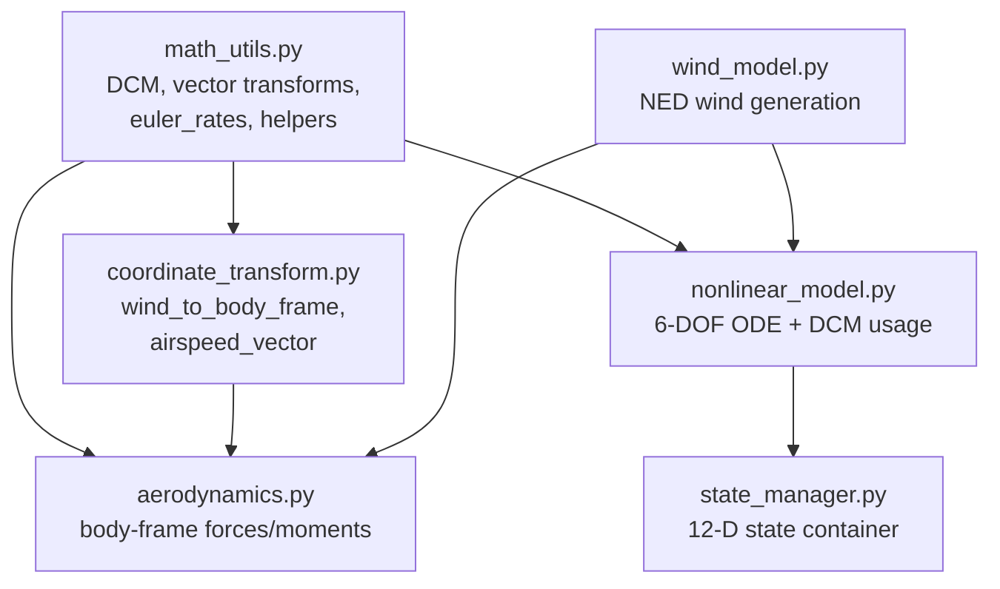
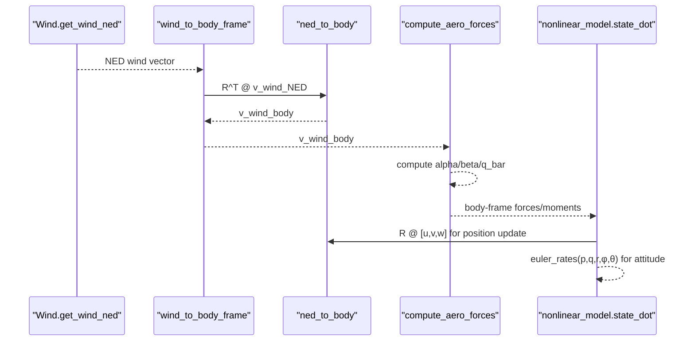
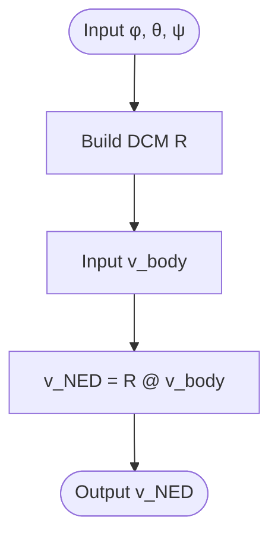
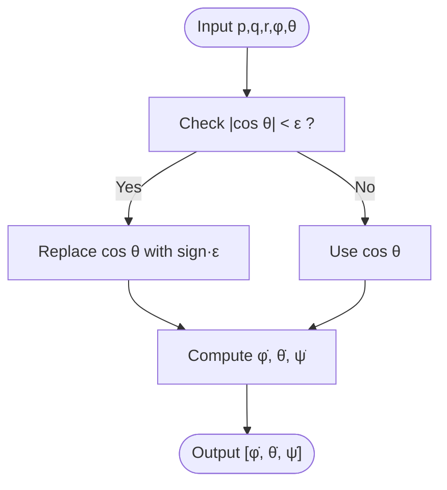
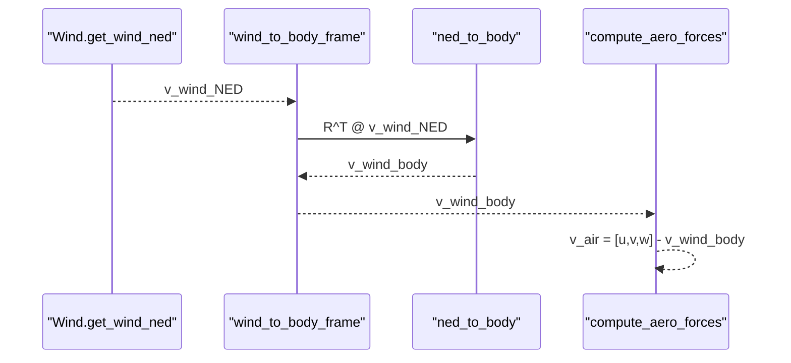
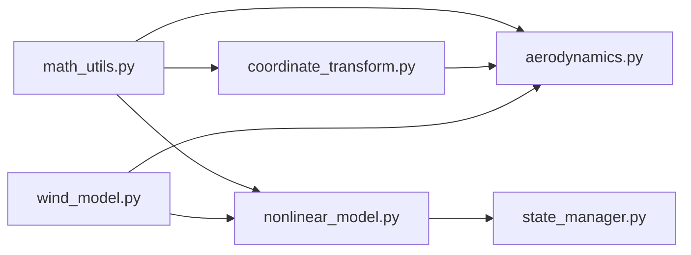

# Coordinate System Transformations

<cite>
**Referenced Files in This Document**
- [coordinate_transform.py](file://src/dynamics/coordinate_transform.py)
- [math_utils.py](file://src/utils/math_utils.py)
- [aerodynamics.py](file://src/dynamics/aerodynamics.py)
- [nonlinear_model.py](file://src/dynamics/nonlinear_model.py)
- [wind_model.py](file://src/environment/wind_model.py)
- [state_manager.py](file://src/simulation/state_manager.py)
- [test_dynamics.py](file://tests/test_dynamics.py)
- [坐标系与变换.md](file://doc/zh/content/核心概念/坐标系与变换.md)
- [坐标系转换.md](file://doc/zh/content/动力学系统/坐标系转换.md)
</cite>

## Table of Contents
1. [Introduction](#introduction)
2. [Project Structure](#project-structure)
3. [Core Components](#core-components)
4. [Architecture Overview](#architecture-overview)
5. [Detailed Component Analysis](#detailed-component-analysis)
6. [Dependency Analysis](#dependency-analysis)
7. [Performance Considerations](#performance-considerations)
8. [Troubleshooting Guide](#troubleshooting-guide)
9. [Conclusion](#conclusion)
10. [Appendices](#appendices)

## Introduction
This document explains the coordinate system transformation utilities used throughout the flight dynamics system. It covers the reference frames (NED inertial, body-fixed, wind, and stability-like velocity coordinates), Euler angle representations (3-2-1 sequence), direction cosine matrices (DCMs), and the conversion between angular parameterizations. It also documents the euler_rates function for transforming angular rates between body and Euler-angle rates, and provides practical examples of velocity transformations, force conversions, and attitude representations. Numerical considerations and common pitfalls are addressed to ensure robust simulations.

## Project Structure
The coordinate transformation logic is primarily implemented in two modules:
- math_utils: Provides rotation matrices, vector transforms, and Euler-rate mapping.
- coordinate_transform: Exposes higher-level convenience functions for wind-to-body conversion and airspeed vector calculation.

These utilities are consumed by:
- aerodynamics: Computes aerodynamic forces/moments in the body frame using airspeed-derived angles.
- nonlinear_model: Integrates the 6-DOF equations, applying DCMs for position updates and Euler-rate mapping for attitude evolution.
- wind_model: Generates NED wind vectors for environmental effects.
- state_manager: Holds the 12-D state (body velocities, angular rates, Euler angles, NED positions) and derived quantities.

**Diagram sources**
- [math_utils.py](file://src/utils/math_utils.py#L43-L101)
- [coordinate_transform.py](file://src/dynamics/coordinate_transform.py#L29-L70)
- [wind_model.py](file://src/environment/wind_model.py#L76-L108)
- [aerodynamics.py](file://src/dynamics/aerodynamics.py#L35-L148)
- [nonlinear_model.py](file://src/dynamics/nonlinear_model.py#L240-L281)
- [state_manager.py](file://src/simulation/state_manager.py#L16-L93)

**Section sources**
- [math_utils.py](file://src/utils/math_utils.py#L1-L124)
- [coordinate_transform.py](file://src/dynamics/coordinate_transform.py#L1-L70)
- [wind_model.py](file://src/environment/wind_model.py#L70-L113)
- [aerodynamics.py](file://src/dynamics/aerodynamics.py#L1-L148)
- [nonlinear_model.py](file://src/dynamics/nonlinear_model.py#L240-L386)
- [state_manager.py](file://src/simulation/state_manager.py#L1-L193)

## Core Components
- Direction cosine matrix (DCM) from 3-2-1 Euler angles (roll φ, pitch θ, yaw ψ), mapping body vectors to NED.
- Vector transforms: body_to_ned and ned_to_body using the DCM and its transpose.
- Euler-angle rates mapping from body angular rates (p, q, r) to [φ̇, θ̇, ψ̇], with numerical protection near singularities.
- Wind-to-body conversion: transform NED wind vectors to the body frame using ned_to_body.
- Airspeed vector: true airspeed computed as body velocity minus body-frame wind velocity.

Key properties verified by tests:
- Identity at zero Euler angles.
- Orthogonality (R·R^T ≈ I).
- Determinant equals +1.
- Round-trip transform closure.
- Zero-wind airspeed equals body velocity.
- Euler rates reduce to body rates at zero φ and θ.

**Section sources**
- [math_utils.py](file://src/utils/math_utils.py#L43-L101)
- [coordinate_transform.py](file://src/dynamics/coordinate_transform.py#L29-L70)
- [test_dynamics.py](file://tests/test_dynamics.py#L67-L113)

## Architecture Overview
The coordinate transformation pipeline integrates wind modeling, airspeed computation, and 6-DOF dynamics:
- Wind_model generates NED wind vectors.
- coordinate_transform converts NED wind to body frame.
- aerodynamics computes angles and forces in the body frame using airspeed.
- nonlinear_model integrates dynamics, mapping body accelerations to NED for position updates and using euler_rates for attitude evolution.

**Diagram sources**
- [wind_model.py](file://src/environment/wind_model.py#L76-L108)
- [coordinate_transform.py](file://src/dynamics/coordinate_transform.py#L39-L53)
- [math_utils.py](file://src/utils/math_utils.py#L74-L76)
- [aerodynamics.py](file://src/dynamics/aerodynamics.py#L68-L84)
- [nonlinear_model.py](file://src/dynamics/nonlinear_model.py#L240-L281)

## Detailed Component Analysis

### Reference Frames and Conventions
- NED (North-East-Down): Earth-fixed inertial frame used for geographic position and navigation.
- Body frame: Right-handed frame attached to the aircraft, with x forward, y right, z down.
- Velocity coordinate concept: True airspeed is defined relative to the airflow; the code computes it as body velocity minus body-frame wind velocity.
- Euler angles (3-2-1): φ (roll about x), θ (pitch about y), ψ (yaw about z). The DCM maps body vectors to NED.

Practical implications:
- Navigation and position updates use NED; aerodynamic computations are performed in the body frame.
- Wind effects are modeled in NED and transformed to body for airspeed computation.

**Section sources**
- [coordinate_transform.py](file://src/dynamics/coordinate_transform.py#L1-L8)
- [aerodynamics.py](file://src/dynamics/aerodynamics.py#L44-L56)
- [nonlinear_model.py](file://src/dynamics/nonlinear_model.py#L246-L248)

### Direction Cosine Matrices and Vector Transforms
- DCM construction: rotation_matrix_321 returns R such that v_NED = R @ v_body.
- Inverse transform: ned_to_body uses R^T to convert from NED to body.
- Convenience aliases: dcm_from_euler is an alias for rotation_matrix_321.

Verification:
- Tests confirm identity at zero angles, orthogonality, determinant = +1, and round-trip closure.

**Diagram sources**
- [math_utils.py](file://src/utils/math_utils.py#L43-L76)
- [coordinate_transform.py](file://src/dynamics/coordinate_transform.py#L29-L70)

**Section sources**
- [math_utils.py](file://src/utils/math_utils.py#L43-L76)
- [coordinate_transform.py](file://src/dynamics/coordinate_transform.py#L29-L70)
- [test_dynamics.py](file://tests/test_dynamics.py#L69-L92)

### Euler Angles and Rotation Matrices
- Convention: 3-2-1 Euler sequence (Z-Y-X) with angles φ, θ, ψ.
- Matrix entries are explicit functions of cosines and sines of φ, θ, ψ.
- Properties:
  - Orthogonal: R·R^T = I
  - Proper rotation: det(R) = +1
  - Inverse: R^{-1} = R^T

Derivation outline:
- The DCM is constructed by composing three elemental rotations in the order Z (ψ), Y (θ), X (φ).
- The resulting matrix entries are trigonometric combinations as implemented.

**Section sources**
- [math_utils.py](file://src/utils/math_utils.py#L43-L66)

### Euler Rate Mapping: Body Rates to Euler-Angle Rates
- Purpose: Convert body angular rates (p, q, r) to time derivatives of Euler angles [φ̇, θ̇, ψ̇].
- Formulae:
  - φ̇ = p + (sin φ · tan θ) q + (cos φ · tan θ) r
  - θ̇ = cos φ · q − sin φ · r
  - ψ̇ = (sin φ / cos θ) q + (cos φ / cos θ) r
- Singularity protection: When |cos θ| < ε, replace cos θ with sign(cos θ) · ε to avoid division by zero.

Numerical stability:
- Near θ = ±90°, the mapping becomes ill-conditioned; the ε-clamping prevents NaN or large spikes.
- Tests verify that at φ = θ = 0, Euler rates equal body rates.

**Diagram sources**
- [math_utils.py](file://src/utils/math_utils.py#L79-L100)
- [test_dynamics.py](file://tests/test_dynamics.py#L107-L113)

**Section sources**
- [math_utils.py](file://src/utils/math_utils.py#L79-L100)
- [test_dynamics.py](file://tests/test_dynamics.py#L107-L113)

### Wind-to-Body Transformation and Airspeed Vector
- Wind modeling: Wind.get_wind_ned returns NED wind vectors for different wind types (NONE, FIXED, SINE, RANDOMSINE).
- Wind-to-body conversion: wind_to_body_frame uses ned_to_body to transform NED wind to body frame.
- Airspeed vector: airspeed_vector = vel_body − wind_body, used for computing α and β.

Validation:
- Tests confirm that at zero Euler angles, NED wind equals body wind.
- With zero wind, airspeed vector equals body velocity.

**Diagram sources**
- [wind_model.py](file://src/environment/wind_model.py#L76-L108)
- [coordinate_transform.py](file://src/dynamics/coordinate_transform.py#L39-L53)
- [math_utils.py](file://src/utils/math_utils.py#L74-L76)
- [aerodynamics.py](file://src/dynamics/aerodynamics.py#L68-L76)

**Section sources**
- [wind_model.py](file://src/environment/wind_model.py#L76-L108)
- [coordinate_transform.py](file://src/dynamics/coordinate_transform.py#L39-L70)
- [aerodynamics.py](file://src/dynamics/aerodynamics.py#L68-L84)
- [test_dynamics.py](file://tests/test_dynamics.py#L94-L105)

### Practical Applications in Flight Mechanics
- Velocity transformations:
  - Body-to-NED: Used for position updates in the 6-DOF model.
  - NED-to-body: Used to convert environmental vectors (e.g., wind) into the body frame for airspeed computation.
- Force conversions:
  - Aerodynamic forces and moments are computed in the body frame; they are used directly in the equations of motion.
- Attitude representations:
  - Euler angles evolve via euler_rates from body rates, enabling attitude tracking and control applications.

Integration points:
- nonlinear_model applies DCM for position updates and euler_rates for attitude evolution.
- state_manager stores the 12-D state (u, v, w, p, q, r, φ, θ, ψ, x_N, x_E, x_D) and derived quantities (α, β, airspeed, altitude).

**Section sources**
- [nonlinear_model.py](file://src/dynamics/nonlinear_model.py#L240-L255)
- [state_manager.py](file://src/simulation/state_manager.py#L16-L93)

## Dependency Analysis
- math_utils is a foundational module providing DCMs, vector transforms, and Euler-rate mapping.
- coordinate_transform depends on math_utils and exposes higher-level functions for wind and airspeed.
- aerodynamics relies on math_utils for α, β, and q_bar, and uses wind_body for airspeed computation.
- nonlinear_model uses DCMs and euler_rates for state evolution and integrates the ODE.
- wind_model is independent but feeds into aerodynamics and nonlinear_model via coordinate_transform.

**Diagram sources**
- [math_utils.py](file://src/utils/math_utils.py#L1-L124)
- [coordinate_transform.py](file://src/dynamics/coordinate_transform.py#L1-L70)
- [wind_model.py](file://src/environment/wind_model.py#L1-L113)
- [aerodynamics.py](file://src/dynamics/aerodynamics.py#L1-L148)
- [nonlinear_model.py](file://src/dynamics/nonlinear_model.py#L1-L386)
- [state_manager.py](file://src/simulation/state_manager.py#L1-L193)

**Section sources**
- [math_utils.py](file://src/utils/math_utils.py#L1-L124)
- [coordinate_transform.py](file://src/dynamics/coordinate_transform.py#L1-L70)
- [wind_model.py](file://src/environment/wind_model.py#L1-L113)
- [aerodynamics.py](file://src/dynamics/aerodynamics.py#L1-L148)
- [nonlinear_model.py](file://src/dynamics/nonlinear_model.py#L1-L386)
- [state_manager.py](file://src/simulation/state_manager.py#L1-L193)

## Performance Considerations
- Computational cost: DCM construction and trigonometric evaluations are O(1); negligible overhead compared to aerodynamic computations.
- Numerical stability: Euler-rate mapping includes ε-protection near θ = ±90°; sideslip angle clamps v/V to avoid NaN.
- Efficiency tips:
  - Precompute and reuse wind NED unit vectors for fixed wind types.
  - Cache dynamic pressure q_bar when evaluating multiple aerodynamic functions.
  - Minimize repeated trigonometric calls by reusing intermediate values in tight loops.
- Coordinate choice impact:
  - Body frame is preferred for aerodynamic computations due to conventional sign conventions.
  - NED is used for navigation and visualization; DCM cost is low and acceptable.

**Section sources**
- [math_utils.py](file://src/utils/math_utils.py#L79-L101)
- [aerodynamics.py](file://src/dynamics/aerodynamics.py#L112-L118)
- [coordinate_transform.py](file://src/dynamics/coordinate_transform.py#L39-L70)

## Troubleshooting Guide
- Euler-angle singularity:
  - Symptom: Instability or divergence near θ ≈ ±90°.
  - Action: Verify euler_rates protection is active; consider adjusting control inputs or switching to quaternion-based representations if needed.
- Side slip anomalies:
  - Symptom: NaN or jumps in β.
  - Action: Ensure airspeed is bounded away from zero; verify wind_body is correctly computed; check that v_a is within [-airspeed, airspeed].
- Wind inconsistency:
  - Symptom: Unexpected wind direction.
  - Action: Confirm Wind type and orientation match NED convention; verify angle conversions and sign conventions.
- State divergence:
  - Symptom: Simulation blow-up.
  - Action: Inspect control amplitudes, air density profile, aerodynamic coefficients, and integration tolerances.

**Section sources**
- [math_utils.py](file://src/utils/math_utils.py#L79-L101)
- [aerodynamics.py](file://src/dynamics/aerodynamics.py#L112-L118)
- [wind_model.py](file://src/environment/wind_model.py#L50-L56)
- [nonlinear_model.py](file://src/dynamics/nonlinear_model.py#L160-L200)

## Conclusion
The coordinate transformation utilities in this project provide a robust foundation for fixed-wing flight dynamics:
- NED/body conversions via DCMs with proven orthogonality and determinant properties.
- Euler-angle rates mapping with numerical safeguards against singularities.
- Seamless integration of wind modeling, airspeed computation, and 6-DOF dynamics.
Adhering to the documented conventions and numerical practices ensures reliable simulations and clear separation of concerns across modules.

## Appendices

### Mathematical Derivations and Properties
- DCM definition: v_NED = R(φ, θ, ψ) @ v_body, with R orthogonal and det(R) = +1.
- Inverse mapping: v_body = R^T @ v_NED.
- Euler-rate mapping:
  - φ̇ = p + (sin φ · tan θ) q + (cos φ · tan θ) r
  - θ̇ = cos φ · q − sin φ · r
  - ψ̇ = (sin φ / cos θ) q + (cos φ / cos θ) r
- Protection: Replace cos θ with sign(cos θ) · ε when |cos θ| < ε to avoid singularities.

**Section sources**
- [math_utils.py](file://src/utils/math_utils.py#L43-L100)

### Practical Examples
- Velocity transformations:
  - Body-to-NED: Apply DCM to [u, v, w] for position updates in NED.
  - NED-to-body: Apply R^T to environmental vectors (e.g., wind) for airspeed computation.
- Force conversions:
  - Compute α and β from body velocity and wind; derive q_bar; evaluate aerodynamic coefficients; assemble body-frame forces and moments.
- Attitude representations:
  - Integrate φ, θ, ψ using euler_rates from body rates; wrap angles periodically if needed.

**Section sources**
- [nonlinear_model.py](file://src/dynamics/nonlinear_model.py#L240-L255)
- [aerodynamics.py](file://src/dynamics/aerodynamics.py#L68-L148)
- [state_manager.py](file://src/simulation/state_manager.py#L16-L93)