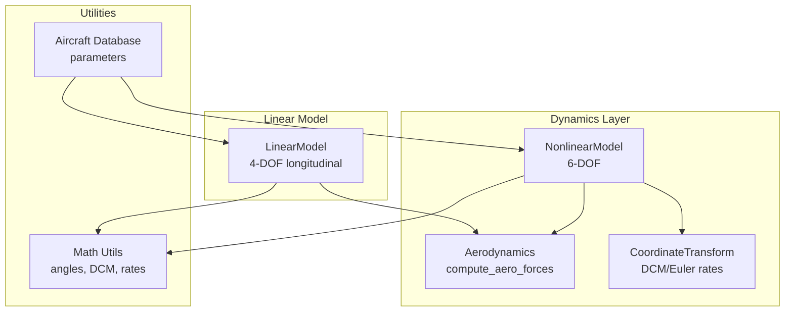
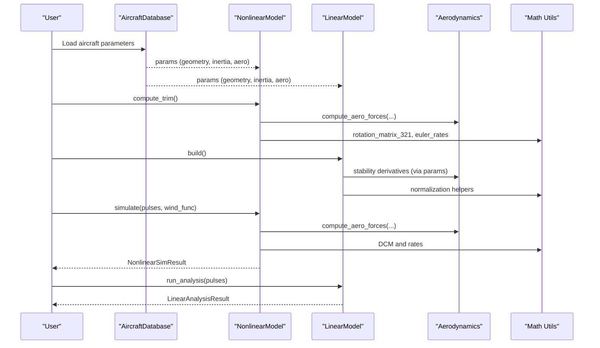
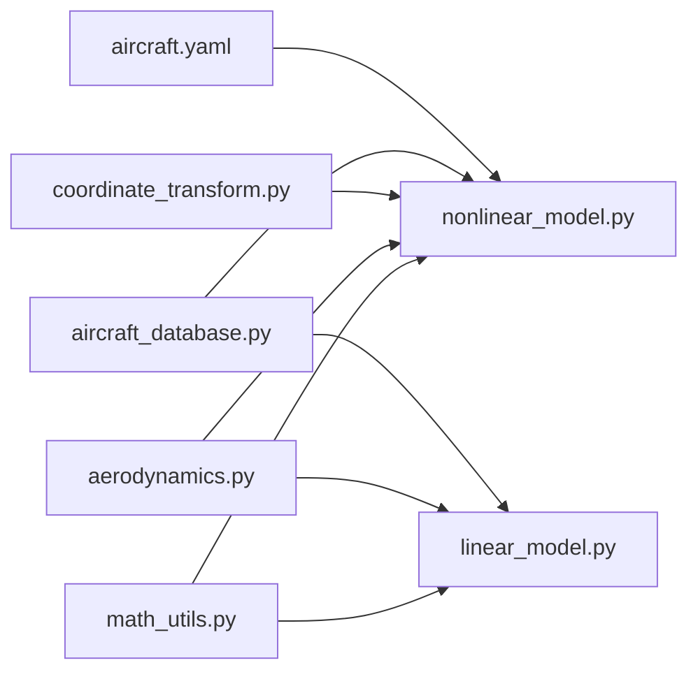

# Dynamics and Flight Mechanics

<cite>
**Referenced Files in This Document**
- [nonlinear_model.py](file://src/dynamics/nonlinear_model.py)
- [linear_model.py](file://src/dynamics/linear_model.py)
- [aerodynamics.py](file://src/dynamics/aerodynamics.py)
- [coordinate_transform.py](file://src/dynamics/coordinate_transform.py)
- [math_utils.py](file://src/utils/math_utils.py)
- [aircraft_database.py](file://src/models/aircraft_database.py)
- [aircraft.yaml](file://config/aircraft.yaml)
- [6自由度非线性动力学模型.md](file://doc/zh/content/动力学系统/6自由度非线性动力学模型.md)
- [4自由度线性化动力学模型.md](file://doc/zh/content/动力学系统/4自由度线性化动力学模型.md)
- [气动力学计算.md](file://doc/zh/content/动力学系统/气动力学计算.md)
- [坐标系转换.md](file://doc/zh/content/动力学系统/坐标系转换.md)
</cite>

## Table of Contents
1. [Introduction](#introduction)
2. [Project Structure](#project-structure)
3. [Core Components](#core-components)
4. [Architecture Overview](#architecture-overview)
5. [Detailed Component Analysis](#detailed-component-analysis)
6. [Dependency Analysis](#dependency-analysis)
7. [Performance Considerations](#performance-considerations)
8. [Troubleshooting Guide](#troubleshooting-guide)
9. [Conclusion](#conclusion)
10. [Appendices](#appendices)

## Introduction
This document presents a comprehensive technical guide to the flight dynamics and aerodynamics system. It explains the 6-degree-of-freedom (6-DOF) nonlinear equations of motion and the 4-degree-of-freedom (4-DOF) linearized longitudinal model used for control design and analysis. It documents aerodynamic force and moment computations, including coefficient formulations and wind effects, and covers coordinate transformations and frame conversions. It also describes trim computation and stability analysis capabilities, provides mathematical derivations, implementation details, and validation procedures. Finally, it compares the nonlinear and linear models and outlines practical examples for dynamic and modal analysis and control system design.

## Project Structure
The dynamics system is organized into modular components:
- Nonlinear 6-DOF model: integrates translational and rotational equations of motion, gravity, thrust, and trim computation.
- Aerodynamics: computes forces and moments from angle-of-attack, sideslip, control inputs, and dynamic pressure.
- Coordinate transforms: direction cosine matrices, Euler-angle rates, and conversions between NED and body frames.
- Linear 4-DOF model: builds longitudinal state-space matrices for modal analysis and controller design.
- Parameter database: aircraft geometry, inertia, and aerodynamic stability derivatives.

**Diagram sources**
- [nonlinear_model.py](file://src/dynamics/nonlinear_model.py#L104-L386)
- [linear_model.py](file://src/dynamics/linear_model.py#L107-L319)
- [aerodynamics.py](file://src/dynamics/aerodynamics.py#L35-L148)
- [coordinate_transform.py](file://src/dynamics/coordinate_transform.py#L29-L70)
- [math_utils.py](file://src/utils/math_utils.py#L43-L124)
- [aircraft_database.py](file://src/models/aircraft_database.py#L143-L166)

**Section sources**
- [nonlinear_model.py](file://src/dynamics/nonlinear_model.py#L104-L386)
- [linear_model.py](file://src/dynamics/linear_model.py#L107-L319)
- [aerodynamics.py](file://src/dynamics/aerodynamics.py#L35-L148)
- [coordinate_transform.py](file://src/dynamics/coordinate_transform.py#L29-L70)
- [math_utils.py](file://src/utils/math_utils.py#L43-L124)
- [aircraft_database.py](file://src/models/aircraft_database.py#L143-L166)

## Core Components
- Nonlinear 6-DOF model: defines the 12-dimensional state vector (body velocities, body rates, Euler angles, NED positions), evaluates state derivatives with aerodynamics, thrust, and gravity, and supports trim computation and batch simulation.
- Aerodynamics: computes lift, drag, side force, rolling, pitching, and yawing moments using standard linearized aerodynamic models with stability derivatives and control surface deflections; accounts for wind effects via relative airspeed.
- Coordinate transforms: provides direction cosine matrices and Euler-angle-rate mappings for converting between NED and body frames and for integrating attitude and position.
- Linear 4-DOF model: constructs longitudinal state-space matrices from stability derivatives and reference parameters, performs modal analysis, and simulates open-loop responses.

**Section sources**
- [nonlinear_model.py](file://src/dynamics/nonlinear_model.py#L4-L20)
- [nonlinear_model.py](file://src/dynamics/nonlinear_model.py#L160-L256)
- [aerodynamics.py](file://src/dynamics/aerodynamics.py#L35-L148)
- [coordinate_transform.py](file://src/dynamics/coordinate_transform.py#L29-L70)
- [linear_model.py](file://src/dynamics/linear_model.py#L129-L200)

## Architecture Overview
The nonlinear model orchestrates aerodynamic forces, thrust, gravity, and kinematics to produce state derivatives. The linear model consumes aircraft parameters to build state-space matrices for analysis and control design. Coordinate transforms connect body-frame dynamics to NED kinematics and support wind effects.

**Diagram sources**
- [nonlinear_model.py](file://src/dynamics/nonlinear_model.py#L132-L154)
- [nonlinear_model.py](file://src/dynamics/nonlinear_model.py#L261-L281)
- [linear_model.py](file://src/dynamics/linear_model.py#L129-L200)
- [linear_model.py](file://src/dynamics/linear_model.py#L312-L319)
- [aerodynamics.py](file://src/dynamics/aerodynamics.py#L35-L148)
- [math_utils.py](file://src/utils/math_utils.py#L43-L101)
- [aircraft_database.py](file://src/models/aircraft_database.py#L143-L166)

## Detailed Component Analysis

### 6-DOF Nonlinear Equations of Motion
- State vector (12-D, NED frame):
  - Body velocities: u, v, w
  - Body rates: p, q, r
  - Euler angles: φ, θ, ψ
  - NED positions: x_N, x_E, x_D
- Translational dynamics: body accelerations computed from aerodynamic forces, thrust, and gravity.
- Rotational dynamics: Euler kinematics and inertial-coupled angular acceleration using inertia terms Ixx, Iyy, Izz, Ixz.
- Position update: body velocity transformed to NED via direction cosine matrix.

Implementation highlights:
- Forces and moments are computed via the aerodynamics module.
- Gravity projection into body frame considers NED convention (z positive down).
- Thrust modeled as a simple proportional function of throttle normalized by mass and a typical thrust-to-weight ratio.
- Euler-angle rates computed with numerical protection near singularities.

Validation references:
- Documentation provides detailed derivations and references to standard texts.

**Section sources**
- [nonlinear_model.py](file://src/dynamics/nonlinear_model.py#L4-L20)
- [nonlinear_model.py](file://src/dynamics/nonlinear_model.py#L160-L256)
- [math_utils.py](file://src/utils/math_utils.py#L43-L101)
- [6自由度非线性动力学模型.md](file://doc/zh/content/动力学系统/6自由度非线性动力学模型.md#L171-L183)
- [6自由度非线性动力学模型.md](file://doc/zh/content/动力学系统/6自由度非线性动力学模型.md#L185-L195)

### 4-DOF Linearized Longitudinal Model
- State vector: [u_p, α, q, θ], where u_p is normalized forward-speed perturbation (Δu/U0).
- Inputs: [δ_T, δ_e], throttle and elevator perturbations.
- Construction: builds A and B matrices from stability derivatives and reference parameters (mass, wing area, mean aerodynamic chord, inertia), normalizing by dynamic conditions.
- Modal analysis: eigenvalue decomposition identifies short period, phugoid, and subsidence modes; damping ratios and natural frequencies characterize stability.

Implementation highlights:
- Uses dimensional-to-non-dimensional scaling to form state-space matrices.
- Provides convenience pipeline for building, analyzing, and simulating responses.

**Section sources**
- [linear_model.py](file://src/dynamics/linear_model.py#L4-L16)
- [linear_model.py](file://src/dynamics/linear_model.py#L129-L200)
- [linear_model.py](file://src/dynamics/linear_model.py#L206-L252)
- [linear_model.py](file://src/dynamics/linear_model.py#L258-L306)
- [4自由度线性化动力学模型.md](file://doc/zh/content/动力学系统/4自由度线性化动力学模型.md#L146-L165)

### Aerodynamic Force and Moment Calculations
- Inputs: body velocities (u, v, w), body rates (p, q, r), control deflections (δ_e, δ_a, δ_r), optional wind in body frame, and air density.
- Computation steps:
  - Relative airspeed: subtract body wind from body velocity.
  - Dynamic pressure: q_bar = 0.5 · ρ · V^2.
  - Angles: α = atan2(w, u), β = arcsin(clamp(v/V, −1, 1)).
  - Normalized rates: p̂ = p · b/(2·U0), q̂ = q · c/(2·U0), r̂ = r · b/(2·U0).
  - Longitudinal coefficients: CL, CD, Cm as linear combinations of α, q̂, and δ_e.
  - Lateral-directional coefficients: CY, Cl, Cn as linear combinations of β, p̂, r̂, δ_a, δ_r.
  - Forces and moments: convert coefficients to physical values using q_bar, S, and length scales.
- Wind effects: when wind_body is provided, relative airspeed drives accurate dynamic pressure and angle computations.

Validation references:
- Documentation includes flowcharts and references to standard formulations.

**Section sources**
- [aerodynamics.py](file://src/dynamics/aerodynamics.py#L35-L148)
- [气动力学计算.md](file://doc/zh/content/动力学系统/气动力学计算.md#L164-L204)
- [气动力学计算.md](file://doc/zh/content/动力学系统/气动力学计算.md#L217-L227)

### Coordinate Transformations and Frame Conversions
- Direction cosine matrix (3-2-1 Euler): R = R(φ, θ, ψ) maps body vectors to NED; R^T maps NED to body.
- Euler-angle rates: mapping from [p, q, r] to [φ̇, θ̇, ψ̇] with numerical protection near θ = ±90°.
- Wind conversion: NED wind converted to body frame using R^T for relative airspeed computation.
- Kinematics: position derivatives in NED computed via R @ [u, v, w].

Validation references:
- Documentation includes sequence and flowcharts for transformations and numerical protections.

**Section sources**
- [coordinate_transform.py](file://src/dynamics/coordinate_transform.py#L29-L70)
- [math_utils.py](file://src/utils/math_utils.py#L43-L101)
- [坐标系转换.md](file://doc/zh/content/动力学系统/坐标系转换.md#L140-L182)
- [坐标系转换.md](file://doc/zh/content/动力学系统/坐标系转换.md#L188-L217)

### Trim Computation and Stability Analysis
- Trim: solves for level, straight flight by balancing lift with weight and zero pitching moment, yielding α_trim and δe_trim consistent with mass, air density, and reference dynamic pressure.
- Stability analysis (linear model): eigenvalue analysis of A matrix yields mode identification and damping characteristics; supports quick assessment of short period, phugoid, and subsidence behavior.

Validation references:
- Documentation provides detailed derivations and examples.

**Section sources**
- [nonlinear_model.py](file://src/dynamics/nonlinear_model.py#L132-L154)
- [linear_model.py](file://src/dynamics/linear_model.py#L206-L252)
- [6自由度非线性动力学模型.md](file://doc/zh/content/动力学系统/6自由度非线性动力学模型.md#L212-L217)
- [4自由度线性化动力学模型.md](file://doc/zh/content/动力学系统/4自由度线性化动力学模型.md#L224-L238)

### Relationship Between Nonlinear and Linear Models
- Nonlinear model captures full physics including inertial coupling, gravity, and wind effects; suitable for full-envelope simulations and closed-loop control validation.
- Linear model simplifies to longitudinal dynamics around a trim condition; ideal for modal analysis, controller tuning, and frequency-domain studies.
- Practical use: use linear model for design and analysis, nonlinear model for validation and closed-loop simulation.

**Section sources**
- [nonlinear_model.py](file://src/dynamics/nonlinear_model.py#L160-L256)
- [linear_model.py](file://src/dynamics/linear_model.py#L129-L200)
- [4自由度线性化动力学模型.md](file://doc/zh/content/动力学系统/4自由度线性化动力学模型.md#L251-L254)

## Dependency Analysis
- NonlinearModel depends on Aerodynamics for forces/moments, Math Utils for DCM and Euler rates, and optionally on wind and density functions.
- LinearModel depends on Aerodynamics parameters (stability derivatives) and Math Utils for normalization.
- AircraftDatabase supplies geometry, inertia, and aerodynamic parameters injected with derived fields (U0, rho, q_bar).

**Diagram sources**
- [nonlinear_model.py](file://src/dynamics/nonlinear_model.py#L27-L28)
- [linear_model.py](file://src/dynamics/linear_model.py#L18-L21)
- [aerodynamics.py](file://src/dynamics/aerodynamics.py#L11-L13)
- [coordinate_transform.py](file://src/dynamics/coordinate_transform.py#L10-L16)
- [aircraft_database.py](file://src/models/aircraft_database.py#L143-L166)
- [aircraft.yaml](file://config/aircraft.yaml#L1-L13)

**Section sources**
- [nonlinear_model.py](file://src/dynamics/nonlinear_model.py#L27-L28)
- [linear_model.py](file://src/dynamics/linear_model.py#L18-L21)
- [aerodynamics.py](file://src/dynamics/aerodynamics.py#L11-L13)
- [coordinate_transform.py](file://src/dynamics/coordinate_transform.py#L10-L16)
- [aircraft_database.py](file://src/models/aircraft_database.py#L143-L166)
- [aircraft.yaml](file://config/aircraft.yaml#L1-L13)

## Performance Considerations
- Computational cost:
  - Aerodynamics: O(1) per step; dominated by trigonometric evaluations and polynomial combinations of angles and rates.
  - Nonlinear ODE: small fixed cost per step; dominated by aerodynamic and kinematic updates.
- Numerical stability:
  - Use adaptive step integration (e.g., dopri5) for nonlinear simulations; set tolerances and maximum step sizes appropriately.
  - Protect against Euler-angle singularities in rate mapping.
- Memory:
  - Minimal persistent state; histories scale linearly with time discretization.
- Practical tips:
  - Precompute derived parameters (U0, rho, q_bar) to avoid repeated calculations.
  - Normalize inputs for linear model to maintain consistent scales.

[No sources needed since this section provides general guidance]

## Troubleshooting Guide
Common issues and remedies:
- Nonlinear simulation divergence:
  - Reduce step size or tighten tolerances; verify initial conditions near trim; inspect control amplitudes.
- Coordinate transformation errors:
  - Verify DCM orthogonality and determinant; ensure correct use of R vs R^T; wrap angles consistently.
  - Check Euler-angle-rate mapping near θ ≈ ±90°; confirm numerical protection is active.
- Aerodynamic inconsistencies:
  - Confirm α and β definitions and sign conventions; ensure relative airspeed computation uses correct wind conversion.
  - Validate dynamic pressure and coefficient combinations.
- Linear model instability:
  - Re-check A/B construction and stability derivatives; verify U0 and reference lengths; ensure small-perturbation assumptions hold.

**Section sources**
- [气动力学计算.md](file://doc/zh/content/动力学系统/气动力学计算.md#L362-L376)
- [坐标系转换.md](file://doc/zh/content/动力学系统/坐标系转换.md#L341-L367)
- [4自由度线性化动力学模型.md](file://doc/zh/content/动力学系统/4自由度线性化动力学模型.md#L378-L410)

## Conclusion
The system combines a robust 6-DOF nonlinear model with a practical 4-DOF linearized model to enable both high-fidelity simulation and efficient control design. Aerodynamic models, validated by documented derivations and examples, support accurate force and moment predictions under wind effects. Coordinate transformations ensure consistent frame handling across kinematics and controls. Together, these components provide a solid foundation for dynamic analysis, modal characterization, and control system development.

[No sources needed since this section summarizes without analyzing specific files]

## Appendices

### Mathematical Derivations and Implementation Notes
- Nonlinear translational dynamics: body accelerations from F_aero, T, and gravity.
- Rotational dynamics: Euler kinematics and inertial coupling using Ixx, Iyy, Izz, Ixz.
- Linear model construction: dimensional-to-non-dimensional normalization and matrix inversion to form A and B.
- Aerodynamic coefficients: linear combinations of α, β, normalized rates, and control deflections; forces and moments derived from q_bar and reference geometry.

**Section sources**
- [nonlinear_model.py](file://src/dynamics/nonlinear_model.py#L160-L256)
- [linear_model.py](file://src/dynamics/linear_model.py#L129-L200)
- [aerodynamics.py](file://src/dynamics/aerodynamics.py#L35-L148)

### Validation Procedures
- Compare linear model eigenvalues with expected mode shapes (short period, phugoid, subsidence).
- Validate nonlinear trim against analytical expectations for level flight and zero pitching moment.
- Assess wind effects by comparing responses with and without wind_body input.
- Cross-check coordinate transformations by verifying identity mappings and singular-case protections.

**Section sources**
- [linear_model.py](file://src/dynamics/linear_model.py#L206-L252)
- [nonlinear_model.py](file://src/dynamics/nonlinear_model.py#L132-L154)
- [aerodynamics.py](file://src/dynamics/aerodynamics.py#L68-L84)
- [coordinate_transform.py](file://src/dynamics/coordinate_transform.py#L39-L70)

### Examples of Dynamic and Modal Analysis
- Linear analysis: construct A/B matrices, compute eigenvalues, simulate step responses to elevator pulses, and summarize modes.
- Nonlinear simulation: compute trim, apply control pulses, and analyze state histories (positions, velocities, angles).
- Wind effect study: compare responses with and without wind inputs.

**Section sources**
- [linear_model.py](file://src/dynamics/linear_model.py#L312-L319)
- [nonlinear_model.py](file://src/dynamics/nonlinear_model.py#L287-L385)
- [气动力学计算.md](file://doc/zh/content/动力学系统/气动力学计算.md#L297-L305)
- [4自由度线性化动力学模型.md](file://doc/zh/content/动力学系统/4自由度线性化动力学模型.md#L426-L454)