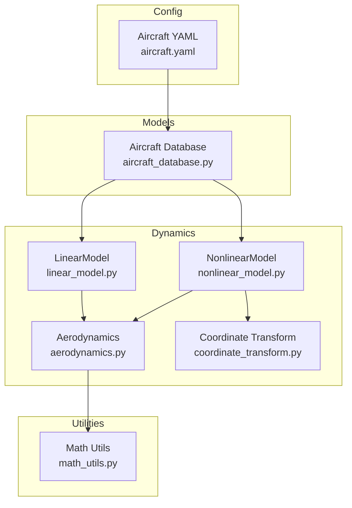
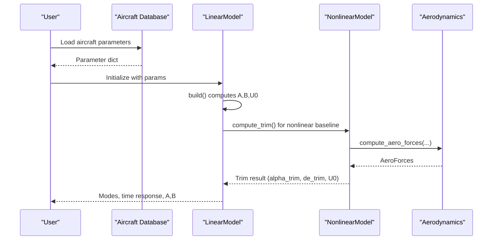
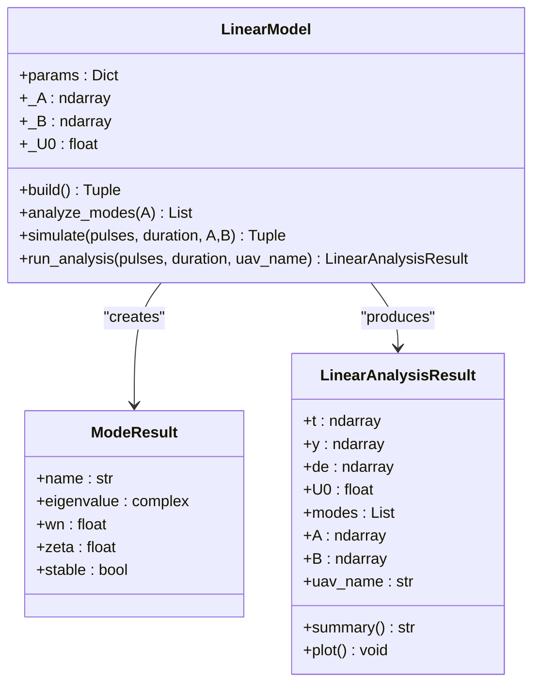
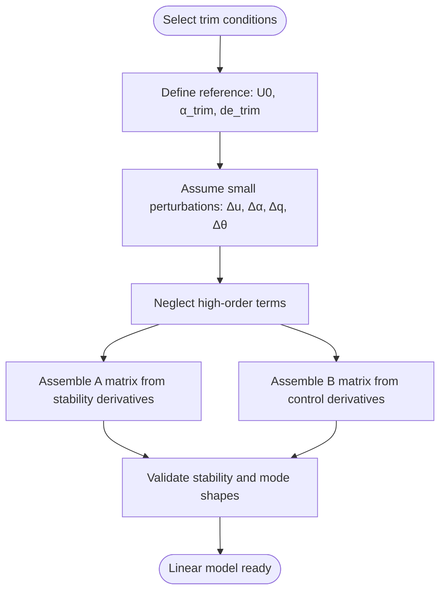
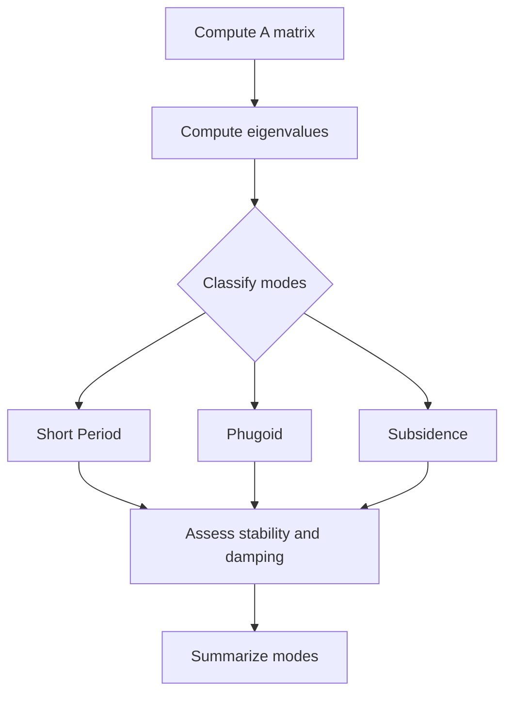
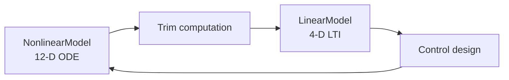
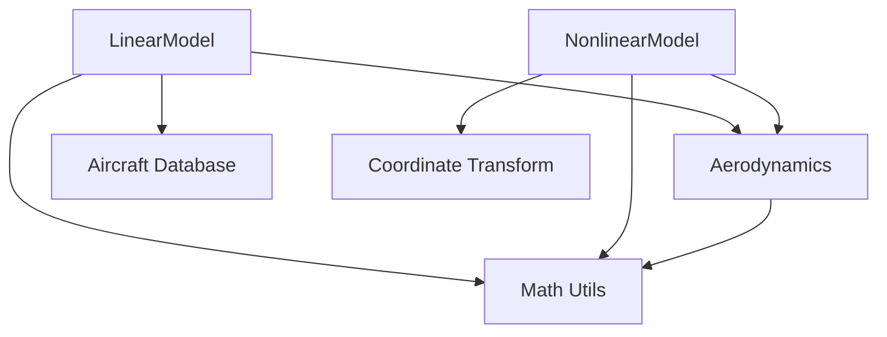

# Linear 4-DOF Analysis Model

<cite>
**Referenced Files in This Document**
- [linear_model.py](file://src/dynamics/linear_model.py)
- [nonlinear_model.py](file://src/dynamics/nonlinear_model.py)
- [aerodynamics.py](file://src/dynamics/aerodynamics.py)
- [aircraft_database.py](file://src/models/aircraft_database.py)
- [math_utils.py](file://src/utils/math_utils.py)
- [coordinate_transform.py](file://src/dynamics/coordinate_transform.py)
- [aircraft.yaml](file://config/aircraft.yaml)
</cite>

## Table of Contents
1. [Introduction](#introduction)
2. [Project Structure](#project-structure)
3. [Core Components](#core-components)
4. [Architecture Overview](#architecture-overview)
5. [Detailed Component Analysis](#detailed-component-analysis)
6. [Dependency Analysis](#dependency-analysis)
7. [Performance Considerations](#performance-considerations)
8. [Troubleshooting Guide](#troubleshooting-guide)
9. [Conclusion](#conclusion)
10. [Appendices](#appendices)

## Introduction
This document explains the linearized 4-degree-of-freedom (4-DOF) longitudinal aircraft dynamics model used for control system design and analysis. It focuses on the state-space representation with focus variables including airspeed, angle of attack, sideslip angle, and altitude. It documents the linearization process from the 6-DOF nonlinear model, including equilibrium point selection and small perturbation assumptions. It covers the state-space matrices (A, B, C, D), their physical meaning in control design contexts, modal analysis capabilities, eigenvalue computation, and stability assessment. Practical examples of control system design using linear models, frequency response analysis, and controller synthesis are included. Finally, it explains the relationship between linear and nonlinear models and their respective application domains, with guidance on when to use linear approximations versus full nonlinear simulation.

## Project Structure
The linear 4-DOF model is part of a modular fixed-wing simulation framework. The relevant components include:
- Dynamics: linear and nonlinear models, aerodynamics, and coordinate transforms
- Models: aircraft parameter database and factory
- Utilities: math utilities for angles, rotations, and dynamic pressure
- Configuration: YAML-based aircraft configuration

**Diagram sources**
- [linear_model.py](file://src/dynamics/linear_model.py#L107-L319)
- [nonlinear_model.py](file://src/dynamics/nonlinear_model.py#L104-L386)
- [aerodynamics.py](file://src/dynamics/aerodynamics.py#L35-L148)
- [aircraft_database.py](file://src/models/aircraft_database.py#L143-L166)
- [math_utils.py](file://src/utils/math_utils.py#L43-L124)
- [coordinate_transform.py](file://src/dynamics/coordinate_transform.py#L29-L70)
- [aircraft.yaml](file://config/aircraft.yaml#L1-L13)

**Section sources**
- [linear_model.py](file://src/dynamics/linear_model.py#L1-L319)
- [nonlinear_model.py](file://src/dynamics/nonlinear_model.py#L1-L386)
- [aerodynamics.py](file://src/dynamics/aerodynamics.py#L1-L148)
- [aircraft_database.py](file://src/models/aircraft_database.py#L1-L183)
- [math_utils.py](file://src/utils/math_utils.py#L1-L124)
- [coordinate_transform.py](file://src/dynamics/coordinate_transform.py#L1-L70)
- [aircraft.yaml](file://config/aircraft.yaml#L1-L13)

## Core Components
- Linear 4-DOF model: longitudinal linearized state-space model for fixed-wing aircraft, focusing on [u_p, α, q, θ] with inputs [δ_T, δ_e]. See [linear_model.py](file://src/dynamics/linear_model.py#L4-L16).
- Nonlinear 6-DOF model: full 12-dimensional equations of motion in NED coordinates, including translational and rotational dynamics. See [nonlinear_model.py](file://src/dynamics/nonlinear_model.py#L4-L20).
- Aerodynamics: computes forces and moments in body frame using standard linearized aerodynamic models. See [aerodynamics.py](file://src/dynamics/aerodynamics.py#L35-L148).
- Aircraft database: provides aircraft parameters and derived fields (e.g., U0, q_bar). See [aircraft_database.py](file://src/models/aircraft_database.py#L143-L166).
- Math utilities: rotation matrices, Euler rates, angle conversions, and dynamic pressure. See [math_utils.py](file://src/utils/math_utils.py#L43-L124).
- Coordinate transforms: conversions between body and NED frames and airspeed vector computation. See [coordinate_transform.py](file://src/dynamics/coordinate_transform.py#L29-L70).

**Section sources**
- [linear_model.py](file://src/dynamics/linear_model.py#L4-L16)
- [nonlinear_model.py](file://src/dynamics/nonlinear_model.py#L4-L20)
- [aerodynamics.py](file://src/dynamics/aerodynamics.py#L35-L148)
- [aircraft_database.py](file://src/models/aircraft_database.py#L143-L166)
- [math_utils.py](file://src/utils/math_utils.py#L43-L124)
- [coordinate_transform.py](file://src/dynamics/coordinate_transform.py#L29-L70)

## Architecture Overview
The linear 4-DOF model is built from the nonlinear 6-DOF model by:
- Selecting a steady (trimmed) flight condition
- Linearizing the 6-DOF equations around the trim
- Focusing on longitudinal dynamics (u, w, q, θ) and neglecting lateral effects
- Normalizing states and inputs for analysis

**Diagram sources**
- [linear_model.py](file://src/dynamics/linear_model.py#L129-L200)
- [nonlinear_model.py](file://src/dynamics/nonlinear_model.py#L132-L154)
- [aerodynamics.py](file://src/dynamics/aerodynamics.py#L35-L148)

## Detailed Component Analysis

### Linear 4-DOF State-Space Model
- Focus variables: [u_p, α, q, θ] represent normalized forward speed perturbation, angle of attack perturbation, pitch rate, and pitch angle perturbation.
- Inputs: [δ_T, δ_e] represent throttle and elevator perturbations.
- Construction: The model constructs A and B matrices from dimensional parameters and stability derivatives, normalizes by freestream conditions, and solves linear systems to obtain state and input matrices.
- Outputs: The model exposes eigenvalue-based modal analysis and time-domain simulation for typical control analysis tasks.

**Diagram sources**
- [linear_model.py](file://src/dynamics/linear_model.py#L107-L319)

**Section sources**
- [linear_model.py](file://src/dynamics/linear_model.py#L107-L319)

### Linearization Process and Equilibrium Selection
- Equilibrium: The linear model relies on a trim condition (level flight, zero sideslip) defined by angle of attack and elevator trim. The nonlinear model computes trim using lift and pitching moment balance. See [nonlinear_model.py](file://src/dynamics/nonlinear_model.py#L132-L154).
- Small perturbations: States and inputs are treated as small deviations from the trim; higher-order terms are neglected. See [linear_model.py](file://src/dynamics/linear_model.py#L129-L200).
- Longitudinal focus: The linear model ignores lateral dynamics (v, p, r, β) and focuses on u, w, q, θ. See [linear_model.py](file://src/dynamics/linear_model.py#L4-L16).

**Diagram sources**
- [linear_model.py](file://src/dynamics/linear_model.py#L129-L200)
- [nonlinear_model.py](file://src/dynamics/nonlinear_model.py#L132-L154)

**Section sources**
- [linear_model.py](file://src/dynamics/linear_model.py#L129-L200)
- [nonlinear_model.py](file://src/dynamics/nonlinear_model.py#L132-L154)

### State-Space Matrices (A, B, C, D) and Their Physical Meaning
- A matrix: Encodes longitudinal dynamics and stability derivatives. Eigenvalues reveal short-period, phugoid, and subsidence modes. See [linear_model.py](file://src/dynamics/linear_model.py#L175-L195).
- B matrix: Encodes control effectiveness of throttle and elevator on the four states. See [linear_model.py](file://src/dynamics/linear_model.py#L187-L192).
- C and D matrices: Not explicitly constructed in the linear model module; however, the module supports time-domain simulation and modal analysis sufficient for control design tasks. Users can construct C/D for specific outputs and measurements as needed.

Practical control design implications:
- Short-period mode: primarily α and θ; affects stick-fixed maneuvering characteristics.
- Phugoid mode: long-term energy exchange between kinetic and potential energy; affects speed and altitude coupling.
- Subsidence mode: pure decaying mode; often associated with yaw or lateral coupling.

**Section sources**
- [linear_model.py](file://src/dynamics/linear_model.py#L175-L200)

### Modal Analysis and Stability Assessment
- Eigenvalue decomposition of A yields modes with natural frequency and damping ratio.
- Classification:
  - Short period: high frequency, low damping
  - Phugoid: low frequency, long period
  - Subsidence: pure decay
- Stability: negative real parts imply stability; damping ratios indicate oscillatory behavior severity.

**Diagram sources**
- [linear_model.py](file://src/dynamics/linear_model.py#L206-L252)

**Section sources**
- [linear_model.py](file://src/dynamics/linear_model.py#L206-L252)

### Relationship Between Linear and Nonlinear Models
- Linear model: simplified, tractable for control design, modal analysis, and frequency-domain methods.
- Nonlinear model: captures full physics, including lateral dynamics, wind effects, and trim computation.
- Integration: nonlinear trim informs linear model construction; nonlinear simulations validate linear predictions under larger excursions.

**Diagram sources**
- [nonlinear_model.py](file://src/dynamics/nonlinear_model.py#L132-L154)
- [linear_model.py](file://src/dynamics/linear_model.py#L129-L200)

**Section sources**
- [nonlinear_model.py](file://src/dynamics/nonlinear_model.py#L132-L154)
- [linear_model.py](file://src/dynamics/linear_model.py#L129-L200)

### Practical Examples and Workflows
- Linear analysis: build A and B, compute modes, simulate step/elevator inputs, and visualize time responses. See [linear_model.py](file://src/dynamics/linear_model.py#L312-L319).
- Nonlinear comparison: compute trim, apply control pulses, and compare responses to linear predictions. See [nonlinear_model.py](file://src/dynamics/nonlinear_model.py#L287-L386).
- Aircraft parameters: load from database or YAML configuration. See [aircraft_database.py](file://src/models/aircraft_database.py#L143-L166) and [aircraft.yaml](file://config/aircraft.yaml#L1-L13).

**Section sources**
- [linear_model.py](file://src/dynamics/linear_model.py#L312-L319)
- [nonlinear_model.py](file://src/dynamics/nonlinear_model.py#L287-L386)
- [aircraft_database.py](file://src/models/aircraft_database.py#L143-L166)
- [aircraft.yaml](file://config/aircraft.yaml#L1-L13)

## Dependency Analysis
- Linear model depends on:
  - Aerodynamic force/moment computation for stability derivatives
  - Aircraft parameters (geometry, inertia, aerodynamic coefficients)
  - Math utilities for normalization and conversions
- Nonlinear model depends on:
  - Aerodynamics for forces/moments
  - Math utilities for rotations and Euler rates
  - Coordinate transforms for wind/body conversions

**Diagram sources**
- [linear_model.py](file://src/dynamics/linear_model.py#L18-L21)
- [nonlinear_model.py](file://src/dynamics/nonlinear_model.py#L22-L29)
- [aerodynamics.py](file://src/dynamics/aerodynamics.py#L11-L13)
- [math_utils.py](file://src/utils/math_utils.py#L6-L6)
- [coordinate_transform.py](file://src/dynamics/coordinate_transform.py#L10-L16)

**Section sources**
- [linear_model.py](file://src/dynamics/linear_model.py#L18-L21)
- [nonlinear_model.py](file://src/dynamics/nonlinear_model.py#L22-L29)
- [aerodynamics.py](file://src/dynamics/aerodynamics.py#L11-L13)
- [math_utils.py](file://src/utils/math_utils.py#L6-L6)
- [coordinate_transform.py](file://src/dynamics/coordinate_transform.py#L10-L16)

## Performance Considerations
- Matrix assembly and solution: The linear model solves linear systems to obtain A and B; ensure numerical conditioning and avoid explicit matrix inverses where possible.
- Normalization: Using reference speed U0 and dynamic pressure q_bar improves numerical scaling.
- Modal analysis: Eigenvalue computation is efficient for small matrices; sorting by magnitude helps identify dominant modes.
- Nonlinear simulation: Use adaptive step integration (as in the nonlinear model) for stability when extending analyses.

[No sources needed since this section provides general guidance]

## Troubleshooting Guide
- Unstable modes: Verify trim conditions and ensure the linear model is evaluated near feasible flight envelopes.
- Numerical issues: Check for ill-conditioned matrices; adjust tolerances or parameter ranges.
- Parameter mismatches: Confirm aircraft parameters (S, c, mass, inertia) and stability derivatives are consistent with the intended operating point.

**Section sources**
- [linear_model.py](file://src/dynamics/linear_model.py#L206-L252)
- [nonlinear_model.py](file://src/dynamics/nonlinear_model.py#L348-L351)

## Conclusion
The linear 4-DOF model provides a robust foundation for control system design and analysis of fixed-wing aircraft. By focusing on longitudinal dynamics and small-perturbation assumptions, it enables modal analysis, controller synthesis, and stability assessment. The nonlinear 6-DOF model complements it by offering accurate trim computation and validation under larger excursions. Together, they support a seamless workflow from design to verification.

[No sources needed since this section summarizes without analyzing specific files]

## Appendices

### Appendix A: State-Space Representation and Focus Variables
- States: [u_p, α, q, θ]
- Inputs: [δ_T, δ_e]
- Outputs: Typically selected for control design (e.g., α, θ, q) and can be augmented as needed.

**Section sources**
- [linear_model.py](file://src/dynamics/linear_model.py#L4-L16)

### Appendix B: Linearization Assumptions and Equilibrium
- Small perturbations around trim
- Level flight, zero sideslip
- Neglect lateral dynamics for longitudinal focus

**Section sources**
- [linear_model.py](file://src/dynamics/linear_model.py#L129-L200)
- [nonlinear_model.py](file://src/dynamics/nonlinear_model.py#L132-L154)

### Appendix C: Aircraft Parameter Loading
- Load parameters from database or YAML configuration; derived fields (U0, q_bar) are injected automatically.

**Section sources**
- [aircraft_database.py](file://src/models/aircraft_database.py#L143-L166)
- [aircraft.yaml](file://config/aircraft.yaml#L1-L13)