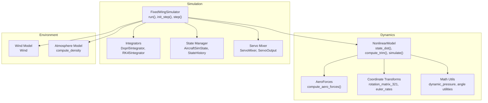
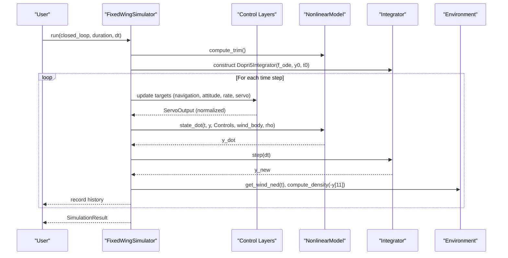
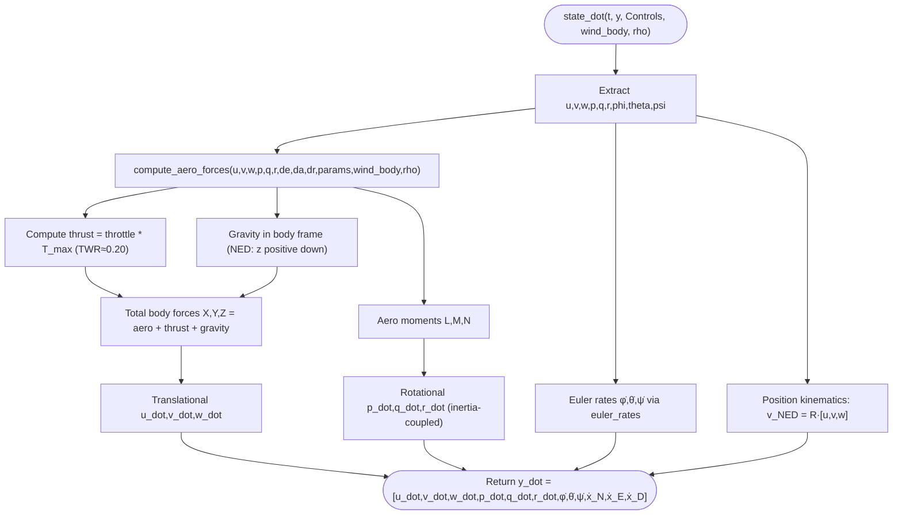
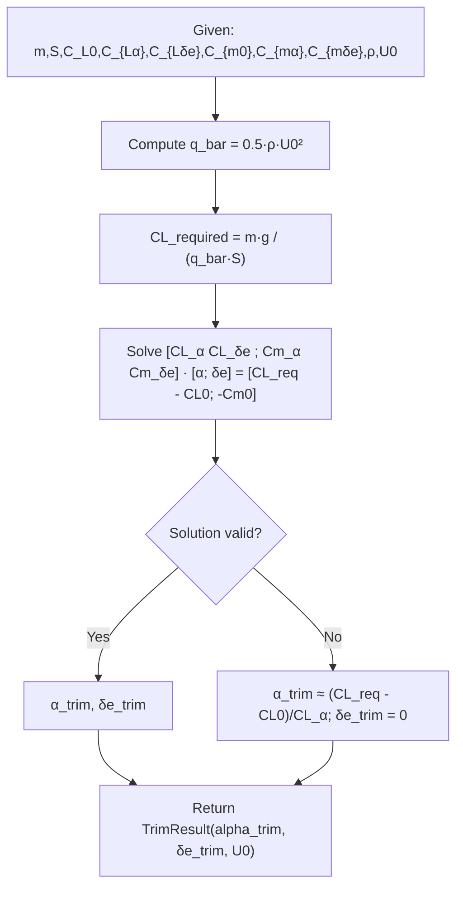
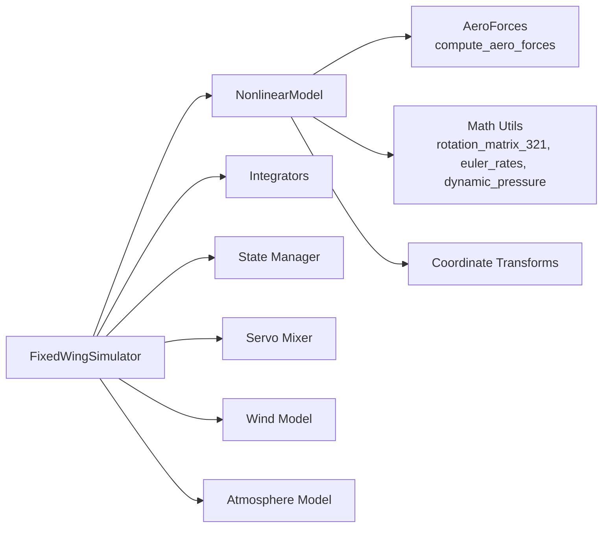

# Nonlinear 6-DOF Dynamics

<cite>
**Referenced Files in This Document**
- [nonlinear_model.py](file://src/dynamics/nonlinear_model.py)
- [aerodynamics.py](file://src/dynamics/aerodynamics.py)
- [coordinate_transform.py](file://src/dynamics/coordinate_transform.py)
- [math_utils.py](file://src/utils/math_utils.py)
- [simulator.py](file://src/simulation/simulator.py)
- [integrator.py](file://src/simulation/integrator.py)
- [state_manager.py](file://src/simulation/state_manager.py)
- [servo_mixer.py](file://src/control/servo_mixer.py)
- [aerodynamic_forces.py](file://src/environment/aerodynamic_forces.py)
- [aircraft.yaml](file://config/aircraft.yaml)
- [debug_trim.py](file://debug_trim.py)
</cite>

## Table of Contents
1. [Introduction](#introduction)
2. [Project Structure](#project-structure)
3. [Core Components](#core-components)
4. [Architecture Overview](#architecture-overview)
5. [Detailed Component Analysis](#detailed-component-analysis)
6. [Dependency Analysis](#dependency-analysis)
7. [Performance Considerations](#performance-considerations)
8. [Troubleshooting Guide](#troubleshooting-guide)
9. [Conclusion](#conclusion)
10. [Appendices](#appendices)

## Introduction
This document provides comprehensive documentation for the 6-DOF nonlinear flight dynamics model implemented in the FixedWingSimulator. It explains the state vector definition, nonlinear equations of motion (translational and rotational), control surface deflection modeling, thrust model, trim computation for level flight, and state derivative evaluation. It also covers the ODE solver integration, initial conditions setup, simulation execution, and the NonlinearSimResult data structure with derived quantity calculations. Practical examples, trim analysis, and validation procedures are included to help users configure and validate simulations.

## Project Structure
The nonlinear dynamics implementation resides primarily under the dynamics package, with supporting utilities in math_utils, aerodynamics, and coordinate transforms. The simulation orchestrator integrates the dynamics with environment models, control layers, and numerical integrators.

**Diagram sources**
- [nonlinear_model.py](file://src/dynamics/nonlinear_model.py#L104-L386)
- [aerodynamics.py](file://src/dynamics/aerodynamics.py#L35-L148)
- [coordinate_transform.py](file://src/dynamics/coordinate_transform.py#L29-L70)
- [math_utils.py](file://src/utils/math_utils.py#L43-L124)
- [simulator.py](file://src/simulation/simulator.py#L115-L642)
- [integrator.py](file://src/simulation/integrator.py#L17-L108)
- [state_manager.py](file://src/simulation/state_manager.py#L16-L193)
- [servo_mixer.py](file://src/control/servo_mixer.py#L54-L153)

**Section sources**
- [nonlinear_model.py](file://src/dynamics/nonlinear_model.py#L1-L386)
- [simulator.py](file://src/simulation/simulator.py#L115-L642)

## Core Components
- NonlinearModel: Implements the 6-DOF nonlinear equations of motion, trim computation, and simulation orchestration.
- AeroForces and compute_aero_forces: Computes aerodynamic forces and moments in the body frame, including wind effects.
- Math utilities: Provides rotation matrices, Euler rates, angle utilities, and dynamic pressure.
- Integrators: Dopri5Integrator for real-time step-by-step integration; RK45Integrator for batch solve_ivp.
- State manager: Defines AircraftSimState and StateHistory for efficient state recording and derived quantities.
- Servo mixer: Converts control targets to normalized actuator outputs and applies limits and coordinated turn compensation.
- Wind and atmosphere: Wind model and density computation for variable-air-density simulations.

**Section sources**
- [nonlinear_model.py](file://src/dynamics/nonlinear_model.py#L104-L386)
- [aerodynamics.py](file://src/dynamics/aerodynamics.py#L19-L148)
- [math_utils.py](file://src/utils/math_utils.py#L43-L124)
- [integrator.py](file://src/simulation/integrator.py#L17-L108)
- [state_manager.py](file://src/simulation/state_manager.py#L16-L193)
- [servo_mixer.py](file://src/control/servo_mixer.py#L54-L153)

## Architecture Overview
The simulator composes the nonlinear dynamics with a five-layer control system (navigation, TECS, attitude, rate, servo), environment models (wind, atmosphere), and numerical integrators. Two simulation modes are supported:
- Closed-loop real-time simulation using Dopri5Integrator.
- Open-loop nonlinear simulation using solve_ivp via NonlinearModel.simulate.

**Diagram sources**
- [simulator.py](file://src/simulation/simulator.py#L239-L567)
- [nonlinear_model.py](file://src/dynamics/nonlinear_model.py#L160-L281)
- [integrator.py](file://src/simulation/integrator.py#L17-L71)
- [servo_mixer.py](file://src/control/servo_mixer.py#L80-L149)

## Detailed Component Analysis

### State Vector Definition and Frames
- State vector (12-D, NED frame):
  - Body velocities: u, v, w (m/s)
  - Angular rates: p, q, r (rad/s)
  - Euler angles: phi (roll), theta (pitch), psi (yaw) (rad)
  - Position coordinates: x_N, x_E, x_D (m) with positive-down NED convention
- Reference frames:
  - NED (North-East-Down) body frame with 3-2-1 Euler angles.
  - Body frame follows standard fixed-wing conventions.

**Section sources**
- [nonlinear_model.py](file://src/dynamics/nonlinear_model.py#L4-L20)
- [coordinate_transform.py](file://src/dynamics/coordinate_transform.py#L29-L36)
- [math_utils.py](file://src/utils/math_utils.py#L43-L66)

### Nonlinear Equations of Motion
- Translational dynamics (body frame):
  - u_dot, v_dot, w_dot computed from Coriolis terms and total body-frame forces (aerodynamics + thrust + gravity).
- Rotational dynamics (Euler angles with inertia coupling):
  - p_dot, q_dot, r_dot from aero moments and inertia terms; denominator accounts for coupled inertia (Ixx, Iyy, Izz, Ixz).
- Euler angle kinematics:
  - Rates computed via euler_rates(p, q, r, phi, theta).
- Position kinematics:
  - Velocity in NED computed by rotating body velocities using rotation_matrix_321(phi, theta, psi).

**Diagram sources**
- [nonlinear_model.py](file://src/dynamics/nonlinear_model.py#L160-L255)
- [aerodynamics.py](file://src/dynamics/aerodynamics.py#L35-L148)
- [math_utils.py](file://src/utils/math_utils.py#L43-L100)

**Section sources**
- [nonlinear_model.py](file://src/dynamics/nonlinear_model.py#L160-L255)
- [aerodynamics.py](file://src/dynamics/aerodynamics.py#L35-L148)
- [math_utils.py](file://src/utils/math_utils.py#L43-L100)

### Control Surface Deflection Model and Thrust Calculation
- Control surface deflections:
  - Elevator (de), aileron (da), rudder (dr) are provided as radians; trim bias is added for closed-loop operation.
- Thrust model:
  - Simple proportional model: T = throttle × T_max with T_max chosen to achieve realistic thrust-to-weight ratios (~0.20 for medium UAV), balancing climb and cruise performance.
- Servo mixing:
  - Normalized servo outputs are converted to radians with amplitude limits and coordinated turn compensation; rate limiting approximates physical actuator dynamics.

**Section sources**
- [nonlinear_model.py](file://src/dynamics/nonlinear_model.py#L194-L210)
- [servo_mixer.py](file://src/control/servo_mixer.py#L80-L149)

### Trim Computation Algorithm (Level Flight)
- Assumptions:
  - Level flight (theta ≈ alpha_trim), wings-level (beta = 0), zero yaw rate.
- Method:
  - Linear system in lift and pitching moment coefficients to solve for (alpha_trim, delta_e_trim) given mass, reference area, and dynamic pressure at trim speed U0.
  - Falls back to least-squares solution if matrix singularity occurs.
- Cruise throttle auto-calibration:
  - After computing trim, the simulator recomputes a cruise throttle that balances X_aero + X_gravity = -thrust at trim conditions.

**Diagram sources**
- [nonlinear_model.py](file://src/dynamics/nonlinear_model.py#L132-L154)
- [simulator.py](file://src/simulation/simulator.py#L270-L300)

**Section sources**
- [nonlinear_model.py](file://src/dynamics/nonlinear_model.py#L132-L154)
- [simulator.py](file://src/simulation/simulator.py#L270-L300)

### State Derivative Evaluation and ODE Wrapper
- state_dot:
  - Accepts state vector, Controls, optional wind in body frame, and air density.
  - Returns the 12-D state derivative for integration.
- make_ode_func:
  - Builds a closure that converts NED wind to body frame using current Euler angles, computes rho from altitude, and calls state_dot.

**Section sources**
- [nonlinear_model.py](file://src/dynamics/nonlinear_model.py#L160-L281)

### Simulation Execution and Integration
- Real-time loop (Dopri5Integrator):
  - Uses scipy.integrate.ode with dopri5; exposes step(dt) for real-time stepping.
  - Integrator is constructed with tolerances and step limits; raises on failure.
- Batch simulation (solve_ivp):
  - NonlinearModel.simulate builds control and wind histories, sets initial trimmed state, and integrates using solve_ivp with RK45.
- Initial conditions:
  - Level flight trim with zero crosswind and zero angular rates; position initialized at origin.

**Section sources**
- [integrator.py](file://src/simulation/integrator.py#L17-L71)
- [nonlinear_model.py](file://src/dynamics/nonlinear_model.py#L287-L385)
- [simulator.py](file://src/simulation/simulator.py#L329-L339)

### NonlinearSimResult and Derived Quantities
- NonlinearSimResult fields:
  - t: time vector
  - y: state history (12×N)
  - controls: {"elevator","aileron","rudder","throttle"} histories
  - derived: {"alpha","beta","airspeed","kinetic","potential"}
  - trim: TrimResult
  - uav_name: aircraft name
- Derived quantities:
  - Airspeed, angle of attack, sideslip, kinetic energy, and potential energy computed from state history.

**Section sources**
- [nonlinear_model.py](file://src/dynamics/nonlinear_model.py#L54-L102)
- [nonlinear_model.py](file://src/dynamics/nonlinear_model.py#L363-L382)

### Wind Effects and Variable Density
- Wind:
  - NED wind converted to body frame using current Euler angles; optional in both real-time and batch modes.
- Air density:
  - Computed from altitude for realistic performance modeling; used in aerodynamics and trim.

**Section sources**
- [nonlinear_model.py](file://src/dynamics/nonlinear_model.py#L271-L281)
- [simulator.py](file://src/simulation/simulator.py#L331-L337)

## Dependency Analysis
The following diagram shows key dependencies among the nonlinear dynamics, aerodynamics, transforms, and simulation modules.

**Diagram sources**
- [nonlinear_model.py](file://src/dynamics/nonlinear_model.py#L104-L386)
- [aerodynamics.py](file://src/dynamics/aerodynamics.py#L35-L148)
- [math_utils.py](file://src/utils/math_utils.py#L43-L124)
- [coordinate_transform.py](file://src/dynamics/coordinate_transform.py#L29-L70)
- [simulator.py](file://src/simulation/simulator.py#L115-L642)
- [integrator.py](file://src/simulation/integrator.py#L17-L108)
- [state_manager.py](file://src/simulation/state_manager.py#L16-L193)
- [servo_mixer.py](file://src/control/servo_mixer.py#L54-L153)

**Section sources**
- [nonlinear_model.py](file://src/dynamics/nonlinear_model.py#L104-L386)
- [simulator.py](file://src/simulation/simulator.py#L115-L642)

## Performance Considerations
- Solver choice:
  - Dopri5Integrator supports adaptive step sizes and is suitable for real-time closed-loop simulation.
  - solve_ivp (RK45) is used for batch analysis and provides accurate histories.
- Tolerances:
  - Default rtol/atol are set to 1e-6; adjust for accuracy vs. speed trade-offs.
- Wind and density:
  - Computing rho from altitude adds minimal overhead but improves realism.
- Control saturation and rate limiting:
  - Servo mixer applies amplitude and rate limits to avoid unrealistic control inputs.

[No sources needed since this section provides general guidance]

## Troubleshooting Guide
- Integration failures:
  - Dopri5Integration errors indicate numerical issues; reduce step size or check control inputs.
- Trim instability:
  - Verify aircraft parameters and ensure CL/CM coefficient matrices are invertible; fallback solutions are used but may be approximate.
- Wind/body conversion:
  - Ensure Euler angles are current when converting NED wind to body frame.
- Cruise throttle mismatch:
  - The simulator auto-adjusts thr_cruise to match trim; verify TECS parameters if unexpected throttle is observed.

**Section sources**
- [integrator.py](file://src/simulation/integrator.py#L54-L56)
- [nonlinear_model.py](file://src/dynamics/nonlinear_model.py#L148-L153)
- [simulator.py](file://src/simulation/simulator.py#L295-L299)

## Conclusion
The 6-DOF nonlinear dynamics model provides a robust foundation for fixed-wing flight simulation. It accurately captures translational and rotational motion, includes realistic aerodynamics and control surface modeling, and offers flexible simulation modes. The trim computation ensures stable initial conditions, while derived quantities enable straightforward post-processing and validation.

[No sources needed since this section summarizes without analyzing specific files]

## Appendices

### Mathematical Formulations and Implementation Notes
- Translational equations:
  - u_dot = r·v − q·w + X/m
  - v_dot = pp·w − r·u + Y/m
  - w_dot = q·u − pp·v + Z/m
- Rotational equations:
  - p_dot, q_dot, r_dot from inertia-coupled Euler equations using aero moments and inertia parameters.
- Euler rates:
  - φ̇, θ̇, ψ̇ computed via euler_rates with numerical protection near singularities.
- Position kinematics:
  - v_NED = R(φ, θ, ψ) · [u, v, w].

**Section sources**
- [nonlinear_model.py](file://src/dynamics/nonlinear_model.py#L224-L248)
- [math_utils.py](file://src/utils/math_utils.py#L79-L100)

### Example Scenarios and Validation Procedures
- Trim analysis:
  - Compute trim and verify force balance in body frame; compare cruise throttle against analytical estimate.
- Nonlinear simulation:
  - Apply control pulses (elevator, aileron, rudder, throttle) and observe transient responses; validate against expected stability characteristics.
- Validation:
  - Compare derived quantities (airspeed, alpha, beta, kinetic/potential energy) with expected trends for steady-level flight and maneuvers.

**Section sources**
- [debug_trim.py](file://debug_trim.py#L1-L43)
- [nonlinear_model.py](file://src/dynamics/nonlinear_model.py#L287-L385)

### Configuration and Aircraft Selection
- Aircraft selection and overrides are configured via the aircraft YAML file; the simulator loads parameters from the aircraft database.

**Section sources**
- [aircraft.yaml](file://config/aircraft.yaml#L5-L12)
- [simulator.py](file://src/simulation/simulator.py#L156-L157)