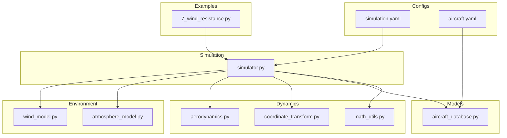
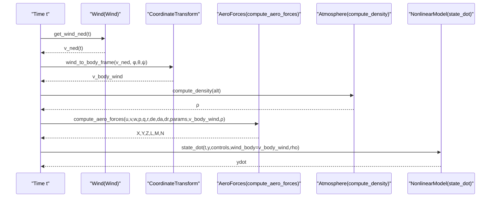
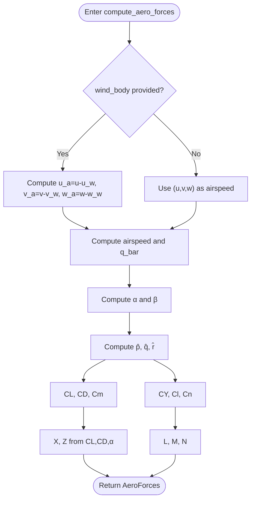
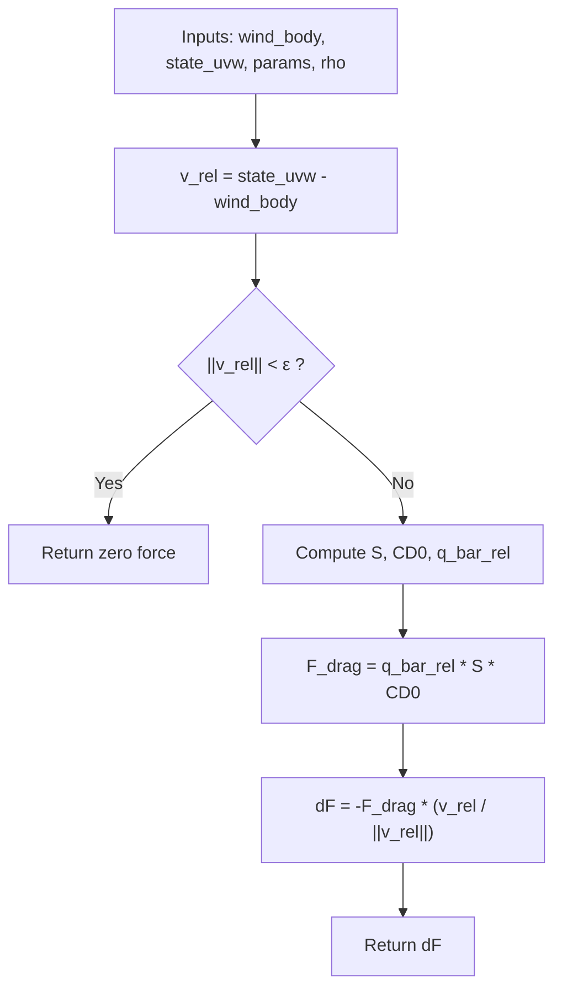
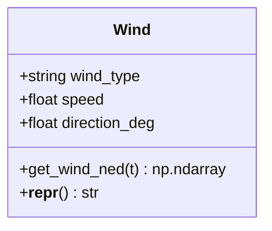
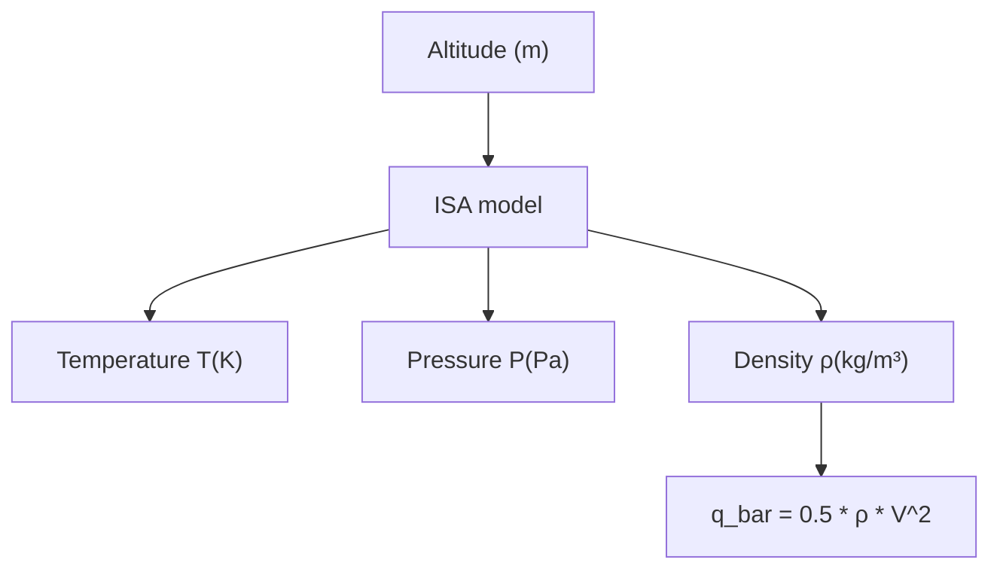
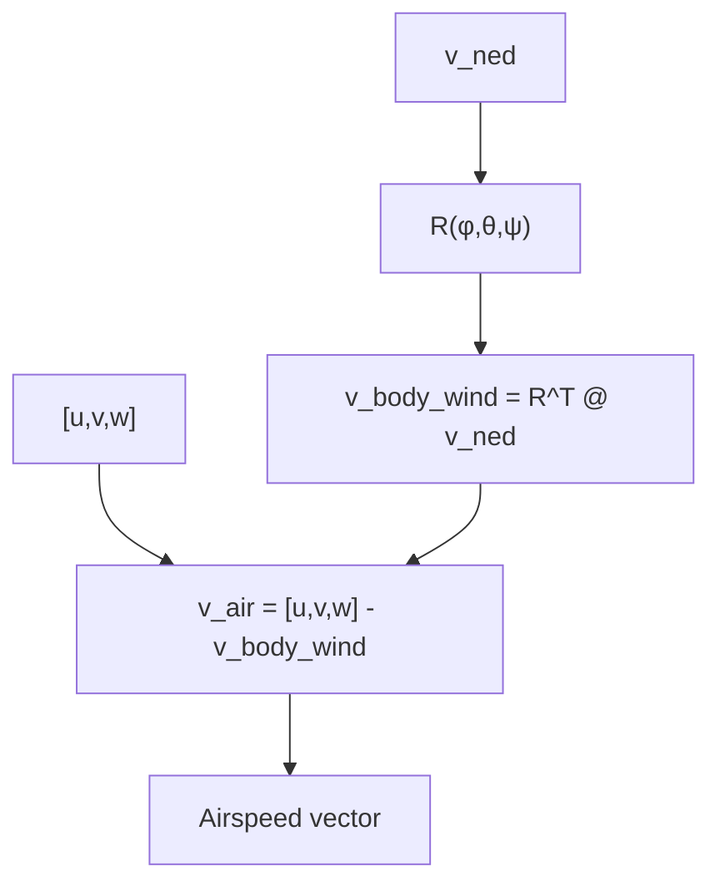
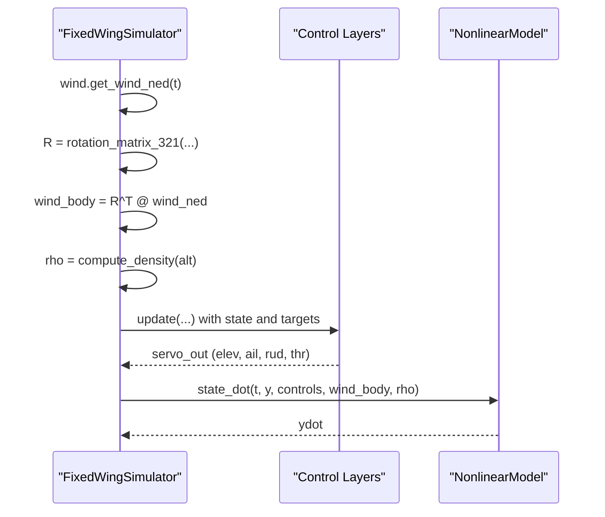
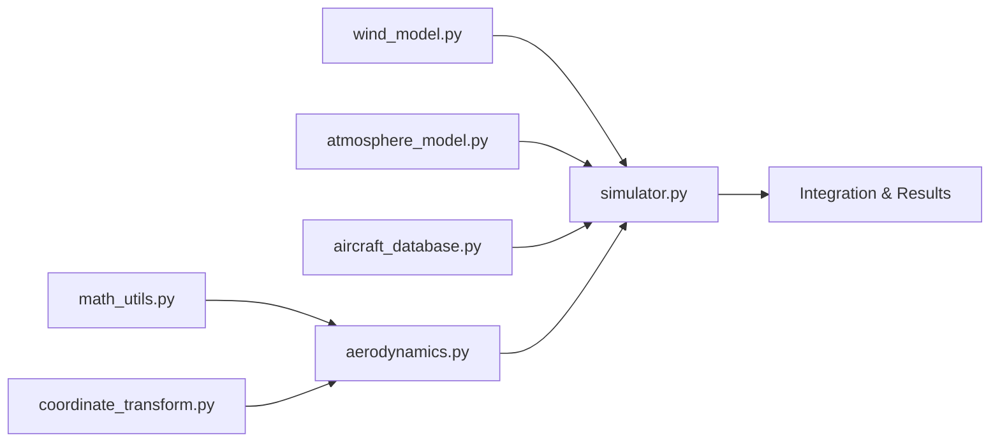

# Aerodynamic Force Calculation

<cite>
**Referenced Files in This Document**
- [aerodynamics.py](file://src/dynamics/aerodynamics.py)
- [aerodynamic_forces.py](file://src/environment/aerodynamic_forces.py)
- [wind_model.py](file://src/environment/wind_model.py)
- [atmosphere_model.py](file://src/environment/atmosphere_model.py)
- [coordinate_transform.py](file://src/dynamics/coordinate_transform.py)
- [math_utils.py](file://src/utils/math_utils.py)
- [simulator.py](file://src/simulation/simulator.py)
- [aircraft_database.py](file://src/models/aircraft_database.py)
- [simulation.yaml](file://config/simulation.yaml)
- [aircraft.yaml](file://config/aircraft.yaml)
- [7_wind_resistance.py](file://examples/7_wind_resistance.py)
</cite>

## Table of Contents
1. [Introduction](#introduction)
2. [Project Structure](#project-structure)
3. [Core Components](#core-components)
4. [Architecture Overview](#architecture-overview)
5. [Detailed Component Analysis](#detailed-component-analysis)
6. [Dependency Analysis](#dependency-analysis)
7. [Performance Considerations](#performance-considerations)
8. [Troubleshooting Guide](#troubleshooting-guide)
9. [Conclusion](#conclusion)
10. [Appendices](#appendices)

## Introduction
This document explains the aerodynamic force calculation system used in the fixed-wing simulator. It covers how environmental conditions (wind and atmosphere) integrate with aircraft dynamics to compute lift, drag, and control forces. It documents force vector calculations across coordinate systems, dynamic pressure computations, and the relationship between atmospheric conditions, wind fields, and aerodynamic force generation. Practical examples demonstrate force analysis under varying environmental conditions, performance impact assessment, and control system adaptation. The focus is on how environmental factors modify aircraft response characteristics and control authority.

## Project Structure
The aerodynamic force system spans several modules:
- Dynamics: aerodynamic force and moment computation in body coordinates
- Environment: wind models and atmospheric state
- Utilities: coordinate transforms and math helpers
- Simulation: orchestration of wind, atmosphere, and dynamics during integration
- Models: aircraft parameter database with aerodynamic coefficients
- Examples: usage of wind disturbances in closed-loop simulations

**Diagram sources**
- [simulator.py](file://src/simulation/simulator.py#L159-L163)
- [wind_model.py](file://src/environment/wind_model.py#L18-L113)
- [atmosphere_model.py](file://src/environment/atmosphere_model.py#L61-L77)
- [aerodynamics.py](file://src/dynamics/aerodynamics.py#L35-L147)
- [coordinate_transform.py](file://src/dynamics/coordinate_transform.py#L29-L70)
- [math_utils.py](file://src/utils/math_utils.py#L107-L124)
- [aircraft_database.py](file://src/models/aircraft_database.py#L143-L166)
- [simulation.yaml](file://config/simulation.yaml#L22-L25)
- [aircraft.yaml](file://config/aircraft.yaml#L5-L13)
- [7_wind_resistance.py](file://examples/7_wind_resistance.py#L24-L32)

**Section sources**
- [simulator.py](file://src/simulation/simulator.py#L159-L163)
- [wind_model.py](file://src/environment/wind_model.py#L18-L113)
- [atmosphere_model.py](file://src/environment/atmosphere_model.py#L61-L77)
- [aerodynamics.py](file://src/dynamics/aerodynamics.py#L35-L147)
- [coordinate_transform.py](file://src/dynamics/coordinate_transform.py#L29-L70)
- [math_utils.py](file://src/utils/math_utils.py#L107-L124)
- [aircraft_database.py](file://src/models/aircraft_database.py#L143-L166)
- [simulation.yaml](file://config/simulation.yaml#L22-L25)
- [aircraft.yaml](file://config/aircraft.yaml#L5-L13)
- [7_wind_resistance.py](file://examples/7_wind_resistance.py#L24-L32)

## Core Components
- Aerodynamic force computation in body frame: computes lift, drag, and moments from angle-of-attack, sideslip, normalized angular rates, control surface deflections, and aircraft geometry/coefficients.
- Wind models: generates NED wind vectors over time and converts them to body frame for use in aerodynamics.
- Atmospheric model: computes air density (and indirectly dynamic pressure) from altitude using the International Standard Atmosphere.
- Coordinate transforms: convert between NED and body frames and compute airspeed vectors.
- Simulation orchestration: integrates wind, atmosphere, and dynamics during numerical integration.

Key implementation references:
- Aerodynamic force computation: [compute_aero_forces](file://src/dynamics/aerodynamics.py#L35-L147)
- Wind generation and conversion: [Wind](file://src/environment/wind_model.py#L18-L113), [wind_to_body_frame](file://src/dynamics/coordinate_transform.py#L39-L53)
- Atmospheric density: [compute_density](file://src/environment/atmosphere_model.py#L48-L52)
- Dynamic pressure: [dynamic_pressure](file://src/utils/math_utils.py#L121-L124)
- Simulation integration loop: [FixedWingSimulator.run](file://src/simulation/simulator.py#L239-L567)

**Section sources**
- [aerodynamics.py](file://src/dynamics/aerodynamics.py#L35-L147)
- [wind_model.py](file://src/environment/wind_model.py#L18-L113)
- [coordinate_transform.py](file://src/dynamics/coordinate_transform.py#L39-L53)
- [atmosphere_model.py](file://src/environment/atmosphere_model.py#L48-L52)
- [math_utils.py](file://src/utils/math_utils.py#L121-L124)
- [simulator.py](file://src/simulation/simulator.py#L239-L567)

## Architecture Overview
The simulation pipeline integrates environment and dynamics:
- Wind model produces NED wind vector at each time step.
- NED wind is transformed to body frame using Euler DCM.
- Airspeed vector is computed as body velocity minus wind in body frame.
- Dynamic pressure is calculated from density and airspeed.
- Aerodynamic coefficients and forces/moments are computed in body frame.
- Forces and moments feed the nonlinear 6-DOF equations of motion.

**Diagram sources**
- [simulator.py](file://src/simulation/simulator.py#L329-L337)
- [wind_model.py](file://src/environment/wind_model.py#L76-L108)
- [coordinate_transform.py](file://src/dynamics/coordinate_transform.py#L39-L53)
- [atmosphere_model.py](file://src/environment/atmosphere_model.py#L48-L52)
- [aerodynamics.py](file://src/dynamics/aerodynamics.py#L35-L147)

## Detailed Component Analysis

### Aerodynamic Force Computation (Body Frame)
- Inputs: body-frame velocities (u, v, w), body-frame angular rates (p, q, r), control deflections (elevator, aileron, rudder), aircraft parameters, optional wind in body frame, and air density.
- Effective airspeed vector is computed by subtracting wind from body velocity.
- Dynamic pressure is derived from density and effective airspeed.
- Angles: angle-of-attack and sideslip are computed using robust numerical utilities.
- Normalized angular rates are formed using wing span/cord and reference speed.
- Longitudinal coefficients (CL, CD, Cm) and lateral-directional coefficients (CY, Cl, Cn) are computed from linear combinations of angles, normalized rates, and control deflections.
- Forces (X, Y, Z) and moments (L, M, N) are computed from non-dimensional coefficients and dynamic pressure.

**Diagram sources**
- [aerodynamics.py](file://src/dynamics/aerodynamics.py#L35-L147)
- [math_utils.py](file://src/utils/math_utils.py#L107-L124)

**Section sources**
- [aerodynamics.py](file://src/dynamics/aerodynamics.py#L35-L147)
- [math_utils.py](file://src/utils/math_utils.py#L107-L124)

### Wind Effects and Incremental Drag
- The wind drag module computes incremental body-frame forces due to the relative wind speed compared to aircraft velocity.
- It uses a simplified drag model based on relative airspeed magnitude and direction to estimate additional drag beyond baseline aerodynamics.
- This is useful for perturbation and sensitivity analysis.

**Diagram sources**
- [aerodynamic_forces.py](file://src/environment/aerodynamic_forces.py#L13-L54)

**Section sources**
- [aerodynamic_forces.py](file://src/environment/aerodynamic_forces.py#L13-L54)

### Wind Field Models
- Supports four wind types: NONE, FIXED, SINE, RANDOMSINE.
- FIXED wind is a constant NED vector determined by speed and direction (met convention).
- SINE and RANDOMSINE add sinusoidal fluctuations per axis with random amplitudes/phases; RANDOMSINE also adds a random mean per axis.
- The class precomputes a fixed NED unit vector for efficiency and supports time-varying wind retrieval.

**Diagram sources**
- [wind_model.py](file://src/environment/wind_model.py#L18-L113)

**Section sources**
- [wind_model.py](file://src/environment/wind_model.py#L18-L113)

### Atmospheric Conditions and Dynamic Pressure
- Density is computed from altitude using the International Standard Atmosphere (ISA) model, covering the troposphere and lower stratosphere.
- Dynamic pressure is computed as 0.5 * rho * V^2, used widely in aerodynamic force computations.

**Diagram sources**
- [atmosphere_model.py](file://src/environment/atmosphere_model.py#L24-L77)
- [math_utils.py](file://src/utils/math_utils.py#L121-L124)

**Section sources**
- [atmosphere_model.py](file://src/environment/atmosphere_model.py#L24-L77)
- [math_utils.py](file://src/utils/math_utils.py#L121-L124)

### Coordinate Systems and Transforms
- Euler 3-2-1 (NED) convention is used; DCM from Euler angles transforms between NED and body frames.
- Wind vectors are converted from NED to body frame using the transpose of the DCM.
- Airspeed vector in body frame equals body velocity minus wind in body frame.

**Diagram sources**
- [coordinate_transform.py](file://src/dynamics/coordinate_transform.py#L29-L70)
- [math_utils.py](file://src/utils/math_utils.py#L43-L77)

**Section sources**
- [coordinate_transform.py](file://src/dynamics/coordinate_transform.py#L29-L70)
- [math_utils.py](file://src/utils/math_utils.py#L43-L77)

### Simulation Orchestration and Control Adaptation
- The simulator constructs wind and atmosphere, computes airspeed and density, and passes them to the dynamics ODE.
- Closed-loop control adapts to environmental disturbances; servos translate commanded rates/angles into control surface deflections.
- Example demonstrates FBW_B mode with RANDOMSINE wind to assess disturbance rejection.

**Diagram sources**
- [simulator.py](file://src/simulation/simulator.py#L329-L337)
- [simulator.py](file://src/simulation/simulator.py#L499-L541)
- [wind_model.py](file://src/environment/wind_model.py#L76-L108)
- [atmosphere_model.py](file://src/environment/atmosphere_model.py#L48-L52)

**Section sources**
- [simulator.py](file://src/simulation/simulator.py#L329-L337)
- [simulator.py](file://src/simulation/simulator.py#L499-L541)
- [7_wind_resistance.py](file://examples/7_wind_resistance.py#L24-L39)

## Dependency Analysis
- Dynamics depends on math utilities for angles and dynamic pressure.
- Simulation orchestrates wind, atmosphere, and dynamics; it also manages control layers and trajectory planning.
- Aircraft parameters are loaded from the database and injected with derived fields (e.g., reference speed and density).

**Diagram sources**
- [aerodynamics.py](file://src/dynamics/aerodynamics.py#L10-L16)
- [math_utils.py](file://src/utils/math_utils.py#L10-L16)
- [coordinate_transform.py](file://src/dynamics/coordinate_transform.py#L10-L16)
- [wind_model.py](file://src/environment/wind_model.py#L14-L15)
- [atmosphere_model.py](file://src/environment/atmosphere_model.py#L8-L9)
- [aircraft_database.py](file://src/models/aircraft_database.py#L14-L20)
- [simulator.py](file://src/simulation/simulator.py#L33-L52)

**Section sources**
- [aerodynamics.py](file://src/dynamics/aerodynamics.py#L10-L16)
- [math_utils.py](file://src/utils/math_utils.py#L10-L16)
- [coordinate_transform.py](file://src/dynamics/coordinate_transform.py#L10-L16)
- [wind_model.py](file://src/environment/wind_model.py#L14-L15)
- [atmosphere_model.py](file://src/environment/atmosphere_model.py#L8-L9)
- [aircraft_database.py](file://src/models/aircraft_database.py#L14-L20)
- [simulator.py](file://src/simulation/simulator.py#L33-L52)

## Performance Considerations
- Numerical stability: Small thresholds are used to avoid division by near-zero quantities in angle computations and relative airspeed checks.
- Coordinate transforms: Using exact rotation matrices ensures accuracy across large angles and avoids singularities typical of Euler angle parameterizations.
- Wind model efficiency: Precomputed NED unit vectors and vectorized trigonometric operations reduce per-step cost.
- Atmospheric sampling: Density is recomputed per step from altitude; caching is unnecessary given the simplicity of ISA.
- Control adaptation: Closed-loop control adjusts to wind-induced deviations; tuning parameters (e.g., TECS gains) influence disturbance rejection performance.

[No sources needed since this section provides general guidance]

## Troubleshooting Guide
Common issues and remedies:
- Zero or negligible airspeed leading to undefined directions:
  - Ensure nonzero relative velocity before computing drag increments.
  - Reference: [compute_wind_drag_forces](file://src/environment/aerodynamic_forces.py#L42-L43)
- Incorrect wind conversion:
  - Verify Euler angles and DCM orientation; confirm NED-to-body conversion sign convention.
  - References: [wind_to_body_frame](file://src/dynamics/coordinate_transform.py#L39-L53), [rotation_matrix_321](file://src/utils/math_utils.py#L43-L66)
- Inaccurate dynamic pressure:
  - Confirm altitude-derived density and airspeed magnitude.
  - References: [compute_density](file://src/environment/atmosphere_model.py#L48-L52), [dynamic_pressure](file://src/utils/math_utils.py#L121-L124)
- Control instability under wind:
  - Adjust control gains and ensure trim is recomputed for the current aircraft and environment.
  - References: [FixedWingSimulator.run](file://src/simulation/simulator.py#L270-L300), [7_wind_resistance.py](file://examples/7_wind_resistance.py#L24-L39)

**Section sources**
- [aerodynamic_forces.py](file://src/environment/aerodynamic_forces.py#L42-L43)
- [coordinate_transform.py](file://src/dynamics/coordinate_transform.py#L39-L53)
- [math_utils.py](file://src/utils/math_utils.py#L43-L66)
- [atmosphere_model.py](file://src/environment/atmosphere_model.py#L48-L52)
- [math_utils.py](file://src/utils/math_utils.py#L121-L124)
- [simulator.py](file://src/simulation/simulator.py#L270-L300)
- [7_wind_resistance.py](file://examples/7_wind_resistance.py#L24-L39)

## Conclusion
The aerodynamic force calculation system integrates wind and atmospheric conditions with aircraft dynamics to accurately predict lift, drag, and control forces in body coordinates. By transforming wind from NED to body frame, computing dynamic pressure from altitude, and evaluating aerodynamic coefficients from angles and control inputs, the system supports realistic closed-loop simulations. Environmental factors significantly impact aircraft response and control authority, which the control system adapts to maintain performance and stability.

[No sources needed since this section summarizes without analyzing specific files]

## Appendices

### Environmental Parameter Incorporation
- Wind:
  - Type selection via configuration or CLI.
  - FIXED wind defined by speed and direction; SINE/RANDOMSINE include harmonic fluctuations.
  - Reference: [Wind](file://src/environment/wind_model.py#L18-L113), [simulation.yaml](file://config/simulation.yaml#L22-L25)
- Atmosphere:
  - Density computed from altitude using ISA; used to derive dynamic pressure.
  - Reference: [compute_density](file://src/environment/atmosphere_model.py#L48-L52), [dynamic_pressure](file://src/utils/math_utils.py#L121-L124)

**Section sources**
- [wind_model.py](file://src/environment/wind_model.py#L18-L113)
- [simulation.yaml](file://config/simulation.yaml#L22-L25)
- [atmosphere_model.py](file://src/environment/atmosphere_model.py#L48-L52)
- [math_utils.py](file://src/utils/math_utils.py#L121-L124)

### Force Vector Calculations Across Coordinate Systems
- Body frame: forces and moments computed directly from non-dimensional coefficients and dynamic pressure.
- NED frame: wind vectors converted via DCM; airspeed vector computed as body velocity minus wind in body frame.
- Reference: [compute_aero_forces](file://src/dynamics/aerodynamics.py#L35-L147), [wind_to_body_frame](file://src/dynamics/coordinate_transform.py#L39-L53), [airspeed_vector](file://src/dynamics/coordinate_transform.py#L56-L69)

**Section sources**
- [aerodynamics.py](file://src/dynamics/aerodynamics.py#L35-L147)
- [coordinate_transform.py](file://src/dynamics/coordinate_transform.py#L39-L53)
- [coordinate_transform.py](file://src/dynamics/coordinate_transform.py#L56-L69)

### Relationship Between Atmospheric Conditions, Wind Fields, and Aerodynamic Forces
- Atmospheric density affects dynamic pressure, which scales all aerodynamic forces and moments.
- Wind modifies the effective airspeed vector, changing angle-of-attack and sideslip, and thus altering lift, drag, and control effectiveness.
- Reference: [compute_density](file://src/environment/atmosphere_model.py#L48-L52), [compute_aero_forces](file://src/dynamics/aerodynamics.py#L68-L83), [compute_wind_drag_forces](file://src/environment/aerodynamic_forces.py#L39-L51)

**Section sources**
- [atmosphere_model.py](file://src/environment/atmosphere_model.py#L48-L52)
- [aerodynamics.py](file://src/dynamics/aerodynamics.py#L68-L83)
- [aerodynamic_forces.py](file://src/environment/aerodynamic_forces.py#L39-L51)

### Examples of Force Analysis Under Various Environmental Conditions
- Example script demonstrates FBW_B mode with RANDOMSINE wind, recording altitude and airspeed deviations to assess disturbance rejection.
- Reference: [7_wind_resistance.py](file://examples/7_wind_resistance.py#L24-L69)

**Section sources**
- [7_wind_resistance.py](file://examples/7_wind_resistance.py#L24-L69)

### Performance Impact Assessment and Control System Adaptation
- Closed-loop control adapts to wind-induced deviations; trim and throttle cruise values are recomputed to match current conditions.
- Reference: [FixedWingSimulator.run](file://src/simulation/simulator.py#L270-L300), [7_wind_resistance.py](file://examples/7_wind_resistance.py#L24-L39)

**Section sources**
- [simulator.py](file://src/simulation/simulator.py#L270-L300)
- [7_wind_resistance.py](file://examples/7_wind_resistance.py#L24-L39)