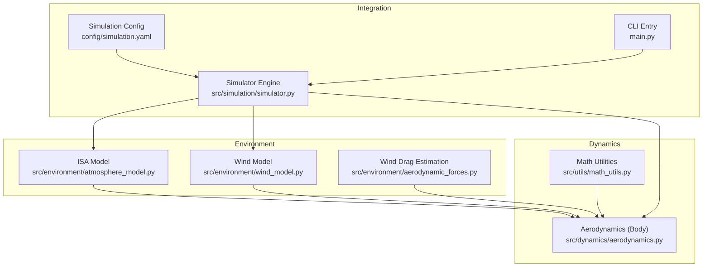
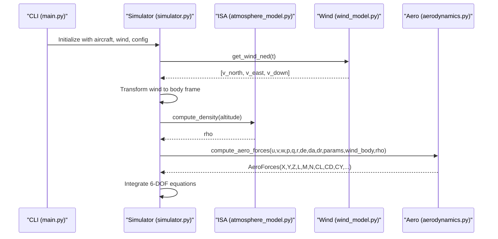
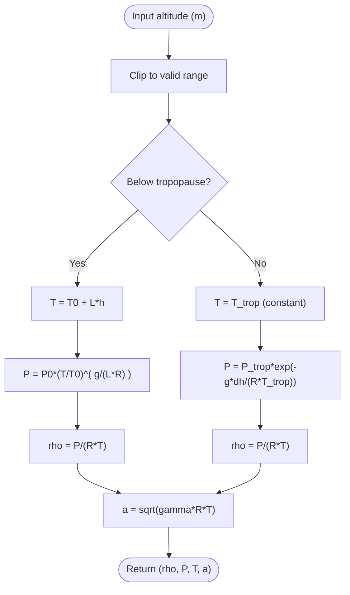
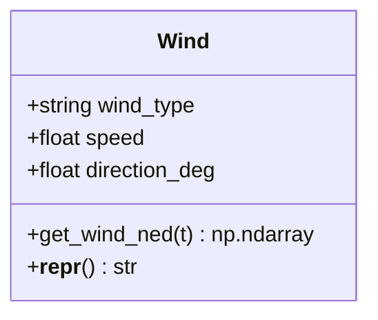
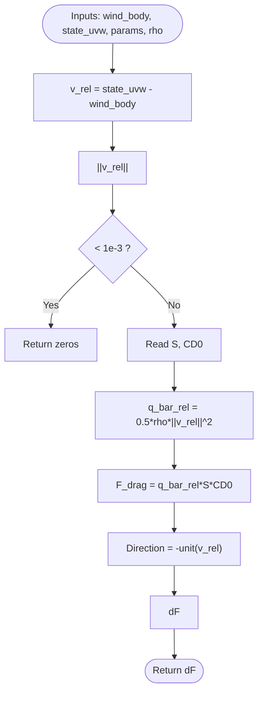
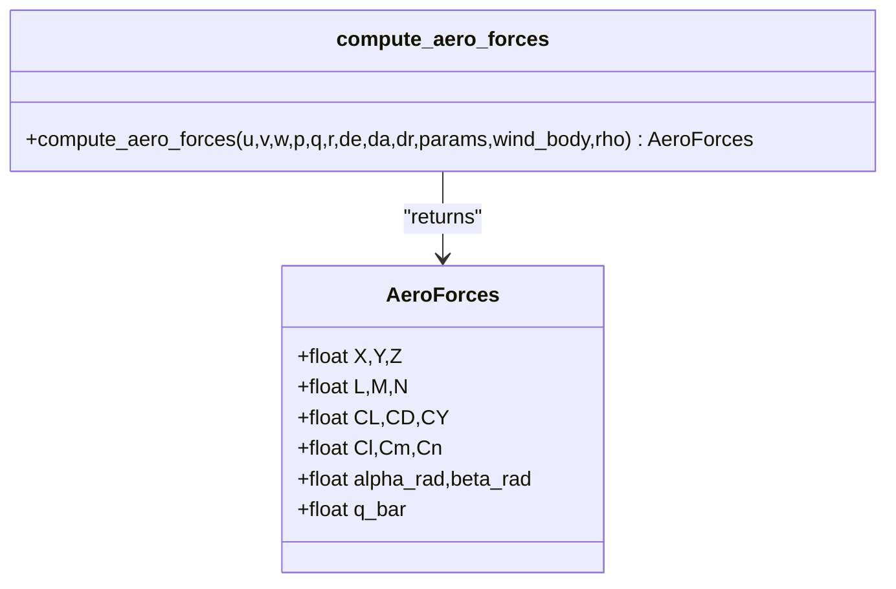
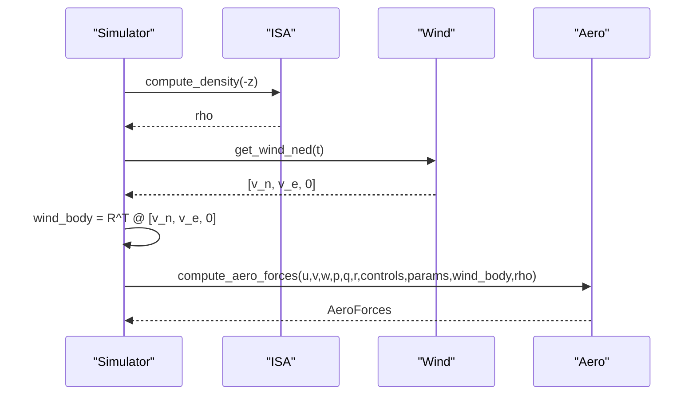
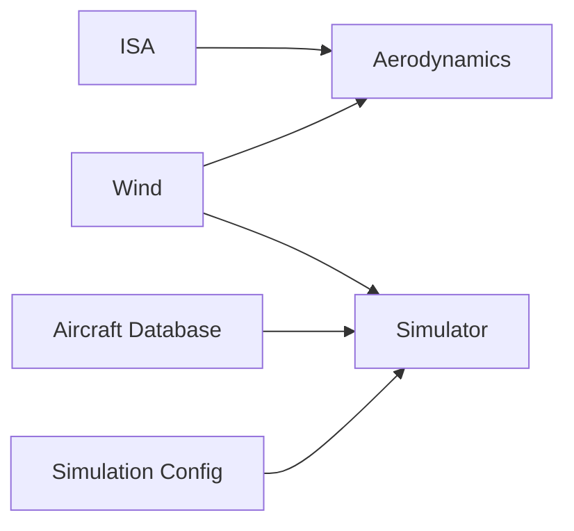

# Atmospheric Models

<cite>
**Referenced Files in This Document**
- [atmosphere_model.py](file://src/environment/atmosphere_model.py)
- [wind_model.py](file://src/environment/wind_model.py)
- [aerodynamic_forces.py](file://src/environment/aerodynamic_forces.py)
- [aerodynamics.py](file://src/dynamics/aerodynamics.py)
- [math_utils.py](file://src/utils/math_utils.py)
- [aircraft_database.py](file://src/models/aircraft_database.py)
- [simulation.yaml](file://config/simulation.yaml)
- [simulator.py](file://src/simulation/simulator.py)
- [main.py](file://main.py)
- [test_dynamics.py](file://tests/test_dynamics.py)
</cite>

## Table of Contents
1. [Introduction](#introduction)
2. [Project Structure](#project-structure)
3. [Core Components](#core-components)
4. [Architecture Overview](#architecture-overview)
5. [Detailed Component Analysis](#detailed-component-analysis)
6. [Dependency Analysis](#dependency-analysis)
7. [Performance Considerations](#performance-considerations)
8. [Troubleshooting Guide](#troubleshooting-guide)
9. [Conclusion](#conclusion)
10. [Appendices](#appendices)

## Introduction
This document explains the atmospheric modeling system used in the fixed-wing simulation framework. It focuses on the International Standard Atmosphere (ISA) implementation for computing temperature, pressure, density, and speed of sound across altitudes, and demonstrates how these environmental conditions integrate with aerodynamic calculations and control behavior. It also covers wind modeling, atmospheric property interpolation, altitude profiling, and practical guidance for environmental condition analysis.

## Project Structure
The atmospheric and environmental subsystems are organized around three pillars:
- Environment: ISA model and wind models
- Dynamics: Aerodynamic force and moment computation in body coordinates
- Simulation: Orchestration of environment queries and aerodynamic computations during integration

**Diagram sources**
- [atmosphere_model.py](file://src/environment/atmosphere_model.py#L1-L77)
- [wind_model.py](file://src/environment/wind_model.py#L1-L113)
- [aerodynamic_forces.py](file://src/environment/aerodynamic_forces.py#L1-L54)
- [aerodynamics.py](file://src/dynamics/aerodynamics.py#L1-L148)
- [math_utils.py](file://src/utils/math_utils.py#L1-L124)
- [simulation.yaml](file://config/simulation.yaml#L1-L30)
- [simulator.py](file://src/simulation/simulator.py#L1-L642)
- [main.py](file://main.py#L1-L145)

**Section sources**
- [atmosphere_model.py](file://src/environment/atmosphere_model.py#L1-L77)
- [wind_model.py](file://src/environment/wind_model.py#L1-L113)
- [aerodynamic_forces.py](file://src/environment/aerodynamic_forces.py#L1-L54)
- [aerodynamics.py](file://src/dynamics/aerodynamics.py#L1-L148)
- [math_utils.py](file://src/utils/math_utils.py#L1-L124)
- [simulation.yaml](file://config/simulation.yaml#L1-L30)
- [simulator.py](file://src/simulation/simulator.py#L1-L642)
- [main.py](file://main.py#L1-L145)

## Core Components
- ISA Model: Computes temperature, pressure, density, and speed of sound as functions of altitude, covering the troposphere and lower stratosphere.
- Wind Model: Provides wind vectors in NED coordinates for a given time, supporting static, sinusoidal, and random-sine wind fields.
- Aerodynamic Forces: Computes body-axis forces and moments from airspeed, angles, control deflections, wind, and density.
- Math Utilities: Supplies angle wrapping, rotation matrices, and dynamic pressure computation.
- Aircraft Database: Supplies aircraft geometry, stability derivatives, and derived quantities used by dynamics.

**Section sources**
- [atmosphere_model.py](file://src/environment/atmosphere_model.py#L24-L76)
- [wind_model.py](file://src/environment/wind_model.py#L18-L113)
- [aerodynamics.py](file://src/dynamics/aerodynamics.py#L35-L147)
- [math_utils.py](file://src/utils/math_utils.py#L107-L123)
- [aircraft_database.py](file://src/models/aircraft_database.py#L143-L166)

## Architecture Overview
The simulation orchestrates environment queries and aerodynamic computations at each integration step. The ISA model supplies density for dynamic-pressure-based force computations, while the wind model supplies the NED wind vector converted to body coordinates for relative-airspeed calculations.

**Diagram sources**
- [main.py](file://main.py#L98-L141)
- [simulator.py](file://src/simulation/simulator.py#L329-L338)
- [atmosphere_model.py](file://src/environment/atmosphere_model.py#L48-L52)
- [wind_model.py](file://src/environment/wind_model.py#L76-L108)
- [aerodynamics.py](file://src/dynamics/aerodynamics.py#L35-L147)

## Detailed Component Analysis

### International Standard Atmosphere (ISA) Model
- Valid layers: Troposphere (0–11 km) with a constant negative temperature lapse rate; Lower Stratosphere (11–20 km) modeled as isothermal.
- Core functions:
  - Temperature as a function of altitude with safe clipping to a realistic range.
  - Pressure computed via hydrostatic and adiabatic relations in the troposphere and exponential decay in the stratospere.
  - Density from the ideal gas law using computed pressure and temperature.
  - Speed of sound from thermodynamic properties.
  - Convenience aggregator returning density, pressure, temperature, and speed of sound.

**Diagram sources**
- [atmosphere_model.py](file://src/environment/atmosphere_model.py#L24-L76)

**Section sources**
- [atmosphere_model.py](file://src/environment/atmosphere_model.py#L10-L21)
- [atmosphere_model.py](file://src/environment/atmosphere_model.py#L24-L76)

### Wind Field Model
- Supported types: NONE, FIXED, SINE, RANDOMSINE.
- FIXED: constant wind vector in NED based on magnitude and “from” direction.
- SINE: sum of sinusoidal harmonics per axis.
- RANDOMSINE: mean plus random-amplitude sinusoidal fluctuations per axis.
- Outputs a wind vector in NED at any time t.

**Diagram sources**
- [wind_model.py](file://src/environment/wind_model.py#L18-L113)

**Section sources**
- [wind_model.py](file://src/environment/wind_model.py#L18-L113)
- [simulation.yaml](file://config/simulation.yaml#L22-L25)

### Wind-Induced Additional Drag Estimation
- Purpose: Estimate incremental body-frame drag caused by relative wind speed beyond baseline aerodynamics.
- Method: Uses a simplified quadratic model based on relative velocity norm, reference area, and a baseline drag coefficient.
- Threshold: If relative speed is negligible, returns zero force.

**Diagram sources**
- [aerodynamic_forces.py](file://src/environment/aerodynamic_forces.py#L13-L53)

**Section sources**
- [aerodynamic_forces.py](file://src/environment/aerodynamic_forces.py#L13-L53)

### Aerodynamic Forces in Body Coordinates
- Inputs: body-frame velocities, angular rates, control deflections, wind body vector, density.
- Computation:
  - Relative airspeed minus wind to obtain true airspeed vector.
  - Compute angle-of-attack and sideslip-angle.
  - Compute non-dimensional coefficients using linear/semi-linear functions of angles and reduced rates.
  - Convert coefficients to body-axis forces and moments using dynamic pressure and geometry.
- Outputs: A structured container holding forces, moments, coefficients, and dynamic pressure.

**Diagram sources**
- [aerodynamics.py](file://src/dynamics/aerodynamics.py#L19-L147)
- [math_utils.py](file://src/utils/math_utils.py#L107-L123)

**Section sources**
- [aerodynamics.py](file://src/dynamics/aerodynamics.py#L35-L147)
- [math_utils.py](file://src/utils/math_utils.py#L107-L123)

### Integration Between Atmosphere and Aerodynamics
- The simulator queries the ISA model for density at the current altitude and passes it to the aerodynamic computation.
- Wind is transformed from NED to body coordinates and subtracted from body velocities to form the relative airspeed used in angle and coefficient computations.
- The resulting AeroForces drive the 6-DOF equations of motion.

**Diagram sources**
- [simulator.py](file://src/simulation/simulator.py#L329-L338)
- [atmosphere_model.py](file://src/environment/atmosphere_model.py#L48-L52)
- [wind_model.py](file://src/environment/wind_model.py#L76-L108)
- [aerodynamics.py](file://src/dynamics/aerodynamics.py#L68-L77)

**Section sources**
- [simulator.py](file://src/simulation/simulator.py#L329-L338)
- [aircraft_database.py](file://src/models/aircraft_database.py#L143-L166)

## Dependency Analysis
- Environment depends on:
  - ISA model for density and derived quantities.
  - Wind model for NED wind vectors.
- Dynamics depends on:
  - Math utilities for angles and dynamic pressure.
  - Aircraft parameters for geometry and stability derivatives.
- Simulation ties everything together, reading configuration and orchestrating integration.

**Diagram sources**
- [simulator.py](file://src/simulation/simulator.py#L159-L163)
- [aircraft_database.py](file://src/models/aircraft_database.py#L143-L166)
- [simulation.yaml](file://config/simulation.yaml#L22-L25)

**Section sources**
- [simulator.py](file://src/simulation/simulator.py#L159-L163)
- [aircraft_database.py](file://src/models/aircraft_database.py#L143-L166)
- [simulation.yaml](file://config/simulation.yaml#L22-L25)

## Performance Considerations
- ISA model: Pure scalar/vector arithmetic with minimal branching; low computational cost suitable for real-time simulation.
- Wind model: SINE/RANDOMSINE involve multiple sinusoids; precomputed frequencies/phases reduce runtime overhead.
- Numerical stability: ISA clips altitude inputs; dynamics clamps airspeed and angles to avoid singularities.
- Memory: Wind model caches precomputed NED unit vectors and sinusoidal parameters.

[No sources needed since this section provides general guidance]

## Troubleshooting Guide
- ISA anomalies:
  - Verify altitude is within the supported range; the model clips inputs.
  - If pressure or density appear invalid, check that temperature remains positive.
- Wind configuration:
  - Ensure wind type is one of the supported values.
  - Confirm direction and speed align with meteorological conventions.
  - RANDOMSINE requires proper initialization of amplitudes and means.
- Aerodynamics:
  - Very small relative airspeed leads to negligible additional wind drag; confirm nonzero relative motion.
  - Angle computations protect against numerical issues; inspect input velocity components.
- Simulation configuration:
  - Wind type, speed, and direction are controlled by the simulation configuration; command-line overrides are supported.

**Section sources**
- [atmosphere_model.py](file://src/environment/atmosphere_model.py#L30-L34)
- [wind_model.py](file://src/environment/wind_model.py#L39-L41)
- [aerodynamic_forces.py](file://src/environment/aerodynamic_forces.py#L42-L43)
- [math_utils.py](file://src/utils/math_utils.py#L117-L118)
- [simulation.yaml](file://config/simulation.yaml#L22-L25)
- [main.py](file://main.py#L63-L67)

## Conclusion
The ISA-based atmospheric model provides accurate and efficient temperature, pressure, density, and speed of sound profiles across the troposphere and lower stratosphere. Combined with flexible wind modeling and precise body-axis aerodynamic computations, the system supports robust fixed-wing simulations. The integration pipeline ensures that environmental conditions directly influence dynamic behavior, enabling realistic performance and control analysis.

[No sources needed since this section summarizes without analyzing specific files]

## Appendices

### Altitude-Dependent Property Queries
- Single-property queries:
  - Temperature: [compute_temperature](file://src/environment/atmosphere_model.py#L24-L34)
  - Pressure: [compute_pressure](file://src/environment/atmosphere_model.py#L37-L45)
  - Density: [compute_density](file://src/environment/atmosphere_model.py#L48-L52)
  - Speed of sound: [compute_speed_of_sound](file://src/environment/atmosphere_model.py#L55-L58)
- Combined query:
  - [atmosphere](file://src/environment/atmosphere_model.py#L61-L76)

**Section sources**
- [atmosphere_model.py](file://src/environment/atmosphere_model.py#L24-L76)

### ISA Parameters and Formulas
- Baseline parameters: sea-level temperature, pressure, density, gas constant, specific heat ratio, tropospheric lapse rate, tropopause height.
- Temperature and pressure:
  - Troposphere: T(h)=T0+L·h; P(h)=P0·(T/T0)^(g/(L·R))
  - Stratosphere: T=constant; P(h)=P_trop·exp(-g·Δh/(R·T_trop))
- Derived quantities:
  - Density: ρ=P/(R·T); Speed of sound: a=√(γ·R·T)

**Section sources**
- [atmosphere_model.py](file://src/environment/atmosphere_model.py#L10-L21)
- [atmosphere_model.py](file://src/environment/atmosphere_model.py#L37-L58)

### Atmospheric Effects on Performance and Control
- Lift and drag scale with dynamic pressure q_bar=0.5·ρ·V^2; density reduction reduces aerodynamic forces, requiring higher speed or angle of attack to maintain load.
- Flight envelope changes with altitude: stall speed increases, maximum lift-drag ratio varies.
- Control effectiveness and moments depend on density; control gains may need adjustment.

**Section sources**
- [aerodynamics.py](file://src/dynamics/aerodynamics.py#L76-L77)
- [math_utils.py](file://src/utils/math_utils.py#L121-L123)

### Example Workflows and Validation
- Dynamic pressure verification:
  - Sea-level at 30 m/s: [dynamic_pressure test](file://tests/test_dynamics.py#L190-L194)
- Wind-induced effects:
  - Demonstrated by computing relative airspeed and verifying increased dynamic pressure under headwind in aerodynamics tests: [wind effect test](file://tests/test_dynamics.py#L180-L188)

**Section sources**
- [test_dynamics.py](file://tests/test_dynamics.py#L190-L194)
- [test_dynamics.py](file://tests/test_dynamics.py#L180-L188)