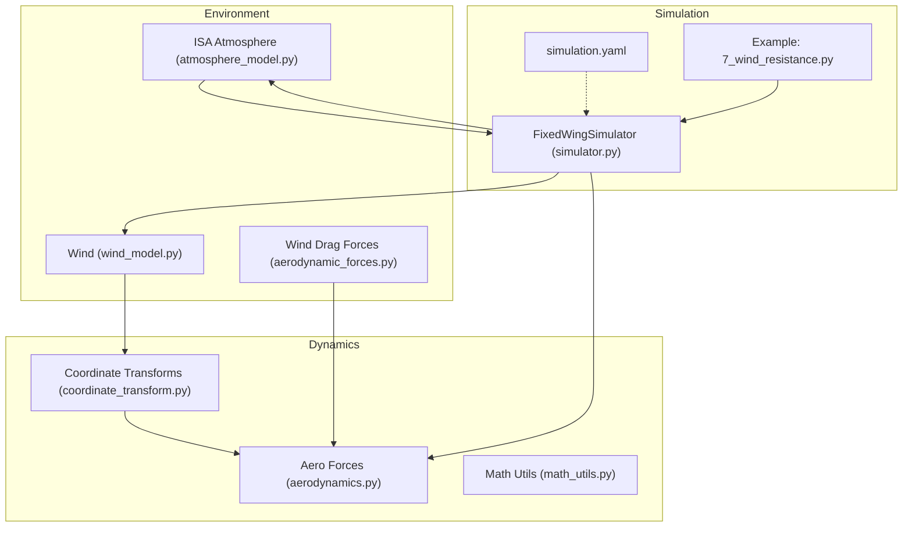
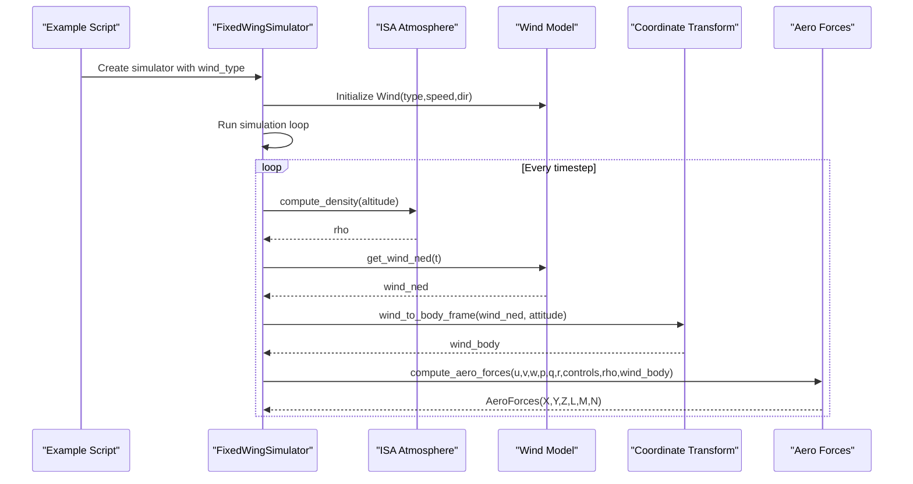
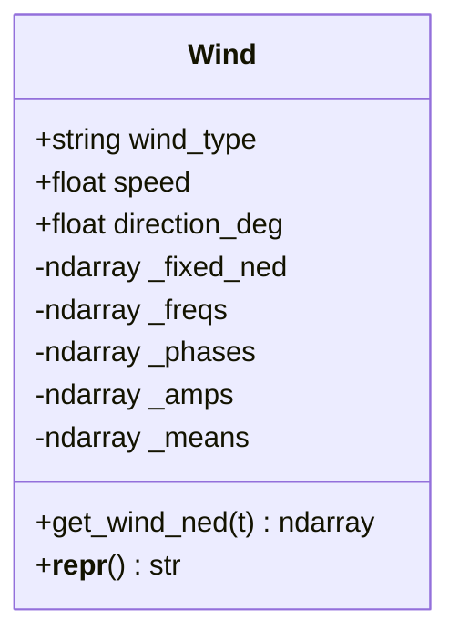
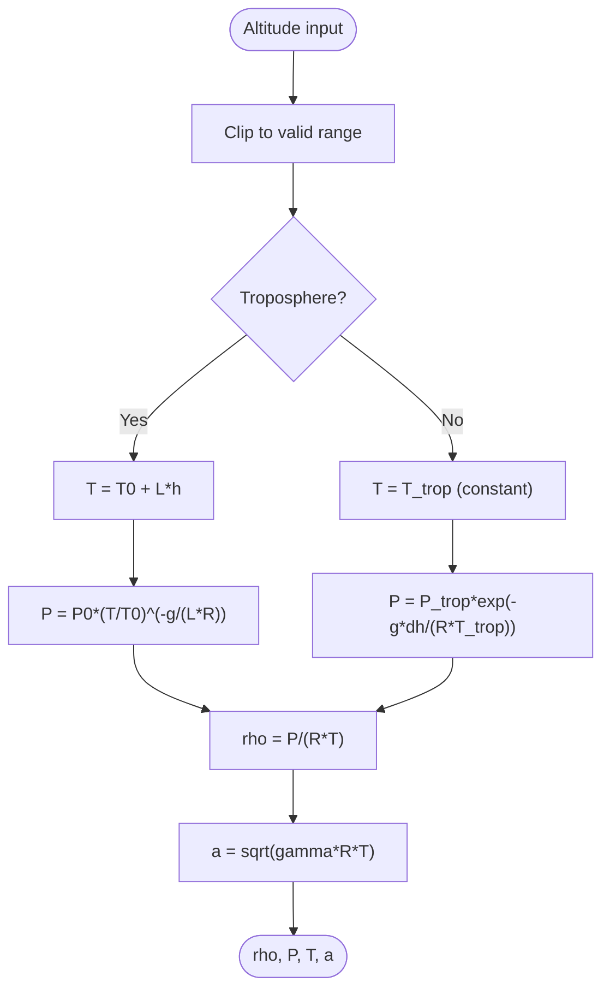
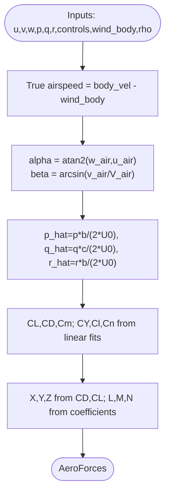
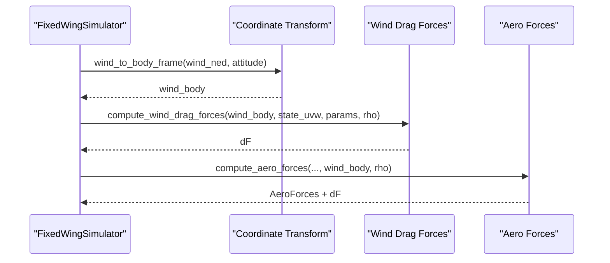
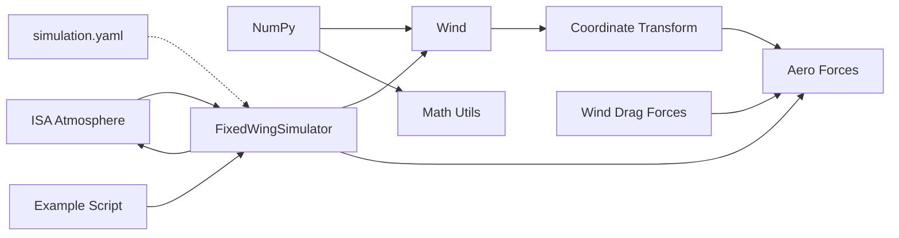

# Environment Modeling

<cite>
**Referenced Files in This Document**
- [wind_model.py](file://src/environment/wind_model.py)
- [atmosphere_model.py](file://src/environment/atmosphere_model.py)
- [aerodynamic_forces.py](file://src/environment/aerodynamic_forces.py)
- [aerodynamics.py](file://src/dynamics/aerodynamics.py)
- [coordinate_transform.py](file://src/dynamics/coordinate_transform.py)
- [math_utils.py](file://src/utils/math_utils.py)
- [simulator.py](file://src/simulation/simulator.py)
- [simulation.yaml](file://config/simulation.yaml)
- [7_wind_resistance.py](file://examples/7_wind_resistance.py)
</cite>

## Table of Contents
1. [Introduction](#introduction)
2. [Project Structure](#project-structure)
3. [Core Components](#core-components)
4. [Architecture Overview](#architecture-overview)
5. [Detailed Component Analysis](#detailed-component-analysis)
6. [Dependency Analysis](#dependency-analysis)
7. [Performance Considerations](#performance-considerations)
8. [Troubleshooting Guide](#troubleshooting-guide)
9. [Conclusion](#conclusion)
10. [Appendices](#appendices)

## Introduction
This document explains the environmental modeling system used in the fixed-wing simulation framework. It covers wind field generation (fixed, sine, and random sine models), atmospheric models for density, pressure, and temperature, and aerodynamic force computations that incorporate environmental conditions. It also details how wind affects aircraft performance and control, provides examples of wind modeling and turbulence simulation, and documents the integration between environment models and aerodynamic calculations.

## Project Structure
The environment modeling system spans three primary areas:
- Environment: wind model and standard atmosphere
- Dynamics: aerodynamic force/moment computation and coordinate transforms
- Simulation: orchestration of modules and configuration

**Diagram sources**
- [wind_model.py](file://src/environment/wind_model.py#L18-L112)
- [atmosphere_model.py](file://src/environment/atmosphere_model.py#L24-L76)
- [aerodynamic_forces.py](file://src/environment/aerodynamic_forces.py#L13-L53)
- [aerodynamics.py](file://src/dynamics/aerodynamics.py#L35-L147)
- [coordinate_transform.py](file://src/dynamics/coordinate_transform.py#L39-L70)
- [math_utils.py](file://src/utils/math_utils.py#L107-L124)
- [simulator.py](file://src/simulation/simulator.py#L130-L200)
- [simulation.yaml](file://config/simulation.yaml#L22-L25)
- [7_wind_resistance.py](file://examples/7_wind_resistance.py#L24-L40)

**Section sources**
- [wind_model.py](file://src/environment/wind_model.py#L1-L113)
- [atmosphere_model.py](file://src/environment/atmosphere_model.py#L1-L77)
- [aerodynamic_forces.py](file://src/environment/aerodynamic_forces.py#L1-L54)
- [aerodynamics.py](file://src/dynamics/aerodynamics.py#L1-L148)
- [coordinate_transform.py](file://src/dynamics/coordinate_transform.py#L1-L70)
- [math_utils.py](file://src/utils/math_utils.py#L1-L124)
- [simulator.py](file://src/simulation/simulator.py#L1-L200)
- [simulation.yaml](file://config/simulation.yaml#L1-L30)
- [7_wind_resistance.py](file://examples/7_wind_resistance.py#L1-L69)

## Core Components
- Wind model: Generates NED wind vectors for four modes—none, fixed, sine, and random sine—supporting meteorological “FROM” direction and NED convention.
- Standard atmosphere (ISA): Computes temperature, pressure, density, and speed of sound as functions of altitude, covering the troposphere and lower stratosphere.
- Aerodynamic force computation: Computes body-axis forces and moments from airspeed, angles, angular rates, control surface deflections, and wind effects.
- Wind-induced drag forces: Estimates incremental body-axis drag due to relative wind speed for sensitivity and disturbance analysis.
- Coordinate transforms: Converts between NED and body frames using 3-2-1 Euler angles.
- Simulation orchestrator: Integrates environment and dynamics modules, manages configuration, and runs closed-loop simulations.

**Section sources**
- [wind_model.py](file://src/environment/wind_model.py#L18-L112)
- [atmosphere_model.py](file://src/environment/atmosphere_model.py#L24-L76)
- [aerodynamics.py](file://src/dynamics/aerodynamics.py#L35-L147)
- [aerodynamic_forces.py](file://src/environment/aerodynamic_forces.py#L13-L53)
- [coordinate_transform.py](file://src/dynamics/coordinate_transform.py#L39-L70)
- [simulator.py](file://src/simulation/simulator.py#L130-L200)

## Architecture Overview
The environment modeling pipeline integrates wind and atmospheric data into the aerodynamic computation chain. Wind is generated in NED coordinates, transformed to body frame, and combined with aircraft velocity to form true airspeed. Density from the atmosphere feeds dynamic pressure and force computations.

**Diagram sources**
- [7_wind_resistance.py](file://examples/7_wind_resistance.py#L24-L40)
- [simulator.py](file://src/simulation/simulator.py#L130-L200)
- [atmosphere_model.py](file://src/environment/atmosphere_model.py#L48-L76)
- [wind_model.py](file://src/environment/wind_model.py#L76-L108)
- [coordinate_transform.py](file://src/dynamics/coordinate_transform.py#L39-L53)
- [aerodynamics.py](file://src/dynamics/aerodynamics.py#L35-L147)

## Detailed Component Analysis

### Wind Field Generation
- Types:
  - NONE: returns zero wind vector.
  - FIXED: constant wind vector computed from “FROM” direction and speed in NED coordinates.
  - SINE: sum of sinusoidal harmonics per axis with randomly sampled frequencies (0.1–0.5 Hz), phases, and equal amplitudes.
  - RANDOMSINE: adds independent mean and randomized amplitudes per axis to simulate slow-turbulence-like disturbances.
- Implementation highlights:
  - “FROM” direction converts to a body-moving direction; NED unit vector multiplied by speed yields the fixed component.
  - SINE and RANDOMSINE pre-generate frequency, phase, and amplitude matrices for efficiency.
  - get_wind_ned evaluates the chosen model at time t and returns a 3D NED vector.

**Diagram sources**
- [wind_model.py](file://src/environment/wind_model.py#L18-L112)

**Section sources**
- [wind_model.py](file://src/environment/wind_model.py#L18-L112)

### Atmospheric Models (ISA)
- Coverage: Troposphere (0–11 km) and lower stratosphere (11–20 km).
- Functions:
  - Temperature as a piecewise function (linear decrease in troposphere, constant in lower stratosphere).
  - Pressure derived from temperature and hydrostatic/adiabatic relations.
  - Density from ideal gas law using pressure and temperature.
  - Speed of sound depends only on temperature and ratio of specific heats.
- Usage:
  - Single queries for T, P, rho, a.
  - Combined query returning all four quantities.

**Diagram sources**
- [atmosphere_model.py](file://src/environment/atmosphere_model.py#L24-L76)

**Section sources**
- [atmosphere_model.py](file://src/environment/atmosphere_model.py#L24-L76)

### Aerodynamic Force Computations Incorporating Environment
- Inputs:
  - Body-frame velocities (u, v, w), angular rates (p, q, r), control surface deflections (elevator, aileron, rudder), wind body velocity, and air density.
- Steps:
  - Subtract wind body from body velocity to obtain true airspeed vector.
  - Compute angle of attack and sideslip angle using math utilities.
  - Non-dimensionalize angular rates using reference length and airspeed.
  - Evaluate linear combinations of stability derivatives for force and moment coefficients.
  - Compute body-axis forces and moments using dynamic pressure and reference area.
- Outputs:
  - AeroForces container with X, Y, Z, L, M, N and non-dimensional coefficients.

**Diagram sources**
- [aerodynamics.py](file://src/dynamics/aerodynamics.py#L35-L147)
- [math_utils.py](file://src/utils/math_utils.py#L107-L124)

**Section sources**
- [aerodynamics.py](file://src/dynamics/aerodynamics.py#L35-L147)
- [math_utils.py](file://src/utils/math_utils.py#L107-L124)

### Wind Effects on Aircraft Performance and Control
- Relative airspeed:
  - True airspeed vector equals body velocity minus wind body velocity.
- Disturbance modeling:
  - Wind-induced drag increment computed via a simplified quadratic drag model against relative velocity.
- Control implications:
  - Wind alters angle of attack and sideslip, changing lift, drag, and side force.
  - Random sine wind introduces periodic disturbances suitable for evaluating control system robustness.
- Example scenario:
  - FBW_B mode under RANDOMSINE wind demonstrates disturbance rejection and steady altitude/speed tracking.

**Diagram sources**
- [coordinate_transform.py](file://src/dynamics/coordinate_transform.py#L39-L53)
- [aerodynamic_forces.py](file://src/environment/aerodynamic_forces.py#L13-L53)
- [aerodynamics.py](file://src/dynamics/aerodynamics.py#L35-L147)

**Section sources**
- [coordinate_transform.py](file://src/dynamics/coordinate_transform.py#L39-L70)
- [aerodynamic_forces.py](file://src/environment/aerodynamic_forces.py#L13-L53)
- [7_wind_resistance.py](file://examples/7_wind_resistance.py#L24-L40)

### Wind Modeling Examples and Turbulence Simulation
- Example script:
  - Creates a simulator configured for FBW_B mode with RANDOMSINE wind.
  - Adds waypoints to maintain straight and level flight.
  - Runs closed-loop simulation and plots altitude and airspeed deviations.
- Turbulence characteristics:
  - Frequency band 0.1–0.5 Hz approximates slow atmospheric turbulence.
  - Random phases and amplitudes produce stochastic disturbances with bounded mean.

**Section sources**
- [7_wind_resistance.py](file://examples/7_wind_resistance.py#L24-L40)
- [wind_model.py](file://src/environment/wind_model.py#L58-L71)

### Environmental Parameter Tuning
- Wind configuration:
  - wind_type, wind_speed, wind_direction_deg are configurable via simulation.yaml and/or constructor overrides.
- Simulation parameters:
  - dt, duration, integrator, tolerances, and initial conditions are managed centrally.
- Practical tuning tips:
  - Increase wind speed gradually to assess control authority margins.
  - Adjust frequency range and amplitude spread to emulate different atmospheric regimes.
  - Monitor altitude and airspeed deviations to evaluate disturbance rejection.

**Section sources**
- [simulation.yaml](file://config/simulation.yaml#L22-L25)
- [simulator.py](file://src/simulation/simulator.py#L130-L200)

## Dependency Analysis
- Wind model depends on NumPy for numerical operations and random number generation.
- Aerodynamic computation relies on math utilities for angles and dynamic pressure.
- Simulation orchestrator composes environment, dynamics, and control modules.
- Configuration drives initialization and runtime behavior.

**Diagram sources**
- [wind_model.py](file://src/environment/wind_model.py#L14-L15)
- [math_utils.py](file://src/utils/math_utils.py#L1-L124)
- [simulator.py](file://src/simulation/simulator.py#L130-L200)
- [aerodynamics.py](file://src/dynamics/aerodynamics.py#L35-L147)
- [aerodynamic_forces.py](file://src/environment/aerodynamic_forces.py#L13-L53)
- [simulation.yaml](file://config/simulation.yaml#L22-L25)
- [7_wind_resistance.py](file://examples/7_wind_resistance.py#L24-L40)

**Section sources**
- [wind_model.py](file://src/environment/wind_model.py#L14-L15)
- [math_utils.py](file://src/utils/math_utils.py#L1-L124)
- [simulator.py](file://src/simulation/simulator.py#L130-L200)
- [aerodynamics.py](file://src/dynamics/aerodynamics.py#L35-L147)
- [aerodynamic_forces.py](file://src/environment/aerodynamic_forces.py#L13-L53)
- [simulation.yaml](file://config/simulation.yaml#L22-L25)
- [7_wind_resistance.py](file://examples/7_wind_resistance.py#L24-L40)

## Performance Considerations
- Wind model:
  - Constant-time evaluation; precomputed frequency, phase, and amplitude matrices minimize per-step cost.
- Atmosphere model:
  - Scalar/vector arithmetic with minimal branching; fast and suitable for real-time simulation.
- Aerodynamics:
  - Pure arithmetic and a few transcendental functions; negligible overhead compared to ODE integration.
- Numerical stability:
  - Angle wrapping and small-number clamps prevent singularities in sideslip and dynamic pressure.
- Real-time feasibility:
  - Integrator selection and tolerances in configuration balance accuracy and speed.

[No sources needed since this section provides general guidance]

## Troubleshooting Guide
- Wind type errors:
  - Ensure wind_type is one of the supported values; otherwise, initialization raises an error.
- Unexpected zero wind:
  - Verify wind_type and parameters; confirm direction_deg conversion and NED orientation.
- Excessive oscillations or divergence:
  - Reduce wind speed or frequency; adjust control gains; check trim and initial conditions.
- Incorrect airspeed or angles:
  - Confirm wind_body conversion and subtraction from body velocity.
- Density-related anomalies:
  - Validate altitude sign convention and ISA limits; ensure rho remains finite.

**Section sources**
- [wind_model.py](file://src/environment/wind_model.py#L39-L41)
- [aerodynamic_forces.py](file://src/environment/aerodynamic_forces.py#L42-L43)
- [math_utils.py](file://src/utils/math_utils.py#L117-L118)
- [simulation.yaml](file://config/simulation.yaml#L22-L25)

## Conclusion
The environment modeling system integrates a flexible wind field generator with an ISA-based atmosphere model and robust aerodynamic computations. The Wind class supports practical scenarios from calm to turbulent conditions, while the ISA model supplies essential thermodynamic properties. Together with coordinate transforms and disturbance modeling, the system enables realistic closed-loop simulations and effective assessment of control performance under varying atmospheric conditions.

[No sources needed since this section summarizes without analyzing specific files]

## Appendices

### Wind Field Types and Parameters
- NONE: zero wind vector.
- FIXED: constant NED wind vector from “FROM” direction and speed.
- SINE: sinusoidal harmonics per axis with uniform amplitudes and random phases/frequencies.
- RANDOMSINE: adds axis-wise means and randomized amplitudes to simulate slow turbulence.

**Section sources**
- [wind_model.py](file://src/environment/wind_model.py#L7-L11)
- [wind_model.py](file://src/environment/wind_model.py#L58-L71)
- [wind_model.py](file://src/environment/wind_model.py#L76-L108)

### Atmospheric Parameters and Formulas
- Troposphere: temperature decreases linearly with altitude; pressure follows an exponential relationship.
- Stratosphere: constant temperature with exponential pressure decay.
- Density and speed of sound derived from pressure, temperature, and gas constants.

**Section sources**
- [atmosphere_model.py](file://src/environment/atmosphere_model.py#L10-L21)
- [atmosphere_model.py](file://src/environment/atmosphere_model.py#L37-L58)

### Impact of Atmospheric Conditions on Flight Dynamics
- Density variations affect dynamic pressure and thus lift/drag scaling.
- Altitude-dependent performance impacts stall speed, maximum lift/drag ratio, and control effectiveness.
- Control system tuning often requires adaptation to density changes.

**Section sources**
- [aerodynamics.py](file://src/dynamics/aerodynamics.py#L76-L77)
- [math_utils.py](file://src/utils/math_utils.py#L121-L123)