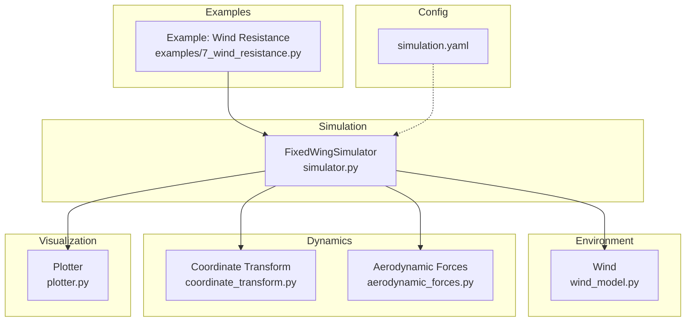
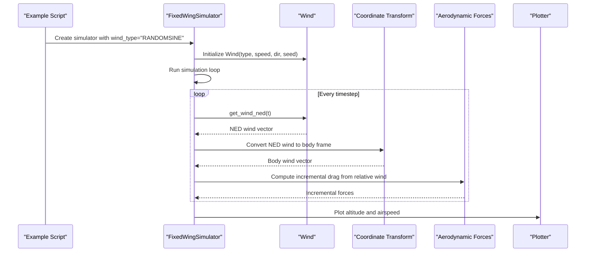
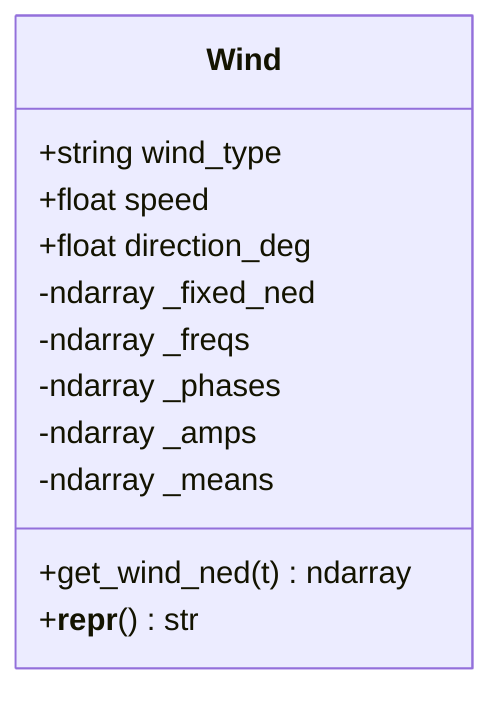
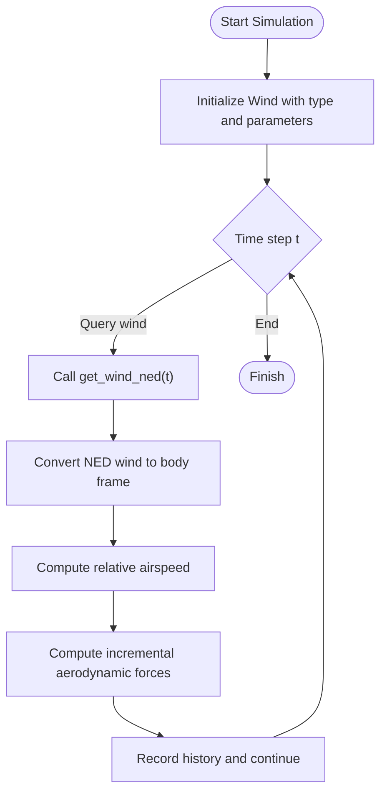
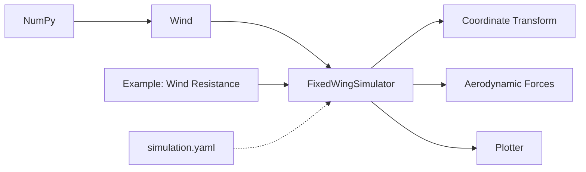

# Wind Field Models

<cite>
**Referenced Files in This Document**
- [src/environment/wind_model.py](file://src/environment/wind_model.py)
- [src/simulation/simulator.py](file://src/simulation/simulator.py)
- [src/dynamics/coordinate_transform.py](file://src/dynamics/coordinate_transform.py)
- [src/environment/aerodynamic_forces.py](file://src/environment/aerodynamic_forces.py)
- [examples/7_wind_resistance.py](file://examples/7_wind_resistance.py)
- [config/simulation.yaml](file://config/simulation.yaml)
- [src/visualization/plotter.py](file://src/visualization/plotter.py)
- [tests/test_integration.py](file://tests/test_integration.py)
- [src/utils/math_utils.py](file://src/utils/math_utils.py)
</cite>

## Table of Contents
1. [Introduction](#introduction)
2. [Project Structure](#project-structure)
3. [Core Components](#core-components)
4. [Architecture Overview](#architecture-overview)
5. [Detailed Component Analysis](#detailed-component-analysis)
6. [Dependency Analysis](#dependency-analysis)
7. [Performance Considerations](#performance-considerations)
8. [Troubleshooting Guide](#troubleshooting-guide)
9. [Conclusion](#conclusion)
10. [Appendices](#appendices)

## Introduction
This document explains the wind field modeling components for fixed-wing simulation. It focuses on the Wind class implementation, the four supported wind models (NONE, FIXED, SINE, RANDOMSINE), NED coordinate conventions, wind direction semantics (“FROM” direction), and how wind models integrate with aircraft dynamics and control systems. It also covers mathematical formulations, parameter tuning guidelines, practical applications, and examples of wind field generation and analysis.

## Project Structure
Wind field modeling is implemented within the environment module and integrated into the simulation pipeline. The key relationships are:
- Wind class generates NED wind vectors at each time step.
- FixedWingSimulator constructs Wind instances and queries wind vectors during simulation loops.
- Coordinate transforms convert NED wind to body frame for computing relative airspeed.
- Aerodynamic forces module computes incremental drag due to relative wind.
- Examples and tests demonstrate usage and validate stability under wind disturbances.

**Diagram sources**
- [src/environment/wind_model.py](file://src/environment/wind_model.py#L18-L112)
- [src/simulation/simulator.py](file://src/simulation/simulator.py#L130-L200)
- [src/dynamics/coordinate_transform.py](file://src/dynamics/coordinate_transform.py#L39-L70)
- [src/environment/aerodynamic_forces.py](file://src/environment/aerodynamic_forces.py#L13-L54)
- [examples/7_wind_resistance.py](file://examples/7_wind_resistance.py#L24-L32)
- [config/simulation.yaml](file://config/simulation.yaml#L22-L25)

**Section sources**
- [src/environment/wind_model.py](file://src/environment/wind_model.py#L1-L112)
- [src/simulation/simulator.py](file://src/simulation/simulator.py#L130-L200)
- [src/dynamics/coordinate_transform.py](file://src/dynamics/coordinate_transform.py#L39-L70)
- [src/environment/aerodynamic_forces.py](file://src/environment/aerodynamic_forces.py#L13-L54)
- [examples/7_wind_resistance.py](file://examples/7_wind_resistance.py#L1-L69)
- [config/simulation.yaml](file://config/simulation.yaml#L22-L25)

## Core Components
- Wind class: Provides four wind models and returns NED wind vectors. Supports initialization parameters (type, speed, direction, seed) and exposes get_wind_ned(t).
- FixedWingSimulator: Reads configuration or explicit parameters to instantiate Wind and integrates wind into the simulation loop.
- Coordinate transform: Converts NED wind to body frame using Euler angles for computing relative airspeed.
- Aerodynamic forces: Computes incremental drag forces due to relative wind for sensitivity and disturbance analysis.
- Example and visualization: Demonstrates FBW_B flight under RANDOMSINE wind and plots altitude and airspeed response.

**Section sources**
- [src/environment/wind_model.py](file://src/environment/wind_model.py#L18-L112)
- [src/simulation/simulator.py](file://src/simulation/simulator.py#L130-L200)
- [src/dynamics/coordinate_transform.py](file://src/dynamics/coordinate_transform.py#L39-L70)
- [src/environment/aerodynamic_forces.py](file://src/environment/aerodynamic_forces.py#L13-L54)
- [examples/7_wind_resistance.py](file://examples/7_wind_resistance.py#L24-L32)
- [src/visualization/plotter.py](file://src/visualization/plotter.py#L161-L244)

## Architecture Overview
The wind model participates in the simulation loop as follows:
- The simulator initializes Wind with configured parameters.
- At each time step, it requests the NED wind vector from Wind.
- The simulator converts NED wind to body frame via coordinate transforms.
- Relative airspeed is computed, and aerodynamic forces are estimated.
- Results are recorded and visualized.

**Diagram sources**
- [examples/7_wind_resistance.py](file://examples/7_wind_resistance.py#L24-L32)
- [src/simulation/simulator.py](file://src/simulation/simulator.py#L130-L200)
- [src/environment/wind_model.py](file://src/environment/wind_model.py#L76-L108)
- [src/dynamics/coordinate_transform.py](file://src/dynamics/coordinate_transform.py#L39-L70)
- [src/environment/aerodynamic_forces.py](file://src/environment/aerodynamic_forces.py#L13-L54)
- [src/visualization/plotter.py](file://src/visualization/plotter.py#L161-L244)

## Detailed Component Analysis

### Wind Class: Four Wind Model Types
- NONE: Zero wind; returns a zero NED vector.
- FIXED: Constant wind vector derived from wind speed and “FROM” direction. The “FROM” direction indicates the wind origin; the actual motion is toward the opposite direction. The NED unit vector is computed accordingly and scaled by speed.
- SINE: Sinusoidal superposition of multiple harmonics along each axis. Defaults to three sinusoids per axis with frequencies uniformly distributed in a slow-turbulence range and phases uniformly distributed in [0, 2π]. Amplitudes are equal and sum to the mean wind speed.
- RANDOMSINE: Adds independent mean offsets per axis and uniformly distributed amplitudes per harmonic, producing stochastic fluctuations around a finite mean. This simulates slow turbulent wind.

Mathematical formulation summary:
- FIXED: The NED wind vector is the product of speed and a unit direction vector derived from the “FROM” direction (converted to the direction of motion).
- SINE: For each axis, wind(t) is the sum over harmonics of amplitude_k × sin(2π × frequency_k × t + phase_k).
- RANDOMSINE: Same as SINE plus a per-axis mean offset; the mean ensures the ensemble average remains bounded.

Initialization parameters:
- wind_type: one of NONE, FIXED, SINE, RANDOMSINE
- speed: mean wind speed in m/s
- direction_deg: wind “FROM” direction in degrees (meteorological convention)
- seed: random number generator seed for reproducible sinusoid parameters

NED coordinate system:
- Wind vectors are returned in NED coordinates (North, East, Down). Vertical component is zero for the modeled mean wind components.

Wind direction calculation:
- The “FROM” direction is converted to radians and mapped to the direction of motion by adding 180°. The unit vector components are cos(heading) for North and sin(heading) for East, with zero Down component.

**Section sources**
- [src/environment/wind_model.py](file://src/environment/wind_model.py#L18-L112)
- [src/environment/wind_model.py](file://src/environment/wind_model.py#L32-L56)
- [src/environment/wind_model.py](file://src/environment/wind_model.py#L58-L71)
- [src/environment/wind_model.py](file://src/environment/wind_model.py#L76-L108)

### Wind Class Interface and Internal Fields
- Public method: get_wind_ned(t) returns the NED wind vector at time t.
- Internal fields:
  - _fixed_ned: precomputed fixed NED wind vector for FIXED.
  - _freqs, _phases: matrices of frequencies and phases for SINE/RANDOMSINE.
  - _amps: amplitude matrix for SINE/RANDOMSINE.
  - _means: per-axis mean offsets for RANDOMSINE.
- Class constant: TYPES enumerates supported wind types.

**Diagram sources**
- [src/environment/wind_model.py](file://src/environment/wind_model.py#L18-L112)

**Section sources**
- [src/environment/wind_model.py](file://src/environment/wind_model.py#L18-L112)

### Integration with Simulation and Coordinate Transforms
- FixedWingSimulator constructs Wind using either explicit parameters or values from simulation.yaml. During the simulation loop, it queries get_wind_ned(t) to obtain the NED wind vector.
- Coordinate transforms convert NED wind to body frame using Euler angles from the current state, enabling computation of relative airspeed.
- Aerodynamic forces module computes incremental drag using the relative airspeed vector in body frame.

Practical implications:
- For FIXED wind, the NED vector is constant; after conversion to body frame, relative airspeed varies with aircraft orientation.
- For SINE/RANDOMSINE, the wind fluctuates slowly; relative airspeed exhibits periodic or stochastic variations, challenging control systems.

**Section sources**
- [src/simulation/simulator.py](file://src/simulation/simulator.py#L159-L163)
- [src/dynamics/coordinate_transform.py](file://src/dynamics/coordinate_transform.py#L39-L70)
- [src/environment/aerodynamic_forces.py](file://src/environment/aerodynamic_forces.py#L13-L54)

### Mathematical Formulations and Parameter Tuning
- FIXED:
  - Direction semantics: “FROM” direction defines the origin of the wind; motion is toward direction_deg + 180°.
  - NED unit vector components: [cos(θ), sin(θ), 0], where θ = (direction_deg + 180°) in radians.
  - Scale by speed to obtain the fixed NED wind vector.
- SINE:
  - Default harmonics per axis: 3.
  - Frequency range: 0.1–0.5 Hz to emulate slow atmospheric variability.
  - Phase distribution: Uniform over [0, 2π].
  - Amplitude distribution: Equal among harmonics, summing to speed.
- RANDOMSINE:
  - Adds per-axis mean offsets in the range ±0.5 × speed.
  - Amplitude distribution: Uniform in [0, speed] per harmonic.
  - Preserves bounded mean while introducing stochastic fluctuations.

Parameter tuning guidelines:
- Speed: Start with small values (e.g., 2–5 m/s) for realistic turbulence-like tests; increase gradually to assess control robustness.
- Direction_deg: Align with expected mission conditions; use 0° for headwind, 180° for tailwind, 90° for crosswind.
- Frequencies: Keep within 0.1–0.5 Hz to avoid exciting fast dynamics; adjust only if studying specific bandwidths.
- Harmonics: Three harmonics per axis offer a good balance between realism and computational cost.
- Seed: Set for reproducibility; vary seeds to explore stochastic scenarios.

**Section sources**
- [src/environment/wind_model.py](file://src/environment/wind_model.py#L32-L56)
- [src/environment/wind_model.py](file://src/environment/wind_model.py#L58-L71)
- [src/environment/wind_model.py](file://src/environment/wind_model.py#L76-L108)

### Practical Applications and Examples
- NONE: Baseline simulations and stability checks without wind.
- FIXED: Evaluate steady wind effects on trim, control loads, and trajectory tracking.
- SINE: Study suppression of periodic disturbances and controller bandwidth.
- RANDOMSINE: Assess robustness against stochastic turbulence-like disturbances.

Example usage:
- The example script demonstrates FBW_B mode flight under RANDOMSINE wind, recording altitude and airspeed and saving a plot. This illustrates how wind disturbances affect flight state and validates control performance.

**Diagram sources**
- [examples/7_wind_resistance.py](file://examples/7_wind_resistance.py#L24-L32)
- [src/environment/wind_model.py](file://src/environment/wind_model.py#L76-L108)
- [src/dynamics/coordinate_transform.py](file://src/dynamics/coordinate_transform.py#L39-L70)
- [src/environment/aerodynamic_forces.py](file://src/environment/aerodynamic_forces.py#L13-L54)

**Section sources**
- [examples/7_wind_resistance.py](file://examples/7_wind_resistance.py#L1-L69)
- [src/visualization/plotter.py](file://src/visualization/plotter.py#L161-L244)

### Relationship Between Wind Models and Aircraft Control Systems
- Wind introduces external disturbances that the control system must reject. The simulator’s control layers (navigation, attitude, rate control, servo mixing) operate on the disturbed dynamics.
- Relative airspeed computed from body-frame velocity minus body-frame wind directly affects lift, drag, and control effectiveness.
- Incremental aerodynamic forces quantify the impact of wind-induced changes in airflow, useful for sensitivity analysis and robustness evaluation.
- Flight modes such as FBW_B emphasize altitude and speed hold; wind disturbances challenge these controllers, revealing performance trade-offs.

**Section sources**
- [src/simulation/simulator.py](file://src/simulation/simulator.py#L130-L200)
- [src/dynamics/coordinate_transform.py](file://src/dynamics/coordinate_transform.py#L56-L70)
- [src/environment/aerodynamic_forces.py](file://src/environment/aerodynamic_forces.py#L13-L54)

## Dependency Analysis
- Wind depends on NumPy for numerical computations and random sampling.
- FixedWingSimulator depends on Wind for environmental inputs and integrates with coordinate transforms and aerodynamic models.
- Example scripts depend on the simulator and plotting utilities for demonstrations.

**Diagram sources**
- [src/environment/wind_model.py](file://src/environment/wind_model.py#L14-L15)
- [src/simulation/simulator.py](file://src/simulation/simulator.py#L159-L163)
- [src/dynamics/coordinate_transform.py](file://src/dynamics/coordinate_transform.py#L39-L70)
- [src/environment/aerodynamic_forces.py](file://src/environment/aerodynamic_forces.py#L13-L54)
- [examples/7_wind_resistance.py](file://examples/7_wind_resistance.py#L21-L22)
- [config/simulation.yaml](file://config/simulation.yaml#L22-L25)

**Section sources**
- [src/environment/wind_model.py](file://src/environment/wind_model.py#L14-L15)
- [src/simulation/simulator.py](file://src/simulation/simulator.py#L159-L163)
- [src/dynamics/coordinate_transform.py](file://src/dynamics/coordinate_transform.py#L39-L70)
- [src/environment/aerodynamic_forces.py](file://src/environment/aerodynamic_forces.py#L13-L54)
- [examples/7_wind_resistance.py](file://examples/7_wind_resistance.py#L21-L22)
- [config/simulation.yaml](file://config/simulation.yaml#L22-L25)

## Performance Considerations
- Computational complexity: get_wind_ned is O(A × K) for SINE/RANDOMSINE, where A is the number of axes (3) and K is the number of harmonics per axis (default 3). This is constant-time per step and highly efficient.
- Random number generation: Parameters (frequencies, phases, amplitudes) are generated once during initialization, avoiding repeated sampling inside the simulation loop.
- Numerical stability: Coordinate transforms use rotation matrices; relative airspeed and dynamic pressure calculations include safeguards for very low speeds.

**Section sources**
- [src/environment/wind_model.py](file://src/environment/wind_model.py#L58-L71)
- [src/environment/wind_model.py](file://src/environment/wind_model.py#L76-L108)
- [src/utils/math_utils.py](file://src/utils/math_utils.py#L121-L124)

## Troubleshooting Guide
- Unknown wind type: Passing an unsupported type raises an error. Verify wind_type is one of NONE, FIXED, SINE, RANDOMSINE.
- Invalid parameters: Ensure speed is positive and direction_deg is within a valid angular range. Excessive wind speeds or aggressive frequencies may destabilize control loops.
- Simulation divergence under wind: Reduce wind speed or frequency range; verify control parameters and consider simpler flight modes for stability checks.
- Visualization issues: Confirm plotting dependencies are installed and the Agg backend is used for non-interactive environments.

**Section sources**
- [src/environment/wind_model.py](file://src/environment/wind_model.py#L39-L41)
- [tests/test_integration.py](file://tests/test_integration.py#L125-L134)

## Conclusion
The Wind class provides a compact, efficient, and extensible framework for wind field modeling tailored to fixed-wing simulation. By supporting a spectrum from zero to constant to sinusoidal and random sinusoidal disturbances, it enables realistic assessments of control system performance. Its integration with coordinate transforms and aerodynamic models yields meaningful insights into wind effects on aircraft behavior, while configuration and example workflows support quick validation and experimentation.

## Appendices

### Wind Model Types and Parameters Summary
- NONE: Zero wind vector.
- FIXED: Constant NED wind vector derived from speed and “FROM” direction.
- SINE: Sum of sinusoids per axis; equal amplitudes, uniform frequencies and phases.
- RANDOMSINE: SINE with per-axis means and per-harmonic amplitudes drawn from uniform distributions.

**Section sources**
- [src/environment/wind_model.py](file://src/environment/wind_model.py#L7-L11)
- [src/environment/wind_model.py](file://src/environment/wind_model.py#L58-L71)
- [src/environment/wind_model.py](file://src/environment/wind_model.py#L76-L108)

### Configuration and Example Paths
- Configuration: config/simulation.yaml
- Example: examples/7_wind_resistance.py
- Simulator: src/simulation/simulator.py
- Coordinates: src/dynamics/coordinate_transform.py
- Forces: src/environment/aerodynamic_forces.py
- Plotting: src/visualization/plotter.py

**Section sources**
- [config/simulation.yaml](file://config/simulation.yaml#L22-L25)
- [examples/7_wind_resistance.py](file://examples/7_wind_resistance.py#L24-L32)
- [src/simulation/simulator.py](file://src/simulation/simulator.py#L159-L163)
- [src/dynamics/coordinate_transform.py](file://src/dynamics/coordinate_transform.py#L39-L70)
- [src/environment/aerodynamic_forces.py](file://src/environment/aerodynamic_forces.py#L13-L54)
- [src/visualization/plotter.py](file://src/visualization/plotter.py#L161-L244)