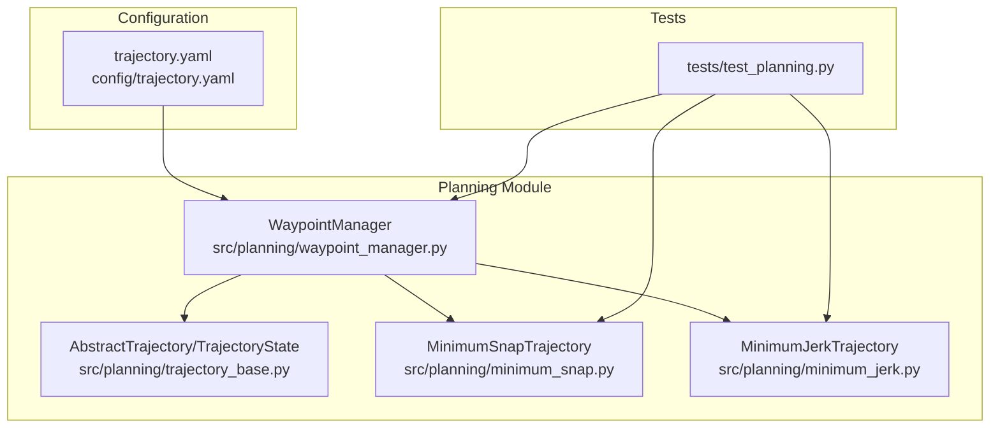
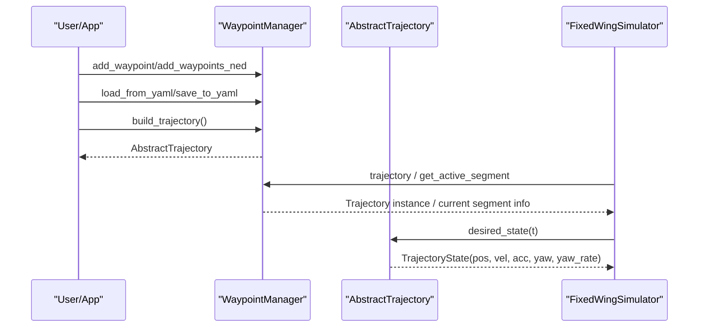
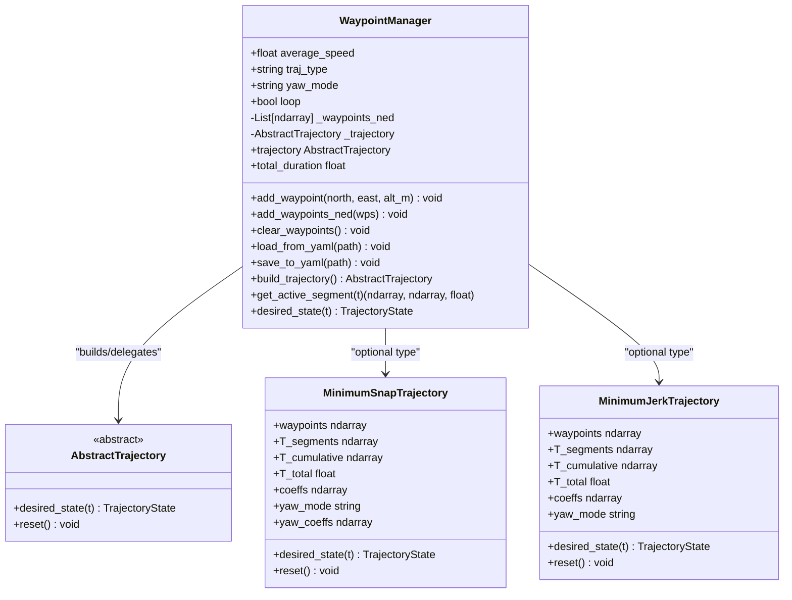
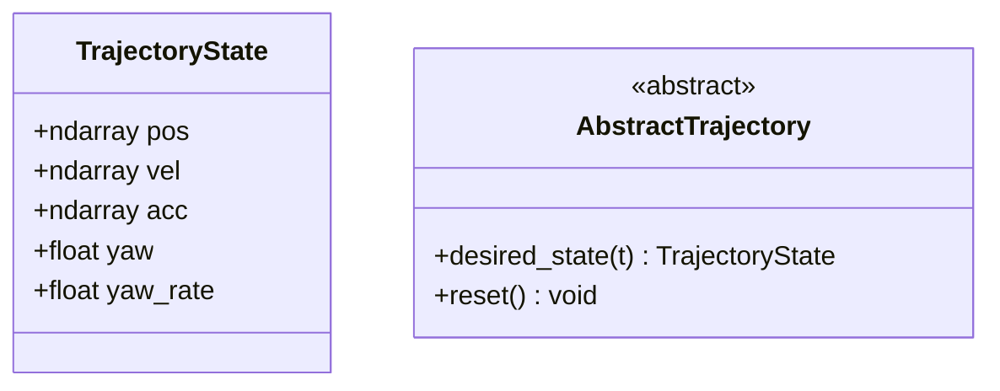
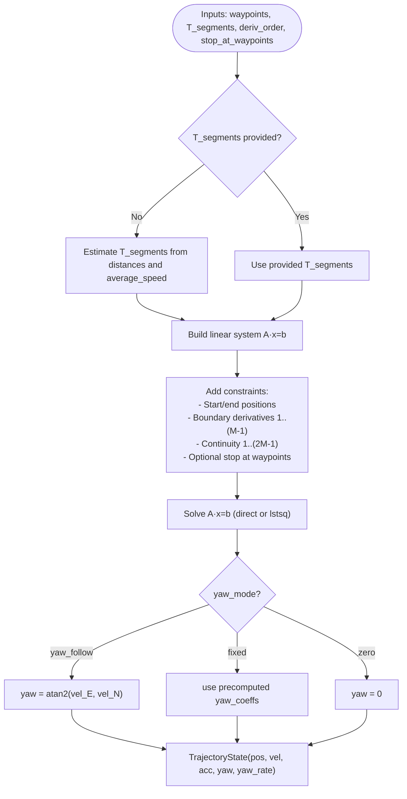
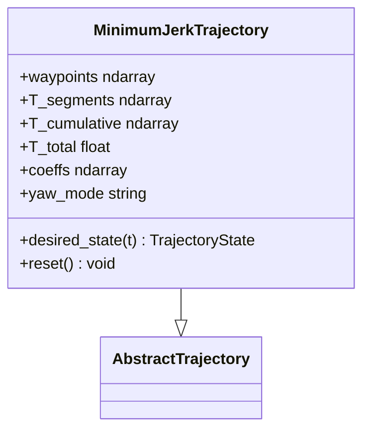
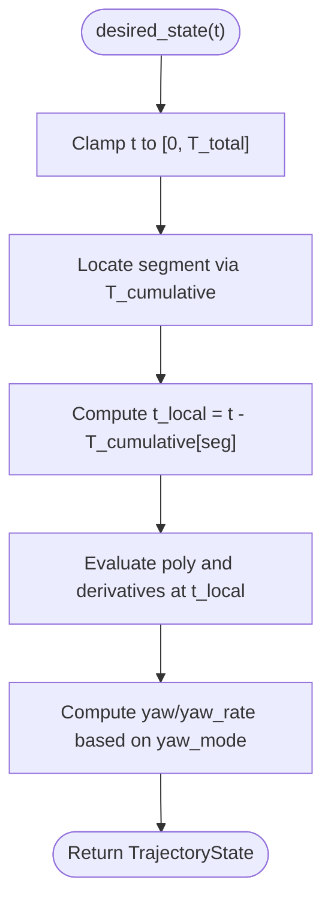
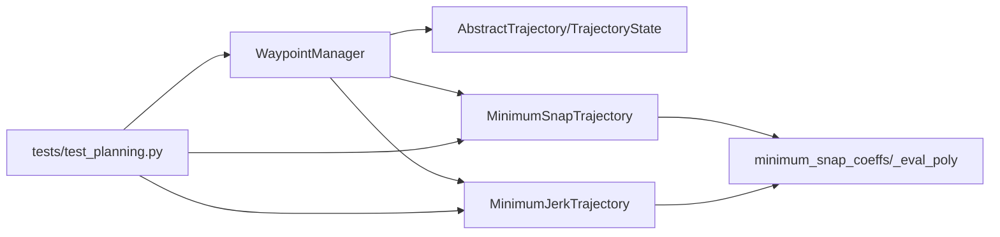

# Planning and Trajectory

<cite>
**Referenced Files in This Document**
- [waypoint_manager.py](file://src/planning/waypoint_manager.py)
- [trajectory_base.py](file://src/planning/trajectory_base.py)
- [minimum_snap.py](file://src/planning/minimum_snap.py)
- [minimum_jerk.py](file://src/planning/minimum_jerk.py)
- [trajectory.yaml](file://config/trajectory.yaml)
- [test_planning.py](file://tests/test_planning.py)
- [航路点管理器.md](file://doc/zh/content/规划系统/航路点管理器.md)
- [最小急动率轨迹规划.md](file://doc/zh/content/规划系统/最小急动率轨迹规划.md)
- [最小急弹率轨迹规划.md](file://doc/zh/content/规划系统/最小急弹率轨迹规划.md)
</cite>

## Table of Contents
1. [Introduction](#introduction)
2. [Project Structure](#project-structure)
3. [Core Components](#core-components)
4. [Architecture Overview](#architecture-overview)
5. [Detailed Component Analysis](#detailed-component-analysis)
6. [Dependency Analysis](#dependency-analysis)
7. [Performance Considerations](#performance-considerations)
8. [Troubleshooting Guide](#troubleshooting-guide)
9. [Conclusion](#conclusion)
10. [Appendices](#appendices)

## Introduction
This document explains the trajectory planning and waypoint management system used by the fixed-wing simulator. It focuses on:
- WaypointManager for mission planning and path segment management
- Minimum snap and minimum jerk trajectory algorithms with polynomial construction
- Abstract trajectory base classes and state definitions
- Trajectory evaluation, interpolation, and constraint handling
- Examples of waypoint definition, trajectory generation, and mission planning
- Relationship between planning algorithms and control system requirements
- Trajectory validation, smoothness criteria, and computational efficiency considerations

## Project Structure
The planning subsystem centers around a small set of modules that define the trajectory abstraction, construct piecewise polynomial trajectories, and manage waypoints and mission configuration.

**Diagram sources**
- [waypoint_manager.py](file://src/planning/waypoint_manager.py#L20-L208)
- [trajectory_base.py](file://src/planning/trajectory_base.py#L16-L47)
- [minimum_snap.py](file://src/planning/minimum_snap.py#L167-L253)
- [minimum_jerk.py](file://src/planning/minimum_jerk.py#L17-L71)
- [trajectory.yaml](file://config/trajectory.yaml#L1-L23)
- [test_planning.py](file://tests/test_planning.py#L27-L31)

**Section sources**
- [waypoint_manager.py](file://src/planning/waypoint_manager.py#L1-L208)
- [trajectory_base.py](file://src/planning/trajectory_base.py#L1-L47)
- [minimum_snap.py](file://src/planning/minimum_snap.py#L1-L253)
- [minimum_jerk.py](file://src/planning/minimum_jerk.py#L1-L71)
- [trajectory.yaml](file://config/trajectory.yaml#L1-L23)
- [test_planning.py](file://tests/test_planning.py#L1-L328)

## Core Components
- WaypointManager: Maintains NED waypoints, constructs and caches trajectory objects, exposes desired_state(t), and provides active segment information. Supports YAML import/export and mission loop modes.
- AbstractTrajectory and TrajectoryState: Defines a uniform interface for trajectory queries and a state container with position, velocity, acceleration, yaw, and yaw rate.
- MinimumSnapTrajectory: Piecewise polynomial trajectory with C⁴ continuity (4th derivative minimization), supports stop-at-waypoints and configurable yaw modes.
- MinimumJerkTrajectory: Reuses the same solver with deriv_order=3 to produce C³ continuity (3rd derivative minimization) using 5th-order polynomials per segment.

**Section sources**
- [waypoint_manager.py](file://src/planning/waypoint_manager.py#L20-L208)
- [trajectory_base.py](file://src/planning/trajectory_base.py#L16-L47)
- [minimum_snap.py](file://src/planning/minimum_snap.py#L167-L253)
- [minimum_jerk.py](file://src/planning/minimum_jerk.py#L17-L71)

## Architecture Overview
The system integrates planning and control by exposing a single desired_state(t) interface. WaypointManager coordinates mission definition and trajectory construction, while the simulator consumes TrajectoryState to drive control loops.

**Diagram sources**
- [waypoint_manager.py](file://src/planning/waypoint_manager.py#L127-L208)
- [trajectory_base.py](file://src/planning/trajectory_base.py#L26-L47)

## Detailed Component Analysis

### WaypointManager: Mission Planning and Path Segment Management
- Data model
  - Stores waypoints in NED (north, east, down). Altitude given as “positive-up” is internally converted to negative “down.”
  - Maintains a cached trajectory object and cumulative segment times.
- Construction and caching
  - Builds either MinimumSnapTrajectory or MinimumJerkTrajectory depending on configuration.
  - Automatically closes loop if loop mode is enabled and first/last waypoints are not equal.
- Active segment access
  - Given time t, returns the current segment’s start/end waypoints and remaining time in the segment.
- Convenience delegation
  - desired_state(t) proxies to the underlying trajectory.

**Diagram sources**
- [waypoint_manager.py](file://src/planning/waypoint_manager.py#L20-L208)
- [trajectory_base.py](file://src/planning/trajectory_base.py#L26-L47)
- [minimum_snap.py](file://src/planning/minimum_snap.py#L167-L253)
- [minimum_jerk.py](file://src/planning/minimum_jerk.py#L17-L71)

**Section sources**
- [waypoint_manager.py](file://src/planning/waypoint_manager.py#L20-L208)
- [trajectory.yaml](file://config/trajectory.yaml#L1-L23)

### Abstract Trajectory Base Classes and State Definitions
- AbstractTrajectory: Defines the desired_state(t) interface and an optional reset() hook.
- TrajectoryState: A dataclass containing:
  - pos: NED position (m)
  - vel: velocity (m/s)
  - acc: acceleration (m/s²)
  - yaw: target yaw (rad)
  - yaw_rate: target yaw rate (rad/s)

**Diagram sources**
- [trajectory_base.py](file://src/planning/trajectory_base.py#L16-L47)

**Section sources**
- [trajectory_base.py](file://src/planning/trajectory_base.py#L16-L47)

### Minimum Snap Trajectory: Polynomial Construction and Constraints
- Polynomial representation
  - Each spatial axis (N, E, D) and yaw is represented by a degree (2M − 1) polynomial per segment, where M = 4 for minimum snap (4th derivative minimization).
  - This yields 7th-order polynomials per segment for spatial axes and 3rd-order for yaw when using deriv_order=2 for yaw.
- Coefficient solver
  - Constructs a linear system A · x = b by encoding:
    - Start/end position constraints
    - Boundary conditions: first through (M − 1) derivatives zero at start and end
    - Continuity conditions: first through (2M − 1) derivatives continuous at interior waypoints
    - Optional stop-at-waypoints: overwrite velocity continuity with zero velocity at intermediate waypoints
  - Uses direct solve or least-squares fallback for numerical stability.
- Evaluation
  - Evaluates position, velocity, and acceleration via a helper polynomial evaluator.
- Yaw handling
  - Supports yaw_follow (align with horizontal velocity), fixed (precomputed yaw trajectory), and zero modes.

**Diagram sources**
- [minimum_snap.py](file://src/planning/minimum_snap.py#L47-L142)
- [minimum_snap.py](file://src/planning/minimum_snap.py#L167-L253)

**Section sources**
- [minimum_snap.py](file://src/planning/minimum_snap.py#L1-L253)

### Minimum Jerk Trajectory: Reuse of Solver with Lower Derivative Order
- Implementation
  - Reuses the same coefficient solver with deriv_order=3, producing 5th-order polynomials per segment.
  - Inherits the same evaluation and yaw logic as minimum snap (with yaw_mode handling).
- Use cases
  - Preferred when minimizing total jerk is prioritized over higher-order continuity.

**Diagram sources**
- [minimum_jerk.py](file://src/planning/minimum_jerk.py#L17-L71)
- [trajectory_base.py](file://src/planning/trajectory_base.py#L26-L47)

**Section sources**
- [minimum_jerk.py](file://src/planning/minimum_jerk.py#L1-L71)

### Trajectory Evaluation, Interpolation, and Constraint Handling
- Time-to-segment mapping
  - Uses cumulative segment times to locate the current segment in O(log N) via searchsorted.
- Local time evaluation
  - Computes position, velocity, and acceleration by evaluating polynomials at local time within the segment.
- Constraint satisfaction
  - Position, velocity, and acceleration continuity across segments is enforced by the solver.
  - Boundary conditions enforce initial/final derivatives up to (M − 1) order.
  - Optional stop-at-waypoints enforces zero velocity at intermediate waypoints.

**Diagram sources**
- [minimum_snap.py](file://src/planning/minimum_snap.py#L227-L249)
- [minimum_jerk.py](file://src/planning/minimum_jerk.py#L50-L67)

**Section sources**
- [minimum_snap.py](file://src/planning/minimum_snap.py#L145-L164)
- [minimum_jerk.py](file://src/planning/minimum_jerk.py#L50-L67)

### Examples: Waypoint Definition, Trajectory Generation, and Mission Planning
- Waypoint definition
  - Waypoints are NED coordinates. Altitude is given as “positive-up” and converted internally to negative “down.”
  - Example configuration file defines type, average speed, yaw mode, waypoints, and loop flag.
- Building a trajectory
  - WaypointManager.build_trajectory() constructs a trajectory object from current waypoints and caches it.
- Mission planning
  - WaypointManager.get_active_segment(t) returns the current segment and remaining time, enabling mission-aware logic.
- YAML round-trip
  - WaypointManager.load_from_yaml/save_to_yaml persists mission configurations.

**Section sources**
- [waypoint_manager.py](file://src/planning/waypoint_manager.py#L80-L121)
- [waypoint_manager.py](file://src/planning/waypoint_manager.py#L127-L160)
- [waypoint_manager.py](file://src/planning/waypoint_manager.py#L178-L201)
- [trajectory.yaml](file://config/trajectory.yaml#L1-L23)

### Relationship Between Planning Algorithms and Control System Requirements
- TrajectoryState provides the control loop with:
  - Desired position, velocity, and acceleration for feedback control
  - Target yaw/yaw_rate for heading control
- Minimum snap vs minimum jerk trade-offs:
  - Minimum snap offers higher continuity (C⁴) and smoother higher derivatives, suitable for precision tasks.
  - Minimum jerk reduces total jerk for improved comfort and reduced control effort, suitable for general missions.
- Yaw modes:
  - yaw_follow aligns yaw with horizontal velocity for natural turning behavior.
  - fixed allows mission-defined headings at waypoints.
  - zero disables yaw tracking.

**Section sources**
- [minimum_snap.py](file://src/planning/minimum_snap.py#L214-L249)
- [minimum_jerk.py](file://src/planning/minimum_jerk.py#L63-L67)

## Dependency Analysis
- WaypointManager depends on:
  - AbstractTrajectory/TrajectoryState for unified interface
  - MinimumSnapTrajectory/MinimumJerkTrajectory for concrete implementations
- Trajectory implementations depend on:
  - minimum_snap_coeffs for constructing polynomial coefficients
  - _eval_poly for evaluating polynomials and derivatives
- Tests validate:
  - Coefficient shapes and boundary satisfaction
  - Continuity and finite-state properties
  - YAML round-trip and active segment computation

**Diagram sources**
- [waypoint_manager.py](file://src/planning/waypoint_manager.py#L15-L17)
- [minimum_snap.py](file://src/planning/minimum_snap.py#L47-L142)
- [minimum_jerk.py](file://src/planning/minimum_jerk.py#L14-L14)
- [test_planning.py](file://tests/test_planning.py#L27-L31)

**Section sources**
- [waypoint_manager.py](file://src/planning/waypoint_manager.py#L15-L17)
- [minimum_snap.py](file://src/planning/minimum_snap.py#L47-L142)
- [minimum_jerk.py](file://src/planning/minimum_jerk.py#L14-L14)
- [test_planning.py](file://tests/test_planning.py#L27-L31)

## Performance Considerations
- Numerical stability
  - Large segment durations can lead to ill-conditioned systems; solver prints warnings and falls back to least-squares.
- Time allocation
  - Segment durations are estimated from distance and average speed, with a minimum threshold to avoid numerical issues.
- Query efficiency
  - Locating the current segment uses cumulative time arrays and logarithmic search, yielding near O(log N) per query.
- Memory footprint
  - Coefficients and cumulative time arrays are compact numpy arrays; caching avoids repeated builds.

**Section sources**
- [minimum_snap.py](file://src/planning/minimum_snap.py#L132-L138)
- [minimum_snap.py](file://src/planning/minimum_snap.py#L200-L205)
- [waypoint_manager.py](file://src/planning/waypoint_manager.py#L192-L201)

## Troubleshooting Guide
- Fewer than two waypoints
  - Symptom: ValueError when building trajectory.
  - Action: Ensure at least two waypoints are added.
- Loop mode mismatch
  - Symptom: First and last waypoints differ slightly.
  - Action: WaypointManager automatically closes the loop; confirm expected closure.
- Initial height mismatch
  - Symptom: Large initial descent when starting far from first waypoint altitude.
  - Action: Adjust first waypoint altitude or pre-align initial conditions.
- Navigation mode selection
  - Symptom: Using waypoint sequence mode without loading waypoints.
  - Action: Load or add waypoints before running.

**Section sources**
- [waypoint_manager.py](file://src/planning/waypoint_manager.py#L139-L145)
- [test_planning.py](file://tests/test_planning.py#L289-L294)

## Conclusion
The planning and trajectory system provides a robust, modular framework for fixed-wing mission planning:
- WaypointManager unifies waypoint handling, mission configuration, and trajectory caching.
- Minimum snap and minimum jerk trajectories offer complementary smoothness characteristics with shared solver infrastructure.
- TrajectoryState cleanly bridges planning and control, enabling seamless integration with the simulator’s control loops.
- Built-in validation, YAML support, and performance-conscious design make it practical for real-world missions.

## Appendices

### Smoothness Criteria and Validation
- Continuous derivatives:
  - Minimum snap: C⁴ continuity (positions, velocities, accelerations, and snap-like quantities)
  - Minimum jerk: C³ continuity (positions, velocities, accelerations)
- Validation checks in tests:
  - Start/end position satisfaction
  - Intermediate waypoint pass-through
  - Velocity continuity at segment boundaries
  - Finite coefficients under extreme segment lengths
  - YAML round-trip fidelity

**Section sources**
- [test_planning.py](file://tests/test_planning.py#L73-L116)
- [test_planning.py](file://tests/test_planning.py#L122-L186)
- [test_planning.py](file://tests/test_planning.py#L198-L246)
- [test_planning.py](file://tests/test_planning.py#L295-L328)

### Computational Efficiency Notes
- Coefficient solving complexity scales with the number of constraints per segment; typical missions remain fast.
- Query latency is minimal due to logarithmic segment lookup and lightweight polynomial evaluation.
- Memory usage grows linearly with the number of waypoints and polynomial degrees.

**Section sources**
- [minimum_snap.py](file://src/planning/minimum_snap.py#L75-L142)
- [minimum_jerk.py](file://src/planning/minimum_jerk.py#L45-L48)