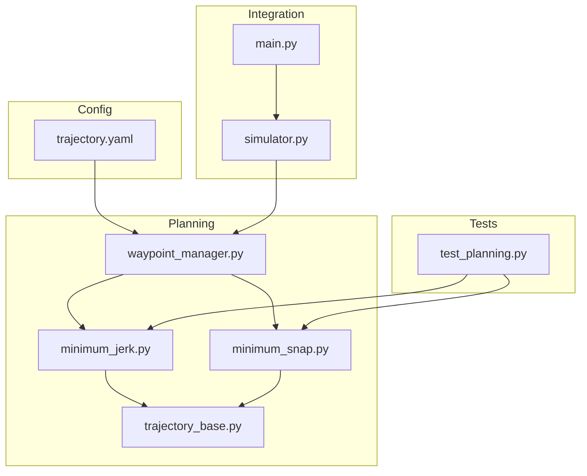
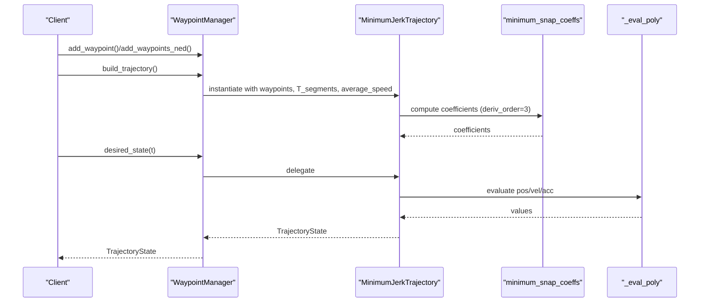
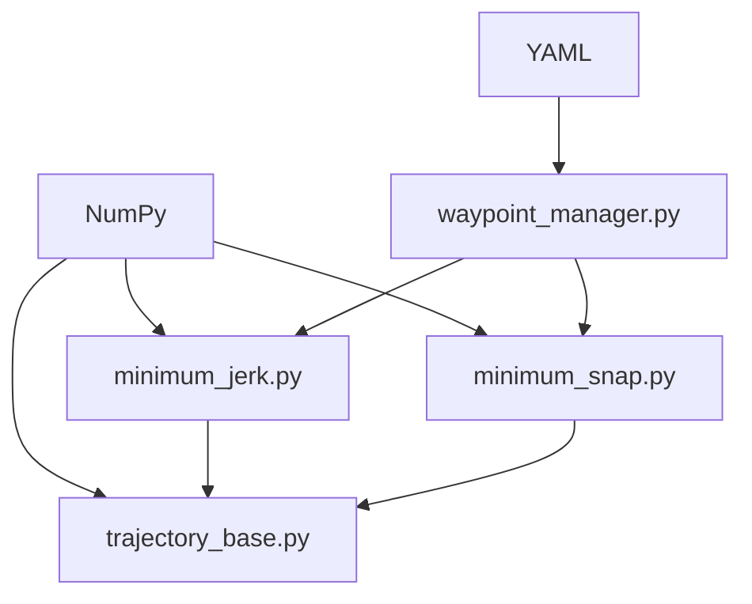
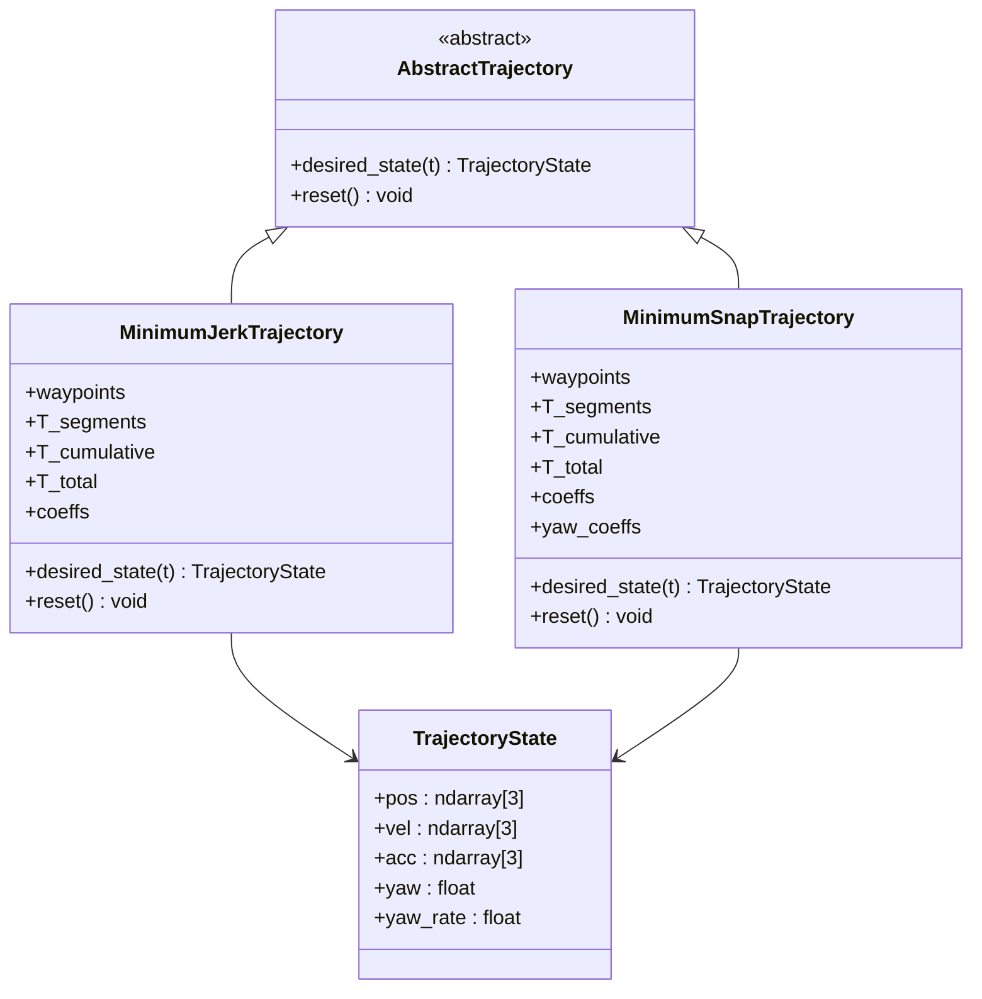

# Minimum Jerk Trajectory

<cite>
**Referenced Files in This Document**
- [minimum_jerk.py](file://src/planning/minimum_jerk.py)
- [minimum_snap.py](file://src/planning/minimum_snap.py)
- [trajectory_base.py](file://src/planning/trajectory_base.py)
- [waypoint_manager.py](file://src/planning/waypoint_manager.py)
- [trajectory.yaml](file://config/trajectory.yaml)
- [test_planning.py](file://tests/test_planning.py)
- [main.py](file://main.py)
- [simulator.py](file://src/simulation/simulator.py)
</cite>

## Table of Contents
1. [Introduction](#introduction)
2. [Project Structure](#project-structure)
3. [Core Components](#core-components)
4. [Architecture Overview](#architecture-overview)
5. [Detailed Component Analysis](#detailed-component-analysis)
6. [Dependency Analysis](#dependency-analysis)
7. [Performance Considerations](#performance-considerations)
8. [Troubleshooting Guide](#troubleshooting-guide)
9. [Conclusion](#conclusion)
10. [Appendices](#appendices)

## Introduction
This document explains the MinimumJerkTrajectory algorithm implementation in the FixedWingSimulator project. It covers the mathematical foundation of jerk minimization (third derivative), the polynomial trajectory construction, boundary conditions, time distribution methods, smooth velocity and acceleration profiles, computational efficiency, numerical stability, parameter selection, trajectory characteristics, and a comparison with the minimum snap approach. The goal is to provide a clear, accessible guide for both newcomers and practitioners.

## Project Structure
The trajectory planning system is modular and integrates with the broader simulation framework:
- Planning module: trajectory base interface, minimum jerk/snap implementations, and waypoint manager
- Configuration: YAML-based trajectory configuration
- Tests: unit tests validating continuity, boundary conditions, and performance
- Simulation integration: the simulator consumes trajectories for closed-loop control

**Diagram sources**
- [waypoint_manager.py](file://src/planning/waypoint_manager.py#L20-L160)
- [minimum_jerk.py](file://src/planning/minimum_jerk.py#L17-L71)
- [minimum_snap.py](file://src/planning/minimum_snap.py#L167-L253)
- [trajectory_base.py](file://src/planning/trajectory_base.py#L16-L47)
- [trajectory.yaml](file://config/trajectory.yaml#L1-L23)
- [test_planning.py](file://tests/test_planning.py#L1-L328)
- [simulator.py](file://src/simulation/simulator.py#L218-L230)
- [main.py](file://main.py#L69-L73)

**Section sources**
- [waypoint_manager.py](file://src/planning/waypoint_manager.py#L1-L208)
- [minimum_jerk.py](file://src/planning/minimum_jerk.py#L1-L71)
- [minimum_snap.py](file://src/planning/minimum_snap.py#L1-L253)
- [trajectory_base.py](file://src/planning/trajectory_base.py#L1-L47)
- [trajectory.yaml](file://config/trajectory.yaml#L1-L23)
- [test_planning.py](file://tests/test_planning.py#L1-L328)
- [simulator.py](file://src/simulation/simulator.py#L218-L230)
- [main.py](file://main.py#L69-L73)

## Core Components
- AbstractTrajectory and TrajectoryState define the common interface and state representation for all trajectories.
- MinimumJerkTrajectory implements a piecewise fifth-order polynomial trajectory by reusing the minimum snap solver with deriv_order=3.
- MinimumSnapTrajectory implements the general minimum snap solver with deriv_order=4 and supports yaw modeling.
- WaypointManager manages waypoints, builds trajectories, and exposes desired_state(t) to the simulator.

Key implementation highlights:
- MinimumJerkTrajectory constructs segment times from waypoints and average speed, then computes coefficients via minimum_snap_coeffs with deriv_order=3.
- Both trajectories evaluate position, velocity, and acceleration using a shared polynomial evaluator.
- Yaw handling supports “yaw_follow” mode based on velocity direction.

**Section sources**
- [trajectory_base.py](file://src/planning/trajectory_base.py#L16-L47)
- [minimum_jerk.py](file://src/planning/minimum_jerk.py#L17-L71)
- [minimum_snap.py](file://src/planning/minimum_snap.py#L47-L164)
- [waypoint_manager.py](file://src/planning/waypoint_manager.py#L127-L160)

## Architecture Overview
The trajectory system is designed around a clean separation of concerns:
- WaypointManager orchestrates waypoint storage and trajectory creation
- MinimumJerkTrajectory and MinimumSnapTrajectory share a common coefficient solver and evaluation routine
- The simulator queries desired_state(t) to obtain smooth 3D positions, velocities, accelerations, and yaw/yaw-rate targets

**Diagram sources**
- [waypoint_manager.py](file://src/planning/waypoint_manager.py#L127-L160)
- [minimum_jerk.py](file://src/planning/minimum_jerk.py#L45-L67)
- [minimum_snap.py](file://src/planning/minimum_snap.py#L47-L142)
- [trajectory_base.py](file://src/planning/trajectory_base.py#L16-L47)

## Detailed Component Analysis

### Mathematical Basis and Historical Context
- Jerk is the third time derivative of position (rate of change of acceleration).
- Minimizing total jerk reduces control effort, vibration, and structural loads, improving passenger comfort and fuel efficiency.
- The implementation uses a matrix-construction approach to solve for polynomial coefficients subject to boundary and continuity constraints.

Practical advantages:
- Smooth acceleration profiles reduce control input saturation and improve tracking performance
- Lower peak accelerations reduce structural fatigue
- Predictable control inputs aid in stability and robustness

**Section sources**
- [minimum_snap.py](file://src/planning/minimum_snap.py#L1-L14)
- [minimum_jerk.py](file://src/planning/minimum_jerk.py#L1-L6)

### Polynomial Trajectory Construction
- Each segment is modeled as a polynomial of degree M=2×deriv_order-1.
- For minimum jerk (deriv_order=3), each segment uses a fifth-order polynomial.
- The solver constructs a linear system A·x=b encoding:
  - Start/end position constraints
  - Start/end velocity constraints
  - Start/end acceleration constraints
  - Start/end jerk constraints
  - Continuity constraints at intermediate waypoints
  - Optional stop-at-waypoints (velocity=0) constraints

Evaluation:
- Position, velocity, and acceleration are computed by evaluating the polynomial and its first and second derivatives at local time t within a segment.

**Section sources**
- [minimum_snap.py](file://src/planning/minimum_snap.py#L47-L142)
- [minimum_jerk.py](file://src/planning/minimum_jerk.py#L45-L67)

### Boundary Conditions and Continuity
- The solver enforces C^0 (position), C^1 (velocity), C^2 (acceleration), and C^3 (jerk) continuity across segments for minimum jerk.
- Additional constraints at start and end include prescribed derivatives (often zero) and continuity of higher derivatives at interior waypoints.
- The implementation includes safeguards for numerical stability and falls back to least-squares when the system is ill-conditioned.

**Section sources**
- [minimum_snap.py](file://src/planning/minimum_snap.py#L96-L138)
- [test_planning.py](file://tests/test_planning.py#L96-L116)

### Time Distribution Methods
- Segment durations can be provided explicitly or estimated from:
  - Average speed: T_i = max(distance(i)/average_speed, t_min)
  - Proportional to distances
  - Manual specification
- WaypointManager exposes average_speed and supports YAML-based configuration.

**Section sources**
- [minimum_jerk.py](file://src/planning/minimum_jerk.py#L38-L43)
- [waypoint_manager.py](file://src/planning/waypoint_manager.py#L199-L205)
- [trajectory.yaml](file://config/trajectory.yaml#L6-L7)

### Smooth Velocity and Acceleration Profiles
- Minimum jerk ensures C^3 continuity, yielding smooth accelerations and jerks.
- The evaluator computes position, velocity, and acceleration efficiently for real-time queries.
- Yaw handling supports “yaw_follow” mode, aligning yaw with horizontal velocity when moving.

**Section sources**
- [minimum_jerk.py](file://src/planning/minimum_jerk.py#L50-L67)
- [minimum_snap.py](file://src/planning/minimum_snap.py#L227-L249)

### Computational Efficiency and Numerical Stability
- Coefficient computation scales with the size of the linear system; for typical waypoint counts, computation remains fast.
- The solver detects ill-conditioned systems and prints warnings; it falls back to least-squares solutions when necessary.
- Real-time trajectory queries are extremely fast (single-segment search plus polynomial evaluation).

**Section sources**
- [minimum_snap.py](file://src/planning/minimum_snap.py#L132-L138)
- [test_planning.py](file://tests/test_planning.py#L109-L116)

### Parameter Selection and Examples
- Typical parameters:
  - average_speed: controls segment time estimation
  - yaw_mode: “yaw_follow”, “zero”, or “fixed”
  - stop_at_waypoints: enforce zero velocity at intermediate waypoints
- Configuration via YAML allows specifying waypoints, type, and loop behavior.

Example usage patterns:
- Build trajectory from waypoints and query desired_state(t) for control targets
- Load/save configurations for repeatable missions

**Section sources**
- [trajectory.yaml](file://config/trajectory.yaml#L1-L23)
- [waypoint_manager.py](file://src/planning/waypoint_manager.py#L80-L122)
- [waypoint_manager.py](file://src/planning/waypoint_manager.py#L127-L160)

### Performance Analysis vs. Minimum Snap
- Minimum jerk uses deriv_order=3 (5th-order polynomials), while minimum snap uses deriv_order=4 (7th-order polynomials).
- Minimum jerk typically yields lower total jerk and smoother acceleration transitions, with fewer degrees of freedom allowing more flexibility to minimize jerk.
- Minimum snap achieves higher continuity (C^4) but at increased computational cost.

Empirical validation:
- Tests compare total jerk magnitudes between minimum jerk and minimum snap trajectories on the same waypoints and segment times, confirming that minimum jerk generally produces lower jerk.

**Section sources**
- [minimum_snap.py](file://src/planning/minimum_snap.py#L47-L71)
- [test_planning.py](file://tests/test_planning.py#L224-L246)

### Trade-offs Between Complexity and Smoothness
- Minimum jerk: lower computational cost, good smoothness, suitable for general navigation tasks
- Minimum snap: higher continuity, more computationally expensive, suited for precision tasks requiring very smooth higher derivatives

**Section sources**
- [test_planning.py](file://tests/test_planning.py#L224-L246)

## Dependency Analysis
- Internal dependencies:
  - WaypointManager depends on both MinimumJerkTrajectory and MinimumSnapTrajectory
  - Both trajectory classes depend on AbstractTrajectory and share the minimum snap coefficient solver
- External dependencies:
  - NumPy for numerical computations
  - YAML for configuration loading/saving

**Diagram sources**
- [minimum_jerk.py](file://src/planning/minimum_jerk.py#L10-L14)
- [minimum_snap.py](file://src/planning/minimum_snap.py#L18-L21)
- [waypoint_manager.py](file://src/planning/waypoint_manager.py#L10-L17)

**Section sources**
- [minimum_jerk.py](file://src/planning/minimum_jerk.py#L10-L14)
- [minimum_snap.py](file://src/planning/minimum_snap.py#L18-L21)
- [waypoint_manager.py](file://src/planning/waypoint_manager.py#L10-L17)

## Performance Considerations
- Coefficient computation: O(n^3) scaling with the number of constraints; acceptable for small-to-medium waypoint sets
- Memory footprint: roughly proportional to number of waypoints and spatial dimensions
- Real-time query latency: negligible for single-segment lookup and polynomial evaluation
- Stability: the solver warns on ill-conditioned matrices and uses least-squares fallback

[No sources needed since this section provides general guidance]

## Troubleshooting Guide
Common issues and resolutions:
- Non-finite coefficients or solver failures:
  - Verify waypoint count (≥2) and validity
  - Reduce segment durations or adjust average speed
  - Check for extreme distances or very large segment times
- Poor trajectory quality:
  - Increase average speed to spread out segments
  - Reduce waypoint density or relax constraints
- Unexpected yaw behavior:
  - Confirm yaw_mode setting and velocity magnitude thresholds

**Section sources**
- [minimum_snap.py](file://src/planning/minimum_snap.py#L132-L138)
- [test_planning.py](file://tests/test_planning.py#L109-L116)
- [test_planning.py](file://tests/test_planning.py#L173-L186)

## Conclusion
The MinimumJerkTrajectory implementation leverages a robust, matrix-based solver to construct smooth, C^3 continuous trajectories using fifth-order polynomials per segment. It integrates cleanly with the simulation pipeline, offers efficient real-time queries, and provides strong numerical safeguards. Compared to minimum snap, it trades off slightly less continuity for improved computational efficiency and often lower total jerk, making it well-suited for general navigation tasks in fixed-wing applications.

[No sources needed since this section summarizes without analyzing specific files]

## Appendices

### Class and Interface Overview

**Diagram sources**
- [trajectory_base.py](file://src/planning/trajectory_base.py#L16-L47)
- [minimum_jerk.py](file://src/planning/minimum_jerk.py#L17-L71)
- [minimum_snap.py](file://src/planning/minimum_snap.py#L167-L253)

### Example Workflow
- Configure waypoints and parameters via YAML or programmatically
- Instantiate WaypointManager with traj_type="minimum_jerk"
- Build trajectory and query desired_state(t) during simulation

**Section sources**
- [trajectory.yaml](file://config/trajectory.yaml#L1-L23)
- [waypoint_manager.py](file://src/planning/waypoint_manager.py#L127-L160)
- [simulator.py](file://src/simulation/simulator.py#L478-L498)