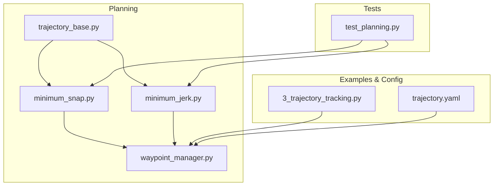
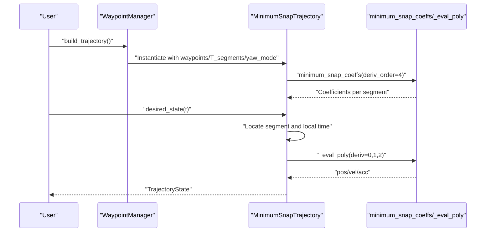
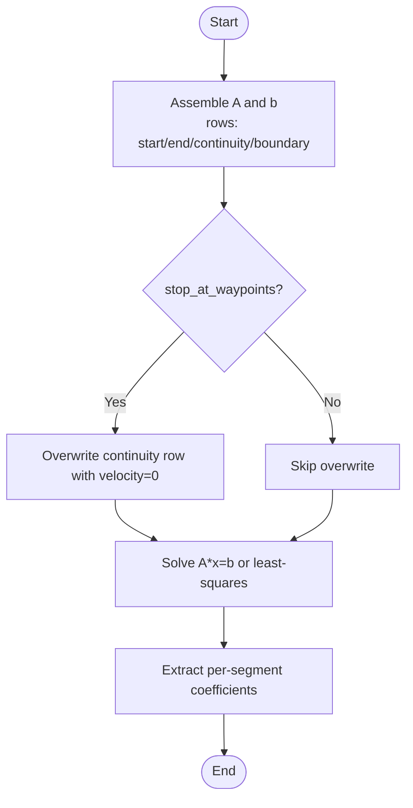
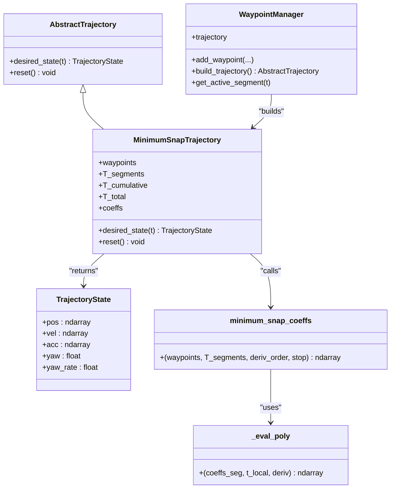

# Minimum Snap Trajectory

<cite>
**Referenced Files in This Document**
- [minimum_snap.py](file://src/planning/minimum_snap.py)
- [trajectory_base.py](file://src/planning/trajectory_base.py)
- [waypoint_manager.py](file://src/planning/waypoint_manager.py)
- [minimum_jerk.py](file://src/planning/minimum_jerk.py)
- [trajectory.yaml](file://config/trajectory.yaml)
- [test_planning.py](file://tests/test_planning.py)
- [3_trajectory_tracking.py](file://examples/3_trajectory_tracking.py)
</cite>

## Table of Contents
1. [Introduction](#introduction)
2. [Project Structure](#project-structure)
3. [Core Components](#core-components)
4. [Architecture Overview](#architecture-overview)
5. [Detailed Component Analysis](#detailed-component-analysis)
6. [Dependency Analysis](#dependency-analysis)
7. [Performance Considerations](#performance-considerations)
8. [Troubleshooting Guide](#troubleshooting-guide)
9. [Conclusion](#conclusion)
10. [Appendices](#appendices)

## Introduction
This document explains the MinimumSnapTrajectory algorithm implementation for fixed-wing flight simulation. It covers the mathematical formulation based on snap minimization (fourth derivative), the variational principle and boundary conditions, polynomial construction and coefficient calculation, smoothness optimization criteria, time allocation strategies, waypoint sequencing, and continuity enforcement. It also includes practical examples, performance characteristics, comparisons with other algorithms, and computational implementation details.

## Project Structure
The MinimumSnapTrajectory implementation resides in the planning subsystem and integrates with the broader simulation framework:
- Trajectory base and state definition
- MinimumSnap solver and trajectory class
- Waypoint manager and trajectory factory
- Example usage and configuration

**Diagram sources**
- [minimum_snap.py](file://src/planning/minimum_snap.py#L1-L253)
- [trajectory_base.py](file://src/planning/trajectory_base.py#L1-L47)
- [waypoint_manager.py](file://src/planning/waypoint_manager.py#L1-L208)
- [minimum_jerk.py](file://src/planning/minimum_jerk.py#L1-L71)
- [3_trajectory_tracking.py](file://examples/3_trajectory_tracking.py#L1-L194)
- [trajectory.yaml](file://config/trajectory.yaml#L1-L23)
- [test_planning.py](file://tests/test_planning.py#L1-L328)

**Section sources**
- [minimum_snap.py](file://src/planning/minimum_snap.py#L1-L253)
- [trajectory_base.py](file://src/planning/trajectory_base.py#L1-L47)
- [waypoint_manager.py](file://src/planning/waypoint_manager.py#L1-L208)
- [minimum_jerk.py](file://src/planning/minimum_jerk.py#L1-L71)
- [3_trajectory_tracking.py](file://examples/3_trajectory_tracking.py#L1-L194)
- [trajectory.yaml](file://config/trajectory.yaml#L1-L23)
- [test_planning.py](file://tests/test_planning.py#L1-L328)

## Core Components
- AbstractTrajectory and TrajectoryState define the common interface and state container used by all trajectory types.
- minimum_snap_coeffs constructs the polynomial coefficients by solving a linear system derived from boundary and continuity constraints.
- MinimumSnapTrajectory encapsulates the trajectory, computes segment times, evaluates position/velocity/acceleration, and handles yaw modes.
- WaypointManager manages waypoints, selects trajectory type, and caches the trajectory object.
- MinimumJerkTrajectory demonstrates the same solver with deriv_order=3 for comparison.

**Section sources**
- [trajectory_base.py](file://src/planning/trajectory_base.py#L16-L47)
- [minimum_snap.py](file://src/planning/minimum_snap.py#L47-L142)
- [minimum_snap.py](file://src/planning/minimum_snap.py#L167-L253)
- [waypoint_manager.py](file://src/planning/waypoint_manager.py#L20-L160)
- [minimum_jerk.py](file://src/planning/minimum_jerk.py#L17-L71)

## Architecture Overview
The system follows a layered design:
- WaypointManager loads or builds waypoints, selects trajectory type, and caches the trajectory.
- MinimumSnapTrajectory computes coefficients via minimum_snap_coeffs and evaluates desired states.
- The simulator consumes TrajectoryState for closed-loop control.

**Diagram sources**
- [waypoint_manager.py](file://src/planning/waypoint_manager.py#L127-L160)
- [minimum_snap.py](file://src/planning/minimum_snap.py#L181-L253)
- [minimum_snap.py](file://src/planning/minimum_snap.py#L47-L142)

## Detailed Component Analysis

### Mathematical Formulation and Variational Principle
- Optimization target: Minimize the integral of the fourth derivative (snap) squared along the trajectory, subject to boundary and continuity constraints.
- Polynomial basis: On each segment, position coordinates (N, E, D) and yaw are represented by polynomials of degree 2M − 1, where M = 4 for minimum snap, yielding degree 7 polynomials per segment.
- Constraints:
  - Start/end positions at segment boundaries.
  - Zero derivatives 1 through (deriv_order − 1) at start and end (initial rest and final rest).
  - Continuity of derivatives 1 through (2 × deriv_order − 1) at internal waypoints.
  - Optional: enforce zero velocity at intermediate waypoints (stop_at_waypoints).

These constraints form a linear system A x = b, where rows correspond to constraints and columns to unknown polynomial coefficients.

**Section sources**
- [minimum_snap.py](file://src/planning/minimum_snap.py#L47-L142)

### Polynomial Construction and Coefficient Calculation
- Coefficient extraction: The helper _get_poly_cc computes the coefficient vector for the k-th derivative of an n-th order polynomial evaluated at time t, enabling constraint assembly.
- Linear system assembly:
  - Rows for start/end positions per segment.
  - Rows for boundary conditions at start and end (derivatives 1..(M−1)).
  - Rows for continuity across internal waypoints (derivatives 1..(2M−1)).
  - Optional overwrite to enforce zero velocity at intermediate waypoints.
- Solution strategy:
  - Direct solve using NumPy linear algebra.
  - If the matrix is ill-conditioned, switch to least-squares solution and print a warning.
- Evaluation:
  - _eval_poly evaluates a segment’s polynomial or its derivatives at local time t_local.

**Diagram sources**
- [minimum_snap.py](file://src/planning/minimum_snap.py#L75-L142)

**Section sources**
- [minimum_snap.py](file://src/planning/minimum_snap.py#L24-L142)

### Smoothness Optimization Criteria
- Minimizing snap (fourth derivative) yields smooth acceleration and deceleration profiles, reducing dynamic stress on the vehicle and improving control performance.
- Continuity of higher derivatives (up to 2M − 1) ensures smooth transitions at segment junctions, preventing discontinuous accelerations or jerks.

**Section sources**
- [minimum_snap.py](file://src/planning/minimum_snap.py#L96-L130)

### Time Allocation Strategies and Waypoint Sequencing
- Automatic segment times: If T_segments is not provided, distances between consecutive waypoints are computed, scaled by average_speed, and clamped to a minimum threshold to avoid numerical issues.
- Waypoint sequencing: Waypoints are stored in NED coordinates; altitudes given as positive-up are internally converted to NED down.
- Looping: Optional loop closure by repeating the first waypoint when loop is enabled.

**Section sources**
- [minimum_snap.py](file://src/planning/minimum_snap.py#L200-L205)
- [waypoint_manager.py](file://src/planning/waypoint_manager.py#L54-L80)
- [waypoint_manager.py](file://src/planning/waypoint_manager.py#L144-L146)

### Trajectory Continuity Enforcement
- Inter-segment continuity: The solver enforces continuity of derivatives 1 through 7 (for M=4) at internal waypoints, ensuring smooth velocity, acceleration, and higher derivatives.
- Boundary conditions: Initial rest and final rest conditions are enforced at the trajectory start and end.

**Section sources**
- [minimum_snap.py](file://src/planning/minimum_snap.py#L111-L130)

### Yaw Modeling and Modes
- Yaw from velocity: When yaw_mode is “yaw_follow”, yaw is computed from the horizontal velocity vector (NE plane), otherwise yaw is zero.
- Fixed yaw: When yaw_mode is “fixed”, a separate minimum-snap trajectory is constructed for yaw using deriv_order=2 on the yaw waypoints.

**Section sources**
- [minimum_snap.py](file://src/planning/minimum_snap.py#L214-L224)
- [minimum_snap.py](file://src/planning/minimum_snap.py#L240-L246)

### Practical Examples and Usage Patterns
- Example script demonstrates closed-loop trajectory tracking using MinimumSnapTrajectory with a square path and AUTO mode.
- Configuration file defines trajectory type, average speed, yaw mode, waypoints, and loop behavior.

**Section sources**
- [3_trajectory_tracking.py](file://examples/3_trajectory_tracking.py#L72-L99)
- [trajectory.yaml](file://config/trajectory.yaml#L1-L23)

### Comparison with Other Algorithms
- MinimumJerkTrajectory (deriv_order=3) uses degree-5 polynomials per segment and minimizes the third derivative (jerk). It offers smoother acceleration than minimum acceleration but less smoothness than minimum snap.
- MinimumSnapTrajectory (deriv_order=4) uses degree-7 polynomials per segment and minimizes snap, yielding the smoothest acceleration profile among the three.

**Section sources**
- [minimum_jerk.py](file://src/planning/minimum_jerk.py#L17-L71)
- [minimum_snap.py](file://src/planning/minimum_snap.py#L47-L71)

### Computational Implementation Details
- Numerical methods:
  - Matrix assembly and solving using NumPy linear algebra.
  - Least-squares fallback for ill-conditioned systems with a condition-number warning.
- Complexity:
  - Per segment: O(M^2) for solving the linear system, where M = 2 × deriv_order.
  - For minimum snap, M=8, so O(64) per segment; overall O(n × M^2) for n segments.
- Memory:
  - Stores per-segment coefficients and cumulative time arrays.

**Section sources**
- [minimum_snap.py](file://src/planning/minimum_snap.py#L132-L142)
- [minimum_snap.py](file://src/planning/minimum_snap.py#L75-L142)

## Dependency Analysis
- Inheritance and composition:
  - MinimumSnapTrajectory inherits from AbstractTrajectory and uses minimum_snap_coeffs and _eval_poly.
  - WaypointManager selects trajectory type and caches the trajectory object.
- External dependencies:
  - NumPy for numerical computations.
  - Tests validate correctness of boundary satisfaction, continuity, and finite coefficients.

**Diagram sources**
- [trajectory_base.py](file://src/planning/trajectory_base.py#L16-L47)
- [minimum_snap.py](file://src/planning/minimum_snap.py#L167-L253)
- [minimum_snap.py](file://src/planning/minimum_snap.py#L47-L164)
- [waypoint_manager.py](file://src/planning/waypoint_manager.py#L20-L160)

**Section sources**
- [trajectory_base.py](file://src/planning/trajectory_base.py#L26-L47)
- [minimum_snap.py](file://src/planning/minimum_snap.py#L21-L22)
- [waypoint_manager.py](file://src/planning/waypoint_manager.py#L16-L17)

## Performance Considerations
- Computation complexity scales with O(n × M^2), where M=8 for minimum snap. Typical scenarios resolve quickly in real-time.
- Large segment durations can lead to ill-conditioned matrices; the solver warns and falls back to least-squares.
- Practical tips:
  - Prefer moderate segment durations to avoid numerical issues.
  - Use automatic time allocation (average_speed) unless precise timing is required.
  - Validate that coefficients remain finite during testing.

[No sources needed since this section provides general guidance]

## Troubleshooting Guide
- Ill-conditioned matrix warnings:
  - Symptom: Warning printed when segment durations are large.
  - Action: Reduce segment durations or adjust waypoint spacing.
- Non-finite coefficients:
  - Symptom: Unexpected NaN or Inf values.
  - Action: Check waypoint coordinates and segment times; avoid extreme configurations.
- Low-speed yaw instability:
  - Symptom: Yaw oscillations or undefined yaw at low speeds.
  - Action: Enable yaw_follow only when horizontal velocity exceeds a small threshold.
- Validation via tests:
  - Use existing unit tests to verify boundary satisfaction, continuity, and finite coefficients.

**Section sources**
- [minimum_snap.py](file://src/planning/minimum_snap.py#L132-L138)
- [test_planning.py](file://tests/test_planning.py#L104-L116)
- [test_planning.py](file://tests/test_planning.py#L173-L179)

## Conclusion
MinimumSnapTrajectory generates smooth, physically plausible 3D trajectories for fixed-wing simulation by minimizing snap across piecewise polynomials. Its matrix-based solver enforces boundary and continuity conditions rigorously, while flexible time allocation and yaw modes support diverse mission requirements. Compared to minimum jerk and minimum acceleration, minimum snap achieves the smoothest acceleration profiles, making it suitable for demanding control applications.

[No sources needed since this section summarizes without analyzing specific files]

## Appendices

### Appendix A: Configuration Reference
- Trajectory type: minimum_snap | minimum_jerk | minimum_accel | minimum_vel | hover
- average_speed: m/s used for automatic segment time estimation
- yaw_mode: yaw_follow | zero | fixed
- waypoints: list of [north, east, alt] with alt as positive-up
- loop: whether to close the trajectory path

**Section sources**
- [trajectory.yaml](file://config/trajectory.yaml#L1-L23)

### Appendix B: Example Usage
- Example script demonstrates closed-loop AUTO mode with a square trajectory using minimum_snap.

**Section sources**
- [3_trajectory_tracking.py](file://examples/3_trajectory_tracking.py#L72-L99)