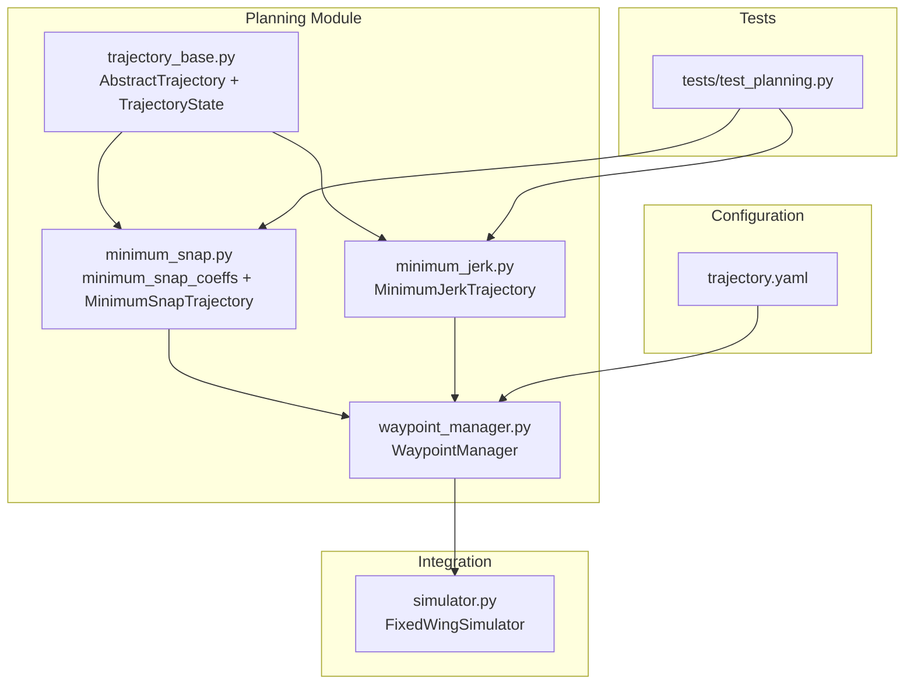
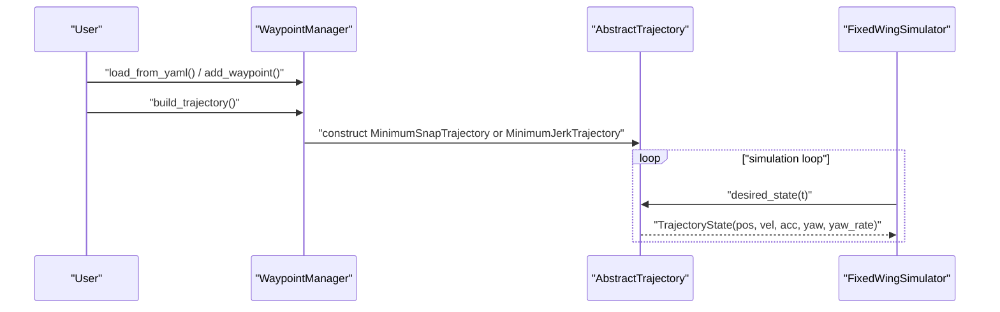
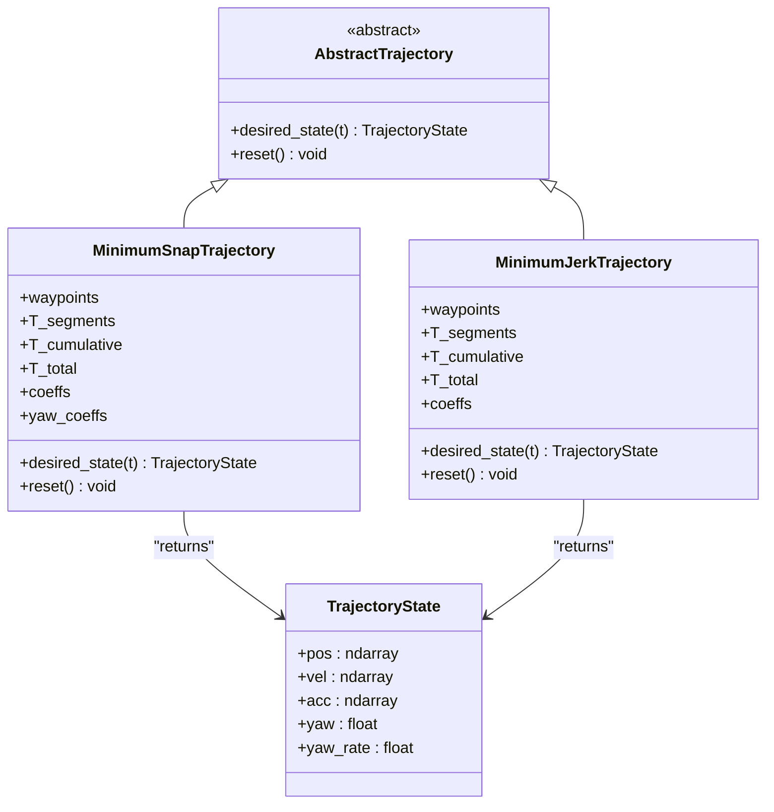
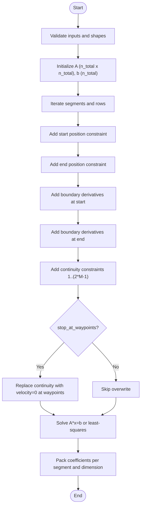
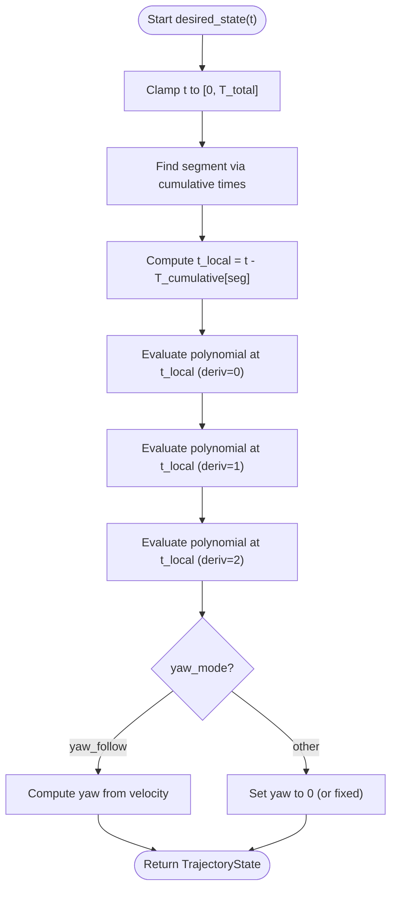
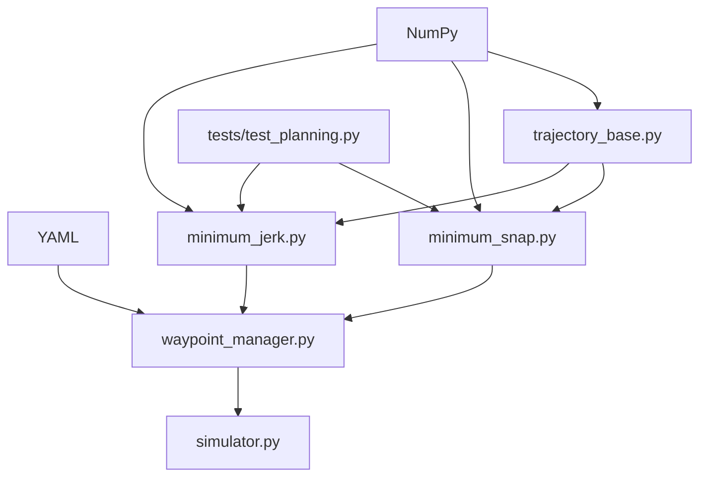

# Trajectory Algorithms

<cite>
**Referenced Files in This Document**
- [minimum_jerk.py](file://src/planning/minimum_jerk.py)
- [minimum_snap.py](file://src/planning/minimum_snap.py)
- [trajectory_base.py](file://src/planning/trajectory_base.py)
- [waypoint_manager.py](file://src/planning/waypoint_manager.py)
- [trajectory.yaml](file://config/trajectory.yaml)
- [test_planning.py](file://tests/test_planning.py)
- [simulator.py](file://src/simulation/simulator.py)
</cite>

## Table of Contents
1. [Introduction](#introduction)
2. [Project Structure](#project-structure)
3. [Core Components](#core-components)
4. [Architecture Overview](#architecture-overview)
5. [Detailed Component Analysis](#detailed-component-analysis)
6. [Dependency Analysis](#dependency-analysis)
7. [Performance Considerations](#performance-considerations)
8. [Troubleshooting Guide](#troubleshooting-guide)
9. [Conclusion](#conclusion)
10. [Appendices](#appendices)

## Introduction
This document explains the trajectory generation algorithms implemented for fixed-wing applications: minimum snap (minimizing fourth derivative of position) and minimum jerk (minimizing third derivative of position). It covers the mathematical foundations, algorithmic implementation, parameterization, boundary conditions, continuity enforcement, and practical usage patterns. It also compares the two approaches, discusses computational complexity and numerical stability, and provides guidance for selecting the right algorithm for different scenarios.

## Project Structure
The trajectory planning module is organized around a shared interface and reusable solvers:
- A common interface defines the desired state query and a state container for position, velocity, acceleration, yaw, and yaw rate.
- A matrix-based solver constructs piecewise polynomials per segment and enforces boundary and continuity constraints.
- Specialized trajectory classes wrap the solver for minimum snap and minimum jerk, and expose a unified interface for downstream control and simulation.
- A waypoint manager loads configurations, manages waypoints, and builds trajectory instances.

**Diagram sources**
- [trajectory_base.py](file://src/planning/trajectory_base.py#L16-L47)
- [minimum_snap.py](file://src/planning/minimum_snap.py#L47-L142)
- [minimum_jerk.py](file://src/planning/minimum_jerk.py#L17-L71)
- [waypoint_manager.py](file://src/planning/waypoint_manager.py#L20-L160)
- [trajectory.yaml](file://config/trajectory.yaml#L1-L23)
- [test_planning.py](file://tests/test_planning.py#L27-L31)
- [simulator.py](file://src/simulation/simulator.py#L48-L52)

**Section sources**
- [trajectory_base.py](file://src/planning/trajectory_base.py#L1-L47)
- [minimum_snap.py](file://src/planning/minimum_snap.py#L1-L253)
- [minimum_jerk.py](file://src/planning/minimum_jerk.py#L1-L71)
- [waypoint_manager.py](file://src/planning/waypoint_manager.py#L1-L208)
- [trajectory.yaml](file://config/trajectory.yaml#L1-L23)
- [test_planning.py](file://tests/test_planning.py#L1-L328)
- [simulator.py](file://src/simulation/simulator.py#L48-L52)

## Core Components
- AbstractTrajectory and TrajectoryState define a uniform interface and state representation used by all trajectory types.
- minimum_snap_coeffs builds a linear system A x = b from boundary and continuity constraints, then solves for polynomial coefficients.
- MinimumSnapTrajectory and MinimumJerkTrajectory encapsulate the solver and provide desired_state(t) for time-based queries.
- WaypointManager loads configuration, manages waypoints, and constructs trajectory instances.

Key implementation highlights:
- Polynomial basis: per segment, each spatial axis and yaw is represented by a degree-(2*M − 1) polynomial, where M controls the derivative order.
- Constraints: start/end positions, boundary derivatives (derivatives 1..(M−1) set to zero at start/end), and continuity of derivatives 1..(2*M − 1) across interior waypoints.
- Time allocation: either explicit segment durations or derived from waypoint distances and average speed.
- Numerical stability: detects ill-conditioning and falls back to least-squares solving.

**Section sources**
- [trajectory_base.py](file://src/planning/trajectory_base.py#L16-L47)
- [minimum_snap.py](file://src/planning/minimum_snap.py#L47-L142)
- [minimum_jerk.py](file://src/planning/minimum_jerk.py#L17-L71)
- [waypoint_manager.py](file://src/planning/waypoint_manager.py#L127-L160)

## Architecture Overview
The trajectory pipeline integrates with the broader simulation stack. WaypointManager constructs a trajectory from configuration and waypoints, and the simulator consumes desired states for control and visualization.

**Diagram sources**
- [waypoint_manager.py](file://src/planning/waypoint_manager.py#L80-L160)
- [minimum_snap.py](file://src/planning/minimum_snap.py#L167-L253)
- [minimum_jerk.py](file://src/planning/minimum_jerk.py#L17-L71)
- [simulator.py](file://src/simulation/simulator.py#L115-L200)

## Detailed Component Analysis

### Mathematical Foundations and Optimality Conditions
- Minimum snap minimizes the integral of the square of the fourth derivative (snap) along the trajectory, encouraging smooth acceleration profiles.
- Minimum jerk minimizes the integral of the square of the third derivative (jerk), favoring smooth changes in acceleration.
- Both are formulated as variational problems subject to boundary and continuity constraints.

Implementation constraints enforced by the solver:
- Start/end positions per segment.
- Boundary conditions: derivatives 1..(M−1) set to zero at start and end.
- Continuity: derivatives 1..(2*M − 1) must match across adjacent segments at interior waypoints.
- Optional stop-at-waypoints: enforce zero velocity at intermediate waypoints by overriding the continuity constraint for the first derivative.

These constraints yield a linear system A x = b, where x collects polynomial coefficients across segments and dimensions.

**Section sources**
- [minimum_snap.py](file://src/planning/minimum_snap.py#L47-L142)

### Polynomial Parameterization and Segment-wise Construction
- Each segment is parameterized by a polynomial of degree (2*M − 1) in normalized time t ∈ [0, T_segment].
- For minimum snap, M = 4 (degree 7), and for minimum jerk, M = 3 (degree 5).
- Coefficients are computed per spatial dimension (N, E, D) and per segment, then evaluated at local time to obtain position, velocity, and acceleration.

Evaluation helper:
- _eval_poly computes the k-th derivative at local time using a coefficient vector derived from the polynomial order and derivative order.

**Section sources**
- [minimum_snap.py](file://src/planning/minimum_snap.py#L47-L142)
- [minimum_snap.py](file://src/planning/minimum_snap.py#L145-L164)

### Boundary Condition Handling and Continuity Enforcement
- Start and end position constraints are applied per segment.
- Boundary derivatives (1..(M−1)) are constrained to zero at the start and end of the trajectory.
- Continuity across interior waypoints requires matching derivatives 1..(2*M − 1).
- Optional stop-at-waypoints replaces the continuity constraint for the first derivative at intermediate waypoints with a zero-velocity requirement.

Matrix construction:
- The solver iterates over segments and rows of the linear system, inserting constraints in a structured manner to ensure the correct number of equations and degrees of freedom.

**Section sources**
- [minimum_snap.py](file://src/planning/minimum_snap.py#L75-L142)

### Time Allocation Strategies
- If segment durations are not provided, the planner estimates them from waypoint distances and an average speed threshold.
- The cumulative segment times enable fast segment lookup via binary search for desired_state queries.

**Section sources**
- [minimum_snap.py](file://src/planning/minimum_snap.py#L200-L205)
- [minimum_jerk.py](file://src/planning/minimum_jerk.py#L38-L43)
- [waypoint_manager.py](file://src/planning/waypoint_manager.py#L127-L160)

### Implementation Details: MinimumSnapTrajectory
- Stores waypoints, segment times, cumulative times, and total duration.
- Computes coefficients using minimum_snap_coeffs with deriv_order=4.
- Supports yaw modes: zero, yaw_follow, and fixed (via separate yaw trajectory).
- desired_state clamps time to [0, T_total], locates the active segment, evaluates polynomials, and computes yaw based on mode.

**Section sources**
- [minimum_snap.py](file://src/planning/minimum_snap.py#L167-L253)

### Implementation Details: MinimumJerkTrajectory
- Reuses the same solver with deriv_order=3 to produce 5th-order polynomials per segment.
- Inherits time allocation and segment lookup from the base solver.
- desired_state computes position, velocity, acceleration, and yaw according to yaw mode.

**Section sources**
- [minimum_jerk.py](file://src/planning/minimum_jerk.py#L17-L71)

### Class Relationships

**Diagram sources**
- [trajectory_base.py](file://src/planning/trajectory_base.py#L16-L47)
- [minimum_snap.py](file://src/planning/minimum_snap.py#L167-L253)
- [minimum_jerk.py](file://src/planning/minimum_jerk.py#L17-L71)

### Algorithm Flow: Coefficient Solver

**Diagram sources**
- [minimum_snap.py](file://src/planning/minimum_snap.py#L75-L142)

### Algorithm Flow: Desired State Evaluation

**Diagram sources**
- [minimum_snap.py](file://src/planning/minimum_snap.py#L227-L249)
- [minimum_jerk.py](file://src/planning/minimum_jerk.py#L50-L67)

## Dependency Analysis
- AbstractTrajectory and TrajectoryState are the core interfaces consumed by the simulator and control layers.
- WaypointManager depends on configuration files and trajectory classes to construct and cache trajectories.
- Tests exercise solver correctness, continuity, and finite-coefficient properties.

**Diagram sources**
- [trajectory_base.py](file://src/planning/trajectory_base.py#L10-L14)
- [minimum_snap.py](file://src/planning/minimum_snap.py#L18-L21)
- [minimum_jerk.py](file://src/planning/minimum_jerk.py#L10-L14)
- [waypoint_manager.py](file://src/planning/waypoint_manager.py#L10-L17)
- [test_planning.py](file://tests/test_planning.py#L16-L31)
- [simulator.py](file://src/simulation/simulator.py#L48-L52)

**Section sources**
- [trajectory_base.py](file://src/planning/trajectory_base.py#L1-L47)
- [minimum_snap.py](file://src/planning/minimum_snap.py#L1-L253)
- [minimum_jerk.py](file://src/planning/minimum_jerk.py#L1-L71)
- [waypoint_manager.py](file://src/planning/waypoint_manager.py#L1-L208)
- [test_planning.py](file://tests/test_planning.py#L1-L328)
- [simulator.py](file://src/simulation/simulator.py#L48-L52)

## Performance Considerations
- Computational complexity: The solver constructs a dense linear system with size proportional to the number of segments and dimensions. For n segments and d dimensions, the system size scales roughly as (2*M*n*d)^2 in the worst case. Typical usage involves small n (short missions) and d=3, keeping the system manageable.
- Numerical stability: Large segment durations can lead to ill-conditioned matrices. The solver warns on potential ill-conditioning and falls back to least-squares solving to maintain robustness.
- Time allocation: Using average speed to estimate segment times avoids overly long segments that could degrade conditioning.
- Evaluation cost: desired_state performs a constant-time segment lookup plus polynomial evaluation per dimension, which is efficient for real-time control.

Practical guidance:
- Prefer reasonable average speeds to keep segment times moderate.
- For long missions, consider subdividing waypoints to reduce segment length and improve conditioning.
- Use stop_at_waypoints judiciously; it reduces continuity freedom and may increase snap/jerk locally.

**Section sources**
- [minimum_snap.py](file://src/planning/minimum_snap.py#L132-L138)
- [minimum_snap.py](file://src/planning/minimum_snap.py#L200-L205)
- [minimum_jerk.py](file://src/planning/minimum_jerk.py#L38-L43)

## Troubleshooting Guide
Common issues and remedies:
- Non-finite coefficients: Occur with extreme segment durations or degenerate waypoint geometry. Verify segment times and waypoint spacing; consider adjusting average speed or waypoint placement.
- Discontinuous velocities or accelerations: Ensure stop_at_waypoints is not inadvertently enabled when continuity is required, or confirm that continuity constraints are correctly applied.
- Incorrect yaw alignment: Check yaw_mode settings and verify that velocity magnitude thresholds are met before computing yaw from velocity.
- Configuration errors: Validate YAML format and ensure at least two waypoints are present before building a trajectory.

Validation references:
- Tests verify position at start/end, intermediate waypoint passage, velocity continuity, finite coefficients, and basic kinematic properties.

**Section sources**
- [test_planning.py](file://tests/test_planning.py#L73-L116)
- [test_planning.py](file://tests/test_planning.py#L188-L246)
- [waypoint_manager.py](file://src/planning/waypoint_manager.py#L127-L160)

## Conclusion
The minimum snap and minimum jerk trajectory implementations provide robust, configurable solutions for fixed-wing path planning. They share a common solver and interface, differ primarily in the derivative order enforced by the solver, and support flexible time allocation and yaw modeling. Their design emphasizes numerical stability and ease of integration into larger simulation and control systems.

## Appendices

### Practical Selection Criteria
- Choose minimum jerk when smoother acceleration transitions are prioritized (e.g., passenger comfort, payload safety).
- Choose minimum snap when stricter suppression of snap is desired, particularly for systems sensitive to rapid changes in acceleration.
- For fixed-wing applications, minimum jerk often yields more practical control inputs due to its lower polynomial order per segment.

### Example Workflows
- Configure waypoints and parameters in the trajectory YAML file and load them via WaypointManager.
- Build a trajectory instance and query desired states at discrete time steps for control or visualization.
- Adjust average speed or segment durations to tune trajectory smoothness and timing.

**Section sources**
- [trajectory.yaml](file://config/trajectory.yaml#L1-L23)
- [waypoint_manager.py](file://src/planning/waypoint_manager.py#L80-L160)
- [simulator.py](file://src/simulation/simulator.py#L115-L200)