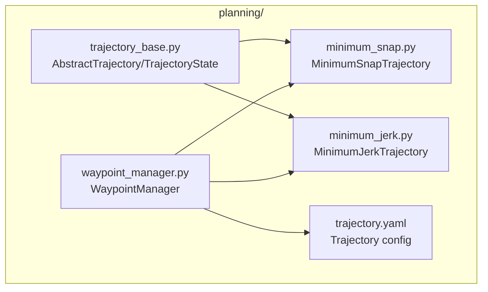
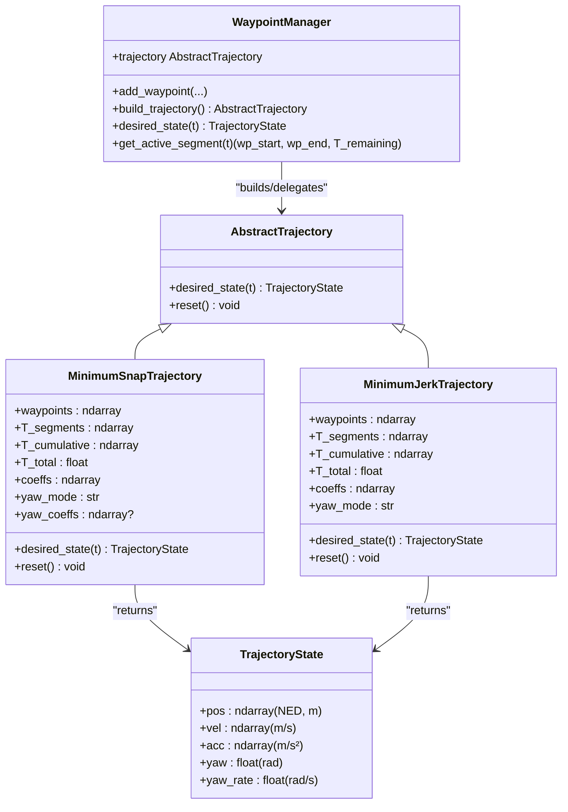
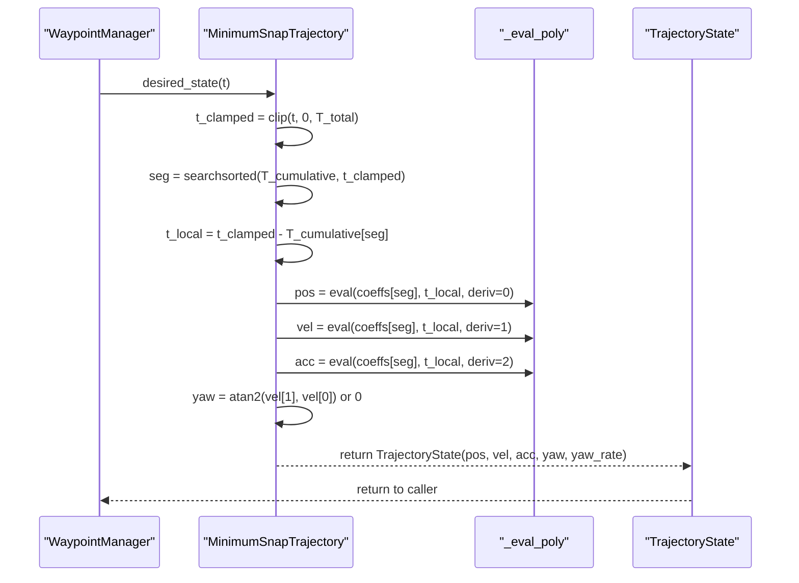
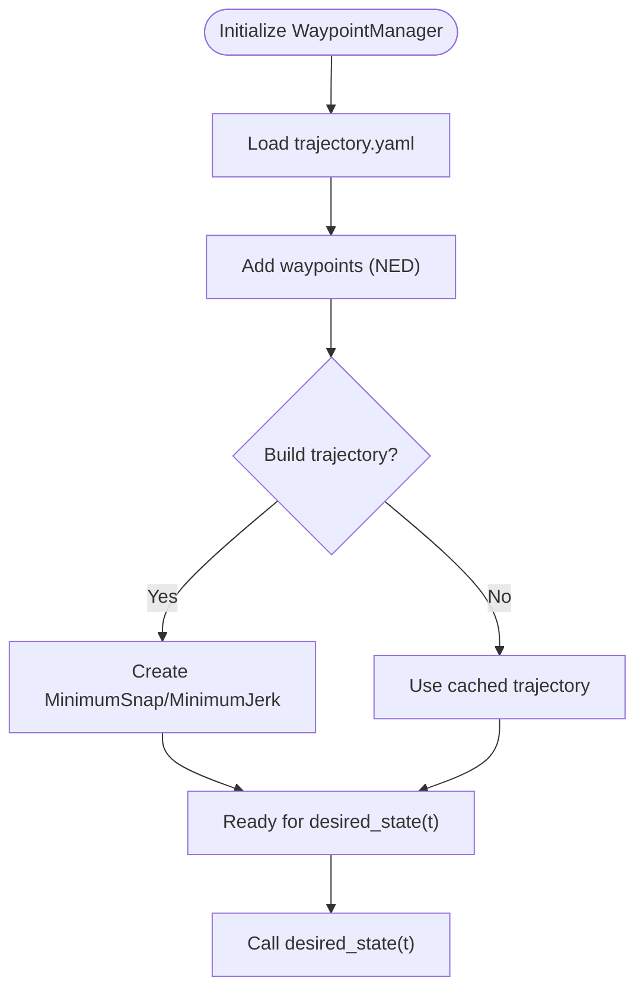
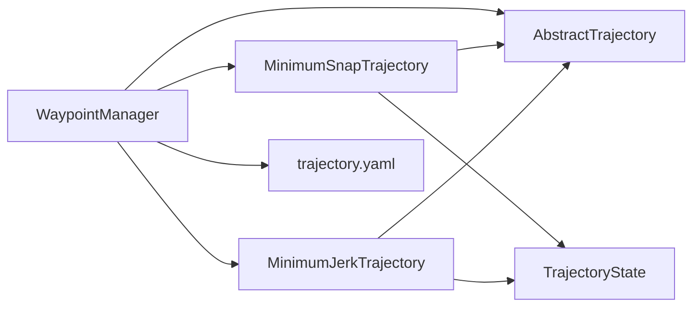
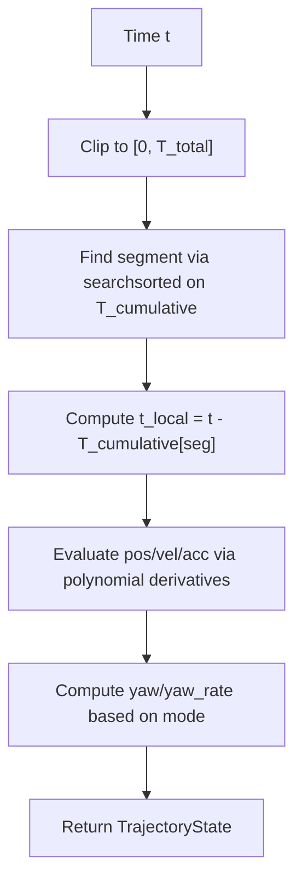

# Trajectory Base Classes

<cite>
**Referenced Files in This Document**
- [trajectory_base.py](file://src/planning/trajectory_base.py)
- [minimum_snap.py](file://src/planning/minimum_snap.py)
- [minimum_jerk.py](file://src/planning/minimum_jerk.py)
- [waypoint_manager.py](file://src/planning/waypoint_manager.py)
- [trajectory.yaml](file://config/trajectory.yaml)
- [test_planning.py](file://tests/test_planning.py)
- [3_trajectory_tracking.py](file://examples/3_trajectory_tracking.py)
</cite>

## Table of Contents
1. [Introduction](#introduction)
2. [Project Structure](#project-structure)
3. [Core Components](#core-components)
4. [Architecture Overview](#architecture-overview)
5. [Detailed Component Analysis](#detailed-component-analysis)
6. [Dependency Analysis](#dependency-analysis)
7. [Performance Considerations](#performance-considerations)
8. [Troubleshooting Guide](#troubleshooting-guide)
9. [Conclusion](#conclusion)
10. [Appendices](#appendices)

## Introduction
This document explains the abstract trajectory base classes and data structures used in the planning system. It covers the AbstractTrajectory interface design, the TrajectoryState data structure (including position, velocity, acceleration, and higher-order derivatives), the trajectory evaluation interface, time parameterization, and state extraction methods. It also documents the segment-based trajectory architecture, cumulative time computation, and active segment determination. Finally, it provides guidance on implementing custom trajectory types, extending the base interface, and integrating with the broader planning system, highlighting design patterns, abstraction layers, and extensibility mechanisms.

## Project Structure
The trajectory system resides under the planning module and integrates with configuration, testing, and examples:
- Abstract base and data structure: trajectory_base.py
- Minimum-Snap trajectory implementation: minimum_snap.py
- Minimum-Jerk trajectory implementation: minimum_jerk.py
- Waypoint management and factory: waypoint_manager.py
- Configuration: trajectory.yaml
- Tests: test_planning.py
- Example usage: 3_trajectory_tracking.py

**Diagram sources**
- [trajectory_base.py](file://src/planning/trajectory_base.py#L1-L47)
- [minimum_snap.py](file://src/planning/minimum_snap.py#L1-L253)
- [minimum_jerk.py](file://src/planning/minimum_jerk.py#L1-L71)
- [waypoint_manager.py](file://src/planning/waypoint_manager.py#L1-L208)
- [trajectory.yaml](file://config/trajectory.yaml#L1-L23)

**Section sources**
- [trajectory_base.py](file://src/planning/trajectory_base.py#L1-L47)
- [minimum_snap.py](file://src/planning/minimum_snap.py#L1-L253)
- [minimum_jerk.py](file://src/planning/minimum_jerk.py#L1-L71)
- [waypoint_manager.py](file://src/planning/waypoint_manager.py#L1-L208)
- [trajectory.yaml](file://config/trajectory.yaml#L1-L23)

## Core Components
This section focuses on the two foundational elements:
- AbstractTrajectory: the unified interface contract for all trajectory types.
- TrajectoryState: the data structure representing desired state at a given time.

Key characteristics:
- AbstractTrajectory defines the desired_state(t) method and an optional reset mechanism.
- TrajectoryState encapsulates pos (NED position in meters), vel (velocity in m/s), acc (acceleration in m/s²), yaw (desired yaw in radians), and yaw_rate (desired yaw rate in rad/s).
- Both components are designed to be coordinate-system consistent with the simulator’s NED convention.

**Section sources**
- [trajectory_base.py](file://src/planning/trajectory_base.py#L16-L47)

## Architecture Overview
The system follows a layered design:
- WaypointManager manages waypoints, loads configuration, selects trajectory type, and constructs the appropriate trajectory instance.
- AbstractTrajectory defines the interface; MinimumSnapTrajectory and MinimumJerkTrajectory implement concrete behaviors.
- TrajectoryState is the shared data carrier passed across the planning and control loops.

**Diagram sources**
- [trajectory_base.py](file://src/planning/trajectory_base.py#L16-L47)
- [minimum_snap.py](file://src/planning/minimum_snap.py#L167-L253)
- [minimum_jerk.py](file://src/planning/minimum_jerk.py#L17-L71)
- [waypoint_manager.py](file://src/planning/waypoint_manager.py#L20-L208)

## Detailed Component Analysis

### AbstractTrajectory Interface
- Purpose: Provide a uniform interface for all trajectory implementations so higher-level control logic remains agnostic of the specific trajectory type.
- Contract:
  - desired_state(t: float) -> TrajectoryState: returns the desired state at time t.
  - reset(): optional method to reset internal state (e.g., segment index) for replay or looping scenarios.
- Design implications:
  - Enforces consistent output shape and units via TrajectoryState.
  - Encourages robust time clamping and segment-local evaluation.

Implementation notes:
- Subclasses must ensure continuity and numerical stability across segments.
- Subclasses should clamp t to [0, T_total] and handle boundary conditions explicitly.

**Section sources**
- [trajectory_base.py](file://src/planning/trajectory_base.py#L26-L47)

### TrajectoryState Data Structure
- Fields and units:
  - pos: NED position vector (meters)
  - vel: velocity vector (m/s)
  - acc: acceleration vector (m/s²)
  - yaw: desired yaw angle (radians)
  - yaw_rate: desired yaw rate (radians/s)
- Coordinate system:
  - All vectors are expressed in NED (North, East, Down), aligning with the simulator’s state representation.
- Time dependency:
  - desired_state(t) returns a unique TrajectoryState for each t, ensuring continuity across segments.

Validation and expectations:
- Tests confirm that pos, vel, and acc are finite and three-dimensional.
- Boundary handling ensures consistent behavior at t < 0 and t > T_total.

**Section sources**
- [trajectory_base.py](file://src/planning/trajectory_base.py#L16-L24)
- [test_planning.py](file://tests/test_planning.py#L145-L171)

### MinimumSnapTrajectory
- Implementation highlights:
  - Piecewise polynomials per segment; order determined by deriv_order (default 4 for minimum snap).
  - Coefficient solver constructs a linear system A @ x = b and solves for polynomial coefficients.
  - Evaluation function computes position, velocity, and acceleration via derivatives of the polynomial.
  - Yaw handling: either follow velocity direction (yaw_follow) or remain fixed (zero or fixed).
- Time parameterization:
  - Clamps t to [0, T_total].
  - Uses cumulative segment times to locate the active segment and compute local time t_local.
  - Evaluates polynomial derivatives to obtain pos, vel, acc.
- State extraction:
  - Returns TrajectoryState with pos, vel, acc, yaw, and yaw_rate.

**Diagram sources**
- [minimum_snap.py](file://src/planning/minimum_snap.py#L227-L252)
- [minimum_snap.py](file://src/planning/minimum_snap.py#L145-L164)

**Section sources**
- [minimum_snap.py](file://src/planning/minimum_snap.py#L167-L253)

### MinimumJerkTrajectory
- Implementation highlights:
  - Reuses the coefficient solver from minimum_snap with deriv_order=3, yielding 5th-order polynomials per segment.
  - Interface identical to MinimumSnapTrajectory for seamless substitution and comparison.
  - Yaw handling follows the same modes (e.g., yaw_follow).
- Differences from MinimumSnapTrajectory:
  - Different optimization criterion (jerk vs snap), leading to potentially smoother acceleration profiles.
  - Same desired_state signature and behavior for callers.

**Section sources**
- [minimum_jerk.py](file://src/planning/minimum_jerk.py#L17-L71)

### WaypointManager: Factory and Integration
- Responsibilities:
  - Manage waypoints in NED coordinates (altitudes given as positive-up are converted to NED down).
  - Build trajectory instances based on configuration (type, average_speed, yaw_mode, loop).
  - Provide convenience methods: desired_state(t), get_active_segment(t), and YAML load/save.
- Key flows:
  - load_from_yaml reads trajectory.yaml and sets internal parameters.
  - build_trajectory constructs either MinimumSnapTrajectory or MinimumJerkTrajectory.
  - get_active_segment determines the current segment and remaining time at time t.

**Diagram sources**
- [waypoint_manager.py](file://src/planning/waypoint_manager.py#L80-L160)
- [waypoint_manager.py](file://src/planning/waypoint_manager.py#L178-L207)

**Section sources**
- [waypoint_manager.py](file://src/planning/waypoint_manager.py#L20-L208)
- [trajectory.yaml](file://config/trajectory.yaml#L1-L23)

### Configuration: trajectory.yaml
- Configuration items:
  - type: trajectory type (minimum_snap | minimum_jerk)
  - average_speed: m/s, used to estimate segment times when T_segments is not provided
  - yaw_mode: control mode for yaw (e.g., yaw_follow)
  - waypoints: list of [north_m, east_m, alt_m] (positive-up; internally converted to NED down)
  - loop: whether to loop back to the first waypoint
- Interaction:
  - WaypointManager.load_from_yaml maps these keys to its attributes and internal waypoint storage.

**Section sources**
- [trajectory.yaml](file://config/trajectory.yaml#L1-L23)
- [waypoint_manager.py](file://src/planning/waypoint_manager.py#L80-L122)

### Integration with the Broader Planning System
- Example usage:
  - The example script demonstrates constructing a FixedWingSimulator in AUTO mode and feeding desired states from WaypointManager to the closed-loop simulation.
- Typical integration steps:
  - Configure trajectory.yaml or programmatically set WaypointManager parameters.
  - Build trajectory via WaypointManager.
  - Periodically call desired_state(t) during simulation to obtain TrajectoryState for control.

**Section sources**
- [3_trajectory_tracking.py](file://examples/3_trajectory_tracking.py#L70-L98)
- [waypoint_manager.py](file://src/planning/waypoint_manager.py#L205-L207)

## Dependency Analysis
- Module coupling:
  - AbstractTrajectory and TrajectoryState form the core contract; all trajectory implementations depend on them.
  - WaypointManager depends on AbstractTrajectory and concrete implementations, and interacts with configuration.
  - MinimumSnapTrajectory and MinimumJerkTrajectory share coefficient computation and evaluation utilities.
- External dependencies:
  - NumPy for vectorized computations and array operations.
  - YAML for configuration parsing and serialization.

**Diagram sources**
- [waypoint_manager.py](file://src/planning/waypoint_manager.py#L15-L18)
- [minimum_snap.py](file://src/planning/minimum_snap.py#L21-L22)
- [minimum_jerk.py](file://src/planning/minimum_jerk.py#L13-L14)
- [trajectory_base.py](file://src/planning/trajectory_base.py#L10-L13)

**Section sources**
- [waypoint_manager.py](file://src/planning/waypoint_manager.py#L1-L208)
- [minimum_snap.py](file://src/planning/minimum_snap.py#L1-L253)
- [minimum_jerk.py](file://src/planning/minimum_jerk.py#L1-L71)
- [trajectory_base.py](file://src/planning/trajectory_base.py#L1-L47)

## Performance Considerations
- Coefficient solver stability:
  - Large segment durations can lead to ill-conditioned systems; the solver logs warnings and falls back to least-squares when necessary.
- Time query efficiency:
  - Binary search is used to locate segments, achieving O(log n) complexity suitable for real-time simulation.
- Numerical precision:
  - Threshold protection prevents unstable yaw computation at low speeds.
- Practical checks:
  - Tests verify finite coefficients and states across the trajectory duration.

**Section sources**
- [test_planning.py](file://tests/test_planning.py#L109-L116)
- [minimum_snap.py](file://src/planning/minimum_snap.py#L132-L138)
- [minimum_snap.py](file://src/planning/minimum_snap.py#L227-L252)

## Troubleshooting Guide
Common issues and resolutions:
- Insufficient waypoints:
  - Building a trajectory requires at least two waypoints; otherwise, a ValueError is raised.
- Unknown trajectory type:
  - Passing an unsupported type raises an error; ensure traj_type is one of the supported values.
- Time bounds:
  - desired_state handles out-of-range times by clamping to [0, T_total], returning start/end states respectively.
- Yaw behavior:
  - At low speeds, yaw may be set to zero to avoid oscillations; adjust thresholds or modes as needed.

Verification tips:
- Use tests as reference for validating continuity, finite states, and boundary conditions.
- Confirm that the active segment calculation yields sensible wp_start, wp_end, and remaining time.

**Section sources**
- [waypoint_manager.py](file://src/planning/waypoint_manager.py#L127-L159)
- [test_planning.py](file://tests/test_planning.py#L122-L171)
- [minimum_jerk.py](file://src/planning/minimum_jerk.py#L50-L67)

## Conclusion
The trajectory system centers on a clean abstraction: AbstractTrajectory defines a uniform interface, while TrajectoryState carries the desired state consistently across modules. MinimumSnapTrajectory and MinimumJerkTrajectory demonstrate how to implement smooth, segment-based trajectories with robust time parameterization and state extraction. WaypointManager acts as a factory and orchestrator, integrating configuration, waypoint management, and active segment computation. Together, these components provide a flexible, extensible foundation for adding new trajectory algorithms and integrating with the broader planning and control pipeline.

## Appendices

### Implementing a Custom Trajectory Type
Steps:
- Create a class that inherits from AbstractTrajectory.
- Implement desired_state(t) to return a TrajectoryState with pos, vel, acc, yaw, and yaw_rate.
- If your trajectory maintains internal state (e.g., segment index), implement reset() to reinitialize it.
- Optionally reuse existing utilities (e.g., cumulative time computation) or integrate with WaypointManager.

Guidelines:
- Ensure continuity and numerical stability across segments.
- Explicitly handle time clamping and boundary conditions.
- Keep units and coordinate frames consistent with NED.

Integration options:
- Register the new type in WaypointManager or construct it directly in your application code.

**Section sources**
- [trajectory_base.py](file://src/planning/trajectory_base.py#L26-L47)
- [waypoint_manager.py](file://src/planning/waypoint_manager.py#L127-L160)

### Segment-Based Architecture and Cumulative Time
- Segment times:
  - T_segments holds per-segment durations; T_cumulative stores cumulative times; T_total is the sum.
- Active segment determination:
  - Use binary search to locate the current segment from T_cumulative and compute t_local = t - T_cumulative[seg].
- Active segment access:
  - WaypointManager.get_active_segment returns the current wp_start, wp_end, and time remaining in the current segment.

**Diagram sources**
- [minimum_snap.py](file://src/planning/minimum_snap.py#L227-L252)
- [waypoint_manager.py](file://src/planning/waypoint_manager.py#L178-L207)

**Section sources**
- [minimum_snap.py](file://src/planning/minimum_snap.py#L200-L212)
- [waypoint_manager.py](file://src/planning/waypoint_manager.py#L178-L207)