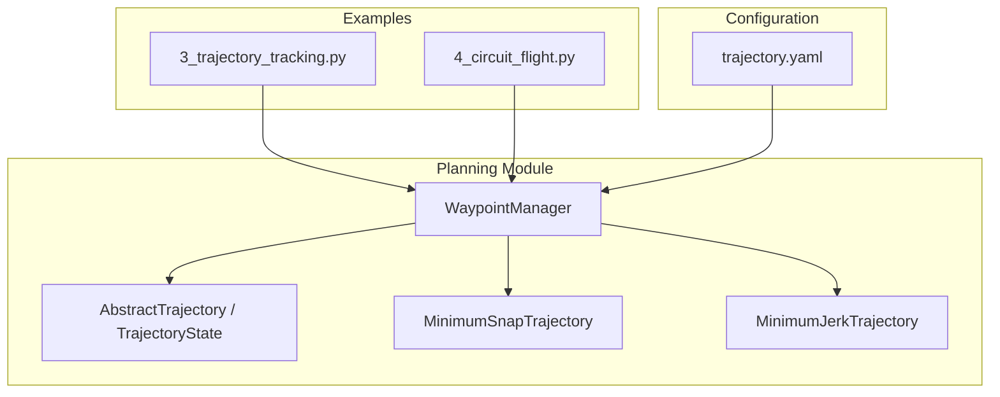
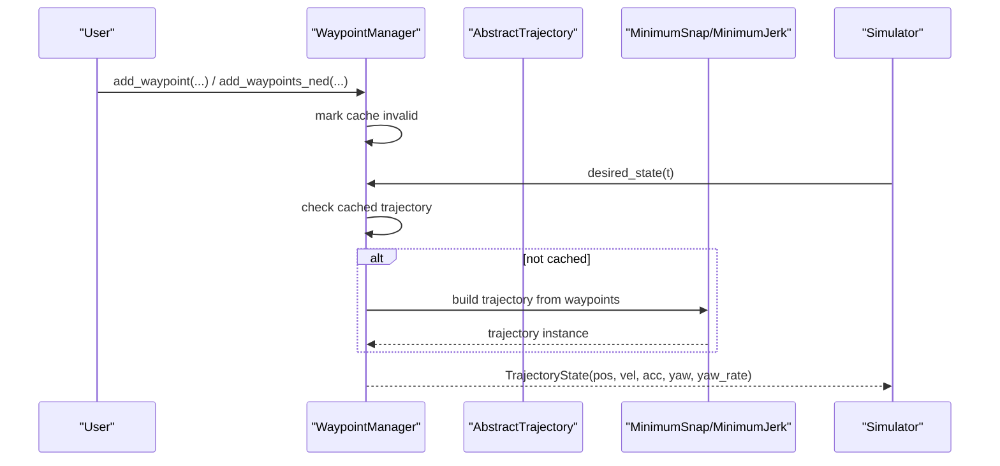
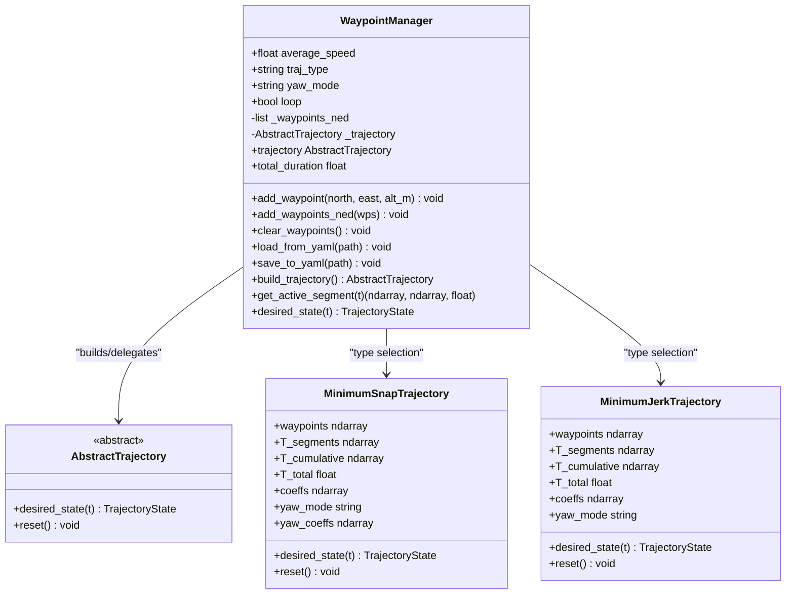
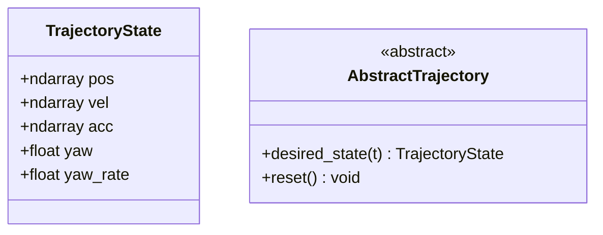
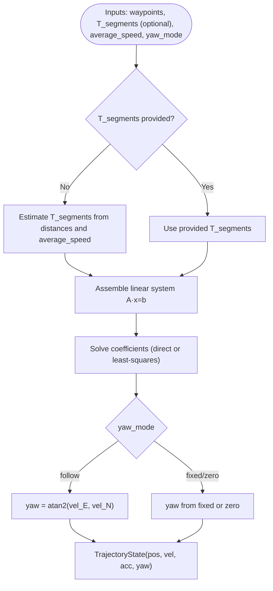
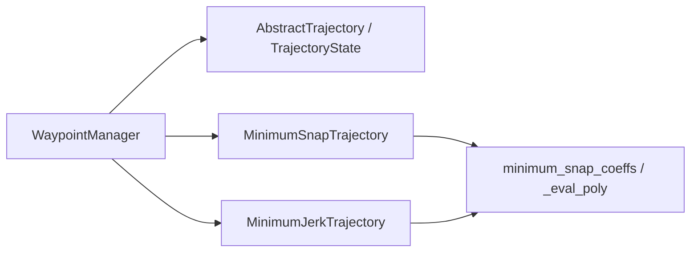

# Waypoint Management

<cite>
**Referenced Files in This Document**
- [waypoint_manager.py](file://src/planning/waypoint_manager.py)
- [trajectory_base.py](file://src/planning/trajectory_base.py)
- [minimum_snap.py](file://src/planning/minimum_snap.py)
- [minimum_jerk.py](file://src/planning/minimum_jerk.py)
- [trajectory.yaml](file://config/trajectory.yaml)
- [test_planning.py](file://tests/test_planning.py)
- [4_circuit_flight.py](file://examples/4_circuit_flight.py)
- [3_trajectory_tracking.py](file://examples/3_trajectory_tracking.py)
</cite>

## Table of Contents
1. [Introduction](#introduction)
2. [Project Structure](#project-structure)
3. [Core Components](#core-components)
4. [Architecture Overview](#architecture-overview)
5. [Detailed Component Analysis](#detailed-component-analysis)
6. [Dependency Analysis](#dependency-analysis)
7. [Performance Considerations](#performance-considerations)
8. [Troubleshooting Guide](#troubleshooting-guide)
9. [Conclusion](#conclusion)
10. [Appendices](#appendices)

## Introduction
This document provides comprehensive documentation for the WaypointManager class and the waypoint management system used for fixed-wing trajectory planning. It explains how waypoints are stored in NED coordinates, how altitude values are converted from positive-up to NED down format, and how to add waypoints individually, in bulk, or via YAML configuration. It covers trajectory caching and automatic invalidation when waypoints change, the relationship between waypoints and trajectory generation (including loop closure), and practical examples for mission planning and configuration management. Coordinate system transformations and unit handling are documented throughout.

## Project Structure
The waypoint management system resides in the planning module and integrates with trajectory generators and configuration files. Key files include:
- WaypointManager: central class managing waypoints and trajectory caching
- Trajectory base and implementations: shared interface and concrete trajectory types
- Configuration: YAML schema for waypoint and trajectory settings
- Examples and tests: usage patterns and validation

**Diagram sources**
- [waypoint_manager.py](file://src/planning/waypoint_manager.py#L20-L208)
- [trajectory_base.py](file://src/planning/trajectory_base.py#L16-L47)
- [minimum_snap.py](file://src/planning/minimum_snap.py#L167-L253)
- [minimum_jerk.py](file://src/planning/minimum_jerk.py#L17-L71)
- [trajectory.yaml](file://config/trajectory.yaml#L1-L23)
- [3_trajectory_tracking.py](file://examples/3_trajectory_tracking.py#L70-L98)
- [4_circuit_flight.py](file://examples/4_circuit_flight.py#L81-L119)

**Section sources**
- [waypoint_manager.py](file://src/planning/waypoint_manager.py#L1-L208)
- [trajectory_base.py](file://src/planning/trajectory_base.py#L1-L47)
- [minimum_snap.py](file://src/planning/minimum_snap.py#L1-L253)
- [minimum_jerk.py](file://src/planning/minimum_jerk.py#L1-L71)
- [trajectory.yaml](file://config/trajectory.yaml#L1-L23)
- [3_trajectory_tracking.py](file://examples/3_trajectory_tracking.py#L70-L98)
- [4_circuit_flight.py](file://examples/4_circuit_flight.py#L81-L119)

## Core Components
- WaypointManager: stores waypoints in NED coordinates, converts altitude from positive-up to NED down, caches trajectory objects, and exposes methods to add waypoints, load/save from YAML, and query desired states.
- AbstractTrajectory and TrajectoryState: define the unified interface and state container for trajectory outputs.
- MinimumSnapTrajectory and MinimumJerkTrajectory: concrete trajectory implementations with different smoothness criteria.

Key capabilities:
- Store waypoints as NED [north, east, down] meters
- Convert altitude input (positive-up) to NED down internally
- Build and cache trajectories (minimum snap or minimum jerk)
- Automatic invalidation of cached trajectory upon waypoint changes
- Loop closure support for cyclic missions
- YAML import/export of waypoints and trajectory settings

**Section sources**
- [waypoint_manager.py](file://src/planning/waypoint_manager.py#L20-L208)
- [trajectory_base.py](file://src/planning/trajectory_base.py#L16-L47)
- [minimum_snap.py](file://src/planning/minimum_snap.py#L167-L253)
- [minimum_jerk.py](file://src/planning/minimum_jerk.py#L17-L71)

## Architecture Overview
The WaypointManager acts as a factory and cache for trajectory objects. It receives user-defined waypoints, ensures they are in NED format, and constructs a trajectory object on demand. The simulator queries the manager for desired states at each time step.

**Diagram sources**
- [waypoint_manager.py](file://src/planning/waypoint_manager.py#L127-L167)
- [minimum_snap.py](file://src/planning/minimum_snap.py#L181-L250)
- [minimum_jerk.py](file://src/planning/minimum_jerk.py#L24-L71)

## Detailed Component Analysis

### WaypointManager: Storage, Conversion, and Caching
- Storage format: waypoints are stored as NED [north, east, down] meters.
- Altitude conversion: positive-up altitude inputs are converted to negative down values internally.
- Methods:
  - add_waypoint(north, east, alt_m): appends a single waypoint and invalidates cache
  - add_waypoints_ned(array): bulk-add NED waypoints and invalidate cache
  - clear_waypoints(): clears lists and cache
  - load_from_yaml(path): reads trajectory type, average speed, yaw mode, loop flag, and waypoints; converts alt_m to NED down
  - save_to_yaml(path): writes current waypoints and settings to YAML
  - build_trajectory(): validates count, optionally closes loop, selects trajectory type, and constructs trajectory
  - trajectory property: lazy-builds and returns cached trajectory
  - total_duration: convenience access to cumulative trajectory duration
  - get_active_segment(t): returns current segment start/end and remaining time
  - desired_state(t): delegates to underlying trajectory

**Diagram sources**
- [waypoint_manager.py](file://src/planning/waypoint_manager.py#L20-L208)
- [trajectory_base.py](file://src/planning/trajectory_base.py#L26-L47)
- [minimum_snap.py](file://src/planning/minimum_snap.py#L167-L253)
- [minimum_jerk.py](file://src/planning/minimum_jerk.py#L17-L71)

**Section sources**
- [waypoint_manager.py](file://src/planning/waypoint_manager.py#L20-L208)

### Trajectory Base and State
- TrajectoryState: standardized container with NED position, velocity, acceleration, yaw, and yaw rate.
- AbstractTrajectory: defines the desired_state interface that all trajectory implementations must provide.

**Diagram sources**
- [trajectory_base.py](file://src/planning/trajectory_base.py#L16-L47)

**Section sources**
- [trajectory_base.py](file://src/planning/trajectory_base.py#L16-L47)

### Minimum Snap Trajectory
- Uses piecewise polynomials with minimum-snap smoothness (4th derivative).
- Computes segment times from distances and average speed if not provided.
- Supports yaw modes: follow velocity direction or fixed yaw.
- Provides desired_state with position, velocity, acceleration, and yaw.

**Diagram sources**
- [minimum_snap.py](file://src/planning/minimum_snap.py#L47-L142)
- [minimum_snap.py](file://src/planning/minimum_snap.py#L181-L250)

**Section sources**
- [minimum_snap.py](file://src/planning/minimum_snap.py#L167-L253)

### Minimum Jerk Trajectory
- Identical interface to minimum snap but uses lower derivative order (3), resulting in smoother jerk characteristics.
- Same coefficient solver underpins both implementations.

**Section sources**
- [minimum_jerk.py](file://src/planning/minimum_jerk.py#L17-L71)

### YAML Configuration and Persistence
- load_from_yaml(path): reads trajectory type, average speed, yaw mode, loop flag, and waypoints; converts alt_m to NED down.
- save_to_yaml(path): writes current settings and waypoints to YAML.
- Example configuration demonstrates NED units and positive-up altitude semantics.

Practical notes:
- Waypoints are stored internally as NED [north, east, down]
- YAML waypoints specify alt_m as positive-up; conversion occurs during load
- Loop flag controls whether the last waypoint connects back to the first

**Section sources**
- [waypoint_manager.py](file://src/planning/waypoint_manager.py#L80-L121)
- [trajectory.yaml](file://config/trajectory.yaml#L1-L23)

### Loop Closure Functionality
- When loop is enabled and the first and last waypoints are not equal, the manager appends a copy of the first waypoint to form a closed path.
- This ensures seamless cyclic missions.

**Section sources**
- [waypoint_manager.py](file://src/planning/waypoint_manager.py#L144-L145)

### Coordinate System Transformations and Units
- Waypoints are stored in NED coordinates: [north, east, down] in meters.
- Altitude input is positive-up; internally converted to negative down.
- TrajectoryState outputs are in NED with consistent units.

**Section sources**
- [waypoint_manager.py](file://src/planning/waypoint_manager.py#L24-L25)
- [trajectory_base.py](file://src/planning/trajectory_base.py#L19-L23)

### Practical Examples and Workflows

#### Mission Planning Workflow
- Clear existing waypoints, add new ones, and optionally enable loop closure.
- Choose trajectory type and yaw mode based on mission needs.
- Save configuration to YAML for reproducibility.

Example scripts demonstrate:
- Adding waypoints programmatically and running closed-loop trajectory tracking
- Defining a circuit pattern and flying in waypoint-sequencing mode without polynomial trajectory

**Section sources**
- [3_trajectory_tracking.py](file://examples/3_trajectory_tracking.py#L70-L98)
- [4_circuit_flight.py](file://examples/4_circuit_flight.py#L81-L119)

#### YAML-Based Configuration Management
- Load a mission from YAML, adjust parameters, and export modified configurations.
- Useful for iterative mission design and sharing configurations.

**Section sources**
- [waypoint_manager.py](file://src/planning/waypoint_manager.py#L80-L121)
- [trajectory.yaml](file://config/trajectory.yaml#L1-L23)

## Dependency Analysis
WaypointManager depends on the trajectory abstraction and concrete implementations. Trajectory implementations rely on shared coefficient computation utilities.

**Diagram sources**
- [waypoint_manager.py](file://src/planning/waypoint_manager.py#L15-L17)
- [minimum_snap.py](file://src/planning/minimum_snap.py#L47-L142)
- [minimum_jerk.py](file://src/planning/minimum_jerk.py#L14-L14)

**Section sources**
- [waypoint_manager.py](file://src/planning/waypoint_manager.py#L15-L17)
- [minimum_snap.py](file://src/planning/minimum_snap.py#L47-L142)
- [minimum_jerk.py](file://src/planning/minimum_jerk.py#L14-L14)

## Performance Considerations
- Matrix conditioning: large segment times can lead to ill-conditioned systems; the solver falls back to least-squares with a warning.
- Time allocation: segment durations are estimated from distances and average speed to balance smoothness and feasibility.
- Query efficiency: cumulative time tables enable O(log N) segment lookup.
- Memory: waypoints and coefficients are stored as contiguous numpy arrays; caching avoids repeated trajectory construction.

**Section sources**
- [minimum_snap.py](file://src/planning/minimum_snap.py#L132-L138)
- [minimum_snap.py](file://src/planning/minimum_snap.py#L200-L205)
- [waypoint_manager.py](file://src/planning/waypoint_manager.py#L192-L201)

## Troubleshooting Guide
- Fewer than two waypoints: building a trajectory raises an error; ensure at least two waypoints are present.
- Loop closure mismatch: if loop is enabled but first and last waypoints differ, the manager appends a copy of the first waypoint to close the loop.
- Initial height mismatch: the simulator adjusts the first waypoint’s down component to avoid excessive descent at start.
- Navigation mode selection: when using waypoint-sequencing mode, ensure waypoints are loaded before running the simulation.

Validation references:
- Waypoint count validation and loop closure behavior
- Initial height alignment behavior in the simulator

**Section sources**
- [waypoint_manager.py](file://src/planning/waypoint_manager.py#L139-L145)
- [test_planning.py](file://tests/test_planning.py#L289-L294)

## Conclusion
The WaypointManager provides a robust, efficient, and flexible foundation for fixed-wing mission planning. It unifies waypoint storage in NED coordinates, manages altitude conversions consistently, and offers both immediate waypoint-sequencing and polynomial trajectory modes. Through YAML persistence, caching, and automatic invalidation, it supports iterative mission design and reliable closed-loop simulation.

## Appendices

### Data Model and Storage
- Internal storage: NED [north, east, down] meters
- Altitude semantics: positive-up input converted to NED down internally
- YAML fields: type, average_speed, yaw_mode, loop, waypoints

**Section sources**
- [waypoint_manager.py](file://src/planning/waypoint_manager.py#L24-L25)
- [waypoint_manager.py](file://src/planning/waypoint_manager.py#L80-L121)
- [trajectory.yaml](file://config/trajectory.yaml#L3-L22)

### Editing and Modification Methods
- Dynamic addition: add_waypoint, add_waypoints_ned
- Deletion: clear_waypoints
- Modification: load_from_yaml, save_to_yaml

**Section sources**
- [waypoint_manager.py](file://src/planning/waypoint_manager.py#L54-L121)

### Relationship Between Waypoints and Trajectories
- Waypoints define piecewise segments; trajectory generators interpolate between them with smoothness constraints.
- Loop closure: optional cyclic connection between last and first waypoints.
- Yaw modes: follow velocity direction or fixed yaw.

**Section sources**
- [waypoint_manager.py](file://src/planning/waypoint_manager.py#L144-L158)
- [minimum_snap.py](file://src/planning/minimum_snap.py#L214-L249)
- [minimum_jerk.py](file://src/planning/minimum_jerk.py#L63-L67)

### Import/Export and Format Conversion
- Import: load_from_yaml parses trajectory settings and waypoints, converting alt_m to NED down
- Export: save_to_yaml writes current waypoints and settings to YAML
- Conversion: positive-up altitude → NED down

**Section sources**
- [waypoint_manager.py](file://src/planning/waypoint_manager.py#L80-L121)

### Usage Examples and Best Practices
- Example scripts show adding waypoints and running simulations in AUTO mode with polynomial trajectory tracking
- Best practices: clear waypoints before adding, choose appropriate average speed, confirm loop and yaw modes, and validate mission before closed-loop runs

**Section sources**
- [3_trajectory_tracking.py](file://examples/3_trajectory_tracking.py#L70-L98)
- [4_circuit_flight.py](file://examples/4_circuit_flight.py#L81-L119)