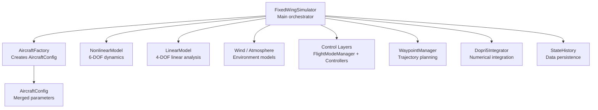
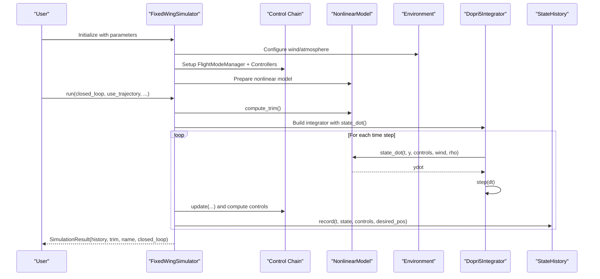
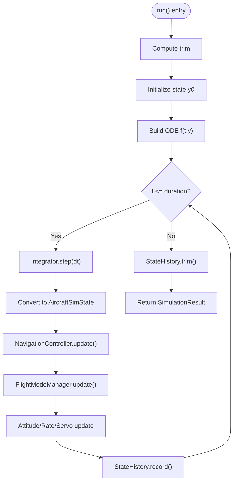
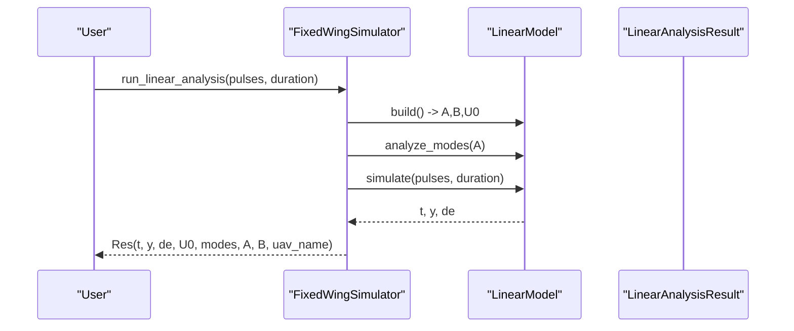
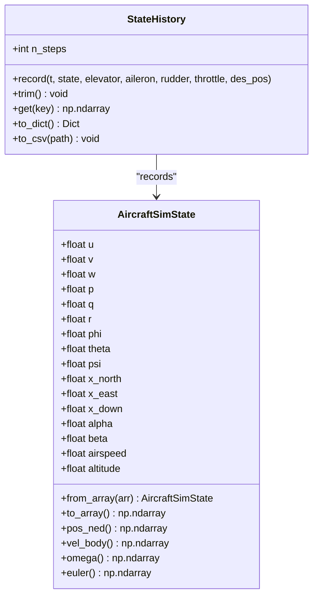
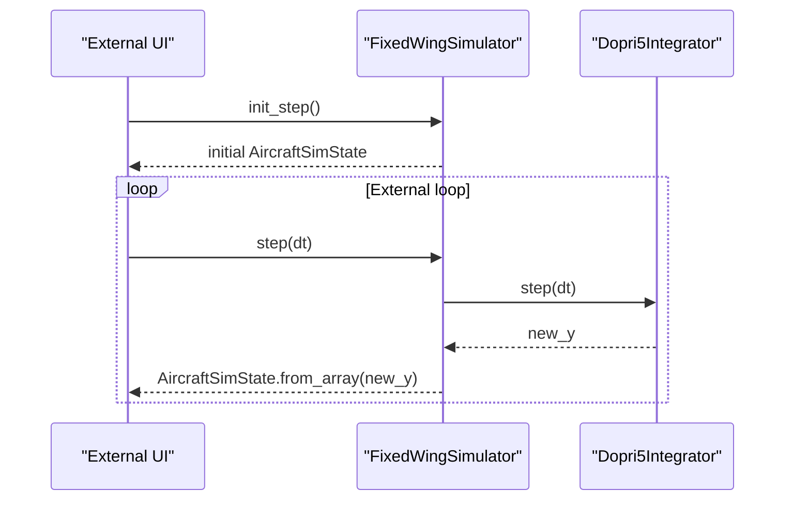
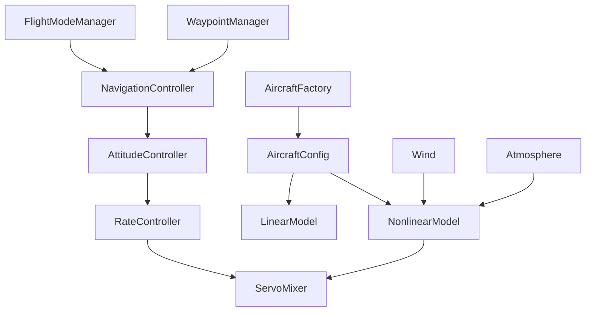
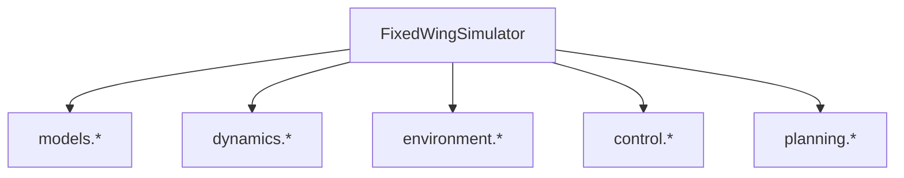

# FixedWingSimulator Main Class

<cite>
**Referenced Files in This Document**
- [simulator.py](file://src/simulation/simulator.py)
- [state_manager.py](file://src/simulation/state_manager.py)
- [integrator.py](file://src/simulation/integrator.py)
- [flight_mode_manager.py](file://src/control/flight_mode_manager.py)
- [linear_model.py](file://src/dynamics/linear_model.py)
- [aircraft_factory.py](file://src/models/aircraft_factory.py)
- [simulation.yaml](file://config/simulation.yaml)
- [aircraft.yaml](file://config/aircraft.yaml)
- [1_linear_response.py](file://examples/1_linear_response.py)
- [2_nonlinear_dynamics.py](file://examples/2_nonlinear_dynamics.py)
- [3_trajectory_tracking.py](file://examples/3_trajectory_tracking.py)
- [4_circuit_flight.py](file://examples/4_circuit_flight.py)
</cite>

## Table of Contents
1. [Introduction](#introduction)
2. [Project Structure](#project-structure)
3. [Core Components](#core-components)
4. [Architecture Overview](#architecture-overview)
5. [Detailed Component Analysis](#detailed-component-analysis)
6. [Dependency Analysis](#dependency-analysis)
7. [Performance Considerations](#performance-considerations)
8. [Troubleshooting Guide](#troubleshooting-guide)
9. [Conclusion](#conclusion)
10. [Appendices](#appendices)

## Introduction
This document provides comprehensive documentation for the FixedWingSimulator main class, focusing on initialization parameters, dual simulation modes, the end-to-end simulation workflow, state management, and integration points with aircraft models, control systems, environment modeling, and trajectory planning. It also covers the SimulationResult container, step-by-step API for external integration, and practical examples for setup, configuration, and result interpretation.

## Project Structure
The FixedWingSimulator orchestrates modules across models, dynamics, environment, control, planning, and simulation layers. The core class initializes aircraft parameters, environment conditions, control layers, and planning utilities, then executes either a closed-loop real-time simulation or a 4-DOF linear analysis.

**Diagram sources**
- [simulator.py](file://src/simulation/simulator.py#L115-L238)
- [aircraft_factory.py](file://src/models/aircraft_factory.py#L39-L75)
- [linear_model.py](file://src/dynamics/linear_model.py#L107-L200)
- [integrator.py](file://src/simulation/integrator.py#L17-L71)

**Section sources**
- [simulator.py](file://src/simulation/simulator.py#L1-L150)
- [aircraft_factory.py](file://src/models/aircraft_factory.py#L1-L136)
- [linear_model.py](file://src/dynamics/linear_model.py#L1-L200)
- [integrator.py](file://src/simulation/integrator.py#L1-L108)

## Core Components
- FixedWingSimulator: Main class that composes aircraft, environment, control, planning, and dynamics modules; exposes run() and run_linear_analysis() modes; manages state recording via StateHistory.
- SimulationResult: Container wrapping StateHistory and providing summary and visualization helpers.
- AircraftSimState and StateHistory: Data containers for the 12-D state vector and efficient history recording with derived quantities.
- Integrator: Numerical integration via Dopri5 (real-time) and RK45 (batch/offline).
- FlightModeManager and Control Layers: ArduPilot-compatible control chain (navigation, attitude, rate, servo mixing).
- WaypointManager: Trajectory generation (minimum snap/jerk) and waypoint sequencing.

**Section sources**
- [simulator.py](file://src/simulation/simulator.py#L59-L113)
- [state_manager.py](file://src/simulation/state_manager.py#L16-L93)
- [integrator.py](file://src/simulation/integrator.py#L17-L71)
- [flight_mode_manager.py](file://src/control/flight_mode_manager.py#L115-L298)

## Architecture Overview
The simulator initializes configuration, aircraft parameters, environment, and control layers. It then builds a closed-loop control pipeline that computes control targets from navigation and flight mode logic, applies controllers, and integrates the nonlinear 6-DOF dynamics. Alternatively, it runs a 4-DOF linear analysis for modal and impulse response studies.

**Diagram sources**
- [simulator.py](file://src/simulation/simulator.py#L239-L567)
- [flight_mode_manager.py](file://src/control/flight_mode_manager.py#L173-L212)
- [integrator.py](file://src/simulation/integrator.py#L50-L71)

## Detailed Component Analysis

### FixedWingSimulator Initialization Parameters
- aircraft_name: Aircraft key from the database; validated against available names.
- config_dir: Path to the config directory; defaults to the project’s config folder.
- dt: Simulation time step (seconds).
- duration: Total simulation duration (seconds).
- initial_mode: Starting flight mode (e.g., AUTO, FBW_B).
- wind_type: Wind model type ('NONE' | 'FIXED' | 'SINE' | 'RANDOMSINE').
- traj_type: Trajectory planner type ('minimum_snap' | 'minimum_jerk').

These parameters are loaded from configuration files and used to construct aircraft, environment, control, and planning modules.

**Section sources**
- [simulator.py](file://src/simulation/simulator.py#L130-L146)
- [simulation.yaml](file://config/simulation.yaml#L1-L30)
- [aircraft.yaml](file://config/aircraft.yaml#L1-L13)

### Dual Simulation Modes

#### Closed-loop Real-time Simulation (run)
- Computes trim conditions and initializes state.
- Builds a dynamic ODE function referencing the control system.
- Supports two navigation modes:
  - Trajectory tracking: Uses WaypointManager to generate a polynomial trajectory and tracks desired states.
  - Circuit mode: Waypoint sequencing without polynomial trajectory; switches waypoints based on horizontal distance thresholds.
- Integrates the nonlinear 6-DOF dynamics using Dopri5Integrator.
- Records state history and control inputs for post-processing.

**Diagram sources**
- [simulator.py](file://src/simulation/simulator.py#L239-L567)

**Section sources**
- [simulator.py](file://src/simulation/simulator.py#L239-L567)

#### 4-DOF Linear Analysis (run_linear_analysis)
- Constructs a LinearModel from aircraft parameters.
- Runs modal analysis and time-domain simulation under elevator pulses.
- Returns LinearAnalysisResult with modes, A/B matrices, and time histories.

**Diagram sources**
- [simulator.py](file://src/simulation/simulator.py#L571-L596)
- [linear_model.py](file://src/dynamics/linear_model.py#L107-L200)
- [linear_model.py](file://src/dynamics/linear_model.py#L206-L319)

**Section sources**
- [simulator.py](file://src/simulation/simulator.py#L571-L596)
- [linear_model.py](file://src/dynamics/linear_model.py#L107-L200)
- [linear_model.py](file://src/dynamics/linear_model.py#L206-L319)

### Complete Simulation Workflow
- Trim Computation: NonlinearModel.compute_trim() determines steady-state conditions.
- Initial State: Constructs initial 12-D state from trim values.
- Control Initialization: Resets controllers and sets initial state for TECS.
- ODE Construction: Builds a closure around state_dot with current control inputs.
- Trajectory Planning:
  - Polynomial trajectory mode: Ensures start altitude matches initial state; builds trajectory via WaypointManager.
  - Circuit mode: Waypoint sequencing with switch criteria and optional looping.
- Control Pipeline:
  - NavigationController computes desired path segments and targets.
  - FlightModeManager selects appropriate ControlTarget based on mode.
  - AttitudeController, RateController, and ServoMixer compute normalized servo outputs.
- Integration: Dopri5Integrator advances the state; error handling ensures robustness.
- Recording: StateHistory accumulates time, state, control, and desired positions.

**Section sources**
- [simulator.py](file://src/simulation/simulator.py#L270-L567)
- [flight_mode_manager.py](file://src/control/flight_mode_manager.py#L173-L298)

### AircraftSimState and StateHistory
- AircraftSimState: Holds the 12-D state vector [u, v, w, p, q, r, phi, theta, psi, x_N, x_E, x_D] plus derived quantities (alpha, beta, airspeed, altitude). Provides conversion to/from arrays and property views.
- StateHistory: Pre-allocated dictionary of arrays keyed by state and control channel names. Efficiently records time steps and trims unused tail after simulation.

**Diagram sources**
- [state_manager.py](file://src/simulation/state_manager.py#L16-L93)
- [state_manager.py](file://src/simulation/state_manager.py#L95-L193)

**Section sources**
- [state_manager.py](file://src/simulation/state_manager.py#L16-L93)
- [state_manager.py](file://src/simulation/state_manager.py#L95-L193)

### SimulationResult Container
- Wraps StateHistory, trim result, UAV name, and closed-loop flag.
- Provides summary(), visualization helpers, and CSV export.

**Section sources**
- [simulator.py](file://src/simulation/simulator.py#L59-L113)
- [state_manager.py](file://src/simulation/state_manager.py#L182-L193)

### Step-by-step API for External Integration
- init_step(): Initializes trim, constructs ODE closure, and returns initial state.
- step(dt): Advances simulation by one step using the integrator and returns updated state.
- Typical usage: Call init_step() once, then repeatedly call step(dt) to poll state in external UI or control loops.

**Diagram sources**
- [simulator.py](file://src/simulation/simulator.py#L602-L641)

**Section sources**
- [simulator.py](file://src/simulation/simulator.py#L602-L641)

### Integration with External Modules
- Aircraft Models: AircraftFactory creates AircraftConfig from database and optional YAML overrides; parameters fed into NonlinearModel and LinearModel.
- Control Systems: FlightModeManager, NavigationController, AttitudeController, RateController, and ServoMixer form a 5-layer ArduPilot-compatible control chain.
- Environment Modeling: Wind and atmosphere models supply wind vectors and density for dynamics.
- Trajectory Planning: WaypointManager builds polynomial trajectories (minimum snap/jerk) or sequences waypoints for circuit mode.

**Diagram sources**
- [aircraft_factory.py](file://src/models/aircraft_factory.py#L39-L75)
- [simulator.py](file://src/simulation/simulator.py#L33-L51)
- [flight_mode_manager.py](file://src/control/flight_mode_manager.py#L115-L298)

**Section sources**
- [aircraft_factory.py](file://src/models/aircraft_factory.py#L39-L75)
- [simulator.py](file://src/simulation/simulator.py#L33-L51)
- [flight_mode_manager.py](file://src/control/flight_mode_manager.py#L115-L298)

## Dependency Analysis
- Coupling: FixedWingSimulator depends on models (aircraft), dynamics (nonlinear/linear), environment (wind/atmosphere), control (mode manager and controllers), planning (waypoint manager), and simulation (integrator and state manager).
- Cohesion: Each module encapsulates a distinct concern; FixedWingSimulator orchestrates them without tight coupling.
- External Dependencies: SciPy for numerical integration; NumPy for arrays; YAML loader for configuration.

**Diagram sources**
- [simulator.py](file://src/simulation/simulator.py#L33-L51)

**Section sources**
- [simulator.py](file://src/simulation/simulator.py#L33-L51)

## Performance Considerations
- Integrator choice: Dopri5 enables real-time step-wise integration with adaptive step sizing; RK45 is suitable for batch offline analysis.
- State recording overhead: StateHistory uses pre-allocated arrays to minimize memory churn.
- Control computation: Keep dt and controller gains tuned to avoid excessive saturation or slow response.
- Wind modeling: Sine and random sine wind profiles increase computational load; use FIXED for steady-state analysis.

[No sources needed since this section provides general guidance]

## Troubleshooting Guide
- Integration errors: Dopri5Integrator raises runtime errors on failure; the simulator catches and stops gracefully, printing the time of failure.
- Unknown aircraft: Constructor validates aircraft_name against known database entries.
- Missing init_step(): Calling step() without init_step() raises a runtime error.
- Trajectory mismatch: Ensure initial waypoint altitude aligns with initial state to avoid unnecessary descent legs.

**Section sources**
- [simulator.py](file://src/simulation/simulator.py#L558-L562)
- [simulator.py](file://src/simulation/simulator.py#L140-L141)
- [simulator.py](file://src/simulation/simulator.py#L636-L638)

## Conclusion
FixedWingSimulator provides a modular, extensible framework for fixed-wing UAV simulation. It supports both closed-loop real-time dynamics and 4-DOF linear analysis, with robust state management, configurable environment and control layers, and practical APIs for integration. The included examples demonstrate typical workflows for linear response, nonlinear dynamics, trajectory tracking, and circuit flight.

[No sources needed since this section summarizes without analyzing specific files]

## Appendices

### Practical Examples and Setup

- Linear Response Analysis
  - Demonstrates open-loop 4-DOF linear analysis and closed-loop FBW_B step response overlay.
  - Shows how to configure output directories and interpret CSV and figure outputs.

  **Section sources**
  - [1_linear_response.py](file://examples/1_linear_response.py#L83-L206)

- Nonlinear Dynamics
  - Demonstrates open-loop 6-DOF nonlinear simulation and closed-loop STABILIZE mode comparison.
  - Includes CSV export and side-by-side plots.

  **Section sources**
  - [2_nonlinear_dynamics.py](file://examples/2_nonlinear_dynamics.py#L77-L215)

- Trajectory Tracking (AUTO Mode)
  - Demonstrates minimum-snap square trajectory tracking with 3D visualization and CSV export.

  **Section sources**
  - [3_trajectory_tracking.py](file://examples/3_trajectory_tracking.py#L67-L194)

- Circuit Flight (Waypoint Sequencing)
  - Demonstrates closed-loop AUTO mode with waypoint sequencing, switch distances, and looping.

  **Section sources**
  - [4_circuit_flight.py](file://examples/4_circuit_flight.py#L75-L275)

### Parameter Configuration Reference
- Simulation configuration (time step, duration, wind, logging).
- Aircraft configuration (aircraft_name, optional overrides).

**Section sources**
- [simulation.yaml](file://config/simulation.yaml#L1-L30)
- [aircraft.yaml](file://config/aircraft.yaml#L1-L13)