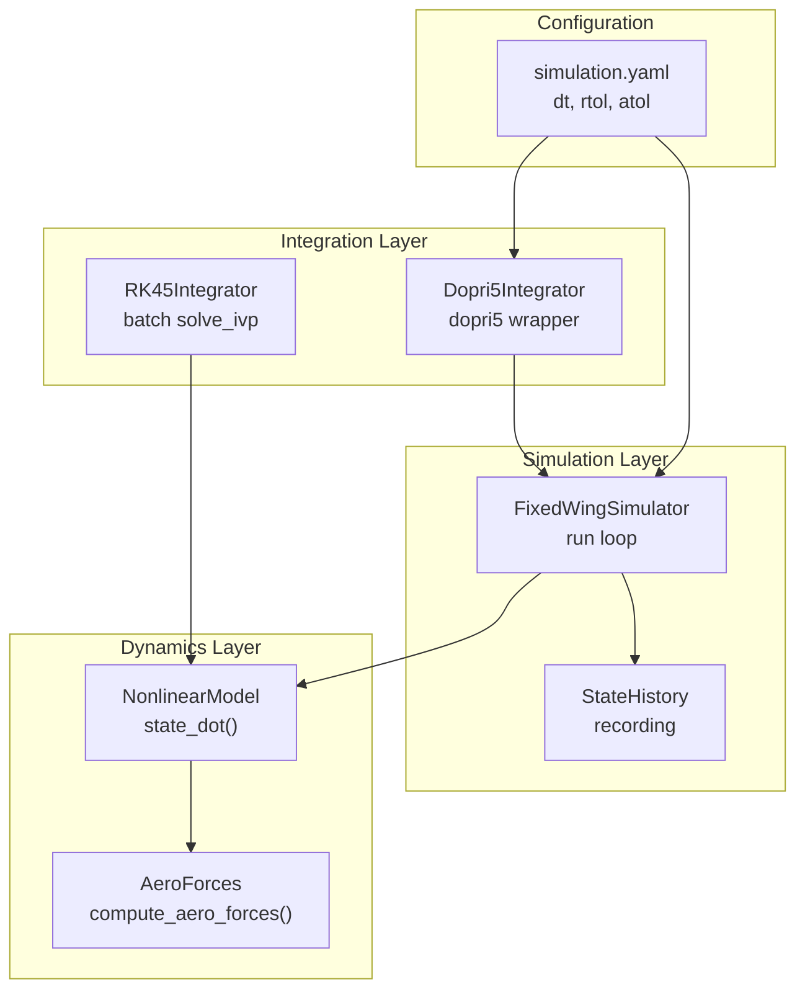
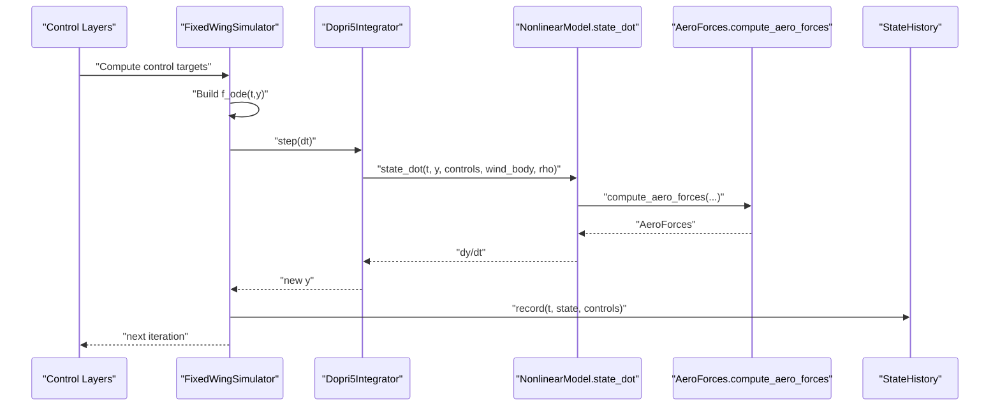
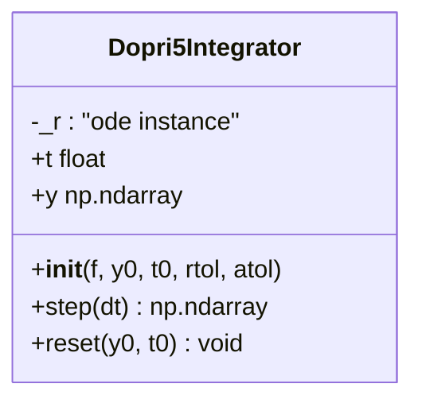
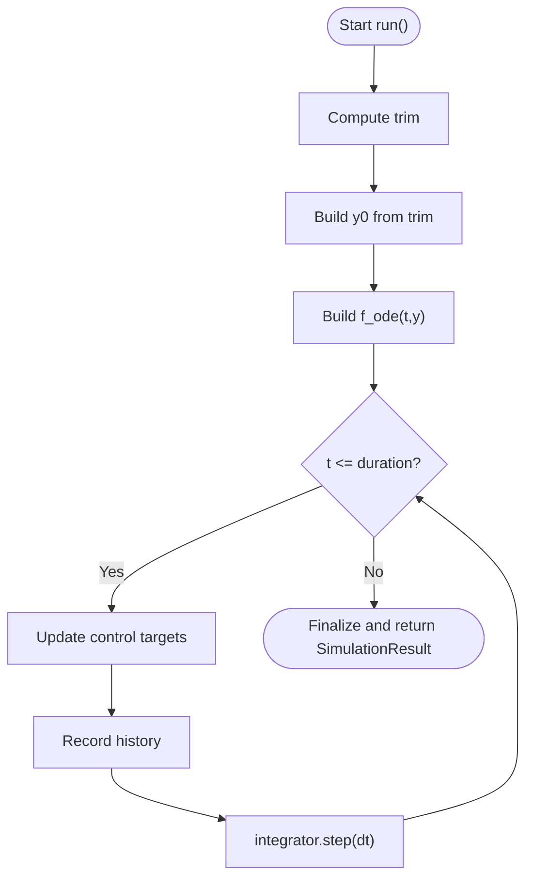
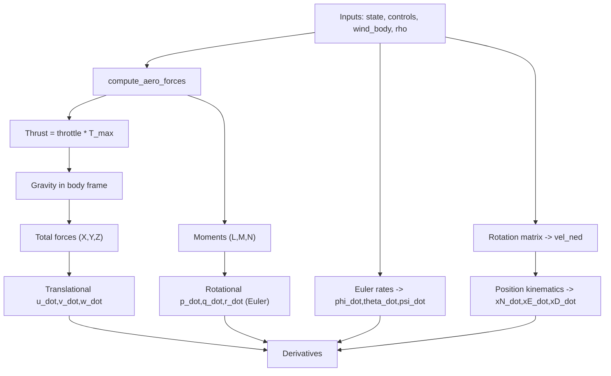
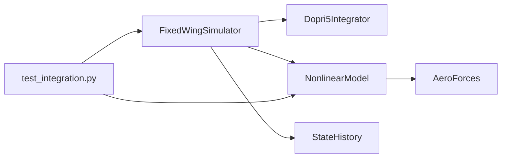

# Numerical Integration

<cite>
**Referenced Files in This Document**
- [integrator.py](file://src/simulation/integrator.py)
- [simulator.py](file://src/simulation/simulator.py)
- [nonlinear_model.py](file://src/dynamics/nonlinear_model.py)
- [aerodynamics.py](file://src/dynamics/aerodynamics.py)
- [state_manager.py](file://src/simulation/state_manager.py)
- [simulation.yaml](file://config/simulation.yaml)
- [test_integration.py](file://tests/test_integration.py)
- [2_nonlinear_dynamics.py](file://examples/2_nonlinear_dynamics.py)
</cite>

## Table of Contents
1. [Introduction](#introduction)
2. [Project Structure](#project-structure)
3. [Core Components](#core-components)
4. [Architecture Overview](#architecture-overview)
5. [Detailed Component Analysis](#detailed-component-analysis)
6. [Dependency Analysis](#dependency-analysis)
7. [Performance Considerations](#performance-considerations)
8. [Troubleshooting Guide](#troubleshooting-guide)
9. [Conclusion](#conclusion)
10. [Appendices](#appendices)

## Introduction
This document explains the numerical integration system used to solve the 6-DOF nonlinear differential equations governing fixed-wing aircraft dynamics. It focuses on the Dopri5Integrator class, which wraps the Dormand-Prince 4(5) Runge-Kutta solver for real-time, step-by-step integration inside the FixedWingSimulator loop. The document covers integration methods, solver algorithms, accuracy control mechanisms, the integration workflow from initial state setup through time-stepping to solution advancement, and practical guidance for tuning integration parameters and troubleshooting common issues.

## Project Structure
The integration system spans several modules:
- Numerical integrators: [integrator.py](file://src/simulation/integrator.py)
- Simulation orchestrator: [simulator.py](file://src/simulation/simulator.py)
- Dynamics model (6-DOF): [nonlinear_model.py](file://src/dynamics/nonlinear_model.py)
- Aerodynamics: [aerodynamics.py](file://src/dynamics/aerodynamics.py)
- State containers: [state_manager.py](file://src/simulation/state_manager.py)
- Configuration: [simulation.yaml](file://config/simulation.yaml)
- Tests and examples: [test_integration.py](file://tests/test_integration.py), [2_nonlinear_dynamics.py](file://examples/2_nonlinear_dynamics.py)

**Diagram sources**
- [integrator.py](file://src/simulation/integrator.py#L17-L108)
- [simulator.py](file://src/simulation/simulator.py#L115-L642)
- [nonlinear_model.py](file://src/dynamics/nonlinear_model.py#L104-L386)
- [aerodynamics.py](file://src/dynamics/aerodynamics.py#L35-L148)
- [state_manager.py](file://src/simulation/state_manager.py#L95-L193)
- [simulation.yaml](file://config/simulation.yaml#L1-L30)

**Section sources**
- [integrator.py](file://src/simulation/integrator.py#L1-L108)
- [simulator.py](file://src/simulation/simulator.py#L1-L642)
- [nonlinear_model.py](file://src/dynamics/nonlinear_model.py#L1-L386)
- [aerodynamics.py](file://src/dynamics/aerodynamics.py#L1-L148)
- [state_manager.py](file://src/simulation/state_manager.py#L1-L193)
- [simulation.yaml](file://config/simulation.yaml#L1-L30)

## Core Components
- Dopri5Integrator: Real-time single-step integrator using scipy.integrate.ode with the dopri5 solver. It exposes step(dt), current time t, current state y, and reset(y0, t0).
- RK45Integrator: Batch integrator using scipy.integrate.solve_ivp with RK45; used for offline analysis.
- FixedWingSimulator.run: Builds the 6-DOF ODE function and drives the simulation loop with a fixed dt.
- NonlinearModel.state_dot: Evaluates the 12-D ODE (translational accelerations, rotational rates, Euler kinematics, position kinematics) using aerodynamic forces and moments.
- AeroForces.compute_aero_forces: Computes aerodynamic forces and moments from body-frame state, control deflections, wind, and air density.
- StateHistory: Efficiently records time series of states and control actions.

**Section sources**
- [integrator.py](file://src/simulation/integrator.py#L17-L108)
- [simulator.py](file://src/simulation/simulator.py#L239-L642)
- [nonlinear_model.py](file://src/dynamics/nonlinear_model.py#L104-L386)
- [aerodynamics.py](file://src/dynamics/aerodynamics.py#L35-L148)
- [state_manager.py](file://src/simulation/state_manager.py#L95-L193)

## Architecture Overview
The integration workflow integrates the control system with the 6-DOF dynamics via a continuously updated ODE function. The FixedWingSimulator constructs the ODE from the current control targets and environment, then advances the state using Dopri5Integrator.step(dt) at each loop iteration.

**Diagram sources**
- [simulator.py](file://src/simulation/simulator.py#L329-L567)
- [integrator.py](file://src/simulation/integrator.py#L50-L71)
- [nonlinear_model.py](file://src/dynamics/nonlinear_model.py#L160-L255)
- [aerodynamics.py](file://src/dynamics/aerodynamics.py#L35-L148)
- [state_manager.py](file://src/simulation/state_manager.py#L124-L174)

## Detailed Component Analysis

### Dopri5Integrator
- Purpose: Provide a single-step, real-time integrator compatible with the FixedWingSimulator loop.
- Solver: scipy.integrate.ode with dopri5.
- Accuracy control: rtol and atol passed to the solver; nsteps and verbosity configured internally.
- API:
  - step(dt): advance by dt seconds; returns new state vector; raises on failure.
  - t: current integrator time.
  - y: current state vector.
  - reset(y0, t0): reinitialize the integrator.

**Diagram sources**
- [integrator.py](file://src/simulation/integrator.py#L17-L71)

**Section sources**
- [integrator.py](file://src/simulation/integrator.py#L17-L71)

### FixedWingSimulator Integration Loop
- Initial trim computation sets baseline conditions.
- Initial state y0 is constructed from trim and initial conditions.
- A closure f_ode(t, y) captures current control targets and environment (wind, density).
- The loop updates control targets, converts to AircraftSimState, records history, and advances with integrator.step(dt).
- Error handling: catches RuntimeError from the integrator and stops the simulation.

**Diagram sources**
- [simulator.py](file://src/simulation/simulator.py#L270-L567)

**Section sources**
- [simulator.py](file://src/simulation/simulator.py#L239-L567)

### NonlinearModel.state_dot (6-DOF ODE)
- Inputs: state vector [u, v, w, p, q, r, phi, theta, psi, x_N, x_E, x_D], controls, wind_body, rho.
- Outputs: derivatives [u_dot, v_dot, w_dot, p_dot, q_dot, r_dot, phi_dot, theta_dot, psi_dot, xN_dot, xE_dot, xD_dot].
- Forces and moments:
  - Aerodynamic forces computed via compute_aero_forces.
  - Thrust modeled as throttle * T_max with TWR≈0.20.
  - Gravity resolved in body frame.
- Translational dynamics: Newton’s law in body frame.
- Rotational dynamics: Euler equations with inertia coupling.
- Kinematics:
  - Euler rates from angular rates.
  - Velocity-to-position via rotation matrix 321.

**Diagram sources**
- [nonlinear_model.py](file://src/dynamics/nonlinear_model.py#L160-L255)
- [aerodynamics.py](file://src/dynamics/aerodynamics.py#L35-L148)

**Section sources**
- [nonlinear_model.py](file://src/dynamics/nonlinear_model.py#L104-L386)
- [aerodynamics.py](file://src/dynamics/aerodynamics.py#L35-L148)

### State Containers and History
- AircraftSimState: 12-D state with derived quantities (alpha, beta, airspeed, altitude).
- StateHistory: Pre-allocated buffers for efficient recording; trims unused tail after simulation.

**Section sources**
- [state_manager.py](file://src/simulation/state_manager.py#L16-L193)

### Configuration and Defaults
- simulation.yaml defines:
  - dt: simulation time step (s)
  - duration: total simulation duration (s)
  - integrator: "dopri5" for real-time loop
  - rtol/atol: relative and absolute tolerances
  - Initial conditions and wind settings

**Section sources**
- [simulation.yaml](file://config/simulation.yaml#L1-L30)

## Dependency Analysis
- FixedWingSimulator depends on NonlinearModel for the ODE and on Dopri5Integrator for real-time stepping.
- NonlinearModel depends on AeroForces.compute_aero_forces for aerodynamic modeling.
- StateHistory is used by SimulationResult and the simulator loop for logging.
- Tests validate numerical stability and API consistency.

**Diagram sources**
- [simulator.py](file://src/simulation/simulator.py#L49-L50)
- [nonlinear_model.py](file://src/dynamics/nonlinear_model.py#L27-L28)
- [aerodynamics.py](file://src/dynamics/aerodynamics.py#L13-L13)
- [state_manager.py](file://src/simulation/state_manager.py#L95-L193)
- [test_integration.py](file://tests/test_integration.py#L32-L34)

**Section sources**
- [simulator.py](file://src/simulation/simulator.py#L49-L50)
- [nonlinear_model.py](file://src/dynamics/nonlinear_model.py#L27-L28)
- [aerodynamics.py](file://src/dynamics/aerodynamics.py#L13-L13)
- [state_manager.py](file://src/simulation/state_manager.py#L95-L193)
- [test_integration.py](file://tests/test_integration.py#L32-L34)

## Performance Considerations
- Time step selection:
  - dt determines the fixed step size in the real-time loop. Smaller dt improves accuracy but increases computational cost.
  - The integrator itself adapts internally; however, the FixedWingSimulator advances by exactly dt each step.
- Accuracy control:
  - rtol and atol control local error tolerances for the dopri5 solver. Tighter tolerances improve accuracy but may reduce step sizes and increase cost.
  - The default rtol/atol are set in configuration and passed to the integrator constructor.
- Stability:
  - The tests enforce finite-state checks and monotonic time vectors to detect divergence or numerical issues.
  - Using closed-loop control generally stabilizes the simulation compared to open-loop trim-hold.

[No sources needed since this section provides general guidance]

## Troubleshooting Guide
Common issues and remedies:
- Integration failure at a given time:
  - Symptom: RuntimeError raised by the integrator indicating failure.
  - Action: Reduce dt or tighten rtol/atol; verify control limits and trim initialization; inspect wind/density variations.
  - Evidence: The simulator catches and prints the error before stopping.
- Divergence in altitude or airspeed:
  - Symptom: Non-finite or unbounded values in history.
  - Action: Check control saturation, trim mismatch, and environment parameters; validate aircraft database entries.
  - Evidence: Tests assert finite and bounded states.
- Time vector not strictly increasing:
  - Symptom: Assertion failure on monotonicity.
  - Action: Verify dt and loop increments; ensure no external modifications to simulation timing.
- Step-by-step API drift vs run():
  - Symptom: Small discrepancies due to control update timing differences.
  - Action: Align control update cadence; accept approximate agreement within expected bounds.

**Section sources**
- [simulator.py](file://src/simulation/simulator.py#L558-L562)
- [test_integration.py](file://tests/test_integration.py#L41-L58)
- [test_integration.py](file://tests/test_integration.py#L149-L157)
- [test_integration.py](file://tests/test_integration.py#L310-L343)

## Conclusion
The numerical integration system combines a robust real-time integrator (Dopri5Integrator) with a comprehensive 6-DOF nonlinear dynamics model (NonlinearModel.state_dot) and aerodynamic modeling (AeroForces.compute_aero_forces). The FixedWingSimulator orchestrates control updates and integrates the ODE at each time step, recording histories for analysis. Proper tuning of dt, rtol, and atol, along with careful control and trim initialization, ensures stable and accurate simulations across diverse flight regimes.

[No sources needed since this section summarizes without analyzing specific files]

## Appendices

### Practical Setup and Parameter Tuning
- Initial setup:
  - Choose dt and duration from configuration; ensure dt aligns with control loop cadence.
  - Select integrator type: "dopri5" for real-time loops; "rk45" for offline analysis.
- Parameter tuning:
  - rtol/atol: Start with defaults; tighten for sensitive maneuvers or reduce for faster runs.
  - dt: Begin with moderate values; decrease for aggressive control or high-frequency disturbances.
- Validation:
  - Use tests to verify finite states and monotonic time vectors.
  - Compare step-by-step API outputs with full run() to ensure consistency.

**Section sources**
- [simulation.yaml](file://config/simulation.yaml#L1-L30)
- [test_integration.py](file://tests/test_integration.py#L41-L58)
- [test_integration.py](file://tests/test_integration.py#L149-L157)
- [test_integration.py](file://tests/test_integration.py#L310-L343)

### Example References
- Example demonstrating open-loop and closed-loop comparisons:
  - [2_nonlinear_dynamics.py](file://examples/2_nonlinear_dynamics.py#L1-L215)

**Section sources**
- [2_nonlinear_dynamics.py](file://examples/2_nonlinear_dynamics.py#L1-L215)