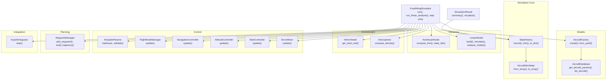
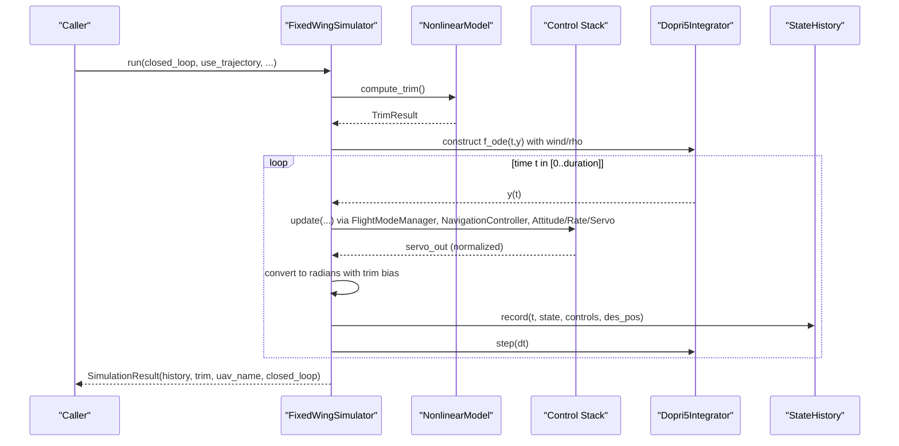
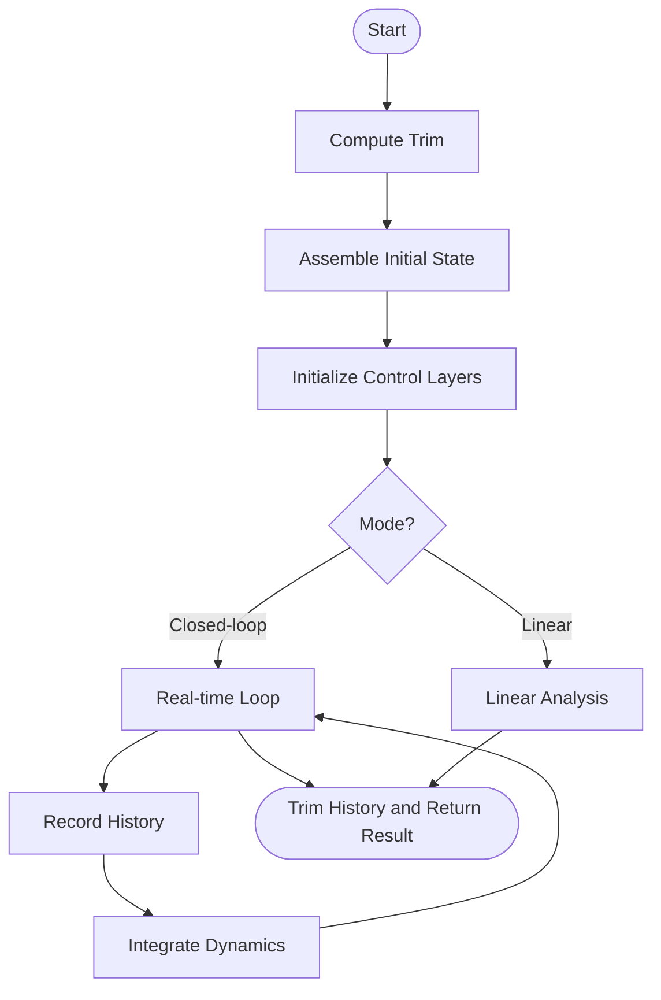
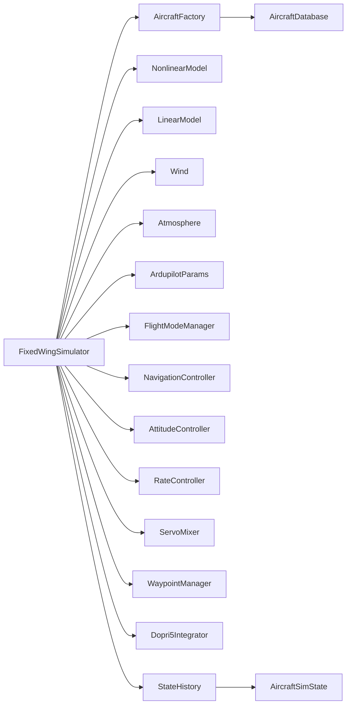

# Simulation Engine

<cite>
**Referenced Files in This Document**
- [src/simulation/simulator.py](file://src/simulation/simulator.py)
- [src/simulation/state_manager.py](file://src/simulation/state_manager.py)
- [src/simulation/integrator.py](file://src/simulation/integrator.py)
- [src/models/aircraft_factory.py](file://src/models/aircraft_factory.py)
- [src/models/aircraft_database.py](file://src/models/aircraft_database.py)
- [src/dynamics/linear_model.py](file://src/dynamics/linear_model.py)
- [src/dynamics/nonlinear_model.py](file://src/dynamics/nonlinear_model.py)
- [src/planning/waypoint_manager.py](file://src/planning/waypoint_manager.py)
- [src/control/ardupilot_compat.py](file://src/control/ardupilot_compat.py)
- [config/simulation.yaml](file://config/simulation.yaml)
- [config/control_params.yaml](file://config/control_params.yaml)
- [config/aircraft.yaml](file://config/aircraft.yaml)
- [config/trajectory.yaml](file://config/trajectory.yaml)
</cite>

## Table of Contents
1. [Introduction](#introduction)
2. [Project Structure](#project-structure)
3. [Core Components](#core-components)
4. [Architecture Overview](#architecture-overview)
5. [Detailed Component Analysis](#detailed-component-analysis)
6. [Dependency Analysis](#dependency-analysis)
7. [Performance Considerations](#performance-considerations)
8. [Troubleshooting Guide](#troubleshooting-guide)
9. [Conclusion](#conclusion)
10. [Appendices](#appendices)

## Introduction
This document explains the FixedWingSimulator main simulation engine that orchestrates a complete fixed-wing UAV simulation. It covers the FixedWingSimulator class architecture, initialization parameters, dual simulation modes (closed-loop real-time and 4-DOF linear analysis), the end-to-end simulation workflow, state management via AircraftSimState and StateHistory, integration with aircraft models, control systems, environment modeling, and trajectory planning. Practical examples demonstrate setup, configuration, and result interpretation, and the step-by-step API for external integration is documented alongside the SimulationResult container for analysis.

## Project Structure
The simulation engine resides under src/simulation and integrates tightly with models, dynamics, environment, control, planning, and utilities. Configuration is provided via YAML files under config/.

**Diagram sources**
- [src/simulation/simulator.py](file://src/simulation/simulator.py#L115-L642)
- [src/simulation/state_manager.py](file://src/simulation/state_manager.py#L16-L193)
- [src/models/aircraft_factory.py](file://src/models/aircraft_factory.py#L39-L136)
- [src/models/aircraft_database.py](file://src/models/aircraft_database.py#L143-L183)
- [src/dynamics/nonlinear_model.py](file://src/dynamics/nonlinear_model.py#L104-L386)
- [src/dynamics/linear_model.py](file://src/dynamics/linear_model.py#L107-L319)
- [src/planning/waypoint_manager.py](file://src/planning/waypoint_manager.py#L20-L208)
- [src/simulation/integrator.py](file://src/simulation/integrator.py#L17-L108)
- [src/control/ardupilot_compat.py](file://src/control/ardupilot_compat.py#L17-L130)

**Section sources**
- [src/simulation/simulator.py](file://src/simulation/simulator.py#L1-L642)
- [src/simulation/state_manager.py](file://src/simulation/state_manager.py#L1-L193)
- [src/simulation/integrator.py](file://src/simulation/integrator.py#L1-L108)
- [src/models/aircraft_factory.py](file://src/models/aircraft_factory.py#L1-L136)
- [src/models/aircraft_database.py](file://src/models/aircraft_database.py#L1-L183)
- [src/dynamics/linear_model.py](file://src/dynamics/linear_model.py#L1-L319)
- [src/dynamics/nonlinear_model.py](file://src/dynamics/nonlinear_model.py#L1-L386)
- [src/planning/waypoint_manager.py](file://src/planning/waypoint_manager.py#L1-L208)
- [src/control/ardupilot_compat.py](file://src/control/ardupilot_compat.py#L1-L130)
- [config/simulation.yaml](file://config/simulation.yaml#L1-L30)
- [config/control_params.yaml](file://config/control_params.yaml#L1-L45)
- [config/aircraft.yaml](file://config/aircraft.yaml#L1-L13)
- [config/trajectory.yaml](file://config/trajectory.yaml#L1-L23)

## Core Components
- FixedWingSimulator: Central orchestrator that loads configurations, constructs aircraft, environment, control, planning, and dynamics modules, and runs simulations in either closed-loop real-time mode or 4-DOF linear analysis mode.
- SimulationResult: Container wrapping StateHistory and providing summary and visualization helpers.
- AircraftSimState and StateHistory: Data containers for the 12-D state vector and efficient history recording with derived quantities.
- Integrator: Real-time step-by-step integrator (Dopri5) for the closed-loop loop and batch integrator (RK45) for offline analysis.
- AircraftFactory and AircraftDatabase: Aircraft parameter loading, merging, and validation.
- NonlinearModel and LinearModel: 6-DOF nonlinear equations of motion and 4-DOF longitudinal linearized state-space model.
- WaypointManager: Waypoint storage, trajectory construction (minimum snap/jerk), and active segment access.
- Control stack: ArduPilot-compatible parameter container, flight mode manager, navigation controller (TECS), attitude/rate controllers, and servo mixer.

**Section sources**
- [src/simulation/simulator.py](file://src/simulation/simulator.py#L59-L113)
- [src/simulation/state_manager.py](file://src/simulation/state_manager.py#L16-L193)
- [src/simulation/integrator.py](file://src/simulation/integrator.py#L17-L108)
- [src/models/aircraft_factory.py](file://src/models/aircraft_factory.py#L15-L136)
- [src/models/aircraft_database.py](file://src/models/aircraft_database.py#L143-L183)
- [src/dynamics/nonlinear_model.py](file://src/dynamics/nonlinear_model.py#L104-L386)
- [src/dynamics/linear_model.py](file://src/dynamics/linear_model.py#L107-L319)
- [src/planning/waypoint_manager.py](file://src/planning/waypoint_manager.py#L20-L208)
- [src/control/ardupilot_compat.py](file://src/control/ardupilot_compat.py#L17-L130)

## Architecture Overview
The FixedWingSimulator composes subsystems and coordinates their interactions during simulation. The closed-loop real-time mode computes control targets from navigation and flight mode managers, applies controllers, converts normalized servo outputs to radians with trim biases, and integrates the 6-DOF nonlinear dynamics. The 4-DOF linear analysis mode solves for trim, builds the linear state-space, and simulates open-loop responses to elevator pulses.

**Diagram sources**
- [src/simulation/simulator.py](file://src/simulation/simulator.py#L239-L567)
- [src/dynamics/nonlinear_model.py](file://src/dynamics/nonlinear_model.py#L132-L281)
- [src/simulation/integrator.py](file://src/simulation/integrator.py#L50-L71)
- [src/simulation/state_manager.py](file://src/simulation/state_manager.py#L124-L174)

## Detailed Component Analysis

### FixedWingSimulator Class
- Initialization parameters:
  - aircraft_name: selects from the aircraft database.
  - config_dir: path to config directory; defaults to config/ under repo root.
  - dt, duration: simulation step and total runtime.
  - initial_mode: flight mode at start (e.g., AUTO).
  - wind_type: wind model selection (NONE, FIXED, SINE, RANDOMSINE).
  - traj_type: trajectory builder type (minimum_snap or minimum_jerk).
- Construction process:
  - Loads simulation config (time step, duration, wind, logging).
  - Creates AircraftConfig via AircraftFactory and merges with optional YAML overrides.
  - Initializes Wind model and ArduPilot-compatible control parameters.
  - Builds control layers: FlightModeManager, NavigationController (TECS), AttitudeController, RateController, ServoMixer.
  - Prepares WaypointManager and NonlinearModel for trim computation.
- Public APIs:
  - run(): executes closed-loop real-time simulation or trajectory tracking; returns SimulationResult.
  - run_linear_analysis(): performs 4-DOF linear open-loop analysis; returns LinearAnalysisResult.
  - init_step()/step(): step-by-step integration for external UI integration.

Key behaviors:
- Trim computation and auto-adjustment of TECS cruise throttle based on trim-derived thrust balance.
- Dynamic ODE closure over control surfaces and wind/rho.
- Waypoint sequencing mode fallback when trajectory is disabled.
- History trimming to remove unused tail after simulation.

**Section sources**
- [src/simulation/simulator.py](file://src/simulation/simulator.py#L130-L238)
- [src/simulation/simulator.py](file://src/simulation/simulator.py#L239-L567)
- [src/simulation/simulator.py](file://src/simulation/simulator.py#L571-L642)
- [src/models/aircraft_factory.py](file://src/models/aircraft_factory.py#L42-L93)
- [src/models/aircraft_database.py](file://src/models/aircraft_database.py#L143-L166)
- [src/control/ardupilot_compat.py](file://src/control/ardupilot_compat.py#L74-L129)
- [config/simulation.yaml](file://config/simulation.yaml#L1-L30)

### SimulationResult Container
- Holds StateHistory, TrimResult, UAV name, and closed-loop flag.
- Provides summary() with trim speed, duration, mode, final altitude/speed, and track.
- Provides visualize() to produce plots and animations via visualization modules.

**Section sources**
- [src/simulation/simulator.py](file://src/simulation/simulator.py#L59-L113)
- [src/simulation/state_manager.py](file://src/simulation/state_manager.py#L179-L193)

### AircraftSimState and StateHistory
- AircraftSimState: 12-D state vector [u,v,w,p,q,r,phi,theta,psi,x_N,x_E,x_D] plus derived quantities (alpha, beta, airspeed, altitude). Includes conversions from array and property helpers.
- StateHistory: Pre-allocated NumPy buffers keyed by state/control/derived variable names; supports record(), trim(), get(), to_dict(), to_csv().

**Section sources**
- [src/simulation/state_manager.py](file://src/simulation/state_manager.py#L16-L94)
- [src/simulation/state_manager.py](file://src/simulation/state_manager.py#L95-L193)

### Dual Simulation Modes
- Closed-loop real-time simulation:
  - Uses ArduPilot-compatible control chain: FlightModeManager → NavigationController (TECS) → AttitudeController → RateController → ServoMixer.
  - Integrates 6-DOF nonlinear dynamics with wind and altitude-dependent density.
  - Records control surface deflections and desired positions for analysis.
- 4-DOF linear analysis:
  - Computes trim, builds longitudinal linear state-space (A,B), performs modal analysis, and simulates open-loop responses to elevator pulses.

**Section sources**
- [src/simulation/simulator.py](file://src/simulation/simulator.py#L239-L567)
- [src/simulation/simulator.py](file://src/simulation/simulator.py#L571-L596)
- [src/dynamics/nonlinear_model.py](file://src/dynamics/nonlinear_model.py#L132-L154)
- [src/dynamics/linear_model.py](file://src/dynamics/linear_model.py#L107-L319)

### Simulation Workflow
- Trim computation and initial state assembly.
- Control layer initialization and TECS cruise throttle auto-tuning.
- Trajectory or waypoint-sequence setup.
- Iterative loop:
  - Extract state, compute control targets, apply controllers, integrate dynamics, record history.
- Post-processing: trim history and return SimulationResult.

**Diagram sources**
- [src/simulation/simulator.py](file://src/simulation/simulator.py#L270-L567)
- [src/dynamics/linear_model.py](file://src/dynamics/linear_model.py#L312-L319)

### Integration with External Modules
- Aircraft models: AircraftFactory and AircraftDatabase supply aerodynamic parameters and derived quantities.
- Control systems: ArdupilotParams, FlightModeManager, NavigationController (TECS), AttitudeController, RateController, ServoMixer.
- Environment modeling: Wind model and atmosphere density computation.
- Trajectory planning: WaypointManager builds minimum snap/jerk trajectories and exposes desired states and active segments.

**Section sources**
- [src/models/aircraft_factory.py](file://src/models/aircraft_factory.py#L39-L93)
- [src/models/aircraft_database.py](file://src/models/aircraft_database.py#L143-L183)
- [src/control/ardupilot_compat.py](file://src/control/ardupilot_compat.py#L17-L130)
- [src/planning/waypoint_manager.py](file://src/planning/waypoint_manager.py#L20-L208)
- [src/dynamics/nonlinear_model.py](file://src/dynamics/nonlinear_model.py#L160-L281)

### Step-by-Step API for External Integration
- init_step(): initializes trim, builds ODE closure, and returns initial AircraftSimState.
- step(dt): advances the simulation by dt and returns the new AircraftSimState.
- Typical usage: call init_step(), then repeatedly call step() in a loop until termination criteria are met.

**Section sources**
- [src/simulation/simulator.py](file://src/simulation/simulator.py#L602-L642)

### Practical Examples and Configuration
- Simulation setup:
  - Choose aircraft via config/aircraft.yaml or constructor parameter.
  - Configure simulation parameters in config/simulation.yaml (dt, duration, wind, initial mode).
  - Tune control parameters in config/control_params.yaml (ArduPilot-compatible).
  - Define trajectory waypoints in config/trajectory.yaml or programmatically via WaypointManager.
- Example scripts (examples/*.py) demonstrate:
  - Linear response analysis (1_linear_response.py)
  - Nonlinear dynamics (2_nonlinear_dynamics.py)
  - Trajectory tracking (3_trajectory_tracking.py)
  - Circuit flight (4_circuit_flight.py)
  - Comparing different aircraft (5_different_aircraft.py)
  - ArduPilot parameter export/import (6_ardupilot_parameters.py)
  - Wind resistance effects (7_wind_resistance.py)

**Section sources**
- [config/aircraft.yaml](file://config/aircraft.yaml#L1-L13)
- [config/simulation.yaml](file://config/simulation.yaml#L1-L30)
- [config/control_params.yaml](file://config/control_params.yaml#L1-L45)
- [config/trajectory.yaml](file://config/trajectory.yaml#L1-L23)

## Dependency Analysis
The FixedWingSimulator depends on modules across models, dynamics, environment, control, planning, and simulation layers. The dependency graph below highlights major coupling points.

**Diagram sources**
- [src/simulation/simulator.py](file://src/simulation/simulator.py#L33-L51)
- [src/models/aircraft_factory.py](file://src/models/aircraft_factory.py#L39-L75)
- [src/models/aircraft_database.py](file://src/models/aircraft_database.py#L143-L166)
- [src/dynamics/nonlinear_model.py](file://src/dynamics/nonlinear_model.py#L104-L127)
- [src/dynamics/linear_model.py](file://src/dynamics/linear_model.py#L107-L124)
- [src/planning/waypoint_manager.py](file://src/planning/waypoint_manager.py#L20-L49)
- [src/simulation/integrator.py](file://src/simulation/integrator.py#L17-L71)
- [src/simulation/state_manager.py](file://src/simulation/state_manager.py#L95-L123)

**Section sources**
- [src/simulation/simulator.py](file://src/simulation/simulator.py#L33-L51)
- [src/simulation/state_manager.py](file://src/simulation/state_manager.py#L95-L123)

## Performance Considerations
- Real-time step size: dt influences accuracy and performance; smaller dt increases fidelity but costs computation.
- Integrator choice: Dopri5 enables real-time step-wise integration with adaptive step size; RK45 is suitable for offline analysis requiring dense output.
- Control layer tuning: TECS and rate-controller gains impact stability and transient response; validate via configuration files.
- Wind modeling: Sine/random wind introduces variability; consider disabling for deterministic baselines.
- Trajectory caching: WaypointManager caches trajectories; invalidate cache when waypoints change to avoid stale paths.

[No sources needed since this section provides general guidance]

## Troubleshooting Guide
- Integration errors: The integrator raises runtime errors on failure; check control saturation, extreme inputs, or invalid trim assumptions.
- Parameter validation: ArdupilotParams.validate() prints warnings for out-of-range values; adjust control_params.yaml accordingly.
- Aircraft selection: Ensure aircraft_name exists in the database; otherwise, a ValueError is raised.
- Trajectory requirements: At least two waypoints are required to build a trajectory; otherwise, a ValueError is raised.
- Visualization availability: SimulationResult.visualize() requires visualization modules; missing imports are handled gracefully with a warning.

**Section sources**
- [src/simulation/integrator.py](file://src/simulation/integrator.py#L50-L71)
- [src/control/ardupilot_compat.py](file://src/control/ardupilot_compat.py#L104-L130)
- [src/models/aircraft_database.py](file://src/models/aircraft_database.py#L153-L156)
- [src/planning/waypoint_manager.py](file://src/planning/waypoint_manager.py#L139-L140)
- [src/simulation/simulator.py](file://src/simulation/simulator.py#L94-L101)

## Conclusion
The FixedWingSimulator provides a modular, extensible framework for fixed-wing UAV simulation. Its dual-mode operation supports both high-fidelity closed-loop real-time dynamics and efficient linear analysis. Robust state management, configurable control parameters, and trajectory planning enable flexible mission scenarios. The documented APIs and configuration files facilitate practical integration and analysis.

[No sources needed since this section summarizes without analyzing specific files]

## Appendices

### API Reference: FixedWingSimulator
- Constructor parameters:
  - aircraft_name: selected aircraft key.
  - config_dir: path to config directory.
  - dt, duration: simulation step and total runtime.
  - initial_mode: starting flight mode.
  - wind_type: wind model selector.
  - traj_type: trajectory builder type.
- Methods:
  - run(closed_loop, use_trajectory, wp_switch_dist, loop_circuit) -> SimulationResult
  - run_linear_analysis(pulses, duration) -> LinearAnalysisResult
  - init_step() -> AircraftSimState
  - step(dt) -> AircraftSimState

**Section sources**
- [src/simulation/simulator.py](file://src/simulation/simulator.py#L130-L139)
- [src/simulation/simulator.py](file://src/simulation/simulator.py#L239-L269)
- [src/simulation/simulator.py](file://src/simulation/simulator.py#L571-L596)
- [src/simulation/simulator.py](file://src/simulation/simulator.py#L602-L642)

### Configuration Reference
- config/simulation.yaml: dt, duration, integrator, tolerances, initial conditions, initial mode, wind overrides, logging.
- config/control_params.yaml: ArduPilot-compatible control parameters and TECS tuning.
- config/aircraft.yaml: aircraft selection and optional parameter overrides.
- config/trajectory.yaml: trajectory type, average speed, yaw mode, waypoints, and loop setting.

**Section sources**
- [config/simulation.yaml](file://config/simulation.yaml#L1-L30)
- [config/control_params.yaml](file://config/control_params.yaml#L1-L45)
- [config/aircraft.yaml](file://config/aircraft.yaml#L1-L13)
- [config/trajectory.yaml](file://config/trajectory.yaml#L1-L23)