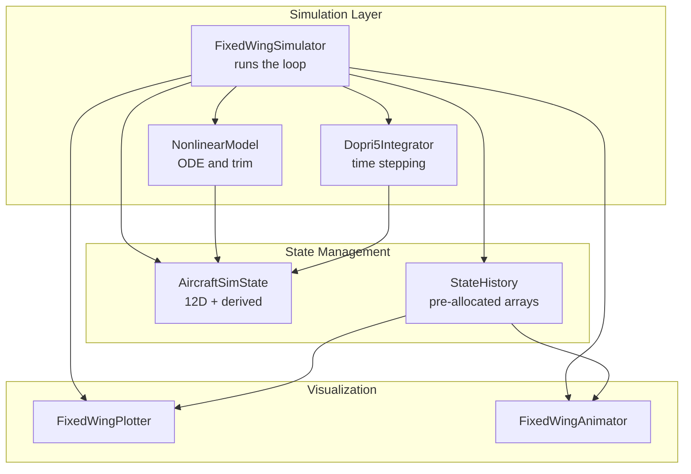
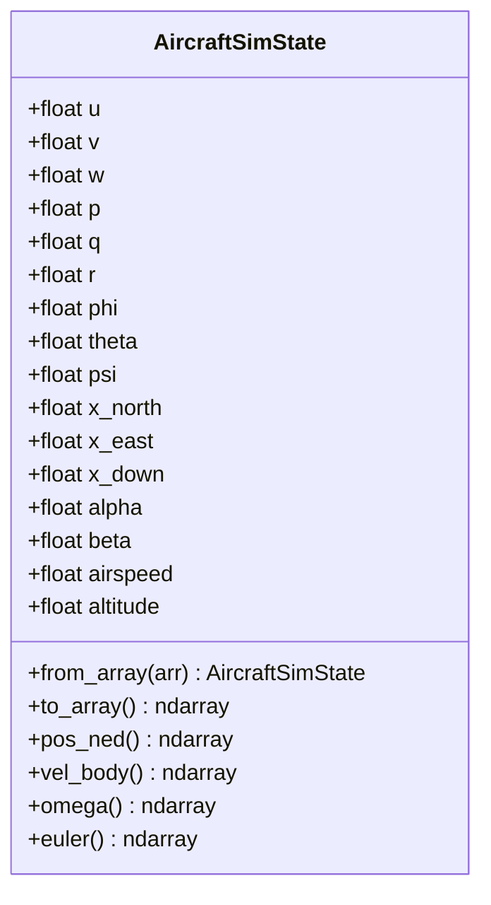
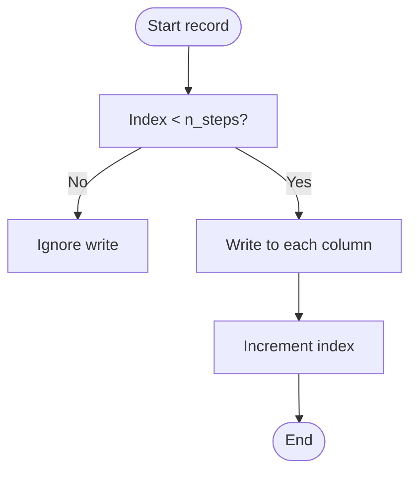
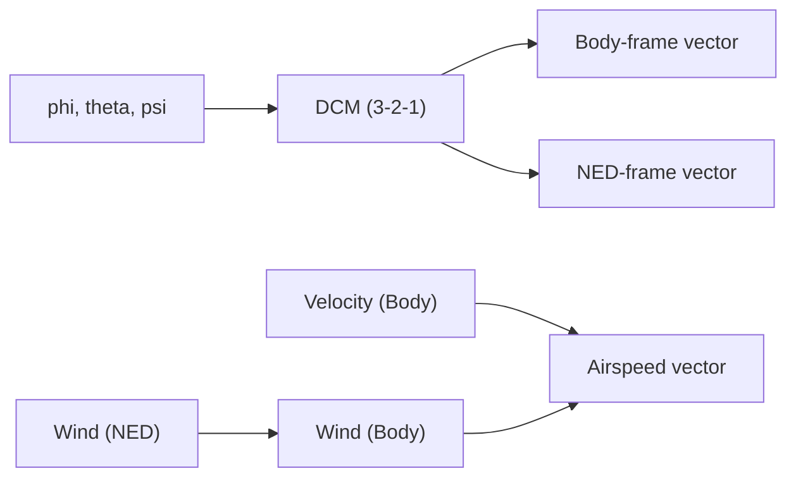
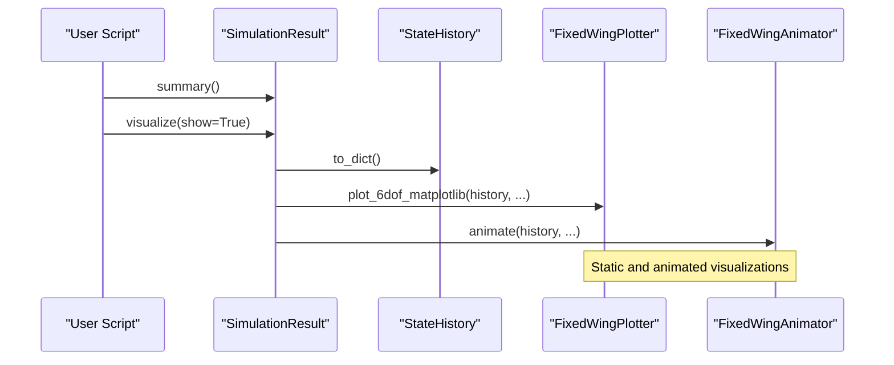
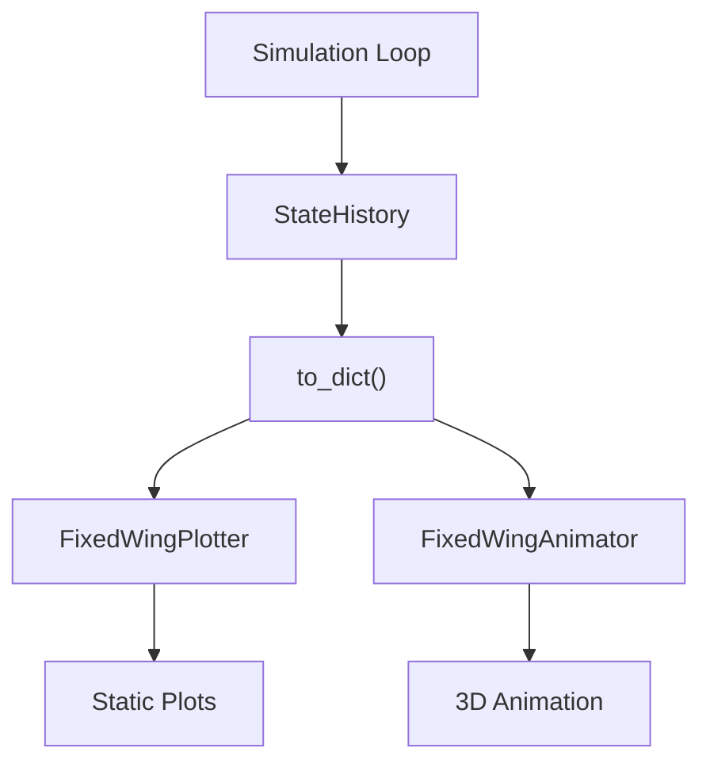
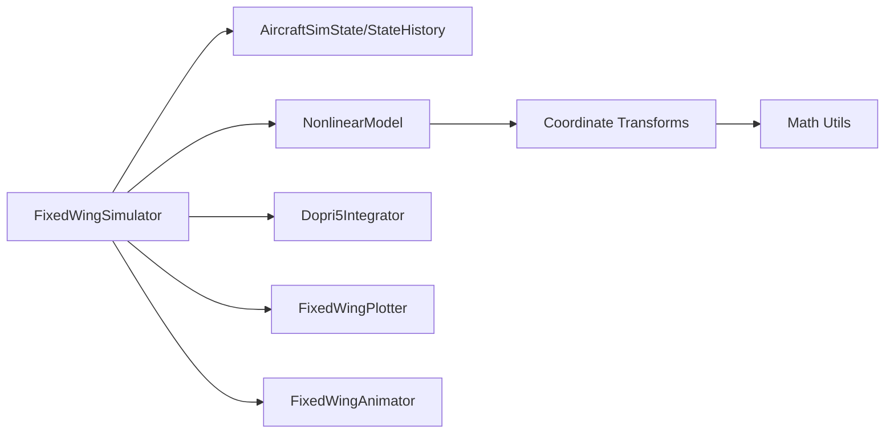

# State Management

<cite>
**Referenced Files in This Document**
- [state_manager.py](file://src/simulation/state_manager.py)
- [simulator.py](file://src/simulation/simulator.py)
- [nonlinear_model.py](file://src/dynamics/nonlinear_model.py)
- [coordinate_transform.py](file://src/dynamics/coordinate_transform.py)
- [math_utils.py](file://src/utils/math_utils.py)
- [plotter.py](file://src/visualization/plotter.py)
- [animator.py](file://src/visualization/animator.py)
- [main.py](file://main.py)
</cite>

## Table of Contents
1. [Introduction](#introduction)
2. [Project Structure](#project-structure)
3. [Core Components](#core-components)
4. [Architecture Overview](#architecture-overview)
5. [Detailed Component Analysis](#detailed-component-analysis)
6. [Dependency Analysis](#dependency-analysis)
7. [Performance Considerations](#performance-considerations)
8. [Troubleshooting Guide](#troubleshooting-guide)
9. [Conclusion](#conclusion)
10. [Appendices](#appendices)

## Introduction
This document explains the state management system used by the fixed-wing simulation engine. It focuses on the AircraftSimState and StateHistory classes that represent and persist simulation data. The system tracks the full 12-dimensional state (body-frame velocities, angular rates, Euler angles, and NED position), derives useful quantities (angle of attack, sideslip, airspeed, altitude), and records control inputs and desired positions for analysis and visualization. It also covers coordinate transformations between NED, body, and wind frames, memory management strategies, and integration with visualization systems.

## Project Structure
The state management system spans several modules:
- Simulation orchestration and integration with control, dynamics, and planning modules
- State containers and history buffers
- Coordinate transforms and math utilities
- Visualization components for plotting and animation



**Diagram sources**
- [simulator.py](file://src/simulation/simulator.py#L115-L642)
- [state_manager.py](file://src/simulation/state_manager.py#L16-L193)
- [plotter.py](file://src/visualization/plotter.py#L19-L244)
- [animator.py](file://src/visualization/animator.py#L14-L150)

**Section sources**
- [simulator.py](file://src/simulation/simulator.py#L1-L642)
- [state_manager.py](file://src/simulation/state_manager.py#L1-L193)

## Core Components
- AircraftSimState: A 12-dimensional state container aligned with the nonlinear dynamics ODE, plus derived quantities computed externally (angle of attack, sideslip, airspeed, altitude). It exposes convenient property views for position, velocity, angular rates, and Euler angles, and supports conversion to/from arrays.
- StateHistory: A pre-allocated dictionary-of-arrays buffer designed for efficient recording during simulation. It supports trimming unused tail space, column-wise queries, and CSV export.

**Section sources**
- [state_manager.py](file://src/simulation/state_manager.py#L16-L93)
- [state_manager.py](file://src/simulation/state_manager.py#L95-L193)

## Architecture Overview
The simulation loop integrates the ODE solver with the state management system:
- The integrator advances the 12D state vector
- The state is wrapped into AircraftSimState and derived quantities are computed
- Control targets and servo outputs are converted to normalized control surface deflections and throttle
- The current state and control inputs are recorded into StateHistory
- After the loop, StateHistory is trimmed and can be exported or visualized

```mermaid
sequenceDiagram
participant Loop as "Simulation Loop"
participant Int as "Dopri5Integrator"
participant State as "AircraftSimState"
participant Hist as "StateHistory"
participant Vis as "Plotter/Animator"
Loop->>Int : step(dt)
Int-->>Loop : y(t+dt)
Loop->>State : from_array(y)
State-->>Loop : derived quantities
Loop->>Hist : record(t, state, controls, des_pos)
Note over Hist : Pre-allocated arrays, index increments
Loop->>Loop : control chain updates
Loop->>Int : continue
Loop->>Hist : trim() at end
Loop->>Vis : visualize() using history
```

**Diagram sources**
- [simulator.py](file://src/simulation/simulator.py#L410-L567)
- [state_manager.py](file://src/simulation/state_manager.py#L124-L174)
- [plotter.py](file://src/visualization/plotter.py#L68-L111)
- [animator.py](file://src/visualization/animator.py#L25-L150)

## Detailed Component Analysis

### AircraftSimState: State Representation and Derived Quantities
- Layout: body-frame velocities (u, v, w), angular rates (p, q, r), Euler angles (phi, theta, psi), and NED position (x_north, x_east, x_down).
- Derived quantities (computed externally, not integrated):
  - Angle of attack: atan2(w, u)
  - Sideslip: arcsin(clamp(v / airspeed, -1, 1))
  - Airspeed: max(sqrt(u^2 + v^2 + w^2), 1e-3)
  - Altitude: -x_down (NED down is positive)
- Convenience properties:
  - pos_ned, vel_body, omega, euler for direct access in control layers
- Conversion:
  - from_array(arr) constructs the state from a 12-element vector
  - to_array() exports the 12-element vector



**Diagram sources**
- [state_manager.py](file://src/simulation/state_manager.py#L16-L93)
- [nonlinear_model.py](file://src/dynamics/nonlinear_model.py#L4-L20)

**Section sources**
- [state_manager.py](file://src/simulation/state_manager.py#L16-L93)
- [nonlinear_model.py](file://src/dynamics/nonlinear_model.py#L160-L182)

### StateHistory: Recording, Memory Management, and Persistence
- Pre-allocation: initializes all keys to zero-filled arrays sized for n_steps, avoiding dynamic resizing overhead.
- Keys include time, 12D state, derived quantities, control surface deflections, and desired position (if available).
- Recording:
  - record(t, state, elevator, aileron, rudder, throttle, des_pos) writes into pre-allocated columns and increments index
  - If index reaches capacity, subsequent writes are ignored
- Trimming:
  - trim() slices arrays to the recorded length and resets n_steps
- Query and export:
  - get(key) returns the slice up to current index
  - to_dict() returns a shallow copy of the sliced arrays
  - to_csv(path) writes header and rows



**Diagram sources**
- [state_manager.py](file://src/simulation/state_manager.py#L124-L168)

**Section sources**
- [state_manager.py](file://src/simulation/state_manager.py#L95-L193)

### Coordinate Transformations and State Transformation Processes
- Euler angles and rates:
  - Euler angle rates from body rates computed numerically stable with small epsilon protection
  - Rotation matrices for transforming vectors between body and NED frames
- Wind and airspeed:
  - Convert NED wind vector to body frame using current Euler angles
  - Compute true airspeed vector as body velocity minus wind in body frame
- These transformations underpin derived quantities and control computations.



**Diagram sources**
- [coordinate_transform.py](file://src/dynamics/coordinate_transform.py#L29-L70)
- [math_utils.py](file://src/utils/math_utils.py#L43-L101)

**Section sources**
- [coordinate_transform.py](file://src/dynamics/coordinate_transform.py#L1-L70)
- [math_utils.py](file://src/utils/math_utils.py#L43-L101)

### Practical Examples: State Querying, Data Extraction, and Result Analysis
- State querying:
  - Access a single column via history.get("airspeed") or history.get("phi")
  - Retrieve the entire dataset as a dictionary with history.to_dict()
- Data extraction:
  - Export to CSV using history.to_csv("output/data/run.csv")
- Result analysis:
  - The SimulationResult wrapper provides a summary and visualization pipeline
  - Visualization uses FixedWingPlotter and FixedWingAnimator to render 6-DOF plots and 3D animations



**Diagram sources**
- [simulator.py](file://src/simulation/simulator.py#L59-L110)
- [plotter.py](file://src/visualization/plotter.py#L68-L111)
- [animator.py](file://src/visualization/animator.py#L25-L150)

**Section sources**
- [simulator.py](file://src/simulation/simulator.py#L59-L110)
- [plotter.py](file://src/visualization/plotter.py#L68-L111)
- [animator.py](file://src/visualization/animator.py#L25-L150)

### Relationship Between State Management and Visualization Systems
- Real-time state updates:
  - During the simulation loop, StateHistory is continuously populated with state and control inputs
- Batch data processing:
  - After the simulation, to_dict() provides a ready-to-analyze dictionary of arrays
- Visualization:
  - FixedWingPlotter renders 6-DOF time series and 3D trajectories
  - FixedWingAnimator creates 3D animations with body geometry aligned to Euler angles



**Diagram sources**
- [simulator.py](file://src/simulation/simulator.py#L410-L567)
- [plotter.py](file://src/visualization/plotter.py#L68-L111)
- [animator.py](file://src/visualization/animator.py#L25-L150)

**Section sources**
- [simulator.py](file://src/simulation/simulator.py#L410-L567)
- [plotter.py](file://src/visualization/plotter.py#L68-L111)
- [animator.py](file://src/visualization/animator.py#L25-L150)

## Dependency Analysis
- FixedWingSimulator orchestrates:
  - NonlinearModel for computing trim and evaluating state derivatives
  - Dopri5Integrator for time stepping
  - AircraftSimState and StateHistory for state representation and history
  - Visualization components for post-run analysis
- Coordinate transforms rely on math utilities for rotation matrices and Euler-rate conversions.



**Diagram sources**
- [simulator.py](file://src/simulation/simulator.py#L33-L52)
- [state_manager.py](file://src/simulation/state_manager.py#L1-L14)
- [nonlinear_model.py](file://src/dynamics/nonlinear_model.py#L22-L29)
- [coordinate_transform.py](file://src/dynamics/coordinate_transform.py#L10-L16)
- [math_utils.py](file://src/utils/math_utils.py#L43-L101)

**Section sources**
- [simulator.py](file://src/simulation/simulator.py#L33-L52)
- [state_manager.py](file://src/simulation/state_manager.py#L1-L14)
- [nonlinear_model.py](file://src/dynamics/nonlinear_model.py#L22-L29)
- [coordinate_transform.py](file://src/dynamics/coordinate_transform.py#L10-L16)
- [math_utils.py](file://src/utils/math_utils.py#L43-L101)

## Performance Considerations
- Pre-allocated arrays: writing into pre-sized arrays avoids repeated allocations and copies, reducing CPU and memory overhead.
- Columnar storage: organizing data by keys enables efficient slicing and exporting.
- Trimming: removing unused tail space reduces memory footprint after simulation completion.
- Numerical stability: derived quantities use safe clamping and epsilon protections to avoid singularities and invalid operations.
- Integration choice: the default integrator supports adaptive step sizes; for batch analysis, alternative integrators can be used.

[No sources needed since this section provides general guidance]

## Troubleshooting Guide
- Recording failures or missing data:
  - Verify StateHistory was initialized with sufficient capacity (n_steps)
  - Confirm record is called consistently with the chosen dt
  - Call trim() to ensure final length matches recorded steps
- Derived quantity anomalies:
  - Ensure from_array receives a 12-element vector in the expected order
  - Check numeric lower bounds for airspeed and v/V clamping
- Export issues:
  - Ensure the CSV path exists or can be created automatically
  - Confirm the key set matches expectations
- Integration errors:
  - Catch runtime exceptions and inspect wind, density, and aerodynamic parameters
  - Adjust tolerances or switch integrator types

**Section sources**
- [state_manager.py](file://src/simulation/state_manager.py#L124-L193)
- [simulator.py](file://src/simulation/simulator.py#L558-L562)
- [math_utils.py](file://src/utils/math_utils.py#L107-L118)

## Conclusion
The state management system couples a compact, 12-dimensional state representation with a high-performance history buffer. AircraftSimState encapsulates the physics-aligned state and derived quantities, while StateHistory provides efficient, pre-allocated recording and trimming. Together with coordinate transforms and visualization components, the system enables robust, real-time state updates and comprehensive post-run analysis.

[No sources needed since this section summarizes without analyzing specific files]

## Appendices

### Example Usage Patterns
- Running simulations and accessing results:
  - The main entry point demonstrates how to construct a simulator, run closed-loop or open-loop simulations, and trigger visualization
- Exporting results:
  - Use the SimulationResult’s visualization method to produce plots and animations, or export CSV via StateHistory

**Section sources**
- [main.py](file://main.py#L98-L145)
- [simulator.py](file://src/simulation/simulator.py#L59-L110)
- [state_manager.py](file://src/simulation/state_manager.py#L182-L193)