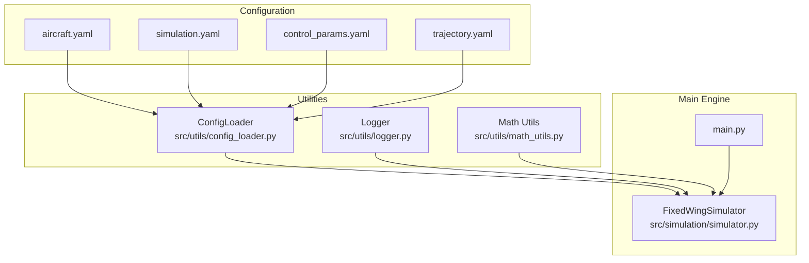
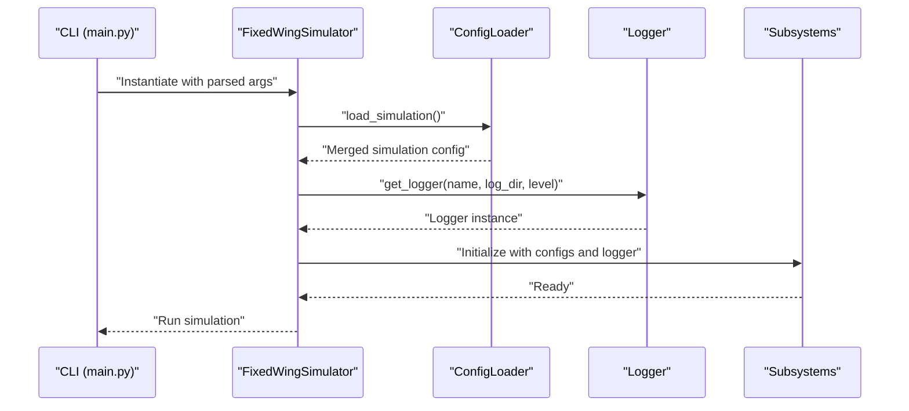
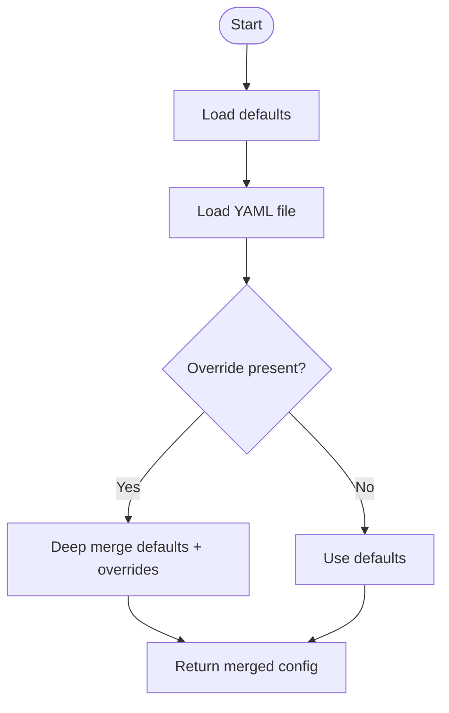
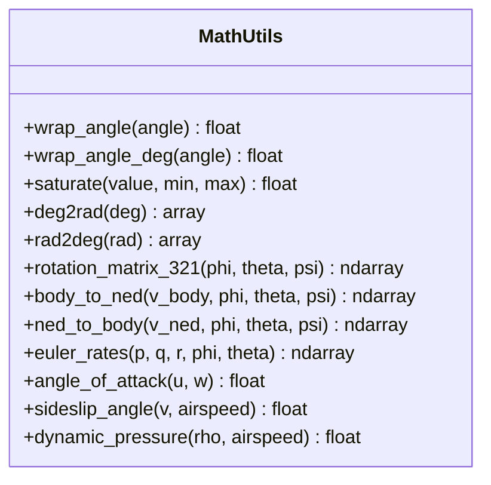
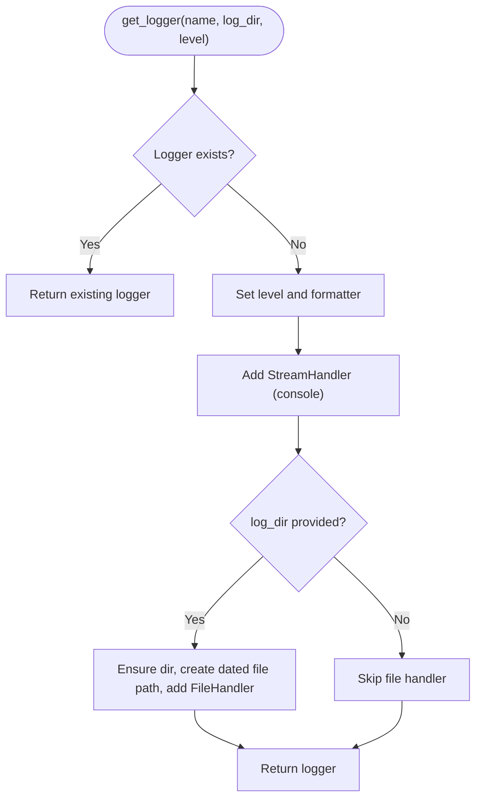
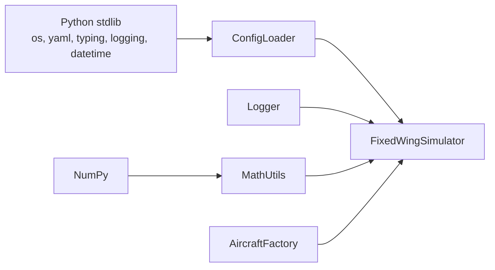

# Utilities and Support

<cite>
**Referenced Files in This Document**
- [src/utils/config_loader.py](file://src/utils/config_loader.py)
- [src/utils/logger.py](file://src/utils/logger.py)
- [src/utils/math_utils.py](file://src/utils/math_utils.py)
- [config/aircraft.yaml](file://config/aircraft.yaml)
- [config/simulation.yaml](file://config/simulation.yaml)
- [config/control_params.yaml](file://config/control_params.yaml)
- [config/trajectory.yaml](file://config/trajectory.yaml)
- [src/simulation/simulator.py](file://src/simulation/simulator.py)
- [main.py](file://main.py)
- [doc/zh/content/工具与实用程序/工具与实用程序.md](file://doc/zh/content/工具与实用程序/工具与实用程序.md)
- [doc/zh/content/工具与实用程序/日志记录系统.md](file://doc/zh/content/工具与实用程序/日志记录系统.md)
- [doc/zh/content/工具与实用程序/配置加载器.md](file://doc/zh/content/工具与实用程序/配置加载器.md)
- [doc/zh/content/工具与实用程序/数学工具函数.md](file://doc/zh/content/工具与实用程序/数学工具函数.md)
- [doc/zh/content/安装与配置/仿真设置配置.md](file://doc/zh/content/安装与配置/仿真设置配置.md)
- [doc/zh/content/安装与配置/控制参数配置.md](file://doc/zh/content/安装与配置/控制参数配置.md)
- [doc/zh/content/安装与配置/轨迹配置.md](file://doc/zh/content/安装与配置/轨迹配置.md)
- [doc/zh/content/安装与配置/飞机参数配置.md](file://doc/zh/content/安装与配置/飞机参数配置.md)
- [doc/zh/content/开发指南/调试工具与方法.md](file://doc/zh/content/开发指南/调试工具与方法.md)
</cite>

## Table of Contents
1. [Introduction](#introduction)
2. [Project Structure](#project-structure)
3. [Core Components](#core-components)
4. [Architecture Overview](#architecture-overview)
5. [Detailed Component Analysis](#detailed-component-analysis)
6. [Dependency Analysis](#dependency-analysis)
7. [Performance Considerations](#performance-considerations)
8. [Troubleshooting Guide](#troubleshooting-guide)
9. [Conclusion](#conclusion)
10. [Appendices](#appendices)

## Introduction
This document explains the utilities and support systems that underpin the FixedWingSimulator. It focuses on:
- Configuration loading and merging for YAML-based parameters
- Mathematical utilities for aerospace calculations (angles, rotations, aerodynamics)
- Logging system for event tracking and debugging
- Error handling, validation, and debugging tools
- Practical examples of configuration management, mathematical operations, and logging setup
- The role of utilities in supporting the main simulation components and their integration patterns

## Project Structure
The utilities reside under src/utils and are consumed by the main simulation engine and other subsystems. Configuration files live under config/, and the main entry point orchestrates the simulation.

**Diagram sources**
- [src/utils/config_loader.py](file://src/utils/config_loader.py#L59-L82)
- [src/utils/logger.py](file://src/utils/logger.py#L10-L43)
- [src/utils/math_utils.py](file://src/utils/math_utils.py#L1-L124)
- [config/aircraft.yaml](file://config/aircraft.yaml#L1-L13)
- [config/simulation.yaml](file://config/simulation.yaml#L1-L30)
- [config/control_params.yaml](file://config/control_params.yaml#L1-L45)
- [config/trajectory.yaml](file://config/trajectory.yaml#L1-L23)
- [src/simulation/simulator.py](file://src/simulation/simulator.py#L130-L171)
- [main.py](file://main.py#L98-L141)

**Section sources**
- [src/utils/config_loader.py](file://src/utils/config_loader.py#L1-L82)
- [src/utils/logger.py](file://src/utils/logger.py#L1-L44)
- [src/utils/math_utils.py](file://src/utils/math_utils.py#L1-L124)
- [config/aircraft.yaml](file://config/aircraft.yaml#L1-L13)
- [config/simulation.yaml](file://config/simulation.yaml#L1-L30)
- [config/control_params.yaml](file://config/control_params.yaml#L1-L45)
- [config/trajectory.yaml](file://config/trajectory.yaml#L1-L23)
- [src/simulation/simulator.py](file://src/simulation/simulator.py#L1-L200)
- [main.py](file://main.py#L1-L145)

## Core Components
- Configuration Loader: Loads and merges YAML configurations with defaults, enabling flexible overrides per subsystem.
- Logger: Provides a thin wrapper around Python logging with console and optional file handlers.
- Math Utils: Offers angle utilities, rotation matrices, Euler rates, and aerodynamic helpers for aerospace computations.

**Section sources**
- [src/utils/config_loader.py](file://src/utils/config_loader.py#L59-L82)
- [src/utils/logger.py](file://src/utils/logger.py#L10-L43)
- [src/utils/math_utils.py](file://src/utils/math_utils.py#L13-L124)

## Architecture Overview
The utilities integrate with the main simulation engine during initialization. The engine loads configuration, sets up logging, and passes parameters to subsystems.

**Diagram sources**
- [main.py](file://main.py#L98-L141)
- [src/simulation/simulator.py](file://src/simulation/simulator.py#L130-L171)
- [src/utils/config_loader.py](file://src/utils/config_loader.py#L68-L77)
- [src/utils/logger.py](file://src/utils/logger.py#L10-L43)

## Detailed Component Analysis

### Configuration Loading System
The configuration loader centralizes YAML parsing and deep merging with defaults. It supports:
- Aircraft configuration
- Simulation parameters
- Control parameters
- Trajectory configuration

Key behaviors:
- Defaults are defined centrally and merged with user-provided YAML.
- Safe YAML loading handles missing files gracefully.
- Deep merge ensures nested dictionaries are combined rather than overwritten.

**Diagram sources**
- [src/utils/config_loader.py](file://src/utils/config_loader.py#L10-L56)

Practical usage examples:
- Loading simulation configuration and merging with defaults: [src/utils/config_loader.py](file://src/utils/config_loader.py#L75-L77)
- Loading aircraft configuration with defaults: [src/utils/config_loader.py](file://src/utils/config_loader.py#L68-L70)
- Loading control parameters: [src/utils/config_loader.py](file://src/utils/config_loader.py#L72-L73)
- Loading trajectory configuration with defaults: [src/utils/config_loader.py](file://src/utils/config_loader.py#L79-L81)

Integration pattern:
- The simulator constructs a ConfigLoader with the config directory and calls specific loaders during initialization. See [src/simulation/simulator.py](file://src/simulation/simulator.py#L148-L153).

Validation and parameterization:
- Simulation configuration keys (e.g., dt, duration, integrator, tolerances, initial conditions, wind, logging) are defined in the defaults and validated by downstream components. See [config/simulation.yaml](file://config/simulation.yaml#L1-L30) and [src/utils/config_loader.py](file://src/utils/config_loader.py#L10-L37).
- Aircraft selection is validated against the database. See [src/simulation/simulator.py](file://src/simulation/simulator.py#L140-L141).

**Section sources**
- [src/utils/config_loader.py](file://src/utils/config_loader.py#L10-L82)
- [config/aircraft.yaml](file://config/aircraft.yaml#L1-L13)
- [config/simulation.yaml](file://config/simulation.yaml#L1-L30)
- [config/control_params.yaml](file://config/control_params.yaml#L1-L45)
- [config/trajectory.yaml](file://config/trajectory.yaml#L1-L23)
- [src/simulation/simulator.py](file://src/simulation/simulator.py#L140-L153)

### Mathematical Utility Functions
The math utilities provide aerospace-relevant functions:
- Angle wrapping (radians and degrees)
- Saturation/clipping
- Unit conversions (deg <-> rad)
- Rotation matrices (3-2-1 Euler, ZYX)
- Vector transforms between body and NED frames
- Euler angle rates computation with singularities handled
- Aerodynamic helpers (angle of attack, sideslip angle, dynamic pressure)

**Diagram sources**
- [src/utils/math_utils.py](file://src/utils/math_utils.py#L13-L124)

Integration pattern:
- The simulator imports rotation utilities for coordinate transforms. See [src/simulation/simulator.py](file://src/simulation/simulator.py#L52).

Examples:
- Using rotation matrix and transforms: [src/utils/math_utils.py](file://src/utils/math_utils.py#L43-L76)
- Computing Euler rates with numerical protection: [src/utils/math_utils.py](file://src/utils/math_utils.py#L79-L100)
- Aerodynamic helpers: [src/utils/math_utils.py](file://src/utils/math_utils.py#L107-L124)

**Section sources**
- [src/utils/math_utils.py](file://src/utils/math_utils.py#L1-L124)
- [src/simulation/simulator.py](file://src/simulation/simulator.py#L52)

### Logging System
The logger provides a unified interface for console and optional file logging:
- Creates a named logger with a consistent formatter
- Adds a console handler by default
- Optionally adds a file handler writing to a dated log file under a configurable directory
- Idempotent configuration guard prevents duplicate handlers

**Diagram sources**
- [src/utils/logger.py](file://src/utils/logger.py#L10-L43)

Integration pattern:
- The simulator initializes logging early and injects the logger into subsystems. See [src/simulation/simulator.py](file://src/simulation/simulator.py#L148-L153) and [src/utils/logger.py](file://src/utils/logger.py#L10-L43).

Logging configuration keys:
- The simulation defaults include logging enablement and directory. See [src/utils/config_loader.py](file://src/utils/config_loader.py#L10-L37) and [config/simulation.yaml](file://config/simulation.yaml#L27-L29).

**Section sources**
- [src/utils/logger.py](file://src/utils/logger.py#L1-L44)
- [src/utils/config_loader.py](file://src/utils/config_loader.py#L10-L37)
- [config/simulation.yaml](file://config/simulation.yaml#L27-L29)
- [src/simulation/simulator.py](file://src/simulation/simulator.py#L148-L153)

### Error Handling, Validation, and Debugging Tools
- Parameter validation: The simulator validates aircraft names against the database and uses ArduPilot-compatible parameter validation for control parameters. See [src/simulation/simulator.py](file://src/simulation/simulator.py#L140-L141) and [doc/zh/content/控制系统/ArduPilot兼容参数.md](file://doc/zh/content/控制系统/ArduPilot兼容参数.md#L181-L212).
- Configuration robustness: Missing YAML files are handled safely; defaults ensure sensible fallbacks. See [src/utils/config_loader.py](file://src/utils/config_loader.py#L40-L45).
- Logging levels and guidance: The documentation outlines appropriate levels and strategies for development, testing, and production. See [doc/zh/content/工具与实用程序/日志记录系统.md](file://doc/zh/content/工具与实用程序/日志记录系统.md#L286-L297).
- Debugging tips: The documentation includes troubleshooting steps for common issues such as configuration file errors, logging file output, angle singularities, and numeric stability in aerodynamic helpers. See [doc/zh/content/工具与实用程序/工具与实用程序.md](file://doc/zh/content/工具与实用程序/工具与实用程序.md#L297-L325).

**Section sources**
- [src/simulation/simulator.py](file://src/simulation/simulator.py#L140-L171)
- [doc/zh/content/工具与实用程序/日志记录系统.md](file://doc/zh/content/工具与实用程序/日志记录系统.md#L286-L297)
- [doc/zh/content/工具与实用程序/工具与实用程序.md](file://doc/zh/content/工具与实用程序/工具与实用程序.md#L297-L325)
- [doc/zh/content/控制系统/ArduPilot兼容参数.md](file://doc/zh/content/控制系统/ArduPilot兼容参数.md#L181-L212)

## Dependency Analysis
Utilities are consumed by the main simulation engine and subsystems. The diagram below shows how configuration, logging, and math utilities feed into the simulator and its components.

**Diagram sources**
- [src/utils/config_loader.py](file://src/utils/config_loader.py#L5-L8)
- [src/utils/logger.py](file://src/utils/logger.py#L5-L8)
- [src/utils/math_utils.py](file://src/utils/math_utils.py#L6)
- [src/simulation/simulator.py](file://src/simulation/simulator.py#L33-L52)

**Section sources**
- [src/utils/config_loader.py](file://src/utils/config_loader.py#L5-L8)
- [src/utils/logger.py](file://src/utils/logger.py#L5-L8)
- [src/utils/math_utils.py](file://src/utils/math_utils.py#L6)
- [src/simulation/simulator.py](file://src/simulation/simulator.py#L33-L52)

## Performance Considerations
- Configuration loading: YAML parsing and deep merge are lightweight and should be performed once at startup. See [doc/zh/content/工具与实用程序/工具与实用程序.md](file://doc/zh/content/工具与实用程序/工具与实用程序.md#L291-L295).
- Logging: File I/O can be a bottleneck; reduce frequency or consider asynchronous logging in hot loops. See [doc/zh/content/工具与实用程序/工具与实用程序.md](file://doc/zh/content/工具与实用程序/工具与实用程序.md#L291-L295).
- Math operations: NumPy vectorization improves performance; reuse intermediate results to avoid redundant computations. See ibid.

**Section sources**
- [doc/zh/content/工具与实用程序/工具与实用程序.md](file://doc/zh/content/工具与实用程序/工具与实用程序.md#L291-L295)

## Troubleshooting Guide
Common issues and resolutions:
- Configuration file missing or path incorrect
  - Symptom: Configuration returns empty or defaults not applied.
  - Action: Verify config_dir path, file existence and readability; check YAML syntax.
  - Reference: [src/utils/config_loader.py](file://src/utils/config_loader.py#L40-L45), [src/simulation/simulator.py](file://src/simulation/simulator.py#L149-L153)
- Logs not written to file
  - Symptom: Only console output; no log file.
  - Action: Ensure log_dir is set and writable; check permissions and disk space.
  - Reference: [src/utils/logger.py](file://src/utils/logger.py#L35-L42), [config/simulation.yaml](file://config/simulation.yaml#L27-L29)
- Angle singularity in Euler rates
  - Symptom: Instability near pitch ±90°.
  - Action: Add safeguards in upper layers or avoid singular attitudes.
  - Reference: [src/utils/math_utils.py](file://src/utils/math_utils.py#L87-L91)
- Numeric instability in aerodynamic helpers
  - Symptom: Domain errors or unstable results for low airspeed.
  - Action: Ensure airspeed exceeds safe thresholds; apply clipping where appropriate.
  - Reference: [src/utils/math_utils.py](file://src/utils/math_utils.py#L117-L118)

**Section sources**
- [src/utils/config_loader.py](file://src/utils/config_loader.py#L40-L45)
- [src/utils/logger.py](file://src/utils/logger.py#L35-L42)
- [src/utils/math_utils.py](file://src/utils/math_utils.py#L87-L118)
- [config/simulation.yaml](file://config/simulation.yaml#L27-L29)
- [src/simulation/simulator.py](file://src/simulation/simulator.py#L149-L153)

## Conclusion
The utilities and support systems provide a robust foundation for the simulator:
- Configuration loading with defaults and deep merging enables flexible, maintainable setups.
- Math utilities encapsulate aerospace-specific operations with numerical safeguards.
- Logging offers consistent, configurable observability across environments.
- Together, they integrate cleanly with the main simulation engine and subsystems, supporting reliable development, testing, and deployment.

## Appendices

### Configuration Management Examples
- Loading simulation configuration: [src/utils/config_loader.py](file://src/utils/config_loader.py#L75-L77)
- Loading aircraft configuration: [src/utils/config_loader.py](file://src/utils/config_loader.py#L68-L70)
- Loading control parameters: [src/utils/config_loader.py](file://src/utils/config_loader.py#L72-L73)
- Loading trajectory configuration: [src/utils/config_loader.py](file://src/utils/config_loader.py#L79-L81)
- CLI-driven simulation entry point: [main.py](file://main.py#L98-L141)

**Section sources**
- [src/utils/config_loader.py](file://src/utils/config_loader.py#L68-L81)
- [main.py](file://main.py#L98-L141)

### Mathematical Operations Examples
- Rotation matrix and frame transforms: [src/utils/math_utils.py](file://src/utils/math_utils.py#L43-L76)
- Euler rates with numerical protection: [src/utils/math_utils.py](file://src/utils/math_utils.py#L79-L100)
- Aerodynamic helpers: [src/utils/math_utils.py](file://src/utils/math_utils.py#L107-L124)

**Section sources**
- [src/utils/math_utils.py](file://src/utils/math_utils.py#L43-L124)

### Logging Setup Examples
- Logger creation with console and optional file handlers: [src/utils/logger.py](file://src/utils/logger.py#L10-L43)
- Enabling logging via simulation defaults: [src/utils/config_loader.py](file://src/utils/config_loader.py#L10-L37), [config/simulation.yaml](file://config/simulation.yaml#L27-L29)

**Section sources**
- [src/utils/logger.py](file://src/utils/logger.py#L10-L43)
- [src/utils/config_loader.py](file://src/utils/config_loader.py#L10-L37)
- [config/simulation.yaml](file://config/simulation.yaml#L27-L29)

### Integration Patterns
- Simulator initialization and configuration loading: [src/simulation/simulator.py](file://src/simulation/simulator.py#L148-L153)
- Math utilities usage in coordinate transforms: [src/simulation/simulator.py](file://src/simulation/simulator.py#L52)

**Section sources**
- [src/simulation/simulator.py](file://src/simulation/simulator.py#L52)
- [src/simulation/simulator.py](file://src/simulation/simulator.py#L148-L153)