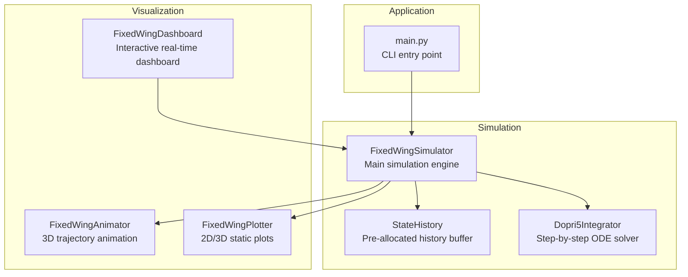
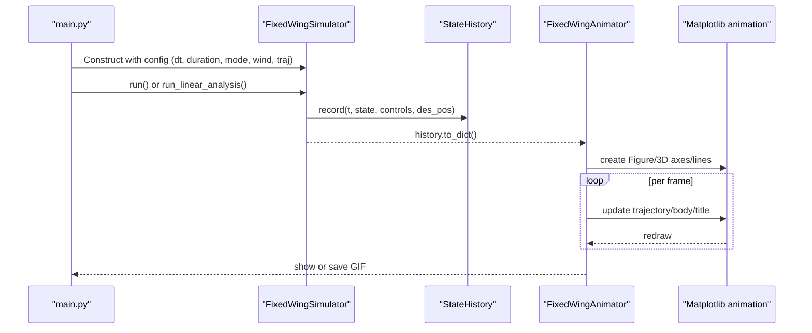
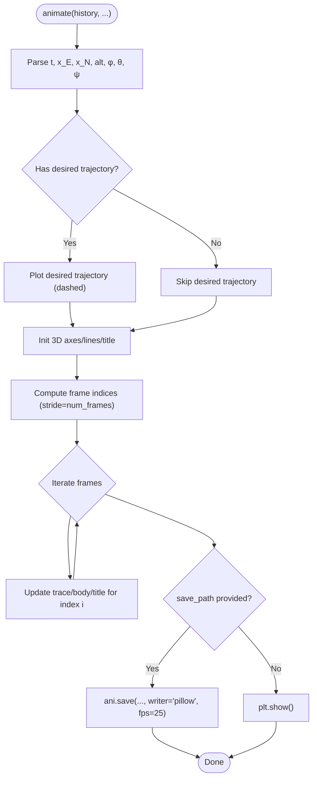
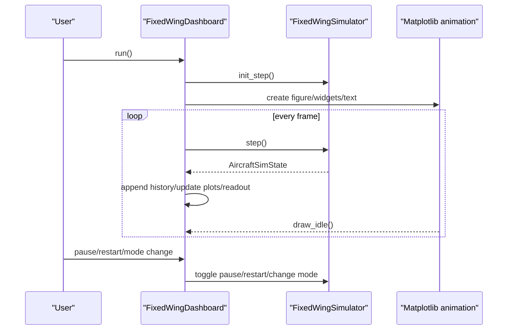
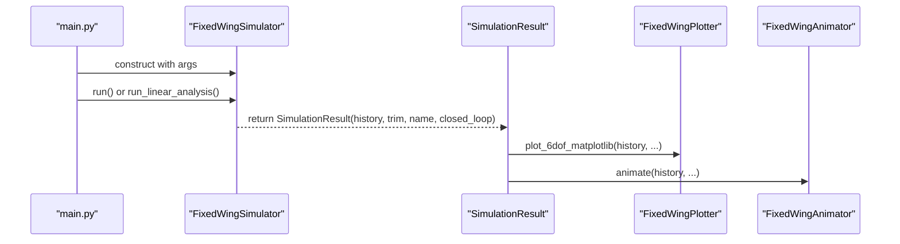
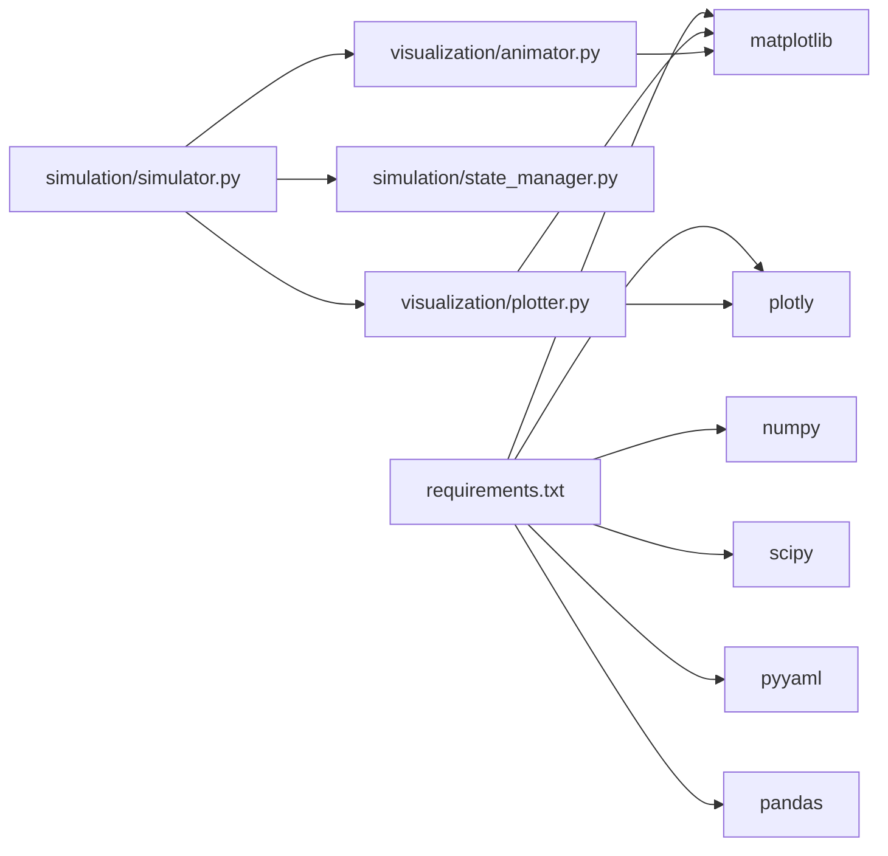

# Animation System

<cite>
**Referenced Files in This Document**
- [animator.py](file://src/visualization/animator.py)
- [dashboard.py](file://src/visualization/dashboard.py)
- [plotter.py](file://src/visualization/plotter.py)
- [simulator.py](file://src/simulation/simulator.py)
- [state_manager.py](file://src/simulation/state_manager.py)
- [integrator.py](file://src/simulation/integrator.py)
- [main.py](file://main.py)
- [requirements.txt](file://requirements.txt)
</cite>

## Table of Contents
1. [Introduction](#introduction)
2. [Project Structure](#project-structure)
3. [Core Components](#core-components)
4. [Architecture Overview](#architecture-overview)
5. [Detailed Component Analysis](#detailed-component-analysis)
6. [Dependency Analysis](#dependency-analysis)
7. [Performance Considerations](#performance-considerations)
8. [Troubleshooting Guide](#troubleshooting-guide)
9. [Conclusion](#conclusion)
10. [Appendices](#appendices)

## Introduction
This document describes the animation system component responsible for flight trajectory visualization and real-time playback. It explains how simulation results are transformed into smooth 3D animations, how frames are generated and rendered, and how the animation integrates with simulation state management. It also covers configuration options, timing controls, output formats, performance considerations for real-time playback and large datasets, and the relationship between the animation system and the simulation state lifecycle.

## Project Structure
The animation system spans several modules:
- Visualization: animator (3D trajectory animation), dashboard (interactive real-time UI), plotter (2D/3D static plots and Plotly charts)
- Simulation: simulator (main engine), state_manager (history buffer), integrator (numerical ODE solver)
- Application entry: main.py (CLI orchestration)

**Diagram sources**
- [animator.py](file://src/visualization/animator.py#L14-L150)
- [dashboard.py](file://src/visualization/dashboard.py#L28-L167)
- [plotter.py](file://src/visualization/plotter.py#L19-L244)
- [simulator.py](file://src/simulation/simulator.py#L115-L642)
- [state_manager.py](file://src/simulation/state_manager.py#L95-L193)
- [integrator.py](file://src/simulation/integrator.py#L17-L108)
- [main.py](file://main.py#L98-L145)

**Section sources**
- [animator.py](file://src/visualization/animator.py#L1-L150)
- [dashboard.py](file://src/visualization/dashboard.py#L1-L167)
- [plotter.py](file://src/visualization/plotter.py#L1-L244)
- [simulator.py](file://src/simulation/simulator.py#L1-L642)
- [state_manager.py](file://src/simulation/state_manager.py#L1-L193)
- [integrator.py](file://src/simulation/integrator.py#L1-L108)
- [main.py](file://main.py#L1-L145)

## Core Components
- FixedWingAnimator: Creates a 3D animation using Matplotlib FuncAnimation. It renders the actual trajectory, optional desired trajectory, waypoints, and a simplified fixed-wing body silhouette (fuselage, wings, horizontal tail). It supports saving to GIF and optionally displaying the window.
- FixedWingDashboard: Provides an interactive real-time dashboard that advances the simulation step-by-step and displays live curves and numeric readouts. It integrates with the simulation’s step-by-step API.
- FixedWingPlotter: Produces both Matplotlib static figures and Plotly interactive charts for time-domain and 3D trajectory visualization.
- FixedWingSimulator: Orchestrates the simulation, builds the ODE, runs control layers, and records StateHistory. It exposes a visualize() method to quickly render plots and animations.
- StateHistory: Efficient pre-allocated NumPy arrays that record time-series state and control channels, exporting a dictionary suitable for visualization.
- Dopri5Integrator: A step-by-step ODE solver wrapping SciPy’s dopri5, used by the simulator to advance the state.

**Section sources**
- [animator.py](file://src/visualization/animator.py#L14-L150)
- [dashboard.py](file://src/visualization/dashboard.py#L28-L167)
- [plotter.py](file://src/visualization/plotter.py#L19-L244)
- [simulator.py](file://src/simulation/simulator.py#L59-L110)
- [state_manager.py](file://src/simulation/state_manager.py#L95-L193)
- [integrator.py](file://src/simulation/integrator.py#L17-L108)

## Architecture Overview
The animation system is tightly coupled with the simulation state lifecycle. The simulator records state into StateHistory at each time step. The animation system consumes this history to render a smooth 3D trajectory with a moving aircraft body. The dashboard provides real-time playback by stepping the simulator and updating plots.

**Diagram sources**
- [main.py](file://main.py#L114-L141)
- [simulator.py](file://src/simulation/simulator.py#L239-L567)
- [state_manager.py](file://src/simulation/state_manager.py#L179-L180)
- [animator.py](file://src/visualization/animator.py#L104-L150)

## Detailed Component Analysis

### FixedWingAnimator: 3D Trajectory Animation
- Input: A dictionary produced by StateHistory.to_dict(), containing time, NED positions, Euler angles, airspeed, control surfaces, and optionally desired positions.
- Rendering pipeline:
  - Parses history fields and checks for a non-zero desired trajectory.
  - Initializes a 3D Matplotlib figure with labeled axes and a legend.
  - Draws a static desired trajectory (if present) and a dynamic actual trajectory that grows over time.
  - Defines a simple fixed-wing body geometry in the body frame (fuselage, wings, horizontal tail).
  - Uses a 321 Euler rotation matrix to transform body geometry into NED coordinates.
  - Precomputes frame indices at a stride controlled by num_frames to reduce rendering overhead.
  - The update function sets line data for the trajectory and the aircraft body segments, and updates the title with time, altitude, and airspeed.
  - Supports saving to GIF via Pillow and optionally displaying the window.
- Timing controls:
  - num_frames: stride for frame selection (every N simulation steps).
  - interval: milliseconds per frame for FuncAnimation (default ~25 fps).
- Output formats:
  - GIF via Pillow writer.
  - Interactive window (optional).

**Diagram sources**
- [animator.py](file://src/visualization/animator.py#L25-L150)

**Section sources**
- [animator.py](file://src/visualization/animator.py#L14-L150)

### FixedWingDashboard: Real-Time Interactive Playback
- Purpose: Provide an interactive real-time dashboard that advances the simulation step-by-step and displays live plots and numeric readouts.
- Integration:
  - Uses FixedWingSimulator.init_step() to initialize the simulation state and ODE.
  - Runs a Matplotlib FuncAnimation loop that calls sim.step() at intervals determined by sim.dt.
  - Maintains internal lists for time and selected state variables, appending new values each frame.
  - Updates plots and a monospaced text box with instantaneous state (time, altitude, airspeed, angles, current mode).
  - Controls: pause/resume button, restart button, radio buttons for flight mode selection.
- Backend selection:
  - Ensures an interactive backend (e.g., TkAgg) is used for responsiveness.

**Diagram sources**
- [dashboard.py](file://src/visualization/dashboard.py#L59-L111)
- [simulator.py](file://src/simulation/simulator.py#L602-L642)

**Section sources**
- [dashboard.py](file://src/visualization/dashboard.py#L28-L167)
- [simulator.py](file://src/simulation/simulator.py#L602-L642)

### FixedWingPlotter: Static and Interactive Charts
- Matplotlib static figures: Generates multiple subplots for position/velocity, attitude/angular rates, and control inputs. Can save PNGs with configurable DPI and directory.
- Plotly interactive charts: Creates subplots for 4-DOF and 6-DOF time-domain responses and a 3D trajectory with start marker and optional desired trajectory. Suitable for embedding in web UIs.

**Section sources**
- [plotter.py](file://src/visualization/plotter.py#L19-L244)

### FixedWingSimulator: Simulation and Visualization Entry Point
- run(): Builds the ODE, initializes control systems, computes trim, and iteratively integrates the state while recording into StateHistory. It supports closed-loop and open-loop modes and trajectory tracking.
- run_linear_analysis(): Performs 4-DOF linear open-loop analysis.
- init_step()/step(): Step-by-step API for UI integration (used by the dashboard).
- visualize(): Convenience method that calls FixedWingPlotter and FixedWingAnimator to render quick 2D/3D plots and 3D animation.

**Diagram sources**
- [main.py](file://main.py#L114-L141)
- [simulator.py](file://src/simulation/simulator.py#L92-L109)

**Section sources**
- [simulator.py](file://src/simulation/simulator.py#L59-L110)
- [main.py](file://main.py#L98-L145)

### StateHistory: History Buffer and Export
- Pre-allocates NumPy arrays for all state and control channels to minimize memory churn.
- Records one time step at a time, including desired positions when available.
- Provides to_dict() returning a shallow copy of the recorded arrays, trimmed to the actual length via trim().

**Section sources**
- [state_manager.py](file://src/simulation/state_manager.py#L95-L193)

### Dopri5Integrator: Step-by-Step ODE Solver
- Wraps SciPy’s dopri5 with a single-step API, enabling real-time step-by-step simulation used by the dashboard and the simulator’s run loop.

**Section sources**
- [integrator.py](file://src/simulation/integrator.py#L17-L108)

## Dependency Analysis
- Visualization depends on NumPy, Matplotlib, and Plotly.
- Simulation depends on SciPy (ODE integration), PyYAML (configuration), and optionally Pandas (examples).
- The animation system primarily depends on StateHistory and Matplotlib/Plotly.

**Diagram sources**
- [requirements.txt](file://requirements.txt#L1-L8)
- [simulator.py](file://src/simulation/simulator.py#L33-L52)
- [plotter.py](file://src/visualization/plotter.py#L39-L40)
- [animator.py](file://src/visualization/animator.py#L44-L46)

**Section sources**
- [requirements.txt](file://requirements.txt#L1-L8)
- [simulator.py](file://src/simulation/simulator.py#L33-L52)

## Performance Considerations
- Frame sampling and stride:
  - num_frames controls the stride for frame indices, reducing the number of rendered frames and improving performance for long simulations.
- Incremental updates:
  - The animator updates line data (set_data/set_3d_properties) rather than recreating objects, minimizing garbage collection pressure.
- Backend selection:
  - Use non-interactive backends (e.g., Agg) for batch rendering and interactive backends (e.g., TkAgg) for live dashboards.
- Memory optimization:
  - StateHistory pre-allocates arrays and trims unused tail via trim(), reducing memory footprint.
  - Consider downsampling history for large datasets when rendering or saving animations.
- Rendering quality vs. speed:
  - Adjust interval (milliseconds per frame) to balance smoothness and CPU usage.
  - For static plots, increase DPI appropriately; for animations, moderate DPI reduces file sizes and saves time.
- Real-time playback:
  - The dashboard uses sim.dt to schedule updates, aligning animation speed with simulation time.

**Section sources**
- [animator.py](file://src/visualization/animator.py#L104-L150)
- [dashboard.py](file://src/visualization/dashboard.py#L106-L111)
- [state_manager.py](file://src/simulation/state_manager.py#L170-L193)

## Troubleshooting Guide
- Missing dependencies:
  - Ensure matplotlib, plotly, numpy, scipy, pyyaml, and pandas are installed according to requirements.txt.
- Animation does not display or freezes:
  - Verify the backend is interactive (e.g., TkAgg) for live dashboards; use non-interactive backends for batch rendering.
  - Reduce num_frames or increase interval to improve performance.
- Desired trajectory not shown:
  - Confirm that the history contains non-zero desired positions (des_north, des_east, des_down).
- Dashboard not responding:
  - Ensure init_step() is called before step() and that the simulation loop is running.
- Large dataset handling:
  - Use history.trim() to remove unused tail; consider downsampling before animation.
- Saving animations:
  - Provide a save_path to animate(); ensure Pillow is available for GIF writing.

**Section sources**
- [requirements.txt](file://requirements.txt#L1-L8)
- [animator.py](file://src/visualization/animator.py#L56-L67)
- [dashboard.py](file://src/visualization/dashboard.py#L42-L44)
- [state_manager.py](file://src/simulation/state_manager.py#L170-L193)

## Conclusion
The animation system transforms simulation history into smooth, real-time 3D visualizations. By leveraging StateHistory as the central data source, employing frame strides and incremental updates, and integrating with both Matplotlib and Plotly, it balances performance and fidelity. The dashboard enables interactive playback, while the animator supports batch rendering and GIF export. Together with the simulator’s step-by-step API, this system provides a robust foundation for teaching, demonstration, and engineering analysis.

## Appendices

### Animation Configuration and Timing Controls
- FixedWingAnimator.animate
  - history: Dictionary from StateHistory.to_dict()
  - uav_name: Display name for titles
  - num_frames: Stride for frame indices (default 8)
  - show: Whether to display the window
  - save_path: Path to save GIF (optional)
- FixedWingDashboard.run
  - max_steps: Maximum history length
  - Interactive widgets: pause/restart buttons, flight mode radio buttons
- FixedWingPlotter
  - Matplotlib static figures: DPI and save directory options
  - Plotly charts: Return embeddable Figure objects for web UIs

**Section sources**
- [animator.py](file://src/visualization/animator.py#L25-L43)
- [dashboard.py](file://src/visualization/dashboard.py#L41-L60)
- [plotter.py](file://src/visualization/plotter.py#L161-L180)

### Relationship Between Animation System and Simulation State Management
- SimulationResult.visualize() orchestrates the animation and plotting using the recorded history.
- StateHistory.to_dict() provides the structured dictionary consumed by the animator and plotter.
- The simulator’s run loop continuously records state, enabling both real-time dashboards and post-run animations.

**Section sources**
- [simulator.py](file://src/simulation/simulator.py#L92-L109)
- [state_manager.py](file://src/simulation/state_manager.py#L179-L180)