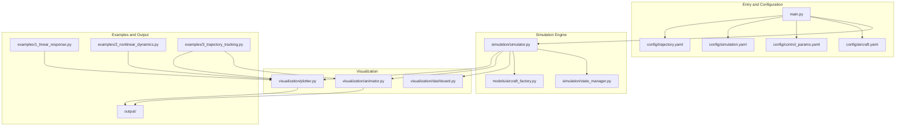
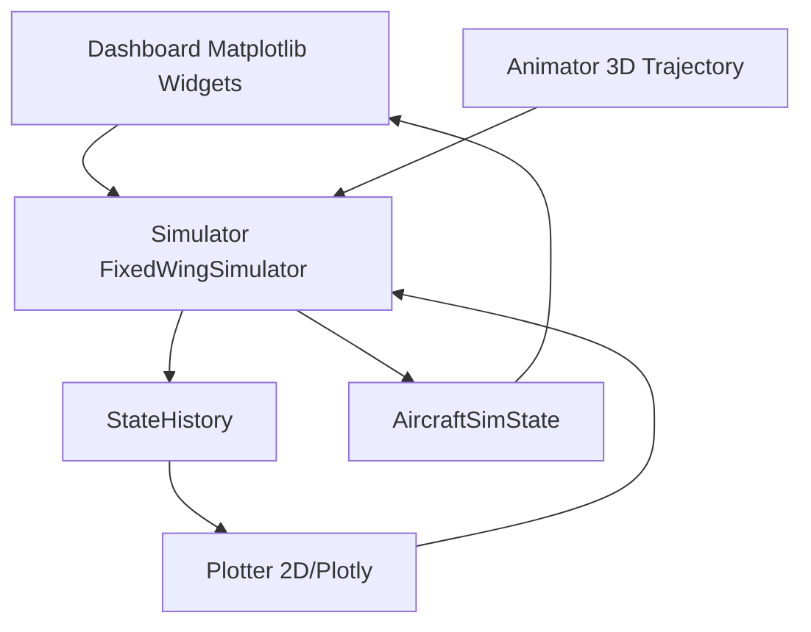
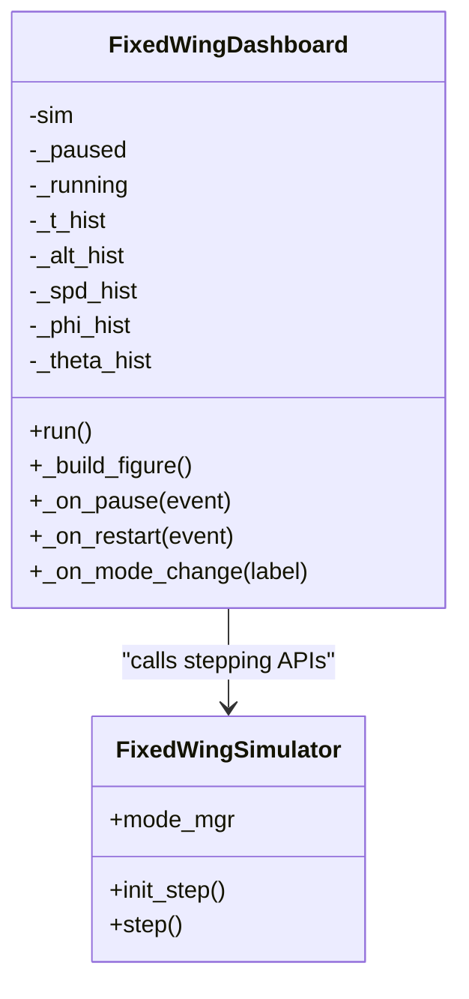
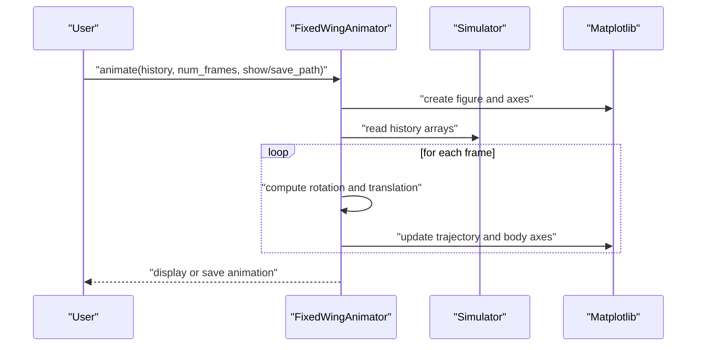
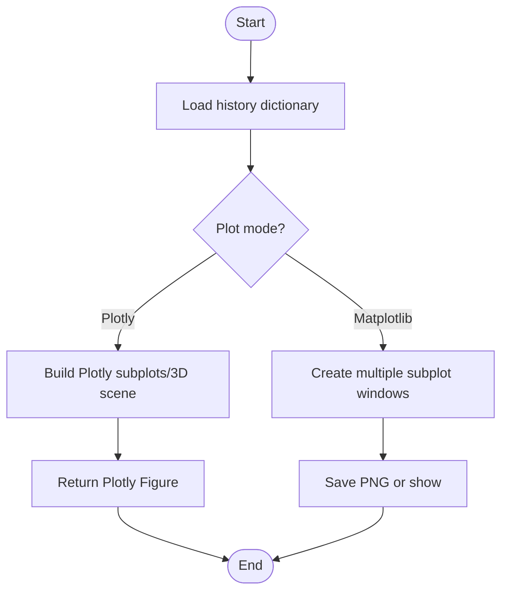
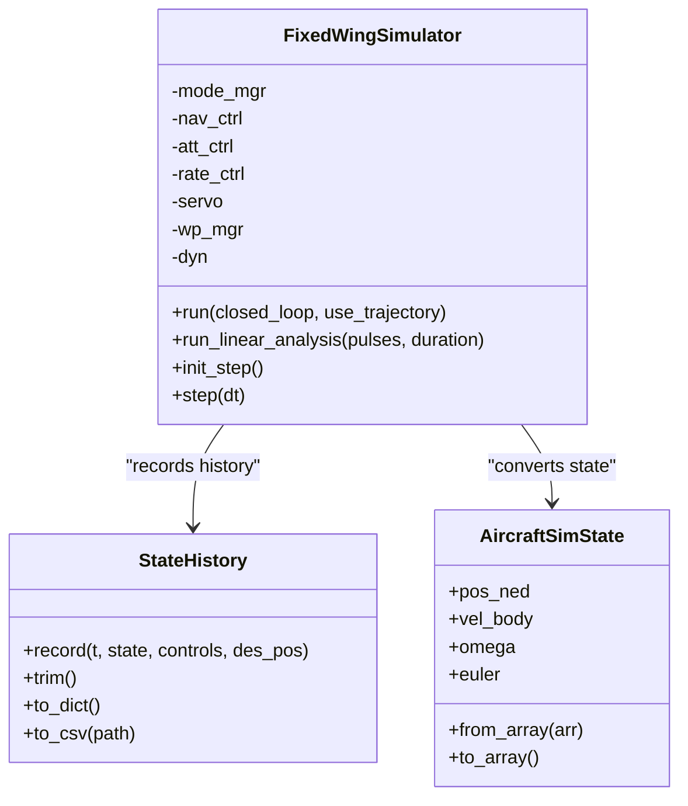
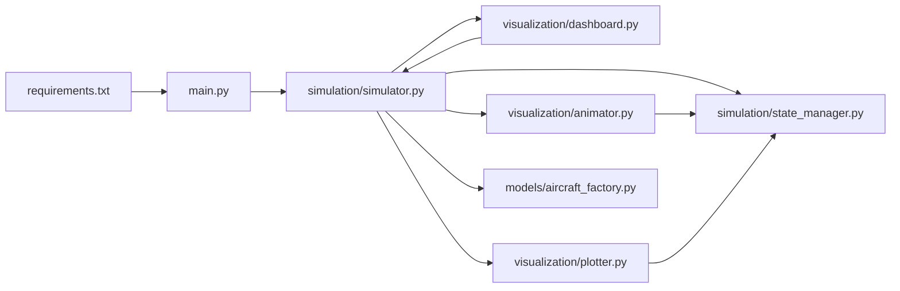

# Dashboard System

<cite>
**Referenced Files in This Document**
- [dashboard.py](file://src/visualization/dashboard.py)
- [animator.py](file://src/visualization/animator.py)
- [plotter.py](file://src/visualization/plotter.py)
- [simulator.py](file://src/simulation/simulator.py)
- [state_manager.py](file://src/simulation/state_manager.py)
- [aircraft_factory.py](file://src/models/aircraft_factory.py)
- [main.py](file://main.py)
- [requirements.txt](file://requirements.txt)
- [aircraft.yaml](file://config/aircraft.yaml)
- [control_params.yaml](file://config/control_params.yaml)
- [simulation.yaml](file://config/simulation.yaml)
- [trajectory.yaml](file://config/trajectory.yaml)
- [1_linear_response.py](file://examples/1_linear_response.py)
- [2_nonlinear_dynamics.py](file://examples/2_nonlinear_dynamics.py)
- [3_trajectory_tracking.py](file://examples/3_trajectory_tracking.py)
</cite>

## Table of Contents
1. [Introduction](#introduction)
2. [Project Structure](#project-structure)
3. [Core Components](#core-components)
4. [Architecture Overview](#architecture-overview)
5. [Detailed Component Analysis](#detailed-component-analysis)
6. [Dependency Analysis](#dependency-analysis)
7. [Performance Considerations](#performance-considerations)
8. [Troubleshooting Guide](#troubleshooting-guide)
9. [Conclusion](#conclusion)
10. [Appendices](#appendices)

## Introduction
This document describes the dashboard system component responsible for real-time monitoring and interactive control of the fixed-wing simulation. It explains the dashboard architecture, widget organization, and data visualization components, and documents how the dashboard integrates with live simulation data. It also provides examples of dashboard configuration, custom widget creation, and data binding, along with user interface components, interaction patterns, and control mechanisms. The dashboard serves as the primary operator interface for simulation control and system monitoring.

## Project Structure
The dashboard system resides within the visualization subsystem and integrates tightly with the simulation engine. The main entry point orchestrates simulation runs and can trigger visualization components.

**Diagram sources**
- [main.py](file://main.py#L98-L145)
- [simulator.py](file://src/simulation/simulator.py#L115-L128)
- [state_manager.py](file://src/simulation/state_manager.py#L95-L193)
- [aircraft_factory.py](file://src/models/aircraft_factory.py#L39-L136)
- [dashboard.py](file://src/visualization/dashboard.py#L28-L167)
- [animator.py](file://src/visualization/animator.py#L14-L150)
- [plotter.py](file://src/visualization/plotter.py#L19-L244)
- [1_linear_response.py](file://examples/1_linear_response.py#L1-L206)
- [2_nonlinear_dynamics.py](file://examples/2_nonlinear_dynamics.py#L1-L215)
- [3_trajectory_tracking.py](file://examples/3_trajectory_tracking.py#L1-L194)

**Section sources**
- [main.py](file://main.py#L1-L145)
- [requirements.txt](file://requirements.txt#L1-L8)

## Core Components
- Dashboard (interactive Matplotlib widgets)
  - Provides a flight mode selector, PID gain sliders placeholder, pause/resume/restart buttons, and live state numerical readout.
  - Driven by the simulator’s step interface for incremental updates using a timer-driven loop.
- Animator (3D trajectory animation)
  - Uses Matplotlib FuncAnimation to render trajectories and aircraft body axes in real time; supports saving animations as GIF.
- 2D Plotter (static and Plotly dual-mode)
  - Produces 4DOF/6DOF time series plots and 3D NED trajectories; supports static Matplotlib figures and Plotly figures for web UI.
- Simulator (FixedWingSimulator)
  - Offers run()/run_linear_analysis() batch runs and init_step()/step() stepping APIs for real-time dashboard driving.
- State Management (StateHistory/AircraftSimState)
  - Pre-allocates history buffers for efficient recording; supports trimming unused tails and exporting CSV.
- Aircraft Configuration Factory (AircraftFactory)
  - Merges database defaults with YAML overrides to produce configuration objects for simulations.
- Main Entry (main.py)
  - Parses CLI arguments, assembles the simulator, and executes different run modes.

**Section sources**
- [dashboard.py](file://src/visualization/dashboard.py#L28-L167)
- [animator.py](file://src/visualization/animator.py#L14-L150)
- [plotter.py](file://src/visualization/plotter.py#L19-L244)
- [simulator.py](file://src/simulation/simulator.py#L115-L642)
- [state_manager.py](file://src/simulation/state_manager.py#L16-L193)
- [aircraft_factory.py](file://src/models/aircraft_factory.py#L39-L136)
- [main.py](file://main.py#L32-L145)

## Architecture Overview
The dashboard system follows a decoupled “simulation engine–visualization layer” design. The simulation engine computes physics and control, while the visualization layer consumes unified data interfaces (history buffers, state objects, CSV export) for display and interaction. The real-time dashboard drives the simulation via stepwise updates, forming an event-driven update loop.

**Diagram sources**
- [dashboard.py](file://src/visualization/dashboard.py#L59-L110)
- [animator.py](file://src/visualization/animator.py#L25-L150)
- [plotter.py](file://src/visualization/plotter.py#L19-L244)
- [simulator.py](file://src/simulation/simulator.py#L239-L642)
- [state_manager.py](file://src/simulation/state_manager.py#L95-L193)

## Detailed Component Analysis

### Dashboard Component Analysis (FixedWingDashboard)
- Design philosophy
  - Built around interactive Matplotlib widgets to deliver a “live” real-time observation interface.
  - Uses RadioButtons, Button, and Axes controls to switch flight modes, pause/resume, and restart; displays live state readouts.
- Data binding and real-time updates
  - Driven by a timer-based function animation; each frame calls the simulator’s step interface to fetch the latest state and update line plots and text readouts.
  - History buffers append timestamps incrementally; line plots auto-scale to accommodate new data.
- UI layout and responsiveness
  - Uses add_axes to position regions precisely; titles, grids, and axis labels remain consistent; monospaced fonts improve readability for numeric readouts.
  - Button and radio positions are fixed to maintain usability across different window sizes.
- Interaction logic
  - Pause/Resume toggles dynamically update button text; Restart clears histories, reinitializes the simulator, and resets the paused state.
  - Mode changes are forwarded directly to the simulator’s flight mode manager.

**Diagram sources**
- [dashboard.py](file://src/visualization/dashboard.py#L28-L167)
- [simulator.py](file://src/simulation/simulator.py#L602-L642)

**Section sources**
- [dashboard.py](file://src/visualization/dashboard.py#L28-L167)

### Animator Component Analysis (FixedWingAnimator)
- Design philosophy
  - Renders actual and desired trajectories with a simple fixed-wing silhouette (fuselage and wings) in 3D space; overlays waypoints and desired path.
- Data binding and rendering
  - Consumes a history dictionary containing time, position, attitude, and control surface arrays; updates trajectory and body axes per frame index.
  - Applies rotation matrices to transform body-frame geometry into NED coordinates and maps to plot coordinates.
- Performance and export
  - Supports non-blocking rendering and adjustable frame intervals; can save animations as GIF.

**Diagram sources**
- [animator.py](file://src/visualization/animator.py#L25-L150)

**Section sources**
- [animator.py](file://src/visualization/animator.py#L14-L150)

### Plotter Component Analysis (FixedWingPlotter)
- Design philosophy
  - Provides dual plotting modes: Matplotlib static figures (batch-friendly) and Plotly figures (web UI compatible).
- Data binding and layout
  - 4DOF/6DOF time series plots use subplot layouts with explicit titles and axis labels; 3D trajectory plots support start/end markers and desired trajectory overlay.
- Output and reuse
  - Static figures can be saved as PNG; Plotly figures can be embedded in web applications.

**Diagram sources**
- [plotter.py](file://src/visualization/plotter.py#L19-L244)

**Section sources**
- [plotter.py](file://src/visualization/plotter.py#L19-L244)

### Simulator and State Management
- Simulator (FixedWingSimulator)
  - Offers run()/run_linear_analysis() batch runs and init_step()/step() stepping APIs for real-time dashboard driving.
  - Integrates flight mode management, navigation controller, attitude/rate controllers, servo mixer, and trajectory manager.
- State Management (StateHistory/AircraftSimState)
  - Pre-allocates arrays for efficient recording; trims unused tails after runs; exports CSV for offline analysis.
  - State object encapsulates 12-D state and derived quantities (airspeed, angle of attack, sideslip, altitude).

**Diagram sources**
- [simulator.py](file://src/simulation/simulator.py#L115-L642)
- [state_manager.py](file://src/simulation/state_manager.py#L16-L193)

**Section sources**
- [simulator.py](file://src/simulation/simulator.py#L115-L642)
- [state_manager.py](file://src/simulation/state_manager.py#L16-L193)

### Aircraft Configuration and Parameters
- Aircraft configuration factory (AircraftFactory)
  - Merges database defaults with YAML overrides to produce configuration objects for simulations.
- Control parameters (control_params.yaml)
  - Includes PID gains, limits, and TECS parameters for ArduPilot-compatible control chains.
- Simulation configuration (simulation.yaml)
  - Defines dt, duration, initial conditions, wind, and logging.
- Trajectory configuration (trajectory.yaml)
  - Specifies trajectory types, average speed, waypoints, and looping modes.

**Section sources**
- [aircraft_factory.py](file://src/models/aircraft_factory.py#L39-L136)
- [control_params.yaml](file://config/control_params.yaml#L1-L45)
- [simulation.yaml](file://config/simulation.yaml#L1-L30)
- [trajectory.yaml](file://config/trajectory.yaml#L1-L23)

## Dependency Analysis
- External dependencies
  - NumPy, SciPy, Matplotlib, Plotly, PyYAML, Pandas, pytest.
- Internal module dependencies
  - main.py depends on simulation/simulator.py and models/aircraft_database.
  - simulator.py depends on models, dynamics, environment, control, planning, simulation, and utils.
  - visualization/dashboard.py depends on simulation/simulator.py and Matplotlib.
  - visualization/animator.py and visualization/plotter.py depend on Matplotlib/Plotly and simulation/state_manager.

**Diagram sources**
- [requirements.txt](file://requirements.txt#L1-L8)
- [main.py](file://main.py#L28-L145)
- [simulator.py](file://src/simulation/simulator.py#L33-L52)
- [dashboard.py](file://src/visualization/dashboard.py#L18-L26)
- [animator.py](file://src/visualization/animator.py#L44-L47)
- [plotter.py](file://src/visualization/plotter.py#L39-L41)

**Section sources**
- [requirements.txt](file://requirements.txt#L1-L8)
- [main.py](file://main.py#L28-L145)
- [simulator.py](file://src/simulation/simulator.py#L33-L52)

## Performance Considerations
- Real-time update strategy
  - The dashboard uses a timer-driven function animation; frame interval matches the simulation step size to avoid excessive refresh and potential stutter.
  - Line plots use incremental updates and auto-scaling; views refresh only when new data arrives.
- Memory and storage
  - StateHistory pre-allocates arrays and trims unused tails post-run to reduce memory footprint.
  - CSV export enables offline analysis and secondary development.
- Rendering performance
  - Animator and plotter target real-time and batch scenarios respectively; choose backends (Agg/GTK/Tk) and rendering modes appropriately.
- Numerical stability
  - The simulator checks integrator status before each step; exceptions halt updates and prompt error messages to prevent invalid rendering.

**Section sources**
- [dashboard.py](file://src/visualization/dashboard.py#L69-L110)
- [state_manager.py](file://src/simulation/state_manager.py#L170-L193)
- [simulator.py](file://src/simulation/simulator.py#L558-L564)

## Troubleshooting Guide
- Dashboard fails to start
  - Verify Matplotlib installation; ImportError is raised if missing.
  - Ensure the simulator is initialized and init_step() is called before step().
- Real-time updates fail
  - If step() raises an exception, the dashboard stops updating; inspect internal logs for errors.
  - Confirm the timer interval aligns with the simulation step size.
- Animation save failure
  - Ensure Pillow is available and the save path exists; check disk space and permissions.
- No plot output
  - Non-interactive backends (Agg) do not pop up windows; set show flag or provide save_dir.
- Configuration not applied
  - Check YAML file paths and key names; note the override order between control and simulation parameters.

**Section sources**
- [dashboard.py](file://src/visualization/dashboard.py#L42-L44)
- [dashboard.py](file://src/visualization/dashboard.py#L73-L78)
- [animator.py](file://src/visualization/animator.py#L144-L146)
- [plotter.py](file://src/visualization/plotter.py#L186-L195)
- [aircraft_factory.py](file://src/models/aircraft_factory.py#L63-L74)

## Conclusion
The dashboard system achieves a clean separation between the simulation engine and the visualization layer, enabling high cohesion and low coupling for real-time visualization. Its interactive dashboard, 3D animation, and multi-dimensional plots form a complete observability and analysis toolkit. Combined with pre-allocated history buffers and CSV export capabilities, the system supports both real-time monitoring and offline analysis. Future enhancements can include a web-based UI, remote control interfaces, and standardized data import/export protocols to further expand extensibility and integration.

## Appendices

### Real-time Monitoring and Control Panel
- Real-time monitoring
  - The dashboard displays altitude, airspeed, attitude angles, and current mode via line plots and a live text readout; updates continuously as the simulation advances.
- Interactive control panel
  - Clear layout with a flight mode selector, pause/resume/restart buttons, and a numeric readout region for operator control and situational awareness.

**Section sources**
- [dashboard.py](file://src/visualization/dashboard.py#L114-L167)

### Multi-dimensional Information Aggregation
- 6DOF time series plots: velocity, angular rates, attitude, control inputs.
- 3D NED trajectory plots: actual versus desired trajectories.
- 4DOF linear analysis plots: longitudinal states and elevator input.

**Section sources**
- [plotter.py](file://src/visualization/plotter.py#L23-L111)
- [plotter.py](file://src/visualization/plotter.py#L114-L154)

### Data Binding Mechanism and Real-time Update Strategy
- Data binding
  - The dashboard reads state objects and history buffers from the simulator; animators and plotters consume history dictionaries.
- Real-time update
  - The dashboard uses a timer-driven function animation; the simulator exposes init_step()/step() APIs; animators and plotters refresh either per frame or on demand.

**Section sources**
- [dashboard.py](file://src/visualization/dashboard.py#L69-L110)
- [simulator.py](file://src/simulation/simulator.py#L602-L642)
- [animator.py](file://src/visualization/animator.py#L107-L142)
- [plotter.py](file://src/visualization/plotter.py#L161-L244)

### UI Component Layout and Responsiveness
- Layout design
  - Precise positioning via add_axes; consistent titles, grids, and axis labels.
- Responsive adaptation
  - Fixed control sizes and spacing ensure usability across resolutions; monospaced fonts improve readability.

**Section sources**
- [dashboard.py](file://src/visualization/dashboard.py#L114-L167)

### Dashboard Customization Guide
- Theming
  - Adjust Matplotlib/Plotly rcParams or theme style files to change colors and fonts.
- Layout adjustments
  - Modify add_axes positions and sizes; add or remove subplot areas.
- Feature extensions
  - Add new controls (sliders, dropdowns) bound to simulator parameters; extend the plotter to support new data channels.
- Data import/export
  - Export full histories via StateHistory.to_csv; embed Plotly figures in web UIs.
- Remote control interface
  - Switch simulation modes and parameters via CLI or configuration files; extend to REST APIs at the application layer.

**Section sources**
- [state_manager.py](file://src/simulation/state_manager.py#L179-L193)
- [plotter.py](file://src/visualization/plotter.py#L19-L244)
- [main.py](file://main.py#L32-L95)

### Example References
- Linear response and comparison: open-loop versus closed-loop pitch-rate and theta, with automatic CSV and image saving.
- Nonlinear dynamics: open-loop and closed-loop roll responses.
- Trajectory tracking: AUTO mode 3D trajectory and 6DOF time series.

**Section sources**
- [1_linear_response.py](file://examples/1_linear_response.py#L83-L206)
- [2_nonlinear_dynamics.py](file://examples/2_nonlinear_dynamics.py#L77-L215)
- [3_trajectory_tracking.py](file://examples/3_trajectory_tracking.py#L67-L194)