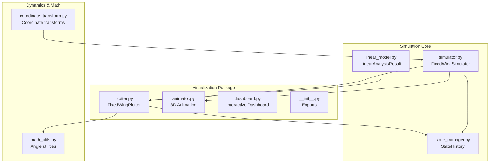
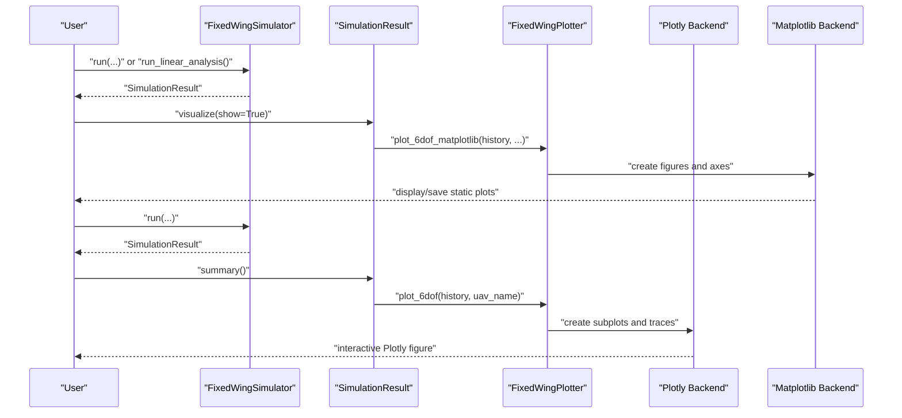
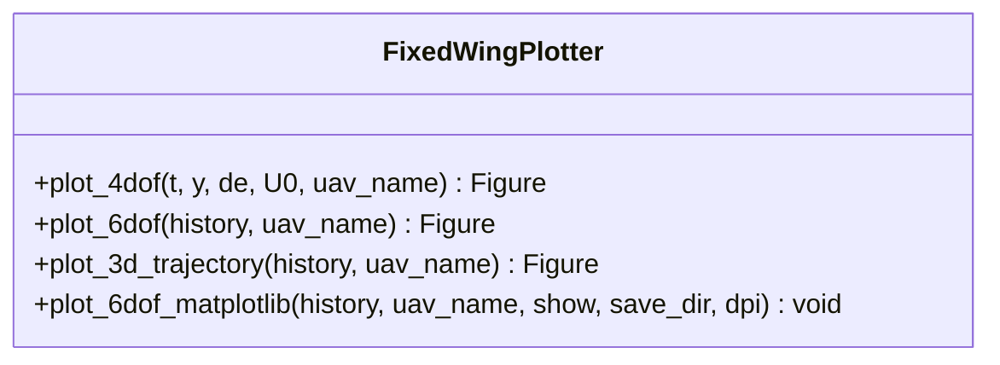
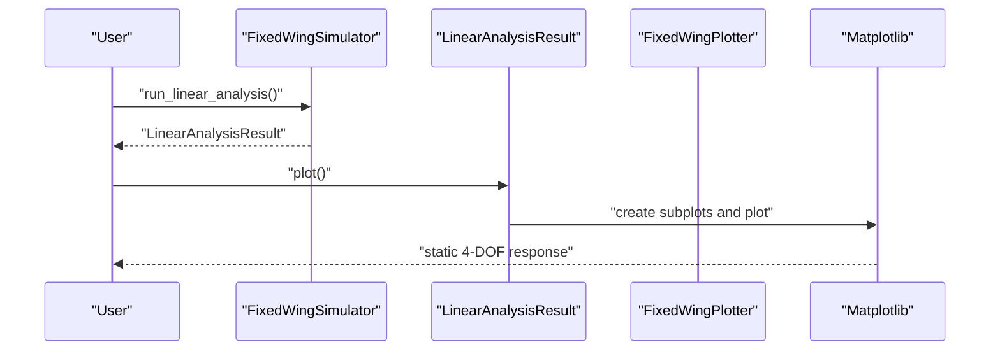
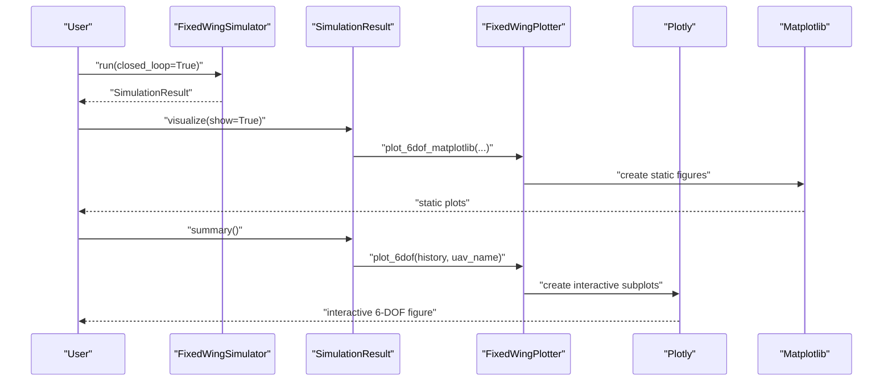
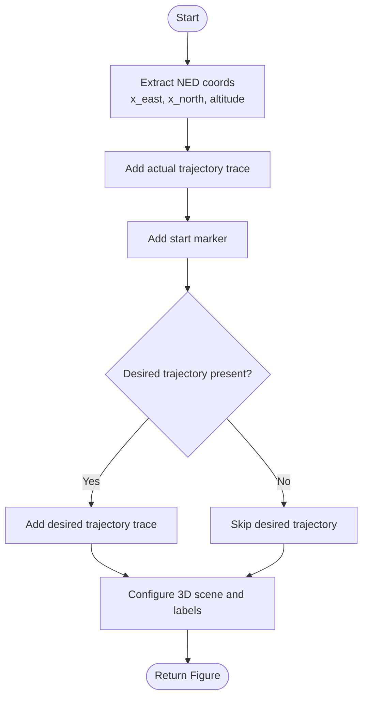
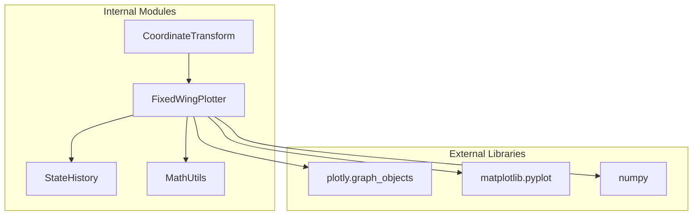

# Plotting System

<cite>
**Referenced Files in This Document**
- [plotter.py](file://src/visualization/plotter.py)
- [__init__.py](file://src/visualization/__init__.py)
- [state_manager.py](file://src/simulation/state_manager.py)
- [simulator.py](file://src/simulation/simulator.py)
- [linear_model.py](file://src/dynamics/linear_model.py)
- [coordinate_transform.py](file://src/dynamics/coordinate_transform.py)
- [math_utils.py](file://src/utils/math_utils.py)
- [main.py](file://main.py)
</cite>

## Table of Contents
1. [Introduction](#introduction)
2. [Project Structure](#project-structure)
3. [Core Components](#core-components)
4. [Architecture Overview](#architecture-overview)
5. [Detailed Component Analysis](#detailed-component-analysis)
6. [Dependency Analysis](#dependency-analysis)
7. [Performance Considerations](#performance-considerations)
8. [Troubleshooting Guide](#troubleshooting-guide)
9. [Conclusion](#conclusion)

## Introduction
This document describes the plotting system component responsible for visualizing fixed-wing simulation results. It focuses on the FixedWingPlotter class and its methods for creating both Plotly interactive visualizations and Matplotlib static plots. The plotting system supports:
- 4-DOF linear model response visualization
- 6-DOF comprehensive simulation results
- 3D NED trajectory plotting
- Standalone static figures via Matplotlib

It documents parameter specifications, return types, usage patterns, coordinate systems, data formatting requirements, and customization options for each plot type. The system provides a dual-mode approach supporting both web-based and desktop visualization.

## Project Structure
The plotting system resides in the visualization package and integrates with the simulation and dynamics modules.

**Diagram sources**
- [plotter.py](file://src/visualization/plotter.py#L1-L244)
- [__init__.py](file://src/visualization/__init__.py#L1-L8)
- [state_manager.py](file://src/simulation/state_manager.py#L95-L193)
- [simulator.py](file://src/simulation/simulator.py#L59-L110)
- [linear_model.py](file://src/dynamics/linear_model.py#L57-L105)
- [coordinate_transform.py](file://src/dynamics/coordinate_transform.py#L1-L70)
- [math_utils.py](file://src/utils/math_utils.py#L1-L124)

**Section sources**
- [plotter.py](file://src/visualization/plotter.py#L1-L244)
- [__init__.py](file://src/visualization/__init__.py#L1-L8)

## Core Components
- FixedWingPlotter: Provides methods to create Plotly and Matplotlib figures from simulation history dictionaries.
- StateHistory: Supplies the dictionary format consumed by FixedWingPlotter.
- SimulationResult: Wraps StateHistory and exposes a convenience visualize method that invokes FixedWingPlotter.
- LinearAnalysisResult: Provides a standalone Matplotlib plot for 4-DOF linear analysis.

Key capabilities:
- Dual-mode plotting: Plotly for web dashboards and Matplotlib for desktop/static figures.
- Consistent data format: All plotting methods consume a dictionary produced by StateHistory.to_dict().
- Coordinate system support: NED (North-East-Down) with Euler angles and derived quantities.

**Section sources**
- [plotter.py](file://src/visualization/plotter.py#L19-L244)
- [state_manager.py](file://src/simulation/state_manager.py#L95-L193)
- [simulator.py](file://src/simulation/simulator.py#L59-L110)
- [linear_model.py](file://src/dynamics/linear_model.py#L57-L105)

## Architecture Overview
The plotting system sits between the simulation core and the visualization backends. It accepts standardized history dictionaries and produces either Plotly figures for web dashboards or Matplotlib figures for desktop applications.

**Diagram sources**
- [simulator.py](file://src/simulation/simulator.py#L92-L109)
- [plotter.py](file://src/visualization/plotter.py#L161-L244)

## Detailed Component Analysis

### FixedWingPlotter Class
FixedWingPlotter provides static methods to produce both Plotly and Matplotlib figures. It operates on a standardized dictionary format produced by StateHistory.to_dict().

**Diagram sources**
- [plotter.py](file://src/visualization/plotter.py#L19-L244)

#### Method Specifications

- plot_4dof
  - Purpose: Create a Plotly figure for 4-DOF linear model response (longitudinal states and elevator input).
  - Parameters:
    - t: time array (seconds)
    - y: state history array of shape (4, N) [u_p, alpha, q, theta]
    - de: elevator input history (radians)
    - U0: trim airspeed (m/s)
    - uav_name: aircraft label for titles
  - Returns: plotly.graph_objects.Figure
  - Notes: States are internally scaled by U0 and converted to degrees where applicable.

- plot_6dof
  - Purpose: Create a Plotly figure for full 6-DOF simulation history.
  - Parameters:
    - history: dict returned by StateHistory.to_dict()
    - uav_name: aircraft label for titles
  - Returns: plotly.graph_objects.Figure
  - Notes: Automatically computes subplot count from available keys and converts angles to degrees.

- plot_3d_trajectory
  - Purpose: Create a 3D NED trajectory plot with optional desired trajectory overlay.
  - Parameters:
    - history: dict containing NED coordinates and optional desired trajectory keys
    - uav_name: aircraft label for titles
  - Returns: plotly.graph_objects.Figure
  - Notes: Uses East/North/Altitude axes; adds a start marker and dashed desired trajectory if present.

- plot_6dof_matplotlib
  - Purpose: Create three static Matplotlib figures (position/velocity, attitude/angular rates, control inputs).
  - Parameters:
    - history: dict returned by StateHistory.to_dict()
    - uav_name: aircraft label for titles
    - show: if True, displays figures; if False, suppresses GUI and closes figures
    - save_dir: optional directory to save PNGs; each figure saved separately
    - dpi: resolution for saved images
  - Returns: None
  - Notes: Creates three subplots per figure window; saves images if save_dir is provided.

**Section sources**
- [plotter.py](file://src/visualization/plotter.py#L23-L154)
- [plotter.py](file://src/visualization/plotter.py#L161-L244)

#### Data Format Requirements
All plotting methods expect a dictionary with the following keys (standardized by StateHistory):

- Time series
  - t: ndarray, time (seconds)
- Body-frame velocities (m/s)
  - u, v, w: ndarray
- Body-frame angular rates (rad/s)
  - p, q, r: ndarray
- Euler angles (rad)
  - phi, theta, psi: ndarray
- NED positions (m)
  - x_north, x_east, x_down: ndarray
- Derived quantities
  - alpha, beta: ndarray (angles)
  - airspeed, altitude: ndarray
- Control surface deflections (rad)
  - elevator, aileron, rudder, throttle: ndarray
- Optional desired trajectory (m)
  - des_north, des_east, des_down: ndarray

Notes:
- Angles are stored in radians internally; FixedWingPlotter converts them to degrees for display.
- Altitude is computed as negative of x_down in NED convention.

**Section sources**
- [state_manager.py](file://src/simulation/state_manager.py#L104-L180)

#### Coordinate Systems and Conventions
- Frame: NED (North-East-Down) body frame with 3-2-1 Euler angles (phi = roll, theta = pitch, psi = yaw).
- Orientation: Positive altitude is upward in NED; Euler angles are in radians.
- Transform utilities: Coordinate transforms and Euler-rate conversions are provided in math utilities.

**Section sources**
- [coordinate_transform.py](file://src/dynamics/coordinate_transform.py#L1-L70)
- [math_utils.py](file://src/utils/math_utils.py#L43-L100)

#### Usage Examples

- Plotly usage (web/dashboard)
  - 4-DOF linear analysis:
    - Obtain LinearAnalysisResult from FixedWingSimulator.run_linear_analysis().
    - Call result.plot() for a standalone Matplotlib plot.
  - 6-DOF simulation:
    - After running FixedWingSimulator.run(), call result.visualize() to display Plotly figures.
    - Alternatively, call FixedWingPlotter.plot_6dof(history_dict, uav_name) directly.

- Matplotlib usage (desktop/static)
  - Call FixedWingPlotter.plot_6dof_matplotlib(history_dict, uav_name, show=True, save_dir="./figures", dpi=150).

- Command-line integration
  - Use main.py with --analysis 4dof or 6dof to run analyses and visualize automatically.

**Section sources**
- [linear_model.py](file://src/dynamics/linear_model.py#L82-L104)
- [simulator.py](file://src/simulation/simulator.py#L92-L109)
- [main.py](file://main.py#L124-L140)

#### Customization Options
- Titles and labels: Customize via uav_name parameter; titles reflect the aircraft name.
- Layout sizing:
  - plot_6dof adjusts height based on number of plotted signals.
  - plot_6dof_matplotlib uses fixed figure sizes and tight layouts.
- Saving static plots: plot_6dof_matplotlib can save figures to disk with configurable DPI.
- Interactive vs static: Choose Plotly for interactivity or Matplotlib for static images.

**Section sources**
- [plotter.py](file://src/visualization/plotter.py#L60-L111)
- [plotter.py](file://src/visualization/plotter.py#L161-L244)

### Plotting Workflows

#### 4-DOF Linear Response Workflow

**Diagram sources**
- [linear_model.py](file://src/dynamics/linear_model.py#L82-L104)

#### 6-DOF Simulation Visualization Workflow

**Diagram sources**
- [simulator.py](file://src/simulation/simulator.py#L92-L109)
- [plotter.py](file://src/visualization/plotter.py#L68-L111)

#### 3D NED Trajectory Workflow

**Diagram sources**
- [plotter.py](file://src/visualization/plotter.py#L114-L154)

## Dependency Analysis
FixedWingPlotter depends on:
- Plotly for interactive figures (plot_4dof, plot_6dof, plot_3d_trajectory)
- Matplotlib for static figures (plot_6dof_matplotlib)
- NumPy for numeric operations and angle conversions
- StateHistory for standardized data format
- Math utilities for angle wrapping and conversions

**Diagram sources**
- [plotter.py](file://src/visualization/plotter.py#L9-L12)
- [state_manager.py](file://src/simulation/state_manager.py#L95-L193)
- [math_utils.py](file://src/utils/math_utils.py#L1-L124)
- [coordinate_transform.py](file://src/dynamics/coordinate_transform.py#L1-L70)

**Section sources**
- [plotter.py](file://src/visualization/plotter.py#L9-L12)
- [state_manager.py](file://src/simulation/state_manager.py#L95-L193)

## Performance Considerations
- Data size: Large histories increase rendering time. Consider trimming histories before plotting using StateHistory.trim().
- Plotly interactivity: Interactive figures can be slower for very long histories; prefer Matplotlib for quick static inspection.
- Static saving: When saving Matplotlib figures, use appropriate DPI and tight layout to reduce file sizes.
- Angle conversions: FixedWingPlotter performs degree conversions; avoid redundant conversions in caller code.

[No sources needed since this section provides general guidance]

## Troubleshooting Guide
- Missing dependencies:
  - Ensure Plotly and Matplotlib are installed for interactive and static plots respectively.
- Empty or incomplete histories:
  - Verify StateHistory.record was called and StateHistory.trim() was invoked to remove unused tail.
- Incorrect units:
  - Confirm angles are in radians internally; FixedWingPlotter converts to degrees for display.
- No figures shown:
  - For Matplotlib, ensure show=True or use a non-GUI backend; for Plotly, ensure the figure is displayed in the notebook/web app.

**Section sources**
- [state_manager.py](file://src/simulation/state_manager.py#L170-L180)
- [plotter.py](file://src/visualization/plotter.py#L161-L244)

## Conclusion
The FixedWingPlotter class provides a unified interface for visualizing fixed-wing simulation results across both web and desktop environments. By standardizing on StateHistory’s dictionary format, it enables seamless integration with the broader simulation framework. Users can choose between interactive Plotly figures for dashboards and static Matplotlib figures for reports and presentations, with consistent coordinate systems and data formatting.