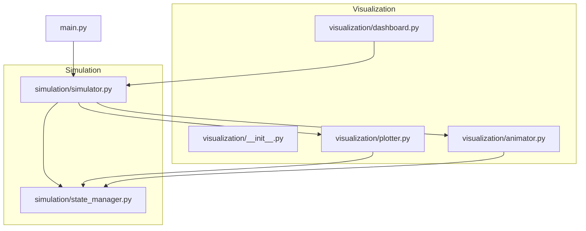
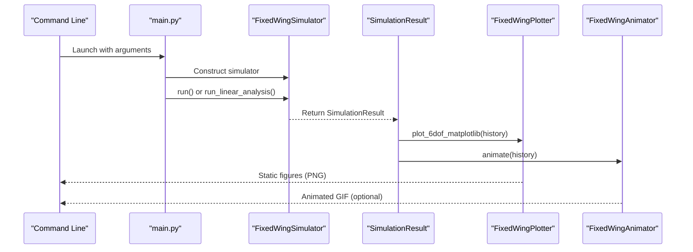
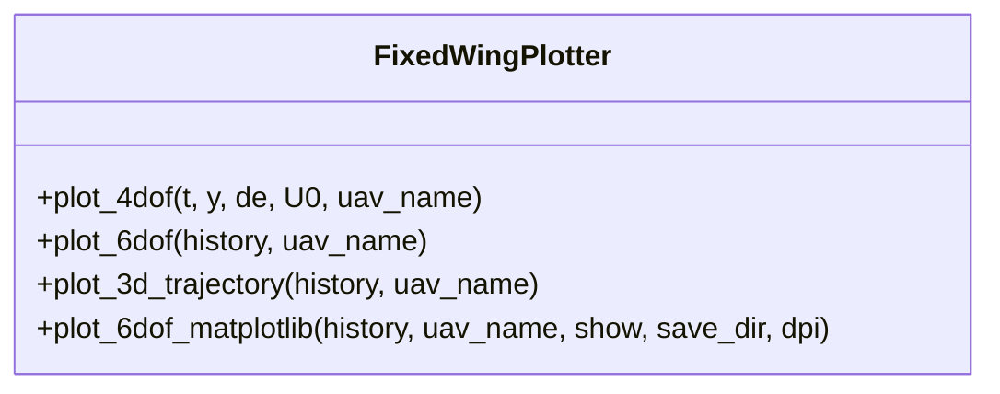
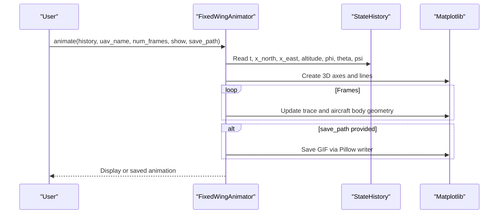
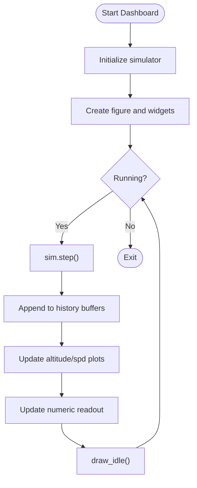
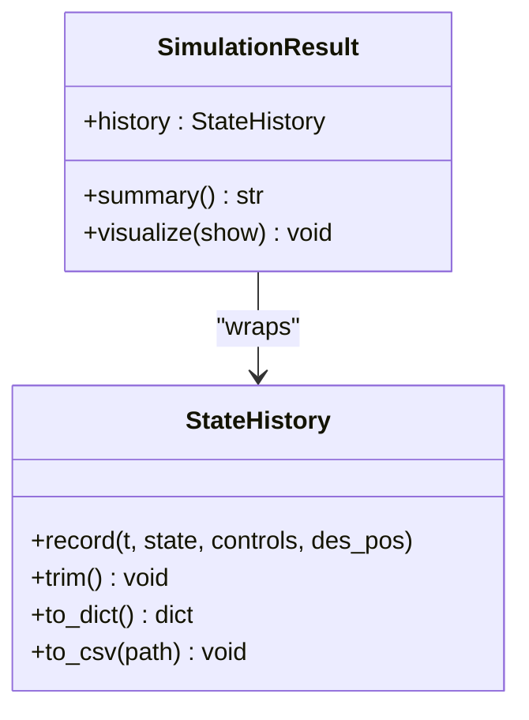
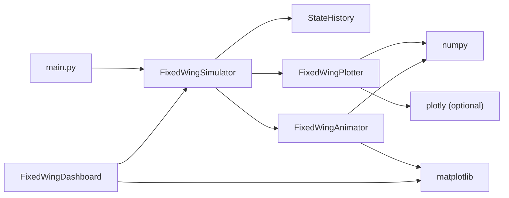

# Visualization and Output

<cite>
**Referenced Files in This Document**
- [src/visualization/__init__.py](file://src/visualization/__init__.py)
- [src/visualization/plotter.py](file://src/visualization/plotter.py)
- [src/visualization/animator.py](file://src/visualization/animator.py)
- [src/visualization/dashboard.py](file://src/visualization/dashboard.py)
- [src/simulation/simulator.py](file://src/simulation/simulator.py)
- [src/simulation/state_manager.py](file://src/simulation/state_manager.py)
- [main.py](file://main.py)
- [config/simulation.yaml](file://config/simulation.yaml)
- [config/control_params.yaml](file://config/control_params.yaml)
</cite>

## Table of Contents
1. [Introduction](#introduction)
2. [Project Structure](#project-structure)
3. [Core Components](#core-components)
4. [Architecture Overview](#architecture-overview)
5. [Detailed Component Analysis](#detailed-component-analysis)
6. [Dependency Analysis](#dependency-analysis)
7. [Performance Considerations](#performance-considerations)
8. [Troubleshooting Guide](#troubleshooting-guide)
9. [Conclusion](#conclusion)
10. [Appendices](#appendices)

## Introduction
This document describes the visualization and output system for the FixedWingSimulator. It explains how static and interactive plots are produced using Matplotlib and Plotly, how animated 3D trajectories are generated for playback, and how a real-time dashboard enables live monitoring and control. It also documents data export capabilities, CSV generation, and how visualization components integrate with simulation results. Finally, it covers performance considerations for large datasets and real-time visualization.

## Project Structure
The visualization system resides under src/visualization and integrates with the simulation engine and state history. The main entry point orchestrates simulations and optional visualization.

**Diagram sources**
- [src/visualization/__init__.py](file://src/visualization/__init__.py#L1-L8)
- [src/visualization/plotter.py](file://src/visualization/plotter.py#L1-L244)
- [src/visualization/animator.py](file://src/visualization/animator.py#L1-L150)
- [src/visualization/dashboard.py](file://src/visualization/dashboard.py#L1-L167)
- [src/simulation/simulator.py](file://src/simulation/simulator.py#L59-L110)
- [src/simulation/state_manager.py](file://src/simulation/state_manager.py#L95-L193)
- [main.py](file://main.py#L98-L141)

**Section sources**
- [src/visualization/__init__.py](file://src/visualization/__init__.py#L1-L8)
- [src/visualization/plotter.py](file://src/visualization/plotter.py#L1-L244)
- [src/visualization/animator.py](file://src/visualization/animator.py#L1-L150)
- [src/visualization/dashboard.py](file://src/visualization/dashboard.py#L1-L167)
- [src/simulation/simulator.py](file://src/simulation/simulator.py#L59-L110)
- [src/simulation/state_manager.py](file://src/simulation/state_manager.py#L95-L193)
- [main.py](file://main.py#L98-L141)

## Core Components
- FixedWingPlotter: Creates both static Matplotlib figures and interactive Plotly figures for time-domain and 3D trajectory visualization.
- FixedWingAnimator: Produces 3D animated trajectories using Matplotlib FuncAnimation, with optional GIF export.
- FixedWingDashboard: Provides a real-time interactive dashboard with controls and live state readouts.
- SimulationResult: Wraps simulation history and exposes a convenient visualize() method to render plots and animations.
- StateHistory: Efficient pre-allocated buffer storing all state and control channels, with CSV export support.

**Section sources**
- [src/visualization/plotter.py](file://src/visualization/plotter.py#L19-L244)
- [src/visualization/animator.py](file://src/visualization/animator.py#L14-L150)
- [src/visualization/dashboard.py](file://src/visualization/dashboard.py#L28-L167)
- [src/simulation/simulator.py](file://src/simulation/simulator.py#L59-L110)
- [src/simulation/state_manager.py](file://src/simulation/state_manager.py#L95-L193)

## Architecture Overview
The visualization pipeline connects simulation results to rendering backends and user interfaces.

**Diagram sources**
- [main.py](file://main.py#L98-L141)
- [src/simulation/simulator.py](file://src/simulation/simulator.py#L239-L567)
- [src/simulation/simulator.py](file://src/simulation/simulator.py#L92-L109)
- [src/visualization/plotter.py](file://src/visualization/plotter.py#L161-L244)
- [src/visualization/animator.py](file://src/visualization/animator.py#L25-L150)

## Detailed Component Analysis

### FixedWingPlotter
- Plotly-based figures:
  - plot_4dof: 3x2 subplot for 4-DOF longitudinal response (forward speed perturbation, angle of attack, pitch rate, pitch angle, elevator input).
  - plot_6dof: Multi-row subplots for full 6-DOF time-domain signals.
  - plot_3d_trajectory: 3D NED trajectory with optional desired trajectory overlay.
- Matplotlib-based figures:
  - plot_6dof_matplotlib: Three figure windows (position/velocity, attitude/angular rates, control inputs) with optional saving and DPI control.

**Diagram sources**
- [src/visualization/plotter.py](file://src/visualization/plotter.py#L19-L244)

**Section sources**
- [src/visualization/plotter.py](file://src/visualization/plotter.py#L23-L154)
- [src/visualization/plotter.py](file://src/visualization/plotter.py#L161-L244)

### FixedWingAnimator
- Creates a 3D animation of the aircraft trajectory with:
  - Actual trajectory trace growing over time.
  - Optional desired trajectory (if present).
  - Waypoints and a simple fixed-wing body representation (fuselage, wings, horizontal tail).
- Uses Matplotlib FuncAnimation with configurable stride (num_frames) and optional GIF export.

**Diagram sources**
- [src/visualization/animator.py](file://src/visualization/animator.py#L25-L150)

**Section sources**
- [src/visualization/animator.py](file://src/visualization/animator.py#L14-L150)

### FixedWingDashboard
- Real-time interactive monitoring with:
  - Altitude and airspeed plots updating live.
  - Numeric state readout (time, altitude, airspeed, attitude, heading, flight mode).
  - Controls: pause/resume, restart, and flight mode radio buttons.
- Integrates with FixedWingSimulator via step-by-step API for live updates.

**Diagram sources**
- [src/visualization/dashboard.py](file://src/visualization/dashboard.py#L59-L111)

**Section sources**
- [src/visualization/dashboard.py](file://src/visualization/dashboard.py#L28-L167)

### SimulationResult and StateHistory Integration
- SimulationResult.visualize() calls FixedWingPlotter and FixedWingAnimator on the simulation history.
- StateHistory stores all state and control channels in pre-allocated NumPy arrays and supports trimming and CSV export.

**Diagram sources**
- [src/simulation/simulator.py](file://src/simulation/simulator.py#L59-L110)
- [src/simulation/state_manager.py](file://src/simulation/state_manager.py#L95-L193)

**Section sources**
- [src/simulation/simulator.py](file://src/simulation/simulator.py#L59-L110)
- [src/simulation/state_manager.py](file://src/simulation/state_manager.py#L124-L193)

## Dependency Analysis
- Visualization depends on NumPy and optional Plotly/Matplotlib backends.
- SimulationResult and animator consume StateHistory dictionaries.
- The main entry point constructs the simulator, runs the simulation, and triggers visualization.

**Diagram sources**
- [main.py](file://main.py#L98-L141)
- [src/simulation/simulator.py](file://src/simulation/simulator.py#L59-L110)
- [src/visualization/plotter.py](file://src/visualization/plotter.py#L39-L40)
- [src/visualization/animator.py](file://src/visualization/animator.py#L44-L46)
- [src/visualization/dashboard.py](file://src/visualization/dashboard.py#L18-L25)

**Section sources**
- [main.py](file://main.py#L98-L141)
- [src/simulation/simulator.py](file://src/simulation/simulator.py#L59-L110)
- [src/visualization/plotter.py](file://src/visualization/plotter.py#L39-L40)
- [src/visualization/animator.py](file://src/visualization/animator.py#L44-L46)
- [src/visualization/dashboard.py](file://src/visualization/dashboard.py#L18-L25)

## Performance Considerations
- Memory management:
  - Pre-allocated arrays in StateHistory reduce reallocations; trim() removes unused tail entries.
- Rendering efficiency:
  - Animator precomputes frame indices and updates only line data (not recreating objects).
  - Matplotlib’s cache_frame_data and non-blocking draw_idle minimize overhead.
- Batch vs. real-time:
  - Use Matplotlib static figures for batch export; use FuncAnimation for real-time dashboards.
- Large datasets:
  - Prefer saving static figures or reduced-resolution animations.
  - Export CSV for external analysis and plotting.

[No sources needed since this section provides general guidance]

## Troubleshooting Guide
- Missing backends:
  - Matplotlib/Plotly import errors indicate missing dependencies; install required packages.
- No display or frozen UI:
  - Ensure an interactive backend is selected for dashboards; use non-interactive backend for batch.
- Animation stutter:
  - Increase num_frames or adjust animation interval; reduce subplot complexity.
- CSV export failures:
  - Verify write permissions and disk space; ensure the directory exists.

**Section sources**
- [src/visualization/dashboard.py](file://src/visualization/dashboard.py#L42-L44)
- [src/visualization/animator.py](file://src/visualization/animator.py#L104-L142)
- [src/simulation/state_manager.py](file://src/simulation/state_manager.py#L182-L193)

## Conclusion
The visualization system provides a cohesive toolkit for analyzing fixed-wing flight dynamics. It supports static and interactive plots, animated 3D trajectories, and real-time dashboards. Its integration with the simulation engine and efficient state history ensures reliable performance for both offline analysis and live monitoring.

[No sources needed since this section summarizes without analyzing specific files]

## Appendices

### Visualization Setup Examples
- Static 6-DOF plots with Matplotlib:
  - Call the Matplotlib plotting method with history dictionary, optional save directory, and DPI.
- Interactive 4-DOF/6-DOF plots with Plotly:
  - Use the Plotly plotting methods to create subplots suitable for embedding in web UIs.
- 3D trajectory animation:
  - Provide history dictionary to the animator; optionally save as GIF.
- Real-time dashboard:
  - Instantiate the dashboard with a simulator and run it to monitor live state and control modes.

**Section sources**
- [src/visualization/plotter.py](file://src/visualization/plotter.py#L161-L244)
- [src/visualization/plotter.py](file://src/visualization/plotter.py#L23-L154)
- [src/visualization/animator.py](file://src/visualization/animator.py#L25-L150)
- [src/visualization/dashboard.py](file://src/visualization/dashboard.py#L59-L111)

### Data Export and CSV Generation
- StateHistory.to_csv(path) exports the entire history to CSV with a header row and one row per recorded timestep.
- Use this for post-run analysis, spreadsheet import, or custom plotting outside the visualization module.

**Section sources**
- [src/simulation/state_manager.py](file://src/simulation/state_manager.py#L182-L193)

### Integration With Simulation Results
- SimulationResult.visualize() automatically renders static plots and animations from the simulation history.
- The main entry point invokes this method unless disabled by command-line flag.

**Section sources**
- [src/simulation/simulator.py](file://src/simulation/simulator.py#L92-L109)
- [main.py](file://main.py#L134-L140)

### Configuration References
- Simulation parameters (time step, duration, wind, initial mode) influence visualization timing and fidelity.
- Control parameters impact closed-loop behavior and thus plotted trajectories.

**Section sources**
- [config/simulation.yaml](file://config/simulation.yaml#L1-L30)
- [config/control_params.yaml](file://config/control_params.yaml#L1-L45)