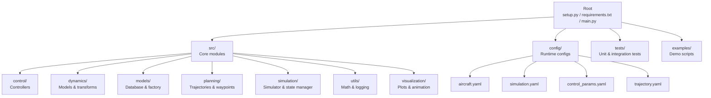
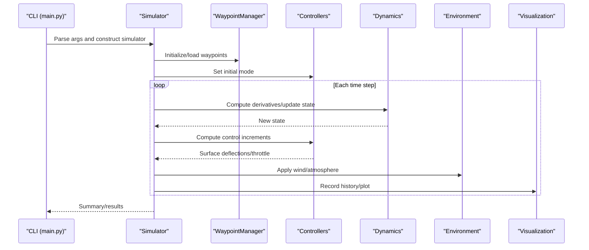
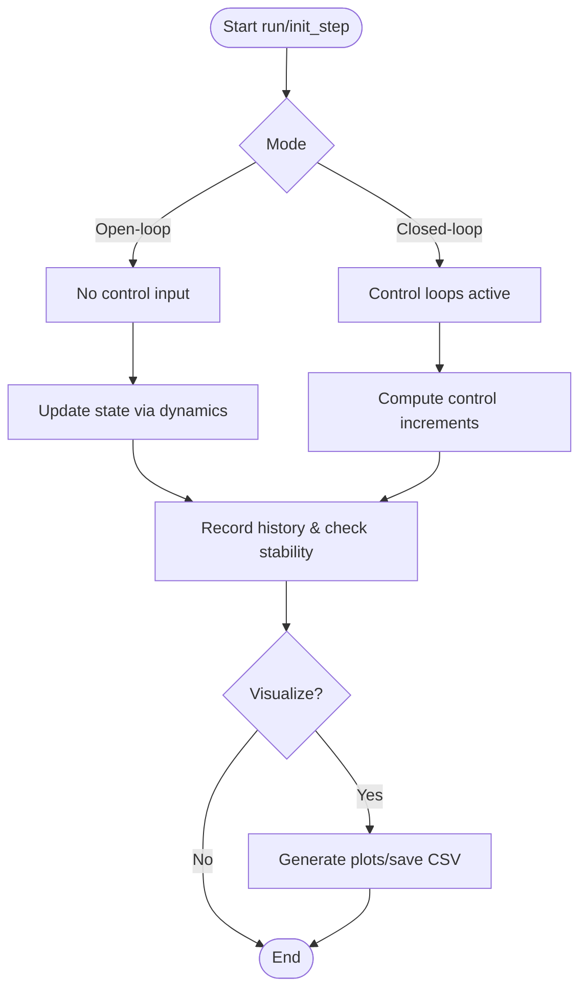
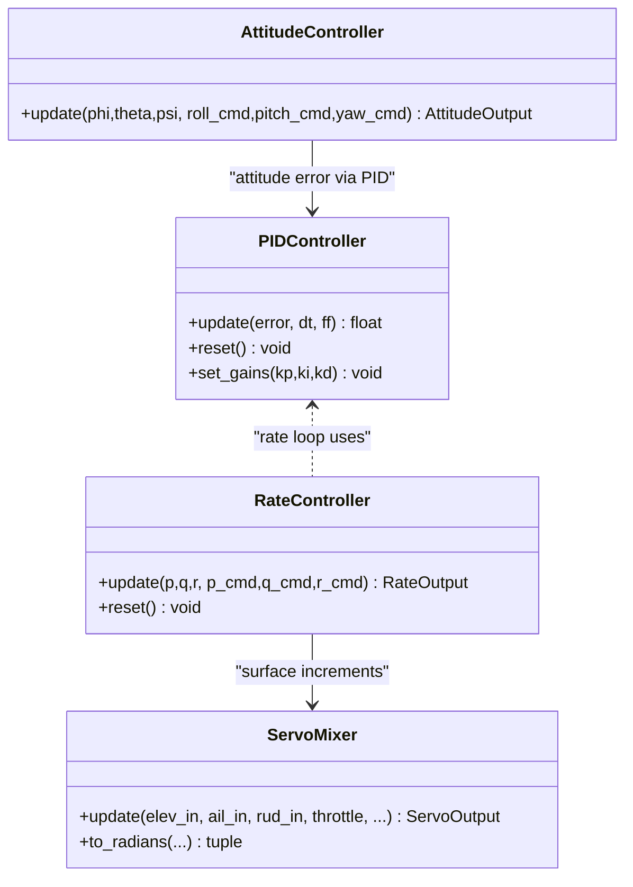
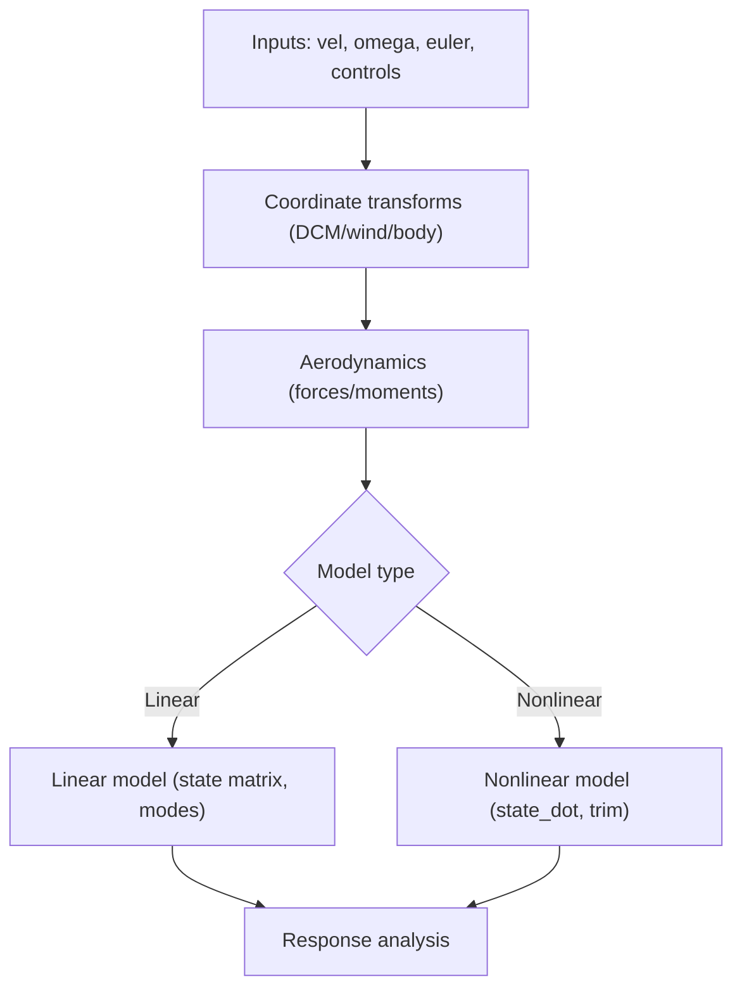
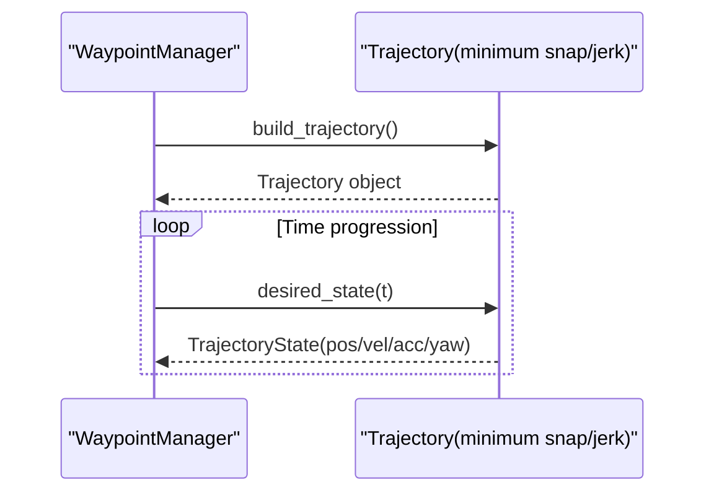
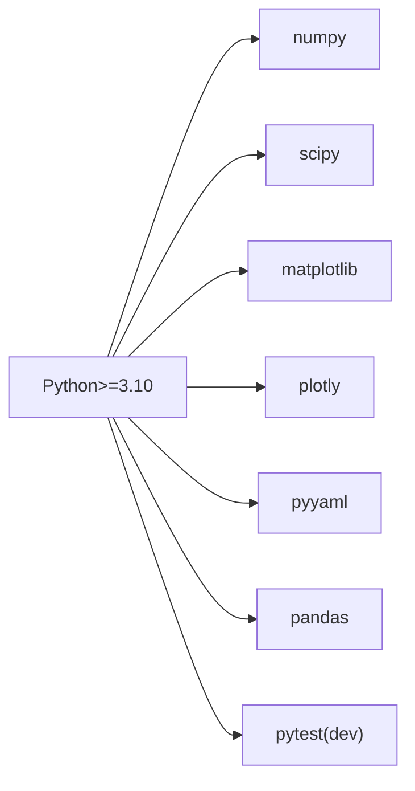

# Contribution Workflow

<cite>
**Referenced Files in This Document**
- [README.md](file://README.md)
- [setup.py](file://setup.py)
- [requirements.txt](file://requirements.txt)
- [main.py](file://main.py)
- [test_integration.py](file://tests/test_integration.py)
- [test_control.py](file://tests/test_control.py)
- [test_dynamics.py](file://tests/test_dynamics.py)
- [test_planning.py](file://tests/test_planning.py)
- [aircraft.yaml](file://config/aircraft.yaml)
- [simulation.yaml](file://config/simulation.yaml)
- [control_params.yaml](file://config/control_params.yaml)
- [trajectory.yaml](file://config/trajectory.yaml)
</cite>

## Table of Contents
1. [Introduction](#introduction)
2. [Project Structure](#project-structure)
3. [Core Components](#core-components)
4. [Architecture Overview](#architecture-overview)
5. [Detailed Component Analysis](#detailed-component-analysis)
6. [Dependency Analysis](#dependency-analysis)
7. [Performance Considerations](#performance-considerations)
8. [Troubleshooting Guide](#troubleshooting-guide)
9. [Conclusion](#conclusion)
10. [Appendices](#appendices)

## Introduction
This document defines the complete contribution workflow for the FixedWingSimulator project. It covers forking and cloning, branching and commit conventions, pull request submission and review, testing requirements, documentation expectations, and release-related practices. It also outlines issue reporting and community interaction standards, and clarifies licensing and contributor agreement considerations.

## Project Structure
The repository is organized around a modular Python package with clear separation of concerns:
- src: core Python package implementing simulation, control, dynamics, planning, environment, models, utils, and visualization
- config: runtime configuration files for aircraft, simulation, control parameters, and trajectories
- tests: unit and integration tests covering control, dynamics, planning, and end-to-end simulation
- examples: demonstration scripts showcasing typical use cases
- root: installation metadata, dependencies, and the main entry point

**Diagram sources**
- [setup.py](file://setup.py#L1-L23)
- [requirements.txt](file://requirements.txt#L1-L8)
- [main.py](file://main.py#L1-L145)

**Section sources**
- [setup.py](file://setup.py#L1-L23)
- [requirements.txt](file://requirements.txt#L1-L8)
- [main.py](file://main.py#L1-L145)

## Core Components
- Main entry point and CLI: parses arguments and orchestrates simulation modes (open-loop, closed-loop, linear analysis), visualization, and result export
- Simulator and state management: coordinates the simulation loop, manages history, and provides summary and visualization APIs
- Control subsystem: PID, attitude/rate controllers, servo mixing, and ArduPilot compatibility
- Dynamics and coordinate transforms: linear/nonlinear models, aerodynamics, and frame transformations
- Planning: minimum snap/jerk trajectories and waypoint management
- Environment: atmospheric and wind modeling
- Utilities and visualization: math helpers, logging, plotting, and animation

**Section sources**
- [main.py](file://main.py#L32-L145)
- [test_integration.py](file://tests/test_integration.py#L1-L391)
- [test_control.py](file://tests/test_control.py#L1-L371)
- [test_dynamics.py](file://tests/test_dynamics.py#L1-L336)
- [test_planning.py](file://tests/test_planning.py#L1-L328)

## Architecture Overview
The end-to-end flow from CLI to simulation and visualization:

**Diagram sources**
- [main.py](file://main.py#L98-L145)
- [test_integration.py](file://tests/test_integration.py#L66-L343)

## Detailed Component Analysis

### Simulation Pipeline and Stability Checks
- The integration tests validate numerical stability across open-loop and closed-loop scenarios, including checks for finite state variables and monotonic time vectors.
- Tests cover multiple aircraft, wind conditions, and trajectory modes to ensure robustness.

**Diagram sources**
- [test_integration.py](file://tests/test_integration.py#L66-L343)

**Section sources**
- [test_integration.py](file://tests/test_integration.py#L1-L391)

### Control Subsystem (PID, Attitude, Rate, Servo Mixer)
- Unit tests validate PID behavior (proportional/integral/derivative, anti-windup, feed-forward), ArduPilot parameter defaults and validation, attitude/ rate controller outputs, and servo mixer limits and conversions.

**Diagram sources**
- [test_control.py](file://tests/test_control.py#L27-L371)

**Section sources**
- [test_control.py](file://tests/test_control.py#L1-L371)

### Dynamics and Coordinate Transforms
- Tests verify coordinate transformation matrices, aerodynamic force calculations, linear/nonlinear model outputs, and numerical stability under varying conditions.

**Diagram sources**
- [test_dynamics.py](file://tests/test_dynamics.py#L29-L336)

**Section sources**
- [test_dynamics.py](file://tests/test_dynamics.py#L1-L336)

### Trajectory Planning and Waypoint Management
- Tests confirm polynomial coefficient shapes, boundary conditions, continuity across segments, and YAML round-trip persistence for waypoints.

**Diagram sources**
- [test_planning.py](file://tests/test_planning.py#L27-L328)

**Section sources**
- [test_planning.py](file://tests/test_planning.py#L1-L328)

## Dependency Analysis
- Python version requirement: >=3.10
- Runtime dependencies: NumPy, SciPy, Matplotlib, Plotly, PyYAML, Pandas
- Development dependencies: pytest
- Package discovery: src is treated as the package root

**Diagram sources**
- [setup.py](file://setup.py#L11-L21)
- [requirements.txt](file://requirements.txt#L1-L8)

**Section sources**
- [setup.py](file://setup.py#L1-L23)
- [requirements.txt](file://requirements.txt#L1-L8)

## Performance Considerations
- Numerical stability: tests enforce finite state bounds and non-negative airspeed
- Time step and integrator: configuration supports real-time vs batch trade-offs
- Wind and trajectory impact: performance and stability depend on wind model and trajectory smoothness
- Visualization and I/O: examples use non-interactive backends to ensure reproducibility in CI

**Section sources**
- [test_integration.py](file://tests/test_integration.py#L41-L58)
- [simulation.yaml](file://config/simulation.yaml#L1-L30)
- [test_integration.py](file://tests/test_integration.py#L265-L269)

## Troubleshooting Guide
- Common issues
  - Numerical divergence: reduce dt, moderate wind, simplify trajectory
  - Configuration errors: verify YAML field names and ranges
  - Import path: ensure running from project root so src is importable
- Regression testing
  - Run pytest against the entire tests suite
  - Validate representative scenarios for control, dynamics, planning, and integration
- Logs and outputs
  - Use example scripts’ CSV and image outputs for offline verification
  - Enable verbose CI logs to reproduce failures

**Section sources**
- [test_integration.py](file://tests/test_integration.py#L66-L343)
- [test_control.py](file://tests/test_control.py#L61-L148)
- [test_dynamics.py](file://tests/test_dynamics.py#L67-L121)
- [test_planning.py](file://tests/test_planning.py#L51-L116)

## Conclusion
This guide consolidates the end-to-end contribution workflow: environment setup, branch and commit discipline, testing, documentation, review, and release practices. Contributors are encouraged to validate changes locally with pytest and example scripts, maintain backward compatibility, and keep configuration and docs synchronized.

## Appendices

### A. Fork and Clone Procedures
- Fork the upstream repository into your personal account
- Clone your fork locally
- Install dependencies in a virtual environment:
  - Development install: pip install -e .
  - Or install dev dependencies: pip install -r requirements.txt
- Verify your environment by running example scripts and pytest

**Section sources**
- [setup.py](file://setup.py#L19-L21)
- [requirements.txt](file://requirements.txt#L1-L8)

### B. Branch Naming Conventions
- Use a descriptive prefix indicating the intent, followed by a concise description:
  - feature/short-description
  - fix/short-description
  - docs/short-description
  - refactor/short-description
- Keep branches focused and avoid mixing unrelated changes

### C. Commit Message Standards
- Separate subject from body with a blank line
- Limit subject line to 50 characters
- Use imperative mood in the subject line
- Wrap body lines to 72 characters
- Reference related issues and PRs in the body when appropriate

### D. Pull Request Process
- Before opening a PR
  - Ensure pytest passes for all relevant tests
  - Run example scripts to validate outputs
  - Confirm code adheres to naming and documentation standards
- PR checklist
  - Clear description of purpose, scope, and outcomes
  - Mention configuration changes and their compatibility
  - Link to related issues
- Review criteria
  - Numerical correctness and stability
  - API compatibility
  - Documentation and examples updated
- Merge requirements
  - Approval from a maintainer
  - CI passing
  - Configuration and examples updated

**Section sources**
- [test_integration.py](file://tests/test_integration.py#L360-L375)
- [test_control.py](file://tests/test_control.py#L1-L371)
- [test_dynamics.py](file://tests/test_dynamics.py#L1-L336)
- [test_planning.py](file://tests/test_planning.py#L1-L328)

### E. Testing Requirements
- Unit tests
  - tests/test_control.py: controllers and ArduPilot compatibility
  - tests/test_dynamics.py: coordinate transforms and aerodynamics
  - tests/test_planning.py: trajectory and waypoint management
- Integration tests
  - tests/test_integration.py: end-to-end stability and API consistency
- Run tests locally with pytest tests/ and ensure all pass

**Section sources**
- [test_control.py](file://tests/test_control.py#L1-L371)
- [test_dynamics.py](file://tests/test_dynamics.py#L1-L336)
- [test_planning.py](file://tests/test_planning.py#L1-L328)
- [test_integration.py](file://tests/test_integration.py#L1-L391)

### F. Documentation Updates Expectations
- Configuration files
  - Include field descriptions and defaults in config/*.yaml
- Example scripts
  - Describe purpose, expected outputs, and save locations
  - Use non-interactive backends for CI reliability
- API documentation
  - Public classes and methods should include docstrings with inputs, outputs, and behavior
  - Provide serialization helpers (e.g., to_dict/to_csv) for state/result containers

**Section sources**
- [aircraft.yaml](file://config/aircraft.yaml#L1-L13)
- [simulation.yaml](file://config/simulation.yaml#L1-L30)
- [control_params.yaml](file://config/control_params.yaml#L1-L45)
- [trajectory.yaml](file://config/trajectory.yaml#L1-L23)

### G. Changelog Maintenance
- Maintain a changelog that records:
  - Added features
  - Bug fixes
  - Breaking changes and migration notes
  - Version bumps and release dates
- Keep entries concise and link to relevant commits or issues

### H. Issue Reporting Guidelines
- Search existing issues before filing a new one
- Provide a clear title and description
- Include minimal reproduction steps, expected vs. actual behavior, and environment details (Python version, OS)
- Attach relevant logs, plots, or CSV outputs when applicable

### I. Feature Request Procedure
- Open a GitHub issue with the “enhancement” label
- Describe the motivation, proposed behavior, and potential impact
- Include example configurations or expected outputs if applicable
- Engage with maintainers during discussion

### J. Community Interaction Standards
- Be respectful and constructive in discussions
- Provide helpful feedback during reviews
- Keep communication focused on technical merits
- Avoid disruptive behavior or off-topic discussions

### K. Licensing and Contributor Agreements
- The project’s license and contributor agreement terms are defined in the repository. Contributors must agree to the project’s licensing terms before submitting changes.
- Ensure third-party code inclusion complies with the project’s license.