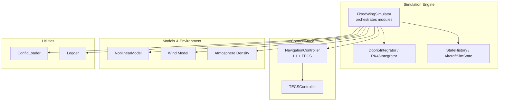
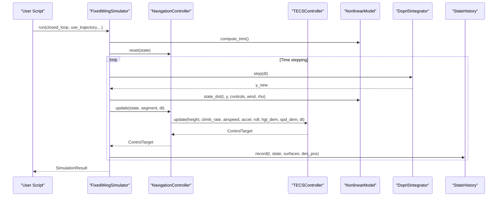
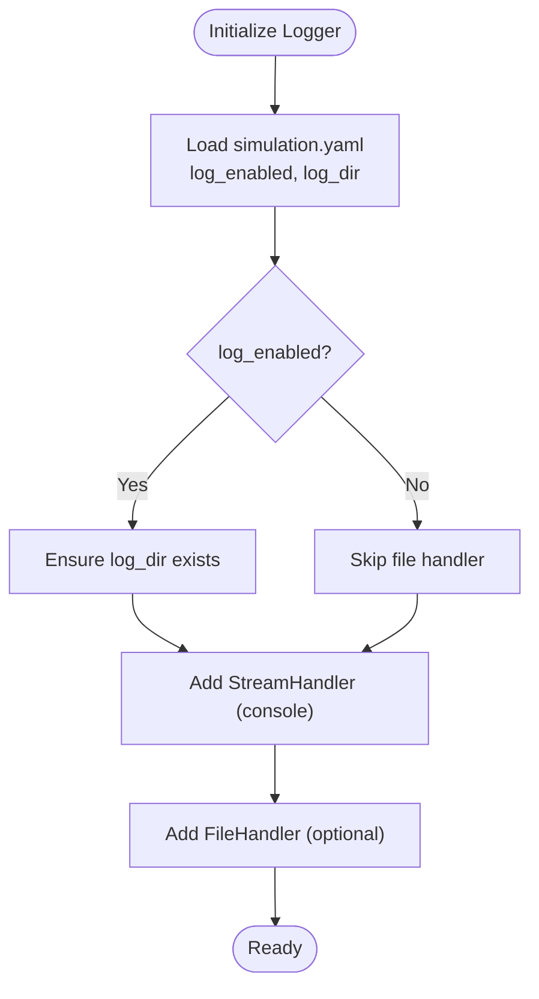
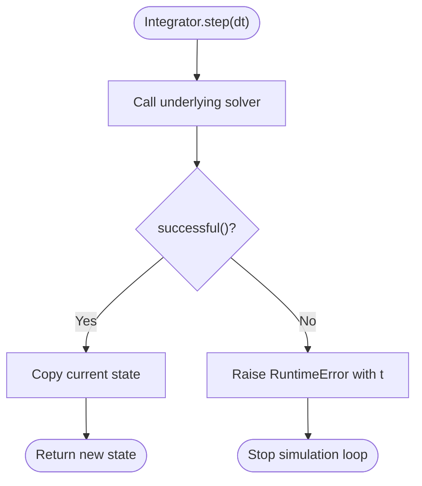
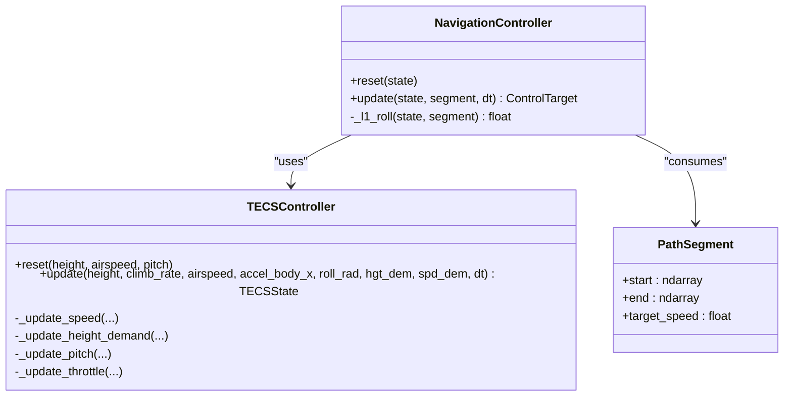
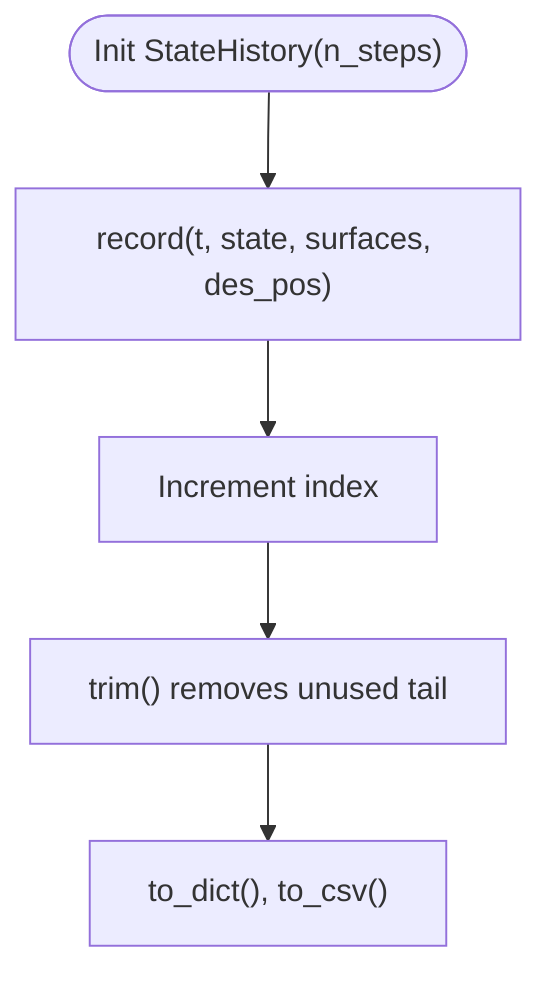
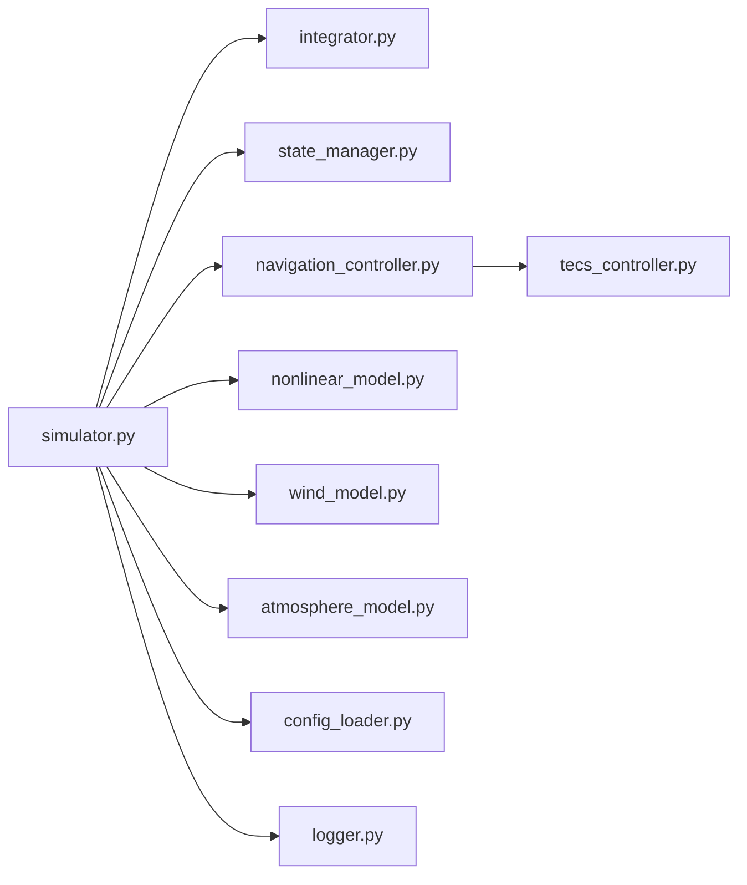

# Debugging and Troubleshooting

<cite>
**Referenced Files in This Document**
- [logger.py](file://src/utils/logger.py)
- [config_loader.py](file://src/utils/config_loader.py)
- [simulation.yaml](file://config/simulation.yaml)
- [control_params.yaml](file://config/control_params.yaml)
- [integrator.py](file://src/simulation/integrator.py)
- [simulator.py](file://src/simulation/simulator.py)
- [state_manager.py](file://src/simulation/state_manager.py)
- [navigation_controller.py](file://src/control/navigation_controller.py)
- [tecs_controller.py](file://src/control/tecs_controller.py)
- [debug_long.py](file://debug_long.py)
- [debug_segment.py](file://debug_segment.py)
- [debug_tecs.py](file://debug_tecs.py)
- [debug_trim.py](file://debug_trim.py)
- [test_integration.py](file://tests/test_integration.py)
- [test_control.py](file://tests/test_control.py)
</cite>

## Table of Contents
1. [Introduction](#introduction)
2. [Project Structure](#project-structure)
3. [Core Components](#core-components)
4. [Architecture Overview](#architecture-overview)
5. [Detailed Component Analysis](#detailed-component-analysis)
6. [Dependency Analysis](#dependency-analysis)
7. [Performance Considerations](#performance-considerations)
8. [Troubleshooting Guide](#troubleshooting-guide)
9. [Conclusion](#conclusion)
10. [Appendices](#appendices)

## Introduction
This document provides a comprehensive debugging and troubleshooting guide for the FixedWingSimulator. It covers systematic debugging approaches, logging strategies, diagnostic procedures for simulation issues, common error patterns and failure modes, and their resolutions. It also details debugging tools usage, breakpoint strategies, state inspection methods, and troubleshooting workflows for numerical integration problems, control system instability, and visualization issues. Finally, it outlines performance profiling techniques, memory leak detection, and system monitoring approaches.

## Project Structure
The simulator is organized around a modular architecture:
- Simulation engine orchestrates aircraft models, dynamics, environment, control layers, planning, and state/history recording.
- Control stack includes L1 navigation and TECS for altitude/airspeed control.
- Utilities provide configuration loading and logging.
- Examples and tests demonstrate diagnostics and validation.

**Diagram sources**
- [simulator.py](file://src/simulation/simulator.py#L115-L642)
- [integrator.py](file://src/simulation/integrator.py#L17-L108)
- [state_manager.py](file://src/simulation/state_manager.py#L16-L193)
- [navigation_controller.py](file://src/control/navigation_controller.py#L45-L293)
- [tecs_controller.py](file://src/control/tecs_controller.py#L50-L647)
- [config_loader.py](file://src/utils/config_loader.py#L59-L82)
- [logger.py](file://src/utils/logger.py#L10-L44)

**Section sources**
- [simulator.py](file://src/simulation/simulator.py#L1-L642)
- [integrator.py](file://src/simulation/integrator.py#L1-L108)
- [state_manager.py](file://src/simulation/state_manager.py#L1-L193)
- [navigation_controller.py](file://src/control/navigation_controller.py#L1-L293)
- [tecs_controller.py](file://src/control/tecs_controller.py#L1-L647)
- [config_loader.py](file://src/utils/config_loader.py#L1-L82)
- [logger.py](file://src/utils/logger.py#L1-L44)

## Core Components
- Logger: Provides unified logging to console and optional file with configurable level and formatting.
- Integrator: Wraps numerical integrators (Dopri5 for real-time, RK45 for batch analysis) with robust error reporting.
- Simulator: Main orchestration class that wires aircraft, environment, control, planning, and state recording.
- State Manager: Efficient history buffer and state dataclass with derived quantities.
- Navigation Controller: Implements L1 lateral guidance and TECS vertical/longitudinal control.
- TECS Controller: ArduPilot-style total energy control with underspeed/bad descent protection and anti-windup.
- Config Loader: Loads and merges YAML configurations for aircraft, simulation, trajectory, and control parameters.
- Tests: Integration and unit tests validating numerical stability, control behavior, and API consistency.

**Section sources**
- [logger.py](file://src/utils/logger.py#L10-L44)
- [integrator.py](file://src/simulation/integrator.py#L17-L108)
- [simulator.py](file://src/simulation/simulator.py#L115-L642)
- [state_manager.py](file://src/simulation/state_manager.py#L16-L193)
- [navigation_controller.py](file://src/control/navigation_controller.py#L45-L293)
- [tecs_controller.py](file://src/control/tecs_controller.py#L50-L647)
- [config_loader.py](file://src/utils/config_loader.py#L59-L82)
- [test_integration.py](file://tests/test_integration.py#L1-L391)
- [test_control.py](file://tests/test_control.py#L1-L371)

## Architecture Overview
The simulation loop integrates the ODE defined by the nonlinear dynamics model, driven by control outputs computed via the navigation controller and TECS. The integrator advances the state, and the state history records time series for post-run analysis and visualization.

**Diagram sources**
- [simulator.py](file://src/simulation/simulator.py#L239-L567)
- [navigation_controller.py](file://src/control/navigation_controller.py#L134-L202)
- [tecs_controller.py](file://src/control/tecs_controller.py#L247-L315)
- [integrator.py](file://src/simulation/integrator.py#L50-L71)
- [state_manager.py](file://src/simulation/state_manager.py#L124-L174)

## Detailed Component Analysis

### Logging and Diagnostics
- Logger: Configure log level and directory; handlers write to console and file. Use per-module loggers for targeted diagnostics.
- Configuration: Enable/disable logging and set log directory via simulation configuration.

**Diagram sources**
- [logger.py](file://src/utils/logger.py#L10-L44)
- [simulation.yaml](file://config/simulation.yaml#L27-L29)

**Section sources**
- [logger.py](file://src/utils/logger.py#L10-L44)
- [config_loader.py](file://src/utils/config_loader.py#L75-L77)
- [simulation.yaml](file://config/simulation.yaml#L27-L29)

### Numerical Integration
- Dopri5Integrator: Real-time step-by-step with adaptive step-size; raises runtime error on failure.
- RK45Integrator: Batch solve_ivp for offline analysis; returns solution object.
- Integration failures: The simulator catches and reports integration errors, stopping the run.

**Diagram sources**
- [integrator.py](file://src/simulation/integrator.py#L50-L56)
- [simulator.py](file://src/simulation/simulator.py#L558-L562)

**Section sources**
- [integrator.py](file://src/simulation/integrator.py#L17-L108)
- [simulator.py](file://src/simulation/simulator.py#L558-L562)

### Control System Stability (TECS and L1)
- TECS: Computes throttle and pitch commands based on specific total/kinetic energy error, with underspeed and bad-descent detection, and anti-windup.
- L1 Navigation: Computes desired roll from look-ahead point guidance along path segments; caps roll and computes yaw command.
- Parameter tuning: TECS parameters are loaded from control parameters YAML; defaults are validated.

**Diagram sources**
- [tecs_controller.py](file://src/control/tecs_controller.py#L50-L647)
- [navigation_controller.py](file://src/control/navigation_controller.py#L45-L293)

**Section sources**
- [tecs_controller.py](file://src/control/tecs_controller.py#L50-L647)
- [navigation_controller.py](file://src/control/navigation_controller.py#L45-L293)
- [control_params.yaml](file://config/control_params.yaml#L30-L45)

### State Recording and History
- StateHistory: Pre-allocated arrays for efficient recording; trims unused tail; exports to dict and CSV.
- AircraftSimState: 12-D state with derived quantities; conversion helpers for arrays and vectors.

**Diagram sources**
- [state_manager.py](file://src/simulation/state_manager.py#L95-L193)

**Section sources**
- [state_manager.py](file://src/simulation/state_manager.py#L16-L193)

### Example Debug Scripts
- Long-run TECS convergence: Monkey-patch navigation controller update to log altitude, speed, throttle, and pitch.
- Segment end inspection: Capture segment.end and compare with current altitude to detect unexpected target altitude behavior.
- TECS detailed logging: Log raw and filtered height demands, throttle, pitch, speed, and STE error.
- Trim calculation: Verify cruise throttle computation against trim conditions.

**Section sources**
- [debug_long.py](file://debug_long.py#L1-L55)
- [debug_segment.py](file://debug_segment.py#L1-L55)
- [debug_tecs.py](file://debug_tecs.py#L1-L67)
- [debug_trim.py](file://debug_trim.py#L1-L43)

## Dependency Analysis
The simulator composes modules with clear boundaries:
- Simulator depends on integrator, dynamics, environment, control layers, planning, and state manager.
- Control layers depend on math utilities and configuration.
- Tests validate integration stability and control correctness.

**Diagram sources**
- [simulator.py](file://src/simulation/simulator.py#L33-L52)
- [navigation_controller.py](file://src/control/navigation_controller.py#L20-L22)
- [tecs_controller.py](file://src/control/tecs_controller.py#L27-L32)
- [config_loader.py](file://src/utils/config_loader.py#L59-L82)
- [logger.py](file://src/utils/logger.py#L10-L44)

**Section sources**
- [simulator.py](file://src/simulation/simulator.py#L33-L52)
- [navigation_controller.py](file://src/control/navigation_controller.py#L20-L22)
- [tecs_controller.py](file://src/control/tecs_controller.py#L27-L32)
- [config_loader.py](file://src/utils/config_loader.py#L59-L82)
- [logger.py](file://src/utils/logger.py#L10-L44)

## Performance Considerations
- Time stepping: Tune dt and integrator type (dopri5 vs rk45) for accuracy vs speed.
- Memory: StateHistory pre-allocates arrays; ensure n_steps matches expected duration to avoid repeated allocations.
- Control updates: Reduce unnecessary recomputation by caching derived quantities where appropriate.
- Visualization: Defer heavy plotting to post-run; export CSV for external analysis.

[No sources needed since this section provides general guidance]

## Troubleshooting Guide

### Systematic Debugging Approaches
- Isolate modules: Run open-loop trim-hold and closed-loop stabilize modes to verify basic stability.
- Instrumentation: Use example debug scripts to monkey-patch control loops and log internal signals.
- Reproduce with minimal configuration: Start with minimal waypoints and fixed wind to eliminate complexity.

**Section sources**
- [test_integration.py](file://tests/test_integration.py#L70-L106)
- [debug_long.py](file://debug_long.py#L16-L25)
- [debug_tecs.py](file://debug_tecs.py#L17-L29)

### Logging Strategies
- Enable file logging via simulation configuration; check logs for integration failures and control warnings.
- Use per-module loggers to filter noise and focus on specific subsystems.

**Section sources**
- [simulation.yaml](file://config/simulation.yaml#L27-L29)
- [logger.py](file://src/utils/logger.py#L10-L44)

### Diagnostic Procedures for Simulation Issues
- Numerical integration problems:
  - Symptom: Runtime error indicating integration failure.
  - Action: Catch and log error; reduce dt; verify control saturation; inspect state derivatives.
- Control system instability:
  - Symptom: Oscillations in altitude/speed; TECS underspeed/bad descent flags.
  - Action: Inspect TECS parameters; adjust damping/gains; verify airspeed estimation; check roll compensation.
- Visualization issues:
  - Symptom: Missing plots or animation errors.
  - Action: Verify optional visualization dependencies; ensure history export succeeds.

**Section sources**
- [simulator.py](file://src/simulation/simulator.py#L558-L562)
- [tecs_controller.py](file://src/control/tecs_controller.py#L432-L444)
- [tecs_controller.py](file://src/control/tecs_controller.py#L635-L646)
- [simulator.py](file://src/simulation/simulator.py#L92-L109)

### Common Error Patterns and Resolutions
- Non-finite states:
  - Pattern: NaN or Inf in altitude, airspeed, or angles.
  - Resolution: Validate control outputs; enforce saturation; check integrator tolerances.
- Overshoot/undershoot:
  - Pattern: Excessive altitude or speed oscillations.
  - Resolution: Adjust TECS time constant and damping; tune L1 period/damping.
- Integration divergence:
  - Pattern: Rapidly growing states or solver failures.
  - Resolution: Decrease dt; tighten tolerances; inspect external forcing (wind).

**Section sources**
- [test_integration.py](file://tests/test_integration.py#L41-L58)
- [tecs_controller.py](file://src/control/tecs_controller.py#L553-L624)

### Debugging Tools and Breakpoint Strategies
- Monkey-patching:
  - Replace control update methods to log internal signals and intermediate values.
- Controlled runs:
  - Use fixed wind and minimal trajectories to isolate control behavior.
- State inspection:
  - Print derived quantities (alpha, beta, airspeed, altitude) from AircraftSimState.

**Section sources**
- [debug_segment.py](file://debug_segment.py#L16-L20)
- [debug_tecs.py](file://debug_tecs.py#L17-L29)
- [state_manager.py](file://src/simulation/state_manager.py#L52-L67)

### Troubleshooting Workflows

#### Numerical Integration Problems
1. Observe integration error message and time.
2. Reduce dt and tighten tolerances.
3. Inspect control saturation and actuator limits.
4. Validate dynamics derivatives at the failure time.

**Section sources**
- [simulator.py](file://src/simulation/simulator.py#L558-L562)
- [integrator.py](file://src/simulation/integrator.py#L50-L56)

#### Control System Instability
1. Monitor TECS flags (underspeed, bad descent).
2. Inspect throttle and pitch commands; verify limits.
3. Adjust TECS parameters (time constant, damping, integral gain).
4. Validate airspeed estimation and acceleration input.

**Section sources**
- [tecs_controller.py](file://src/control/tecs_controller.py#L432-L444)
- [tecs_controller.py](file://src/control/tecs_controller.py#L635-L646)
- [tecs_controller.py](file://src/control/tecs_controller.py#L247-L315)

#### Visualization Issues
1. Confirm optional visualization dependencies are installed.
2. Ensure StateHistory was recorded and exported properly.
3. Re-run with show enabled to diagnose rendering errors.

**Section sources**
- [simulator.py](file://src/simulation/simulator.py#L92-L109)

#### Parameter Configuration Errors
1. Validate control parameters YAML; ensure required keys exist.
2. Use defaults when keys are missing; confirm parameter ranges.
3. Re-run with minimal configuration to confirm fix.

**Section sources**
- [control_params.yaml](file://config/control_params.yaml#L1-L45)
- [config_loader.py](file://src/utils/config_loader.py#L72-L73)

### Performance Profiling and Monitoring
- Profiling:
  - Use Python profiling tools to measure time spent in control updates, integrator steps, and plotting.
- Memory monitoring:
  - Track StateHistory array sizes; ensure trimming is applied.
- System monitoring:
  - Log key metrics (altitude, speed, throttle, pitch) periodically for long runs.

[No sources needed since this section provides general guidance]

## Conclusion
This guide consolidates practical debugging and troubleshooting techniques for the FixedWingSimulator. By leveraging structured logging, controlled instrumentation, and modular diagnostics, most simulation issues can be isolated and resolved efficiently. Adhering to the workflows and best practices outlined here will improve reliability and maintainability of simulations across diverse flight regimes and configurations.

## Appendices

### Quick Reference: Key Files and Responsibilities
- Logger: Unified logging to console and file.
- Integrator: Numerical integration with error reporting.
- Simulator: Orchestration and error handling in the main loop.
- State Manager: Efficient history recording and export.
- Navigation Controller: L1 guidance and TECS integration.
- TECS Controller: Energy-based control with protections.
- Config Loader: YAML loading and merging.
- Tests: Stability and control validation.

**Section sources**
- [logger.py](file://src/utils/logger.py#L10-L44)
- [integrator.py](file://src/simulation/integrator.py#L17-L108)
- [simulator.py](file://src/simulation/simulator.py#L115-L642)
- [state_manager.py](file://src/simulation/state_manager.py#L95-L193)
- [navigation_controller.py](file://src/control/navigation_controller.py#L45-L293)
- [tecs_controller.py](file://src/control/tecs_controller.py#L50-L647)
- [config_loader.py](file://src/utils/config_loader.py#L59-L82)
- [test_integration.py](file://tests/test_integration.py#L1-L391)
- [test_control.py](file://tests/test_control.py#L1-L371)